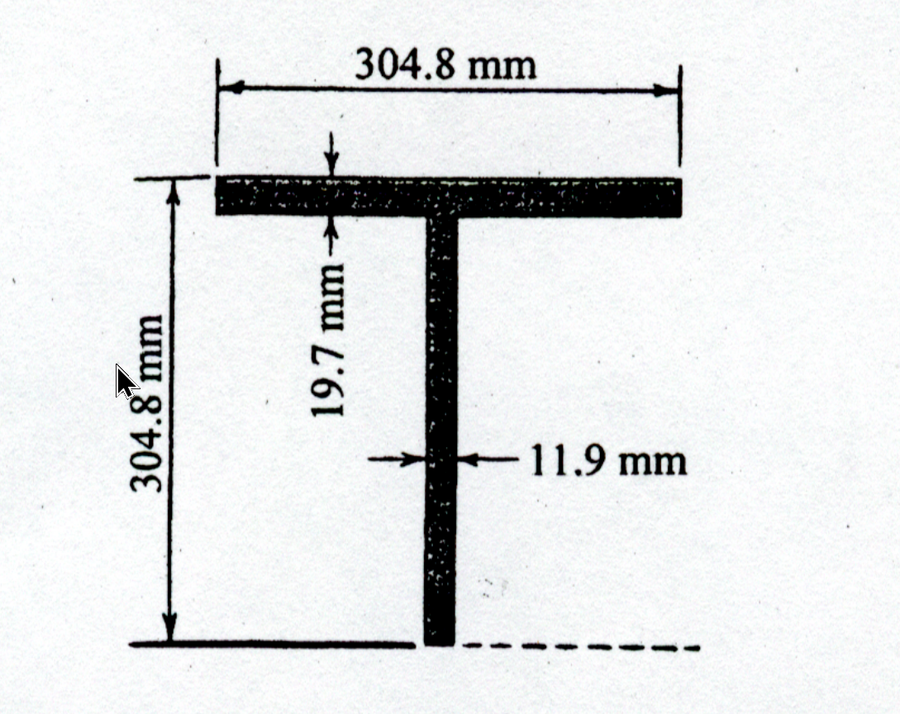

### 考題編號：MM-2002-2

**主分類：** `MM-U2-2` 梁桿件斷面應力計算
**副分類：** `MM-U2-1` 梁桿件內力分析
**分析法：** 彈性分析
**標籤：** `懸臂梁` `彎曲應力` `剪應力` `寬緣剖面` `對稱斷面` `形心` `斷面一次矩`

## 1. 考題原始文字與附圖

二、一懸臂梁，其長度為 2.5 m，支撐於左側，承受 160 kN/m 之均佈荷載。其剖面如下圖所示，其 $I = 1243 \times 10^6 \text{ mm}^4$，$S = 4079 \times 10^3 \text{ mm}^3$。試分別求此梁中之最大正應力與最大剪應力值。（25分）

*圖說：圖示為一對稱斷面之上半部。翼板寬 304.8 mm，厚 19.7 mm；腹板厚 11.9 mm；自頂部邊緣至對稱軸（下緣虛線處）深度為 304.8 mm。*

## 2. 三層掃描分析

### 第一層：外在掃描（目標與已知）
- **目標**：求梁中之最大正應力 $\sigma_{max}$ 與最大剪應力 $\tau_{max}$。
- **已知**：懸臂梁 $L = 2.5\text{ m}$，均佈載重 $q = 160\text{ kN/m}$。斷面參數 $I = 1243 \times 10^6\text{ mm}^4$，$S = 4079 \times 10^3\text{ mm}^3$。
- **幾何觀察**：附圖呈現一個 T 型斷面，但底部以水平虛線截斷。從 $S = I/c$ 可反推極限纖維距離 $c \approx 304.7\text{ mm}$，這恰好等於圖示深度，故圖中虛線為此「寬緣 I 型對稱斷面」的中性軸。

### 第二層：策略掃描（邏輯與陷阱）
- **邏輯**：利用靜力平衡求出固定端之最大剪力 $V_{max}$ 與最大彎矩 $M_{max}$。再代入撓曲應力公式 $\sigma_{max} = M_{max}/S$ 與剪應力公式 $\tau_{max} = V_{max} Q_{NA} / (I t_w)$。
- **陷阱**：圖形容易被誤認為整個斷面為 T 型。若視為 T 型，形心將偏上方，無法對應題目給定的 $I$ 與 $S$ 值（$c$ 會矛盾）。必須正確解讀下緣「虛線」代表斷面對稱軸，實際斷面為總深 $609.6\text{ mm}$ 的 I 型斷面。

### 第三層：內在掃描（核心觀念）
- **核心**：掌握對稱斷面的最大剪應力發生於中性軸。計算斷面一次矩 $Q$ 時，僅需計算中性軸以上區域（即圖示之 T 型區域）對中性軸之面積力矩。

## 3. 解題戰略地圖

1. **內力計算**：判斷最大剪力 $V_{max}$ 與最大彎矩 $M_{max}$ 皆位於懸臂梁之固定端（左端）。
2. **正應力計算**：直接使用給定的斷面模數 $S$，套用 $\sigma_{max} = M_{max}/S$。
3. **剪應力計算**：
   - 計算上半部區域對中性軸之面積一次矩 $Q_{NA}$。
   - 套用 $\tau_{max} = \frac{V_{max} \cdot Q_{NA}}{I \cdot t_w}$，其中 $t_w$ 取中性軸處之腹板厚度。

## 3.5 變數層次分析（Variable Hierarchy Analysis）

> 複習提示：第一次解題後，在每個卡住的知識點旁標記 `⚠`；第二次複習時只看有 `⚠` 的項目。

### 最終目標
求梁中最大正應力 $\sigma_{max}$ 與最大剪應力 $\tau_{max}$。

### 本題關鍵公式（依計算順序）

> $\boxed{\cdot}$ = 需由前步驟推導，非題目直接給定的變數

$$\text{Step 1: } M_{max} = \frac{1}{2} q L^2$$
$$\text{Step 2: } V_{max} = q L$$
$$\text{Step 3: } \sigma_{max} = \frac{\boxed{M_{max}}}{S}$$
$$\text{Step 4: } Q_{NA} = \sum A_i y_i$$
$$\text{Step 5: } \tau_{max} = \frac{\boxed{V_{max}} \cdot \boxed{Q_{NA}}}{I \cdot t_w}$$

### L1：題目直接給定
_看到題目就能讀出的數字，不需要任何公式。_

| 符號 | 數值 | 說明 |
|------|------|------|
| $q$ | $160\text{ kN/m}$ | 均佈載重 |
| $L$ | $2.5\text{ m}$ | 梁長 |
| $I$ | $1243 \times 10^6\text{ mm}^4$ | 慣性矩 |
| $S$ | $4079 \times 10^3\text{ mm}^3$ | 斷面模數 |
| $b_f$ | $304.8\text{ mm}$ | 翼板寬 |
| $t_f$ | $19.7\text{ mm}$ | 翼板厚 |
| $t_w$ | $11.9\text{ mm}$ | 腹板厚 |
| $c$ | $304.8\text{ mm}$ | 中性軸至最外側纖維距離 |

### L2：需知識點推導
_需要知道公式名稱與適用條件，套入 L1 即可算出。_

**Step 1：內力分析**

| 符號 | 公式/來源 | 卡關? |
|------|----------|:-----:|
| $M_{max}$ | $\frac{1}{2} q L^2$（懸臂梁最大彎矩） | |
| $V_{max}$ | $q L$（懸臂梁最大剪力） | |

**Step 2：應力計算**

| 符號 | 公式/來源 | 卡關? |
|------|----------|:-----:|
| $\sigma_{max}$| $M_{max} / S$（彈性撓曲公式） | |
| $Q_{NA}$ | $\sum A_i y_i$（對中性軸之一次矩） | |
| $\tau_{max}$ | $V_{max} Q_{NA} / (I t_w)$（剪應力公式） | |

### L3：深層知識（不懂就卡住）
_L2 中某些公式本身需要背景概念才能正確應用的知識點。_

| 知識點 | 說明 | 卡關? |
|--------|------|:-----:|
| 斷面圖形的正確解讀 | 必須從 $c = I/S \approx 304.8\text{ mm}$ 反推得知，圖示為 I 型梁的一半，虛線即為中性軸。若誤判為 T 型梁將導致 $Q$ 計算全錯。 | |
| $Q_{NA}$ 的取法 | 計算最大剪應力時，面積一次矩 $Q$ 應取中性軸一側（以上或以下）之所有面積。 | |

## 4. 步驟化詳細計算

### 步驟 1：計算最大內力
懸臂梁於固定端處承受最大剪力與最大彎矩：
$$ V_{max} = q \cdot L = 160\text{ kN/m} \times 2.5\text{ m} = 400\text{ kN} $$
$$ M_{max} = \frac{1}{2} q L^2 = \frac{1}{2} \times 160\text{ kN/m} \times (2.5\text{ m})^2 = 500\text{ kN-m} $$

### 步驟 2：計算最大正應力 $\sigma_{max}$
根據彈性撓曲公式，利用已知的斷面模數 $S$：
$$ \sigma_{max} = \frac{M_{max}}{S} $$
將單位轉換為 N 與 mm：
$$ \sigma_{max} = \frac{500 \times 10^6\text{ N-mm}}{4079 \times 10^3\text{ mm}^3} = 122.579\text{ MPa} \approx 122.58\text{ MPa} $$

*(註：固定端頂部纖維承受張應力，底部纖維承受壓應力，兩者數值均為 $122.58\text{ MPa}$。)*

### 步驟 3：計算斷面面積一次矩 $Q_{NA}$
由題意與圖示，最大剪應力發生於中性軸（圖中下緣虛線處）。
將中性軸上方之區域分為翼板（1）與半腹板（2）兩部分：

1. **翼板**：
   - 面積 $A_1 = 304.8\text{ mm} \times 19.7\text{ mm} = 6004.56\text{ mm}^2$
   - 形心距中性軸之距離 $y_1 = 304.8\text{ mm} - \frac{19.7\text{ mm}}{2} = 294.95\text{ mm}$
2. **半腹板**：
   - 高度 $h_w = 304.8\text{ mm} - 19.7\text{ mm} = 285.1\text{ mm}$
   - 面積 $A_2 = 11.9\text{ mm} \times 285.1\text{ mm} = 3392.69\text{ mm}^2$
   - 形心距中性軸之距離 $y_2 = \frac{285.1\text{ mm}}{2} = 142.55\text{ mm}$

計算一次矩 $Q_{NA}$：
$$ Q_{NA} = A_1 y_1 + A_2 y_2 $$
$$ Q_{NA} = (6004.56 \times 294.95) + (3392.69 \times 142.55) $$
$$ Q_{NA} = 1771044.9 + 483627.9 = 2254672.8\text{ mm}^3 $$

### 步驟 4：計算最大剪應力 $\tau_{max}$
$$ \tau_{max} = \frac{V_{max} \cdot Q_{NA}}{I \cdot t_w} $$
$$ \tau_{max} = \frac{400 \times 10^3\text{ N} \times 2254672.8\text{ mm}^3}{1243 \times 10^6\text{ mm}^4 \times 11.9\text{ mm}} $$
$$ \tau_{max} = \frac{901869120}{14791700} = 60.971\text{ MPa} \approx 60.97\text{ MPa} $$

## 5. 檢核與工程意義

1. **幾何自洽性檢核**：
   若不確定圖示是否為全深之一半，可檢驗 $S \times c = I$。
   給定 $S = 4079 \times 10^3$ 與 $I = 1243 \times 10^6$，求得 $c = 304.73 \text{ mm}$，與圖示的 304.8 mm 幾乎一致。這證實了斷面為深度 $609.6\text{ mm}$ 的寬緣型鋼，而非總深度僅 $304.8\text{ mm}$ 的 T 型鋼。
2. **工程常見應力範圍**：
   一般結構鋼材之降伏強度約在 $250\text{ MPa}$ 左右。本題算出的最大彎曲正應力 $122.58\text{ MPa}$ 小於降伏強度，符合彈性設計規範；最大剪應力 $60.97\text{ MPa}$ 也遠小於剪力降伏強度（約 $0.58\sigma_y$），設計合理。
