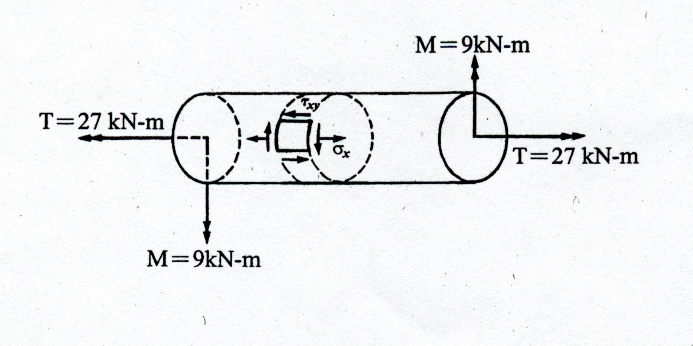

### 考題編號：MM-2002-4

**主分類：** `MM-U1-3` 應力及應變分析原理與應用
**分析法：** 彈性分析
**標籤：** `組合應力` `破壞理論` `最大正應力理論` `莫爾圓` `主應力` `扭轉與彎曲`

## 1. 考題原始文字與附圖

四、一圓管由降伏張應力 340 MPa 材料所製成，其承受外力如下圖所示。試利用最大正應力破裂理論(Maximum Normal Stress Theory)說明，當安全係數為 2 時，此圓管之最小直徑為何？（25分）

*圖說：一圓柱體承受扭矩 $T = 27\text{ kN-m}$ 及彎矩 $M = 9\text{ kN-m}$。圖中亦標示了表面上一微小應力元素受有正應力 $\sigma_x$ 與剪應力 $\tau_{xy}$。*

*(註：本題文字使用「圓管」，但未給定任何管壁厚度或內外徑比例，且附圖之斷面為實心圓形，故以下解答以**實心圓軸 (Solid Circular Shaft)** 進行直徑 $D$ 之計算。)*

## 2. 三層掃描分析

### 第一層：外在掃描（目標與已知）
- **目標**：求出滿足安全係數為 2 時的實心圓軸最小直徑 $D$。
- **已知**：
  - 負載：扭矩 $T = 27\text{ kN-m}$，彎矩 $M = 9\text{ kN-m}$。
  - 材料強度：降伏張應力 $\sigma_y = 340\text{ MPa}$。
  - 安全係數：$FS = 2$。
  - 破壞準則：最大正應力破裂理論（Maximum Normal Stress Theory）。

### 第二層：策略掃描（邏輯與陷阱）
- **邏輯**：首先計算容許應力 $\sigma_{allow} = \sigma_y / FS$。再利用彎曲公式與扭轉公式寫出外力所產生的最大正應力 $\sigma_x$ 與最大剪應力 $\tau_{xy}$（皆為直徑 $D$ 的函數）。接著利用主應力公式（或等效彎矩公式）求出最大主應力 $\sigma_1$。依據最大正應力理論，令 $\sigma_1 = \sigma_{allow}$，即可反求最小直徑 $D$。
- **陷阱**：
  1. 題目字面為「圓管」，但缺乏厚度資訊，直接假設為實心圓軸最符合題意。
  2. $M$ 與 $T$ 的單位為 kN-m，代入公式時需轉換為 N-mm 單位（乘上 $10^6$），否則算出的直徑 $D$ 將會差 10 倍。

### 第三層：內在掃描（核心觀念）
- **核心**：最大正應力破裂理論（Rankine Theory）多適用於脆性材料，其假設當構建體內的**最大主應力**達到材料的單軸降伏或極限強度時即發生破壞。本題重點在於求出承受組合載重（彎曲＋扭轉）下之 $\sigma_1$。

## 3. 解題戰略地圖

1. **決定容許應力**：
   利用降伏應力除以安全係數得到 $\sigma_{allow}$。
2. **寫出應力分量表達式**：
   表面最外層同時承受最大彎曲應力 $\sigma_x = \frac{32M}{\pi D^3}$ 與最大扭轉剪應力 $\tau_{xy} = \frac{16T}{\pi D^3}$。
3. **求最大主應力 $\sigma_1$**：
   代入平面應力之主應力公式：$\sigma_1 = \frac{\sigma_x}{2} + \sqrt{\left(\frac{\sigma_x}{2}\right)^2 + \tau_{xy}^2}$。
4. **套用破壞理論求解**：
   令 $\sigma_1 = \sigma_{allow}$，解出 $D^3$，進而求得最小直徑 $D$。

## 3.5 變數層次分析（Variable Hierarchy Analysis）

> 複習提示：第一次解題後，在每個卡住的知識點旁標記 `⚠`；第二次複習時只看有 `⚠` 的項目。

### 最終目標
求出滿足最大正應力理論的安全最小直徑 $D$。

### 本題關鍵公式（依計算順序）

> $\boxed{\cdot}$ = 需由前步驟推導，非題目直接給定的變數

$$\text{Step 1: } \sigma_{allow} = \frac{\sigma_y}{FS}$$
$$\text{Step 2: } \sigma_1 = \frac{16}{\pi D^3} \left[ M + \sqrt{M^2 + T^2} \right]$$
$$\text{Step 3: } \boxed{\sigma_1} = \boxed{\sigma_{allow}} \implies \text{求解 } D$$

### L1：題目直接給定
_看到題目就能讀出的數字，不需要任何公式。_

| 符號 | 數值 | 說明 |
|------|------|------|
| $\sigma_y$| $340\text{ MPa}$ | 材料降伏強度 |
| $FS$ | $2$ | 安全係數 |
| $M$ | $9\text{ kN-m}$ | 彎矩 |
| $T$ | $27\text{ kN-m}$ | 扭矩 |

### L2：需知識點推導
_需要知道公式名稱與適用條件，套入 L1 即可算出。_

**Step 1：容許應力與主應力表達式**

| 符號 | 公式/來源 | 卡關? |
|------|----------|:-----:|
| $\sigma_{allow}$| $\sigma_y / FS$ | |
| $\sigma_x$ | $32M / (\pi D^3)$（圓柱彎曲應力） | |
| $\tau_{xy}$| $16T / (\pi D^3)$（圓柱扭轉剪應力） | |
| $\sigma_1$ | $\frac{\sigma_x}{2} + \sqrt{(\frac{\sigma_x}{2})^2 + \tau_{xy}^2}$ | |

**Step 2：破壞準則與求解**

| 符號 | 公式/來源 | 卡關? |
|------|----------|:-----:|
| 破壞準則 | 最大正應力理論：$\sigma_1 \le \sigma_{allow}$ | |

### L3：深層知識（不懂就卡住）
_L2 中某些公式本身需要背景概念才能正確應用的知識點。_

| 知識點 | 說明 | 卡關? |
|--------|------|:-----:|
| 最大正應力理論 (Rankine) | 其破壞條件為材料內之最大拉應力 $\sigma_1$ 或最大壓應力 $\sigma_3$ 達到單軸測試之降伏點。本題為受拉彎曲側，故以 $\sigma_1 = \sigma_{allow}$ 檢核。 | |
| 等效彎矩公式化簡 | 對於同時承受彎曲與扭轉的實心圓軸，其最大主應力可化簡為 $\sigma_1 = \frac{32 M_{eq}}{\pi D^3}$，其中等效彎矩 $M_{eq} = \frac{1}{2}(M + \sqrt{M^2 + T^2})$。 | |

## 4. 步驟化詳細計算

### 步驟 1：計算容許應力
依據安全係數 $FS = 2$，材料之容許應力為：
$$ \sigma_{allow} = \frac{\sigma_y}{FS} = \frac{340\text{ MPa}}{2} = 170\text{ MPa} $$

### 步驟 2：圓軸表面之應力分量
假設直徑為 $D$，軸表面極端纖維同時承受最大的彎曲正應力 $\sigma_x$ 與扭轉剪應力 $\tau_{xy}$：
- 彎曲應力：$\sigma_x = \frac{M c}{I} = \frac{M (D/2)}{\pi D^4 / 64} = \frac{32 M}{\pi D^3}$
- 扭轉剪應力：$\tau_{xy} = \frac{T c}{J} = \frac{T (D/2)}{\pi D^4 / 32} = \frac{16 T}{\pi D^3}$

### 步驟 3：最大主應力 $\sigma_1$
利用平面應力轉換公式，軸表面之最大主應力為：
$$ \sigma_1 = \frac{\sigma_x}{2} + \sqrt{\left(\frac{\sigma_x}{2}\right)^2 + \tau_{xy}^2} $$
將 $\sigma_x$ 與 $\tau_{xy}$ 代入：
$$ \sigma_1 = \frac{16 M}{\pi D^3} + \sqrt{\left(\frac{16 M}{\pi D^3}\right)^2 + \left(\frac{16 T}{\pi D^3}\right)^2} $$
提出公因式 $\frac{16}{\pi D^3}$：
$$ \sigma_1 = \frac{16}{\pi D^3} \left( M + \sqrt{M^2 + T^2} \right) $$

### 步驟 4：套用最大正應力破裂理論並求解 $D$
將載重數值代入（注意單位換算為 $\text{N-mm}$）：
- $M = 9 \times 10^6\text{ N-mm}$
- $T = 27 \times 10^6\text{ N-mm}$

計算括號內數值：
$$ M^2 + T^2 = (9 \times 10^6)^2 + (27 \times 10^6)^2 = 81 \times 10^{12} + 729 \times 10^{12} = 810 \times 10^{12} $$
$$ \sqrt{M^2 + T^2} = \sqrt{810} \times 10^6 \approx 28.4605 \times 10^6\text{ N-mm} $$
$$ M + \sqrt{M^2 + T^2} = (9 + 28.4605) \times 10^6 = 37.4605 \times 10^6\text{ N-mm} $$

根據最大正應力理論，令 $\sigma_1 = \sigma_{allow} = 170\text{ MPa} (\text{N/mm}^2)$：
$$ 170 = \frac{16}{\pi D^3} \times 37.4605 \times 10^6 $$
$$ D^3 = \frac{16 \times 37.4605 \times 10^6}{170 \times \pi} = \frac{599.368 \times 10^6}{534.071} = 1,122,263\text{ mm}^3 $$
$$ D = \sqrt[3]{1,122,263} \approx 103.92\text{ mm} $$

## 5. 檢核與工程意義

1. **單位與數量級檢核**：
   若不慎忘記將 kN-m 換算為 N-mm，將會得到 $D^3 \approx 1122\text{ mm}^3 \implies D \approx 10.4\text{ mm}$。對於承受高達 27 kN-m（相當於吊起 2.7 噸重物於 1 米臂長）的鋼軸，直徑僅 1 公分顯然是不合常理的。10.4 公分（104 mm）才是合理的重型傳動軸尺寸。
2. **破壞理論的選擇**：
   鋼材通常為韌性材料，工程實務上設計傳動軸多半會採用**最大剪應力理論 (Tresca)** 或是**最大畸變能理論 (von Mises)**。本題特別指定使用「最大正應力破裂理論 (Rankine)」，通常是測驗考生對於不同理論公式的掌握度，故解題時必須嚴格遵照題目要求，不可自行改用 von Mises 理論。

---

## 互動圖形

[MM-2002-4-mohr-viz.html](MM-2002-4-mohr-viz.html)
