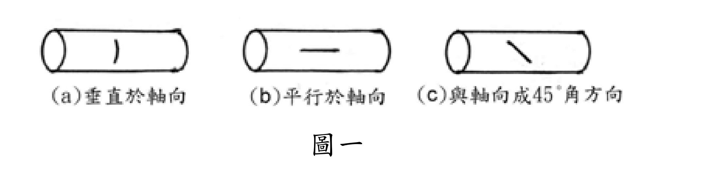

# 考題編號：MM-2003-1

**主分類：** `MM-U1-3` 應力及應變分析原理與應用  
**副分類：** `MM-U2-1` 軸力桿件斷面應力計算（薄壁容器膜應力屬軸向/環向雙軸應力）  
**分析法：** 彈性分析  
**標籤：** `薄壁壓力容器` `環向應力` `軸向應力` `主應力` `爆裂方向` `破壞平面`

---

## 1. 原始題目重述 (Problem Restatement)

將一**圓柱形鞭炮**點燃爆裂，圖一中三條短線段代表三種可能的爆裂裂口方向：

- **(a)** 裂口垂直於軸向（橫向裂縫）
- **(b)** 裂口平行於軸向（縱向裂縫）
- **(c)** 裂口與軸向成 45° 角

問：哪一個圖所示為**最可能的爆裂方向**？請以數學式加以推導證明。（25 分）

*圖說：(a) 裂口垂直於軸向；(b) 裂口平行於軸向（縱向）；(c) 裂口與軸向成 45° 角。短線段代表裂縫方向。*

---

## 2. 考題核心精神與出題者意圖 (Core Concepts & Examiner's Intent)

**核心觀念：** 薄壁圓柱形壓力容器（thin-walled cylindrical pressure vessel）受均勻內壓時，**環向應力（hoop stress）是軸向應力（axial stress）的兩倍**，因此材料沿垂直於環向應力的平面（即縱向平面）斷裂，裂縫呈現**平行於軸向**的走向。

**出題者意圖：**
1. 測驗考生能否將「鞭炮爆裂」這個生活現象正確對應至薄壁壓力容器力學模型
2. 考核環向應力與軸向應力的推導能力（自由體圖法）
3. 辨別「裂縫方向」與「最大主應力方向」的幾何關係：**裂縫垂直於最大主應力**

---

## 3. 解題戰略地圖與陷阱分析 (Strategic Roadmap & Trap Analysis)

**作戰計畫：**
1. 建立薄壁圓柱壓力容器模型（內壓 $p$、半徑 $r$、壁厚 $t$）
2. 用自由體圖分別推導環向應力 $\sigma_h$ 與軸向應力 $\sigma_a$
3. 比較兩者大小，確認最大主應力方向
4. 由「裂縫⊥最大主應力」判斷爆裂方向

**關鍵陷阱：**

| # | 陷阱 | 應對 |
|---|------|------|
| 1 | **混淆應力方向與裂縫方向**：環向應力方向是沿圓周切線，裂縫方向是垂直於此應力，即沿軸線方向 | 記住：**裂縫⊥最大主應力方向** |
| 2 | **誤選 (a)**：誤以為環向應力使圓柱「橫向撐破」產生橫向裂縫；實際上環向應力的破壞平面法線沿圓周，破壞發生在縱向截面 | 作自由體圖時注意截面方向 |
| 3 | **誤選 (c)**：45° 裂縫是最大剪應力平面，但壓力容器破壞主要由最大正應力（環向）控制 | 脆性材料（鞭炮紙）以最大拉應力破壞 |
| 4 | **忽略薄壁假設**：推導需 $r/t \gg 1$（薄壁條件），公式才成立 | 交代假設，得分更完整 |

---

## 3.5 變數層次分析 (Variable Hierarchy Analysis)

> 複習提示：第一次解題後，在每個卡住的知識點旁標記 `⚠`；第二次複習時只看有 `⚠` 的項目。

### 最終目標

判斷三種裂縫方向何者為最可能，並以薄壁壓力容器應力公式數學推導佐證。

### 本題關鍵公式（依計算順序）

$$\text{Step 1（環向FBD）: } \quad 2\sigma_h \cdot t \cdot L = p \cdot 2r \cdot L$$

$$\text{Step 2: } \quad \sigma_h = \frac{pr}{t}$$

$$\text{Step 3（軸向FBD）: } \quad \sigma_a \cdot 2\pi r t = p \cdot \pi r^2$$

$$\text{Step 4: } \quad \sigma_a = \frac{pr}{2t}$$

$$\text{Step 5（比較）: } \quad \frac{\boxed{\sigma_h}}{\boxed{\sigma_a}} = \frac{pr/t}{pr/2t} = 2 \quad \Rightarrow \quad \sigma_h > \sigma_a$$

$$\text{Step 6（結論）: 裂縫} \perp \sigma_h \Rightarrow \text{裂縫平行軸向} \Rightarrow \textbf{選 (b)}$$

### L1：題目直接給定

| 符號 | 數值 | 說明 |
|------|------|------|
| 幾何形狀 | 圓柱體 | 鞭炮建模為薄壁圓柱形壓力容器 |
| $p$ | 未指定數值 | 爆炸產生的均勻內壓 |
| $r$ | 未指定數值 | 圓柱半徑 |
| $t$ | 未指定數值 | 圓柱壁厚（薄壁：$r/t \gg 1$） |
| $L$ | 未指定數值 | 圓柱長度（FBD 切取段長） |
| 三種裂縫方向 | (a)(b)(c) | 見圖一 |

### L2：需知識點推導

**【環向應力 推導】**

| 符號 | 公式／來源 | 卡關? |
|------|-----------|-------|
| $\sigma_h$ | 取縱向半圓 FBD：$2\sigma_h tL = p(2r)L$ → $\sigma_h = pr/t$ | |

**【軸向應力 推導】**

| 符號 | 公式／來源 | 卡關? |
|------|-----------|-------|
| $\sigma_a$ | 取端蓋 FBD：$\sigma_a(2\pi rt) = p(\pi r^2)$ → $\sigma_a = pr/2t$ | |

**【最大主應力判斷與破壞平面】**

| 符號 | 公式／來源 | 卡關? |
|------|-----------|-------|
| 比值 | $\sigma_h / \sigma_a = 2$ → $\sigma_h$ 為最大主應力 | |
| 破壞平面 | 最大拉應力理論：裂縫 $\perp \sigma_{max}$（裂縫法線 ∥ 環向 → 裂縫本身 ∥ 軸向） | |

### L3：深層知識（不懂就卡住）

| 知識點 | 說明 | 卡關? |
|--------|------|-------|
| 薄壁壓力容器的雙軸應力狀態 | 圓柱承受內壓時，壁面元素同時受到環向應力（較大）和軸向應力（較小），兩者皆為主應力（剪應力為零） | |
| 「裂縫方向⊥最大主應力」的幾何意義 | 環向應力作用在縱向截面（截面法線指向圓周方向），破壞此截面 → 截面本身是軸向面 → 裂縫呈軸向走向，即平行軸 | |
| 脆性材料破壞準則 | 鞭炮（紙製）為脆性材料，以**最大正應力理論（Maximum Normal Stress）**破壞，而非最大剪應力理論（45°斷面） | |
| 自由體圖截取方向 | 環向應力：取「縱向切半圓柱」FBD；軸向應力：取「橫向切端蓋」FBD；兩者方向完全不同，要分開做 | |

---

## 4. 步驟化詳細計算過程 (Step-by-Step Detailed Calculation)

### 建立力學模型

圓柱形鞭炮點燃後，內部燃氣產生均勻內壓 $p$。將其視為**薄壁圓柱形壓力容器**，設：
- 內半徑：$r$
- 壁厚：$t$（薄壁條件：$t \ll r$）
- 長度：$L$（分析所取段長）

壁面材料元素處於**雙軸應力狀態**：環向應力 $\sigma_h$ 與軸向應力 $\sigma_a$。

---

### Step 1：推導環向應力 $\sigma_h$（hoop stress）

**截取方式：** 沿軸線方向切取長度 $L$ 的**縱向半圓柱**自由體圖。

**水平方向力平衡（$\sum F_y = 0$）：**

內壓在投影面積（$2r \times L$）上的合力 = 兩切面壁厚所受的拉力：

$$p \cdot (2r \cdot L) = 2 \cdot \sigma_h \cdot t \cdot L$$

$$\boxed{\sigma_h = \frac{pr}{t}}$$

> **策略註解：** 內壓對曲面的合力等於「投影到平面面積 × 壓力」，這是薄壁推導的核心技巧。

---

### Step 2：推導軸向應力 $\sigma_a$（axial stress）

**截取方式：** 沿垂直於軸線方向切取一**端蓋截面**自由體圖（含端部）。

**軸向力平衡（$\sum F_x = 0$）：**

$$p \cdot \pi r^2 = \sigma_a \cdot 2\pi r \cdot t$$

$$\boxed{\sigma_a = \frac{pr}{2t}}$$

---

### Step 3：比較兩應力大小

$$\frac{\sigma_h}{\sigma_a} = \frac{pr/t}{pr/2t} = 2$$

$$\therefore \quad \sigma_h = 2\,\sigma_a$$

**環向應力是軸向應力的 2 倍，是本題的最大主應力。**

---

### Step 4：判斷爆裂裂縫方向

**最大拉應力（Maximum Normal Stress）破壞準則：**

脆性材料的破壞（裂縫）發生在**垂直於最大拉應力的截面**。

- 最大主應力 $\sigma_h$ 作用方向：**環向（circumferential）**，即沿圓周切線方向
- 垂直於環向方向的截面：**含軸線的縱向平面**（軸向截面）
- 因此裂縫法線指向環向 → **裂縫本身平行於軸線**

$$\boxed{\text{最可能的爆裂方向為圖 (b)：裂縫平行於軸向（縱向裂縫）}}$$

---

### Step 5：排除其他選項

| 選項 | 裂縫方向 | 對應截面 | 作用在該截面的最大正應力 | 結論 |
|------|---------|---------|----------------------|------|
| (a) 垂直軸向 | 橫向裂縫 | 橫截面 | $\sigma_a = pr/2t$ | **非最大值，不先破壞** |
| **(b) 平行軸向** | **縱向裂縫** | **縱截面** | $\sigma_h = pr/t$（最大） | ✅ **最先破壞** |
| (c) 與軸向成 45° | 斜向裂縫 | 45° 斜截面 | $\sigma_{45°} = (\sigma_h + \sigma_a)/2 = 3pr/4t$；最大剪應力截面 | 剪切破壞，脆性材料不適用 |

---

## 5. 關鍵爭議點與進階探討 (Critical Issues & Advanced Discussion)

### 爭議點：脆性 vs. 韌性材料的破壞方向

- **脆性材料（如鞭炮紙）**：以最大正應力理論破壞 → 裂縫 ⊥ $\sigma_h$ → **平行軸向（b）**
- **韌性材料（如金屬管）**：以最大剪應力理論（Tresca）破壞 → 裂縫在 45° 剪切帶 → 接近 **(c)**
- **考場安全策略：** 題目說鞭炮（紙製脆性材料），直接選最大正應力準則，不要猶豫

### 實務延伸

真實薄壁壓力容器（如高壓氣瓶、鍋爐筒體）的設計均以 $\sigma_h = pr/t$ 為強度控制條件，因此焊縫通常佈置為**環形焊縫**而非縱向焊縫——正是因為縱向截面受力最大（環向應力），必須避免縱向接縫。

### 常見考場錯誤

考生若誤答 (a)，往往是混淆了「環向應力方向」（沿圓周）與「造成破壞的截面方向」（軸向面）。記住：**應力方向 ≠ 裂縫方向，兩者互相垂直**。

---

## 互動圖形

[MM-2003-1-mohr-viz.html](MM-2003-1-mohr-viz.html)
