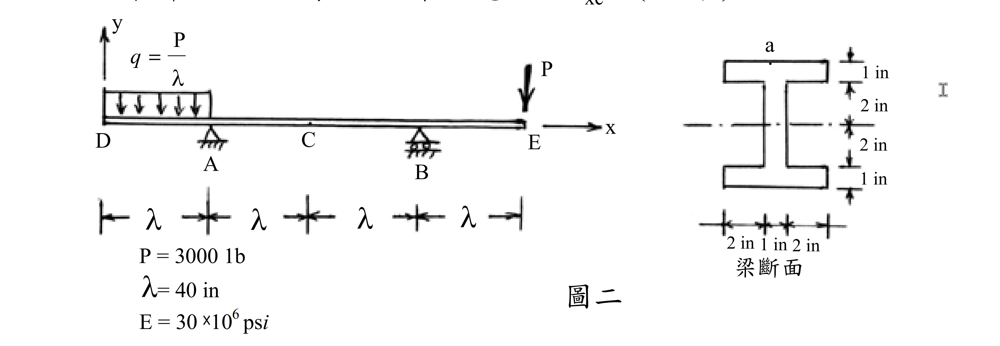

# 考題編號：MM-2003-2

**主分類：** `MM-U2-2` 梁桿件斷面應力計算  
**副分類：** `MM-U1-1` 斷面性質計算  
**分析法：** 彈性分析  
**標籤：** `剪力圖` `彎矩圖` `懸臂梁` `I型斷面` `彎曲應力` `斷面性質` `靜定梁`

---

## 1. 原始題目重述 (Problem Restatement)

如圖二所示均勻斷面梁，支點 A（簡支）在 D 右方距離 $\lambda$，支點 B（簡支）在 A 右方距離 $2\lambda$，自由端 E 在 B 右方距離 $\lambda$。

**載重條件：**
- 均布載重 $q = P/\lambda$（向下），作用於 DA 段（懸臂段）
- 集中載重 $P$（向下），作用於 E 點

**給定數據：**
- $P = 3000\ \text{lb}$，$\lambda = 40\ \text{in}$，$E = 30 \times 10^6\ \text{psi}$
- $q = P/\lambda = 3000/40 = 75\ \text{lb/in}$

**梁斷面：** 對稱 I 型斷面（如圖二右側），點 a 位於斷面 C 之上緣。

**作答要求：**
1. 繪剪力圖（V-dia）及彎矩圖（M-dia）（10 分）
2. 求斷面 C 上緣 a 點之軸向應力 $\sigma_{xc}$（15 分）



*圖說：DA 段承受均布載重 $q = P/\lambda = 75\ \text{lb/in}$（向下）；E 點承受集中載重 $P = 3000\ \text{lb}$（向下）；A（pin）B（roller）各距 $\lambda = 40\ \text{in}$，C 在 AB 中點；I 型斷面：上下翼板各 5 in × 1 in，腹板 1 in × 4 in，總高 6 in。*

---

## 2. 考題核心精神與出題者意圖 (Core Concepts & Examiner's Intent)

**核心觀念：**
1. 雙懸臂靜定梁（兩端均懸挑）的支承反力計算
2. 分段繪製 V 圖與 M 圖（均布載重產生線性 V、拋物線 M）
3. I 型複合斷面慣性矩計算（平行軸定理）
4. 彎曲應力公式 $\sigma = Mc/I$ 的正確應用

**出題者意圖：**
- 考驗對「懸臂端對支承反力方向」的直覺（非典型簡支梁）
- 考核 V 圖、M 圖形狀的正確性：DA 段均布載重使 V 線性、M 拋物線；BE 段集中載重使 M 線性
- 測試考生能否正確判斷 M 的正負號（本題全程為負彎矩/hogging）

---

## 3. 解題戰略地圖與陷阱分析 (Strategic Roadmap & Trap Analysis)

**作戰計畫：**
1. 求支承反力 $R_A$、$R_B$（靜定，取矩法）
2. 分段計算 V(x) 並繪圖
3. 積分 V(x) 得 M(x) 並繪圖
4. 計算 I 型斷面之 $I$（平行軸定理）
5. 代入 $\sigma = M_C \cdot c / I$ 求 $\sigma_{xc}$

**關鍵陷阱：**

| # | 陷阱 | 應對 |
|---|------|------|
| 1 | **D 端懸臂方向的彎矩**：DA 段均布載重使 A 點彎矩為負（hogging），整條梁彎矩全為負 | 從 D 端往右積分，仔細跟蹤符號 |
| 2 | **R_A 方向誤判**：DA 懸臂段的向下載重需要靠 R_A 向上支撐，但 E 端集中載重也會影響 R_A | 取矩時包含兩個外力 |
| 3 | **I 型斷面計算漏算平行軸項**：翼板離中性軸 2.5 in，$Ad^2$ 項不可省略 | 拆分三個矩形，逐一用 $I = I_0 + Ad^2$ |
| 4 | **上緣應力正負號**：M_C 為負（hogging），上緣受拉 → $\sigma_{xc}$ 為正（拉力） | 用物理判斷而非機械套公式 |

---

## 3.5 變數層次分析 (Variable Hierarchy Analysis)

> 複習提示：第一次解題後，在每個卡住的知識點旁標記 `⚠`；第二次複習時只看有 `⚠` 的項目。

### 最終目標

斷面 C 上緣 a 點之軸向應力 $\sigma_{xc}$（兼含 V 圖與 M 圖）。

### 本題關鍵公式（依計算順序）

$$\text{Step 1: } \quad \sum M_A = 0 \;\Rightarrow\; R_B = \frac{P \cdot \frac{\lambda}{2} + P \cdot 3\lambda}{2\lambda}$$

$$\text{Step 2: } \quad \sum F_y = 0 \;\Rightarrow\; R_A = 2P - \boxed{R_B}$$

$$\text{Step 3（DA 段）: } \quad V(x) = -q \cdot x, \quad M(x) = -\frac{q x^2}{2}$$

$$\text{Step 4（A 至 B）: } \quad V = \text{const} = \boxed{R_A} - P, \quad M(x) = M_A + V(x - \lambda)$$

$$\text{Step 5（斷面性質）: } \quad I = \sum \left[\frac{b h^3}{12} + A \cdot d^2\right]$$

$$\text{Step 6（彎曲應力）: } \quad \sigma_{xc} = \frac{|\boxed{M_C}| \cdot c}{\boxed{I}} \quad \text{（M 為 hogging，上緣受拉）}$$

### L1：題目直接給定

| 符號 | 數值 | 說明 |
|------|------|------|
| $P$ | 3000 lb | 集中載重（E 點，向下） |
| $\lambda$ | 40 in | 各段間距 |
| $q$ | $P/\lambda = 75\ \text{lb/in}$ | DA 段均布載重 |
| $E$ | $30 \times 10^6\ \text{psi}$ | 彈性模數（第 3 題用） |
| 斷面 | I 型，5×1 翼板 + 1×4 腹板 | 總高 6 in，對稱 |
| 點 a 位置 | 斷面 C 上緣 | $y_a = +3\ \text{in}$（距中性軸） |

### L2：需知識點推導

**【支承反力】**

| 符號 | 公式／來源 | 卡關? |
|------|-----------|-------|
| $R_B$ | 取矩 A：$R_B \cdot 2\lambda = P \cdot \frac{\lambda}{2} + P \cdot 3\lambda$ → $R_B = 3750\ \text{lb}$ | |
| $R_A$ | $\sum F_y = 0$：$R_A = 2P - R_B = 6000 - 3750 = 2250\ \text{lb}$ | |

**【剪力圖關鍵值】**

| 位置 | 計算 | V 值 |
|------|------|------|
| $D$（x=0） | 自由端 | $0$ |
| $A^-$ | 均布載重累積 | $-P = -3000\ \text{lb}$ |
| $A^+$ | 加 $R_A$ | $-3000 + 2250 = -750\ \text{lb}$ |
| $B^-$ | 無新載重 | $-750\ \text{lb}$ |
| $B^+$ | 加 $R_B$ | $-750 + 3750 = +3000\ \text{lb}$ |
| $E$ | 減 $P$ | $+3000 - 3000 = 0$ ✓ |

**【彎矩關鍵值】**

| 位置 | 計算 | M 值 |
|------|------|------|
| $D$ | 自由端 | $0$ |
| $A$（$x=\lambda$） | 左側取矩 | $-q\lambda^2/2 = -P\lambda/2 = -60{,}000\ \text{lb·in}$ |
| $C$（$x=2\lambda$） | A 往右積分 | $-60{,}000 + (-750)(40) = -90{,}000\ \text{lb·in}$ |
| $B$（$x=3\lambda$） | A 往右積分 | $-60{,}000 + (-750)(80) = -120{,}000\ \text{lb·in}$ |
| $E$ | 自由端 | $0$ ✓ |

**【I 型斷面慣性矩】**

| 元件 | $I_0 = bh^3/12$ | $Ad^2$（$d$ 離 NA） | $I$ |
|------|----------------|---------------------|-----|
| 上翼板（5×1） | $5(1)^3/12 = 0.417\ \text{in}^4$ | $5(1)(2.5)^2 = 31.25\ \text{in}^4$ | $31.67\ \text{in}^4$ |
| 腹板（1×4） | $1(4)^3/12 = 5.33\ \text{in}^4$ | $4(1)(0)^2 = 0$ | $5.33\ \text{in}^4$ |
| 下翼板（5×1） | $0.417\ \text{in}^4$ | $31.25\ \text{in}^4$ | $31.67\ \text{in}^4$ |
| **合計** | | | $\mathbf{68.67\ \text{in}^4}$ |

**【斷面 C 上緣應力】**

| 符號 | 公式／來源 | 卡關? |
|------|-----------|-------|
| $c$ | 上緣至 NA 距離 = $6/2 = 3\ \text{in}$ | |
| $\sigma_{xc}$ | $|M_C| \cdot c / I = 90{,}000 \times 3 / 68.67 = 3{,}932\ \text{psi（拉）}$ | |

### L3：深層知識（不懂就卡住）

| 知識點 | 說明 | 卡關? |
|--------|------|-------|
| 懸臂段的支承反力影響方向 | 左側懸臂 DA 下壓，使 R_A 方向不確定前，務必先取矩確認 | |
| I 型斷面慣性矩（平行軸定理） | 翼板離中性軸遠，$Ad^2$ 項遠大於 $bh^3/12$ → 慣性矩主要由翼板貢獻 | |
| hogging 時上緣受拉 | 負彎矩（梁向上彎）→ 上緣受拉、下緣受壓（與正彎矩相反） | |
| V 圖與 M 圖的積分關係 | $dM/dx = V$：V 為正時 M 遞增；均布載重段 V 線性 → M 拋物線 | |

---

## 4. 步驟化詳細計算過程 (Step-by-Step Detailed Calculation)

### Step 1：建立座標與幾何配置

以 D 為原點，x 軸向右為正：

| 點 | 位置 x | 說明 |
|----|--------|------|
| D | 0 | 自由端（左懸臂端） |
| A | $\lambda = 40\ \text{in}$ | 簡支（pin），反力 $R_A$↑ |
| C | $2\lambda = 80\ \text{in}$ | 目標斷面 |
| B | $3\lambda = 120\ \text{in}$ | 簡支（roller），反力 $R_B$↑ |
| E | $4\lambda = 160\ \text{in}$ | 自由端（右懸臂端），集中載重 $P$↓ |

---

### Step 2：求支承反力

**取矩於 A（$\sum M_A = 0$，逆時針正）：**

| 力 | 大小 | 力臂（至 A） | 力矩 |
|----|------|------------|------|
| UDL 合力 $q\lambda = P$ ↓ | 3000 lb | $\lambda/2 = 20\ \text{in}$（左側） | $+3000 \times 20 = +60{,}000$ |
| 集中載重 $P$ ↓（E 點） | 3000 lb | $3\lambda = 120\ \text{in}$（右側） | $-3000 \times 120 = -360{,}000$ |
| $R_B$ ↑（B 點） | $R_B$ | $2\lambda = 80\ \text{in}$（右側） | $+R_B \times 80$ |

$$60{,}000 - 360{,}000 + 80R_B = 0$$

$$\boxed{R_B = \frac{300{,}000}{80} = 3{,}750\ \text{lb（↑）}}$$

**取垂直力平衡（$\sum F_y = 0$）：**

$$R_A + R_B - P_{\text{UDL}} - P_E = 0$$
$$R_A + 3{,}750 - 3{,}000 - 3{,}000 = 0$$

$$\boxed{R_A = 2{,}250\ \text{lb（↑）}}$$

> **驗算：** $2{,}250 + 3{,}750 = 6{,}000\ \text{lb} = 3{,}000 + 3{,}000$ ✓

---

### Step 3：剪力圖（V-dia）

從 D（x=0）向右積分，規定截面左側向上為正剪力：

**DA 段（$0 \le x \le 40\ \text{in}$，均布載重 $q = 75\ \text{lb/in}$ ↓）：**
$$V(x) = -qx = -75x \quad \text{（線性）}$$
- $V(0) = 0$
- $V(40^-) = -75 \times 40 = -3{,}000\ \text{lb}$

**A 點（$x = 40\ \text{in}$）：** 向上跳 $R_A = 2{,}250\ \text{lb}$
$$V(40^+) = -3{,}000 + 2{,}250 = -750\ \text{lb}$$

**AC 至 CB 段（$40 \le x \le 120\ \text{in}$，無載重）：**
$$V = -750\ \text{lb} \quad \text{（常數）}$$

**B 點（$x = 120\ \text{in}$）：** 向上跳 $R_B = 3{,}750\ \text{lb}$
$$V(120^+) = -750 + 3{,}750 = +3{,}000\ \text{lb}$$

**BE 段（$120 \le x \le 160\ \text{in}$，無載重）：**
$$V = +3{,}000\ \text{lb} \quad \text{（常數）}$$

**E 點（$x = 160\ \text{in}$）：** 向下減 $P = 3{,}000\ \text{lb}$
$$V(160) = +3{,}000 - 3{,}000 = 0 \quad \checkmark$$

```
V (lb)
  0 ─────D                    E─── 0
          \                  /
  -750 ────A────────────────B────────
  -3000 ──(A⁻)           (B⁺)
                                3000
```

*(DA 段線性下降；A→B 段常數 -750；B→E 段常數 +3000)*

---

### Step 4：彎矩圖（M-dia）

對 V(x) 積分（$M = \int V\, dx$），正彎矩為下凸（sagging）：

**DA 段（拋物線）：**
$$M(x) = -\frac{q x^2}{2} = -\frac{75 x^2}{2} \quad (0 \le x \le 40)$$
- $M(0) = 0$（D 為自由端）
- $M(40) = -\dfrac{75 \times 40^2}{2} = -\dfrac{75 \times 1600}{2} = -60{,}000\ \text{lb·in}$

**A 至 B 段（線性，$V = -750\ \text{lb}$）：**
$$M(x) = -60{,}000 + (-750)(x - 40) \quad (40 \le x \le 120)$$

- $M_C = M(80) = -60{,}000 + (-750)(40) = -60{,}000 - 30{,}000 = -90{,}000\ \text{lb·in}$
- $M_B = M(120) = -60{,}000 + (-750)(80) = -60{,}000 - 60{,}000 = -120{,}000\ \text{lb·in}$

**B 至 E 段（線性，$V = +3{,}000\ \text{lb}$）：**
$$M(x) = -120{,}000 + 3{,}000(x - 120) \quad (120 \le x \le 160)$$
- $M(160) = -120{,}000 + 3{,}000 \times 40 = -120{,}000 + 120{,}000 = 0$ ✓

**彎矩圖形狀：**
```
M (lb·in)
  0 D                                    E 0
     ╲  (拋物線)    (線性)        (線性) /
      ──A──────────C──────────────B──────
  -60,000        -90,000      -120,000
```

> 全段彎矩均為**負值（hogging）**，梁彎曲為上凸形態。

---

### Step 5：I 型斷面性質計算

**幾何配置（以底部為基準，NA 在 $\bar{y} = 3\ \text{in}$，由對稱性）：**

| 元件 | $b \times h$ | $A\ (\text{in}^2)$ | 形心 $y_i$ | $d = y_i - 3$ |
|------|-------------|-----------------|------------|---------------|
| 上翼板 | $5 \times 1$ | 5 | 5.5 in | +2.5 in |
| 腹板 | $1 \times 4$ | 4 | 3.0 in | 0 |
| 下翼板 | $5 \times 1$ | 5 | 0.5 in | −2.5 in |

**慣性矩（平行軸定理）：**

$$I = \sum\left(\frac{b h^3}{12} + A d^2\right)$$

$$I_{\text{上翼板}} = \frac{5(1)^3}{12} + 5(2.5)^2 = 0.417 + 31.25 = 31.667\ \text{in}^4$$

$$I_{\text{腹板}} = \frac{1(4)^3}{12} + 4(0)^2 = 5.333\ \text{in}^4$$

$$I_{\text{下翼板}} = \frac{5(1)^3}{12} + 5(2.5)^2 = 31.667\ \text{in}^4$$

$$\boxed{I = 31.667 + 5.333 + 31.667 = \frac{206}{3} \approx 68.67\ \text{in}^4}$$

> **策略註解：** 翼板的 $Ad^2 = 31.25\ \text{in}^4$ 遠大於自身 $bh^3/12 = 0.417\ \text{in}^4$，這是 I 型斷面設計高效的原因。

---

### Step 6：求斷面 C 上緣 a 點之軸向應力 $\sigma_{xc}$

**已知：**
- $M_C = -90{,}000\ \text{lb·in}$（負彎矩，hogging）
- 點 a 在上緣：$c = 6 - 3 = 3\ \text{in}$（在 NA 上方）
- $I = 206/3\ \text{in}^4$

**物理判斷（符號）：**
負彎矩（hogging）→ 梁上方受拉，下方受壓 → 點 a（上緣）受**拉**。

**計算：**

$$\sigma_{xc} = \frac{|M_C| \cdot c}{I} = \frac{90{,}000 \times 3}{206/3} = \frac{90{,}000 \times 9}{206} = \frac{810{,}000}{206}$$

$$\boxed{\sigma_{xc} \approx 3{,}932\ \text{psi（拉力）}}$$

> **策略註解：** 上緣點 a 的剪應力 $\tau = VQ/(Ib) = 0$（極外纖維 Q=0），故軸向應力即為全部正應力。

---

## 5. 關鍵爭議點與進階探討 (Critical Issues & Advanced Discussion)

### 爭議點：全梁負彎矩是否合理？

本題梁的彎矩全程為負（hogging），和一般印象中「簡支梁中間正彎矩」不同。原因是：
- 左懸臂 DA 承受均布載重，在 A 處造成 $-60{,}000\ \text{lb·in}$ 的負彎矩
- 右懸臂 E 端集中載重在 B 處造成更大的 $-120{,}000\ \text{lb·in}$ 負彎矩
- 由 A 到 B 段，負彎矩隨著 hogging 效應累積，沒有正彎矩出現

若兩個懸臂段的合力矩恰好平衡，AB 中段才會出現正彎矩區域。本題兩側彎矩疊加均為負，這是正確且合理的。

### 考場安全策略

1. **驗算：** M(E) = 0、M(D) = 0（兩端自由）是天然驗算條件
2. **剪力圖封閉：** $\sum V = 0$ 是必須的最後確認
3. **上下緣應力正負：** 對於 hogging，一定是「上緣拉、下緣壓」，可快速口訣記憶：*上拉下壓換方向*（相對於正彎矩）

### 進階延伸

斷面 C 處除了上緣點 a，若要求中性軸處的最大剪應力，需計算 $Q_{NA}$：
$$Q_{NA} = A_{\text{上翼板}} \times d_{\text{上翼板}} + A_{\text{上半腹板}} \times d_{\text{上半腹板}}$$
$$= 5 \times 2.5 + (1 \times 2) \times 1 = 12.5 + 2 = 14.5\ \text{in}^3$$
$$\tau_{NA} = \frac{VQ}{Ib} = \frac{750 \times 14.5}{68.67 \times 1} \approx 158\ \text{psi}$$

（此部分非本題要求，供參考）
