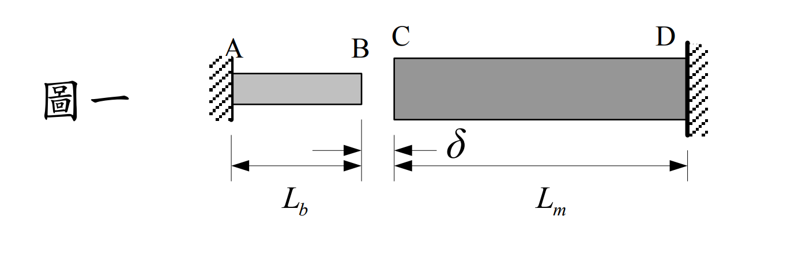

### 考題編號：MM-2004-1

**主分類：** `MM-U3-1` 軸力桿件變位及內力分析
**副分類：** `MM-U2-1` 軸力桿件斷面應力計算
**分析法：** 彈性分析
**標籤：** `溫度應力` `預留間隙` `靜不定軸力` `分段變形` `溫度效應` `變形諧和` `雙材料桿`

---

## 1. 題目

如圖一所示，AB 桿與 CD 桿同軸串聯，兩端固定於剛性牆（A 端與 D 端），兩桿材料性質如下：

|       | 膨脹係數 | 截面積 | 長度 | 楊氏模數 |
|-------|---------|-------|-----|---------|
| AB 桿 | $\alpha_b$ | $A_b$ | $L_b$ | $E_b$ |
| CD 桿 | $\alpha_m$ | $A_m$ | $L_m$ | $E_m$ |

室溫時兩桿間有空隙 $\delta$。

**(一)** 溫度由室溫增加 $\Delta T_0$ 時，兩桿產生接觸（無擠壓），求 $\Delta T_0$。（5 分）

**(二)** 溫度由室溫增加 $\Delta T$（$\Delta T > \Delta T_0$）時，AB 桿與 CD 桿之應力 $\sigma_{AB}$、$\sigma_{CD}$ 各為何？（15 分）

**(三)** 溫度由室溫增加 $\Delta T$（$\Delta T > \Delta T_0$）時，AB 桿之變形量 $\delta_{AB}$ 為何？（5 分）

---

## 2. 題目附圖

*圖說：兩桿同軸水平排列。AB 桿左端 A 固定於左側剛性牆，右端 B 為自由端。CD 桿左端 C 為自由端，右端 D 固定於右側剛性牆。B、C 之間的室溫空隙為 $\delta$（$B$ 到 $C$ 的距離）。升溫後兩桿各向中間膨脹，當膨脹量之和達到 $\delta$ 時開始接觸。*

---

## 3. 解題戰略地圖

**三層掃描：**

| 層次 | 內容 |
|------|------|
| **[目標]** | 求接觸臨界溫差 $\Delta T_0$（一）；有擠壓後的兩桿應力（二）；AB 桿實際變形量（三） |
| **[已知]** | $\alpha_b, A_b, L_b, E_b$；$\alpha_m, A_m, L_m, E_m$；空隙 $\delta$；溫差 $\Delta T$ |
| **[待算]** | 接觸力 $P$（由諧和條件求出）→ 各桿應力 $\sigma = -P/A$ → $\delta_{AB}$ |

**力學框架：**
- $\Delta T \le \Delta T_0$：兩桿自由膨脹（靜定），無應力
- $\Delta T > \Delta T_0$：兩桿互相擠壓（靜不定一次），用「平衡 + 諧和 + 組成律」三步解

**陷阱：**
1. 諧和條件是「兩桿實際變形量之和 = 空隙 $\delta$」，非各自回到牆面的條件
2. 接觸力 $P$ 對兩桿均為**壓縮**，應力皆為負（壓縮）
3. AB 桿變形量 $\delta_{AB}$ ≠ 空隙 $\delta$（AB 只填補了部分空隙）

---

## 3.5 變數層次分析（Variable Hierarchy Analysis）

> 複習提示：第一次解題後，在每個卡住的知識點旁標記 `⚠`；第二次複習時只看有 `⚠` 的項目。

### 最終目標
求 `ΔT₀`；以及 `ΔT > ΔT₀` 時的 `σ_AB`、`σ_CD`、`δ_AB`

### 本題關鍵公式（依計算順序）

$$\text{Step 1（臨界條件）: } \alpha_b L_b \Delta T_0 + \alpha_m L_m \Delta T_0 = \delta$$

$$\text{Step 2（諧和）: } (\alpha_b L_b + \alpha_m L_m)\Delta T - \boxed{P}\left(\frac{L_b}{A_b E_b} + \frac{L_m}{A_m E_m}\right) = \delta$$

$$\text{Step 3（應力）: } \sigma_{AB} = -\frac{\boxed{P}}{A_b},\quad \sigma_{CD} = -\frac{\boxed{P}}{A_m}$$

$$\text{Step 4（變形）: } \delta_{AB} = \alpha_b L_b \Delta T - \frac{\boxed{P} L_b}{A_b E_b}$$

### L1：題目直接給定

| 符號 | 說明 |
|------|------|
| $\alpha_b, \alpha_m$ | 各桿熱膨脹係數 |
| $A_b, A_m$ | 各桿截面積 |
| $L_b, L_m$ | 各桿長度 |
| $E_b, E_m$ | 各桿楊氏模數 |
| $\delta$ | 初始空隙 |
| $\Delta T$ | 溫升量 |

### L2：需知識點推導

**Step 1：臨界條件（兩桿自由膨脹之和 = 空隙）**

| 符號 | 公式/來源 | 卡關? |
|------|----------|:-----:|
| $\delta_{b,free}$ | $\alpha_b L_b \Delta T_0$（熱膨脹公式） | |
| $\delta_{m,free}$ | $\alpha_m L_m \Delta T_0$（熱膨脹公式） | |
| $\Delta T_0$ | 由 $\delta_{b,free} + \delta_{m,free} = \delta$ 求解 | |

**Step 2：接觸力（諧和條件 + 組成律）**

| 符號 | 公式/來源 | 卡關? |
|------|----------|:-----:|
| $\delta_{AB,actual}$ | $\alpha_b L_b \Delta T - P L_b/(A_b E_b)$（熱膨脹扣除彈性壓縮） | |
| $\delta_{CD,actual}$ | $\alpha_m L_m \Delta T - P L_m/(A_m E_m)$ | |
| 諧和條件 | $\delta_{AB,actual} + \delta_{CD,actual} = \delta$ | |
| $P$ | 由諧和條件求解接觸壓力 | |

**Step 3：應力**

| 符號 | 公式/來源 | 卡關? |
|------|----------|:-----:|
| $\sigma_{AB}$ | $-P/A_b$（壓縮，負號） | |
| $\sigma_{CD}$ | $-P/A_m$（壓縮，負號） | |

**Step 4：AB 桿變形量**

| 符號 | 公式/來源 | 卡關? |
|------|----------|:-----:|
| $\delta_{AB}$ | $\alpha_b L_b \Delta T - P L_b/(A_b E_b)$ | |

### L3：深層知識（不懂就卡住）

| 知識點 | 說明 | 卡關? |
|--------|------|:-----:|
| 諧和條件的寫法 | 兩桿實際膨脹量之和等於空隙 $\delta$（非零）；若兩端均固定且無空隙，諧和為「兩者變形和 = 0」 | |
| 靜不定軸力系統 | 一個未知內力 $P$，一個平衡式（兩桿所受壓力相等）+ 一個諧和條件，剛好可解 | |
| 熱應力的本質 | 溫度本身不產生應力，是「自由膨脹被約束」才產生應力；有空隙時，空隙被填滿前無應力 | |

---

## 4. 步驟化詳細計算

### 小題（一）：求 $\Delta T_0$

**物理意義：** 兩桿各自自由膨脹（無約束力），當膨脹量之和恰好等於空隙 $\delta$ 時，兩桿剛好接觸但無壓力。

**AB 桿自由膨脹量：**
$$\delta_{b,free} = \alpha_b L_b \Delta T_0$$

**CD 桿自由膨脹量：**
$$\delta_{m,free} = \alpha_m L_m \Delta T_0$$

**臨界條件（兩桿膨脹量之和 = 空隙）：**
$$\delta_{b,free} + \delta_{m,free} = \delta$$
$$\alpha_b L_b \Delta T_0 + \alpha_m L_m \Delta T_0 = \delta$$

$$\boxed{\Delta T_0 = \frac{\delta}{\alpha_b L_b + \alpha_m L_m}}$$

---

### 小題（二）：求 $\sigma_{AB}$、$\sigma_{CD}$（當 $\Delta T > \Delta T_0$）

**系統分析：**

$\Delta T > \Delta T_0$ 後，BC 界面產生接觸壓力 $P$（均為壓縮力）。

- AB 桿：受 $P$ 壓縮（$P$ 由 C 端作用於 B 端）
- CD 桿：受 $P$ 壓縮（$P$ 由 B 端作用於 C 端）

由作用反作用，兩桿受力大小相同，均為 $P$。

**各桿實際變形量（溫度膨脹 − 彈性壓縮）：**

$$\delta_{AB} = \alpha_b L_b \Delta T - \frac{P L_b}{A_b E_b}$$

$$\delta_{CD} = \alpha_m L_m \Delta T - \frac{P L_m}{A_m E_m}$$

**幾何諧和條件（兩桿向中間膨脹之和等於空隙）：**

$$\delta_{AB} + \delta_{CD} = \delta$$

$$\left(\alpha_b L_b \Delta T - \frac{P L_b}{A_b E_b}\right) + \left(\alpha_m L_m \Delta T - \frac{P L_m}{A_m E_m}\right) = \delta$$

$$(\alpha_b L_b + \alpha_m L_m)\Delta T - P\left(\frac{L_b}{A_b E_b} + \frac{L_m}{A_m E_m}\right) = \delta$$

**代入 $\delta = (\alpha_b L_b + \alpha_m L_m)\Delta T_0$：**

$$P\left(\frac{L_b}{A_b E_b} + \frac{L_m}{A_m E_m}\right) = (\alpha_b L_b + \alpha_m L_m)(\Delta T - \Delta T_0)$$

$$\boxed{P = \frac{(\alpha_b L_b + \alpha_m L_m)(\Delta T - \Delta T_0)}{\dfrac{L_b}{A_b E_b} + \dfrac{L_m}{A_m E_m}}}$$

**兩桿應力（壓縮為負）：**

$$\boxed{\sigma_{AB} = -\frac{P}{A_b} = -\frac{(\alpha_b L_b + \alpha_m L_m)(\Delta T - \Delta T_0)}{A_b\!\left(\dfrac{L_b}{A_b E_b} + \dfrac{L_m}{A_m E_m}\right)}}$$

$$\boxed{\sigma_{CD} = -\frac{P}{A_m} = -\frac{(\alpha_b L_b + \alpha_m L_m)(\Delta T - \Delta T_0)}{A_m\!\left(\dfrac{L_b}{A_b E_b} + \dfrac{L_m}{A_m E_m}\right)}}$$

> **注意：** 兩桿應力大小之比為 $|\sigma_{AB}|/|\sigma_{CD}| = A_m/A_b$（斷面積小的桿，應力較大）。

---

### 小題（三）：求 $\delta_{AB}$（當 $\Delta T > \Delta T_0$）

AB 桿的實際變形量（正值 = 向右膨脹）：

$$\delta_{AB} = \alpha_b L_b \Delta T - \frac{P L_b}{A_b E_b}$$

代入 $P$ 的表達式：

$$\boxed{\delta_{AB} = \alpha_b L_b \Delta T - \frac{\dfrac{L_b}{A_b E_b}(\alpha_b L_b + \alpha_m L_m)(\Delta T - \Delta T_0)}{\dfrac{L_b}{A_b E_b} + \dfrac{L_m}{A_m E_m}}}$$

**物理核查：**
- 當 $\Delta T = \Delta T_0$ 時，$P = 0$，$\delta_{AB} = \alpha_b L_b \Delta T_0$（純自由膨脹，合理）
- 當 $\Delta T \to \infty$ 時，$\delta_{AB}$ 趨近定值（兩端固定，最終 AB 桿的變形量由剛度比決定）
- $\delta_{AB} + \delta_{CD} = \delta$（諧和條件自我驗證）

---

## 5. 最終答案彙整

| 小題 | 答案 |
|------|------|
| $\Delta T_0$ | $\displaystyle\frac{\delta}{\alpha_b L_b + \alpha_m L_m}$ |
| $\sigma_{AB}$ | $\displaystyle-\frac{(\alpha_b L_b + \alpha_m L_m)(\Delta T - \Delta T_0)}{A_b\!\left(\dfrac{L_b}{A_b E_b} + \dfrac{L_m}{A_m E_m}\right)}$（壓縮） |
| $\sigma_{CD}$ | $\displaystyle-\frac{(\alpha_b L_b + \alpha_m L_m)(\Delta T - \Delta T_0)}{A_m\!\left(\dfrac{L_b}{A_b E_b} + \dfrac{L_m}{A_m E_m}\right)}$（壓縮） |
| $\delta_{AB}$ | $\displaystyle\alpha_b L_b \Delta T - \frac{\dfrac{L_b}{A_b E_b}(\alpha_b L_b + \alpha_m L_m)(\Delta T - \Delta T_0)}{\dfrac{L_b}{A_b E_b} + \dfrac{L_m}{A_m E_m}}$ |

---

## 6. 核心觀念

本題為**一次靜不定軸力系統**，含初始空隙之溫度問題。解題步驟：

1. **臨界條件：** 自由膨脹量之和 = 空隙，求 $\Delta T_0$
2. **靜不定分析：** 以接觸力 $P$ 為未知量，列諧和條件（實際膨脹量之和 = 空隙）
3. **疊加：** 實際變形 = 熱膨脹 − 彈性壓縮（兩效應疊加）

**關鍵：** 諧和條件右側是「空隙 $\delta$」而非零，這是因為兩端固定但中間有空隙——空隙的存在使得進入接觸後的諧和方程仍含 $\delta$，而非兩端固定無空隙情形的 $0$。
