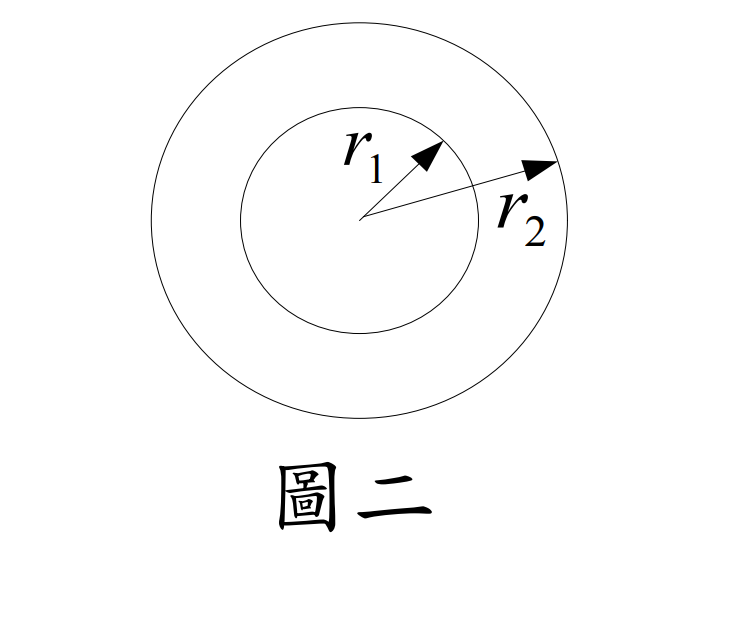

### 考題編號：MM-2004-2

**主分類：** `MM-U2-3` 扭力桿件斷面應力計算
**副分類：** `MM-U3-3` 扭力桿件變位及內力分析
**分析法：** 彈性分析
**標籤：** `空心圓軸` `扭轉角` `薄壁閉合斷面` `Bredt公式` `彈性理論` `薄壁近似` `扭矩`

---

## 1. 題目

等截面空心圓管，內半徑 $r_1$，外半徑 $r_2 = \beta r_1$（$\beta > 1$），剪力模數 $G$。此管受扭矩 $T$ 作用，在平均半徑 $\bar{r} = (r_1 + r_2)/2$ 處剪應力為 $\tau$。

**(一)** 以扭力彈性理論，求扭矩 $T_a$ 及單位長度扭轉角 $\theta_a$。（7 分）

**(二)** 以薄壁理論，求扭矩 $T_b$ 及單位長度扭轉角 $\theta_b$。（8 分）

**(三)** 計算 $r_2/r_1 = \beta = 1.1, 1.5, 3.0$ 時，(一)、(二) 的結果，整理成表，說明差異原因，並歸納結論。（10 分）

---

## 2. 題目附圖

*圖說：空心圓形斷面，內半徑 $r_1$，外半徑 $r_2 = \beta r_1$（$\beta > 1$）。平均半徑 $\bar{r} = (r_1+r_2)/2 = r_1(1+\beta)/2$，厚度 $t = r_2 - r_1 = r_1(\beta-1)$。剪力模數 $G$，受扭矩 $T$ 作用。*

---

## 3. 解題戰略地圖

**三層掃描：**

| 層次 | 內容 |
|------|------|
| **[目標]** | 已知平均半徑處剪應力 $\tau$，反推 $T$ 與 $\theta$（兩種方法各求一次） |
| **[已知]** | $r_1$、$\beta$（$r_2 = \beta r_1$）、$G$、$\tau$（在 $\bar{r}$ 處） |
| **[待算]** | $J$（彈性法）、$A_m$（薄壁法）→ $T \to \theta$ |

**關鍵對比：**

| 項目 | 彈性理論 | 薄壁理論 |
|------|---------|---------|
| 剪應力分布 | $\tau(\rho) = T\rho/J$（線性，外大內小） | $\tau = T/(2A_m t)$（均勻） |
| 適用條件 | 圓形斷面，厚薄均可 | 閉合薄壁斷面（$t \ll r$） |

**陷阱：**
1. $\tau$ 是在平均半徑 $\bar{r}$ 處的值，不是外壁最大值
2. 薄壁理論的 $A_m$ 是**中線所圍面積**（非外圓面積，非截面積）
3. $\theta_a = \theta_b$ 並非偶然，有物理意義（詳見小題(三)結論）

---

## 3.5 變數層次分析（Variable Hierarchy Analysis）

> 複習提示：第一次解題後，在每個卡住的知識點旁標記 `⚠`；第二次複習時只看有 `⚠` 的項目。

### 最終目標
求 `T_a, θ_a`（彈性理論）與 `T_b, θ_b`（薄壁理論），並比較其比值隨 β 的變化

### 本題關鍵公式（依計算順序）

$$\text{彈性理論 Step 1: } J = \frac{\pi(r_2^4 - r_1^4)}{2}$$

$$\text{彈性理論 Step 2: } \tau = \frac{T_a \bar{r}}{J} \Rightarrow T_a = \frac{\tau J}{\bar{r}}$$

$$\text{彈性理論 Step 3: } \theta_a = \frac{T_a}{GJ} = \frac{\tau}{G\bar{r}}$$

$$\text{薄壁理論 Step 1: } A_m = \pi\bar{r}^2,\quad t = r_2 - r_1$$

$$\text{薄壁理論 Step 2: } \tau = \frac{T_b}{2A_m t} \Rightarrow T_b = 2A_m t \tau$$

$$\text{薄壁理論 Step 3: } \theta_b = \frac{T_b \oint(ds/t)}{4A_m^2 G} = \frac{\tau}{G\bar{r}}$$

### L1：題目直接給定

| 符號 | 說明 |
|------|------|
| $r_1$ | 內半徑 |
| $\beta$ | 半徑比（$r_2 = \beta r_1$，$\beta > 1$） |
| $G$ | 剪力模數 |
| $\tau$ | 在平均半徑 $\bar{r}$ 處的剪應力 |

### L2：需知識點推導

**彈性理論**

| 符號 | 公式/來源 | 卡關? |
|------|----------|:-----:|
| $J$ | $\pi(r_2^4-r_1^4)/2$（極慣性矩） | |
| $\bar{r}$ | $(r_1+r_2)/2 = r_1(1+\beta)/2$ | |
| $T_a$ | $\tau J/\bar{r}$（由 $\tau = T\bar{r}/J$ 反推） | |
| $\theta_a$ | $T_a/(GJ) = \tau/(G\bar{r})$ | |

**薄壁理論（Bredt 公式）**

| 符號 | 公式/來源 | 卡關? |
|------|----------|:-----:|
| $A_m$ | $\pi\bar{r}^2$（中線所圍面積） | |
| $t$ | $r_2 - r_1 = r_1(\beta-1)$（壁厚） | |
| $T_b$ | $2A_m t \tau$（由 $\tau = T/(2A_m t)$ 反推） | |
| $\oint(ds/t)$ | $2\pi\bar{r}/t$（等厚圓形中線積分） | |
| $\theta_b$ | $T_b \oint(ds/t)/(4A_m^2 G)$（Bredt 扭轉角公式） | |

### L3：深層知識（不懂就卡住）

| 知識點 | 說明 | 卡關? |
|--------|------|:-----:|
| 薄壁理論的 $A_m$ | 是中線（mean line）所圍面積，不是截面實體面積，也不是外圓面積 | |
| Bredt 剪力流 | $q = T/(2A_m)$，q 為常數（沿中線不變）；$\tau = q/t$ | |
| $\theta_a = \theta_b$ 的原因 | 彈性理論：$\theta = T/(GJ) = \tau_{\bar{r}} \cdot J/\bar{r}/(GJ) = \tau_{\bar{r}}/(G\bar{r})$，與 J 無關；薄壁理論同樣推導出 $\tau/(G\bar{r})$ | |

---

## 4. 步驟化詳細計算

### 小題（一）：彈性理論

**前置量（以 $r_1, \beta$ 表示）：**

$$r_2 = \beta r_1, \qquad \bar{r} = \frac{r_1+r_2}{2} = \frac{r_1(1+\beta)}{2}$$

**極慣性矩：**

$$J = \frac{\pi(r_2^4 - r_1^4)}{2} = \frac{\pi r_1^4(\beta^4 - 1)}{2}$$

利用因式分解 $\beta^4-1 = (\beta^2+1)(\beta+1)(\beta-1)$：

$$J = \frac{\pi r_1^4 (\beta^2+1)(\beta+1)(\beta-1)}{2}$$

**由 $\tau = T_a \bar{r}/J$ 反推扭矩：**

$$T_a = \frac{\tau J}{\bar{r}} = \frac{\tau \cdot \dfrac{\pi r_1^4(\beta^4-1)}{2}}{\dfrac{r_1(1+\beta)}{2}} = \frac{\tau \pi r_1^3 (\beta^4-1)}{1+\beta}$$

$$= \frac{\tau \pi r_1^3 (\beta^2+1)(\beta+1)(\beta-1)}{1+\beta}$$

$$\boxed{T_a = \tau \pi r_1^3 (\beta^2+1)(\beta-1)}$$

**單位長度扭轉角：**

$$\theta_a = \frac{T_a}{GJ} = \frac{\tau J/\bar{r}}{GJ} = \frac{\tau}{G\bar{r}}$$

$$\boxed{\theta_a = \frac{2\tau}{Gr_1(1+\beta)}}$$

---

### 小題（二）：薄壁理論（Bredt 公式）

**中線所圍面積（中線為半徑 $\bar{r}$ 的圓）：**

$$A_m = \pi\bar{r}^2 = \pi\left[\frac{r_1(1+\beta)}{2}\right]^2 = \frac{\pi r_1^2(1+\beta)^2}{4}$$

**壁厚：**

$$t = r_2 - r_1 = r_1(\beta-1)$$

**由薄壁剪應力公式 $\tau = T_b/(2A_m t)$ 反推：**

$$T_b = 2A_m t \tau = 2 \cdot \frac{\pi r_1^2(1+\beta)^2}{4} \cdot r_1(\beta-1) \cdot \tau$$

$$\boxed{T_b = \frac{\pi \tau r_1^3 (1+\beta)^2(\beta-1)}{2}}$$

**中線積分（等厚圓形）：**

$$\oint \frac{ds}{t} = \frac{2\pi\bar{r}}{t} = \frac{2\pi \cdot r_1(1+\beta)/2}{r_1(\beta-1)} = \frac{\pi(1+\beta)}{\beta-1}$$

**Bredt 扭轉角公式（單位長度）：**

$$\theta_b = \frac{T_b \oint(ds/t)}{4A_m^2 G}$$

代入各量驗算：

$$\theta_b = \frac{T_b \cdot \dfrac{\pi(1+\beta)}{\beta-1}}{4 \cdot \left[\dfrac{\pi r_1^2(1+\beta)^2}{4}\right]^2 \cdot G}$$

$$= \frac{\dfrac{\pi \tau r_1^3(1+\beta)^2(\beta-1)}{2} \cdot \dfrac{\pi(1+\beta)}{\beta-1}}{\dfrac{\pi^2 r_1^4(1+\beta)^4}{4} \cdot G}$$

$$= \frac{\dfrac{\pi^2 \tau r_1^3(1+\beta)^3}{2}}{\dfrac{\pi^2 r_1^4(1+\beta)^4}{4} \cdot G} = \frac{2\tau}{Gr_1(1+\beta)}$$

$$\boxed{\theta_b = \frac{2\tau}{Gr_1(1+\beta)}}$$

> **重要結論：** $\theta_a = \theta_b$ 恆成立，與 $\beta$ 無關。

---

### 小題（三）：比較表與結論

**比值公式：**

$$\frac{T_a}{T_b} = \frac{\tau \pi r_1^3(\beta^2+1)(\beta-1)}{\dfrac{\pi \tau r_1^3(1+\beta)^2(\beta-1)}{2}} = \frac{2(\beta^2+1)}{(1+\beta)^2}$$

$$\frac{\theta_a}{\theta_b} = 1 \quad \text{（恆等式，與 β 無關）}$$

**數值計算：**

| $\beta$ | $\beta^2+1$ | $(1+\beta)^2$ | $T_a/T_b$ | $\theta_a/\theta_b$ |
|---------|------------|--------------|----------|-------------------|
| 1.1 | 2.21 | 4.41 | $2 \times 2.21/4.41 \approx 1.002$ | 1.000 |
| 1.5 | 3.25 | 6.25 | $2 \times 3.25/6.25 = 1.040$ | 1.000 |
| 3.0 | 10.00 | 16.00 | $2 \times 10/16 = 1.250$ | 1.000 |

**表一（整理格式）：**

| | $\beta = 1.1$ | $\beta = 1.5$ | $\beta = 3$ |
|--|:---:|:---:|:---:|
| $T_a/T_b$ | 1.002 | 1.040 | 1.250 |
| $\theta_a/\theta_b$ | 1.000 | 1.000 | 1.000 |

**差異原因分析：**

**為什麼 $T_a \neq T_b$（但差距隨 β 增大）？**

- 彈性理論：剪應力線性分布，$\tau(\rho) = T\rho/J$，外壁剪應力大於內壁
- 薄壁理論：假設剪應力**均勻分布**等於中線處的值 $\tau$

兩理論均以 $\bar{r}$ 處剪應力 $\tau$ 為基準：
- 彈性理論中，外壁（$\rho > \bar{r}$）的應力更大 → 承擔更多扭矩 → 同樣的 $\tau$ 對應更大的 $T_a$
- 薄壁理論忽略了此分布效果，所以低估了扭矩容量 → $T_a > T_b$

當壁厚趨近於零（$\beta \to 1^+$），應力分布趨近均勻 → $T_a/T_b \to 1$（薄壁理論精確）。
當壁越厚（$\beta$ 越大），線性分布與均勻分布的差異越大 → $T_a/T_b$ 越大。

**為什麼 $\theta_a = \theta_b$（恆等）？**

從彈性理論：
$$\theta_a = \frac{T_a}{GJ} = \frac{\tau J/\bar{r}}{GJ} = \frac{\tau}{G\bar{r}}$$

$J$ 完全消去！因此 $\theta_a$ **只取決於 $\bar{r}$ 處的剪應力 $\tau$，而與斷面幾何（$\beta$）無關**。

從薄壁理論同樣推導出 $\theta_b = \tau/(G\bar{r})$，故 $\theta_a = \theta_b$ 是恆等式，不是數值巧合。

**物理意義：** 扭轉角 = 剪應變 × 幾何，而剪應變 $\gamma = \tau/G$ 在 $\bar{r}$ 處完全由 $\tau$ 和 $G$ 決定，與截面如何分配扭矩無關。

**結論：**

1. 以**相同的平均半徑剪應力 $\tau$** 為基準比較時，彈性理論給出的扭矩容量恆大於薄壁理論（$T_a \geq T_b$），差距隨壁厚增加（$\beta$ 增大）而加大
2. 薄壁理論在 $\beta \leq 1.1$（薄壁條件）時誤差小於 0.3%，可安全使用
3. $\beta = 1.5$ 時誤差約 4%，工程上可接受；$\beta = 3.0$ 時誤差達 25%，薄壁理論不適用
4. 兩理論的**扭轉角完全相同**，因為 $\theta = \tau/(G\bar{r})$ 是對平均半徑剪應力的恆等式

---

## 5. 最終答案彙整

**彈性理論：**

$$T_a = \tau \pi r_1^3 (\beta^2+1)(\beta-1)$$

$$\theta_a = \frac{2\tau}{Gr_1(1+\beta)}$$

**薄壁理論：**

$$T_b = \frac{\pi \tau r_1^3 (1+\beta)^2(\beta-1)}{2}$$

$$\theta_b = \frac{2\tau}{Gr_1(1+\beta)}$$

**比值：**

$$\frac{T_a}{T_b} = \frac{2(\beta^2+1)}{(1+\beta)^2}, \qquad \frac{\theta_a}{\theta_b} = 1$$

---

## 6. 核心觀念

**彈性理論 vs 薄壁理論的本質差異：**

- 差異在**應力分布假設**：彈性理論假設線性分布（$\tau \propto \rho$），薄壁理論假設均勻分布
- 以平均半徑 $\bar{r}$ 為基準點時，扭矩 $T$ 的差異反映了「外半徑多承擔的份額」
- $\beta \to 1$（超薄壁）時兩者收斂；$\beta$ 越大兩者差異越大
- 扭轉角的一致性是因為 $\theta = \tau/(G\bar{r})$，只與 $\bar{r}$ 處的剪應力有關，與斷面幾何的具體分布無關
