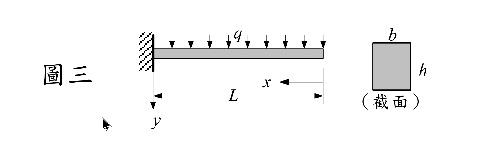

### 考題編號：MM-2004-3

**主分類：** `MM-U2-2` 梁桿件斷面應力計算
**副分類：** `MM-U3-2` 梁桿件變位及內力分析
**分析法：** 混合
**標籤：** `非線性材料` `冪次律` `彎矩曲率關係` `懸臂梁` `均佈載重` `撓度方程式` `非線性彎曲`

---

## 1. 題目

矩形截面 $(b \times h)$ 之懸臂梁，受均佈載重 $q$ 作用（如圖三），無論張應力或壓應力，應力–應變關係皆滿足：

$$\sigma = B\varepsilon^n, \quad 0 \le n \le 1,\ B \text{ 為常數}$$

**(一)** 求彎矩 $M$ 及曲率 $\kappa$ 之關係（以 $n, b, h, B$ 表之）。（15 分）

**(二)** 若 $n = 0.5$，求懸臂梁之撓度方程式。（10 分）

---

## 2. 題目附圖

*圖說：懸臂梁總長 $L$，固定端在左（$x = L$），自由端在右（$x = 0$）。均佈載重 $q$（向下，單位：力/長度）。矩形斷面寬 $b$、高 $h$。$x$ 自自由端起算，$y$ 向下為正。*

---

## 3. 解題戰略地圖

**三層掃描：**

| 層次 | 內容 |
|------|------|
| **[目標]** | (一) 導出 $M$–$\kappa$ 關係；(二) 以 $n=0.5$ 積分 $\kappa(x)$ 得撓度 $v(x)$ |
| **[已知]** | $\sigma = B\varepsilon^n$（非線性，張壓對稱）；矩形斷面 $b \times h$；UDL $q$；梁長 $L$ |
| **[待算]** | $M$–$\kappa$（積分斷面應力矩）；$v(x)$（對 $\kappa(x)$ 積分兩次 + 邊界條件） |

**力學框架：**
1. **平面斷面假設：** $\varepsilon(y) = \kappa y$（$y$ 為中性軸距離）
2. **對稱材料行為：** 張壓對稱 → 中性軸在形心
3. **彎矩積分：** $M = \int \sigma \cdot y \, dA$（對稱利用 2 倍上半斷面）
4. **撓度：** $d^2v/dx^2 = \kappa$（小變形，$\kappa > 0$ 凹上）

**陷阱：**
1. $\sigma = B\varepsilon^n$ 對 $n < 1$ 不是整數次冪，需小心：張力側 $\varepsilon > 0$，壓力側 $\varepsilon < 0$，對稱張壓才能以 $2\times$ 上半部積分
2. 積分 $M$ 時指數是 $y^{n+1}$，結果有 $(h/2)^{n+2}$，不要漏掉 $2^{n+2}$ 在分母
3. 邊界條件：固定端 $x=L$ 時 $v=0$ 且 $dv/dx = 0$（不是在自由端）

---

## 3.5 變數層次分析（Variable Hierarchy Analysis）

> 複習提示：第一次解題後，在每個卡住的知識點旁標記 `⚠`；第二次複習時只看有 `⚠` 的項目。

### 最終目標
(一) $M$–$\kappa$ 關係式（含 $n, b, h, B$）；(二) $n=0.5$ 的撓度方程式 $v(x)$

### 本題關鍵公式（依計算順序）

$$\text{Step 1: } \varepsilon(y) = \kappa y \quad (\text{平面斷面假設})$$

$$\text{Step 2: } M = 2\int_0^{h/2} B(\kappa y)^n \cdot y \cdot b\, dy = \frac{bB\kappa^n h^{n+2}}{2^{n+1}(n+2)}$$

$$\text{Step 3（n=0.5）: } \kappa = \left(\frac{5\sqrt{2}\, M}{bBh^{5/2}}\right)^2 = \frac{50M^2}{b^2B^2h^5}$$

$$\text{Step 4: } M(x) = \frac{qx^2}{2}$$

$$\text{Step 5: } \frac{d^2v}{dx^2} = \frac{25q^2x^4}{2b^2B^2h^5}$$

$$\text{Step 6: } v(x) = \frac{25q^2}{2b^2B^2h^5}\!\left(\frac{x^6}{30} - \frac{L^5 x}{5} + \frac{L^6}{6}\right)$$

### L1：題目直接給定

| 符號 | 說明 |
|------|------|
| $B$ | 材料常數（應力–應變律中的係數） |
| $n$ | 冪次（$0 \le n \le 1$）；小題(二)取 $n=0.5$ |
| $b, h$ | 矩形斷面寬度、高度 |
| $q$ | 均佈載重（力/長度） |
| $L$ | 懸臂梁長度 |

### L2：需知識點推導

**Step 1–2：斷面 M-κ 積分**

| 符號 | 公式/來源 | 卡關? |
|------|----------|:-----:|
| $\varepsilon(y)$ | 平面斷面假設：$\varepsilon = \kappa y$（$y$ 離中性軸距離） | |
| $\sigma(y)$ | $B(\kappa y)^n$（代入材料律，張壓對稱取絕對值後加符號） | |
| $M$ | $2b \int_0^{h/2} B(\kappa y)^n \cdot y\, dy$（對稱積分）| |
| 積分結果 | $\int_0^{h/2} y^{n+1}\,dy = (h/2)^{n+2}/(n+2)$ | |

**Step 3–5：撓度求解（n=0.5）**

| 符號 | 公式/來源 | 卡關? |
|------|----------|:-----:|
| $\kappa$ | 由 $M = C\kappa^n$ 反推：$\kappa = (M/C)^{1/n}$，$n=0.5$ 時平方 | |
| $M(x)$ | 懸臂梁：$M = qx^2/2$（自由端 $x=0$ 起算） | |
| $d^2v/dx^2$ | $= \kappa(x) = 50M(x)^2/(b^2B^2h^5)$ | |
| 邊界條件 | $v(L)=0$，$v'(L)=0$（固定端無位移、無轉角） | |

### L3：深層知識（不懂就卡住）

| 知識點 | 說明 | 卡關? |
|--------|------|:-----:|
| 非線性材料的中性軸 | 張壓對稱材料（$\sigma = B\varepsilon^n$，壓縮也成立）→ 靜力矩平衡仍在形心 | |
| 為何用 $2\times$ 上半積分 | 下半（壓縮側）的貢獻大小與上半相同（對稱），故 $M = 2\int_0^{h/2}\cdots$ | |
| $n$ 影響應力分布形狀 | $n=1$（線性）→ 三角形分布；$n<1$ → 頂端「平坦化」（應力更均勻）；$n=0$ → 矩形分布（完全塑性） | |
| 撓度積分的 BC 位置 | 固定端在 $x=L$，不是在 $x=0$（自由端）；兩個 BC 均在 $x=L$ | |

---

## 4. 步驟化詳細計算

### 小題（一）：M–κ 關係

**建立坐標系：**

以中性軸（形心）為原點，$y$ 向張力側（下方）為正，$y \in [-h/2, h/2]$。

**應變分布（平面斷面假設）：**

$$\varepsilon(y) = \kappa y$$

其中 $\kappa > 0$ 為正曲率（梁下凸）。$y > 0$ 為張力側（$\varepsilon > 0$），$y < 0$ 為壓力側（$\varepsilon < 0$）。

**應力分布：**

材料律 $\sigma = B\varepsilon^n$ 對張壓對稱均適用（題目已說明）：

- 張力側（$y > 0$）：$\sigma = B(\kappa y)^n > 0$（張應力）
- 壓力側（$y < 0$）：$\sigma = -B(\kappa |y|)^n < 0$（壓應力）

**彎矩積分：**

$$M = \int_{-h/2}^{h/2} \sigma(y) \cdot y \cdot b \, dy$$

利用張壓對稱（被積函數 $\sigma(y)\cdot y$ 為偶函數）：

$$M = 2b\int_0^{h/2} B(\kappa y)^n \cdot y \, dy = 2bB\kappa^n \int_0^{h/2} y^{n+1} \, dy$$

$$= 2bB\kappa^n \left[\frac{y^{n+2}}{n+2}\right]_0^{h/2} = 2bB\kappa^n \cdot \frac{(h/2)^{n+2}}{n+2}$$

$$= 2bB\kappa^n \cdot \frac{h^{n+2}}{2^{n+2}(n+2)} = \frac{bB\kappa^n h^{n+2}}{2^{n+1}(n+2)}$$

$$\boxed{M = \frac{bBh^{n+2}}{2^{n+1}(n+2)}\,\kappa^n}$$

**整理為 $\kappa(M)$：**

$$\kappa^n = \frac{2^{n+1}(n+2)\,M}{bBh^{n+2}} \implies \kappa = \left[\frac{2^{n+1}(n+2)\,M}{bBh^{n+2}}\right]^{1/n}$$

> **驗證（$n=1$，線彈性）：** $M = \dfrac{bEh^3}{4\cdot 3}\kappa = \dfrac{bEh^3}{12}\kappa = EI\kappa$ ✅

---

### 小題（二）：撓度方程式（$n = 0.5$）

**代入 $n = 0.5$ 求 $\kappa$：**

$$2^{n+1} = 2^{3/2} = 2\sqrt{2}, \quad n+2 = \frac{5}{2}$$

$$M = \frac{bBh^{5/2}}{2\sqrt{2} \cdot (5/2)}\,\kappa^{1/2} = \frac{bBh^{5/2}}{5\sqrt{2}}\,\kappa^{1/2}$$

解 $\kappa$：

$$\kappa^{1/2} = \frac{5\sqrt{2}\,M}{bBh^{5/2}} \implies \kappa = \frac{50M^2}{b^2B^2h^5}$$

**懸臂梁彎矩分布（$x$ 自自由端起算，固定端在 $x=L$）：**

$$M(x) = \frac{qx^2}{2}$$

（自由端 $x=0$：$M=0$；固定端 $x=L$：$M = qL^2/2$）

**代入 M-κ 關係：**

$$\kappa(x) = \frac{50\left(\dfrac{qx^2}{2}\right)^2}{b^2B^2h^5} = \frac{50q^2x^4}{4b^2B^2h^5} = \frac{25q^2x^4}{2b^2B^2h^5}$$

**建立撓度微分方程：**

$$\frac{d^2v}{dx^2} = \kappa(x) = \frac{25q^2}{2b^2B^2h^5}\,x^4$$

設 $\displaystyle K = \frac{25q^2}{2b^2B^2h^5}$，則：

$$\frac{d^2v}{dx^2} = Kx^4$$

**第一次積分（斜率）：**

$$\frac{dv}{dx} = K\frac{x^5}{5} + C_1$$

邊界條件：固定端 $x = L$ 時斜率為零（$dv/dx = 0$）：

$$0 = K\frac{L^5}{5} + C_1 \implies C_1 = -\frac{KL^5}{5}$$

$$\frac{dv}{dx} = K\left(\frac{x^5}{5} - \frac{L^5}{5}\right) = \frac{K}{5}(x^5 - L^5)$$

**第二次積分（撓度）：**

$$v(x) = K\left(\frac{x^6}{30} - \frac{L^5 x}{5}\right) + C_2$$

邊界條件：固定端 $x = L$ 時撓度為零（$v(L) = 0$）：

$$0 = K\left(\frac{L^6}{30} - \frac{L^6}{5}\right) + C_2 = K\cdot L^6\left(\frac{1}{30} - \frac{6}{30}\right) + C_2 = -\frac{KL^6}{6} + C_2$$

$$C_2 = \frac{KL^6}{6}$$

**撓度方程式：**

$$\boxed{v(x) = \frac{25q^2}{2b^2B^2h^5}\left(\frac{x^6}{30} - \frac{L^5 x}{5} + \frac{L^6}{6}\right)}$$

（$x$ 自自由端起算，$v$ 向下為正）

**自由端最大撓度（$x = 0$）：**

$$v_{max} = v(0) = \frac{25q^2}{2b^2B^2h^5} \cdot \frac{L^6}{6} = \frac{25q^2L^6}{12b^2B^2h^5}$$

**邊界條件自我驗證：**

| 位置 | 條件 | 代入結果 |
|------|------|---------|
| $x = L$ | $v(L) = 0$ | $K(L^6/30 - L^6/5 + L^6/6) = KL^6(1-6+5)/30 = 0$ ✅ |
| $x = L$ | $v'(L) = 0$ | $K(L^5 - L^5)/5 = 0$ ✅ |

---

## 5. 最終答案彙整

| 小題 | 答案 |
|------|------|
| $M$–$\kappa$ 關係 | $\displaystyle M = \frac{bBh^{n+2}}{2^{n+1}(n+2)}\,\kappa^n$ |
| 撓度方程式（$n=0.5$） | $\displaystyle v(x) = \frac{25q^2}{2b^2B^2h^5}\!\left(\frac{x^6}{30} - \frac{L^5 x}{5} + \frac{L^6}{6}\right)$ |
| 最大撓度（自由端） | $\displaystyle v_{max} = \frac{25q^2L^6}{12b^2B^2h^5}$ |

---

## 6. 核心觀念

**非線性材料梁彎曲的兩大要點：**

1. **M–κ 積分：** 平面斷面假設 $\varepsilon = \kappa y$ 仍成立；改變的是 $\sigma(\varepsilon)$ 的形狀。對張壓對稱的 $\sigma = B\varepsilon^n$，積分得 $M \propto \kappa^n \cdot h^{n+2}$。

2. **應力分布形狀隨 n 改變：**
   - $n = 1$（線彈性）：三角形分布，外緣最大
   - $n < 1$（次線性）：分布「飽和」，外緣相對較小，應力更均勻
   - $n = 0$（剛性完全塑性）：矩形分布（完全塑性），對應 $M_p$

3. **撓度求解思路：** 「M-κ 關係」→「$\kappa(x) = f[M(x)]$」→ 積分兩次 + 固定端 BC → 撓度方程式。步驟與線彈性相同，只是 $\kappa$ 與 $M$ 是非線性關係。
