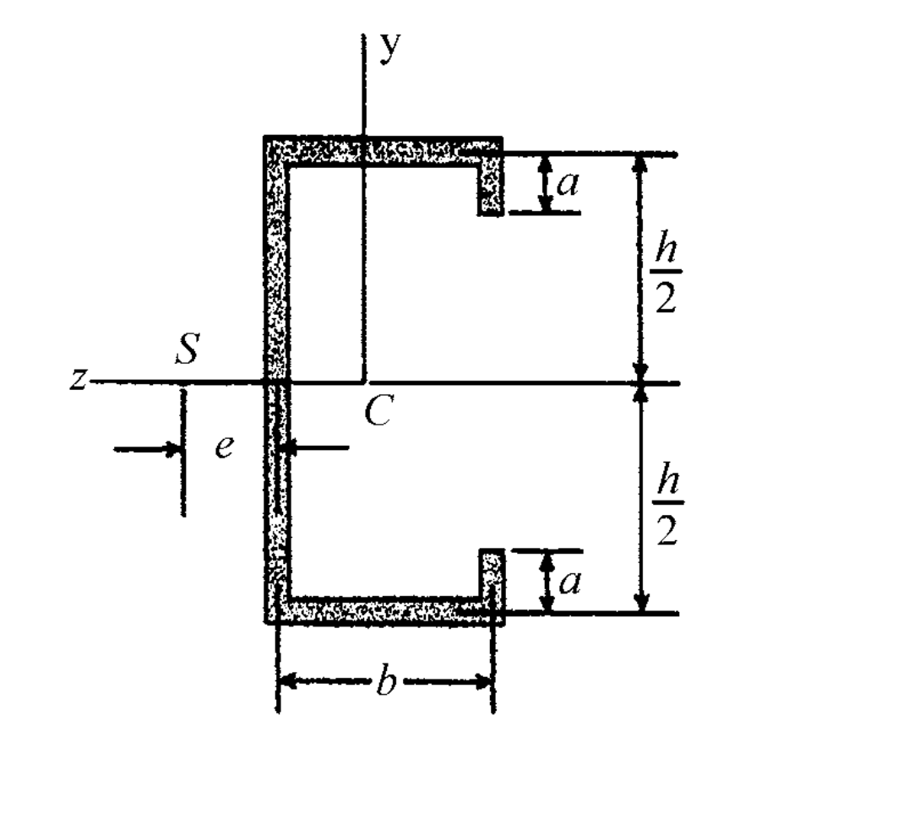

# 考題編號：MM-2005-2

**主分類：** `MM-U2-2` 梁桿件斷面應力計算
**副分類：** `MM-U1-1` 斷面性質計算
**分析法：** 彈性分析
**標籤：** `剪力中心` `薄壁開口斷面` `剪力流` `慣性矩` `對稱斷面` `剪應力`

---

## 1. 原始題目重述 (Problem Restatement)

一等厚度薄壁斷面如下圖所示，試求其剪力中心。（10 分）

*圖說：等厚度薄壁斷面（厚度設為 $t$）。豎直腹板高為 $h$，上下水平翼板寬為 $b$，上下豎直唇緣（Lip）長為 $a$。設對稱軸為 $z$ 軸（向左為正），垂直軸為 $y$ 軸（向上為正），原點 $C$ 位於腹板中心。剪力中心 $S$ 位於腹板左側，距腹板中線距離為 $e$。*

---

## 2. 考題核心精神與出題者意圖 (Core Concepts & Examiner's Intent)

**核心觀念：** 薄壁開口斷面的剪力流分布與剪力中心（Shear Center）計算。

考生必須掌握以下能力：
1. **斷面慣性矩計算：** 能夠計算包含腹板（Web）、翼板（Flange）與唇緣（Lip）的組合斷面繞對稱軸（$z$ 軸）的面積慣性矩 $I_z$。
2. **剪力流計算：** 應用薄壁斷面剪力流公式 $q = \frac{V Q_z}{I_z}$，沿著斷面中線計算各段的剪力流分布。
3. **力偶平衡分析：** 利用各板件剪力流的合力對特定點（如腹板中心 $C$）求矩，建立力矩平衡方程式，進而求解剪力中心至腹板的距離 $e$。

**出題者意圖：**
- 評估考生對於薄壁開口斷面剪應力與剪力流理論的掌握程度。
- 測試考生是否能正確處理對稱斷面在剪力作用下的力平衡關係。
- 陷阱在於唇緣（Lip）剪力流方向的判斷。唇緣垂直力與腹板剪力方向相反，會削弱腹板承載，但其力矩與翼板力矩同方向疊加，必須小心處理正負號與力臂關係。

---

## 3. 解題戰略地圖與陷阱分析 (Strategic Roadmap & Trap Analysis)

**作戰計畫：**
1. **建立座標系：** 以腹板中心 $C$ 為原點 $(0,0)$。$y$ 軸沿腹板向上為正；$z$ 軸向左為正。此時斷面關於 $z$ 軸對稱。
2. **計算對稱軸慣性矩 $I_z$：**
   - 腹板：高 $h$，厚 $t$。
   - 翼板：寬 $b$，厚 $t$，位於 $y = \pm h/2$。
   - 唇緣：長 $a$，厚 $t$，位於 $z = -b$，從 $y = \pm h/2$ 向內延伸 $a$。
   - 將三部分貢獻相加得到 $I_z$。
3. **計算各段剪力流與合力：**
   - 設外加向下剪力 $V$ 作用於剪力中心 $S$（座標為 $(e, 0)$）。
   - 從斷面一端（如上唇緣自由端）出發，計算第一矩 $Q_z(s)$。
   - 導出上唇緣與上翼板的剪力流，並積分求出上翼板合力 $F_f$ 與唇緣合力 $F_L$。
4. **力矩平衡求解 $e$：**
   - 對腹板中心 $C(0,0)$ 取力矩平衡。外加剪力 $V$ 對 $C$ 產生的力矩必須等於各段剪力流合力對 $C$ 產生的力矩總和。
   - 方程式：$V \cdot e = F_f \cdot h + 2 F_L \cdot b$
   - 代入 $F_f$ 與 $F_L$ 的表達式，消去 $V$ 與 $t$，求得 $e$。

**關鍵陷阱：**

| # | 陷阱 | 應對 |
|---|------|------|
| ① | 忘記計算唇緣自身繞 $z$ 軸的慣性矩或平行軸項 | 唇緣 centroid 位於 $y = \pm (h-a)/2$，平行軸項為 $(at) \cdot [(h-a)/2]^2$，且自身慣性矩 $\frac{ta^3}{12}$ 需計入。 |
| ② | 剪力流方向判斷錯誤，導致合力力矩符號相消 | 沿中線連續流動：上唇緣向上 $\rightarrow$ 上翼板向左 $\rightarrow$ 腹板向下 $\rightarrow$ 下翼板向右 $\rightarrow$ 下唇緣向上。所有合力對 $C$ 均產生逆時針（CCW）力矩，因此各力矩應相加而非相減。 |
| ③ | 忘記兩側對稱件的乘積係數 | 翼板與唇緣皆有上下對稱的兩部分，計算總力矩時須乘以 $2$。 |

---

## 3.5 變數層次分析 (Variable Hierarchy Analysis)

> 複習提示：第一次解題後，在每個卡住的知識點旁標記 `⚠`；第二次複習時只看有 `⚠` 的項目。

### 最終目標
求出剪力中心相對於腹板中線的水平距離 $e$。

### 本題關鍵公式（依計算順序）

$$\text{Step 1: } I_z = I_{\text{web}} + I_{\text{flanges}} + I_{\text{lips}}$$

$$\text{Step 2: } q(s) = \frac{V Q_z(s)}{\boxed{I_z}}$$

$$\text{Step 3: } F_L = \int_0^a q_{\text{lip}}(s_1) ds_1$$

$$\text{Step 4: } F_f = \int_0^b q_{\text{flange}}(s_2) ds_2$$

$$\text{Step 5: } V \cdot e = \boxed{F_f} \cdot h + 2 \boxed{F_L} \cdot b$$

### L1：題目直接給定

| 符號 | 數值 | 說明 |
|------|------|------|
| $h$ | — | 腹板高度 |
| $b$ | — | 翼板寬度 |
| $a$ | — | 唇緣長度 |
| $t$ | — | 斷面等厚度 |

### L2：需知識點推導

**斷面二次軸矩（慣性矩）**

| 符號 | 公式／來源 | 卡關? |
|------|-----------|-------|
| $I_{\text{web}}$ | $\frac{t h^3}{12}$ | |
| $I_{\text{flanges}}$ | $2 \cdot (b t) \cdot (h/2)^2 = \frac{b t h^2}{2}$ | |
| $I_{\text{lips}}$ | $2 \left[ \frac{t a^3}{12} + a t \left( \frac{h-a}{2} \right)^2 \right] = t \left( \frac{a h^2}{2} - a^2 h + \frac{2}{3} a^3 \right)$ | |

**剪力流與分段合力**

| 符號 | 公式／來源 | 卡關? |
|------|-----------|-------|
| $Q_z(s_1)$ | $t \left[ (h/2-a)s_1 + s_1^2/2 \right]$（上唇緣第一矩，自 $0$ 至 $a$） | |
| $F_L$ | $\frac{V t a^2}{I_z} \left( \frac{h}{4} - \frac{a}{3} \right)$（上唇緣合力） | |
| $Q_z(s_2)$ | $\frac{at(h-a)}{2} + \frac{t h s_2}{2}$（上翼板第一矩，自 $0$ 至 $b$） | |
| $F_f$ | $\frac{V t b}{I_z} \left[ \frac{a(h-a)}{2} + \frac{b h}{4} \right]$（上翼板合力） | |

### L3：深層知識（不懂就卡住）

| 知識點 | 說明 | 卡關? |
|--------|------|-------|
| 剪力流流向與剪力中心定義 | 剪力中心是使斷面僅產生彎曲而不產生扭轉的剪力作用點。此時內外部力矩必須平衡。 | |
| 第一矩 $Q_z(s)$ 的積分起點 | 必須從開口斷面的自由端（剪力流為零處，如上唇緣底端）開始積分。 | |
| 唇緣力矩的力臂與方向 | 唇緣位於 $z = -b$ 處，其剪力流合力向上，對原點 $C(0,0)$ 產生的力矩力臂為 $b$，旋轉方向為逆時針（與翼板力矩同向）。 | |

---

## 4. 步驟化詳細計算過程 (Step-by-Step Detailed Calculation)

### Step 1：計算繞 $z$ 軸之面積慣性矩 $I_z$

整個斷面由五個板件組成：一個垂直腹板、兩個水平翼板、兩個垂直唇緣。

1. **垂直腹板 (Web)：**
   $$I_{\text{web}} = \frac{t h^3}{12}$$

2. **水平翼板 (Flanges)：**
   翼板厚度相對於 $h$ 極小，其自身慣性矩可忽略。使用平行軸定理：
   $$I_{\text{flanges}} = 2 \times (b t) \times \left( \frac{h}{2} \right)^2 = \frac{b t h^2}{2}$$

3. **垂直唇緣 (Lips)：**
   每個唇緣長度為 $a$，厚度為 $t$。其中心位於 $y = \pm \frac{h-a}{2}$。
   $$I_{\text{lips}} = 2 \times \left[ \frac{t a^3}{12} + (a t) \cdot \left( \frac{h-a}{2} \right)^2 \right]$$
   展開括號項：
   $$\left( \frac{h-a}{2} \right)^2 = \frac{h^2 - 2 a h + a^2}{4}$$
   代入後整理：
   $$I_{\text{lips}} = 2 t \left[ \frac{a^3}{12} + \frac{a h^2 - 2 a^2 h + a^3}{4} \right] = 2 t \left[ \frac{a h^2}{4} - \frac{a^2 h}{2} + \frac{a^3}{3} \right] = t \left( \frac{a h^2}{2} - a^2 h + \frac{2}{3} a^3 \right)$$

4. **總慣性矩 $I_z$：**
   $$I_z = t \left( \frac{h^3}{12} + \frac{b h^2}{2} + \frac{a h^2}{2} - a^2 h + \frac{2}{3} a^3 \right)$$

---

### Step 2：計算各區段的剪力流 $q(s)$

設有一垂直向下之剪力 $V$ 作用於剪力中心 $S$。此時斷面彎曲繞 $z$ 軸進行。

#### 1. 上唇緣段 (Top Lip)
定義局部座標 $s_1$ 自上唇緣底端自由端（$y = h/2 - a$，$z = -b$）開始，向上延伸至頂部翼板處（$s_1 = a$）。
該點之縱座標為 $y(s_1) = \frac{h}{2} - a + s_1$。

計算第一矩 $Q_z(s_1)$：
$$Q_z(s_1) = \int_0^{s_1} y(s_1') \cdot t ds_1' = t \int_0^{s_1} \left( \frac{h}{2} - a + s_1' \right) ds_1' = t \left[ \left( \frac{h}{2} - a \right) s_1 + \frac{s_1^2}{2} \right]$$

上唇緣與上翼板交接處（$s_1 = a$）的第一矩為：
$$Q_{z, \text{corner}} = t \left[ \left( \frac{h}{2} - a \right) a + \frac{a^2}{2} \right] = t \left( \frac{a h}{2} - \frac{a^2}{2} \right) = \frac{a t (h-a)}{2}$$

#### 2. 上翼板段 (Top Flange)
定義局部座標 $s_2$ 自外側轉角（$z = -b$，$y = h/2$）開始，向左延伸至腹板交接處（$s_2 = b$）。
該段縱座標恆為 $y = \frac{h}{2}$。

計算第一矩 $Q_z(s_2)$：
$$Q_z(s_2) = Q_{z, \text{corner}} + \int_0^{s_2} \left( \frac{h}{2} \right) \cdot t ds_2' = \frac{a t (h-a)}{2} + \frac{t h}{2} s_2$$

---

### Step 3：計算板件內力

#### 1. 唇緣內合力 $F_L$
由於對稱性，上下唇緣的合力大小相等。合力為剪力流在唇緣長度上的積分：
$$F_L = \int_0^a q(s_1) ds_1 = \frac{V}{I_z} \int_0^a Q_z(s_1) ds_1$$
代入 $Q_z(s_1)$：
$$\int_0^a Q_z(s_1) ds_1 = t \int_0^a \left[ \left( \frac{h}{2} - a \right) s_1 + \frac{s_1^2}{2} \right] ds_1 = t \left[ \left( \frac{h}{2} - a \right) \frac{a^2}{2} + \frac{a^3}{6} \right]$$
展開並整理：
$$t a^2 \left( \frac{h}{4} - \frac{a}{2} + \frac{a}{6} \right) = t a^2 \left( \frac{h}{4} - \frac{a}{3} \right)$$
故唇緣內合力為：
$$F_L = \frac{V t a^2}{I_z} \left( \frac{h}{4} - \frac{a}{3} \right)$$
*方向：自自由端流向轉角，即向上（$+y$ 方向）。*

#### 2. 翼板內合力 $F_f$
同樣，上下翼板合力大小相等：
$$F_f = \int_0^b q(s_2) ds_2 = \frac{V}{I_z} \int_0^b Q_z(s_2) ds_2$$
代入 $Q_z(s_2)$：
$$\int_0^b Q_z(s_2) ds_2 = \int_0^b \left[ \frac{a t (h-a)}{2} + \frac{t h s_2}{2} \right] ds_2 = \frac{a t b (h-a)}{2} + \frac{t h b^2}{4}$$
故翼板內合力為：
$$F_f = \frac{V t b}{I_z} \left[ \frac{a(h-a)}{2} + \frac{b h}{4} \right]$$
*方向：沿翼板向左（流向腹板，$-z$ 方向）。*

---

### Step 4：對腹板中心 $C(0,0)$ 取力矩平衡

在剪力中心 $S(e, 0)$ 處施加外力 $V$（向下），其對 $C$ 點產生的力矩為：
$$M_C^{\text{ext}} = V \cdot e \quad (\text{逆時針, CCW})$$

各板件剪力流合力對 $C$ 點產生的內力矩為：
1. **腹板力 $F_w$：** 通過 $C$ 點，力臂為零，力矩為零。
2. **上下翼板力 $F_f$：**
   - 上翼板力 $F_f$（向左，位於 $y = h/2$）：對 $C$ 產生逆時針力矩，大小為 $F_f \cdot \frac{h}{2}$。
   - 下翼板力 $F_b$（向右，位於 $y = -h/2$）：對 $C$ 產生逆時針力矩，大小為 $F_f \cdot \frac{h}{2}$。
   - 翼板總力矩：
     $$M_{C, \text{flanges}} = 2 \times \left( F_f \cdot \frac{h}{2} \right) = F_f \cdot h \quad (\text{逆時針, CCW})$$
3. **上下唇緣力 $F_L$：**
   - 兩唇緣皆位於 $z = -b$（腹板右側距離 $b$ 處），且剪力流方向皆向上（$+y$）。
   - 向上之力在右側對 $C$ 點產生逆時針力矩，力臂為 $b$。
   - 唇緣總力矩：
     $$M_{C, \text{lips}} = 2 \times (F_L \cdot b) = 2 F_L \cdot b \quad (\text{逆時針, CCW})$$

內力矩總和為：
$$M_C^{\text{int}} = F_f \cdot h + 2 F_L \cdot b \quad (\text{逆時針, CCW})$$

令外力矩等於內力矩：
$$V \cdot e = F_f \cdot h + 2 F_L \cdot b$$

代入 $F_f$ 與 $F_L$ 的表達式：
$$e = \frac{t b h}{I_z} \left[ \frac{a(h-a)}{2} + \frac{b h}{4} \right] h + 2 \left[ \frac{t a^2 b}{I_z} \left( \frac{h}{4} - \frac{a}{3} \right) \right] b$$

我們可以將所有的項通分（分母為 12）：
$$e = \frac{t b}{I_z} \left\{ h^2 \left[ \frac{a(h-a)}{2} + \frac{b h}{4} \right] + 2 a^2 b \left( \frac{h}{4} - \frac{a}{3} \right) \right\}$$
$$\text{括號內} = \frac{a h^3 - a^2 h^2}{2} + \frac{b h^3}{4} + \frac{a^2 b h}{2} - \frac{2 a^3 b}{3}$$
$$\text{括號內} = \frac{6(a h^3 - a^2 h^2) + 3 b h^3 + 6 a^2 b h - 8 a^3 b}{12}$$
$$e = \frac{t b}{12 I_z} \left( 6 a h^3 - 6 a^2 h^2 + 3 b h^3 + 6 a^2 b h - 8 a^3 b \right)$$
$$e = \frac{t b \left[ 3 b h^3 + 6 a h^3 - 6 a^2 h^2 + 2 a^2 b (3h - 4a) \right]}{12 I_z}$$

將先前求得之 $I_z$ 代入：
$$I_z = t \left( \frac{h^3}{12} + \frac{b h^2}{2} + \frac{a h^2}{2} - a^2 h + \frac{2}{3} a^3 \right)$$
$$12 I_z = t \left( h^3 + 6 b h^2 + 6 a h^2 - 12 a^2 h + 8 a^3 \right)$$

將其消去厚度 $t$，得到最終的水平距離 $e$：
$$\boxed{e = \frac{b \left( 3 b h^3 + 6 a h^3 - 6 a^2 h^2 + 6 a^2 b h - 8 a^3 b \right)}{h^3 + 6 b h^2 + 6 a h^2 - 12 a^2 h + 8 a^3}}$$

---

## 5. 關鍵爭議點與進階探討 (Critical Issues & Advanced Discussion)

### 1. 極限情況檢驗 (Limiting Cases Verification)

為了驗證公式的正確性，我們分析以下兩種極限情況：

- **情況一：無唇緣 ($a = 0$)**
  當 $a = 0$ 時，斷面退化為標準的等厚度槽梁 (Channel Section)。
  代入公式：
  $$e = \frac{b (3 b h^3)}{h^3 + 6 b h^2} = \frac{3 b^2 h^3}{h^2 (h + 6b)} = \frac{3 b^2}{h + 6b}$$
  這正是材料力學經典教科書中槽梁剪力中心的公式，驗證了分子分母的項次正確性。

- **情況二：無翼板 ($b = 0$)**
  當 $b = 0$ 時，斷面退化為一根單純的垂直腹板。此時剪力中心必須落在腹板中線上。
  代入公式：
  $$e = 0$$
  符合物理直覺。

### 2. 剪力流流向與符號慣例
在分析薄壁開口斷面時，我們假定外加剪力 $V$ 向下，剪力流從一端的自由端出發，流向另一端。
在力矩平衡方程式中，我們將所有內力對 $C$ 的矩取絕對值，並依據其產生的旋轉方向（順時針或逆時針）決定其正負號。
- 翼板剪力流向左，在 $y = h/2$ 處對 $C$ 產生逆時針矩；下翼板向右在 $y = -h/2$ 處亦產生逆時針矩，兩者同號。
- 唇緣剪力流向上，在 $z = -b$ 處對 $C$ 產生逆時針矩，與翼板同號。
- 外力 $V$ 向下，在左側 $z = e$ 處對 $C$ 產生逆時針矩。
因為所有力矩的物理方向均為逆時針，因此方程式兩側均取正號。此物理直覺避免了繁瑣的座標符號混淆。
