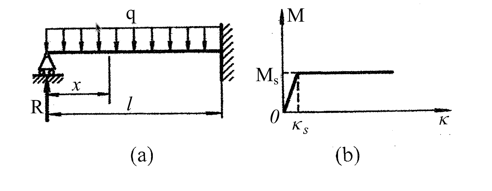

# 考題編號：MM-2005-4

**主分類：** `MM-U4-1` 軸力桿件、扭力桿件與梁之塑性分析
**副分類：** `MM-U3-2` 梁桿件變位及內力分析
**分析法：** 塑性分析
**標籤：** `彈塑性梁` `一端固定一端鉸` `塑性鉸` `反力-荷重關係` `理想彈塑性` `M-κ關係` `疊加法` `機構法`

---

## 1. 原始題目重述 (Problem Restatement)

**結構：** 一端鉸支（左端 A，x = 0）、一端固定（右端 B，x = l）之梁，承受全跨均布荷重 q（向下），如圖(a)所示。鉸支端支承反力為 R（向上）。

**材料：** 梁的 M-κ（彎矩–曲率）關係如圖(b)所示，為**理想彈塑性（elastic-perfectly plastic）**：
- 彈性段：$M = EI \cdot \kappa$（直線），直至 $(κ_s,\; M_s)$
- 塑性平台：$M = M_s$（$κ > κ_s$ 時，彎矩保持 $M_s$ 不變）
- 彎曲剛度：$EI = M_s / \kappa_s$（由圖斜率讀出）

*圖說：(a) 一端鉸支（A，x=0）一端固定（B，x=l）梁，全跨均布荷重 q，鉸支端反力 R 向上；(b) 理想彈塑性 M-κ 關係，彈性斜率 EI = Ms/κs，塑性平台 M = Ms。*

**子問題：**

1. 當 $κ < κ_s$（全梁彈性）時，梁的變形？（10 分）
2. 當 q 逐漸增加，求支承反力 R 與 q 之關係？（20 分）

---

## 2. 考題核心精神與出題者意圖 (Core Concepts & Examiner's Intent)

**核心觀念：** 一次靜不定梁（propped cantilever）在理想彈塑性材料下的**逐步降伏行為**（progressive yielding）。

出題者意圖測驗：
1. 靜不定梁的彈性分析（變形諧和條件求贅力 R）
2. 首個塑性鉸（plastic hinge）形成後，**超靜定度降低、力學行為改變**的理解
3. R-q 關係圖的兩段式（彈性段→後降伏段）正確推導

關鍵思路轉折：固定端 B 首先降伏（彎矩最大處），形成塑性鉸後，結構退化為**靜定梁 + 已知端彎矩**，R 與 q 的線性關係斜率改變。

---

## 3. 解題戰略地圖與陷阱分析 (Strategic Roadmap & Trap Analysis)

**作戰計畫：**

1. 確認超靜定度：一次超靜定（4 個未知反力 − 3 個平衡方程 = 1）
2. **Part 1（彈性）：** 取 R 為贅力，以懸臂梁（固定於 B）為基本結構，寫 A 端諧和條件 δ_A = 0 → R = 3qL/8；再積分得撓度曲線
3. **Phase 1（彈性段）：** 檢查何處先達 $M_s$，答案是固定端 B（彎矩最大）
4. **Phase 2（後降伏段）：** 固定端已成塑性鉸，$M_B = -M_s$（已知）→ 結構靜定 → 直接由力矩平衡求 R = f(q)
5. **崩塌條件：** 跨中再形成一個塑性鉸 → 機構破壞 → 求 q_p（選修）

**關鍵陷阱：**

- **陷阱 1：** Part 1 題目說「κ < κs」，等同於全梁彈性，此時直接用彈性公式；**不要**誤判為彈塑性分析。
- **陷阱 2：** 塑性鉸形成於**固定端 B**（因為 |M| 最大），不是跨中。
- **陷阱 3：** 後降伏階段（Phase 2）中，$M_B = -M_s$（負號，hogging），寫力矩平衡時符號必須正確：$M(l) = Rl - ql^2/2 = -M_s$。
- **陷阱 4：** EI 不是直接給定，需由 M-κ 圖的斜率讀出：$EI = M_s/\kappa_s$。

---

## 3.5 變數層次分析 (Variable Hierarchy Analysis)

> 複習提示：第一次解題後，在每個卡住的知識點旁標記 `⚠`；第二次複習時只看有 `⚠` 的項目。

### 最終目標

求梁在彈性狀態下的撓度曲線，以及 q 逐漸增加過程中 R 與 q 的完整分段關係。

### 本題關鍵公式（依計算順序）

$$
\text{Step 1（諧和）：} \quad \frac{ql^4}{8EI} = \frac{Rl^3}{3EI} \implies R_{\text{elastic}} = \frac{3ql}{8}
$$

$$
\text{Step 2（彎矩分布）：} \quad M(x) = \boxed{R}x - \frac{q x^2}{2}
$$

$$
\text{Step 3（固端彎矩）：} \quad M_B = \boxed{R}\cdot l - \frac{ql^2}{2} = -\frac{ql^2}{8}
$$

$$
\text{Step 4（降伏載重）：} \quad |M_B| = M_s \implies q_Y = \frac{8M_s}{l^2}
$$

$$
\text{Step 5（撓度曲線）：} \quad v(x) = -\frac{q\,x(l-x)^2(l+2x)}{48\,\boxed{EI}}
$$

$$
\text{Step 6（Phase 2，塑性鉸於 B）：} \quad M(l) = -M_s \implies R = \frac{ql}{2} - \frac{M_s}{l}
$$

$$
\text{Step 7（崩塌）：} \quad \frac{R^2}{2q} = M_s \implies q_p = \frac{(6+4\sqrt{2})\,M_s}{l^2}
$$

### L1：題目直接給定

| 符號 | 數值 | 說明 |
|------|------|------|
| $l$ | — | 梁全長 |
| $q$ | — | 全跨均布荷重（向下） |
| $M_s$ | — | 塑性彎矩（M-κ 圖水平段高度） |
| $\kappa_s$ | — | 降伏曲率（M-κ 圖轉折點橫坐標） |

### L2：需知識點推導

**彈性段基本參數**

| 符號 | 公式／來源 | 卡關? |
|------|-----------|------|
| $EI$ | $M_s/\kappa_s$（M-κ 圖彈性斜率） | |
| $R_{\text{el}}$ | $3ql/8$（懸臂基本結構諧和條件） | |
| $\delta_{q}$（A端，均布q，懸臂） | $ql^4/(8EI)$（標準表） | |
| $\delta_{R}$（A端，集中力R，懸臂） | $Rl^3/(3EI)$（標準表） | |

**撓度曲線（Part 1）**

| 符號 | 公式／來源 | 卡關? |
|------|-----------|------|
| $v(x)$ | 對 $EI v'' = M(x)$ 積分兩次，代入 B.C.（$v(0)=0, v(l)=0, v'(l)=0$） | |
| 最終式 | $-qx(l-x)^2(l+2x)/(48EI)$ | |

**Phase 1 降伏點**

| 符號 | 公式／來源 | 卡關? |
|------|-----------|------|
| $M_B$（彈性） | $Rl - ql^2/2 = -ql^2/8$ | |
| $q_Y$（首降伏載重） | $ql^2/8 = M_s \Rightarrow q_Y = 8M_s/l^2$ | |
| $R_Y$（首降伏時反力） | $3q_Y l/8 = 3M_s/l$ | |

**Phase 2 後降伏段**

| 符號 | 公式／來源 | 卡關? |
|------|-----------|------|
| $R$（$q > q_Y$） | $M(l)=-M_s \Rightarrow R = ql/2 - M_s/l$ | |
| $x^*$（跨中最大彎矩位置） | $x^* = R/q = l/2 - M_s/(ql)$ | |
| $M_{\max,\text{span}}$ | $R^2/(2q)$ | |
| $q_p$（崩塌載重） | 解 $R^2/(2q) = M_s$：$q_p = (6+4\sqrt{2})M_s/l^2$ | |

### L3：深層知識（不懂就卡住）

| 知識點 | 說明 | 卡關? |
|--------|------|------|
| 一次超靜定梁的諧和條件建立 | 以懸臂梁為基本結構，A端位移 = 0 → 諧和方程 | |
| 塑性鉸（plastic hinge）的力學含意 | 截面達 $M_s$ 後，局部 κ → ∞，但彎矩守恆於 $M_s$；等效為施加已知彎矩 $M_s$ 的鉸 | |
| 超靜定度降低的判斷 | 原來 1 次超靜定；塑性鉸形成 = 釋放 1 個約束 → 靜定 | |
| 撓度二重積分邊界條件 | 鉸支端：$v=0$；固定端：$v=0, v'=0$（共 3 個 B.C. 配合 2 個積分常數 + 1 個反力） | |
| 跨中最大彎矩發生位置 | $dM/dx = R - qx = 0 \Rightarrow x^* = R/q$ | |

---

## 4. 步驟化詳細計算過程 (Step-by-Step Detailed Calculation)

### Part 1：全梁彈性（$\kappa < \kappa_s$）時之梁變形

**說明：** $\kappa < \kappa_s$ 等同於全梁 $|M| < M_s$，即 $q < q_Y$（彈性狀態），M-κ 關係為 $M = EI\kappa$，其中：

$$
EI = \frac{M_s}{\kappa_s}
$$

**建立基本結構：**

以固定端 B 為懸臂根部，鉸支端 A 的支承反力 R 為贅力。

撤去 A 端支承後，基本結構為固定於 B 之懸臂梁。

**諧和條件（A 端位移 = 0）：**

| 載重 | A 端（自由端）向下撓度 |
|------|----------------------|
| 均布荷重 $q$（向下） | $\delta_q = \dfrac{ql^4}{8EI}$ |
| 贅力 $R$（向上） | $\delta_R = \dfrac{Rl^3}{3EI}$ |

令 $\delta_R = \delta_q$：

$$
\frac{Rl^3}{3EI} = \frac{ql^4}{8EI}
$$

$$
\boxed{R = \frac{3ql}{8}}
$$

**彎矩分布（自鉸支端 A 量起，x 向右）：**

$$
M(x) = Rx - \frac{qx^2}{2} = \frac{3ql}{8}\,x - \frac{qx^2}{2}
$$

**撓度曲線推導：**

積分 $EI\,v'' = M(x)$：

$$
EI\,v' = \frac{3ql}{16}x^2 - \frac{q}{6}x^3 + C_1
$$

$$
EI\,v = \frac{ql}{16}x^3 - \frac{q}{24}x^4 + C_1 x + C_2
$$

邊界條件：
- $v(0) = 0 \Rightarrow C_2 = 0$
- $v'(l) = 0$（固定端斜率為零）：

$$
\frac{3ql}{16}l^2 - \frac{q}{6}l^3 + C_1 = 0 \implies C_1 = \frac{ql^3}{6} - \frac{3ql^3}{16} = \frac{8ql^3 - 9ql^3}{48} = -\frac{ql^3}{48}
$$

*驗算*：$v(l) = \frac{ql^4}{16} - \frac{ql^4}{24} - \frac{ql^4}{48} = ql^4\left(\frac{3-2-1}{48}\right) = 0$ ✓

**撓度曲線（向上為正）：**

$$
EI\,v(x) = \frac{ql}{16}x^3 - \frac{q}{24}x^4 - \frac{ql^3}{48}x
= \frac{q}{48}\left(3lx^3 - 2x^4 - l^3 x\right)
$$

因式分解（以確認合理性）：$3lx^3 - 2x^4 - l^3 x = -x(l-x)^2(l+2x)$，故

$$
\boxed{v(x) = -\frac{qx(l-x)^2(l+2x)}{48EI}}
$$

（負號表示向下撓曲，與向下荷重 q 一致）

---

### Part 2：q 逐漸增加時，R 與 q 之關係

#### Phase 1：全梁彈性（$0 \le q \le q_Y$）

由 Part 1 結果，固定端 B 的彎矩（hogging，負值）：

$$
M_B = Rl - \frac{ql^2}{2} = \frac{3ql^2}{8} - \frac{ql^2}{2} = -\frac{ql^2}{8}
$$

固定端 B 的彎矩絕對值最大（比跨中 $M_{\max,\text{span}} = 9ql^2/128$ 大），**故首個塑性鉸形成於固定端 B**。

降伏條件 $|M_B| = M_s$：

$$
\frac{ql^2}{8} = M_s \implies \boxed{q_Y = \frac{8M_s}{l^2}}
$$

對應降伏時反力：

$$
R_Y = \frac{3q_Y l}{8} = \frac{3M_s}{l}
$$

**Phase 1 R-q 關係：**

$$
\boxed{R = \frac{3ql}{8}, \qquad 0 \le q \le \frac{8M_s}{l^2}}
$$

---

#### Phase 2：固定端形成塑性鉸後（$q > q_Y$）

固定端 B 已形成塑性鉸，彎矩鎖定於 $M_B = -M_s$（hogging）。

此時結構退化為**靜定**（原來 1 次超靜定，釋放 1 個約束後靜定）。

對梁取 A 端（x = 0）力矩平衡，即由彎矩方程在 x = l 處：

$$
M(l) = Rl - \frac{ql^2}{2} = -M_s
$$

$$
\boxed{R = \frac{ql}{2} - \frac{M_s}{l}, \qquad q > \frac{8M_s}{l^2}}
$$

*連續性驗算*：當 $q = q_Y = 8M_s/l^2$：$R = \frac{4M_s}{l} - \frac{M_s}{l} = \frac{3M_s}{l} = R_Y$ ✓

---

#### 崩塌載重 $q_p$（第二塑性鉸形成）

Phase 2 中，跨中最大彎矩位置 $x^* = R/q = l/2 - M_s/(ql)$，最大彎矩：

$$
M_{\max,\text{span}} = R \cdot \frac{R}{q} - \frac{q}{2}\left(\frac{R}{q}\right)^2 = \frac{R^2}{2q}
$$

崩塌條件（跨中再形成塑性鉸）$M_{\max,\text{span}} = M_s$：

$$
\frac{R^2}{2q} = M_s \implies R^2 = 2qM_s
$$

代入 $R = ql/2 - M_s/l$：

$$
\left(\frac{ql}{2} - \frac{M_s}{l}\right)^2 = 2qM_s
$$

$$
\frac{q^2 l^2}{4} - qM_s + \frac{M_s^2}{l^2} = 2qM_s
$$

$$
\frac{q^2 l^2}{4} - 3qM_s + \frac{M_s^2}{l^2} = 0
$$

乘以 $4/l^2$：$q^2 - \dfrac{12M_s}{l^2}q + \dfrac{4M_s^2}{l^4} = 0$

$$
q = \frac{1}{l^2}\left[6M_s \pm \sqrt{36M_s^2 - 4M_s^2}\right] = \frac{M_s}{l^2}\left(6 \pm 4\sqrt{2}\right)
$$

取較大根（$q_p > q_Y = 8M_s/l^2$）：

$$
\boxed{q_p = \frac{(6+4\sqrt{2})\,M_s}{l^2} \approx \frac{11.66\,M_s}{l^2}}
$$

崩塌時反力：

$$
R_p = \frac{q_p l}{2} - \frac{M_s}{l} = \frac{(6+4\sqrt{2})M_s}{2l} - \frac{M_s}{l} = \frac{(4+4\sqrt{2})M_s}{2l} = \frac{2(1+\sqrt{2})M_s}{l}
$$

崩塌鉸位置：$x^* = R_p/q_p = \dfrac{2(1+\sqrt{2})M_s/l}{(6+4\sqrt{2})M_s/l^2} = \dfrac{2(1+\sqrt{2})}{6+4\sqrt{2}}\,l$

化簡：$\dfrac{2(1+\sqrt{2})}{2(3+2\sqrt{2})} = \dfrac{1+\sqrt{2}}{(1+\sqrt{2})^2} = \dfrac{1}{1+\sqrt{2}} = \sqrt{2}-1$

$$
x^* = (\sqrt{2}-1)\,l \approx 0.414\,l \quad \text{（自鉸支端 A 量起）}
$$

---

#### R-q 關係完整總結

$$
R = \begin{cases}
\dfrac{3ql}{8} & \text{（全梁彈性，} 0 \le q \le \dfrac{8M_s}{l^2}\text{）} \\[10pt]
\dfrac{ql}{2} - \dfrac{M_s}{l} & \text{（後降伏，} \dfrac{8M_s}{l^2} < q \le \dfrac{(6+4\sqrt{2})M_s}{l^2}\text{）}
\end{cases}
$$

R-q 圖形為**兩段折線**：
- 第一段斜率 $3l/8$（彈性段，較小）
- 第二段斜率 $l/2$（後降伏段，較大）
- 折點：$(q_Y, R_Y) = (8M_s/l^2,\; 3M_s/l)$
- 崩塌點：$(q_p, R_p) = ((6+4\sqrt{2})M_s/l^2,\; 2(1+\sqrt{2})M_s/l)$

---

## 5. 關鍵爭議點與進階探討 (Critical Issues & Advanced Discussion)

**1. 崩塌機構驗算（虛功法）**

設崩塌時塑性鉸在 $x_0 = (\sqrt{2}-1)l$，鉸支 A 與鉸支 B（塑性鉸）夾持梁。

令 $x_0$ 處向下虛位移 $\delta$：
- 段 A-$x_0$ 旋轉角：$\theta_1 = \delta/x_0$
- 段 $x_0$-B 旋轉角：$\theta_2 = \delta/(l-x_0)$
- $x_0$ 處鉸角：$\theta_1 + \theta_2 = \delta l/[x_0(l-x_0)]$
- B 處鉸旋轉角：$\theta_2 = \delta/(l-x_0)$

外力虛功：$W_{\text{ext}} = q \cdot \dfrac{\delta l}{2}$（三角形面積加總）

內力虛功：$W_{\text{int}} = M_s \cdot \dfrac{\delta l}{x_0(l-x_0)} + M_s \cdot \dfrac{\delta}{l-x_0}$

令 $W_{\text{ext}} = W_{\text{int}}$，以 $y = x_0/l$ 極小化 q 得 $y = \sqrt{2}-1$，代入得 $q_p = (6+4\sqrt{2})M_s/l^2$，與靜力法一致 ✓

**2. 各階段跨中最大彎矩（供參考）**

| 階段 | $q$ | $M_{B}$ | $M_{\max,\text{span}}$ |
|------|-----|---------|----------------------|
| 彈性上限 | $8M_s/l^2$ | $-M_s$ | $9M_s/16$ |
| 崩塌 | $(6+4\sqrt{2})M_s/l^2$ | $-M_s$（鉸） | $M_s$ |

固定端降伏時跨中彎矩僅達 $9M_s/16 \approx 0.563M_s$，說明還有相當大的承載餘裕，體現**塑性設計的優越性**（相較彈性設計 $q_Y = 8M_s/l^2$，崩塌載重 $q_p = (6+4\sqrt{2})M_s/l^2 \approx 1.46\,q_Y$，承載提升約 46%）。

**3. 考場答題策略**

本題 30 分，Part 1 佔 10 分，Part 2 佔 20 分，建議優先完整寫出 R-q 兩段式關係（分數集中在 Phase 2 的推導），崩塌載重 $q_p$ 若時間不夠可以簡述機構法結果即可。Part 1 撓度曲線記住最終式 $v(x) = -qx(l-x)^2(l+2x)/(48EI)$ 即可快速作答。
