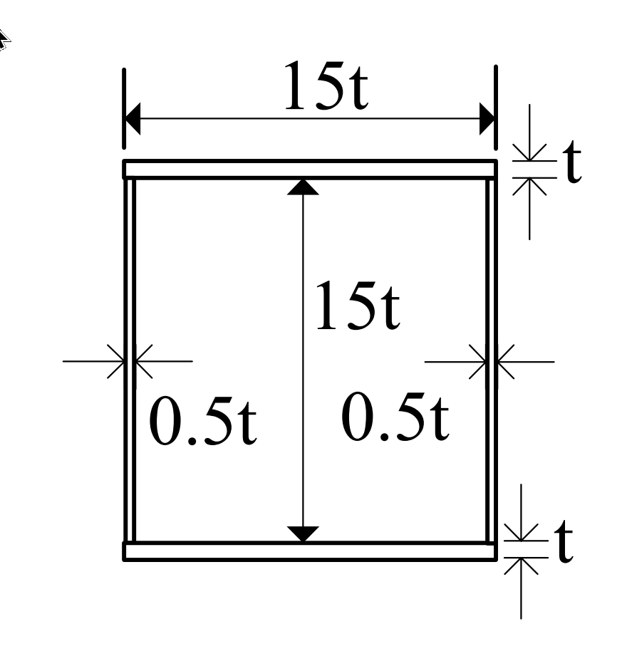
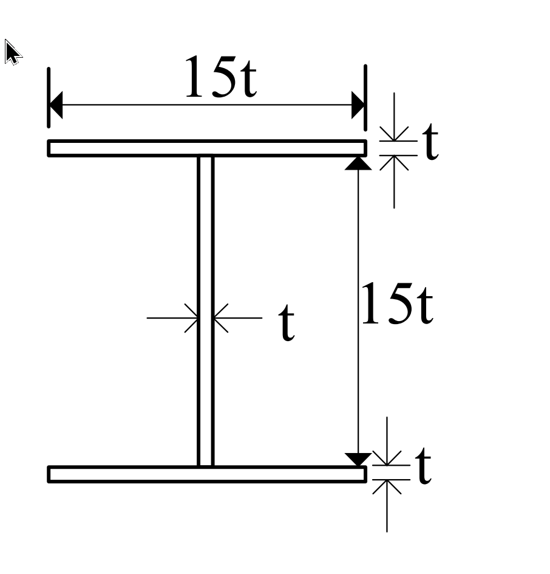

# 考題編號：MM-2006-1

**主分類：** `MM-U2-3` 扭力桿件斷面應力計算
**副分類：** `MM-U3-3` 扭力桿件變位及內力分析
**分析法：** 彈性分析
**標籤：** `薄壁斷面扭轉` `箱形斷面` `H形斷面` `Bredt公式` `開口vs閉口` `扭轉角` `最大剪應力` `剪力流`

---

## 1. 原始題目重述 (Problem Restatement)

一根長度為 $L$ 的受扭構材，兩端受純扭矩 $T$，材料剪力模數為 $G$。比較**材料用量相同**的兩種薄壁斷面：

**(一) 箱形斷面（閉口）：**

*圖說：箱形斷面，中線尺寸寬 = 高 = 15t。上、下翼板厚度均為 $t$；左、右腹板厚度均為 $0.5t$。斷面積 = $2(15t \cdot t) + 2(15t \cdot 0.5t) = 45t^2$。*

**(二) H 形斷面（開口）：**

*圖說：H形（工字）開口薄壁斷面。上、下翼板各寬 $15t$、厚 $t$；腹板高 $15t$、厚 $t$。斷面積 = $3(15t \cdot t) = 45t^2$（與箱形相同）。*

**求：** 各斷面兩端相對扭轉角 $\phi$ 及最大剪應力 $\tau_{max}$。

---

## 2. 考題核心精神與出題者意圖 (Core Concepts & Examiner's Intent)

**核心觀念：** 閉口薄壁 vs 開口薄壁在受扭時的天壤之別。

出題者設計相同材料用量的兩種斷面，目的是讓考生理解：

- **閉口斷面（箱形）**：剪力流形成封閉迴路，可以高效地抵抗扭矩。
- **開口斷面（H形）**：無封閉迴路，抗扭剛度極低，剪應力也大得多。

兩題分別測試 Bredt 公式（閉口）和開口薄壁扭轉公式，同時用材料用量相等的條件，讓量化比較直觀清晰。這是台灣結構技師考試扭轉題的經典命題模式。

---

## 3. 解題戰略地圖與陷阱分析 (Strategic Roadmap & Trap Analysis)

**作戰計畫：**
1. 確認兩斷面材料用量相等（驗證題目設定）
2. 箱形（閉口）→ Bredt 公式求 $q$、$\tau_{max}$、$\phi$
3. H形（開口）→ $J = \frac{1}{3}\sum b_i t_i^3$，再求 $\tau_{max}$、$\phi$

**關鍵陷阱：**

| 陷阱 | 說明 | 應對 |
|------|------|------|
| ① 最大剪應力位置 | 箱形閉口斷面最大剪應力在**最薄壁**（$0.5t$），不是最長邊 | $\tau = q/t$，$q$ 均勻，$t$ 越小 $\tau$ 越大 |
| ② 開口斷面公式誤用 | H形開口不可用 Bredt 公式（Bredt 僅適用閉口斷面） | 開口用 $J = \frac{1}{3}\sum b_i t_i^3$ |
| ③ 閉口周長積分 | $\oint ds/t$ 分母是各段實際壁厚，腹板 $0.5t$ 勿誤用為 $t$ | 分段計算，垂直腹板段代入 $0.5t$ |
| ④ 中線尺寸 | 閉口斷面 $A_m$ 取中線包圍面積，即 $(15t)^2$，不是外尺寸 | 薄壁假設下以中線計算 |

---

## 3.5 變數層次分析（Variable Hierarchy Analysis）

> 複習提示：第一次解題後，在每個卡住的知識點旁標記 `⚠`；第二次複習時只看有 `⚠` 的項目。

### 最終目標

`求箱形（閉口）與H形（開口）薄壁斷面各自的兩端相對扭轉角 φ 及最大剪應力 τ_max`

### 本題關鍵公式（依計算順序）

> $\boxed{\cdot}$ = 需由前步驟推導，非題目直接給定

**箱形（閉口）：**

$$\text{Step 1: } A_m = 15t \times 15t = 225t^2$$

$$\text{Step 2: } q = \frac{T}{2\boxed{A_m}} = \frac{T}{450t^2}$$

$$\text{Step 3: } \tau_{max} = \frac{\boxed{q}}{t_{min}} = \frac{T}{225t^3}$$

$$\text{Step 4: } \oint \frac{ds}{t} = \frac{2 \times 15t}{t} + \frac{2 \times 15t}{0.5t} = 90$$

$$\text{Step 5: } \phi_{box} = \frac{TL}{4G\boxed{A_m}^2} \cdot \oint \frac{ds}{t} = \frac{TL}{2250Gt^4}$$

**H形（開口）：**

$$\text{Step 1: } J_H = \frac{1}{3}\sum b_i t_i^3 = \frac{1}{3}(3 \times 15t \times t^3) = 15t^4$$

$$\text{Step 2: } \tau_{max,H} = \frac{T \cdot t_{max}}{\boxed{J_H}} = \frac{T}{15t^3}$$

$$\text{Step 3: } \phi_H = \frac{TL}{G\boxed{J_H}} = \frac{TL}{15Gt^4}$$

### L1：題目直接給定

| 符號 | 數值 | 說明 |
|------|------|------|
| $L$ | $L$ | 構材長度 |
| $T$ | $T$ | 兩端純扭矩 |
| $G$ | $G$ | 剪力模數 |
| 箱形中線尺寸 | $15t \times 15t$ | 寬 = 高 = $15t$ |
| 箱形翼板厚 | $t$ | 上下水平板 |
| 箱形腹板厚 | $0.5t$ | 左右垂直板 |
| H形翼板寬 | $15t$，厚 $t$ | 上下兩片 |
| H形腹板高 | $15t$，厚 $t$ | 中間一片 |

### L2：需知識點推導

**Step A（箱形）：閉口斷面 Bredt 分析**

| 符號 | 公式/來源 | 卡關? |
|------|----------|:-----:|
| $A_m$ | 中線包圍面積 $= (15t)^2 = 225t^2$ | |
| $q$ | Bredt：$T / (2A_m)$ | |
| $\tau_{max}$ | $q / t_{min}$（$t_{min} = 0.5t$，腹板） | |
| $\oint ds/t$ | 分段：$2(15t/t) + 2(15t/0.5t) = 30 + 60 = 90$ | |
| $\phi_{box}$ | $\frac{TL}{4GA_m^2}\oint\frac{ds}{t} = \frac{90TL}{4G(225t^2)^2}$ | |

**Step B（H形）：開口薄壁斷面分析**

| 符號 | 公式/來源 | 卡關? |
|------|----------|:-----:|
| $J_H$ | $\frac{1}{3}\sum b_i t_i^3$，三段均 $b=15t$，$t_i=t$ | |
| $\tau_{max,H}$ | $T \cdot t_{max} / J_H$（$t_{max} = t$） | |
| $\phi_H$ | $TL / (GJ_H)$ | |

### L3：深層知識（不懂就卡住）

| 知識點 | 說明 | 卡關? |
|--------|------|:-----:|
| Bredt 公式適用條件 | 僅適用**單閉室**薄壁閉口截面；開口截面剪力流非封閉迴路，不能用 | |
| 開口斷面剪應力分布 | 開口薄壁的最大剪應力 $\tau = Tt/J$，沿壁厚線性分布（表面最大）；方向沿厚度翻轉 | |
| 閉口 $J_{eff}$ 推導 | $J_{eff} = 4A_m^2 / \oint(ds/t)$，由 $\phi = TL/(GJ_{eff})$ 等效定義 | |
| 開口 vs 閉口差距 | 本題 $\phi_H / \phi_{box} = 150$，$\tau_H / \tau_{box} = 15$，說明閉口在抗扭上的壓倒性優勢 | |

---

## 4. 步驟化詳細計算過程 (Step-by-Step Detailed Calculation)

### 前置確認：材料用量相等

**箱形斷面積：**
$$A_{box} = 2(15t \cdot t) + 2(15t \cdot 0.5t) = 30t^2 + 15t^2 = 45t^2$$

**H形斷面積：**
$$A_H = 2(15t \cdot t) + 1(15t \cdot t) = 30t^2 + 15t^2 = 45t^2 \checkmark$$

---

### (一) 箱形斷面（閉口薄壁）

**Step 1：中線包圍面積**

$$A_m = 15t \times 15t = 225t^2$$

**Step 2：剪力流（均勻，閉口斷面）**

$$q = \frac{T}{2A_m} = \frac{T}{2 \times 225t^2} = \frac{T}{450t^2}$$

**Step 3：最大剪應力**

最薄壁為左右腹板（厚 $0.5t$），剪應力最大：

$$\boxed{\tau_{max,box} = \frac{q}{t_{min}} = \frac{T/(450t^2)}{0.5t} = \frac{T}{225t^3}}$$

（翼板剪應力 $\tau_{flange} = q/t = T/(450t^3)$，為腹板剪應力的一半）

**Step 4：周長線積分**

$$\oint \frac{ds}{t} = \underbrace{\frac{2 \times 15t}{t}}_{\text{上下翼板}} + \underbrace{\frac{2 \times 15t}{0.5t}}_{\text{左右腹板}} = 30 + 60 = 90$$

**Step 5：兩端相對扭轉角**

$$\phi_{box} = \frac{TL}{4GA_m^2}\oint\frac{ds}{t} = \frac{TL \times 90}{4G \times (225t^2)^2}$$

$$= \frac{90TL}{4G \times 50625t^4} = \frac{90TL}{202500Gt^4}$$

$$\boxed{\phi_{box} = \frac{TL}{2250\,Gt^4}}$$

等效抗扭常數：$J_{eff,box} = 4A_m^2 / \oint(ds/t) = 4(225t^2)^2 / 90 = 2250t^4$

---

### (二) H 形斷面（開口薄壁）

**Step 1：開口薄壁抗扭常數**

H形由三個矩形薄板組成，各板尺寸：

| 元件 | 長度 $b$ | 厚度 $t_i$ | $bt_i^3$ |
|------|---------|----------|---------|
| 上翼板 | $15t$ | $t$ | $15t^4$ |
| 腹板 | $15t$ | $t$ | $15t^4$ |
| 下翼板 | $15t$ | $t$ | $15t^4$ |

$$J_H = \frac{1}{3}\sum b_i t_i^3 = \frac{1}{3}(15t^4 + 15t^4 + 15t^4) = \frac{1}{3} \times 45t^4 = 15t^4$$

**Step 2：最大剪應力**

開口薄壁斷面最大剪應力公式 $\tau = T \cdot t / J$，各元件厚度均為 $t$：

$$\boxed{\tau_{max,H} = \frac{T \cdot t}{J_H} = \frac{T \cdot t}{15t^4} = \frac{T}{15t^3}}$$

（剪應力沿壁厚線性分布，板面最大，中線為零）

**Step 3：兩端相對扭轉角**

$$\boxed{\phi_H = \frac{TL}{GJ_H} = \frac{TL}{15\,Gt^4}}$$

---

### 彙整與比較

| 項目 | 箱形（閉口） | H 形（開口） | 比值 $H/box$ |
|------|:----------:|:----------:|:-----------:|
| 最大剪應力 | $\dfrac{T}{225t^3}$ | $\dfrac{T}{15t^3}$ | **15 倍** |
| 扭轉角 | $\dfrac{TL}{2250Gt^4}$ | $\dfrac{TL}{15Gt^4}$ | **150 倍** |

> 相同材料用量下，開口斷面的扭轉角是閉口的 **150 倍**，最大剪應力是 **15 倍**。這是結構工程師選擇封閉斷面承受扭矩的根本原因。

---

## 5. 關鍵爭議點與進階探討 (Critical Issues & Advanced Discussion)

### 5.1 「15t」是外尺寸還是中線尺寸？

本題圖示標示「15t」通常理解為**中線尺寸（median-line dimension）**，這是薄壁斷面分析的標準假設。若視為外尺寸，則中線高度約為 $15t - t = 14t$（腹板方向），需修正，但在考試題目中差異通常忽略不計，以題目圖示的標示值為準。

### 5.2 H形斷面的翹曲問題

開口薄壁斷面受扭時，除了 St. Venant 扭矩外，還有**翹曲扭矩（warping torsion）**的貢獻。本題假設為純扭矩且未考慮翹曲效應，是材料力學課程層次的標準簡化。在鋼結構設計中（尤其工字梁），翹曲效應不可忽略。

### 5.3 實務意涵

閉口斷面在抗扭方面的壓倒性優勢（本題差距達 15∼150 倍）說明：
- 鋼結構受扭構件應優先採用箱型、圓管等閉口截面
- 工字形樑段若需承受較大扭矩，必須採取加勁措施（如端板、橫向加勁板）
