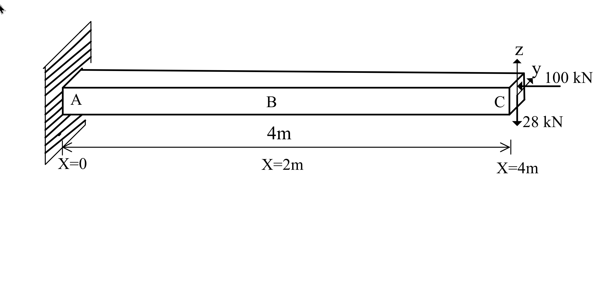
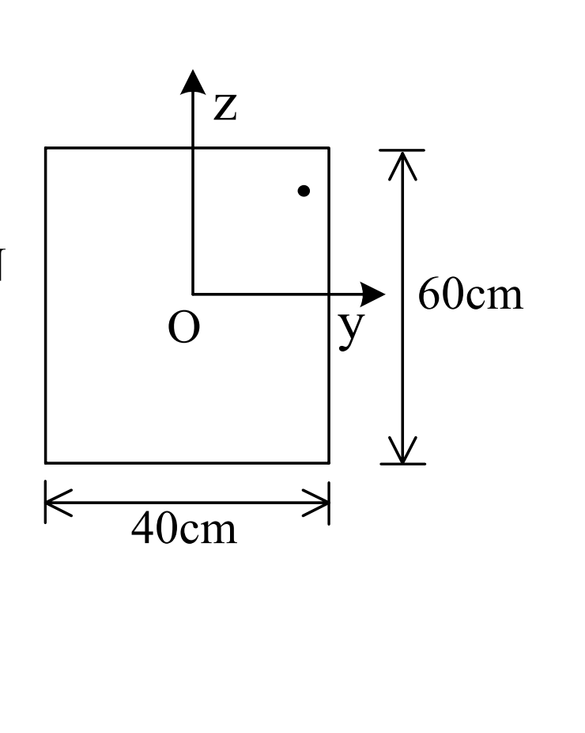

# 考題編號：MM-2006-2

**主分類：** `MM-U2-1` 軸力桿件斷面應力計算
**副分類：** `MM-U2-2` 梁桿件斷面應力計算
**分析法：** 彈性分析
**標籤：** `偏心軸壓` `雙軸彎曲` `中性軸方程式` `懸臂梁` `組合應力` `矩形斷面` `最大正向應力` `核心距`

---

## 1. 原始題目重述 (Problem Restatement)

一悬臂梁（固定端 A 在 $X=0$，自由端 C 在 $X=4$ m）：
- 梁長 4 m，梁寬 $b = 40$ cm（$y$ 方向），梁深 $h = 60$ cm（$z$ 方向）
- 斷面形心 O 在斷面中心；$y$ 軸水平向右，$z$ 軸垂直向上

**載重（均作用於自由端 C，$X = 4$ m）：**
- 偏心軸壓 $P = 100$ kN，作用點在 $(y_0, z_0) = (16\text{ cm},\ 20\text{ cm})$（形心右上方）
- 向下集中力 $Q = 28$ kN，作用於斷面形心 O

*圖說：懸臂梁全長 4 m，B 斷面位於跨中 X=2 m 處。偏心軸壓 100 kN 之作用點座標 $y_0=16$ cm（距右邊緣 4 cm）、$z_0=20$ cm（距頂面 10 cm）。28 kN 向下力無偏心，作用於形心 O。*

*圖說：矩形斷面 $b=40$ cm，$h=60$ cm。$y$ 範圍 $-20 \sim +20$ cm；$z$ 範圍 $-30 \sim +30$ cm。四角點：右上 $(+20,+30)$、左上 $(-20,+30)$、左下 $(-20,-30)$、右下 $(+20,-30)$。*

**求（B 斷面 $X=2$ m 處）：**
- （一）中性軸方程式
- （二）最大軸拉應力與最大軸壓應力 $\sigma_x$ 及其位置（$y$、$z$ 座標）

---

## 2. 考題核心精神與出題者意圖 (Core Concepts & Examiner's Intent)

**核心觀念：** 多載重疊加下的正向應力分析，以及中性軸從形心偏移的理解。

本題測試三件事：
1. 將偏心軸力分解為「形心軸力 + 雙軸彎矩」的能力
2. 能否正確疊加三個應力貢獻（均勻壓縮、y-偏心彎矩、z-偏心彎矩+Q彎矩），寫出線性應力方程
3. 理解線性應力場的極值必定在矩形角點，以及如何判斷哪個角點最危險

偏心壓力在$(y_0=16, z_0=20)$（右上偏心），加上下彎矩，使右上角點承受最大壓力；左下角點（最遠對角）承受最大拉力。

---

## 3. 解題戰略地圖與陷阱分析 (Strategic Roadmap & Trap Analysis)

**作戰計畫：**
1. 計算斷面性質 $A$、$I_y$、$I_z$
2. 分析 B 斷面的內力（N、$M_y$、$M_z$）——共三個貢獻來源
3. 寫出應力公式 $\sigma_x = N/A + M_y z/I_y + M_z y/I_z$
4. 令 $\sigma_x = 0$，求中性軸方程式
5. 計算四個角點的應力，找最大拉與最大壓

**關鍵陷阱：**

| 陷阱 | 說明 | 應對 |
|------|------|------|
| ① 偏心力的彎矩方向 | 壓力在 $z_0>0$（上方）→ 使頂部更壓縮 → $M_y = -P z_0 < 0$ | 用「壓在哪裡就讓那裡更壓」的物理直覺確認符號 |
| ② 28 kN 的彎矩方向 | 懸臂梁向下力 → 頂部受壓（hogging）→ $M_y < 0$ | hogging 為負，代入後頂部 $\sigma < 0$ ✓ |
| ③ My vs Mz 混用 | $M_y$ 是繞 $y$ 軸（控制 $z$ 方向的彎曲）；$M_z$ 繞 $z$ 軸（控制 $y$ 方向） | $\sigma = M_y z / I_y + M_z y / I_z$，指標對應要清楚 |
| ④ 28 kN 為橫向力 | 28 kN 向下力只產生 $M_y$（繞 $y$ 軸彎矩），不產生 $M_z$ | 橫向力無 $y$ 偏心，不引起 $M_z$ |

---

## 3.5 變數層次分析（Variable Hierarchy Analysis）

> 複習提示：第一次解題後，在每個卡住的知識點旁標記 `⚠`；第二次複習時只看有 `⚠` 的項目。

### 最終目標

`求 B 斷面中性軸方程式、最大拉應力與最大壓應力及其位置座標`

### 本題關鍵公式（依計算順序）

> $\boxed{\cdot}$ = 需由前步驟推導，非題目直接給定

$$\text{Step 1: } A = b \cdot h, \quad I_y = \frac{b h^3}{12}, \quad I_z = \frac{h b^3}{12}$$

$$\text{Step 2（偏心軸力）: } M_y^{(P)} = -P \cdot z_0, \quad M_z^{(P)} = -P \cdot y_0$$

$$\text{Step 3（28 kN 彎矩）: } M_y^{(Q)} = -Q \cdot (X_C - X_B) = -Q \times 200 \text{ cm}$$

$$\text{Step 4（疊加）: } M_y = \boxed{M_y^{(P)}} + \boxed{M_y^{(Q)}}, \quad M_z = \boxed{M_z^{(P)}}$$

$$\text{Step 5（應力公式）: } \sigma_x = \frac{N}{\boxed{A}} + \frac{\boxed{M_y} \cdot z}{\boxed{I_y}} + \frac{\boxed{M_z} \cdot y}{\boxed{I_z}}$$

$$\text{Step 6（中性軸）: } \sigma_x = 0 \Rightarrow ay + bz + c = 0$$

$$\text{Step 7（極值）: } \sigma_{max/min} \text{ 發生於四角點 } (\pm 20, \pm 30) \text{ 中}$$

### L1：題目直接給定

| 符號 | 數值 | 說明 |
|------|------|------|
| $L$ | 4 m | 梁長 |
| $b$ | 40 cm | 梁寬（y方向） |
| $h$ | 60 cm | 梁深（z方向） |
| $P$ | 100 kN | 偏心軸壓 |
| $y_0$ | 16 cm | P 的 y 偏心 |
| $z_0$ | 20 cm | P 的 z 偏心 |
| $Q$ | 28 kN（向下） | 形心橫向力 |
| $X_B$ | 2 m = 200 cm | B 斷面位置 |
| $X_C$ | 4 m = 400 cm | C 端位置 |

### L2：需知識點推導

**Step 1：斷面性質**

| 符號 | 公式/來源 | 卡關? |
|------|----------|:-----:|
| $A$ | $40 \times 60 = 2400$ cm² | |
| $I_y$ | $\frac{40 \times 60^3}{12} = 720{,}000$ cm⁴ | |
| $I_z$ | $\frac{60 \times 40^3}{12} = 320{,}000$ cm⁴ | |

**Step 2：B 斷面各載重引起之內力**

| 來源 | $N$ (kN) | $M_y$ (kN·cm) | $M_z$ (kN·cm) |
|------|--------|--------------|--------------|
| 偏心壓力 $P$ | $-100$ | $-P z_0 = -2000$ | $-P y_0 = -1600$ |
| 向下力 $Q$（arm = 200 cm）| 0 | $-Q \times 200 = -5600$ | 0 |
| **合計** | $-100$ | $-7600$ | $-1600$ |

| 符號 | 公式/來源 | 卡關? |
|------|----------|:-----:|
| $N = -100$ kN | 壓力直接傳遞至全截面 | |
| $M_y^{(P)} = -P z_0$ | 偏心壓力在 $z_0>0$ → hogging about y | |
| $M_z^{(P)} = -P y_0$ | 偏心壓力在 $y_0>0$ → 右側更壓縮 | |
| $M_y^{(Q)} = -Q \times 200$ | 28 kN 向下，B 至 C 距離 200 cm，懸臂→ hogging | |

**Step 3：應力方程**

| 符號 | 公式/來源 | 卡關? |
|------|----------|:-----:|
| $\sigma_x$ | $N/A + M_y z/I_y + M_z y/I_z$（疊加原理） | |
| 中性軸 | 令 $\sigma_x = 0$，整理 $ay + bz + c = 0$ | |
| $\sigma_{max/min}$ | 線性 $\sigma_x(y,z)$ 極值必在角點 | |

### L3：深層知識（不懂就卡住）

| 知識點 | 說明 | 卡關? |
|--------|------|:-----:|
| 偏心壓力的彎矩符號 | 壓力 $P$ 在 $z_0>0$，等效 $M_y = -P z_0$（負值→頂部更壓縮）；若忘記負號，頂部反而算成拉力 | |
| 懸臂梁 hogging 符號 | 自由端向下荷重 → B 斷面 hogging → $M_y < 0$（頂部壓縮） | |
| 線性應力場的極值位置 | 矩形斷面線性正向應力的最大、最小值必在四個角點（平面函數在凸多邊形上的極值在頂點） | |
| 中性軸不過形心 | 有軸力（$N \ne 0$）時，中性軸偏離形心；本題所有載重都使右上更壓縮，所以中性軸在左下方 | |

---

## 4. 步驟化詳細計算過程 (Step-by-Step Detailed Calculation)

### Step 1：斷面性質

$$A = b \times h = 40 \times 60 = 2400 \text{ cm}^2$$

$$I_y = \frac{b h^3}{12} = \frac{40 \times 60^3}{12} = \frac{40 \times 216000}{12} = 720{,}000 \text{ cm}^4$$

$$I_z = \frac{h b^3}{12} = \frac{60 \times 40^3}{12} = \frac{60 \times 64000}{12} = 320{,}000 \text{ cm}^4$$

**斷面邊界：** $y \in [-20, +20]$ cm，$z \in [-30, +30]$ cm

---

### Step 2：B 斷面（$X = 2$ m）內力分析

#### (a) 偏心軸壓 $P = 100$ kN 在 $(y_0=16,\ z_0=20)$

偏心壓力等效為形心處的**軸力 + 雙軸彎矩**：

$$N = -P = -100 \text{ kN}$$

$$M_y^{(P)} = -P \cdot z_0 = -100 \times 20 = -2000 \text{ kN·cm}$$

（負值：$z_0>0$ 使頂部更壓，故 $M_y < 0$）

$$M_z^{(P)} = -P \cdot y_0 = -100 \times 16 = -1600 \text{ kN·cm}$$

（負值：$y_0>0$ 使右側更壓，故 $M_z < 0$）

> **策略註解：** 偏心壓力 $P$ 在偏心位置 $(y_0, z_0)$ 處引起的等效彎矩為 $M_y = -Pz_0$、$M_z = -Py_0$（負號源自：壓力使偏心方向的纖維更受壓）。

#### (b) 向下力 $Q = 28$ kN 在形心（$y_0=0, z_0=0$）

橫向力在形心作用，只產生繞 $y$ 軸的彎矩（無 $y$ 偏心故不產生 $M_z$）。

懸臂梁（固端 A 在左，載重在 C 端）：B 斷面（$X=2$ m）至 C 端距離 = 200 cm，彎矩為 **hogging**：

$$M_y^{(Q)} = -Q \times (X_C - X_B) = -28 \times 200 = -5600 \text{ kN·cm}$$

（負值：向下力使頂部受壓，hogging 取負號）

#### (c) 疊加：B 斷面總內力

$$N = -100 \text{ kN}$$

$$M_y = M_y^{(P)} + M_y^{(Q)} = -2000 + (-5600) = -7600 \text{ kN·cm}$$

$$M_z = M_z^{(P)} = -1600 \text{ kN·cm}$$

---

### Step 3：正向應力公式

$$\sigma_x(y, z) = \frac{N}{A} + \frac{M_y \cdot z}{I_y} + \frac{M_z \cdot y}{I_z}$$

$$= \frac{-100}{2400} + \frac{(-7600) \cdot z}{720000} + \frac{(-1600) \cdot y}{320000}$$

$$= -\frac{1}{24} - \frac{19}{1800} z - \frac{1}{200} y \quad \text{（kN/cm²；}y, z \text{ 以 cm 代入）}$$

---

### Step 4（一）：中性軸方程式

令 $\sigma_x = 0$：

$$-\frac{1}{24} - \frac{19}{1800} z - \frac{1}{200} y = 0$$

兩邊乘以 $-1800$：

$$75 + 19z + 9y = 0$$

$$\boxed{9y + 19z + 75 = 0}$$

**中性軸截距驗算：**

| 令 | 求得 | 說明 |
|---|------|------|
| $y = 0$ | $z = -75/19 \approx -3.95$ cm | 中性軸在形心以下 |
| $z = 0$ | $y = -75/9 \approx -8.33$ cm | 中性軸在形心以左 |

> 中性軸在左下方通過斷面，截距均為負值，與載重分析一致（所有載重均使右上方更壓縮，中性軸向左下偏移）。

---

### Step 5（二）：最大拉壓應力

$\sigma_x(y,z)$ 為線性函數，極值必在四角點：

| 角點 | $y$ (cm) | $z$ (cm) | $\sigma_x$ (kN/cm²) |
|------|--------|--------|------------------|
| 右上 | $+20$ | $+30$ | $-\frac{1}{24} - \frac{19 \times 30}{1800} - \frac{20}{200} = -\frac{5}{120} - \frac{38}{120} - \frac{12}{120} = -\frac{55}{120}$ |
| 左上 | $-20$ | $+30$ | $-\frac{1}{24} - \frac{19 \times 30}{1800} + \frac{20}{200} = -\frac{5}{120} - \frac{38}{120} + \frac{12}{120} = -\frac{31}{120}$ |
| 左下 | $-20$ | $-30$ | $-\frac{1}{24} + \frac{19 \times 30}{1800} + \frac{20}{200} = -\frac{5}{120} + \frac{38}{120} + \frac{12}{120} = +\frac{45}{120}$ |
| 右下 | $+20$ | $-30$ | $-\frac{1}{24} + \frac{19 \times 30}{1800} - \frac{20}{200} = -\frac{5}{120} + \frac{38}{120} - \frac{12}{120} = +\frac{21}{120}$ |

**最大軸壓應力：**

$$\boxed{\sigma_{x,min} = -\frac{55}{120} = -\frac{11}{24} \approx -0.458 \text{ kN/cm}^2}$$

發生於**右上角點** $(y = +20\text{ cm},\ z = +30\text{ cm})$

**最大軸拉應力：**

$$\boxed{\sigma_{x,max} = +\frac{45}{120} = +\frac{3}{8} = +0.375 \text{ kN/cm}^2}$$

發生於**左下角點** $(y = -20\text{ cm},\ z = -30\text{ cm})$

---

### 結果彙整

| 項目 | 數值 | 位置 |
|------|------|------|
| 中性軸 | $9y + 19z + 75 = 0$ | 斜線，截距 $z=-3.95$ cm，$y=-8.33$ cm |
| 最大壓應力 | $-\dfrac{11}{24}$ kN/cm² $\approx -0.458$ kN/cm² | 右上角 $(+20,+30)$ cm |
| 最大拉應力 | $+\dfrac{3}{8}$ kN/cm² $= +0.375$ kN/cm² | 左下角 $(-20,-30)$ cm |

---

## 5. 關鍵爭議點與進階探討 (Critical Issues & Advanced Discussion)

### 5.1 為何最大壓應力在右上角而非其他位置？

三個應力貢獻在右上角 $(+20, +30)$ 全部疊加為壓縮：
- 均勻壓縮：$-1/24$ kN/cm²（負）
- $z_0=20$ 偏心：頂部 $(z>0)$ 更壓縮（負）
- $y_0=16$ 偏心：右側 $(y>0)$ 更壓縮（負）
- 28 kN 向下：頂部 hogging 更壓縮（負）

四者同號疊加 → 右上角是最危險壓縮點。

### 5.2 中性軸的核心距概念

對於僅有偏心軸力（無橫向力）的情況，若偏心點 $(y_0, z_0)$ 在「核心（kern）」範圍內，則斷面不出現拉應力。矩形斷面的核心為以形心為中心的菱形，長軸範圍為 $\pm h/6$（$z$ 方向）和 $\pm b/6$（$y$ 方向）。本題加入了橫向力 28 kN，使得即使無偏心力作用，彎矩也會使斷面同時出現拉壓。

### 5.3 考場驗算技巧

線性應力場的極值一定在角點，只需計算 4 個角點即可，不必逐點掃描。中性軸的截距驗算（$z_0$ 和 $y_0$ 截距均在合理範圍內）是防止計算錯誤的快速檢查。
