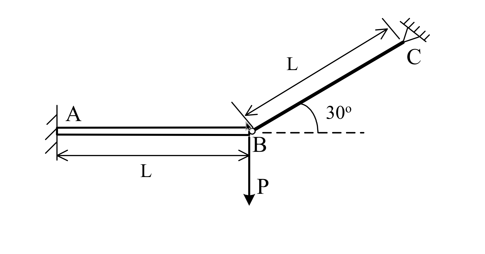

# 考題編號：MM-2006-4

**主分類：** `MM-U4-1` 軸力桿件、扭力桿件與梁之塑性分析
**副分類：** `MM-U3-2` 梁桿件變位及內力分析
**分析法：** 彈塑性分析
**標籤：** `彈塑性分析` `靜不定結構` `塑性鉸` `二力桿` `梁桿組合` `降伏載重` `極限載重` `力法` `變形諧和` `彈性完全塑性`

---

## 1. 原始題目重述 (Problem Restatement)



*圖說：懸臂梁 AB 長度 $L$，A 端固定（固定支承）；二力桿 BC 長度 $L$，與水平面成 30° 角，C 端為固定鉸支承（上方）；向下集中載重 $P$ 作用於 B 點。材料均為彈性完全塑性（elastic-perfectly plastic）、具極佳韌性之鋼材，楊氏模數 $E$、降伏強度 $F_y$。梁之斷面二次矩為 $I$、塑性彎矩為 $M_p$；二力桿斷面積為 $A$。*

**已知條件：**

$$\frac{EA}{L} = \frac{36EI}{L^3} \quad \Rightarrow \quad EA = \frac{36EI}{L^2}$$

$$A F_y = \frac{9M_p}{L}$$

- 梁之軸向變形可忽略不計
- 不考慮梁之軸力對彎矩強度 $M_p$ 的影響

**求：**

**(一)** 結構恰好達**降伏狀態**時的外力 $P_y$ 及 B 點向下位移 $\Delta_y$（以 $EI$、$L$ 及 $M_p$ 表示）

**(二)** 結構恰好達**極限狀態**時的外力 $P_u$ 及 B 點向下位移 $\Delta_u$；並繪出梁之彎矩圖與二力桿之軸力圖

---

## 2. 考題核心精神與出題者意圖 (Core Concepts & Examiner's Intent)

**核心觀念：** 梁-桿組合靜不定結構的兩階段彈塑性分析。

本題測試三件事：
1. 能否正確建立一次靜不定結構的彈性分析（力法：T 為贅力）
2. 能否判斷哪個元件先降伏，並知道其後的釋放結構（靜定化）
3. 能否利用靜定結構的平衡求極限載重，並以 BC 的彈性伸長量求出 $\Delta_u$

**出題意圖：** 考驗考生是否理解「第一次降伏 ≠ 極限狀態」，結構因塑性鉸的形成而由一次靜不定退化為靜定，仍能承載更多荷重，直到第二個塑性元素（BC 降伏）才真正形成崩潰機制。

---

## 3. 解題戰略地圖與陷阱分析 (Strategic Roadmap & Trap Analysis)

**作戰計畫：**

**Phase 1（彈性分析）：**
1. 以二力桿軸力 $T$ 為贅力（1 次靜不定）
2. 建立 B 點位移諧和條件，解出 $T = f(P)$ 及 $\delta = f(P)$
3. 分別計算梁 A 端降伏（$M_A = M_p$）及二力桿降伏（$T = AF_y$）所需的 P，取小者為 $P_y$

**Phase 2（塑性鉸已形成，P_y → P_u）：**
4. 梁 A 端形成塑性鉸，結構退化為靜定（$M_A = M_p$ 不變）
5. 由靜力平衡直接解出 $T = f(P)$
6. 當 $T = AF_y$ 時，BC 降伏 → 崩潰機制 → 求 $P_u$
7. Phase 2 的附加位移由 BC 彈性伸長量（$\Delta T \times L/EA$）除以 $\sin 30°$ 求得

**關鍵陷阱：**

| 陷阱 | 說明 | 應對 |
|------|------|------|
| ① BC 與 B 點位移的幾何關係 | BC 不是垂直桿，須投影：$\Delta_{BC} = \delta_B \sin 30° = \delta_B / 2$ | 用 BC 方向的單位向量與 B 點位移向量做內積 |
| ② Phase 2 的位移計算 | Phase 2 中梁的彎矩分佈固定，梁彈性變形不再增加；附加位移只來自 BC 的彈性伸長 | 僅計算 $\Delta T = T_u - T_y$，再換算為 B 點位移 |
| ③ 先降伏的是梁還是桿 | 彈性階段 $T = 3P/2$，分別算梁 A 端降伏（$P = 4M_p/L$）和桿降伏（$P = 6M_p/L$），取小者 | 本題梁先降伏 |
| ④ Phase 2 BMD | 塑性鉸後，$M(A) = M_p$（保持不變），$M(B) = 0$，線性分佈 | 用靜力矩平衡驗算 |
| ⑤ 極限分析中的 Virtual Work | 可用虛功原理驗算：$P_u \cdot \delta = M_p \cdot \alpha + AF_y \cdot \Delta_{BC}$ | 提供獨立驗算途徑 |

---

## 3.5 變數層次分析（Variable Hierarchy Analysis）

> 複習提示：第一次解題後，在每個卡住的知識點旁標記 `⚠`；第二次複習時只看有 `⚠` 的項目。

### 最終目標

```
(一) Py（梁或桿首先降伏的載重）、Δy（B 點對應位移）
(二) Pu（崩潰極限載重）、Δu（B 點對應位移）、梁彎矩圖、桿軸力圖
```

### 本題關鍵公式（依計算順序）

> $\boxed{\cdot}$ = 需由前步驟推導，非題目直接給定

**Phase 1（彈性）：**

$$\text{幾何諧和: } \Delta_{BC} = \delta_B \cdot \sin 30° = \frac{\delta_B}{2}$$

$$\text{桿軸力: } T = \frac{EA}{L} \cdot \Delta_{BC} = \frac{EA}{2L}\,\delta_B$$

$$\text{梁尖端等效荷載: } F_{net} = P - T\sin 30° = P - \frac{T}{2}$$

$$\text{懸臂梁剛度: } \delta_B = \frac{F_{net} \cdot L^3}{3EI} \quad \Rightarrow \quad \boxed{P = \frac{12EI}{L^3}\,\delta_B}$$

$$\text{彈性內力: } \boxed{T = \frac{3P}{2}}, \quad M_A = \frac{PL}{4}$$

**Phase 2（塑性鉸後靜定平衡）：**

$$\text{矩 A 點力矩平衡: } P \cdot L - \frac{T}{2} \cdot L = M_p \quad \Rightarrow \quad \boxed{T = 2P - \frac{2M_p}{L}}$$

$$\text{BC 降伏時: } T = AF_y = \frac{9M_p}{L} \quad \Rightarrow \quad \boxed{P_u = \frac{11M_p}{2L}}$$

$$\text{Phase 2 附加位移: } \Delta\delta = \frac{\Delta T \cdot L/EA}{\sin 30°} = \frac{2\Delta T \cdot L}{EA}$$

### L1：題目直接給定

| 符號 | 數值 | 說明 |
|------|------|------|
| $L$ | $L$ | 梁與桿之長度（相同） |
| $E$, $I$ | 給定 | 楊氏模數、梁斷面二次矩 |
| $M_p$ | 給定 | 梁之塑性彎矩 |
| $A$ | 給定 | 二力桿斷面積 |
| $F_y$ | 給定 | 降伏強度 |
| BC 傾角 | 30° | 與水平面夾角 |
| $EA/L$ | $36EI/L^3$ | 桿件軸向勁度關係 |
| $AF_y$ | $9M_p/L$ | 桿件降伏軸力關係 |

### L2：需知識點推導

**Phase 1：彈性分析**

| 符號 | 公式/來源 | 卡關? |
|------|----------|:-----:|
| $\Delta_{BC}$ | 幾何投影：$\delta_B \sin 30° = \delta_B / 2$ | |
| $T$ | 桿件虎克定律：$(EA/L) \times \Delta_{BC}$ | |
| $P = f(\delta_B)$ | 懸臂梁剛度 + 桿件垂直分力，代入諧和得 $P = 12EI\delta_B/L^3$ | |
| $T = 3P/2$ | 代入 $EA = 36EI/L^2$ 化簡 | |
| $M_A = PL/4$ | 懸臂梁：淨垂直荷載 $P - T/2 = P/4$，$M_A = (P/4)L$ | |

**Phase 2：靜定結構平衡**

| 符號 | 公式/來源 | 卡關? |
|------|----------|:-----:|
| $T = 2P - 2M_p/L$ | 對 A 點取矩：$PL - TL/2 = M_p$ | |
| $V_A = M_p/L$ | 垂直方向：$V_A = P - T/2 = M_p/L$（常數） | |
| $P_u$ | $T = AF_y = 9M_p/L$ 代入 Phase 2 平衡式 | |
| $\Delta\delta_{BC}$ | $\Delta T \times L/(EA)$，$\Delta T = 3M_p/L$ | |
| $\Delta\delta_B$ | $\Delta\delta_{BC}/\sin 30° = 2\Delta\delta_{BC}$ | |
| $\delta_u$ | $\delta_y + \Delta\delta_B$ | |

### L3：深層知識（不懂就卡住）

| 知識點 | 說明 | 卡關? |
|--------|------|:-----:|
| 一次靜不定的力法 | 釋放一個約束（取 $T$ 為贅力），相容條件求 $T$；完整流程：靜力平衡 + 幾何諧和 + 組成律 | |
| 塑性鉸與靜定化 | 固定端形成塑性鉸 → 原 3 個固定端反力降為 2 個（釋放一個力矩約束）→ 一次靜不定 → 靜定 | |
| Phase 2 位移只由 BC 貢獻 | 塑性鉸後梁的彎矩分佈不變（$M(x) = M_p(1 - x/L)$，固定），梁的彈性彎曲變形凍結；附加位移=BC的附加伸長除以 $\sin 30°$ | |
| 崩潰機制判斷 | 一次靜不定結構需要 2 個塑性元素才能崩潰：①梁 A 端塑性鉸 + ② BC 降伏 | |
| 虛功原理驗算 | $P_u \cdot L\alpha = M_p \cdot \alpha + AF_y \cdot (L\alpha \sin 30°)$，$\alpha$ 消去後得 $P_u L = M_p + 9M_p/2 = 11M_p/2$ | |

---

## 4. 步驟化詳細計算過程 (Step-by-Step Detailed Calculation)

### 前置確認：靜不定度

結構組成：
- 固定端 A：提供 $H_A$、$V_A$、$M_A$（3 個反力）
- 固定鉸 C（二力桿 BC）：提供 $T$（1 個未知量，桿方向）
- 靜力平衡方程：3 個

靜不定度 = $(3 + 1) - 3 = 1$（一次外靜不定）

取二力桿軸力 $T$（拉力為正）為贅力。

---

### Phase 1：彈性分析

#### Step 1：幾何諧和條件

設 B 點向下位移為 $\delta$（向下為正）。BC 長度為 $L$，與水平面成 30°，C 固定。

B 點位移向量（向下）與 BC 方向（B 指向 C：右上方，水平角 30°）的投影：

$$\Delta_{BC} = \delta \cdot \sin 30° = \frac{\delta}{2} \quad \text{（BC 伸長，拉力）}$$

#### Step 2：桿件力-變形關係

$$T = \frac{EA}{L} \cdot \Delta_{BC} = \frac{EA}{L} \cdot \frac{\delta}{2} = \frac{EA\,\delta}{2L}$$

#### Step 3：梁的平衡與撓度

B 點受力（垂直方向）：
- 向下：外力 $P$
- 向上：二力桿 BC 之垂直分力 $T\sin 30° = T/2$

有效淨垂直荷載（向下）：

$$F_{net} = P - \frac{T}{2}$$

懸臂梁（固定端 A，自由端 B）在尖端垂直集中荷載 $F_{net}$ 下：

$$\delta = \frac{F_{net} \cdot L^3}{3EI} = \frac{(P - T/2)\,L^3}{3EI}$$

#### Step 4：聯立求解

代入 Step 2：

$$T = \frac{EA}{2L}\,\delta = \frac{EA}{2L} \cdot \frac{(P - T/2)\,L^3}{3EI} = \frac{EAL^2}{6EI}\left(P - \frac{T}{2}\right)$$

令 $k = \dfrac{EAL^2}{6EI}$。代入已知 $EA = 36EI/L^2$：

$$k = \frac{(36EI/L^2) \cdot L^2}{6EI} = \frac{36EI}{6EI} = 6$$

解 $T$：

$$T = k\!\left(P - \frac{T}{2}\right) = 6P - 3T \quad \Rightarrow \quad 4T = 6P \quad \Rightarrow \quad \boxed{T = \frac{3P}{2}}$$

B 點位移：

$$\delta = \frac{(P - T/2)\,L^3}{3EI} = \frac{(P - 3P/4)\,L^3}{3EI} = \frac{P/4 \cdot L^3}{3EI} = \frac{PL^3}{12EI}$$

整體彈性勁度：

$$\boxed{P = \frac{12EI}{L^3}\,\delta}$$

梁 A 端彎矩（懸臂梁，尖端淨荷載 $P/4$，矩長 $L$，挾緊）：

$$M_A = \frac{P}{4} \cdot L = \frac{PL}{4}$$

---

### Part (一)：降伏狀態 $P_y$、$\Delta_y$

**分別計算兩個元件的降伏載重：**

**梁 A 端降伏**（$M_A = M_p$）：

$$\frac{PL}{4} = M_p \quad \Rightarrow \quad P_{y,beam} = \frac{4M_p}{L}$$

此時桿力：$T_{y,beam} = \frac{3}{2} \times \frac{4M_p}{L} = \frac{6M_p}{L}$

**二力桿 BC 降伏**（$T = AF_y = 9M_p/L$）：

$$\frac{3P}{2} = \frac{9M_p}{L} \quad \Rightarrow \quad P_{y,BC} = \frac{6M_p}{L}$$

**比較：** $P_{y,beam} = 4M_p/L < P_{y,BC} = 6M_p/L$

**結論：梁 A 端先達塑性彎矩，** $P_y = 4M_p/L$

此時 $T_y = 6M_p/L < AF_y = 9M_p/L$（BC 仍在彈性範圍 ✓）

**B 點降伏位移：**

$$\boxed{\Delta_y = \frac{P_y L^3}{12EI} = \frac{4M_p/L \cdot L^3}{12EI} = \frac{M_p L^2}{3EI}}$$

---

### Part (二)：極限狀態 $P_u$、$\Delta_u$

#### 崩潰機制分析

一次靜不定結構需 **2 個塑性元素** 才崩潰：
- ① **梁 A 端塑性鉸**（已於 $P = P_y$ 形成，$M_A = M_p$ 固定）
- ② **BC 降伏**（$T = AF_y = 9M_p/L$）→ 崩潰機制

#### Phase 2：靜定結構（塑性鉸形成後，$P_y \leq P \leq P_u$）

塑性鉸使 A 端力矩釋放一個自由度，結構退化為靜定。

對 A 點取力矩平衡（取梁 AB 自由體）：

$$P \cdot L - T \cdot \sin 30° \cdot L = M_p$$

$$PL - \frac{TL}{2} = M_p \quad \Rightarrow \quad \boxed{T = 2P - \frac{2M_p}{L}}$$

垂直向平衡驗算：

$$V_A = P - \frac{T}{2} = P - \left(P - \frac{M_p}{L}\right) = \frac{M_p}{L} \quad \text{（常數，與 P 無關）}$$

Phase 2 中梁的彎矩分佈（自 A 至 B，$x$ 從 A 量起）：

$$M(x) = M_p - V_A \cdot x = M_p - \frac{M_p}{L}\,x = M_p\!\left(1 - \frac{x}{L}\right)$$

驗算：$M(0) = M_p$ ✓；$M(L) = 0$ ✓（B 端無外加彎矩）

此彎矩分佈在 $0 \leq x \leq L$ 的最大絕對值為 $M_p$（在 A 端），**梁其餘截面 $|M| \leq M_p$，不再有新的塑性鉸**。

#### 極限載重 $P_u$

BC 降伏：$T = AF_y = 9M_p/L$

代入 Phase 2 平衡式：

$$\frac{9M_p}{L} = 2P_u - \frac{2M_p}{L}$$

$$2P_u = \frac{9M_p}{L} + \frac{2M_p}{L} = \frac{11M_p}{L}$$

$$\boxed{P_u = \frac{11M_p}{2L}}$$

**虛功原理獨立驗算（設機制轉角 $\alpha$）：**

崩潰機制：梁繞 A 點轉 $\alpha$（CW），B 點向下 $\delta = L\alpha$，BC 伸長 $L\alpha \sin 30° = L\alpha/2$

$$P_u \cdot L\alpha = M_p \cdot \alpha + AF_y \cdot \frac{L\alpha}{2}$$

$$P_u \cdot L = M_p + \frac{9M_p}{L} \cdot \frac{L}{2} = M_p + \frac{9M_p}{2} = \frac{11M_p}{2}$$

$$P_u = \frac{11M_p}{2L} \checkmark$$

#### 極限位移 $\Delta_u$

**Phase 2 附加位移（由 BC 彈性伸長量決定）：**

Phase 2 期間，梁的彎矩分佈固定 → 梁的彈性彎曲變形不再增加；附加位移來自 BC 的附加彈性伸長。

$$\Delta T = T_u - T_y = \frac{9M_p}{L} - \frac{6M_p}{L} = \frac{3M_p}{L}$$

BC 的附加彈性伸長：

$$\Delta(\Delta_{BC}) = \Delta T \cdot \frac{L}{EA} = \frac{3M_p}{L} \cdot \frac{L^2}{36EI/L^2 \cdot L} = \frac{3M_p}{L} \cdot \frac{L^3}{36EI \cdot L} $$

整理（$EA = 36EI/L^2$，故 $L/EA = L^3/(36EI)$）：

$$\Delta(\Delta_{BC}) = \frac{3M_p}{L} \cdot \frac{L^3}{36EI} = \frac{3M_p L^2}{36EI} = \frac{M_p L^2}{12EI}$$

換算為 B 點垂直位移：

$$\Delta\delta = \frac{\Delta(\Delta_{BC})}{\sin 30°} = \frac{M_p L^2/12EI}{1/2} = \frac{M_p L^2}{6EI}$$

**B 點極限位移：**

$$\delta_u = \delta_y + \Delta\delta = \frac{M_p L^2}{3EI} + \frac{M_p L^2}{6EI} = \frac{2M_p L^2}{6EI} + \frac{M_p L^2}{6EI}$$

$$\boxed{\Delta_u = \frac{M_p L^2}{2EI}}$$

---

### 彎矩圖與軸力圖（極限狀態）

**梁之彎矩圖：**

$$M(x) = M_p\!\left(1 - \frac{x}{L}\right), \quad 0 \leq x \leq L$$

```
A                              B
|━━━━━━━━━━━━━━━━━━━━━━━━━━━━━|
M_A = Mp                      M_B = 0
(挾緊/hogging)                 
```

— 在 A 端為 $M_p$（塑性鉸，挾緊），沿梁線性遞減至 B 端為 0。

**二力桿 BC 之軸力圖：**

$$T = AF_y = \frac{9M_p}{L} \quad \text{（拉力，全桿均勻）}$$

---

### 彙整

| 狀態 | 外力 $P$ | B 點位移 | 二力桿軸力 $T$ | 備註 |
|------|:--------:|:--------:|:-------------:|------|
| 彈性（任意） | $P$ | $PL^3/(12EI)$ | $3P/2$ | 線性 |
| 初次降伏（梁 A） | $4M_p/L$ | $M_p L^2/(3EI)$ | $6M_p/L$ | BC 仍彈性 |
| 極限狀態 | $11M_p/(2L)$ | $M_p L^2/(2EI)$ | $9M_p/L = AF_y$ | BC 剛降伏 |

---

## 5. 關鍵爭議點與進階探討 (Critical Issues & Advanced Discussion)

### 5.1 Phase 2 為何梁的彈性變形「凍結」？

Phase 2 中，梁的彎矩分佈 $M(x) = M_p(1-x/L)$ 與 $P$ 完全無關（由塑性鉸條件 $M_A = M_p$ 和靜力平衡唯一決定）。既然彎矩不變，曲率 $\kappa = M/(EI)$ 也不變，梁的彈性彎曲變形因此「凍結」在 $P = P_y$ 時的值。B 點的附加位移只能來自剛體轉動（透過 A 端塑性鉸的旋轉），而這個旋轉與 BC 的彈性伸長量直接相關。

### 5.2 靜不定度與塑性鉸數量的關係

本結構靜不定度為 1，因此崩潰機制需要：
$$\text{塑性鉸數量} = \text{靜不定度} + 1 = 1 + 1 = 2$$

本題的 2 個塑性元素：梁 A 端塑性鉸 + BC 桿降伏，恰好滿足此條件。

### 5.3 BC 降伏前後的勁度比較

| 階段 | 等效勁度 $P/\delta$ |
|------|:------------------:|
| 彈性（Phase 1） | $12EI/L^3$ |
| 塑性鉸後（Phase 2） | 由 BC 彈性伸長決定：$\frac{EA\sin^2 30°}{L} = \frac{EA}{4L} = \frac{36EI}{4L^3} = \frac{9EI}{L^3}$ |

Phase 2 的勁度（$9EI/L^3$）比 Phase 1（$12EI/L^3$）小，符合塑性行為後結構軟化的規律。

### 5.4 BC 水平分力的影響

二力桿 BC 的水平分力 $T\cos 30° = T\sqrt{3}/2$ 作用於 B 點，使梁產生軸向壓力。題目已指明「梁之軸向變形可忽略」且「不考慮梁軸力對 $M_p$ 的影響」，故此分力在本題計算中不需處理；若考慮材料非線性（軸力-彎矩交互作用，即 $P$-$M$ 交互曲線），$M_p$ 需依梁軸力修正為 $M_{pc} < M_p$。

### 5.5 韌性要求

題目特別注明材料「具有極佳之韌性」，確保：
1. 梁在 A 端形成塑性鉸後，仍能持續旋轉直到 BC 降伏
2. 塑性鉸不因低韌性材料的脆性斷裂而提前失效

若材料韌性不足，塑性轉角能力（rotation capacity）可能在 BC 達到降伏前耗盡，極限載重將低於 $P_u = 11M_p/(2L)$。
