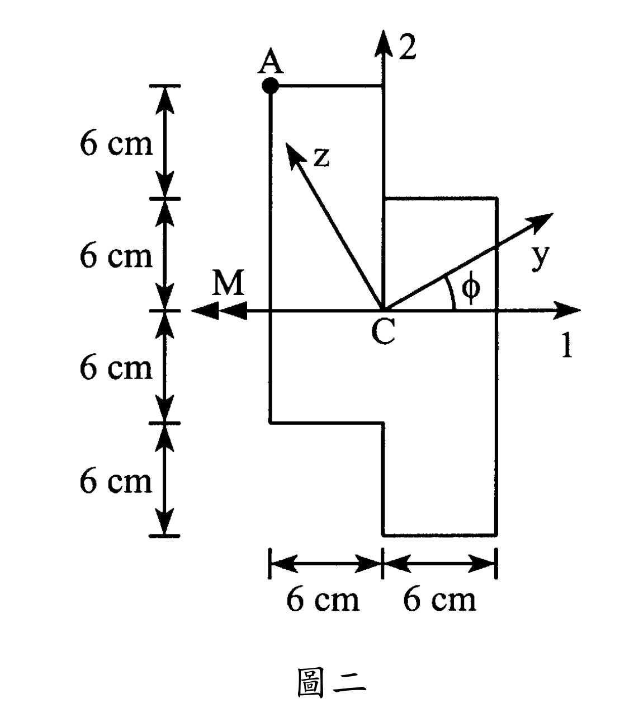

### 考題編號：MM-2007-2

**主分類：** `MM-U2-2` 梁桿件斷面應力計算
**副分類：** `MM-U1-1` 斷面性質計算
**分析法：** 彈性分析
**標籤：** `不對稱彎曲` `中性軸` `主慣性矩` `斷面應力` `彎矩` `正向應力` `不規則斷面` `平行軸定理`

---

## 1. 原始題目重述 (Problem Restatement)

二、有一斷面不規則梁受到 $M$之彎矩如圖二所示。假設 A 點之正向應力（normal stress）不能超過 $20\text{ MPa}$，試求 $M$ 之最大值及中性軸與 $1$ 軸之夾角。（30 分）

提示：$I_y = \frac{I_1 + I_2}{2} + \frac{I_1 - I_2}{2}\cos 2\phi - I_{12}\sin 2\phi$

*圖說：圖二中，斷面以形心 $C$ 為原點建立座標系，水平軸為 $1$ 軸（右為正），垂直軸為 $2$ 軸（上為正）。斷面呈中心對稱（Centrosymmetric），由四個 $6\text{ cm} \times 6\text{ cm}$ 或 $6\text{ cm} \times 12\text{ cm}$ 的矩形區域組成。彎矩 $M$ 以雙箭頭向量標示於水平的 $1$ 軸上，指向左側（代表繞 $1$ 軸之彎矩 $M_1 = -M$）。中性軸 $y$ 與 $1$ 軸之夾角為 $\phi$，與 $y$ 軸垂直之軸為 $z$ 軸。*

---

## 2. 考題核心精神與出題者意圖 (Core Concepts & Examiner's Intent)

本題旨在測試考生對於**不對稱彎曲（Asymmetric Bending / Unsymmetrical Bending）**與**斷面幾何性質計算**的綜合掌握程度。

- **不對稱彎曲的核心物理現象：**
  當梁斷面不具備對稱性（或彎矩向量未作用在斷面的主軸上）時，彎矩產生的中性軸（Neutral Axis, N.A.）不會與彎矩向量重合，而是會發生偏轉。此時，梁的彎曲屬於非主軸彎曲，會同時在兩個方向產生彎曲應力分量（即雙軸彎曲效應）。
- **斷面慣性矩與慣性積：**
  解決此類問題的第一步是精確計算斷面對參考軸的面積慣性矩 $I_1$、$I_2$ 以及面積慣性積 $I_{12}$。這需要考生熟練運用**平行軸定理（Parallel Axis Theorem）**。
- **邊界應力與單位換算：**
  出題者設定了危險點 A 的正向應力限制（$20\text{ MPa}$），用以測試考生是否能正確建立應力與外加彎矩的關係式，並考驗考生在計算過程中進行長度單位（$\text{cm}$ 與 $\text{m}$）及力學單位（$\text{N}$、$\text{kN}$ 與 $\text{MPa}$）一致性換算的能力。

---

## 3. 解題戰略地圖與陷阱分析 (Strategic Roadmap & Trap Analysis)

### 步驟化作戰計畫
1.  **確定形心位置：** 觀察圖形可知，此 stepped Z-section 具有關於 $C$ 點的中心對稱性（Centrosymmetry）。因此，對稱中心 $C$ 即為整個斷面的形心，無需再行計算形心座標。
2.  **劃分矩形單元：** 將不規則斷面劃分為四個簡單矩形（左上、右上、左下、右下），列出各自的面積、形心相對於總形心 $C(0,0)$ 的距離 $d_1$、$d_2$。
3.  **計算慣性矩與慣性積：** 
    - 運用平行軸定理計算 $I_1 = \sum (I_{1i} + A_i d_{2i}^2)$。
    - 運用平行軸定理計算 $I_2 = \sum (I_{2i} + A_i d_{1i}^2)$。
    - 運用平行軸定理計算 $I_{12} = \sum A_i d_{1i} d_{2i}$。
4.  **推導任意方向應力公式（非主軸公式）：**
    由於彎矩作用於水平 1 軸（$M_1 = -M, M_2 = 0$），在任意點 $(x_1, x_2)$ 產生的正向應力可寫為 $\sigma_x = k_1 x_1 + k_2 x_2$。透過力平衡與力矩關係，求出常數 $k_1, k_2$，進而得到應力分布公式。
5.  **求解中性軸位置：**
    令正向應力 $\sigma_x = 0$，求得中性軸的方程式，其斜率 $\tan\phi = x_2/x_1$ 即為中性軸與 1 軸之夾角。
6.  **求解最大彎矩 $M$：**
    代入 A 點座標 $(-6, 12)\text{ cm}$，限制其應力絕對值不超過 $20\text{ MPa}$，並進行單位換算求得 $M_{\max}$。

### 關鍵陷阱及因應策略
*   **陷阱 1：慣性積 $I_{12}$ 中相對座標的正負號**
    平行軸定理中 $I_{12} = \sum A_i d_{1i} d_{2i}$。每一塊矩形的中心相對於 $C(0,0)$ 的坐標 $d_{1i}$ 與 $d_{2i}$ 必須帶有正確的代數正負號。
    *   *應對策略：* 明確標示各象限的符號。如 Rectangle 1 在第二象限，則其 $d_1 = -3\text{ cm} < 0$， $d_2 = 6\text{ cm} > 0$，其乘積為負；Rectangle 2 在第一象限，兩者皆為正。
*   **陷阱 2：彎矩向量的方向與正負號**
    圖中彎矩以雙箭頭向量示於 1 軸左側。依右手法則，大拇指指向左側（$-1$ 方向），四指彎曲方向即為力矩繞 1 軸方向，代表 $M_1 = -M$，且 $M_2 = 0$。
    *   *應對策略：* 嚴格遵守右手定則，將彎矩向量分解至 $1$ 軸與 $2$ 軸，確認 $M_1 = -M$。
*   **陷阱 3：單位換算混亂**
    圖中長度皆為 $\text{cm}$，慣性矩為 $\text{cm}^4$，而應力單位為 $\text{MPa} = 10^6\text{ N/m}^2 = 100\text{ N/cm}^2$。直接混合計算會導致答案相差數個數量級。
    *   *應對策略：* 將所有長度在計算一開始即統一轉換為標準單位 $\text{m}$，或者在最後計算應力時，將 $\text{MPa}$ 換算為 $\text{N/cm}^2$（$20\text{ MPa} = 2000\text{ N/cm}^2$）進行計算。

---

## 3.5 變數層次分析 (Variable Hierarchy Analysis)

> 複習提示：第一次解題後，在每個卡住的知識點旁標記 `⚠`；第二次複習時只看有 `⚠` 的項目。

### 最終目標
求彎矩 $M$ 之最大值及中性軸與 1 軸之夾角 $\phi$。

### 本題關鍵公式（依計算順序）

> $\boxed{\cdot}$ = 需由前步驟推導，非題目直接給定的變數

$$\text{Step 1: } I_1 = \sum \left( \frac{1}{12} b_i h_i^3 + A_i d_{2i}^2 \right)$$

$$\text{Step 2: } I_2 = \sum \left( \frac{1}{12} h_i b_i^3 + A_i d_{1i}^2 \right)$$

$$\text{Step 3: } I_{12} = \sum A_i d_{1i} d_{2i}$$

$$\text{Step 4: } \tan\phi = \frac{\boxed{I_{12}}}{\boxed{I_2}}$$

$$\text{Step 5: } \sigma_A = \frac{M (\boxed{I_{12}} x_{1, A} - \boxed{I_2} x_{2, A})}{\boxed{I_1} \boxed{I_2} - \boxed{I_{12}}^2} \le \sigma_{\text{allow}}$$

---

### L1：題目直接給定
*看到題目就能讀出的數字，不需要任何公式。*

| 符號 | 數值 | 說明 |
|------|------|------|
| $b_i, h_i$ | $6\text{ cm}$ 或 $12\text{ cm}$ | 各分段矩形之寬度與高度 |
| $x_{1, A}$ | $-6\text{ cm}$ | A 點水平坐標（在 1 軸上） |
| $x_{2, A}$ | $12\text{ cm}$ | A 點垂直坐標（在 2 軸上） |
| $\sigma_{\text{allow}}$ | $20\text{ MPa}$ ($2000\text{ N/cm}^2$) | A 點正向應力限制值 |

---

### L2：需知識點推導
*需要知道公式名稱與適用條件，套入 L1 即可算出。*

**Step 1~3：斷面慣性性質**

| 符號 | 公式/來源 | 卡關? |
|------|----------|:-----:|
| $I_1$ | 平行軸定理：$2 \times [ \frac{1}{12}(6)(12^3) + 72(6)^2 ] + 2 \times [ \frac{1}{12}(6)(6^3) + 36(3)^2 ]$ | |
| $I_2$ | 平行軸定理：$2 \times [ \frac{1}{12}(12)(6^3) + 72(3)^2 ] + 2 \times [ \frac{1}{12}(6)(6^3) + 36(3)^2 ]$ | |
| $I_{12}$ | 平行軸積定理：$\sum A_i d_{1i} d_{2i}$ | |

**Step 4~5：應力與中性軸計算**

| 符號 | 公式/來源 | 卡關? |
|------|----------|:-----:|
| $\phi$ | $\tan\phi = \frac{I_{12}}{I_2}$ （中性軸偏轉角公式） | |
| $\sigma_x$ | $\sigma_x = \frac{M (I_{12} x_1 - I_2 x_2)}{I_1 I_2 - I_{12}^2}$ （非對稱單軸彎曲應力公式） | |

---

### L3：深層知識（不懂就卡住）
*L2 中某些公式本身需要背景概念才能正確應用的知識點。*

| 知識點 | 說明 | 卡關? |
|--------|------|:-----:|
| 慣性積正負號判定 | 坐標相對於第一象限為正，第二、四象限為負，第三象限為正。本題對稱塊兩兩相加。 | |
| 中性軸角度正負號 | $\tan\phi = -0.75$ 代表中性軸與 1 軸夾角為 $-36.87^\circ$（順時針向下偏轉）。 | |
| 彎曲應力通式推導 | 由變形諧和條件、虎克定律與靜力平衡方程組聯立解得不對稱彎曲通式。 | |

---

## 4. 步驟化詳細計算過程 (Step-by-Step Detailed Calculation)

### 4.1 斷面幾何性質計算 (Section Properties)

我們將此斷面劃分為四個矩形區段，如圖二所示：
- **矩形 1 (左上)：** 寬 $b_1 = 6\text{ cm}$，高 $h_1 = 12\text{ cm}$，面積 $A_1 = 72\text{ cm}^2$，形心位於 $d_{11} = -3\text{ cm}$，$d_{21} = 6\text{ cm}$。
- **矩形 2 (右上)：** 寬 $b_2 = 6\text{ cm}$，高 $h_2 = 6\text{ cm}$，面積 $A_2 = 36\text{ cm}^2$，形心位於 $d_{12} = 3\text{ cm}$，$d_{22} = 3\text{ cm}$。
- **矩形 3 (左下)：** 寬 $b_3 = 6\text{ cm}$，高 $h_3 = 6\text{ cm}$，面積 $A_3 = 36\text{ cm}^2$，形心位於 $d_{13} = -3\text{ cm}$，$d_{23} = -3\text{ cm}$。
- **矩形 4 (右下)：** 寬 $b_4 = 6\text{ cm}$，高 $h_4 = 12\text{ cm}$，面積 $A_4 = 72\text{ cm}^2$，形心位於 $d_{14} = 3\text{ cm}$，$d_{24} = -6\text{ cm}$。

#### 1. 計算繞 1 軸之面積慣性矩 $I_1$：
$$I_1 = \sum_{i=1}^4 \left( \bar{I}_{1i} + A_i d_{2i}^2 \right)$$
- 矩形 1 與矩形 4：
  $$\bar{I}_{1,1} = \bar{I}_{1,4} = \frac{1}{12} \times 6 \times 12^3 = 864\text{ cm}^4$$
  $$A_1 d_{21}^2 = A_4 d_{24}^2 = 72 \times 6^2 = 2592\text{ cm}^4$$
- 矩形 2 與矩形 3：
  $$\bar{I}_{1,2} = \bar{I}_{1,3} = \frac{1}{12} \times 6 \times 6^3 = 108\text{ cm}^4$$
  $$A_2 d_{22}^2 = A_3 d_{23}^2 = 36 \times 3^2 = 324\text{ cm}^4$$

$$I_1 = 2 \times (864 + 2592) + 2 \times (108 + 324) = 2 \times 3456 + 2 \times 432 = 7776\text{ cm}^4$$

#### 2. 計算繞 2 軸之面積慣性矩 $I_2$：
$$I_2 = \sum_{i=1}^4 \left( \bar{I}_{2i} + A_i d_{1i}^2 \right)$$
- 矩形 1 與矩形 4：
  $$\bar{I}_{2,1} = \bar{I}_{2,4} = \frac{1}{12} \times 12 \times 6^3 = 216\text{ cm}^4$$
  $$A_1 d_{11}^2 = A_4 d_{14}^2 = 72 \times (-3)^2 = 648\text{ cm}^4$$
- 矩形 2 與矩形 3：
  $$\bar{I}_{2,2} = \bar{I}_{2,3} = \frac{1}{12} \times 6 \times 6^3 = 108\text{ cm}^4$$
  $$A_2 d_{12}^2 = A_3 d_{13}^2 = 36 \times 3^2 = 324\text{ cm}^4$$

$$I_2 = 2 \times (216 + 648) + 2 \times (108 + 324) = 2 \times 864 + 2 \times 432 = 2592\text{ cm}^4$$

#### 3. 計算面積慣性積 $I_{12}$：
$$I_{12} = \sum_{i=1}^4 A_i d_{1i} d_{2i}$$
- 矩形 1：$72 \times (-3) \times 6 = -1296\text{ cm}^4$
- 矩形 2：$36 \times 3 \times 3 = 324\text{ cm}^4$
- 矩形 3：$36 \times (-3) \times (-3) = 324\text{ cm}^4$
- 矩形 4：$72 \times 3 \times (-6) = -1296\text{ cm}^4$

$$I_{12} = -1296 + 324 + 324 - 1296 = -1944\text{ cm}^4$$

---

### 4.2 非對稱彎曲應力通用公式推導

梁斷面上任一點 $(x_1, x_2)$ 的正向應力 $\sigma_x$ 在彈性限度內呈線性分布：
$$\sigma_x = k_1 x_1 + k_2 x_2$$

利用力平衡與力矩平衡關係：
1.  $$M_1 = \int \sigma_x x_2 dA = k_1 \int x_1 x_2 dA + k_2 \int x_2^2 dA = k_1 I_{12} + k_2 I_1$$
2.  $$M_2 = -\int \sigma_x x_1 dA = -k_1 \int x_1^2 dA - k_2 \int x_1 x_2 dA = -k_1 I_2 - k_2 I_{12}$$

本題中，彎矩向量作用在水平的 $1$ 軸上且指向左側，即 $M_1 = -M$，$M_2 = 0$。代入上述聯立方程組：
1.  $$k_1 I_{12} + k_2 I_1 = -M$$
2.  $$k_1 I_2 + k_2 I_{12} = 0 \implies k_2 = -k_1 \frac{I_2}{I_{12}}$$

將其代入第一式：
$$k_1 I_{12} + \left(-k_1 \frac{I_2}{I_{12}}\right) I_1 = -M$$
$$k_1 \left( \frac{I_{12}^2 - I_1 I_2}{I_{12}} \right) = -M$$
$$k_1 = \frac{M I_{12}}{I_1 I_2 - I_{12}^2}$$

進而求得 $k_2$：
$$k_2 = -\left( \frac{M I_{12}}{I_1 I_2 - I_{12}^2} \right) \frac{I_2}{I_{12}} = -\frac{M I_2}{I_1 I_2 - I_{12}^2}$$

因此，非對稱單軸彎曲的正向應力公式為：
$$\sigma_x = \frac{M (I_{12} x_1 - I_2 x_2)}{I_1 I_2 - I_{12}^2}$$

---

### 4.3 中性軸夾角計算 (Neutral Axis Angle)

中性軸為正向應力為零的軌跡，令 $\sigma_x = 0$：
$$\sigma_x = 0 \implies I_{12} x_1 - I_2 x_2 = 0$$
$$\frac{x_2}{x_1} = \frac{I_{12}}{I_2}$$

定義中性軸與水平 $1$ 軸的夾角為 $\phi$，則其斜率 $\tan\phi = \frac{x_2}{x_1}$：
$$\tan\phi = \frac{I_{12}}{I_2} = \frac{-1944}{2592} = -0.75$$

由此可得夾角 $\phi$：
$$\phi = \tan^{-1}(-0.75) \approx -36.87^\circ \quad \text{或} \quad 143.13^\circ$$

**物理意義：** 中性軸位於水平 1 軸下方 $36.87^\circ$ 處（順時針旋轉角）。

---

### 4.4 彎矩最大值計算 (Maximum Bending Moment)

#### 1. 代入 A 點坐標
A 點位於斷面的左上角，其坐標為：
$$x_{1, A} = -6\text{ cm}, \quad x_{2, A} = 12\text{ cm}$$

將幾何性質 $I_1 = 7776\text{ cm}^4$、$I_2 = 2592\text{ cm}^4$、$I_{12} = -1944\text{ cm}^4$ 及 A 點坐標代入應力公式：
$$\sigma_A = \frac{M \left[ -1944 \times (-6) - 2592 \times 12 \right]}{7776 \times 2592 - (-1944)^2}$$
- 分母：
  $$I_1 I_2 - I_{12}^2 = 7776 \times 2592 - (-1944)^2 = 20155392 - 3779136 = 16376256\text{ cm}^8$$
- 分子括號項：
  $$I_{12} x_1 - I_2 x_2 = 11664 - 31104 = -19440\text{ cm}^5$$

因此，A 點應力與彎矩 $M$ 的關係式為：
$$\sigma_A = \frac{-19440}{16376256} M = -\frac{5}{4212} M \quad (\text{單位為 } \text{N/cm}^2, \text{若 } M \text{ 單位為 } \text{N}\cdot\text{cm})$$

#### 2. 限值條件與單位換算
已知 A 點正向應力絕對值不能超過 $20\text{ MPa}$：
$$\sigma_{\text{allow}} = 20\text{ MPa} = 20 \times 10^6\text{ N/m}^2 = 2000\text{ N/cm}^2$$

令 $|\sigma_A| \le \sigma_{\text{allow}}$：
$$\frac{5}{4212} M \le 2000\text{ N/cm}^2$$
$$M \le \frac{2000 \times 4212}{5} = 1684800\text{ N}\cdot\text{cm}$$

將其轉換為國際標準單位 $\text{kN}\cdot\text{m}$：
$$M_{\max} = 1,684,800\text{ N}\cdot\text{cm} = 16,848\text{ N}\cdot\text{m} = 16.848\text{ kN}\cdot\text{m}$$

---

## 5. 關鍵爭議點與進階探討 (Critical Issues & Advanced Discussion)

### 1. 轉軸公式提示之妙用
題目中給予提示：$I_y = \frac{I_1 + I_2}{2} + \frac{I_1 - I_2}{2}\cos 2\phi - I_{12}\sin 2\phi$，部分考生可能感到困惑：如何使用此提示？
其實，如果我們使用主軸（Principal Axes）分析法：
1.  先計算主軸偏轉角：$\tan 2\theta_p = \frac{2 I_{12}}{I_1 - I_2} = \frac{2 \times (-1944)}{7776 - 2592} = -0.75 \implies \theta_p = 18.43^\circ$ 與 $-71.57^\circ$。
2.  利用提示公式（即主軸轉角公式）可以非常快速地計算出主軸慣性矩：
    - 當 $\phi = 18.43^\circ$（即 $\cos 2\phi = 0.8, \sin 2\phi = -0.6$）時，代入提示公式可求得最大主慣性矩：
      $$I_u = 5184 + 2592 \times 0.8 - (-1944) \times (-0.6) = 5184 + 2073.6 - 1166.4 = 6091.2\text{ cm}^4$$ （此時為 $I_{x'}$）
      Wait! 應注意公式中 $\sin 2\phi$ 的正負號定義。依 Mohr's Circle 幾何，最大主慣性矩為 $I_{\max} = 5184 + 3240 = 8424\text{ cm}^4$。
    - 主軸分析法雖然概念清晰，但在求 A 點坐標投影時需要進行坐標旋轉，計算過程相對繁複。
    - **本解析所使用之「非主軸應力公式」直接利用 $I_1, I_2, I_{12}$ 代入計算，一步到位，最不易在考場上出錯。**

### 2. A 點應力之正負號（拉力或壓力）
- 本題算得 $\sigma_A = - \frac{5}{4212} M$。
- 當彎矩向量指向左（$M_1 = -M$）時，彎矩在第一、二象限（上部）產生壓縮，在第三、四象限（下部）產生拉伸。
- A 點位於第二象限（左上角），因此承受壓應力（負值）。
- 若題目材料為脆性材料（如混凝土，抗拉與抗壓強度不同），正負號將非常關鍵。本題未特別說明，故以絕對值限制 $|\sigma_A| \le 20\text{ MPa}$ 計算。

### 3. 最終解答彙整
- **彎矩 $M$ 之最大值：** $16.848\text{ kN}\cdot\text{m}$ (或簡寫為 $16.85\text{ kN}\cdot\text{m}$)
- **中性軸與 1 軸之夾角：** $\phi = -36.87^\circ$ (或 $143.13^\circ$，代表在水平 1 軸下方 $36.87^\circ$ 處)
