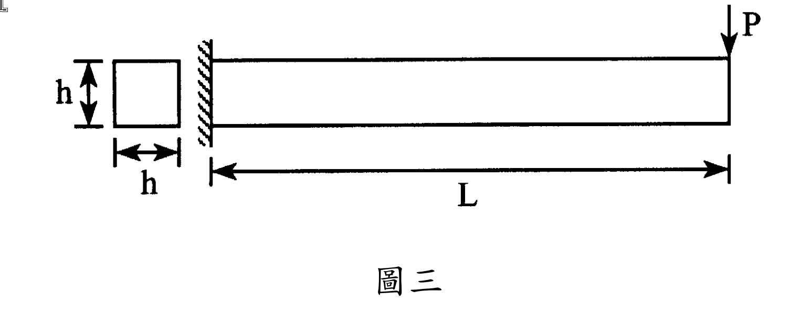

# 考題編號：MM-2007-3

**主分類：** `MM-U4-1` 軸力桿件、扭力桿件與梁之塑性分析  
**副分類：** —  
**分析法：** 塑性分析  
**標籤：** `塑性鉸` `極限荷重` `塑性分析` `懸臂樑` `理想彈塑性` `降伏應力` `塑性彎矩` `正方形斷面` `形狀係數`

---

## 1. 原始題目重述 (Problem Restatement)

有一懸臂樑，斷面為正方形（邊長 h），左端固定，自由端（右端）受集中載重 P 向下作用，梁長 L。材料為**理想彈塑性**，降伏應力 $\sigma_y = 200\text{ MPa}$。

**已知數值：**
- $h = 20\text{ cm} = 200\text{ mm}$
- $L = 3\text{ m} = 3000\text{ mm}$
- $\sigma_y = 200\text{ MPa} = 200\text{ N/mm}^2$

**要求：** 求 P 力之**極限值** $P_u$（全塑性機構形成時的荷重）。

*圖說：左端固定，右端自由並受集中力 P 向下；梁長 L = 3 m；斷面為正方形 h × h，h = 20 cm；材料理想彈塑性，σ_y = 200 MPa。*

---

## 2. 考題核心精神與出題者意圖 (Core Concepts & Examiner's Intent)

**核心觀念：** 懸臂樑的塑性機構分析——判斷塑性鉸位置、計算全塑性彎矩 $M_p$、得出極限荷重。

**考驗能力：**
1. 正方形斷面的塑性斷面模數 $Z = h^3/4$ 推導或記憶
2. 懸臂樑中僅需一個塑性鉸即形成機構（靜定結構）
3. 塑性鉸發生於最大彎矩處（固定端）
4. $P_u = M_p / L$ 的直接應用

**出題者預設陷阱：**
- 混用彈性斷面模數 $S = h^3/6$ 而非塑性斷面模數 $Z = h^3/4$
- 誤以為需要多個塑性鉸才能形成機構（靜定梁只需 1 個）
- 單位換算失誤（mm 與 m 混用）

---

## 3. 解題戰略地圖與陷阱分析 (Strategic Roadmap & Trap Analysis)

**作戰計畫（4步）：**
1. 確認最大彎矩位置（固定端）→ 塑性鉸位於固定端
2. 計算正方形斷面之塑性斷面模數 $Z$
3. 計算全塑性彎矩 $M_p = \sigma_y \cdot Z$
4. 由靜力平衡得 $P_u = M_p / L$

**陷阱 1：彈性 vs 塑性斷面模數**
- 彈性 $S = I/c = (h^4/12)/(h/2) = h^3/6$（降伏起始，$M_Y = \sigma_y \cdot h^3/6$）
- 塑性 $Z = h^3/4$（全塑性，$M_p = \sigma_y \cdot h^3/4$）
- 形狀係數 $f = Z/S = (h^3/4)/(h^3/6) = 1.5$（矩形及正方形之標準值）

**陷阱 2：懸臂樑的機構條件**
- 懸臂樑靜定度 = 0（原本靜定）→ 形成 1 個塑性鉸後即成機構
- 連續樑靜不定度 = n → 需 n+1 個塑性鉸

**陷阱 3：塑性鉸位置**
- 懸臂端受集中荷重時，彎矩分布為線性，固定端彎矩最大 $M_{max} = P \cdot L$
- 塑性鉸必然在固定端形成

---

## 3.5 變數層次分析 (Variable Hierarchy Analysis)

> 複習提示：第一次解題後，在每個卡住的知識點旁標記 `⚠`；第二次複習時只看有 `⚠` 的項目。

### 最終目標
求懸臂樑在理想彈塑性材料下的極限集中荷重 $P_u$

### 本題關鍵公式（依計算順序）

$$\text{Step 1 塑性斷面模數} \quad Z = \frac{h^3}{4}$$

$$\text{Step 2 全塑性彎矩} \quad M_p = \sigma_y \cdot \boxed{Z} = \frac{\sigma_y h^3}{4}$$

$$\text{Step 3 固定端彎矩（極限態）} \quad M_{fixed} = P_u \cdot L = \boxed{M_p}$$

$$\text{Step 4 極限荷重} \quad P_u = \frac{\boxed{M_p}}{L} = \frac{\sigma_y h^3}{4L}$$

### L1：題目直接給定

| 符號 | 數值 | 說明 |
|------|------|------|
| $h$ | 20 cm = 200 mm | 正方形斷面邊長 |
| $L$ | 3 m = 3000 mm | 梁長 |
| $\sigma_y$ | 200 MPa = 200 N/mm² | 降伏應力（理想彈塑性） |

### L2：需知識點推導

**斷面塑性性質**

| 符號 | 公式／來源 | 卡關? |
|------|-----------|------|
| $I$ | $h^4/12$（正方形慣性矩） | |
| $S$ | $h^3/6$（彈性斷面模數） | |
| $Z$ | $h^3/4$（塑性斷面模數，等面積軸原理） | |
| $f$ | $Z/S = 1.5$（形狀係數，矩形標準值） | |

**極限分析**

| 符號 | 公式／來源 | 卡關? |
|------|-----------|------|
| $M_Y$ | $\sigma_y \cdot S = \sigma_y h^3/6$（降伏彎矩） | |
| $M_p$ | $\sigma_y \cdot Z = \sigma_y h^3/4$（全塑性彎矩） | |
| 塑性鉸數 | 1 個（懸臂樑靜定，1 個鉸即成機構） | |
| $P_u$ | $M_p / L$（機構條件） | |

### L3：深層知識（不懂就卡住）

| 知識點 | 說明 | 卡關? |
|--------|------|------|
| 塑性斷面模數推導 | $Z = \bar{y}_1 A_1 + \bar{y}_2 A_2 = 2(h/2 \cdot h)(h/4) = h^3/4$ | |
| 理想彈塑性假設 | 全截面降伏時應力均為 $\pm\sigma_y$，不考慮應變硬化 | |
| 機構條件 | 靜定結構加 1 個塑性鉸 → 瞬間機構；靜不定 n 次需 n+1 個 | |
| 最大彎矩位置 | 懸臂端集中荷重 → M 在固定端最大，塑性鉸必在固定端 | |

---

## 4. 步驟化詳細計算過程 (Step-by-Step Detailed Calculation)

### 4.1 彎矩分布與塑性鉸位置

懸臂樑自由端受 P，距固定端距離 x 處之彎矩：

$$M(x) = P(L - x)$$

- 自由端（x = L）：M = 0
- 固定端（x = 0）：$M_{max} = P \cdot L$

**結論：彎矩在固定端最大 → 塑性鉸在固定端形成。**

懸臂樑為靜定結構，形成 1 個塑性鉸後即成機構，達到極限狀態。

### 4.2 正方形斷面之塑性斷面模數 Z

正方形斷面 $h \times h$，中性軸（等面積軸）通過形心。

**上半部：** 面積 $A_1 = h \cdot (h/2)$，形心距中性軸 $\bar{y}_1 = h/4$

**下半部：** 面積 $A_2 = h \cdot (h/2)$，形心距中性軸 $\bar{y}_2 = h/4$

$$Z = A_1 \bar{y}_1 + A_2 \bar{y}_2 = 2 \times \frac{h^2}{2} \times \frac{h}{4} = \frac{h^3}{4}$$

代入數值：

$$Z = \frac{(200)^3}{4} = \frac{8{,}000{,}000}{4} = 2{,}000{,}000 \text{ mm}^3$$

### 4.3 全塑性彎矩 M_p

$$M_p = \sigma_y \cdot Z = 200 \text{ N/mm}^2 \times 2{,}000{,}000 \text{ mm}^3 = 400{,}000{,}000 \text{ N·mm} = 400 \text{ kN·m}$$

### 4.4 極限荷重 P_u

固定端形成塑性鉸時：

$$P_u \cdot L = M_p$$

$$P_u = \frac{M_p}{L} = \frac{400 \text{ kN·m}}{3 \text{ m}}$$

$$\boxed{P_u = \frac{400}{3} \approx 133.3 \text{ kN}}$$

---

**驗算（符號解）：**

$$P_u = \frac{\sigma_y h^3}{4L} = \frac{200 \times (200)^3}{4 \times 3000} = \frac{200 \times 8 \times 10^6}{12{,}000} = \frac{1.6 \times 10^9}{1.2 \times 10^4} = 133{,}333 \text{ N} \approx 133.3 \text{ kN} \checkmark$$

---

**【附：降伏起始荷重 P_Y 供參考】**

$$M_Y = \sigma_y \cdot S = \sigma_y \cdot \frac{h^3}{6} = 200 \times \frac{(200)^3}{6} = \frac{200 \times 8 \times 10^6}{6} = 266{,}667{,}000 \text{ N·mm} \approx 266.7 \text{ kN·m}$$

$$P_Y = \frac{M_Y}{L} = \frac{266.7}{3} = 88.9 \text{ kN}$$

形狀係數 $f = P_u/P_Y = M_p/M_Y = 1.5$，符合矩形（正方形）斷面標準值 ✓

---

## 5. 關鍵爭議點與進階探討 (Critical Issues & Advanced Discussion)

**5.1 「極限值」的定義**

題目要求「P 力之極限值」即**極限荷重** $P_u$（全截面降伏、形成機構的臨界值），不是「降伏起始荷重」$P_Y$（最外緣纖維剛好降伏）。考場中「極限值」= 塑性分析結果。

**5.2 形狀係數的重要性**

- $P_u / P_Y = f = 1.5$，代表正方形斷面存在 50% 的塑性保留量（從降伏起始到完全塑性）
- 常見斷面形狀係數：矩形 1.5、圓形 ≈ 1.70、工字形 ≈ 1.10–1.15

**5.3 機構判斷的一般化**

| 梁型 | 靜不定度 | 需要塑性鉸數 | 說明 |
|------|---------|------------|------|
| 懸臂樑（本題） | 0 | 1 | 僅在固定端 |
| 簡支樑（集中荷重） | 0 | 1 | 在最大彎矩截面 |
| 兩端固定樑（均布荷重） | 2 | 3 | 兩端 + 跨中 |
| 兩端固定樑（集中荷重） | 2 | 3 | 兩端 + 荷重點 |

**5.4 考場建議**

- 先寫出 $Z = h^3/4$（正方形）並說明推導過程，展示理解
- 畫出極限狀態彎矩圖，清楚標示塑性鉸位置
- 最終答案以 kN 呈現，數字較整齊
