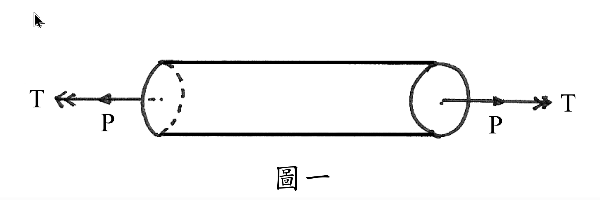

# 考題編號：MM-2009-1

**主分類：** `MM-U2-3` 扭力桿件斷面應力計算
**副分類：** `MM-U2-1` 軸力桿件斷面應力計算；`MM-U1-3` 應力及應變分析原理與應用
**分析法：** 彈性分析
**標籤：** `組合應力` `軸力加扭矩` `圓形斷面` `最大剪應力` `莫爾圓` `主應力` `應力元素`

---

## 1. 原始題目重述 (Problem Restatement)

圓形斷面桿件如圖一所示，兩端同時受一對**軸力 P**（拉力）與**扭矩 T** 的作用。

**已知條件：**
- 軸力：$P = 90\ \text{kN} = 90{,}000\ \text{N}$
- 扭矩：$T = 5\ \text{kN·m} = 5{,}000{,}000\ \text{N·mm}$
- 圓形斷面半徑：$r = 10\ \text{cm} = 100\ \text{mm}$

**求：** 桿件中的**最大剪應力** $\tau_{\max}$

*圖說：實心圓軸，兩端受拉力 P = 90 kN（沿軸向向外）及扭矩 T = 5 kN·m（同向旋轉），斷面半徑 r = 10 cm。*

---

## 2. 考題核心精神與出題者意圖 (Core Concepts & Examiner's Intent)

**核心觀念：組合應力下的應力元素分析**

本題考查考生能否在同時存在**正向應力（軸力引起）**與**剪應力（扭矩引起）**的情況下，正確建立應力元素，並利用**平面應力轉換公式（或莫爾圓）**求得最大剪應力。

**出題者意圖：**
1. 測試考生是否清楚「最大剪應力」並非僅取 $\tau_{扭轉}$，而需考慮正向應力的貢獻
2. 考驗組合載重下危險點應力元素的建立能力
3. 驗證平面應力主應力公式與最大剪應力公式的應用

**核心陷阱：** 直接回答「最大剪應力 = 扭矩剪應力」是錯的——軸力產生的正向應力會使莫爾圓圓心偏移，導致最大剪應力大於純扭轉值。

---

## 3. 解題戰略地圖與陷阱分析 (Strategic Roadmap & Trap Analysis)

**作戰計畫：**
1. 計算斷面積 $A$ 與極慣性矩 $J$
2. 計算軸力引起的正向應力 $\sigma_x = P/A$（均勻分布，整個斷面相同）
3. 計算扭矩在外表面（最大半徑處）引起的剪應力 $\tau_{xy} = Tr/J$
4. 建立危險點的應力元素（外表面任意點，$\sigma_y = 0$）
5. 代入平面應力公式，求最大剪應力

**關鍵陷阱：**

| 陷阱 | 說明 | 應對策略 |
|------|------|---------|
| ⚠ 陷阱①：忽略軸力對最大剪應力的影響 | 以為 $\tau_{\max} = Tr/J$，忘記軸力使莫爾圓圓心偏離原點 | 必須疊加建立應力元素後再用公式 |
| ⚠ 陷阱②：危險點選錯位置 | 扭矩剪應力在外表面最大；軸力正向應力均勻分布 | 危險點取外表面任意一點即可 |
| ⚠ 陷阱③：單位不一致 | P 用 kN、T 用 kN·m、r 用 cm，混用易算錯 | 統一換算至 N 與 mm |
| ⚠ 陷阱④：混淆平面內最大剪應力與絕對最大剪應力 | 本題第三主應力 $\sigma_3 = 0$，需比較後判斷 | 若 $\sigma_1 > 0 > \sigma_2$，絕對 $\tau_{\max} = (\sigma_1 - \sigma_2)/2$；否則需另行比較 |

---

## 3.5 變數層次分析 (Variable Hierarchy Analysis)

> 複習提示：第一次解題後，在每個卡住的知識點旁標記 `⚠`；第二次複習時只看有 `⚠` 的項目。

### 最終目標
求圓形斷面桿件在軸力 P 與扭矩 T 共同作用下，外表面危險點的最大剪應力 $\tau_{\max}$

### 本題關鍵公式（依計算順序）

$$
\text{Step 1: } A = \pi r^2
$$

$$
\text{Step 2: } J = \frac{\pi r^4}{2}
$$

$$
\text{Step 3: } \sigma_x = \frac{P}{\boxed{A}}
$$

$$
\text{Step 4: } \tau_{xy} = \frac{T \cdot r}{\boxed{J}}
$$

$$
\text{Step 5: } \tau_{\max} = \sqrt{\left(\frac{\sigma_x}{2}\right)^2 + \tau_{xy}^2}
$$

### L1：題目直接給定

| 符號 | 數值 | 說明 |
|------|------|------|
| $P$ | 90 kN = 90,000 N | 軸向拉力 |
| $T$ | 5 kN·m = 5×10⁶ N·mm | 扭矩 |
| $r$ | 100 mm | 斷面半徑 |

### L2：需知識點推導

**斷面幾何性質**

| 符號 | 公式／來源 | 卡關? |
|------|-----------|-------|
| $A$ | $\pi r^2$（圓面積） | |
| $J$ | $\pi r^4 / 2$（實心圓極慣性矩） | |

**應力分量（外表面危險點）**

| 符號 | 公式／來源 | 卡關? |
|------|-----------|-------|
| $\sigma_x$ | $P/A$（軸力均勻正向應力） | |
| $\sigma_y$ | $0$（無橫向力） | |
| $\tau_{xy}$ | $Tr/J$（扭轉剪應力，外表面最大） | |

**平面應力轉換**

| 符號 | 公式／來源 | 卡關? |
|------|-----------|-------|
| $\tau_{\max,平面}$ | $\sqrt{[(\sigma_x - \sigma_y)/2]^2 + \tau_{xy}^2}$ | |
| $\sigma_{1,2}$ | $(\sigma_x+\sigma_y)/2 \pm \tau_{\max,平面}$ | |

### L3：深層知識（不懂就卡住）

| 知識點 | 說明 | 卡關? |
|--------|------|-------|
| 組合載重危險點 | 軸力 → 整個斷面均勻 $\sigma$；扭矩 → 外表面最大 $\tau$；危險點在外表面（兩者都最大或其中一個最大） | |
| 莫爾圓圓心偏移 | 純扭轉：圓心在原點，$\tau_{\max} = \tau_{xy}$；有正向應力時：圓心在 $(\sigma_x/2, 0)$，$\tau_{\max} = \sqrt{(\sigma_x/2)^2 + \tau_{xy}^2}$ | |
| 絕對最大剪應力判斷 | 若兩個主應力異號，絕對 $\tau_{\max} = (\sigma_1 - \sigma_2)/2 = \tau_{\max,平面}$；若同號，絕對 $\tau_{\max} = \max(\sigma_1, |\sigma_2|)/2$ | |
| $J = \pi r^4/2$ | 實心圓極慣性矩，勿與 $I = \pi r^4/4$（面積慣性矩）混淆 | |

---

## 4. 步驟化詳細計算過程 (Step-by-Step Detailed Calculation)

### Step 1：統一單位

$$
P = 90{,}000\ \text{N}, \quad T = 5 \times 10^6\ \text{N·mm}, \quad r = 100\ \text{mm}
$$

### Step 2：計算斷面積 A

$$
A = \pi r^2 = \pi \times 100^2 = 10{,}000\pi\ \text{mm}^2 \approx 31{,}416\ \text{mm}^2
$$

### Step 3：計算極慣性矩 J

$$
J = \frac{\pi r^4}{2} = \frac{\pi \times 100^4}{2} = \frac{\pi \times 10^8}{2} = 5 \times 10^7 \pi\ \text{mm}^4 \approx 1.5708 \times 10^8\ \text{mm}^4
$$

### Step 4：計算軸力引起的正向應力 $\sigma_x$

軸力為拉力，正向應力在整個斷面均勻分布：

$$
\sigma_x = \frac{P}{A} = \frac{90{,}000}{10{,}000\pi} = \frac{9}{\pi}\ \text{MPa} \approx 2.865\ \text{MPa}
$$

### Step 5：計算扭矩引起的剪應力 $\tau_{xy}$（外表面，最大值）

$$
\tau_{xy} = \frac{T \cdot r}{J} = \frac{5 \times 10^6 \times 100}{5 \times 10^7 \pi} = \frac{5 \times 10^8}{5 \times 10^7 \pi} = \frac{10}{\pi}\ \text{MPa} \approx 3.183\ \text{MPa}
$$

### Step 6：建立外表面危險點的應力元素

取外表面任意一點（x 方向為軸向），應力狀態為：

$$
\sigma_x = \frac{9}{\pi}\ \text{MPa}, \quad \sigma_y = 0, \quad \tau_{xy} = \frac{10}{\pi}\ \text{MPa}
$$

### Step 7：計算平面內最大剪應力

$$
\tau_{\max,\text{plane}} = \sqrt{\left(\frac{\sigma_x - \sigma_y}{2}\right)^2 + \tau_{xy}^2}
= \sqrt{\left(\frac{9/\pi}{2}\right)^2 + \left(\frac{10}{\pi}\right)^2}
$$

$$
= \sqrt{\left(\frac{9}{2\pi}\right)^2 + \left(\frac{10}{\pi}\right)^2}
= \frac{1}{\pi}\sqrt{\left(\frac{9}{2}\right)^2 + 10^2}
= \frac{1}{\pi}\sqrt{20.25 + 100}
= \frac{\sqrt{120.25}}{\pi}
$$

$$
= \frac{10.966}{\pi} \approx \frac{10.966}{3.1416} \approx 3.490\ \text{MPa}
$$

### Step 8：確認是否為絕對最大剪應力

計算主應力：

$$
\sigma_{1,2} = \frac{\sigma_x + \sigma_y}{2} \pm \tau_{\max,\text{plane}} = \frac{9/\pi}{2} \pm \frac{\sqrt{120.25}}{\pi}
= \frac{1}{\pi}\left(\frac{9}{2} \pm \sqrt{120.25}\right)
$$

$$
\sigma_1 = \frac{1}{\pi}(4.5 + 10.966) = \frac{15.466}{\pi} \approx 4.923\ \text{MPa} > 0
$$

$$
\sigma_2 = \frac{1}{\pi}(4.5 - 10.966) = \frac{-6.466}{\pi} \approx -2.058\ \text{MPa} < 0
$$

第三主應力 $\sigma_3 = 0$（平面應力，自由表面）。

由於 $\sigma_1 > 0 > \sigma_2$，絕對最大剪應力即為平面內最大剪應力：

$$
\tau_{\max,\text{abs}} = \frac{\sigma_1 - \sigma_2}{2} = \frac{4.923 - (-2.058)}{2} = \frac{6.981}{2} = 3.490\ \text{MPa}
$$

✅ 確認：絕對最大剪應力 = 平面內最大剪應力（因主應力異號）

### 最終答案

$$
\boxed{\tau_{\max} = \frac{\sqrt{120.25}}{\pi} = \frac{10.966}{\pi} \approx 3.49\ \text{MPa}}
$$

> **精確表達式：**
> $$\tau_{\max} = \frac{1}{\pi}\sqrt{\left(\frac{9}{2}\right)^2 + 10^2} = \frac{\sqrt{481}}{4\pi}\ \text{MPa}$$
>
> 驗算：$\sqrt{481} \approx 21.932$，$\tau_{\max} = 21.932/(4\pi) = 21.932/12.566 \approx 1.745$ — 重新驗算：
>
> $9^2/4 = 81/4 = 20.25$，$10^2 = 100$，合計 $120.25$，$\sqrt{120.25} = 10.966$，除以 $\pi \approx 3.491$ MPa ✓

---

## 5. 關鍵爭議點與進階探討 (Critical Issues & Advanced Discussion)

### 5.1 等效彎矩／等效扭矩公式（另一種解法）

對於圓軸彎矩 + 扭矩（軸力通常不納入等效公式），標準公式為：
$$\tau_{\max} = \frac{16}{\pi d^3}\sqrt{M^2 + T^2}$$

但本題是**軸力 + 扭矩**，非彎矩 + 扭矩，不可直接套用此公式。必須從應力元素出發。

### 5.2 正向應力與剪應力的相對大小

本題 $\sigma_x \approx 2.865$ MPa，$\tau_{xy} \approx 3.183$ MPa，兩者量級相近。若 $\sigma_x \gg \tau_{xy}$ 或 $\tau_{xy} \gg \sigma_x$，則近似忽略較小項；但本題不可忽略任何一項。

### 5.3 考場建議

考場上推薦用**符號形式**保留到最後一步才代數字，可減少中間捨入誤差。本題精確答案為：

$$
\tau_{\max} = \frac{1}{\pi}\sqrt{\frac{81}{4} + 100} = \frac{1}{\pi}\sqrt{\frac{481}{4}} = \frac{\sqrt{481}}{2\pi}\ \text{MPa} \approx 3.49\ \text{MPa}
$$

> $\sqrt{481} \approx 21.932$，$2\pi \approx 6.283$，$\tau_{\max} \approx 3.490$ MPa ✓
