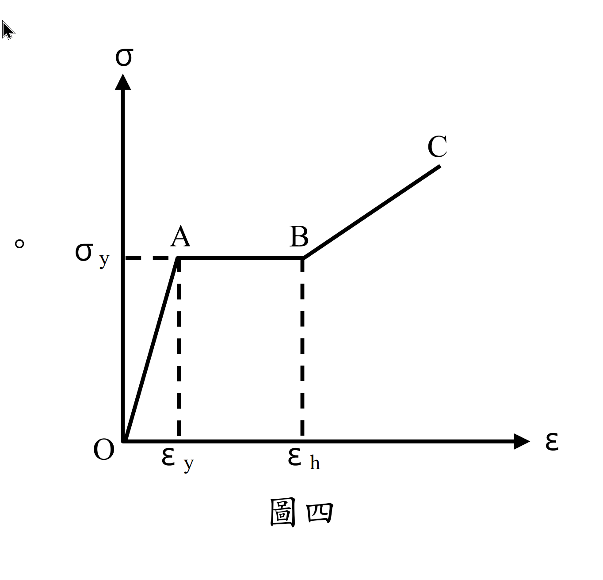

# 考題編號：MM-2009-5

**主分類：** `MM-U4-1` 軸力桿件、扭力桿件與梁之塑性分析
**副分類：** （無）
**分析法：** 塑性分析
**標籤：** `彈塑性分析` `應變硬化` `矩形斷面` `M-κ關係` `三段式材料` `純彎曲` `曲率` `平面截面假設`

---

## 1. 原始題目重述 (Problem Restatement)

一矩形斷面梁（高 h、寬 b）受一對彎矩 M 的作用（純彎曲）。其材料的**應力-應變（σ-ε）關係**如圖所示，分三段：
- **OA 段**：彈性，斜率為 E（$0 \le \varepsilon \le \varepsilon_y$，$\sigma = E\varepsilon$）
- **AB 段**：完全塑性（水平），斜率為 0（$\varepsilon_y \le \varepsilon \le \varepsilon_h$，$\sigma = \sigma_y$）
- **BC 段**：應變硬化，斜率為 E'（$\varepsilon > \varepsilon_h$，$\sigma = \sigma_y + E'(\varepsilon - \varepsilon_h)$）

$\sigma$ 可為壓應力或拉應力（對稱材料）。假設**變形前後平面維持平面**（plane sections remain plane）。

**求：** 彎矩 $M$ 與曲率 $\kappa$ 之關係（完整 M-κ 圖）。（20 分）

*圖說：σ-ε 曲線分三段：O→A 彈性段（斜率 E），σ 從 0 到 σy，ε 從 0 到 εy；A→B 完全塑性段（水平），σ 維持 σy，ε 從 εy 到 εh；B→C 應變硬化段（斜率 E'），σ 從 σy 繼續上升。對稱適用於拉壓兩側。*

---

## 2. 考題核心精神與出題者意圖 (Core Concepts & Examiner's Intent)

**核心觀念：非線性材料梁的彎矩—曲率關係推導**

本題要求考生從**平面截面假設出發**，根據三段式材料定律，逐段積分截面應力分布求出彎矩，建立完整的 M-κ 關係。

**出題者意圖：**
1. 測試能否正確辨識三個階段（彈性 / 彈塑性 / 含應變硬化）的截面應力分布
2. 考查逐段積分計算彎矩的能力
3. 驗證曲率-應變關係（$\varepsilon = \kappa y$）在非線性材料中的應用

**核心陷阱：**
- 忘記在 Stage 2 存在「彈性核心」，直接用 σy 積分全截面（高估 M）
- 忽略 Stage 3 的「塑性過渡帶（AB 段）」，只算彈性核心 + 應變硬化帶
- 中性軸位置：因材料對稱，純彎曲中性軸維持在截面形心（h/2 處），不需重新計算

---

## 3. 解題戰略地圖與陷阱分析 (Strategic Roadmap & Trap Analysis)

**推導路徑：**
1. 確認平面截面假設：$\varepsilon(y) = \kappa \cdot y$（y 從中性軸量起）
2. 確認中性軸位置（材料對稱 → 形心）
3. 識別三個曲率範圍，對應三種截面應力分布
4. 對每個範圍，計算 $M = 2b\int_0^{h/2} \sigma(y)\cdot y\,dy$
5. 驗算連續性（各段交界處 M 值相同）

**關鍵陷阱：**

| 陷阱 | 說明 | 應對策略 |
|------|------|---------|
| ⚠ 陷阱①：彈性核心位置 | Stage 2/3 的彈性核心邊界 $y_e = \varepsilon_y/\kappa$（隨 κ 增大而縮小） | 每個階段都要正確標注 $y_e$ |
| ⚠ 陷阱②：三帶 vs 兩帶 | Stage 3 有三帶：彈性核心、完全塑性帶、應變硬化帶 | 不要漏掉 AB 段對應的「完全塑性帶」 |
| ⚠ 陷阱③：中性軸偏移 | 因材料拉壓對稱，中性軸不偏移 | 若材料不對稱則需重新求中性軸（本題不需） |
| ⚠ 陷阱④：Stage 3 積分下限 | Stage 3 的應變硬化帶從 $y_h=\varepsilon_h/\kappa$ 積到 $h/2$ | 不要從 $y_e$ 或 0 積分 |

---

## 3.5 變數層次分析 (Variable Hierarchy Analysis)

> 複習提示：第一次解題後，在每個卡住的知識點旁標記 `⚠`；第二次複習時只看有 `⚠` 的項目。

### 最終目標
建立矩形斷面梁（三段式材料）的 M-κ 關係，分三階段

### 本題關鍵公式（依計算順序）

$$
\text{Step 1: } \varepsilon(y) = \kappa\cdot y \quad (\text{平面截面假設，}y\text{ 從中性軸量起})
$$

$$
\text{Step 2: } \kappa_y = \frac{2\varepsilon_y}{h},\quad \kappa_h = \frac{2\varepsilon_h}{h} \quad (\text{分界曲率})
$$

$$
\text{Step 3 (Stage 1): } M = EI\kappa = \frac{Ebh^3}{12}\kappa, \quad 0\le\kappa\le\kappa_y
$$

$$
\text{Step 4 (Stage 2): } M = \frac{\sigma_y b}{12}\!\left(3h^2 - \frac{4\varepsilon_y^2}{\kappa^2}\right), \quad \kappa_y\le\kappa\le\kappa_h
$$

$$
\text{Step 5 (Stage 3): } M = \underbrace{\frac{\sigma_y b}{12}\!\left(3h^2 - \frac{4\varepsilon_y^2}{\kappa^2}\right)}_{\text{Stage 2 項}} + \underbrace{2bE'\!\left[\frac{\kappa}{3}\!\left(\!\frac{h^3}{8}-\frac{\varepsilon_h^3}{\kappa^3}\!\right) - \frac{\varepsilon_h}{2}\!\left(\!\frac{h^2}{4}-\frac{\varepsilon_h^2}{\kappa^2}\!\right)\right]}_{\text{應變硬化修正項}}, \quad \kappa>\kappa_h
$$

### L1：題目直接給定

| 符號 | 數值 | 說明 |
|------|------|------|
| $b, h$ | 斷面寬、高 | 矩形斷面 |
| $E$ | OA 段彈性模數 | $\sigma = E\varepsilon$（$\varepsilon\le\varepsilon_y$） |
| $E'$ | BC 段硬化模數 | $\sigma = \sigma_y + E'(\varepsilon-\varepsilon_h)$（$\varepsilon>\varepsilon_h$） |
| $\sigma_y$ | 降伏應力 | |
| $\varepsilon_y$ | 降伏應變（$= \sigma_y/E$） | OA→AB 轉換點 |
| $\varepsilon_h$ | 硬化起始應變 | AB→BC 轉換點 |

### L2：需知識點推導

**分界曲率**

| 符號 | 公式／來源 | 卡關? |
|------|-----------|-------|
| $\kappa_y$ | $2\varepsilon_y/h$（外緣纖維達降伏時） | |
| $\kappa_h$ | $2\varepsilon_h/h$（外緣纖維達硬化起始點時） | |
| $y_e(\kappa)$ | $\varepsilon_y/\kappa$（彈性核心邊界，從中性軸量） | |
| $y_h(\kappa)$ | $\varepsilon_h/\kappa$（硬化帶起始位置，從中性軸量） | |

**各段積分**

| 積分 | 說明 | 卡關? |
|------|------|-------|
| $2b\int_0^{h/2} E\kappa y\cdot y\,dy = EI\kappa$ | Stage 1 全彈性 | |
| $2b\!\left[\int_0^{y_e} E\kappa y\cdot y\,dy + \int_{y_e}^{h/2}\sigma_y\cdot y\,dy\right]$ | Stage 2 彈性核心 + 塑性帶 | |
| Stage 2 + $2b\int_{y_h}^{h/2} E'(\kappa y-\varepsilon_h)\cdot y\,dy$ | Stage 3 加應變硬化修正 | |

### L3：深層知識（不懂就卡住）

| 知識點 | 說明 | 卡關? |
|--------|------|-------|
| 平面截面假設 → 線性應變分布 | $\varepsilon = \kappa\cdot y$ 在非線性材料中仍成立（純幾何關係），但 $\sigma$ 不再是線性 | |
| 對稱材料的中性軸 | 拉壓對稱且斷面對稱 → 中性軸=形心，不偏移 | |
| M 的積分利用對稱 | 只積半截面（0 到 h/2），再乘以 2 | |
| Stage 3 的「三帶」 | 彈性核心（0 到 ye）+ AB 塑性帶（ye 到 yh）+ BC 硬化帶（yh 到 h/2）| |
| 各段連續性 | Stage 1→2 交界（κ=κy）：M=My；Stage 2→3 交界（κ=κh）：yh=h/2，硬化帶寬=0，M 連續 | |

---

## 4. 步驟化詳細計算過程 (Step-by-Step Detailed Calculation)

### 前置：建立座標系與應變關係

取中性軸（中心線）為 y=0，向上（或向拉力側）為正 y，範圍 $-h/2 \le y \le h/2$。

**平面截面假設：** 任意截面的纖維應變與距中性軸的距離成正比：

$$
\varepsilon(y) = \kappa \cdot y
$$

其中 $\kappa = 1/\rho$（曲率，$\rho$ 為曲率半徑）。

**定義彎矩：**

$$
M = \int_{-h/2}^{h/2} \sigma(y) \cdot y \cdot b\,dy = 2b\int_0^{h/2} \sigma(y)\cdot y\,dy \quad \text{（利用對稱）}
$$

**關鍵分界量：**

- 降伏曲率：外緣應變達 $\varepsilon_y$ 時 → $\kappa_y \cdot h/2 = \varepsilon_y$ → $\displaystyle\kappa_y = \frac{2\varepsilon_y}{h}$
- 硬化起始曲率：外緣應變達 $\varepsilon_h$ 時 → $\displaystyle\kappa_h = \frac{2\varepsilon_h}{h}$
- 降伏彎矩：$\displaystyle M_y = \sigma_y \cdot \frac{bh^2}{6}$（彈性截面模數公式）

---

### Stage 1：全截面彈性（$0 \le \kappa \le \kappa_y$）

全截面應力 $\sigma(y) = E\varepsilon = E\kappa y$：

$$
M = 2b\int_0^{h/2} E\kappa y \cdot y\,dy = 2bE\kappa\int_0^{h/2} y^2\,dy = 2bE\kappa\cdot\frac{(h/2)^3}{3} = \frac{Ebh^3}{12}\kappa = EI\kappa
$$

$$
\boxed{M = EI\kappa = \frac{Ebh^3}{12}\kappa, \qquad 0 \le \kappa \le \kappa_y = \frac{2\varepsilon_y}{h}}
$$

**驗算：** 在 $\kappa = \kappa_y$：$M = EI\cdot\frac{2\varepsilon_y}{h} = E\cdot\frac{bh^3}{12}\cdot\frac{2\varepsilon_y}{h} = \frac{E\varepsilon_y bh^2}{6} = \frac{\sigma_y bh^2}{6} = M_y$ ✓

---

### Stage 2：彈性核心 + 完全塑性帶（$\kappa_y \le \kappa \le \kappa_h$）

**截面應力分布（對稱，只看上半）：**

- 彈性核心邊界：$y_e = \varepsilon_y/\kappa$（注意 $y_e < h/2$ 因為 $\kappa > \kappa_y$）
- $0 \le y \le y_e$：$\sigma = E\kappa y$（彈性區）
- $y_e < y \le h/2$：$\sigma = \sigma_y$（完全塑性區，OA→AB）

計算彎矩（分兩帶積分）：

$$
M = 2b\left[\int_0^{y_e} E\kappa y\cdot y\,dy + \int_{y_e}^{h/2}\sigma_y\cdot y\,dy\right]
$$

**彈性帶：**

$$
\int_0^{y_e} E\kappa y^2\,dy = E\kappa\frac{y_e^3}{3}
$$

由 $E\kappa y_e = E\kappa\cdot\frac{\varepsilon_y}{\kappa} = E\varepsilon_y = \sigma_y$：

$$
= \sigma_y\cdot\frac{y_e^2}{3}
$$

**塑性帶：**

$$
\int_{y_e}^{h/2}\sigma_y y\,dy = \sigma_y\cdot\frac{(h/2)^2 - y_e^2}{2} = \sigma_y\cdot\frac{h^2/4 - y_e^2}{2}
$$

**合計：**

$$
M = 2b\left[\sigma_y\frac{y_e^2}{3} + \sigma_y\frac{h^2/4 - y_e^2}{2}\right] = 2b\sigma_y\left[\frac{h^2}{8} - \frac{y_e^2}{6}\right]
= \frac{\sigma_y b}{12}(3h^2 - 4y_e^2)
$$

代入 $y_e = \varepsilon_y/\kappa$：

$$
\boxed{M = \frac{\sigma_y b}{12}\!\left(3h^2 - \frac{4\varepsilon_y^2}{\kappa^2}\right) = \frac{M_y}{2}\!\left[3 - \left(\frac{\kappa_y}{\kappa}\right)^2\right], \quad \kappa_y \le \kappa \le \kappa_h}
$$

**驗算：**
- $\kappa=\kappa_y$：$M = M_y/2\cdot(3-1) = M_y$ ✓（與 Stage 1 連續）
- $\kappa\to\infty$（若無 Stage 3）：$M\to 3M_y/2 = M_p$（矩形斷面形狀係數 $f=3/2$）✓

---

### Stage 3：彈性核心 + 完全塑性帶 + 應變硬化帶（$\kappa > \kappa_h$）

**截面應力分布（對稱，只看上半）：**

- $y_e = \varepsilon_y/\kappa$，$y_h = \varepsilon_h/\kappa$（$y_h < h/2$ 因為 $\kappa > \kappa_h$）
- $0 \le y \le y_e$：$\sigma = E\kappa y$（彈性）
- $y_e < y \le y_h$：$\sigma = \sigma_y$（完全塑性，AB 段）
- $y_h < y \le h/2$：$\sigma = \sigma_y + E'(\kappa y - \varepsilon_h)$（應變硬化，BC 段）

**計算彎矩：**

$$
M = 2b\!\left[\int_0^{y_e}\!E\kappa y^2\,dy + \int_{y_e}^{y_h}\!\sigma_y y\,dy + \int_{y_h}^{h/2}\!\bigl(\sigma_y + E'(\kappa y-\varepsilon_h)\bigr)y\,dy\right]
$$

**彈性帶 + 塑性帶：** 與 Stage 2 相同，但積分上限改為 $y_h$：

$$
I_1 + I_2 = \sigma_y\frac{y_e^2}{3} + \sigma_y\frac{y_h^2 - y_e^2}{2}
$$

**加入硬化帶（$y_h$ 到 $h/2$）：**

$$
I_3 = \int_{y_h}^{h/2}\!\sigma_y\,y\,dy + E'\!\int_{y_h}^{h/2}\!(\kappa y-\varepsilon_h)\,y\,dy
$$

$$
= \sigma_y\frac{(h/2)^2 - y_h^2}{2} + E'\!\left[\frac{\kappa}{3}\!\left(\!\frac{h^3}{8} - y_h^3\!\right) - \frac{\varepsilon_h}{2}\!\left(\!\frac{h^2}{4} - y_h^2\!\right)\right]
$$

**合計：**

$$
M = 2b(I_1+I_2+I_3) = \underbrace{\frac{\sigma_y b}{12}\!\left(3h^2-\frac{4\varepsilon_y^2}{\kappa^2}\right)}_{\text{Stage 2 項（含 0 至 }h/2\text{ 的 }\sigma_y\text{ 分布）}} + 2bE'\!\left[\frac{\kappa}{3}\!\left(\!\frac{h^3}{8}-\frac{\varepsilon_h^3}{\kappa^3}\!\right)-\frac{\varepsilon_h}{2}\!\left(\!\frac{h^2}{4}-\frac{\varepsilon_h^2}{\kappa^2}\!\right)\right]
$$

> **推導說明：** σy 的積分可合併為從 0 到 h/2 全算 σy，然後補回彈性核心的差值，最終等同 Stage 2 的公式；E' 的項是從 yh 到 h/2 額外貢獻。

展開 E' 修正項（$y_h = \varepsilon_h/\kappa$）：

$$
2bE'\!\left[\frac{\kappa h^3}{24} - \frac{\varepsilon_h^3}{3\kappa^2} - \frac{\varepsilon_h h^2}{8} + \frac{\varepsilon_h^3}{2\kappa^2}\right] = 2bE'\!\left[\frac{\kappa h^3}{24} - \frac{\varepsilon_h h^2}{8} + \frac{\varepsilon_h^3}{6\kappa^2}\right]
$$

$$
= b\!\left[\frac{E'\kappa h^3}{12} - \frac{E'\varepsilon_h h^2}{4} + \frac{E'\varepsilon_h^3}{3\kappa^2}\right]
$$

$$
\boxed{M = \frac{\sigma_y b}{12}\!\left(3h^2-\frac{4\varepsilon_y^2}{\kappa^2}\right) + b\!\left[\frac{E'h^3}{12}\kappa + \frac{E'\varepsilon_h^3-\sigma_y\cdot 0}{3\kappa^2} - \frac{E'\varepsilon_h h^2}{4}\right]}
$$

更整潔地寫成：

$$
\boxed{M = b\!\left[\frac{(E'\varepsilon_h^3 - \sigma_y\varepsilon_y^2)}{3\kappa^2} + \frac{(\sigma_y - E'\varepsilon_h)h^2}{4} + \frac{E'h^3}{12}\kappa\right], \quad \kappa > \kappa_h = \frac{2\varepsilon_h}{h}}
$$

**驗算連續性（$\kappa = \kappa_h$）：**

在 $\kappa=\kappa_h$，$y_h = \varepsilon_h/\kappa_h = h/2$，硬化帶寬為零，E' 修正項為 0，退化為 Stage 2 結果 ✓

---

### 彙整：M-κ 完整關係

$$
M(\kappa) = \begin{cases}
\dfrac{Ebh^3}{12}\,\kappa & 0 \le \kappa \le \kappa_y \\[10pt]
\dfrac{\sigma_y b}{12}\!\left(3h^2 - \dfrac{4\varepsilon_y^2}{\kappa^2}\right) & \kappa_y \le \kappa \le \kappa_h \\[10pt]
b\!\left[\dfrac{E'\varepsilon_h^3 - \sigma_y\varepsilon_y^2}{3\kappa^2} + \dfrac{(\sigma_y - E'\varepsilon_h)h^2}{4} + \dfrac{E'h^3}{12}\kappa\right] & \kappa > \kappa_h
\end{cases}
$$

其中：
$$
\kappa_y = \frac{2\varepsilon_y}{h},\quad \kappa_h = \frac{2\varepsilon_h}{h},\quad M_y = \frac{\sigma_y bh^2}{6}
$$

**M-κ 圖形特徵：**
- Stage 1：線性（斜率 = EI）
- Stage 2：非線性增加，趨近 $M_p = 3M_y/2$（但未達到，因有 Stage 3 轉換）
- Stage 3：繼續增加（因應變硬化），斜率漸趨 $E'I$（高曲率極限）

---

## 5. 關鍵爭議點與進階探討 (Critical Issues & Advanced Discussion)

### 5.1 Stage 3 高曲率極限（κ→∞）

當 $\kappa\to\infty$，$y_e\to 0$，$y_h\to 0$（全截面進入硬化）：

$$
M \to \frac{E'h^3 b}{12}\kappa = E'I\kappa
$$

即全截面硬化後，等效為彈性模數 $E'$ 的純彈性梁，M-κ 又回到線性。這在物理上合理：硬化帶的應力分布趨近於線性（斜率 $E'$）。

### 5.2 若 E'=0（理想彈塑性模型）

BC 段退化為水平，Stage 3 不存在，M-κ 在 $\kappa\ge\kappa_y$ 只有 Stage 2，最終趨近：

$$
M_p = \frac{3}{2}M_y = \frac{\sigma_y bh^2}{4} \quad (\kappa\to\infty)
$$

形狀係數 $f = Z/S = 1.5$（矩形截面）。

### 5.3 中性軸偏移問題（本題不適用，但須理解）

若材料拉壓不對稱（例如混凝土梁），則隨著塑性發展，中性軸會偏移，需由軸力為零（純彎曲）重新求中性軸位置。本題材料拉壓對稱，故中性軸固定在形心。

### 5.4 考場計算建議

- Stage 2 的公式 $M = (M_y/2)(3-(\kappa_y/\kappa)^2)$ 記憶方便，從 $M_y$（κ=κy）增加到 $3M_y/2$（κ→∞）
- Stage 3 若 E' 較小，修正項小，近似取 $M \approx 3M_y/2$（完全塑性）作為下限
- 檢查連續性是得分的關鍵步驟
