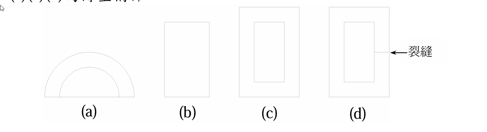

# 考題編號：MM-2010-2

**主分類：** `MM-U2-2` 梁桿件斷面應力計算
**副分類：** `MM-U2-3` 扭力桿件斷面應力計算
**分析法：** 彈性分析
**標籤：** `剪力流` `剪力中心` `薄壁開口斷面` `薄壁閉口斷面` `Bredt公式` `開口vs閉口` `扭矩剪力流` `半圓斷面`

---

## 1. 原始題目重述 (Problem Restatement)

試畫下列四種斷面之剪力流，分別針對兩種載重情況：

**情況(一)：** 若剪力由上而下通過下列斷面之剪力中心，請畫出剪力流。

**情況(二)：** 若受順時針方向扭矩作用，請畫出剪力流。

四種斷面（**(a)(c)(d) 為薄壁構件**）：



*圖說：(a) 薄壁半圓弧形斷面（開口，兩端點在直徑端）；(b) 實心矩形斷面；(c) 矩形薄壁閉合斷面（無裂縫，為閉口薄壁）；(d) 矩形薄壁斷面右側壁中部有裂縫，使其成為開口薄壁斷面。*

---

## 2. 考題核心精神與出題者意圖 (Core Concepts & Examiner's Intent)

**核心觀念：**
1. 剪力流（shear flow）$q = VQ/I$（開口斷面）或需疊加常數 $q_0$（閉口斷面）
2. **剪力通過剪力中心 → 無扭轉，只有彎曲剪力流**
3. **閉口斷面扭矩 → Bredt公式 $q = T/(2A_m)$ = 常數；開口斷面扭矩 → 壁厚方向線性分布，周向幾乎無流量**
4. 裂縫將閉口斷面轉變為開口斷面，扭轉剛度大幅降低

**出題者意圖：** 測試學生能否區分「開口 vs. 閉口」、「剪力 vs. 扭矩」四種組合下剪力流的截然不同行為。

---

## 3. 解題戰略地圖與陷阱分析 (Strategic Roadmap & Trap Analysis)

### 關鍵分類框架

```
斷面類型    開口薄壁           閉口薄壁         實心
情況(一)    q=VQ/I            q=VQ/I+q₀       τ=VQ/(Ib)（拋物線）
剪力通過SC  從自由端到極值點   垂直壁拋物線      
           q=0在端點           水平壁近似均勻    

情況(二)    極弱！St.Venant    q=T/(2Aₘ)      複雜（應力函數）
扭矩       壁厚線性分布        常數沿周邊       中點最大，角點為零
           周向流量≈0          
```

### 四個關鍵陷阱

| # | 陷阱 | 正確觀念 |
|---|------|---------|
| 1 | 以為開口斷面扭矩下有明顯周向剪力流 | 開口薄壁扭矩下剪力流沿**壁厚**線性分布，周向剪力流幾乎為零 |
| 2 | 閉口斷面扭矩下剪力流不知如何計算 | Bredt公式：$q = T/(2A_m)$，沿周邊為**常數** |
| 3 | 忘記剪力通過剪力中心的前提 | 通過SC → 無扭轉分量，只計算彎曲剪力流 |
| 4 | (d) 有裂縫的閉口斷面 | 裂縫使其變成開口斷面，扭轉行為與 (a) 相同（極弱） |

---

## 3.5 變數層次分析 (Variable Hierarchy Analysis)

### 最終目標
針對四種斷面，分別畫出情況(一)「剪力通過SC」與情況(二)「順時針扭矩」下的剪力流分布圖。

### 本題關鍵公式（依計算順序）

$$\text{Step 1（開口斷面剪力流）: } q(s) = \frac{V}{I}\int_0^s y\cdot t\,ds = \frac{VQ(s)}{I}$$

$$\text{Step 2（閉口斷面靜不定校正）: } q(s) = q'(s) + q_0, \quad q_0 = -\frac{\oint q'/t\,ds}{\oint ds/t}$$

$$\text{Step 3（Bredt扭矩公式）: } q = \frac{T}{2A_m} = \text{常數}$$

$$\text{Step 4（開口斷面扭矩）: } \tau_{max} = \frac{T}{J_{open}}\cdot t_{max}, \quad J_{open} = \frac{1}{3}\sum b_i t_i^3 \ll J_{closed}$$

### L1：題目直接給定

| 符號 | 條件 | 說明 |
|------|------|------|
| (a) | 薄壁半圓弧，開口 | 兩端為自由邊（$q=0$） |
| (b) | 實心矩形 | 非薄壁，用 $\tau = VQ/(Ib)$ |
| (c) | 矩形薄壁閉口 | 封閉截面 |
| (d) | 矩形薄壁閉口+裂縫 | 裂縫 → 等效開口截面 |

### L2：需知識點推導

| 知識點 | 公式／來源 | 卡關? |
|--------|-----------|-------|
| 開口斷面剪力流起始點 | $q=0$ 在自由端（切面應力為零） | |
| 閉口斷面需加 $q_0$ | 疊加常數以滿足無扭轉條件 | |
| Bredt公式 | $q = T/(2A_m)$，$A_m$=封閉面積 | |
| 開口薄壁扭轉極弱 | $J_{open} \approx \sum bt^3/3 \ll J_{closed}$ | |

### L3：深層知識

| 知識點 | 說明 | 卡關? |
|--------|------|-------|
| 剪力中心定義 | 剪力通過該點時截面無扭轉 | |
| 裂縫的影響 | 閉口→開口，扭轉剛度可下降1000倍以上 | |
| 對稱截面SC在形心 | 對稱閉口矩形，SC=形心；開口斷面SC通常偏離 | |

---

## 4. 步驟化詳細計算過程 (Step-by-Step Detailed Calculation)

### 情況(一)：剪力 $V$ 由上而下通過剪力中心

#### (a) 薄壁半圓弧（開口斷面）

**剪力中心位置：** 對薄壁半圓弧，剪力中心在對稱軸上，位於弧心下方，距弧心 $e = 4r/\pi$（沿對稱軸，遠離弧的一側）。

**剪力流分布：**
- 以兩端點（直徑端）為起點，$q = 0$
- 沿弧長方向往弧頂（頂點）方向，$q$ 逐漸增大
- 以 $\theta$ 為從端點量起的角度（$0 \le \theta \le \pi$），$q(\theta) = \frac{Vr^2t}{I}(1-\cos\theta)$
- 最大值在弧頂（$\theta = \pi/2$）

**方向：** 左半弧：剪力流沿弧長方向向右上（朝向弧頂）；右半弧：剪力流向左上（朝向弧頂）。兩側對稱，在弧頂合流。

```
        ↗ max q ↖
      ↗           ↖
    ↗               ↖
 q=0                 q=0
（左端點）         （右端點）
```

#### (b) 實心矩形斷面

**剪力中心：** 位於形心（對稱截面，V 通過形心即無扭轉）。

**剪應力分布：** $\tau(y) = \frac{VQ(y)}{Ib}$，在矩形截面呈**拋物線分布**：
$$Q(y) = \frac{b}{2}\left(\frac{h^2}{4} - y^2\right) \Rightarrow \tau(y) = \frac{V}{2I}\left(\frac{h^2}{4}-y^2\right)$$

- 頂面、底面：$\tau = 0$
- 中性軸（$y=0$）：$\tau_{max} = \frac{3V}{2A}$（最大值）
- 剪力流 $q = \tau \cdot b$，亦為拋物線

**方向：** 截面上每點的剪應力方向向下（與 V 同向）

```
  q=0  ─────
       │↓ ↓│← 越靠中性軸越大
       │↓↓↓│ 
       │↓↓↓│ ← q_max（中性軸）
       │↓↓↓│
       │↓ ↓│
  q=0  ─────
```

#### (c) 矩形薄壁閉口斷面

**剪力中心：** 位於形心（雙向對稱閉口矩形）。

**分析方法：** 在頂壁中心截開（對稱點，$q_0$在此可用對稱性確定），求「開口」後的剪力流 $q'$，再加常數 $q_0$ 滿足無扭轉條件 $\oint q\,ds/t = 0$。

**結果（定性描述）：**
- **左右垂直壁：** 剪力流方向向下（與 V 同向），大小從頂端和底端到中性軸呈拋物線增大；兩壁剪力流方向相同（都向下）
- **頂壁：** 從左至右（或從中心向外）的近似均勻剪力流
- **底壁：** 方向與頂壁相反，從右至左（閉合迴路）

```
    ────→─→─────
    ↓           ↓   （兩垂直壁均向下，中性軸最大）
    ↓           ↓
    ↓max     max↓
    ↓           ↓
    ────←─←─────
```

*補充：頂底水平壁的剪力流是連通左右垂直壁的「回路」流，使整體剪力流形成封閉迴路而不產生淨扭矩（因 V 通過 SC=形心）。*

#### (d) 矩形薄壁開口斷面（右壁有裂縫）

裂縫在右壁上，使斷面成為**開口薄壁斷面**（剪力中心不在形心，偏移至左側）。

**剪力流（V 通過新 SC）：**
- $q = 0$ 在裂縫兩側（自由端）
- 從裂縫上端出發：往上→頂壁向左→左垂直壁向下→底壁向右→裂縫下端
- 沿此路徑，$q$ 從 $0$ 開始逐漸增大，到左垂直壁中性軸附近最大，再下降至底壁末端（另一端點）為 $0$

```
    ────←─←─────　╔← q=0 (裂縫上端)
    ↓           │   
    ↓           │
    ↓max     (不連)  
    ↓           │
    ────→─→─────╚← q=0 (裂縫下端)
```

---

### 情況(二)：受順時針方向扭矩作用

#### (a) 薄壁半圓弧（開口斷面）→ 扭轉極弱

**關鍵：** 開口薄壁斷面扭轉剛度極小（$J_{open} = \sum b_i t_i^3/3$），剪力流沿**壁厚方向**線性分布，周向無顯著剪力流。

**表示方式：**
```
外表面 → →   （順時針扭矩：外表面剪力流沿逆時針，即→）
中面    ——     （剪力流=0 在壁厚中線）
內表面 ← ←   （內表面剪力流方向與外相反）
```

每一段薄壁的剪應力沿壁厚線性分布，最大值在壁面，中面為零。截面**整體無周向剪力流**。

#### (b) 實心矩形斷面

**扭轉下的剪應力（St. Venant 扭轉）：**
- 應力沿截面邊界平行分布（應力函數 Prandtl 等高線）
- 角點應力為零（邊界條件 $\phi=0$）
- 最大剪應力在**長邊中點**：$\tau_{max} = \frac{T}{k_1 b h^2}$（$k_1$ 為形狀係數）

```
  0─→─→→→→→→─0
  ↑   循等高線   ↓
  ↑             ↓
  0─←─←←←←←←─0
（角點=0，長邊中點最大）
```

#### (c) 矩形薄壁閉口斷面 → 扭轉強

**Bredt 公式：**
$$\boxed{q = \frac{T}{2A_m} = \text{常數}}$$

其中 $A_m$ 為截面封閉面積（中線所圍面積）。

**方向：** 若外加扭矩為順時針（從正面看），則剪力流沿截面**逆時針**方向流動（以抵抗扭矩）：

```
    ──←─←─←──
    ↓         ↑
    ↓ q=const ↑   （順時針扭矩 → 剪力流逆時針）
    ↓         ↑
    ──→─→─→──
```

#### (d) 矩形薄壁開口斷面（有裂縫）→ 扭轉極弱，與 (a) 相同

裂縫使閉口變為開口，扭轉剛度急劇下降至：
$$J_{open} \approx \frac{1}{3}\sum b_i t_i^3 \ll J_{closed} = \frac{4A_m^2}{\oint ds/t}$$

降低幅度可達**1000倍以上**（以壁厚 $t \ll$ 截面尺寸時）。

**剪力流表現：** 同 (a)，沿壁厚線性分布，外表面最大，中面為零，兩表面方向相反。周向無顯著剪力流。

---

## 5. 關鍵爭議點與進階探討 (Critical Issues & Advanced Discussion)

### 裂縫對剪力流的決定性影響

閉口截面 (c) 與開口截面 (d) 的對比是本題核心：

| 比較項目 | (c) 閉口 | (d) 開口（有裂縫） |
|---------|---------|-----------------|
| 扭轉剛度 $GJ$ | 大（$J = 4A_m^2/\oint ds/t$） | 小（$J = \Sigma bt^3/3$） |
| 扭矩下剪力流 | 周向均勻 $q = T/2A_m$ | 壁厚線性，周向≈0 |
| 剪力中心位置 | 形心（對稱斷面） | 偏移至左側（遠離裂縫） |
| 工程意義 | 高效抵抗扭矩 | 扭矩下急速破壞危險 |

### 剪力中心 vs. 形心

- 對所有實心截面及雙對稱閉口截面：SC = 形心（centroid）
- 對開口薄壁截面（a、d）：SC ≠ 形心，實際載重若通過形心則會產生額外扭矩
- 工程設計中若薄壁梁受橫向力，必須確認力的作用線是否過 SC，否則需疊加扭轉效應
