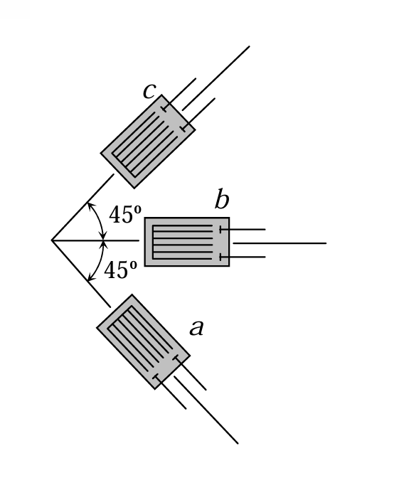

# 考題編號：MM-2010-3

**主分類：** `MM-U1-3` 應力及應變分析原理與應用
**副分類：** 無
**分析法：** 彈性分析
**標籤：** `三片應變規` `應力轉換` `平面應力` `平面應變` `主應力` `絕對最大剪應力` `廣義虎克定律` `莫爾圓應力`

---

## 1. 原始題目重述 (Problem Restatement)

本題共三個子問題：

**(一)** 解釋平面應力狀態（plane stress state）並舉一例。

**(二)** 解釋平面應變狀態（plane strain state）並舉一例。

**(三)** 右圖為三片應變計貼法，貼在自由面上，已知：
$$\varepsilon_a = 1000\,\mu, \quad \varepsilon_b = 800\,\mu, \quad \varepsilon_c = 2000\,\mu$$
$$\nu = 0.3, \quad E = 2.1 \times 10^6\,\text{kg/cm}^2$$

求 $\sigma_{max}$、$\sigma_{min}$ 及絕對 $\tau_{max}$。



*圖說：矩形應變規 b 沿水平方向（0°）、應變規 c 沿 +45° 方向（左上斜）、應變規 a 沿 -45° 方向（左下斜）；三規共頂點，為標準 45°-三軸應變規（T-rosette）。貼於自由表面（外表面），故為平面應力狀態（σz = 0）。*

---

## 2. 考題核心精神與出題者意圖 (Core Concepts & Examiner's Intent)

**核心觀念：**
1. 三片應變規（rosette）的幾何讀值轉換：$\varepsilon_\theta$ → $\varepsilon_x, \varepsilon_y, \gamma_{xy}$
2. 廣義虎克定律（平面應力）：應變 → 應力
3. 主應力（莫爾圓）求解
4. **絕對最大剪應力**需考慮三個主應力（含 $\sigma_3 = 0$），不能只看平面內最大剪應力

**出題者意圖：**
- 測驗「平面應力 / 平面應變」觀念是否清楚（子問題一、二）
- 測驗三片規的轉換是否熟練（子問題三，核心運算）
- 強調「自由面 → $\sigma_z = 0$ → 平面應力 → 三個主應力分別是 $\sigma_1, \sigma_2, 0$」這一關鍵鏈條

---

## 3. 解題戰略地圖與陷阱分析 (Strategic Roadmap & Trap Analysis)

### 作戰計畫

```
(一)(二) 觀念說明 → 各1~2句定義 + 各一個工程實例

(三) 三片規分析：
  ① 讀懂方向：b=0°, c=+45°, a=-45°
  ② 應變轉換公式代入三個 εθ 表達式
  ③ 解出 εx, εy, γxy（三個未知量）
  ④ 廣義虎克定律（平面應力）→ σx, σy, τxy
  ⑤ 莫爾圓 → σ1, σ2
  ⑥ 確認 σ3 = 0（自由面），求絕對 τmax = σ1/2（若 σ1,σ2 均正）
```

### 關鍵陷阱

| # | 陷阱 | 正確做法 |
|---|------|---------|
| 1 | 誤判應變規方向 | 從圖認準：b=0°（水平）、c=+45°、a=-45°；正角為逆時針 |
| 2 | 「自由面」不等於「平面應力」需說明 | 自由面：$\sigma_z = \tau_{xz} = \tau_{yz} = 0$ → 平面應力 |
| 3 | 絕對 $\tau_{max}$ 只看平面內 | 須考慮 $\sigma_3 = 0$；若 $\sigma_1 > \sigma_2 > 0$，則 $\tau_{abs,max} = \sigma_1/2$ |
| 4 | 廣義虎克定律公式錯誤 | $\sigma_x = \frac{E}{1-\nu^2}(\varepsilon_x + \nu\varepsilon_y)$（非 $\sigma = E\varepsilon$） |

---

## 3.5 變數層次分析 (Variable Hierarchy Analysis)

### 最終目標
由三片 45°應變規讀值，計算該點之主應力 $\sigma_{max}$、$\sigma_{min}$，及絕對最大剪應力 $\tau_{max}$（絕對值）。

### 本題關鍵公式（依計算順序）

$$\text{Step 1（應變轉換公式）: } \varepsilon_\theta = \frac{\varepsilon_x+\varepsilon_y}{2} + \frac{\varepsilon_x-\varepsilon_y}{2}\cos 2\theta + \frac{\gamma_{xy}}{2}\sin 2\theta$$

$$\text{Step 2（由三個方程解未知量）: } \varepsilon_x = \varepsilon_b, \quad \varepsilon_y = \varepsilon_c + \varepsilon_a - \varepsilon_b, \quad \gamma_{xy} = \varepsilon_c - \varepsilon_a$$

$$\text{Step 3（廣義虎克定律，平面應力）: } \sigma_x = \frac{E}{1-\nu^2}(\varepsilon_x + \nu \boxed{\varepsilon_y}), \quad \sigma_y = \frac{E}{1-\nu^2}(\boxed{\varepsilon_y} + \nu \varepsilon_x)$$

$$\text{Step 4（剪應力）: } \tau_{xy} = G \cdot \boxed{\gamma_{xy}}, \quad G = \frac{E}{2(1+\nu)}$$

$$\text{Step 5（主應力，莫爾圓）: } \sigma_{1,2} = \frac{\boxed{\sigma_x}+\boxed{\sigma_y}}{2} \pm \sqrt{\left(\frac{\boxed{\sigma_x}-\boxed{\sigma_y}}{2}\right)^2 + \boxed{\tau_{xy}}^2}$$

$$\text{Step 6（絕對最大剪應力）: } \tau_{abs,max} = \frac{\sigma_1 - 0}{2} = \frac{\sigma_1}{2} \quad (\text{因} \sigma_1 > \sigma_2 > \sigma_3 = 0)$$

### L1：題目直接給定

| 符號 | 數值 | 說明 |
|------|------|------|
| $\varepsilon_a$ | $1000\,\mu\varepsilon$ | 規 a 方向（$-45°$）應變 |
| $\varepsilon_b$ | $800\,\mu\varepsilon$ | 規 b 方向（$0°$，水平）應變 |
| $\varepsilon_c$ | $2000\,\mu\varepsilon$ | 規 c 方向（$+45°$）應變 |
| $\nu$ | $0.3$ | 柏松比 |
| $E$ | $2.1\times10^6\,\text{kg/cm}^2$ | 彈性模數 |
| 貼片位置 | 自由面（free surface） | $\Rightarrow \sigma_z = 0$，平面應力 |

### L2：需知識點推導

**應變分量求解**

| 符號 | 公式／來源 | 卡關? |
|------|-----------|-------|
| $\varepsilon_x$ | $= \varepsilon_b$（b 規沿 x 方向） | |
| $\varepsilon_y$ | $= \varepsilon_c + \varepsilon_a - \varepsilon_b$（由三方程消元） | |
| $\gamma_{xy}$ | $= \varepsilon_c - \varepsilon_a$ | |

**應力分量求解**

| 符號 | 公式／來源 | 卡關? |
|------|-----------|-------|
| $G$ | $E/[2(1+\nu)] = 2.1\times10^6/2.6$ | |
| $\sigma_x$ | $\frac{E}{1-\nu^2}(\varepsilon_x+\nu\varepsilon_y)$ | |
| $\sigma_y$ | $\frac{E}{1-\nu^2}(\varepsilon_y+\nu\varepsilon_x)$ | |
| $\tau_{xy}$ | $G\cdot\gamma_{xy}$ | |

**主應力與最大剪應力**

| 符號 | 公式／來源 | 卡關? |
|------|-----------|-------|
| $\sigma_1, \sigma_2$ | 莫爾圓公式 | |
| $\sigma_3$ | $= 0$（自由面平面應力） | |
| $\tau_{abs,max}$ | $= \sigma_1/2$（若 $\sigma_1>\sigma_2>0$） | |

### L3：深層知識

| 知識點 | 說明 | 卡關? |
|--------|------|-------|
| 45°-三軸規的應變轉換捷徑 | $\varepsilon_x = \varepsilon_b$；$\varepsilon_y = \varepsilon_a+\varepsilon_c-\varepsilon_b$；$\gamma_{xy}=\varepsilon_c-\varepsilon_a$（必須記住！） | |
| 平面應力 ≠ 平面應變 | 前者 $\sigma_z=0$（但 $\varepsilon_z\neq 0$）；後者 $\varepsilon_z=0$（但 $\sigma_z\neq 0$） | |
| 絕對最大剪應力的三維觀點 | 在自由面，$\sigma_3=0$；若 $\sigma_1,\sigma_2$ 同號正，$\tau_{abs}=\sigma_1/2$；若異號，$\tau_{abs}=(\sigma_1-\sigma_2)/2$ | |

---

## 4. 步驟化詳細計算過程 (Step-by-Step Detailed Calculation)

### (一) 平面應力狀態（Plane Stress State）

**定義：** 某一方向（通常為 $z$ 方向）的所有應力分量均為零：
$$\sigma_z = 0, \quad \tau_{xz} = 0, \quad \tau_{yz} = 0$$

其餘四個應力分量 $\sigma_x, \sigma_y, \tau_{xy}$ 一般不為零（可為函數 $x,y$ 之函數）。

**注意：** 平面應力狀態中，$z$ 方向的正應變 $\varepsilon_z = -\frac{\nu}{E}(\sigma_x + \sigma_y) \neq 0$（柏松效應）。

**工程實例：** 薄板（thin plate）承受面內力 → 板面法向方向應力為零，屬平面應力問題。

---

### (二) 平面應變狀態（Plane Strain State）

**定義：** 某一方向（通常為 $z$ 方向）的所有應變分量均為零：
$$\varepsilon_z = 0, \quad \gamma_{xz} = 0, \quad \gamma_{yz} = 0$$

由廣義虎克定律，$\varepsilon_z = 0$ 意味著 $z$ 方向受到約束，此時：
$$\sigma_z = \nu(\sigma_x + \sigma_y) \neq 0$$

**工程實例：** 長隧道（長壩體、長壩體）沿軸向被約束，截面應力分析即屬平面應變問題。

---

### (三) 三片應變規分析

#### Step 1：確認應變規方向

由附圖：
- 規 **b**：水平方向，$\theta_b = 0°$
- 規 **c**：左上 $+45°$ 方向，$\theta_c = +45°$
- 規 **a**：左下 $-45°$ 方向，$\theta_a = -45°$

#### Step 2：應變轉換公式代入

應變轉換公式：
$$\varepsilon_\theta = \frac{\varepsilon_x+\varepsilon_y}{2} + \frac{\varepsilon_x-\varepsilon_y}{2}\cos 2\theta + \frac{\gamma_{xy}}{2}\sin 2\theta$$

代入三個角度（令 $\mu = 10^{-6}$）：

| 規 | $\theta$ | $\cos 2\theta$ | $\sin 2\theta$ | 方程式 |
|----|---------|----------------|----------------|--------|
| b | $0°$ | $+1$ | $0$ | $\varepsilon_b = \varepsilon_x = 800\,\mu$ |
| c | $+45°$ | $0$ | $+1$ | $\varepsilon_c = \frac{\varepsilon_x+\varepsilon_y}{2} + \frac{\gamma_{xy}}{2} = 2000\,\mu$ |
| a | $-45°$ | $0$ | $-1$ | $\varepsilon_a = \frac{\varepsilon_x+\varepsilon_y}{2} - \frac{\gamma_{xy}}{2} = 1000\,\mu$ |

#### Step 3：解出應變分量

$$\varepsilon_x = \varepsilon_b = 800\,\mu$$

由 c、a 方程相加：
$$\varepsilon_c + \varepsilon_a = \varepsilon_x + \varepsilon_y \Rightarrow \varepsilon_y = \varepsilon_c + \varepsilon_a - \varepsilon_x = 2000 + 1000 - 800 = 2200\,\mu$$

由 c、a 方程相減：
$$\varepsilon_c - \varepsilon_a = \gamma_{xy} \Rightarrow \gamma_{xy} = 2000 - 1000 = 1000\,\mu$$

$$\boxed{\varepsilon_x = 800\,\mu, \quad \varepsilon_y = 2200\,\mu, \quad \gamma_{xy} = 1000\,\mu}$$

#### Step 4：廣義虎克定律（平面應力，$\sigma_z = 0$）

由自由面條件：$\sigma_z = 0$（平面應力）

$$\sigma_x = \frac{E}{1-\nu^2}(\varepsilon_x + \nu\varepsilon_y) = \frac{2.1\times10^6}{1-0.09}(800+0.3\times2200)\times10^{-6}$$
$$= \frac{2.1\times10^6}{0.91}\times 1460\times10^{-6} = 2{,}307{,}692\times1460\times10^{-6}$$
$$\boxed{\sigma_x \approx 3{,}369\,\text{kg/cm}^2}$$

$$\sigma_y = \frac{E}{1-\nu^2}(\varepsilon_y + \nu\varepsilon_x) = 2{,}307{,}692\times(2200+0.3\times800)\times10^{-6}$$
$$= 2{,}307{,}692\times2440\times10^{-6}$$
$$\boxed{\sigma_y \approx 5{,}631\,\text{kg/cm}^2}$$

剪切模數：
$$G = \frac{E}{2(1+\nu)} = \frac{2.1\times10^6}{2\times1.3} = 807{,}692\,\text{kg/cm}^2$$

$$\tau_{xy} = G\cdot\gamma_{xy} = 807{,}692\times1000\times10^{-6}$$
$$\boxed{\tau_{xy} \approx 808\,\text{kg/cm}^2}$$

#### Step 5：莫爾圓求主應力

$$\sigma_{avg} = \frac{\sigma_x+\sigma_y}{2} = \frac{3369+5631}{2} = 4500\,\text{kg/cm}^2$$

$$R = \sqrt{\left(\frac{\sigma_x-\sigma_y}{2}\right)^2 + \tau_{xy}^2} = \sqrt{\left(\frac{3369-5631}{2}\right)^2 + 808^2}$$
$$= \sqrt{(-1131)^2 + 808^2} = \sqrt{1{,}279{,}161 + 652{,}864} = \sqrt{1{,}932{,}025}$$
$$\approx 1390\,\text{kg/cm}^2$$

$$\boxed{\sigma_{max} = \sigma_1 = 4500 + 1390 = 5890\,\text{kg/cm}^2}$$

$$\boxed{\sigma_{min(\text{平面內})} = \sigma_2 = 4500 - 1390 = 3110\,\text{kg/cm}^2}$$

#### Step 6：絕對最大剪應力

自由面為平面應力，三個主應力為：

$$\sigma_1 = 5890\,\text{kg/cm}^2 > \sigma_2 = 3110\,\text{kg/cm}^2 > \sigma_3 = 0$$

（三者均為正值）

三維莫爾圓半徑（絕對最大剪應力）：

$$\tau_{abs,max} = \frac{\sigma_1 - \sigma_3}{2} = \frac{5890 - 0}{2}$$

$$\boxed{\tau_{abs,max} = 2945\,\text{kg/cm}^2}$$

**⚠ 注意：** 平面內最大剪應力 $\tau_{in-plane} = R = 1390\,\text{kg/cm}^2$，但絕對最大剪應力在**out-of-plane**（繞 $z$ 軸傾斜 45° 的平面上），為 $2945\,\text{kg/cm}^2$，超過平面內的兩倍！

#### 彙整最終答案

| 量 | 數值 |
|----|------|
| $\sigma_{max}$ | $\approx 5890\,\text{kg/cm}^2$（主應力 $\sigma_1$） |
| $\sigma_{min}$ | $\approx 3110\,\text{kg/cm}^2$（主應力 $\sigma_2$，平面內最小）；若考慮第三維則 $\sigma_3 = 0$ |
| 絕對 $\tau_{max}$ | $\approx 2945\,\text{kg/cm}^2$（= $\sigma_1/2$，三維觀點） |

---

## 5. 關鍵爭議點與進階探討 (Critical Issues & Advanced Discussion)

### 「絕對最大剪應力」vs.「平面內最大剪應力」

本題明確要求「**絕對** $\tau_{max}$」，這是提醒考生必須考慮三個主應力：

- **平面內最大剪應力**：$\tau_{in} = (\sigma_1 - \sigma_2)/2 = (5890-3110)/2 = 1390\,\text{kg/cm}^2$
- **絕對最大剪應力**：當 $\sigma_1 > \sigma_2 > \sigma_3 = 0$ 時，$\tau_{abs} = \sigma_1/2 = 2945\,\text{kg/cm}^2$

若材料使用 **Tresca 準則**（最大剪應力理論），以 $\tau_{abs} = 2945$ 判斷是否降伏，而非以 $\tau_{in} = 1390$ 判斷——差距達兩倍，在工程設計上意義重大。

### 平面應力 vs. 平面應變的混淆

| 特性 | 平面應力（Plane Stress） | 平面應變（Plane Strain） |
|------|------------------------|------------------------|
| 條件 | $\sigma_z = 0$ | $\varepsilon_z = 0$ |
| $\sigma_z$ | 0（已知） | $\nu(\sigma_x+\sigma_y) \neq 0$ |
| $\varepsilon_z$ | $-\nu(\sigma_x+\sigma_y)/E \neq 0$ | 0（已知） |
| 典型例 | 薄板、表面應力 | 長隧道、堤壩截面 |
| 本題適用 | ✅（自由面） | ✗ |

### 三片 45°-規的捷徑公式（必記）

對於 **0°-45°-(-45°)** 三片規（b=0°, c=+45°, a=-45°）：

$$\varepsilon_x = \varepsilon_b, \quad \varepsilon_y = \varepsilon_a + \varepsilon_c - \varepsilon_b, \quad \gamma_{xy} = \varepsilon_c - \varepsilon_a$$

此捷徑可省去代入三個方程逐步求解的過程，考場上節省時間。


---

## 互動圖形

[MM-2010-3-mohr-viz.html](MM-2010-3-mohr-viz.html)
