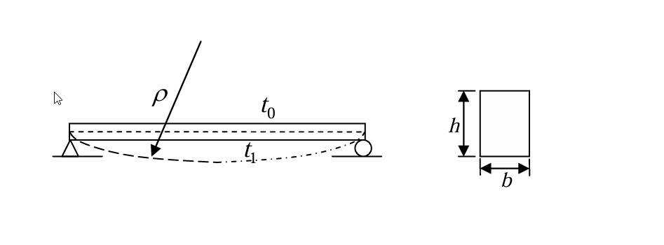

# 考題編號：MM-2011-3

**主分類：** `MM-U2-3` 梁之撓曲與變位分析  
**副分類：**（無）  
**分析法：** 彈性分析（熱應力、溫度梯度引起曲率）  
**標籤：** `溫度梯度` `熱彎曲` `曲率半徑` `線膨脹係數` `簡支梁` `熱效應` `純彎曲`

---

## 1. 原始題目重述 (Problem Restatement)

一矩形截面 $b \times h$ 的簡支梁，梁頂溫度為 $t_0$，梁底溫度為 $t_1$，已知：

$$t_1 - t_0 = 50\,°\text{C}$$

且沿梁深之溫度成**線性變化**。梁的材料為鋼，線膨脹係數：

$$\alpha = 12 \times 10^{-6}\,(\text{°C})^{-1}$$

**試求由溫度場引起的曲率半徑 $\rho$。**（25 分）

*圖說：簡支梁兩端為鉸支，梁頂（冷面）溫度 $t_0$，梁底（熱面）溫度 $t_1$，$t_1 > t_0$（底面較熱），沿梁高線性分布。底面熱膨脹較大，梁向下彎曲（正彎曲方向，底面受拉）。*

---

## 2. 考題核心精神與出題者意圖 (Core Concepts & Examiner's Intent)

**核心觀念：**
1. **熱應變的性質**：溫度變化引起自由膨脹，不產生應力（對靜定結構）
2. **溫度梯度 → 曲率**：均勻溫度引起均勻伸長，**梯度（差異）**引起彎曲
3. **曲率公式**：$\kappa = 1/\rho = \alpha \cdot \Delta T / h$（梁深的溫度梯度乘以線膨脹係數）

**出題者意圖：**
- 測驗「溫度梯度引起彎曲」的概念（與均勻溫度升高只伸長不彎曲的差異）
- 考驗 $\kappa = \alpha \cdot \Delta T / h$ 公式的推導能力
- 可以使用計算器，代入數值即可求 ρ

---

## 3. 解題戰略地圖與陷阱分析 (Strategic Roadmap & Trap Analysis)

**步驟化作戰計畫：**
1. 確認溫度分布（線性，梯度 ΔT/h）
2. 分解溫度場：均勻部分（平均溫度）+ 梯度部分（引起彎曲）
3. 由梯度部分推導曲率 $\kappa = 1/\rho$
4. 代入數值

**關鍵陷阱：**

| 陷阱 | 說明 | 應對 |
|------|------|------|
| ⚠ 簡支梁不產生熱應力 | 靜定結構（簡支梁）自由膨脹，溫度不產生應力 | 溫度只引起變形，不引起應力 |
| ⚠ 均勻溫度不引起彎曲 | 只有溫度「梯度」（分布不均）才引起彎曲 | 分解：均勻 + 梯度 |
| ⚠ ΔT 的定義 | ΔT = 底 - 頂（熱面 - 冷面），為正值 | $\Delta T = t_1 - t_0 = 50°C$ |
| ⚠ ρ 的單位 | ρ 與 h 同單位，需代入 h 的值（h 為符號，答案含 h）| 題目 h 為符號，最終 ρ = h/(α·ΔT) |

---

## 3.5 變數層次分析 (Variable Hierarchy Analysis)

> 複習提示：第一次解題後，在每個卡住的知識點旁標記 `⚠`；第二次複習時只看有 `⚠` 的項目。

### 最終目標
求曲率半徑 $\rho$（以 h 表示）

### 本題關鍵公式

$$\text{溫度梯度：}\quad \frac{\Delta T}{h} = \frac{t_1-t_0}{h} = \frac{50}{h}\,\text{°C/m（或 /mm）}$$

$$\text{各纖維熱應變：}\quad \varepsilon_T(y) = \alpha \cdot T(y) - \alpha \cdot T_{avg} = \alpha \cdot \frac{(t_1-t_0)}{h}\cdot\left(\frac{h}{2}-y\right) \quad \text{（以中性軸為基準）}$$

$$\text{曲率：}\quad \kappa = \frac{1}{\rho} = \frac{\varepsilon_{bottom} - \varepsilon_{top}}{h} = \frac{\alpha(t_1-t_0)}{h}$$

$$\boxed{\rho = \frac{h}{\alpha(t_1-t_0)} = \frac{h}{12\times10^{-6}\times 50} = \frac{h}{6\times10^{-4}} = \frac{5000h}{3}}$$

### L1：題目直接給定

| 符號 | 數值 | 說明 |
|------|------|------|
| $t_1 - t_0$ | 50 °C | 底面比頂面高的溫度差 |
| $\alpha$ | $12\times10^{-6}$ /°C | 線膨脹係數 |
| $b, h$ | — | 矩形斷面尺寸 |
| 支承條件 | 簡支（靜定）| 自由膨脹，無熱應力 |

---

## 4. 步驟化詳細計算過程 (Step-by-Step Detailed Calculation)

### 步驟 1：溫度分布分析

設 $y$ 從截面中性軸向上為正（$y \in [-h/2, +h/2]$），溫度線性分布：

$$T(y) = \frac{t_0+t_1}{2} + \frac{t_0-t_1}{h}\cdot y$$

驗算：
- 頂面 $y=+h/2$：$T = (t_0+t_1)/2 + (t_0-t_1)/2 = t_0$ ✓  
- 底面 $y=-h/2$：$T = (t_0+t_1)/2 - (t_0-t_1)/2 = t_1$ ✓

**分解溫度場：**
- **均勻部分（引起均勻伸長）**：$T_{avg} = (t_0+t_1)/2$
- **梯度部分（引起彎曲）**：$\Delta T(y) = T(y) - T_{avg} = \dfrac{t_0-t_1}{h}\cdot y$

### 步驟 2：各纖維的熱應變

由梯度部分引起的熱應變（均勻部分對曲率無貢獻）：

$$\varepsilon_T(y) = \alpha\cdot\Delta T(y) = \alpha\cdot\frac{t_0-t_1}{h}\cdot y = -\alpha\cdot\frac{t_1-t_0}{h}\cdot y$$

### 步驟 3：由熱應變推導曲率

對純彎曲，各纖維應變與曲率的關係（Euler-Bernoulli 梁）：

$$\varepsilon(y) = -\frac{y}{\rho} = -\kappa y$$

令熱應變等於幾何應變（靜定梁無熱應力，熱應變即實際應變）：

$$-\kappa y = -\alpha\cdot\frac{t_1-t_0}{h}\cdot y$$

$$\kappa = \frac{1}{\rho} = \frac{\alpha(t_1-t_0)}{h}$$

**等效推導（更直觀）：**

底面熱伸長量 $\varepsilon_{bot} = \alpha\cdot t_1$（忽略均勻部分，只看相對）  
頂面熱伸長量 $\varepsilon_{top} = \alpha\cdot t_0$

兩纖維相差 $h$（截面高度），應變差：

$$\varepsilon_{bot} - \varepsilon_{top} = \alpha(t_1-t_0)$$

曲率（應變梯度）：

$$\kappa = \frac{\varepsilon_{bot} - \varepsilon_{top}}{h} = \frac{\alpha(t_1-t_0)}{h}$$

### 步驟 4：代入數值求曲率半徑 ρ

$$\rho = \frac{h}{\alpha(t_1-t_0)} = \frac{h}{12\times10^{-6} \times 50} = \frac{h}{6\times10^{-4}}$$

$$\boxed{\rho = \frac{h}{6\times10^{-4}} = \frac{5000h}{3} \approx 1666.7\,h}$$

**單位說明：** ρ 與 h 同單位（h 以公尺則 ρ 為公尺，h 以 mm 則 ρ 為 mm）。

**數值示例：**
- $h = 300\,\text{mm}$：$\rho = 300/(6\times10^{-4}) = 500{,}000\,\text{mm} = 500\,\text{m}$
- $h = 600\,\text{mm}$：$\rho = 600/(6\times10^{-4}) = 1{,}000{,}000\,\text{mm} = 1000\,\text{m} = 1\,\text{km}$

---

## 5. 關鍵爭議點與進階探討 (Critical Issues & Advanced Discussion)

### 5.1 為何簡支梁不產生熱應力？

靜定結構（簡支梁）沒有多餘約束，溫度引起的自由膨脹和彎曲不受阻礙，各纖維可自由伸縮，故無熱應力（$\sigma = E\varepsilon_{mechanical} = E(\varepsilon_{total} - \varepsilon_{thermal}) = 0$）。

若改為固定梁（兩端固定），則溫度膨脹受到約束，會產生熱應力（熱應力 = $-\alpha \cdot E \cdot \Delta T$ 的均勻應力）。

### 5.2 彎曲方向與 ρ 的符號

本題 $t_1 > t_0$（底面較熱），底面伸長較多，梁向下彎曲（凹面向上，正彎曲，底面受拉）。

曲率 $\kappa = \alpha(t_1-t_0)/h > 0$，表示正彎曲（底面受拉），對應梁的向下撓曲。

### 5.3 與彈性彎曲的對比

彈性彎曲（外力 M 引起）：$\kappa = M/(EI)$

熱彎曲（溫度梯度引起）：$\kappa = \alpha \cdot \Delta T / h$

兩者引起的彎曲效果「相加」：若同時有外力和溫度，$\kappa_{total} = M/(EI) + \alpha\Delta T/h$。

### 5.4 此公式的適用性

公式 $\kappa = \alpha\Delta T/h$ 適用於：
- 截面沿梁高的溫度**線性變化**
- 梁材料均質（$\alpha$ 常數）
- 靜定結構（無熱應力）或分析熱彎曲部分

對非線性溫度分布，需用積分 $\kappa = \alpha \int_{-h/2}^{h/2} T(y)y\,dA / I$ 計算。
