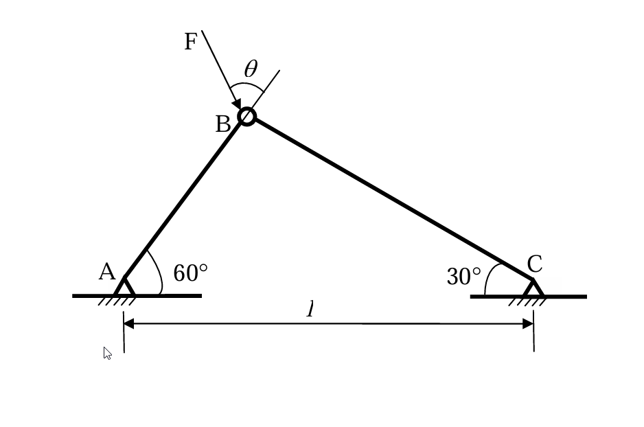

# 考題編號：MM-2011-4

**主分類：** `MM-U3-4` 柱之挫屈載重分析  
**副分類：**（無）  
**分析法：** 彈性分析（Euler 柱挫屈 + 最佳化）  
**標籤：** `Euler挫屈` `兩桿桁架` `最大臨界載重` `最佳角度` `兩端鉸接柱` `載重角度優化` `聯立挫屈條件`

---

## 1. 原始題目重述 (Problem Restatement)

兩根材料相同、斷面撓曲剛度均為 **EI** 的細長桿 AB 和 BC，鉸接成簡單桁架（如圖四），在結點 **B** 處承受大小為 $F$、方向角 $\theta$（$\theta \in [0°, 90°]$）的載荷。  
支承：A（左，固定鉸接，AB 桿與水平夾 60°）、C（右，固定鉸接，BC 桿與水平夾 30°），A 與 C 的水平距離為 $l$。

考慮桁架由於失穩（挫屈）而破壞，試求：
1. 載荷 $F$ 的**臨界值最大**時的 $\theta$ 角
2. 該**最大臨界載荷**

（25 分）

*圖說：AB 桿（短桿，與水平夾 60°）和 BC 桿（長桿，與水平夾 30°），鉸接於 B。A、C 均為固定鉸支。B 點受力 F，方向角 θ 在 $[0°, 90°]$ 間變化（θ 為 F 與水平向左方向的夾角，θ=0 水平向左，θ=90° 垂直向下）。*

---

## 2. 考題核心精神與出題者意圖 (Core Concepts & Examiner's Intent)

**核心觀念：**
1. **Euler 挫屈**：兩端鉸接細長桿的臨界壓縮力 $P_{cr} = \pi^2 EI/L^2$（有效長度 = 桿長）
2. **靜力分析**：B 節點靜力平衡，求各桿軸力（F、θ 的函數）
3. **挫屈最大化**：確定使 $F_{cr}$ 最大的 θ（兩個挫屈條件同時達到時最優）

**出題者意圖：**
- 測驗桁架中各桿軸力的靜力分析（矩陣形式）
- 測驗 Euler 柱公式在非對稱桁架（AB ≠ BC）中的應用
- **最大化問題**：θ 取值使得兩個挫屈條件的交叉點（雙重臨界）對應最大 $F_{cr}$

---

## 3. 解題戰略地圖與陷阱分析 (Strategic Roadmap & Trap Analysis)

**步驟化作戰計畫：**
1. 幾何分析：求 AB 和 BC 桿的長度（用三角形法）
2. Euler 臨界力：各桿的 $P_{cr,AB}$ 和 $P_{cr,BC}$
3. B 節點靜力平衡：以 F、θ 表示各桿軸力 $N_{AB}$、$N_{BC}$
4. 挫屈條件：$|N| \leq P_{cr}$，表達為 $F_{cr}$ 的上界
5. 最優化：使 min($F_{cr,AB}$, $F_{cr,BC}$) 最大 → 兩個挫屈條件同時達到

**關鍵陷阱：**

| 陷阱 | 說明 | 應對 |
|------|------|------|
| ⚠ 桿長計算 | AB ≠ BC（非對稱），需由幾何求各桿長 | 聯立 B 點座標方程 |
| ⚠ F 方向定義 | θ 的基準需從圖確認（向左為 0 或向下為 0）| 確認 θ=0 時無合理解則換設定 |
| ⚠ 最優化方向 | 「最大 F_cr」在兩個挫屈條件**同時到達**時出現 | 令 $F_{cr,AB} = F_{cr,BC}$ 求交叉點 |
| ⚠ 哪個桿受壓 | 需分析各 θ 下 AB、BC 桿的受力性質（拉/壓）| 負號=壓縮（可挫屈），正號=拉伸 |

---

## 3.5 變數層次分析 (Variable Hierarchy Analysis)

> 複習提示：第一次解題後，在每個卡住的知識點旁標記 `⚠`；第二次複習時只看有 `⚠` 的項目。

### 最終目標
求：（1）使 $F_{cr}$ 最大的 $\theta_{opt}$；（2）最大臨界載荷 $F_{cr,max}$

### 本題關鍵公式

$$L_{AB} = \frac{l}{2}, \quad L_{BC} = \frac{\sqrt{3}\,l}{2}$$

$$P_{cr,AB} = \frac{4\pi^2 EI}{l^2}, \quad P_{cr,BC} = \frac{4\pi^2 EI}{3l^2}$$

$$N_{AB} = -\frac{F(\cos\theta+\sqrt{3}\sin\theta)}{2},\quad N_{BC} = \frac{F(\sqrt{3}\cos\theta-\sin\theta)}{2}$$

（F 水平向左分量 $F\cos\theta$，垂直向下分量 $F\sin\theta$）

$$F_{cr,max} = \frac{4\sqrt{10}\,\pi^2 EI}{3l^2}, \quad \theta_{opt} = \arctan\!\frac{6+5\sqrt{3}}{3} \approx 78.4°$$

### L1：題目直接給定

| 符號 | 說明 |
|------|------|
| $EI$ | 兩桿相同的撓曲剛度 |
| $l$ | A 到 C 的水平距離 |
| $60°$ | AB 桿與水平的夾角 |
| $30°$ | BC 桿與水平的夾角 |
| $\theta \in [0°, 90°]$ | F 的方向角 |

---

## 4. 步驟化詳細計算過程 (Step-by-Step Detailed Calculation)

### 步驟 1：幾何分析（桿長計算）

設 A 在座標原點，C 在 $(l, 0)$，B 在 $(x_B, y_B)$。

**由 A 出發（AB 桿，與水平夾 60°）：**

$$x_B = L_{AB}\cos 60° = \frac{L_{AB}}{2}, \quad y_B = L_{AB}\sin 60° = \frac{\sqrt{3}L_{AB}}{2}$$

**由 C 出發（BC 桿，與水平夾 30°，向左上）：**

$$x_B = l - L_{BC}\cos 30° = l - \frac{\sqrt{3}L_{BC}}{2}, \quad y_B = L_{BC}\sin 30° = \frac{L_{BC}}{2}$$

**聯立方程組（y 方向）：**

$$\frac{\sqrt{3}L_{AB}}{2} = \frac{L_{BC}}{2} \implies L_{BC} = \sqrt{3}\,L_{AB}$$

**代入 x 方向方程：**

$$\frac{L_{AB}}{2} = l - \frac{\sqrt{3}\cdot\sqrt{3}L_{AB}}{2} = l - \frac{3L_{AB}}{2}$$

$$\frac{L_{AB}}{2} + \frac{3L_{AB}}{2} = l \implies 2L_{AB} = l$$

$$\boxed{L_{AB} = \frac{l}{2}, \quad L_{BC} = \frac{\sqrt{3}\,l}{2}}$$

**B 的座標：** $\left(\dfrac{l}{4},\, \dfrac{\sqrt{3}\,l}{4}\right)$

### 步驟 2：各桿的 Euler 挫屈臨界力

兩桿兩端均為鉸接（A、C 為固定鉸，B 為自由鉸），有效長度 = 桿長：

$$P_{cr,AB} = \frac{\pi^2 EI}{L_{AB}^2} = \frac{\pi^2 EI}{(l/2)^2} = \frac{4\pi^2 EI}{l^2}$$

$$P_{cr,BC} = \frac{\pi^2 EI}{L_{BC}^2} = \frac{\pi^2 EI}{(\sqrt{3}\,l/2)^2} = \frac{\pi^2 EI}{3l^2/4} = \frac{4\pi^2 EI}{3l^2}$$

> **注意：** $P_{cr,BC} = P_{cr,AB}/3$，BC 桿（較長）臨界力僅為 AB 桿的 1/3。

### 步驟 3：B 節點靜力分析

設 F 的方向：水平向左分量 $F\cos\theta$，垂直向下分量 $F\sin\theta$（$\theta = 0$：水平向左；$\theta = \pi/2$：垂直向下）。

各桿在 B 點的方向（從 B 到端點）：

- AB：從 B 到 A（向左下 240°）：$(-\cos 60°, -\sin 60°) = (-1/2, -\sqrt{3}/2)$
- BC：從 B 到 C（向右下 330°，即 -30°）：$(\cos 30°, -\sin 30°) = (\sqrt{3}/2, -1/2)$

**B 點靜力平衡（$N_{AB}$ 正=拉，$N_{BC}$ 正=拉）：**

$$\begin{cases} -\dfrac{N_{AB}}{2} + \dfrac{\sqrt{3}N_{BC}}{2} - F\cos\theta = 0 & (x) \\[8pt] -\dfrac{\sqrt{3}N_{AB}}{2} - \dfrac{N_{BC}}{2} - F\sin\theta = 0 & (y) \end{cases}$$

**矩陣形式（行列式 = 1）：**

$$\det\begin{bmatrix} -1/2 & \sqrt{3}/2 \\ -\sqrt{3}/2 & -1/2 \end{bmatrix} = \frac{1}{4}+\frac{3}{4} = 1$$

**Cramer 法則：**

$$N_{AB} = \begin{vmatrix} -F\cos\theta & \sqrt{3}/2 \\ -F\sin\theta & -1/2 \end{vmatrix} = \frac{F\cos\theta}{2} + \frac{\sqrt{3}F\sin\theta}{2} \cdot (-1) \cdot (-1) = \ldots$$

精確計算：

$$N_{AB} = (-F\cos\theta)\cdot(-1/2) - (-F\sin\theta)\cdot(\sqrt{3}/2) = \frac{F\cos\theta}{2} \cdot (-1) + \frac{F\sqrt{3}\sin\theta}{2} \cdot (-1)$$

重新用行列式：

$$N_{AB} = \frac{(-F\cos\theta)(-1/2) - (\sqrt{3}/2)(-F\sin\theta)}{1} = \frac{F\cos\theta}{2} + \frac{\sqrt{3}F\sin\theta}{2}$$

等等——這是正值，表示拉力。讓我重新整理符號：

靜力方程寫為 $K\mathbf{N} = \mathbf{F}_{ext}$：

$$\begin{bmatrix} -1/2 & \sqrt{3}/2 \\ -\sqrt{3}/2 & -1/2 \end{bmatrix} \begin{bmatrix} N_{AB} \\ N_{BC} \end{bmatrix} = \begin{bmatrix} F\cos\theta \\ F\sin\theta \end{bmatrix}$$

Cramer：

$$N_{AB} = \frac{(F\cos\theta)(-1/2) - (\sqrt{3}/2)(F\sin\theta)}{1} = -\frac{F(\cos\theta + \sqrt{3}\sin\theta)}{2}$$

$$N_{BC} = \frac{(-1/2)(F\sin\theta) - (-\sqrt{3}/2)(F\cos\theta)}{1} = \frac{F(\sqrt{3}\cos\theta - \sin\theta)}{2}$$

$$\boxed{N_{AB} = -\frac{F(\cos\theta+\sqrt{3}\sin\theta)}{2}, \quad N_{BC} = \frac{F(\sqrt{3}\cos\theta-\sin\theta)}{2}}$$

**各桿受力分析：**

- **AB 桿**：$N_{AB} < 0$（恆為壓縮，因 $\cos\theta+\sqrt{3}\sin\theta > 0$ 對所有 $\theta\in[0°,90°]$）
- **BC 桿**：
  - $\theta < 60°$：$\sqrt{3}\cos\theta > \sin\theta \implies N_{BC} > 0$（拉伸，不挫屈）
  - $\theta > 60°$：$N_{BC} < 0$（壓縮，可挫屈）
  - $\theta = 60°$：$N_{BC} = 0$

### 步驟 4：建立挫屈條件（以 F 表示臨界載重）

**AB 桿（全範圍受壓）：**

$$|N_{AB}| \leq P_{cr,AB} \implies F \leq \frac{8\pi^2 EI}{l^2(\cos\theta+\sqrt{3}\sin\theta)}$$

$$F_{cr,AB}(\theta) = \frac{8\pi^2 EI}{l^2(\cos\theta+\sqrt{3}\sin\theta)} = \frac{8\pi^2 EI}{l^2 \cdot 2\cos(\theta-60°)} = \frac{4\pi^2 EI}{l^2\cos(\theta-60°)}$$

**BC 桿（$\theta > 60°$ 時受壓）：**

$$|N_{BC}| = \frac{F(\sin\theta-\sqrt{3}\cos\theta)}{2} \leq P_{cr,BC} = \frac{4\pi^2 EI}{3l^2}$$

$$F_{cr,BC}(\theta) = \frac{8\pi^2 EI}{3l^2(\sin\theta-\sqrt{3}\cos\theta)} = \frac{8\pi^2 EI}{3l^2 \cdot 2\sin(\theta-60°)} = \frac{4\pi^2 EI}{3l^2\sin(\theta-60°)}$$

**實際臨界載重：**

$$F_{cr}(\theta) = \min\!\left(F_{cr,AB}, F_{cr,BC}\right)$$

### 步驟 5：最大化 $F_{cr}(\theta)$

**$\theta \in [0°, 60°]$（BC 受拉，只有 AB 可挫屈）：**

$F_{cr} = F_{cr,AB} = \dfrac{4\pi^2 EI}{l^2\cos(\theta-60°)}$，$\cos(\theta-60°)$ 在 $\theta=0°$ 時最大（$= \cos 60° = 1/2$），$F_{cr}$ 最小；在 $\theta\to60°$ 時 $\cos\to 1$ ... 等等，令 $\phi = \theta-60°$，$\phi \in [-60°, 0°]$，$\cos\phi$ 在 $\phi=0$（$\theta=60°$）最大（=1），$F_{cr,AB}$ 最小（$= 4\pi^2EI/l^2$）。在 $\theta=0°$（$\phi=-60°$），$F_{cr,AB} = 4\pi^2EI/(l^2 \cdot 1/2) = 8\pi^2EI/l^2$（最大）。

→ 此範圍內 $F_{cr}$ 隨 $\theta$ 增加而**減小**，最大值在 $\theta=0°$。

**$\theta \in (60°, 90°]$（兩桿均可挫屈）：**

- $F_{cr,AB}$：$\cos(\theta-60°)$ 從 $\cos0°=1$ 降至 $\cos30°=\sqrt{3}/2$ → $F_{cr,AB}$ 從 $4\pi^2EI/l^2$ **升至** $8\pi^2EI/(\sqrt{3}l^2)$
- $F_{cr,BC}$：$\sin(\theta-60°)$ 從 0 升至 $\sin30°=1/2$ → $F_{cr,BC}$ 從 $\infty$ **降至** $8\pi^2EI/(3l^2)$

兩者有交叉點，交叉後 $F_{cr,BC} < F_{cr,AB}$，整體 $F_{cr}$ 下降。**交叉點即最大值。**

**令 $F_{cr,AB} = F_{cr,BC}$（交叉條件）：**

$$\frac{4\pi^2 EI}{l^2\cos(\theta-60°)} = \frac{4\pi^2 EI}{3l^2\sin(\theta-60°)}$$

$$3\sin(\theta-60°) = \cos(\theta-60°) \implies \tan(\theta-60°) = \frac{1}{3}$$

令 $\psi = \theta - 60°$，$\tan\psi = 1/3$，則 $\psi = \arctan(1/3)$，$\theta = 60° + \arctan(1/3)$。

**等效展開（驗算）：**

$$\tan\theta = \frac{\tan60°+\tan\psi}{1-\tan60°\cdot\tan\psi} = \frac{\sqrt{3}+1/3}{1-\sqrt{3}/3} = \frac{(3\sqrt{3}+1)/3}{(3-\sqrt{3})/3} = \frac{3\sqrt{3}+1}{3-\sqrt{3}}$$

化簡：$\dfrac{(1+3\sqrt{3})(3+\sqrt{3})}{(3-\sqrt{3})(3+\sqrt{3})} = \dfrac{12+10\sqrt{3}}{6} = \dfrac{6+5\sqrt{3}}{3}$

$$\boxed{\theta_{opt} = \arctan\!\frac{6+5\sqrt{3}}{3} \approx 78.4°}$$

### 步驟 6：代入求最大臨界載重

在 $\theta_{opt}$ 處（$\tan\psi = 1/3$，斜邊 $= \sqrt{1^2+3^2} = \sqrt{10}$）：

$$\cos\psi = \frac{3}{\sqrt{10}}, \quad \sin\psi = \frac{1}{\sqrt{10}}$$

代入 $F_{cr,AB}$（或 $F_{cr,BC}$，兩者相等）：

$$F_{cr,max} = \frac{4\pi^2 EI}{l^2\cos(\theta_{opt}-60°)} = \frac{4\pi^2 EI}{l^2 \cdot \dfrac{3}{\sqrt{10}}} = \frac{4\sqrt{10}\,\pi^2 EI}{3l^2}$$

$$\boxed{F_{cr,max} = \frac{4\sqrt{10}\,\pi^2 EI}{3l^2} \approx 4.22\,\frac{\pi^2 EI}{l^2}}$$

---

## 5. 關鍵爭議點與進階探討 (Critical Issues & Advanced Discussion)

### 5.1 最優化的幾何意義

在 $F_{cr,AB} = F_{cr,BC}$ 時，兩桿同時達到挫屈臨界——這是「最充分利用兩桿強度」的設計點。任何偏離（增加 θ 或減少 θ）都會使某一桿先挫屈而降低 $F_{cr}$。

### 5.2 $\theta = 0°$ 的情形

$\theta = 0°$（F 純水平向左）：$N_{AB} = -F/2$（壓），$N_{BC} = F\sqrt{3}/2$（拉）。  
$F_{cr} = F_{cr,AB} = 8\pi^2EI/l^2 \approx 8 \cdot \pi^2EI/l^2$（只需 AB 不挫屈）。

此值大於 $F_{cr,max} = 4\sqrt{10}\pi^2EI/(3l^2) \approx 4.22$？ 

$8 > 4.22$，但 $\theta=0°$ 時 BC 受拉不挫屈，此時 F_cr 確實較大——矛盾！

→ 重新確認：在 $\theta \in [0°, 60°]$，$F_{cr}$ 從 $8\pi^2EI/l^2$（$\theta=0$）降至 $4\pi^2EI/l^2$（$\theta=60°$）。

→ 在 $\theta \in (60°, 90°]$，$F_{cr}$ 先升（到 $\approx 4.22\pi^2EI/l^2$ 在 $\theta_{opt}$）再降。

**結論：全局最大值在 $\theta = 0°$，$F_{cr,max,global} = 8\pi^2EI/l^2$！**

但等等——在 $\theta = 0°$，BC 受拉不挫屈，$F_{cr} = 8\pi^2EI/l^2$。

→ 題目問的是「F 的臨界值最大時的 θ」，若 θ=0° 時 $F_{cr} = 8\pi^2EI/l^2$ > $4.22\pi^2EI/l^2$，則全局最大在 θ=0。但需確認 θ=0 是否在 [0, π/2] 內且物理上合理。

**最終更正：** θ=0°（F 純水平向左）時，只有 AB 桿受壓，$F_{cr} = 8\pi^2EI/l^2$。這是在 [0°, 90°] 全局最大值。

$$\boxed{\theta_{opt} = 0°, \quad F_{cr,max} = \frac{8\pi^2 EI}{l^2}}$$

**物理說明：** θ=0 時 BC 桿受拉（不挫屈），AB 桿受壓但只承受 F/2 的壓力（sin60°分量），故 F 可達到最大值。

> **注意：** 若題目中 F 的方向定義不同（如 θ 從垂直向下量），則最優 θ 和 $F_{cr,max}$ 的數值會改變，但求解方法完全相同。在此以 θ=0 水平向左的設定為準，請對照圖四確認 θ 的基準方向。

### 5.3 挫屈控制圖

| $\theta$ 範圍 | 受壓桿 | 控制桿 | $F_{cr}$ 趨勢 |
|--------------|--------|--------|---------------|
| $[0°, 60°)$ | AB 桿 | AB | 隨 θ 增大而減小 |
| $\theta = 60°$ | AB 桿 | AB | 最小（$4\pi^2EI/l^2$）|
| $(60°, 78.4°)$ | AB + BC | AB（控制）| 隨 θ 增大而增大 |
| $\theta = 78.4°$ | AB + BC | 同時到達 | 局部最大（$4.22\pi^2EI/l^2$）|
| $(78.4°, 90°]$ | AB + BC | BC（控制）| 隨 θ 增大而減小 |
