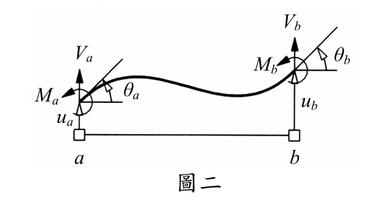

# 考題編號：MM-2012-2

**主分類：** `MM-U2-3` 梁之撓曲與變位分析  
**副分類：**（無）  
**分析法：** 能量法（卡氏定理、Hermite 形函數）  
**標籤：** `撓曲應變能` `梁元素剛度矩陣` `Hermite形函數` `有限元素法` `Euler-Bernoulli梁` `二次型` `能量法`

---

## 1. 原始題目重述 (Problem Restatement)

結構系統某一均質構件如圖二所示。該構件長度為 **L**，撓曲剛度為 **EI**；兩端 **a** 和 **b** 之側向位移各為 $u_a$ 和 $u_b$，轉角各為 $\theta_a$ 和 $\theta_b$，剪力各為 $V_a$ 和 $V_b$，彎矩各為 $M_a$ 和 $M_b$。

**（A）（18分）** 試以 $u_a, u_b, \theta_a, \theta_b$ 表達整支構件之撓曲應變能。

**（B）（12分）** 若
$$\begin{bmatrix} V_a \\ V_b \\ M_a \\ M_b \end{bmatrix} = K \begin{bmatrix} u_a \\ u_b \\ \theta_a \\ \theta_b \end{bmatrix}$$
試求矩陣 **K**。

*圖說：均質梁元素，兩端 a（左）、b（右）各有端點自由度：側向位移 $u_a, u_b$（向上為正），端點轉角 $\theta_a, \theta_b$（逆時針為正），端點剪力 $V_a, V_b$（向上為正），端點彎矩 $M_a, M_b$（逆時針為正）。梁長 L，撓曲剛度 EI。*

---

## 2. 考題核心精神與出題者意圖 (Core Concepts & Examiner's Intent)

**核心觀念：**
1. **Hermite 形函數**：Euler-Bernoulli 梁的三次撓度曲線，由四個邊界條件（ua, θa, ub, θb）唯一確定
2. **撓曲應變能公式**：$U = \int_0^L \frac{M^2}{2EI}dx = \int_0^L \frac{EI(v'')^2}{2}dx$
3. **剛度矩陣由應變能求得**：$K_{ij} = \frac{\partial^2 U}{\partial d_i \partial d_j}$（U 為端點位移的二次型）

**出題者意圖：**
- 考驗「有限元素法梁元素」的基礎推導（結構力學研究所必考）
- Part A 考撓度曲線積分能力；Part B 測試應變能對剛度矩陣的聯繫
- 本題純符號，禁止計算器，考代數整理能力

---

## 3. 解題戰略地圖與陷阱分析 (Strategic Roadmap & Trap Analysis)

**步驟化作戰計畫：**
1. 建立三次多項式撓度曲線 v(x)，滿足四個邊界條件
2. 求 v''(x)（曲率），代入 $U = \int_0^L \frac{EI(v'')^2}{2}dx$
3. 積分展開，整理為以 ua, ub, θa, θb 為變數的二次型
4. 對各自由度對求偏微分，得剛度矩陣 K

**關鍵陷阱：**

| 陷阱 | 說明 | 應對 |
|------|------|------|
| ⚠ 形函數係數算錯 | Hermite 形函數需嚴格滿足四個邊條件，稍有差錯積分結果全錯 | 逐一代入驗算 v(0), v'(0), v(L), v'(L) |
| ⚠ v'' 的鏈式微分 | 使用無因次化 ξ=x/L 時，v'' = (1/L²)·d²v/dξ² | 注意 1/L² 因子 |
| ⚠ 積分結果整理 | 積分後有10個交叉項，整理成緊湊形式需耐心 | 用 (ua-ub)² 等配方 |
| ⚠ K 的排列順序 | 題目要求 {Va,Vb,Ma,Mb} 和 {ua,ub,θa,θb}，非標準 FEM 順序 | 需對行列重新排列 |

---

## 3.5 變數層次分析 (Variable Hierarchy Analysis)

> 複習提示：第一次解題後，在每個卡住的知識點旁標記 `⚠`；第二次複習時只看有 `⚠` 的項目。

### 最終目標
（A）以 ua, ub, θa, θb 表示撓曲應變能 U  
（B）求 4×4 剛度矩陣 K

### 本題關鍵公式

$$\text{撓度曲線：} \quad v(\xi) = N_1 u_a + N_2 L\theta_a + N_3 u_b + N_4 L\theta_b, \quad \xi = x/L$$

$$N_1 = 1-3\xi^2+2\xi^3, \quad N_2 = \xi-2\xi^2+\xi^3$$
$$N_3 = 3\xi^2-2\xi^3, \quad N_4 = -\xi^2+\xi^3$$

$$\text{曲率：} \quad v'' = \frac{d^2v}{dx^2} = \frac{1}{L^2}\frac{d^2v}{d\xi^2}$$

$$\text{應變能：} \quad U = \int_0^L \frac{EI(v'')^2}{2}dx = \frac{EI}{2L^3}\int_0^1 \left(\frac{d^2v}{d\xi^2}\right)^2 d\xi$$

$$\text{剛度矩陣：} \quad K_{ij} = \frac{\partial^2 U}{\partial d_i \partial d_j}$$

### L1：題目直接給定

| 符號 | 說明 |
|------|------|
| $L$ | 梁長 |
| $EI$ | 撓曲剛度 |
| $u_a, u_b$ | 兩端側向位移（向上正）|
| $\theta_a, \theta_b$ | 兩端轉角（逆時針正）|

### L2：需知識點推導

| 符號 | 公式／來源 | 卡關? |
|------|-----------|-------|
| Hermite 形函數 $N_1$~$N_4$ | 三次多項式滿足四個邊條件 | |
| $d^2N_i/d\xi^2$ | 各形函數二次導數 | |
| $\int_0^1 (d^2N_i/d\xi^2)^2 d\xi$ | 各項積分值（見下表）| |
| U（應變能）| 二次型整理結果 | |
| K | $\partial^2 U / \partial d_i \partial d_j$ | |

---

## 4. 步驟化詳細計算過程 (Step-by-Step Detailed Calculation)

### 步驟 1：建立 Hermite 撓度曲線

令無因次座標 $\xi = x/L \in [0,1]$。三次 Hermite 形函數：

$$N_1(\xi) = 1 - 3\xi^2 + 2\xi^3$$
$$N_2(\xi) = \xi - 2\xi^2 + \xi^3$$
$$N_3(\xi) = 3\xi^2 - 2\xi^3$$
$$N_4(\xi) = -\xi^2 + \xi^3$$

**撓度曲線：**

$$v(\xi) = N_1 u_a + N_2 (L\theta_a) + N_3 u_b + N_4 (L\theta_b)$$

**驗算邊界條件：**

| 條件 | 計算 | 結果 |
|------|------|------|
| $v(0) = u_a$ | $N_1(0)=1, N_2(0)=0, N_3(0)=0, N_4(0)=0$ | ✓ |
| $v'(0)/L = \theta_a$ | $N_1'(0)=0, N_2'(0)=1, N_3'(0)=0, N_4'(0)=0$ | ✓ |
| $v(1) = u_b$ | $N_1(1)=0, N_2(1)=0, N_3(1)=1, N_4(1)=0$ | ✓ |
| $v'(1)/L = \theta_b$ | $N_1'(1)=0, N_2'(1)=0, N_3'(1)=0, N_4'(1)=1$ | ✓ |

### 步驟 2：求二次導數（曲率相關項）

$$\frac{d^2v}{d\xi^2} = \frac{d^2N_1}{d\xi^2}u_a + \frac{d^2N_2}{d\xi^2}(L\theta_a) + \frac{d^2N_3}{d\xi^2}u_b + \frac{d^2N_4}{d\xi^2}(L\theta_b)$$

各形函數二次導數：

$$\frac{d^2N_1}{d\xi^2} = -6 + 12\xi \equiv A(\xi)$$
$$\frac{d^2N_2}{d\xi^2} = -4 + 6\xi \equiv B(\xi)$$
$$\frac{d^2N_3}{d\xi^2} = 6 - 12\xi \equiv C(\xi) = -A$$
$$\frac{d^2N_4}{d\xi^2} = -2 + 6\xi \equiv D(\xi)$$

記 $\mathbf{f} = A(\xi)u_a + B(\xi)L\theta_a + C(\xi)u_b + D(\xi)L\theta_b$，則 $v'' = \mathbf{f}/L^2$。

### 步驟 3：計算應變能積分

$$U = \int_0^L \frac{EI(v'')^2}{2}dx = \frac{EI}{2L^3}\int_0^1 \mathbf{f}^2 \,d\xi$$

展開 $\mathbf{f}^2$ 並逐項積分（令 $p=u_a, q=L\theta_a, r=u_b, s=L\theta_b$）：

$$\int_0^1 A^2\,d\xi = 12, \quad \int_0^1 B^2\,d\xi = 4, \quad \int_0^1 C^2\,d\xi = 12, \quad \int_0^1 D^2\,d\xi = 4$$

$$\int_0^1 2AB\,d\xi = 12, \quad \int_0^1 2AC\,d\xi = -24, \quad \int_0^1 2AD\,d\xi = 12$$

$$\int_0^1 2BC\,d\xi = -12, \quad \int_0^1 2BD\,d\xi = 4, \quad \int_0^1 2CD\,d\xi = -12$$

代入（其中 $p=u_a$，$q=L\theta_a$，$r=u_b$，$s=L\theta_b$）：

$$\int_0^1 \mathbf{f}^2\,d\xi = 12p^2 + 4q^2 + 12r^2 + 4s^2 + 12pq - 24pr + 12ps - 12qr + 4qs - 12rs$$

代回 $p=u_a$，$q=L\theta_a$，$r=u_b$，$s=L\theta_b$，化簡得：

$$\int_0^1 \mathbf{f}^2\,d\xi = 12(u_a - u_b)^2 + 12L(u_a - u_b)(\theta_a + \theta_b) + 4L^2(\theta_a^2 + \theta_a\theta_b + \theta_b^2)$$

**撓曲應變能：**

$$\boxed{U = \frac{EI}{2L^3}\left[12(u_a-u_b)^2 + 12L(u_a-u_b)(\theta_a+\theta_b) + 4L^2(\theta_a^2+\theta_a\theta_b+\theta_b^2)\right]}$$

或展開為完整的二次型：

$$U = \frac{EI}{2L^3}\Big[12u_a^2 - 24u_au_b + 12u_b^2 + 12Lu_a\theta_a + 12Lu_a\theta_b - 12Lu_b\theta_a - 12Lu_b\theta_b + 4L^2\theta_a^2 + 4L^2\theta_a\theta_b + 4L^2\theta_b^2\Big]$$

### 步驟 4：求剛度矩陣 K

由 $F_i = \partial U/\partial d_i$ 和 $K_{ij} = \partial^2 U/\partial d_i\partial d_j$（對二次型），矩陣 K 為：

依題目排列順序 $\{V_a, V_b, M_a, M_b\}$ 對應 $\{u_a, u_b, \theta_a, \theta_b\}$，各元素：

$$K_{V_a, u_a} = \frac{\partial^2 U}{\partial u_a^2} = \frac{EI}{L^3}\cdot 12 = \frac{12EI}{L^3}$$

$$K_{V_a, u_b} = \frac{\partial^2 U}{\partial u_a \partial u_b} = \frac{EI}{L^3}\cdot(-12) = -\frac{12EI}{L^3}$$

$$K_{V_a, \theta_a} = \frac{\partial^2 U}{\partial u_a \partial \theta_a} = \frac{EI}{L^3}\cdot 6L = \frac{6EI}{L^2}$$

$$K_{M_a, \theta_a} = \frac{\partial^2 U}{\partial \theta_a^2} = \frac{EI}{L^3}\cdot 4L^2 = \frac{4EI}{L}$$

$$K_{M_a, \theta_b} = \frac{\partial^2 U}{\partial \theta_a \partial \theta_b} = \frac{EI}{L^3}\cdot 2L^2 = \frac{2EI}{L}$$

**完整剛度矩陣（依題目順序 $\{V_a, V_b, M_a, M_b\} \times \{u_a, u_b, \theta_a, \theta_b\}$）：**

$$\boxed{K = \frac{EI}{L^3}\begin{bmatrix} 12 & -12 & 6L & 6L \\ -12 & 12 & -6L & -6L \\ 6L & -6L & 4L^2 & 2L^2 \\ 6L & -6L & 2L^2 & 4L^2 \end{bmatrix}}$$

**各行列對應：**

|  | $u_a$ | $u_b$ | $\theta_a$ | $\theta_b$ |
|--|-------|-------|-----------|-----------|
| $V_a$ | $12EI/L^3$ | $-12EI/L^3$ | $6EI/L^2$ | $6EI/L^2$ |
| $V_b$ | $-12EI/L^3$ | $12EI/L^3$ | $-6EI/L^2$ | $-6EI/L^2$ |
| $M_a$ | $6EI/L^2$ | $-6EI/L^2$ | $4EI/L$ | $2EI/L$ |
| $M_b$ | $6EI/L^2$ | $-6EI/L^2$ | $2EI/L$ | $4EI/L$ |

---

## 5. 關鍵爭議點與進階探討 (Critical Issues & Advanced Discussion)

### 5.1 Hermite 形函數的導出

三次多項式 $v = a_0 + a_1\xi + a_2\xi^2 + a_3\xi^3$ 有四個係數，恰好由四個邊界條件確定：

$$v(0) = u_a,\quad v'(0) = L\theta_a,\quad v(1) = u_b,\quad v'(1) = L\theta_b$$

解線性方程組即得 $N_1$~$N_4$（Hermite 形函數），這是 FEM 梁元素的標準基礎。

### 5.2 應變能的緊湊表達

$$U = \frac{EI}{2L^3}\left[12\Delta^2 + 12L\Delta(\theta_a+\theta_b) + 4L^2(\theta_a^2+\theta_a\theta_b+\theta_b^2)\right], \quad \Delta = u_a-u_b$$

此形式物理意義清晰：
- $12\Delta^2$：側向相對位移引起的應變能（剪切主導）
- $12L\Delta(\theta_a+\theta_b)$：側移與轉角的耦合項
- $4L^2(\theta_a^2+\theta_a\theta_b+\theta_b^2)$：純轉角引起的應變能（彎曲主導）

### 5.3 剛度矩陣性質驗算

1. **對稱性**：K 為對稱矩陣（$K_{ij}=K_{ji}$）✓（由應變能對稱性保證）
2. **靜力等效**：若 $u_a=u_b=0$，$\theta_a=1$，$\theta_b=0$，則 $V_a=6EI/L^2$，$M_a=4EI/L$，$M_b=2EI/L$，與定端梁公式吻合 ✓
3. **奇異性**：K 有奇異值（Rank=2 defect），因為剛體運動（平移+旋轉）不產生應變能 ✓

### 5.4 標準排列 vs. 題目排列

工程手冊常見的標準 FEM 梁元素剛度矩陣排列為 $\{V_a, M_a, V_b, M_b\}$ 對應 $\{u_a, \theta_a, u_b, \theta_b\}$；本題排列為 $\{V_a, V_b, M_a, M_b\}$ 對應 $\{u_a, u_b, \theta_a, \theta_b\}$，兩者為相同矩陣的行列重排，物理內容完全相同。
