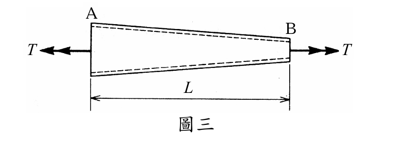

# 考題編號：MM-2012-3

**主分類：** `MM-U2-1` 扭轉分析  
**副分類：**（無）  
**分析法：** 能量法（Bredt-Batho 公式 + 積分）  
**標籤：** `薄壁閉截面` `Bredt公式` `扭轉應變能` `線性變截面` `圓管` `換元積分` `J=πd³t/8`

---

## 1. 原始題目重述 (Problem Restatement)

有一圓形斷面薄壁管承受扭矩 **T**，如圖三所示。該管長度為 **L**，壁厚為 **t**，剪力模數為 **G**；薄壁中線之直徑在 A 和 B 兩端分別為 $d_a$ 和 $d_b$，在中間斷面則呈**線性變化**。

試求該管之**扭轉應變能**。（25 分）

*圖說：薄壁圓管，A 端（左）薄壁中線直徑 $d_a$（較大），B 端（右）薄壁中線直徑 $d_b$（較小），沿管長 L 線性變化。壁厚 t 為常數。兩端施加大小相等、方向相反的扭矩 T（使管受純扭）。*

---

## 2. 考題核心精神與出題者意圖 (Core Concepts & Examiner's Intent)

**核心觀念：**
1. **薄壁閉截面扭轉（Bredt-Batho）**：等效扭轉常數 $J = \pi d^3 t/8$（圓形薄壁）
2. **應變能積分**：$U = \int_0^L \frac{T^2}{2GJ(x)}dx$，J 是 x 的函數（變截面）
3. **換元積分**：被積函數為 $d(x)^{-3}$，線性 d(x) 可用換元法解析積分

**出題者意圖：**
- 測驗薄壁管 Bredt 公式的正確套用（J 的計算）
- 測驗「變截面」的積分處理（不能直接套常截面公式）
- 禁止計算器 → 考換元積分技巧，結果須整理為簡潔符號式

---

## 3. 解題戰略地圖與陷阱分析 (Strategic Roadmap & Trap Analysis)

**步驟化作戰計畫：**
1. 確認薄壁圓管的等效扭轉常數 J（Bredt 公式）
2. 寫出截面直徑 d(x) 的線性表達式
3. 建立應變能積分 $U = \int_0^L T^2/(2GJ) dx$
4. 換元積分（令 $u = d(x)$），解析積分 $\int d(x)^{-3}dx$
5. 整理最終結果

**關鍵陷阱：**

| 陷阱 | 說明 | 應對 |
|------|------|------|
| ⚠ J 的正確公式 | 薄壁圓管用 Bredt：$J = 2A_m^2 t/s$（閉截面），$A_m=\pi d^2/4$，$s=\pi d$ → $J=\pi d^3 t/8$ | 不要用實心圓 $J=\pi d^4/32$ |
| ⚠ d(x) 是變數 | d 不是常數，積分時不能提出 | 明確寫出 $d(x)=d_a+(d_b-d_a)x/L$ |
| ⚠ 換元積分下限上限 | $x=0 \to u=d_a$，$x=L \to u=d_b$，不要搞反 | 代入 d(0)=da, d(L)=db |
| ⚠ $d_a = d_b$ 的特殊情形 | 若 da=db（等截面），公式退化為 $U = 4T^2L/(\pi G t d_a^3)$，需分開驗算 | 視需要補充此特殊情形 |

---

## 3.5 變數層次分析 (Variable Hierarchy Analysis)

> 複習提示：第一次解題後，在每個卡住的知識點旁標記 `⚠`；第二次複習時只看有 `⚠` 的項目。

### 最終目標
以 T, L, t, G, $d_a$, $d_b$ 表示扭轉應變能 U

### 本題關鍵公式

$$\text{Step 1（薄壁圓管 J）：}\quad J(x) = \frac{\pi [d(x)]^3 t}{8}$$

$$\text{Step 2（直徑線性化）：}\quad d(x) = d_a + \frac{d_b - d_a}{L}x, \quad x\in[0,L]$$

$$\text{Step 3（應變能積分）：}\quad U = \int_0^L \frac{T^2}{2G J(x)}dx = \frac{4T^2}{\pi G t}\int_0^L \frac{dx}{[d(x)]^3}$$

$$\text{Step 4（換元）：}\quad u = d(x),\quad du = \frac{d_b-d_a}{L}dx \implies dx = \frac{L}{d_b-d_a}du$$

$$\text{Step 5（積分）：}\quad \int_{d_a}^{d_b}\frac{1}{u^3}\cdot\frac{L}{d_b-d_a}du = \frac{L}{2(d_b-d_a)}\left[\frac{1}{d_a^2} - \frac{1}{d_b^2}\right] = \frac{L(d_a+d_b)}{2d_a^2 d_b^2}$$

$$\text{Step 6（最終）：}\quad \boxed{U = \frac{2T^2L(d_a+d_b)}{\pi G t\, d_a^2 d_b^2}}$$

### L1：題目直接給定

| 符號 | 說明 |
|------|------|
| $T$ | 扭矩（常數，沿管均勻） |
| $L$ | 管長 |
| $t$ | 壁厚（常數） |
| $G$ | 剪力模數 |
| $d_a$ | A 端薄壁中線直徑 |
| $d_b$ | B 端薄壁中線直徑 |
| 截面形狀 | 圓形薄壁閉截面（管），直徑線性變化 |

### L2：需知識點推導

| 符號 | 公式／來源 | 卡關? |
|------|-----------|-------|
| $J$（薄壁圓管等效扭轉常數）| Bredt：$J = 2A_m^2 t/s = \pi d^3 t/8$ | |
| $A_m$（中線面積）| $\pi d^2/4$ | |
| $s$（中線周長）| $\pi d$ | |
| $d(x)$（直徑函數）| 線性插值 | |
| $\int d(x)^{-3}dx$ | 換元積分 | |

### L3：深層知識（不懂就卡住）

| 知識點 | 說明 | 卡關? |
|--------|------|-------|
| Bredt-Batho 公式 | 薄壁閉截面：$\tau = T/(2A_m t)$，$J = 2A_m^2 t/s$ | |
| 扭轉應變能 | $U = \int T^2/(2GJ)dx$（每單位長度應變能乘上 dx 積分）| |
| 換元積分技巧 | 線性替換後積分 $\int u^{-3}du = -1/(2u^2)$ | |

---

## 4. 步驟化詳細計算過程 (Step-by-Step Detailed Calculation)

### 步驟 1：薄壁圓管的等效扭轉常數 J

對薄壁**閉截面**，Bredt-Batho 理論給出：

$$J = \frac{2A_m^2 t}{s}$$

其中：
- $A_m$ = 薄壁中線所圍面積 = $\dfrac{\pi d^2}{4}$（圓形中線）
- $s$ = 薄壁中線周長 = $\pi d$
- $t$ = 壁厚（常數）

代入：

$$J = \frac{2\left(\dfrac{\pi d^2}{4}\right)^2 t}{\pi d} = \frac{2 \cdot \dfrac{\pi^2 d^4}{16} \cdot t}{\pi d} = \frac{\pi d^3 t}{8}$$

$$\boxed{J = \frac{\pi d^3 t}{8}}$$

> **記憶口訣：** 薄壁圓管 $J = \pi d^3 t/8$（實心圓 $J = \pi d^4/32$，兩者差 $4t/d \ll 1$）

### 步驟 2：截面直徑的線性變化函數

從圖三，A 端（$x=0$）直徑 $d_a$，B 端（$x=L$）直徑 $d_b$，線性變化：

$$d(x) = d_a + \frac{d_b - d_a}{L}\,x, \quad 0 \leq x \leq L$$

對應的等效扭轉常數：

$$J(x) = \frac{\pi [d(x)]^3 t}{8}$$

### 步驟 3：建立應變能積分

扭轉應變能（全管，扭矩 T 為常數）：

$$U = \int_0^L \frac{T^2}{2G J(x)}\,dx = \int_0^L \frac{T^2}{2G \cdot \dfrac{\pi [d(x)]^3 t}{8}}\,dx = \frac{4T^2}{\pi G t}\int_0^L \frac{dx}{[d(x)]^3}$$

### 步驟 4：換元積分求 $\int_0^L d(x)^{-3}dx$

令 $u = d(x) = d_a + \dfrac{d_b-d_a}{L}x$，則：

$$du = \frac{d_b - d_a}{L}\,dx \implies dx = \frac{L}{d_b - d_a}\,du$$

積分上下限：$x=0 \to u=d_a$；$x=L \to u=d_b$

$$\int_0^L \frac{dx}{[d(x)]^3} = \int_{d_a}^{d_b} \frac{1}{u^3}\cdot\frac{L}{d_b-d_a}\,du = \frac{L}{d_b-d_a}\int_{d_a}^{d_b} u^{-3}\,du$$

$$= \frac{L}{d_b-d_a}\left[\frac{u^{-2}}{-2}\right]_{d_a}^{d_b} = \frac{L}{d_b-d_a}\cdot\left(-\frac{1}{2}\right)\left[\frac{1}{d_b^2} - \frac{1}{d_a^2}\right]$$

$$= \frac{L}{2(d_b-d_a)}\cdot\frac{d_b^2 - d_a^2}{d_a^2 d_b^2} \cdot (-1) \cdot(-1)$$

$$= \frac{L}{2(d_b-d_a)}\cdot\frac{(d_b-d_a)(d_b+d_a)}{d_a^2 d_b^2}$$

$$= \frac{L(d_a + d_b)}{2\,d_a^2 d_b^2}$$

### 步驟 5：代入求最終應變能

$$U = \frac{4T^2}{\pi G t}\cdot\frac{L(d_a + d_b)}{2\,d_a^2 d_b^2}$$

$$\boxed{U = \frac{2T^2 L(d_a + d_b)}{\pi G t\, d_a^2 d_b^2}}$$

---

## 5. 關鍵爭議點與進階探討 (Critical Issues & Advanced Discussion)

### 5.1 Bredt-Batho 公式的適用條件

本公式適用於**薄壁閉截面**（$t \ll d$）。若壁厚 t 不可忽略，需用完整彈性力學解。
本題明確說「薄壁管」，可直接套用。

### 5.2 等截面管的特殊情形（$d_a = d_b = d$）

當 $d_a = d_b = d$（等截面）時，直接代入公式：

$$U\Big|_{d_a=d_b=d} = \frac{2T^2L(d+d)}{\pi G t \cdot d^2 \cdot d^2} = \frac{4T^2L}{\pi G t\,d^3}$$

等效驗算：$U = T^2L/(2GJ) = T^2L/(2G\cdot\pi d^3 t/8) = 4T^2L/(\pi G t d^3)$ ✓

### 5.3 物理意義

$$U = \frac{2T^2 L(d_a + d_b)}{\pi G t\, d_a^2 d_b^2}$$

- 若 $d_b \to 0$（B 端縮為針尖），U → ∞（無窮大應變能）：因為細端 J 極小，局部應力極大
- 若 $d_a = d_b$：退化為等截面公式（見5.2）
- U 與 $T^2$ 成正比（線彈性）；與 G、t 成反比（剛度越大、壁越厚，儲能越少）

### 5.4 換元積分的替代推導

也可展開直接積分：

$$\int_0^L \frac{dx}{\left(d_a + \frac{\Delta d}{L}x\right)^3}, \quad \Delta d = d_b - d_a$$

令 $f = d_a + \frac{\Delta d}{L}x$，$df = \frac{\Delta d}{L}dx$：

$$= \frac{L}{\Delta d}\int_{d_a}^{d_b}f^{-3}df = \frac{L}{\Delta d}\cdot\left[-\frac{1}{2f^2}\right]_{d_a}^{d_b} = \frac{L}{2\Delta d}\left(\frac{1}{d_a^2}-\frac{1}{d_b^2}\right) = \frac{L(d_a+d_b)}{2d_a^2d_b^2}$$

與步驟 4 結果相同 ✓
