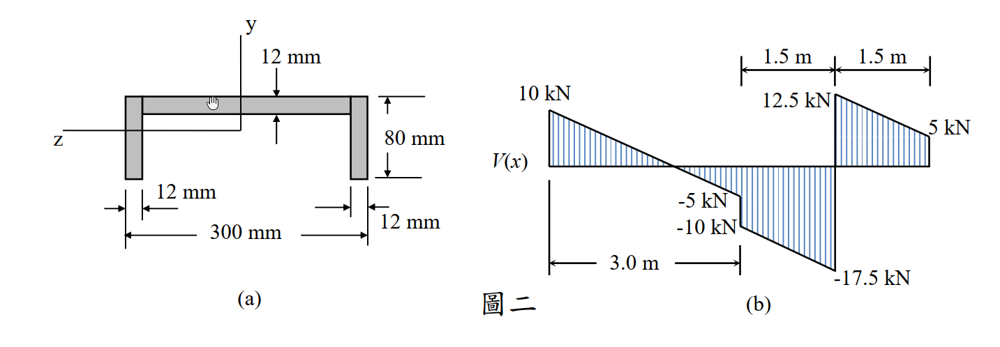

# 考題編號：MM-2013-2

**主分類：** MM-U2-2 梁桿件斷面應力計算  
**副分類：** MM-U2-1 梁桿件之內力計算（剪力圖與彎矩圖）  
**分析法：** 彈性分析  
**標籤：** C形斷面 剪力圖 彎矩圖 最大拉應力 彎曲應力 形心計算 慣性矩 σ=My/I

---

## 1. 原始題目重述 (Problem Restatement)

某梁之斷面如圖二(a)所示為 **C 形（槽形）斷面**，受外力（無彎矩）作用之剪力圖（shear-force diagram）如圖二(b)所示。

*圖說：(a) C形（槽形）斷面，關於水平中性軸（z軸）上下對稱：上翼板 300 mm×12 mm，左側腹板 12 mm×80 mm，下翼板 300 mm×12 mm，斷面總高 H = 12+80+12 = 104 mm，開口向右。(b) 剪力圖 V(x)：梁全長6.0m（3.0m+1.5m+1.5m），左端V=+10kN，前3.0m線性降至-10kN，x=3.0m處跳升12.5kN使V=+2.5kN，x=3.0～4.5m線性降至-5kN，x=4.5m處跳升12.5kN使V=+7.5kN，x=4.5～6.0m線性降至-17.5kN，右端跳升17.5kN使V=0。*

### 子問題
1. **(5 分)** 請求出作用於該梁之力。
2. **(8 分)** 繪出其彎矩圖（bending-moment diagram）並標示相關極值。
3. **(12 分)** 設梁受彎矩後 z 軸為中性軸，請計算該梁之最大拉應力（tensile stress）。

---

## 2. 考題核心精神與出題者意圖 (Core Concepts & Examiner's Intent)

**核心觀念：**
1. **從剪力圖逆推外力**：剪力圖的「跳躍量」= 集中力，「斜率」= 均布載重強度（ = -dV/dx$）
2. **彎矩圖從剪力積分**：(x) = M_0 + \int V\,dx$，極值在 (x_0)=0$ 的位置
3. **C 形斷面形心計算**：斷面上下翼板相同 → 中性軸恰在幾何中心（對稱）
4. **最大拉應力的位置判斷**：正彎矩段下緣受拉，負彎矩段上緣受拉，取絕對值最大者

**出題者意圖：**
- 測驗「逆向解讀剪力圖」的能力（從已知 V 圖反推外力配置）
- 測驗 C 形斷面形心計算（考生是否驗證上下對稱性以簡化計算）
- 測驗最大拉應力危險點判斷（需比較最大正彎矩下緣、最大負彎矩上緣兩者）

---

## 3. 解題戰略地圖與陷阱分析 (Strategic Roadmap & Trap Analysis)

**步驟化作戰計畫：**
1. 逐段讀取剪力圖：跳躍點 = 集中力，斜率 = 均布載重強度
2. 平衡驗算確認外力解讀正確（$\sum F_y = 0$）
3. 積分剪力圖 → 彎矩圖，標出極值（=0$ 的位置）
4. 計算 C 形斷面形心 $\bar{y}$（確認是否上下對稱）
5. 計算慣性矩 $
6. 在最大正彎矩與最大負彎矩處分別計算拉應力，取最大值

**關鍵陷阱：**

| 陷阱 | 說明 | 應對 |
|------|------|------|
| ⚠ 剪力跳躍量判讀 | 跳躍量 = 集中力大小，向上跳代表向上集中力；不要把標示的「剪力值」誤認為「跳升量」 | 逐段確認 (x^+) - V(x^-) = F$ |
| ⚠ 均布載重換算 |  = -dV/dx$（斜率的負值）；斜率為負 → $ 為正（向下）| 各段分別計算斜率 |
| ⚠ 形心計算（C 形斷面）| 此斷面上翼板=下翼板 → 中性軸在中央 52 mm，無需複雜計算；若誤算形心將影響全題 | 先驗算對稱性 |
| ⚠ 最大拉應力位置 | 需同時考慮「正彎矩段下緣」和「負彎矩段上緣」，不能只看最大正彎矩 | 兩者都算，取最大值 |

---

## 3.5 變數層次分析 (Variable Hierarchy Analysis)

> 複習提示：第一次解題後，在每個卡住的知識點旁標記 ⚠；第二次複習時只看有 ⚠ 的項目。

### 最終目標
求 C 形斷面梁在給定剪力圖下的**最大拉應力** $\sigma_{t,max}$（MPa）

### 本題關鍵公式（依計算順序）

\text{Step 1（反推外力）：} \quad w_i = -\frac{\Delta V_i}{\Delta x_i},\quad F_j = V(x_j^+) - V(x_j^-)

\text{Step 2（彎矩極值位置）：} \quad M'(x_0)=V(x_0)=0 \implies x_0 \text{ 為彎矩極值位置}

\text{Step 3（積分求 M）：} \quad M(x) = M(x_L) + \int_{x_L}^{x} V\,dt

\text{Step 4（斷面形心）：} \quad \bar{y} = \frac{\sum A_i y_i}{\sum A_i}

\text{Step 5（慣性矩）：} \quad I_z = \sum\left[\frac{b_i h_i^3}{12} + A_i\left(\boxed{\bar{y}} - y_i\right)^2\right]

\text{Step 6（最大拉應力）：} \quad \sigma_{t,max} = \max\!\left(\frac{\boxed{M_{max}^+} \cdot \boxed{\bar{y}}}{\boxed{I_z}},\; \frac{|\boxed{M_{max}^-}| \cdot (H-\boxed{\bar{y}})}{\boxed{I_z}}\right)

### L1：題目直接給定

| 符號 | 數值 | 說明 |
|------|------|------|
| 斷面總高 $ | 104 mm | 12+80+12 |
| 上/下翼板寬 $ | 300 mm | 頂、底翼板全寬 |
| 翼板厚 $ | 12 mm | 上、下翼板均為 12 mm |
| 腹板高 $ | 80 mm | 左側腹板淨高 |
| 腹板寬 $ | 12 mm | 腹板厚度 |
| 剪力圖關鍵值 | 見圖二(b) | +10, −10, 12.5, +2.5, −5, +7.5, −17.5 kN |
| 梁分段長度 | 3.0 m, 1.5 m, 1.5 m | 共 6.0 m |

### L2：需知識點推導

**外力反推**

| 符號 | 公式／來源 | 卡關? |
|------|-----------|-------|
| 各段均布載重 $ |  = -dV/dx = -\Delta V / \Delta x$ | |
| 各集中力 $ |  = V(x_j^+) - V(x_j^-)$（跳升量）| |

**彎矩計算**

| 符號 | 公式／來源 | 卡關? |
|------|-----------|-------|
| (x)$ | 積分 (x)$，邊界 (0)=0$ | |
| =0$ 的位置 | 各段內令 (x_0)=0$ 解 $ | |
| {max}^+$, $|M_{max}^-|$ | 代入 $ 得極值 | |

**斷面性質**

| 符號 | 公式／來源 | 卡關? |
|------|-----------|-------|
| , A_2, A_3$ |  \times t$（各矩形塊）| |
| , y_2, y_3$ | 各塊形心到底緣距離 | |
| $\bar{y}$ | $\sum A_i y_i / \sum A_i = 52$ mm（對稱）| |
| $ | 平行軸定理求和，$= 15{,}833{,}600$ mm⁴ | |

**應力計算**

| 符號 | 公式／來源 | 卡關? |
|------|-----------|-------|
| {top} = c_{bot}$ | /2 = 52$ mm（因上下對稱）| |
| $\sigma_{t,max}$ | $\max(M_{max}^+ \cdot c_{bot}, |M_{max}^-| \cdot c_{top}) / I_z$ | |

### L3：深層知識（不懂就卡住）

| 知識點 | 說明 | 卡關? |
|--------|------|-------|
| 正彎矩 vs. 拉側 | 正彎矩（下凸）→ **下緣**受拉、上緣受壓；負彎矩（上凸）→ **上緣**受拉、下緣受壓 | |
| 剪力跳躍方向規則 | $ 圖**向上跳** = 有**向上**集中力（支承或向上施力）；大小 = 跳升量 | |
| 斜率與均布載重方向 | 向下均布載重 >0$ → /dx = -w < 0$（剪力圖斜率向下）| |
| C 形斷面的對稱性 | 此題 C 形（槽形）斷面上下翼板完全相同 → 對 z 軸（水平中性軸）**上下對稱** → 形心在幾何中心 | |

---

## 4. 步驟化詳細計算過程 (Step-by-Step Detailed Calculation)

### 【子問題一】求作用於梁之力（5 分）

**讀取剪力圖，逐點分析：**

| x (m) | V（前）kN | 事件 | V（後）kN |
|--------|-----------|------|-----------|
| 0 | — | 向上集中力  = 10$ kN | +10 |
| 0 ~ 3.0 | +10 | 均布載重 $ | −10 |
| 3.0 | −10 | 向上集中力  = 12.5$ kN | +2.5 |
| 3.0 ~ 4.5 | +2.5 | 均布載重 $ | −5 |
| 4.5 | −5 | 向上集中力  = 12.5$ kN | +7.5 |
| 4.5 ~ 6.0 | +7.5 | 均布載重 $ | −17.5 |
| 6.0 | −17.5 | 向上集中力  = 17.5$ kN | 0 |

**各段均布載重強度（ = -dV/dx$）：**

w_1 = -\frac{(-10)-10}{3.0} = \frac{20}{3} \approx 6.667 \text{ kN/m（向下）}

w_2 = -\frac{(-5)-2.5}{1.5} = \frac{7.5}{1.5} = 5 \text{ kN/m（向下）}

w_3 = -\frac{(-17.5)-7.5}{1.5} = \frac{25}{1.5} = \frac{50}{3} \approx 16.667 \text{ kN/m（向下）}

**靜力平衡驗算：**

\sum F_y^{\uparrow} = F_A + F_B + F_C + F_D = 10 + 12.5 + 12.5 + 17.5 = 52.5 \text{ kN}

\sum F_y^{\downarrow} = w_1 \times 3.0 + w_2 \times 1.5 + w_3 \times 1.5
= \frac{20}{3}(3) + 5(1.5) + \frac{50}{3}(1.5) = 20 + 7.5 + 25 = 52.5 \text{ kN} \checkmark

**✅ 作用於梁之力（答案）：**
-  = 0$ m：集中力 **10 kN（↑）**
-  \sim 3.0$ m：均布載重 **$\dfrac{20}{3} \approx 6.67$ kN/m（↓）**
-  = 3.0$ m：集中力 **12.5 kN（↑）**
- .0 \sim 4.5$ m：均布載重 **5 kN/m（↓）**
-  = 4.5$ m：集中力 **12.5 kN（↑）**
- .5 \sim 6.0$ m：均布載重 **$\dfrac{50}{3} \approx 16.67$ kN/m（↓）**
-  = 6.0$ m：集中力 **17.5 kN（↑）**

---

### 【子問題二】彎矩圖（8 分）

**積分剪力圖，邊界條件 (0) = 0$：**

#### 段一（ \leq x \leq 3.0$ m）

V(x) = 10 - \frac{20}{3}x \quad \text{（kN）}

M(x) = \int_0^x V\,dt = 10x - \frac{10}{3}x^2 \quad \text{（kN·m）}

令 (x_0) = 0$：
10 - \frac{20}{3}x_0 = 0 \implies x_0 = 1.5 \text{ m}

\boxed{M(1.5 \text{ m}) = 10(1.5) - \frac{10}{3}(1.5)^2 = 15 - 7.5 = +7.5 \text{ kN·m}}

段一末端：(3.0) = 10(3) - \frac{10}{3}(9) = 30 - 30 = 0$ kN·m

> **策略註解：** M(3.0m)=0 是必要的驗算：x=3m 處若為簡支或內鉸，彎矩必須為零；此處恰好為零，說明解讀正確。

#### 段二（.0 \leq x \leq 4.5$ m，令 $\xi = x - 3.0$）

V(\xi) = 2.5 - 5\xi \quad \text{（kN）}

M(\xi) = 0 + 2.5\xi - \frac{5}{2}\xi^2 = 2.5\xi - 2.5\xi^2 \quad \text{（kN·m）}

令 (\xi_0) = 0$：$\xi_0 = 0.5$ m（即 x = 3.5 m）

M(\xi_0 = 0.5) = 2.5(0.5) - 2.5(0.25) = 1.25 - 0.625 = +0.625 \text{ kN·m}

段二末端（$\xi = 1.5$，即 x = 4.5 m）：
M(4.5) = 2.5(1.5) - 2.5(1.5)^2 = 3.75 - 5.625 = -1.875 \text{ kN·m}

#### 段三（.5 \leq x \leq 6.0$ m，令 $\eta = x - 4.5$）

V(\eta) = 7.5 - \frac{50}{3}\eta \quad \text{（kN）}

M(\eta) = -1.875 + 7.5\eta - \frac{25}{3}\eta^2 \quad \text{（kN·m）}

令 (\eta_0) = 0$：
\eta_0 = \frac{7.5 \times 3}{50} = 0.45 \text{ m（即 } x = 4.95 \text{ m）}

M(\eta_0 = 0.45) = -1.875 + 7.5(0.45) - \frac{25}{3}(0.45)^2 = -1.875 + 3.375 - 1.6875 = -0.1875 \text{ kN·m}

段三末端（$\eta = 1.5$，即 x = 6.0 m）：
M(6.0) = -1.875 + 7.5(1.5) - \frac{25}{3}(1.5)^2 = -1.875 + 11.25 - 18.75 = -9.375 \text{ kN·m}

**✅ 彎矩圖關鍵值（答案）：**

| 位置 | M 值（kN·m）| 性質 |
|------|------------|------|
| x = 0 | 0 | 邊界 |
| x = 1.5 m | **+7.5（極大值）** | 最大正彎矩 |
| x = 3.0 m | 0 | 彎矩零點 |
| x = 3.5 m | +0.625（局部極大）| |
| x = 4.5 m | −1.875 | |
| x = 4.95 m | −0.188（局部極大，負）| |
| x = 6.0 m | **−9.375（極小值）** | 最大負彎矩（絕對值最大）|

---

### 【子問題三】最大拉應力（12 分）

#### 步驟 A：C 形斷面幾何計算

**斷面組成（三個矩形塊，由底緣算起）：**

| 塊 | 說明 |  \times h$ (mm) | 面積 $ (mm²) | 形心 $ (mm) |
|----|------|-------------------|-----------------|-----------------|
| 1（上翼板）| 頂部全寬翼板 | 300 × 12 | 3600 | 98 |
| 2（腹板）| 左側垂直腹板 | 12 × 80 | 960 | 52 |
| 3（下翼板）| 底部全寬翼板 | 300 × 12 | 3600 | 6 |

**斷面形心（取底緣為基準）：**

\bar{y} = \frac{A_1 y_1 + A_2 y_2 + A_3 y_3}{A_1 + A_2 + A_3}
= \frac{3600(98) + 960(52) + 3600(6)}{3600 + 960 + 3600}
= \frac{352800 + 49920 + 21600}{8160} = \frac{424320}{8160} = \boxed{52.0 \text{ mm}}

> **策略註解：** 斷面上下翼板完全相同（300 mm×12 mm），對 z 軸**上下對稱**，故形心在幾何中心 H/2 = 52 mm，此結果符合預期。因此 {top} = c_{bot} = 52$ mm。

#### 步驟 B：對中性軸慣性矩

利用平行軸定理（ = |y_i - \bar{y}|$）：

**Block 1（上翼板）：=300$ mm，=12$ mm， = |98-52| = 46$ mm**
I_1 = \frac{300 \times 12^3}{12} + 3600 \times 46^2 = 43200 + 7{,}617{,}600 = 7{,}660{,}800 \text{ mm}^4

**Block 2（腹板）：=12$ mm，=80$ mm， = |52-52| = 0$ mm**
I_2 = \frac{12 \times 80^3}{12} + 0 = 512{,}000 \text{ mm}^4

**Block 3（下翼板）：=300$ mm，=12$ mm， = |6-52| = 46$ mm**
I_3 = \frac{300 \times 12^3}{12} + 3600 \times 46^2 = 43200 + 7{,}617{,}600 = 7{,}660{,}800 \text{ mm}^4

I_z = I_1 + I_2 + I_3 = 7{,}660{,}800 + 512{,}000 + 7{,}660{,}800 = \boxed{15{,}833{,}600 \text{ mm}^4}

#### 步驟 C：計算最大拉應力

**彎曲應力公式：** $\sigma = My/I_z$（y 取中性軸到計算纖維的距離）

由於 {top} = c_{bot} = 52$ mm，最大拉應力大小僅取決於**彎矩絕對值**。

**① 最大正彎矩處（x = 1.5 m， = +7.5$ kN·m）：**
- 正彎矩 → **下緣受拉**（ = c_{bot} = 52$ mm from NA）

\sigma_{t,1} = \frac{M \cdot c_{bot}}{I_z} = \frac{7.5 \times 10^6 \text{ N·mm} \times 52 \text{ mm}}{15{,}833{,}600 \text{ mm}^4} = 24.63 \text{ MPa}

**② 最大負彎矩處（x = 6.0 m， = -9.375$ kN·m）：**
- 負彎矩 → **上緣受拉**（ = c_{top} = 52$ mm from NA）

\sigma_{t,2} = \frac{|M| \cdot c_{top}}{I_z} = \frac{9.375 \times 10^6 \text{ N·mm} \times 52 \text{ mm}}{15{,}833{,}600 \text{ mm}^4} = 30.79 \text{ MPa}

**✅ 最大拉應力（答案）：**

\boxed{\sigma_{t,max} = 30.79 \text{ MPa}}

發生在  = 6.0$ m（梁右端），**上緣（頂翼板上緣纖維）**，彎矩為負（梁上凸），上緣受拉。

---

## 5. 關鍵爭議點與進階探討 (Critical Issues & Advanced Discussion)

### 5.1 外力解讀的唯一性驗證

本題三段均布載重不同（ = 20/3$、 = 5$、 = 50/3$ kN/m），雖看似複雜，但靜力平衡完全成立：
\sum F_y^{\uparrow} = \sum F_y^{\downarrow} = 52.5 \text{ kN} \checkmark

且 (3.0 \text{ m}) = 0$ 符合物理意義（x=3m 可能為內鉸或彎矩零點）。

### 5.2 斷面對稱性的重要性

C 形（槽形）斷面對水平中性軸（z 軸）上下對稱，因此：
- 形心在幾何中心（$\bar{y} = H/2 = 52$ mm），無需複雜計算
- {top} = c_{bot}$，最大拉應力完全由**彎矩絕對值**決定
- **若上下翼板不同**（如 T 形斷面），則 {top} \neq c_{bot}$，需分別計算兩側拉應力

### 5.3 最大拉應力 vs. 最大壓應力

由本題計算：
- 最大拉應力 = 30.79 MPa（x=6m，上緣）
- 最大壓應力 = 30.79 MPa（x=6m，下緣）—— 與拉應力相等（因上下對稱）

實際上：正彎矩段（x=1.5m）的壓應力也達 24.63 MPa，但最大壓應力仍在 x=6m。

### 5.4 考場快速驗算

\sigma_{t,max} = \frac{9375 \text{ N·m} \times 0.052 \text{ m}}{1.5834 \times 10^{-5} \text{ m}^4} \approx 30.8 \text{ MPa}

**精確值：** $\dfrac{9.375 \times 10^6 \times 52}{15{,}833{,}600} = \dfrac{487{,}500{,}000}{15{,}833{,}600} \approx \boxed{30.79 \text{ MPa}}$
