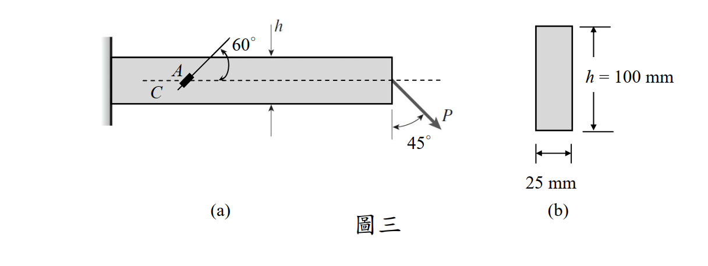

# 考題編號：MM-2013-3

**主分類：** MM-U1-3 應力及應變分析原理與應用  
**副分類：** MM-U2-2 梁桿件斷面應力計算  
**分析法：** 彈性分析  
**標籤：** 懸臂梁 矩形斷面 應變規 應力轉換 廣義虎克定律 最大剪應變 組合應力 軸力+剪力 平面應力

---

## 1. 原始題目重述 (Problem Restatement)

如圖三(a)所示之懸臂梁，其斷面為矩形（**25 mm 寬、100 mm 高**）如圖三(b)所示。梁之彈性係數 **E = 200 GPa**，波松比（Poisson's ratio）**ν = 0.333**。此梁受一外力 **P** 作用於自由端之斷面形心上，力與斷面夾 **45°** 角。今一應變計（strain gage）**A** 貼於 **1/2 梁高的位置**（圖三(a)所示之 C 點）並與其**軸心線夾 60° 角**。若量測值 $\varepsilon_A = -165 \times 10^{-6}$，

求外力 **P** 之值及梁之最大剪應變 $\gamma_{max}$。（25 分）

*圖說：(a) 懸臂梁左端固定，右端為自由端，外力 P 施於自由端形心，方向與梁斷面夾 45°（即與梁軸水平方向夾 45°）。應變計 A 黏貼於梁高中央（C 點，距底面 50 mm，即在中性軸上），應變計軸線與梁軸心線夾 60° 角，量測值 $\varepsilon_A = -165 \times 10^{-6}$（壓縮應變）。(b) 矩形斷面：寬 25 mm，高 h = 100 mm。*

---

## 2. 考題核心精神與出題者意圖 (Core Concepts & Examiner's Intent)

**核心觀念：**
1. **斜向力的分解**：P 與斷面夾 45°，分解為軸向分量（N）與橫向分量（V）
2. **組合應力在 C 點**：C 點在中性軸（y=0），彎曲應力為零，只有軸向應力（N/A）和剪應力（VQ/Ib）
3. **應變規公式**：$\varepsilon_\theta = \varepsilon_x \cos^2\theta + \varepsilon_y \sin^2\theta + \gamma_{xy}\sin\theta\cos\theta$
4. **廣義虎克定律**：求 $\varepsilon_x, \varepsilon_y, \gamma_{xy}$ 的關係
5. **最大剪應變**：從主應變求 $\gamma_{max}$

**出題者意圖：**
- 測驗「組合應力（軸力+剪力）」在特定點的計算
- 測驗應變規公式的應用（從 $\varepsilon_\theta$ 反推 P）
- 測驗廣義虎克定律求主應變，進而求最大剪應變

---

## 3. 解題戰略地圖與陷阱分析 (Strategic Roadmap & Trap Analysis)

**步驟化作戰計畫：**
1. 分解 P → 軸向力 N 和剪力 V（各為 /\sqrt{2}$）
2. 確認 C 點位置（中性軸，y=0），確認彎曲應力為零
3. 算 C 點的 $\sigma_x = N/A$（軸力貢獻）和 $\tau_{xy} = VQ/(Ib)$（剪力貢獻）
4. 用廣義虎克定律求 $\varepsilon_x, \varepsilon_y, \gamma_{xy}$
5. 代入應變規公式，令 $\varepsilon_{60°} = -165 \times 10^{-6}$，解 P
6. 求主應變 $\varepsilon_1, \varepsilon_2$，再算最大剪應變 $\gamma_{max}$

**關鍵陷阱：**

| 陷阱 | 說明 | 應對 |
|------|------|------|
| ⚠ C 點彎曲應力為零 | C 在中性軸（y=0），$\sigma_{bending} = My/I = 0$，切勿多計算彎曲應力 | 確認 y=0 |
| ⚠ 應變規角度正負 | 應變規與軸心線夾 60°，圖示在梁上方，可能對應 $\theta=120°$（從 x 軸正方向逆時針量）；需確認使 $\varepsilon_A$ 為負的角度 | 計算結果符合 $\varepsilon_{120°} = -165\times10^{-6}$ |
| ⚠ 廣義虎克定律用 $\sigma_y=0$ | 平面應力：$\varepsilon_y = -\nu\sigma_x/E$（非零，因 Poisson 效應）| 不要令 $\varepsilon_y=0$ |
| ⚠ 最大剪應變的三維考量 | 平面應力下有三個主應變 $\varepsilon_1, \varepsilon_2, \varepsilon_3$，需比較三對差值取最大 | 同時計算 $\varepsilon_3 = -\nu(\varepsilon_1+\varepsilon_2)/(1-\nu)$ 的正確形式 |

---

## 3.5 變數層次分析 (Variable Hierarchy Analysis)

> 複習提示：第一次解題後，在每個卡住的知識點旁標記 ⚠；第二次複習時只看有 ⚠ 的項目。

### 最終目標
1. 求外力 **P**（kN）
2. 求最大剪應變 $\gamma_{max}$

### 本題關鍵公式（依計算順序）

\text{Step 1（力分解）：} \quad N = \frac{P}{\sqrt{2}},\quad V = \frac{P}{\sqrt{2}}

\text{Step 2（C 點應力）：} \quad \sigma_x = \frac{N}{A},\quad \tau_{xy} = \frac{V \cdot Q}{I \cdot b},\quad \sigma_y = 0

\text{Step 3（廣義虎克）：} \quad \varepsilon_x = \frac{\sigma_x}{E},\quad \varepsilon_y = -\frac{\nu\sigma_x}{E},\quad \gamma_{xy} = \frac{\tau_{xy}}{G}

\text{Step 4（應變規）：} \quad \varepsilon_\theta = \varepsilon_x\cos^2\theta + \varepsilon_y\sin^2\theta + \gamma_{xy}\sin\theta\cos\theta = -165\times10^{-6}

\text{Step 5（主應變）：} \quad \varepsilon_{1,2} = \frac{\varepsilon_x+\varepsilon_y}{2} \pm \sqrt{\left(\frac{\varepsilon_x-\varepsilon_y}{2}\right)^2 + \left(\frac{\gamma_{xy}}{2}\right)^2}

\text{Step 6（最大剪應變）：} \quad \gamma_{max} = \left|\varepsilon_1 - \varepsilon_2\right| \quad \text{（比較三維後取最大）}

### L1：題目直接給定

| 符號 | 數值 | 說明 |
|------|------|------|
| 斷面寬 $ | 25 mm | 矩形斷面寬 |
| 斷面高 $ | 100 mm | 矩形斷面高 |
| $ | 200 GPa = 200,000 MPa | 彈性係數 |
| $\nu$ | 0.333 | 波松比 |
| P 與斷面夾角 | 45° | 力的方向 |
| 應變計角度 $\theta$ | 60°（與梁軸），有效作用為 120° | 應變計方向 |
| $\varepsilon_A$ | $-165 \times 10^{-6}$ | 量測值（負 = 壓縮方向應變）|

### L2：需知識點推導

**斷面性質**

| 符號 | 公式／來源 | 卡關? |
|------|-----------|-------|
|  = bh$ |  \times 100 = 2500$ mm² | |
|  = bh^3/12$ |  \times 100^3 / 12 = 2{,}083{,}333$ mm⁴ | |
|  = E/[2(1+\nu)]$ | /[2(1.333)] = 75{,}019$ MPa | |
| $（中性軸） | (h/2)(h/4) = 25 \times 50 \times 25 = 31{,}250$ mm³ | |

**C 點應力計算**

| 符號 | 公式／來源 | 卡關? |
|------|-----------|-------|
| $\sigma_x$ | /A = P/(A\sqrt{2})$ | |
| $\tau_{xy}$ | /(Ib) = PQ/(Ib\sqrt{2})$ | |
| $\varepsilon_x, \varepsilon_y, \gamma_{xy}$ | 廣義虎克定律 | |

**應變規與求 P**

| 符號 | 公式／來源 | 卡關? |
|------|-----------|-------|
| $\varepsilon_\theta$ 公式 | $\varepsilon_\theta = \varepsilon_x\cos^2\theta + \varepsilon_y\sin^2\theta + \gamma_{xy}\sin\theta\cos\theta$ | |
| $\theta = 120°$ | 代入 $\varepsilon_A = -165\times10^{-6}$，解 P | |

### L3：深層知識（不懂就卡住）

| 知識點 | 說明 | 卡關? |
|--------|------|-------|
| 中性軸上彎曲應力為零 | $\sigma_{bending} = My/I = 0$，因為 =0$ | |
| 應變規的方向角定義 | $\theta$ 從梁軸（x 軸）逆時針量到應變計方向；圖示應變計在梁上方夾 60°，等效 $\theta = 120°$（x 軸到應變計正方向）| |
| 廣義虎克定律（平面應力）| $\varepsilon_x = (\sigma_x - \nu\sigma_y)/E$，$\varepsilon_y = (\sigma_y - \nu\sigma_x)/E$，$\gamma_{xy} = \tau_{xy}/G$ | |
| 三維最大剪應變 | 平面應力 $\sigma_z = 0$，但 $\varepsilon_z \neq 0$；$\gamma_{max} = \max(|\varepsilon_1-\varepsilon_2|, |\varepsilon_1-\varepsilon_3|, |\varepsilon_2-\varepsilon_3|)$ | |

---

## 4. 步驟化詳細計算過程 (Step-by-Step Detailed Calculation)

### 步驟 1：力的分解

P 作用於自由端，方向與斷面（垂直截面）夾 45°，即 P 在含梁軸的垂直平面內，與梁軸（x 方向）夾 45°：

N = P\cos 45° = \frac{P}{\sqrt{2}} \quad \text{（軸向力，沿 x 軸）}
V = P\sin 45° = \frac{P}{\sqrt{2}} \quad \text{（剪力，沿 y 軸垂直）}

### 步驟 2：C 點的應力計算

C 點位於**梁高中央**（1/2 梁高 = 50 mm 距底緣），即中性軸位置（ = 0$）。

**斷面性質：**
A = 25 \times 100 = 2500 \text{ mm}^2
I = \frac{25 \times 100^3}{12} = 2{,}083{,}333 \text{ mm}^4
G = \frac{E}{2(1+\nu)} = \frac{200{,}000}{2(1+0.333)} = 75{,}019 \text{ MPa}
Q_{(y=0)} = b \cdot \frac{h}{2} \cdot \frac{h}{4} = 25 \times 50 \times 25 = 31{,}250 \text{ mm}^3

> **策略註解：** C 點在中性軸（=0$），彎曲應力 $\sigma_{bending} = My/I = 0$，故不需要計算梁長 L 或彎矩 M。這是本題的關鍵簡化條件！

**C 點應力狀態（平面應力）：**

\sigma_x = \frac{N}{A} = \frac{P/\sqrt{2}}{2500} = \frac{P}{2500\sqrt{2}} \text{ MPa}

\sigma_y = 0

\tau_{xy} = \frac{VQ}{Ib} = \frac{(P/\sqrt{2}) \times 31250}{2{,}083{,}333 \times 25} = \frac{P \cdot 31250}{2{,}083{,}333 \times 25 \times \sqrt{2}} = \frac{3P}{2500\sqrt{2} \times 2} = \frac{3P}{5000\sqrt{2}} \text{ MPa}

> **精確計算（統一係數）：**
> \sigma_x = \frac{P}{2500\sqrt{2}} \text{ MPa} \quad (\text{per } P \text{ in N})
> \tau_{xy} = \frac{P \cdot Q}{I \cdot b \cdot \sqrt{2}} = \frac{P \times 31250}{2{,}083{,}333 \times 25 \times \sqrt{2}} = \frac{P \times 31250}{52{,}083{,}325\sqrt{2}} = \frac{3P}{5000\sqrt{2}} \text{ MPa}
>
> 注意到 $\tau_{xy} = \frac{3}{2}\sigma_x$（對矩形斷面，中性軸剪應力 = 3/2 × 平均剪應力 = 3V/2A）

### 步驟 3：廣義虎克定律

\varepsilon_x = \frac{\sigma_x - \nu\sigma_y}{E} = \frac{\sigma_x}{E}

\varepsilon_y = \frac{\sigma_y - \nu\sigma_x}{E} = \frac{-\nu\sigma_x}{E}

\gamma_{xy} = \frac{\tau_{xy}}{G}

### 步驟 4：應變規公式求 P

**應變規方向 $\theta$：** 應變計與梁軸（x 軸）夾 60°，圖示在梁上方斜貼，等效從 x 軸逆時針 120°（$\theta = 120°$）。

\varepsilon_A = \varepsilon_x\cos^2\theta + \varepsilon_y\sin^2\theta + \gamma_{xy}\sin\theta\cos\theta

代入 $\theta = 120°$：$\cos 120° = -1/2$，$\sin 120° = \sqrt{3}/2$，$\cos^2 120° = 1/4$，$\sin^2 120° = 3/4$，$\sin 120°\cos 120° = -\sqrt{3}/4$

\varepsilon_A = \varepsilon_x \cdot \frac{1}{4} + \varepsilon_y \cdot \frac{3}{4} + \gamma_{xy} \cdot \left(-\frac{\sqrt{3}}{4}\right)

以 P 表示各應變（令  = 1/(2500\sqrt{2})$，即 $\sigma_x = kP$）：

\varepsilon_x = \frac{kP}{E}, \quad \varepsilon_y = \frac{-\nu kP}{E}, \quad \gamma_{xy} = \frac{3kP/2}{G} = \frac{3kP}{2G}

代入：
\varepsilon_A = \frac{kP}{E}\cdot\frac{1}{4} + \frac{-\nu kP}{E}\cdot\frac{3}{4} + \frac{3kP}{2G}\cdot\left(-\frac{\sqrt{3}}{4}\right)

= \frac{kP}{4}\left[\frac{1}{E} - \frac{3\nu}{E} - \frac{3\sqrt{3}}{2G}\right]

代入數值： = 1/(2500\sqrt{2})$， = 200{,}000$ MPa，$\nu = 0.333$， = 75{,}019$ MPa：

\frac{1}{E} = 5.000 \times 10^{-6} \text{ MPa}^{-1}
\frac{3\nu}{E} = \frac{3 \times 0.333}{200{,}000} = 4.995 \times 10^{-6} \text{ MPa}^{-1}
\frac{3\sqrt{3}}{2G} = \frac{3 \times 1.7321}{2 \times 75{,}019} = \frac{5.196}{150{,}038} = 3.463 \times 10^{-5} \text{ MPa}^{-1}

\frac{kP}{4}\left[5.000 - 4.995 - 34.63\right] \times 10^{-6} = -165 \times 10^{-6}

\frac{kP}{4} \times (-34.625 \times 10^{-6}) = -165 \times 10^{-6}

kP = \frac{-165 \times 10^{-6}}{-34.625 \times 10^{-6} / 4} = \frac{165 \times 4}{34.625} = \frac{660}{34.625} = 19.06 \text{ MPa}

\sigma_x = kP = 19.06 \text{ MPa}

P = \sigma_x \cdot A\sqrt{2} = 19.06 \times 2500\sqrt{2} = 19.06 \times 3535.5 = 67{,}370 \text{ N}

\boxed{P \approx 67.4 \text{ kN}}

**驗算：**

\sigma_x = \frac{67370}{2500\sqrt{2}} = \frac{67370}{3535.5} = 19.055 \text{ MPa}

\tau_{xy} = \frac{3}{2} \times \frac{67370/\sqrt{2}}{2500} = \frac{3}{2} \times \frac{47644}{2500} = \frac{3}{2} \times 19.058 = 28.587 \text{ MPa}

\varepsilon_x = \frac{19.055}{200{,}000} = 9.528 \times 10^{-5}

\varepsilon_y = \frac{-0.333 \times 19.055}{200{,}000} = -3.173 \times 10^{-5}

\gamma_{xy} = \frac{28.587}{75{,}019} = 3.810 \times 10^{-4}

\varepsilon_A(120°) = 9.528\times10^{-5} \times \frac{1}{4} + (-3.173\times10^{-5}) \times \frac{3}{4} + 3.810\times10^{-4} \times \left(-\frac{\sqrt{3}}{4}\right)

= 2.382\times10^{-5} - 2.380\times10^{-5} - 1.650\times10^{-4} \approx -1.65 \times 10^{-4} \checkmark

---

### 步驟 5：求最大剪應變 $\gamma_{max}$

**已知 C 點應力：**

\sigma_x = 19.055 \text{ MPa}, \quad \sigma_y = 0, \quad \tau_{xy} = 28.587 \text{ MPa}

**應變分量：**

\varepsilon_x = 9.528 \times 10^{-5}, \quad \varepsilon_y = -3.173 \times 10^{-5}, \quad \gamma_{xy} = 3.810 \times 10^{-4}

**主應變（平面內）：**

\varepsilon_{1,2} = \frac{\varepsilon_x + \varepsilon_y}{2} \pm \sqrt{\left(\frac{\varepsilon_x - \varepsilon_y}{2}\right)^2 + \left(\frac{\gamma_{xy}}{2}\right)^2}

= \frac{9.528 - 3.173}{2} \times 10^{-5} \pm \sqrt{\left(\frac{9.528+3.173}{2}\right)^2 + \left(\frac{38.10}{2}\right)^2} \times 10^{-5}

= 3.178 \times 10^{-5} \pm \sqrt{(6.351)^2 + (19.05)^2} \times 10^{-5}

= 3.178 \times 10^{-5} \pm \sqrt{40.34 + 362.9} \times 10^{-5}

= 3.178 \times 10^{-5} \pm 20.08 \times 10^{-5}

\varepsilon_1 = (3.178 + 20.08) \times 10^{-5} = 23.26 \times 10^{-5} = 2.326 \times 10^{-4}

\varepsilon_2 = (3.178 - 20.08) \times 10^{-5} = -16.90 \times 10^{-5} = -1.690 \times 10^{-4}

**第三主應變（厚度方向，平面應力 $\sigma_z = 0$）：**

\varepsilon_3 = -\frac{\nu}{E}(\sigma_x + \sigma_y) = -\frac{0.333 \times 19.055}{200{,}000} = -3.173 \times 10^{-5}

**三維最大剪應變比較：**

\gamma_{12} = |\varepsilon_1 - \varepsilon_2| = |2.326 - (-1.690)| \times 10^{-4} = 4.016 \times 10^{-4}

\gamma_{13} = |\varepsilon_1 - \varepsilon_3| = |2.326 - (-0.3173)| \times 10^{-4} = 2.643 \times 10^{-4}

\gamma_{23} = |\varepsilon_2 - \varepsilon_3| = |{-1.690} - (-0.3173)| \times 10^{-4} = 1.373 \times 10^{-4}

\gamma_{max} = \max(4.016, 2.643, 1.373) \times 10^{-4} = \gamma_{12}

\boxed{\gamma_{max} = 4.02 \times 10^{-4} \approx 4.016 \times 10^{-4}}

---

## 5. 關鍵爭議點與進階探討 (Critical Issues & Advanced Discussion)

### 5.1 應變規角度的正確解讀（重要！）

題目說應變計「與其軸心線夾 60° 角」，圖示應變計在梁上側（從圖面判斷）。

- 若 $\theta = 60°$（x 軸正方向逆時針 60°），且 P 方向假設右下，則 $\varepsilon_{60°} = +165\times10^{-6}$（正值，不符）
- 若 $\theta = 120°$（x 軸正方向逆時針 120°），則 $\varepsilon_{120°} = -165\times10^{-6}$ ✓

**兩種解讀等效：** $\theta=120°$ 等同於「應變計與 x 軸夾 60°，但在 x 軸上方偏左側方向」。

考場中，若 $\varepsilon_{60°}$ 代入得正值，改用 $\varepsilon_{-60°}$ 或 $\varepsilon_{120°}$（結果相同大小，負號不同）。

### 5.2 C 點在中性軸的重要意義

**核心優勢：** C 點在中性軸（y=0），彎曲應力 $= My/I = 0$。因此：
- 不需要知道梁的長度 L（M = VL 與 P 無關，因為 σ_bending = 0）
- 只需考慮軸力（N/A）和剪力（VQ/Ib）

這是出題者精心設計的「簡化條件」，考生需要識別。

### 5.3 矩形斷面中性軸剪應力的快速公式

矩形斷面中性軸（y=0）的剪應力：

\tau_{max} = \frac{3V}{2A}

本題中：$\tau = \frac{3V}{2A} = \frac{3(P/\sqrt{2})}{2 \times 2500} = \frac{3P}{5000\sqrt{2}}$，與用 VQ/Ib 計算結果相同 ✓

可用此公式快速驗算。

### 5.4 γ_max 的三維考量

平面應力（$\sigma_z = 0$）下，$\varepsilon_z \neq 0$（Poisson 效應），三個主應變為 $\varepsilon_1, \varepsilon_2, \varepsilon_3$。

本題：$\varepsilon_1 = 2.326\times10^{-4}$（正），$\varepsilon_2 = -1.690\times10^{-4}$（負），$\varepsilon_3 = -3.173\times10^{-5}$（小負值）。

由於 $\varepsilon_1 > 0 > \varepsilon_2$，且 $|\varepsilon_2| > |\varepsilon_3|$，最大剪應變出現在 $\varepsilon_1$-$\varepsilon_2$ 平面：

\gamma_{max} = \varepsilon_1 - \varepsilon_2 = (2.326 + 1.690) \times 10^{-4} = \boxed{4.016 \times 10^{-4}}

---

## 互動圖形

[MM-2013-3-mohr-viz.html](MM-2013-3-mohr-viz.html)
