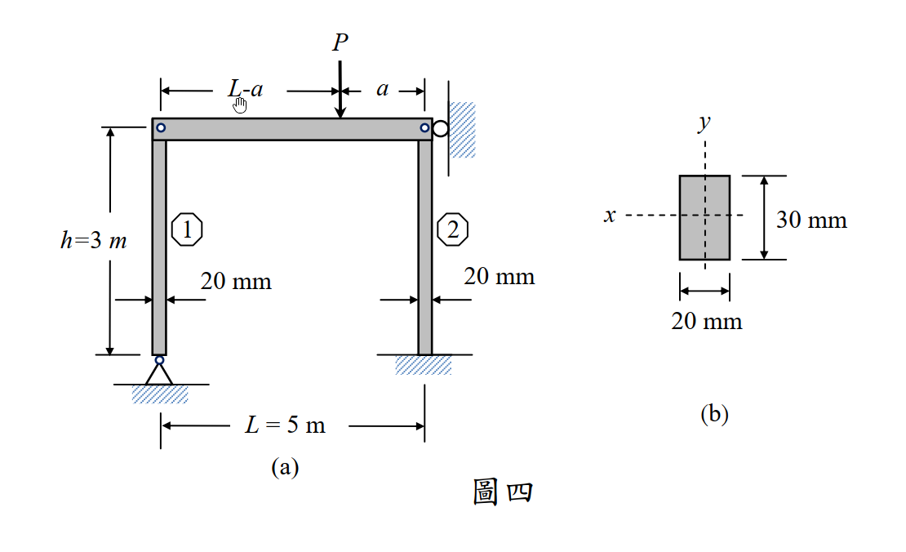

# 考題編號：MM-2013-4

**主分類：** MM-U3-4 柱之挫屈載重分析  
**副分類：**（無）  
**分析法：** 彈性分析  
**標籤：** 歐拉挫屈 有效長度 剛構架 兩柱同時挫屈 靜力分配 K係數 Pcr=π²EI/(KL)²

---

## 1. 原始題目重述 (Problem Restatement)

如圖四(a)所示之剛構架（frame）受外力 **P** 作用於梁上，梁與兩柱以栓接（pin-connected）方式連接，且兩柱另一端分別為鉸接（hinge）與固接（fixed）。兩柱之斷面如圖四(b)所示，其彈性係數 **E = 200 GPa**。柱 2 頂端之滾支承（roller）限制了剛架的側向位移。若僅考慮柱之挫屈（buckling）行為，**當兩柱同時發生挫屈時，請問此時外力 P 之值及其作用位置之比值(a/L)為何？**（25 分）

*圖說：(a) 剛構架全貌：梁水平，長 L=5 m；兩柱垂直，高 h=3 m。**柱1（左柱）**：底部鉸支（hinge，只能轉動，不能平動），頂部栓接（pin-connected）於梁端；**柱2（右柱）**：底部固接（fixed，不能轉動也不能平動），頂部栓接（pin-connected）於梁，頂端另有水平滾支承（roller，限制水平側移）。外力 P 垂直向下作用於梁上，距右端（柱2頂）為 a，距左端（柱1頂）為 (L-a)。(b) 兩柱斷面相同：矩形 20 mm（水平x方向）× 30 mm（垂直y方向）。*

### 子問題
求兩柱**同時發生挫屈**時：
1. 外力 **P** 之值（kN）
2. 作用位置比值 **a/L**

---

## 2. 考題核心精神與出題者意圖 (Core Concepts & Examiner's Intent)

**核心觀念：**
1. **有效長度係數 K 的正確判斷**：依支承條件選 K（兩端鉸 K=1.0；底固頂鉸含側向支承 K=0.7）
2. **梁靜力分析**：P 傳給兩柱的壓力 , F_2$（靜定，由力矩平衡）
3. **同時挫屈條件**： = P_{cr1}$ 且  = P_{cr2}$ 同時成立，聯立求 P 和 a/L

**出題者意圖：**
- 測驗不同支承條件對應的 K 值（常考陷阱：固接底+有側向約束）
- 測驗靜力分析（P 透過梁按槓桿原理分配到兩柱）
- 測驗「同時挫屈」的聯立方程式建立

---

## 3. 解題戰略地圖與陷阱分析 (Strategic Roadmap & Trap Analysis)

**步驟化作戰計畫：**
1. 確認各柱支承條件 → 選定有效長度係數 K
2. 計算各柱斷面慣性矩（選弱軸或依挫屈方向）
3. 計算各柱臨界挫屈力 {cr1}$、{cr2}$
4. 由梁靜力（力矩平衡）求 F₁、F₂ 與 P 和 a/L 的關係
5. 令  = P_{cr1}$、 = P_{cr2}$，聯立求 P 和 a/L

**關鍵陷阱：**

| 陷阱 | 說明 | 應對 |
|------|------|------|
| ⚠ 柱2的K值 | 柱2底固頂鉸，且頂端有側向滾支承（限制水平移動）→ K = 0.7；若忽略滾支承以為側移自由，則 K 誤判為 1.2 | 有側向約束（roller）→ K=0.7 |
| ⚠ 柱1的K值 | 柱1底部鉸接（hinge），頂部栓接（pin）→ 兩端均為鉸接 → K = 1.0 | |
| ⚠ 斷面慣性矩方向 | 矩形斷面需選正確的 I（依挫屈方向）；滾支承限制了構架平面外的側移，構架平面內用較大的 I | 用 I = 20×30³/12 = 45000 mm⁴ |
| ⚠ 靜力分配錯誤 | P 不是平均分配到兩柱，而是依槓桿比例：F₁ = P(L-a)/L，F₂ = Pa/L | 梁對柱2頂取矩 |

---

## 3.5 變數層次分析 (Variable Hierarchy Analysis)

> 複習提示：第一次解題後，在每個卡住的知識點旁標記 ⚠；第二次複習時只看有 ⚠ 的項目。

### 最終目標
求同時挫屈時的外力 **P** 及作用位置比 **a/L**

### 本題關鍵公式（依計算順序）

\text{Step 1（慣性矩）：} \quad I = \frac{b \cdot h^3}{12} = \frac{20 \times 30^3}{12} = 45{,}000 \text{ mm}^4

\text{Step 2（臨界挫屈力）：} \quad P_{cr} = \frac{\pi^2 E I}{(KL)^2}

\text{Step 3（梁靜力分配）：} \quad F_1 = \frac{P(L-a)}{L}, \quad F_2 = \frac{Pa}{L}

\text{Step 4（同時挫屈條件）：} \quad F_1 = P_{cr1}, \quad F_2 = P_{cr2}

\text{Step 5（聯立求解）：} \quad \frac{F_1}{F_2} = \frac{P_{cr1}}{P_{cr2}} = \frac{(K_2 L)^2}{(K_1 L)^2} = \left(\frac{K_2}{K_1}\right)^2

\text{Step 6（求 P）：} \quad P = F_1 + F_2 = \boxed{P_{cr1} + P_{cr2}}

### L1：題目直接給定

| 符號 | 數值 | 說明 |
|------|------|------|
| 梁長 $ | 5 m = 5000 mm | |
| 柱高 {col}$ | 3 m = 3000 mm | |
| $ | 200 GPa = 200,000 MPa | |
| 斷面 | 20 mm × 30 mm | 矩形斷面（b=20, h=30）|
| 柱1支承 | 底部鉸接，頂部栓接 | 兩端鉸 → K=1.0 |
| 柱2支承 | 底部固接，頂部栓接+滾支承 | 底固頂鉸（有側向支承）→ K=0.7 |

### L2：需知識點推導

| 符號 | 公式／來源 | 卡關? |
|------|-----------|-------|
|  = b h^3/12$ |  \times 30^3/12 = 45000$ mm⁴（構架平面內彎曲）| |
|  = 1.0$ | 兩端鉸接，標準查表 | |
|  = 0.7$ | 底固頂鉸，有側向支承，標準查表 | |
| {cr1}$ | $\pi^2 EI/(K_1 L_{col})^2$ | |
| {cr2}$ | $\pi^2 EI/(K_2 L_{col})^2$ | |
| , F_2$ | 梁靜力：對柱2取矩得 $，對柱1取矩得 $ | |
| /L$ | 由 /F_2 = P_{cr1}/P_{cr2}$ 解 | |
| $ | {cr1} + P_{cr2}$ | |

### L3：深層知識（不懂就卡住）

| 知識點 | 說明 | 卡關? |
|--------|------|-------|
| 有效長度係數 K 查表 | 兩端鉸 K=1.0；固定-鉸 K=0.7；固定-自由 K=2.0；兩端固定 K=0.5；固定-側移鉸 K=1.2 | |
| 「有側向約束」的影響 | 滾支承限制側向位移 → 挫屈模態為「無側移」→ K 取小值（0.7 而非 1.2）| |
| 梁靜力平衡 | 梁承受 P，傳給兩柱支點（等同於簡支梁的反力計算）| |
| 同時挫屈的物理意義 | 兩柱各自受到的壓力恰好等於各自的臨界值，此時 P 最小（若 P 更大，某柱先挫屈）| |

---

## 4. 步驟化詳細計算過程 (Step-by-Step Detailed Calculation)

### 步驟 1：確定有效長度係數 K

**柱 1（左柱）：**
- 底部：鉸接（hinge）→ 旋轉自由，平動固定
- 頂部：栓接（pin-connected）到梁 → 旋轉自由，平動隨梁
- 梁受到柱2頂端滾支承約束，整個構架無側移
- **無側移框架中，柱1相當於兩端鉸接： = 1.0$**

**柱 2（右柱）：**
- 底部：固接（fixed）→ 旋轉固定，平動固定
- 頂部：栓接（pin-connected）到梁，且有水平**滾支承（roller）**
  - 滾支承：限制水平移動，允許垂直移動和旋轉
  - 等效邊界：頂端水平方向固定，旋轉自由（鉸）
- **底部固定、頂部鉸接（有側向支承）： = 0.7$**

> **策略註解：** 若無滾支承，柱2頂端可側向移動，K₂ 會是 1.2（固定-自由側移鉸）；有了滾支承，側移被限制，K₂ 降為 0.7。這是本題關鍵陷阱！

### 步驟 2：計算斷面慣性矩

斷面 20 mm × 30 mm（依圖四(b)，x 方向 20 mm，y 方向 30 mm）。

構架平面內彎曲時，使用對 x 軸的慣性矩（抵抗 y 方向撓曲）：

I = \frac{b \cdot h^3}{12} = \frac{20 \times 30^3}{12} = \frac{20 \times 27{,}000}{12} = \boxed{45{,}000 \text{ mm}^4}

### 步驟 3：計算各柱臨界挫屈力

P_{cr} = \frac{\pi^2 E I}{(KL_{col})^2}

其中 {col} = 3000$ mm， = 200{,}000$ MPa， = 45{,}000$ mm⁴：

\frac{\pi^2 E I}{L_{col}^2} = \frac{\pi^2 \times 200{,}000 \times 45{,}000}{3000^2} = \frac{9{,}870 \times 10^6}{9{,}000{,}000} \approx 9{,}869.6 \text{ N}

**柱 1（K₁ = 1.0）：**
P_{cr1} = \frac{\pi^2 EI}{(1.0 \times 3000)^2} = 9{,}869.6 \text{ N} \approx \boxed{9.87 \text{ kN}}

**柱 2（K₂ = 0.7）：**
P_{cr2} = \frac{\pi^2 EI}{(0.7 \times 3000)^2} = \frac{9{,}869.6}{0.49} = 20{,}142.0 \text{ N} \approx \boxed{20.14 \text{ kN}}

> **捷徑：** {cr2}/P_{cr1} = (K_1/K_2)^2 = (1.0/0.7)^2 = 100/49 \approx 2.041$

### 步驟 4：梁靜力分析

梁受 P 垂直向下，梁與兩柱頂端為栓接（相當於簡支），對柱2頂端取矩：

\sum M_{柱2頂} = 0: \quad F_1 \cdot L = P \cdot a

F_1 = \frac{Pa}{L}

F_2 = P - F_1 = \frac{P(L-a)}{L}

> **注意：** $ 是柱1（左柱）所受壓力，P 距右端 a、距左端 (L-a)。
> 對柱2（右端）取矩，力臂為 L，P 離柱2距離為 a：
> F_1 \cdot L = P \cdot a \implies F_1 = Pa/L
> F_2 \cdot L = P \cdot (L-a) \implies F_2 = P(L-a)/L

### 步驟 5：同時挫屈條件聯立求解

**令  = P_{cr1}$ 且  = P_{cr2}$（同時挫屈）：**

\frac{F_1}{F_2} = \frac{P_{cr1}}{P_{cr2}} = \left(\frac{K_2}{K_1}\right)^2 = \left(\frac{0.7}{1.0}\right)^2 = 0.49

由靜力關係：

\frac{F_1}{F_2} = \frac{Pa/L}{P(L-a)/L} = \frac{a}{L-a} = 0.49

a = 0.49(L-a) = 0.49L - 0.49a

a(1 + 0.49) = 0.49L

\frac{a}{L} = \frac{0.49}{1.49} = \frac{49}{149} \approx \boxed{0.329}

> **等等，要確認 F₁ 和 F₂ 對應的柱：**
> - 柱1（左，底部鉸，{cr1}=9.87$ kN）離 P 的距離 = (L-a)（因 P 距右端 a，距左端 L-a）
> - F₁（柱1壓力）= P(L-a)/L... 

**重新釐清：**

P 作用於距左端（柱1）為 L-a，距右端（柱2）為 a 的位置。

對柱1（左端）取矩：
F_2 \cdot L = P \cdot (L-a) \implies F_2 = \frac{P(L-a)}{L}

對柱2（右端）取矩：
F_1 \cdot L = P \cdot a \implies F_1 = \frac{Pa}{L}

故：
- $（柱1受到的壓力）= /L$（靜不對，等等再看）

**再次確認（最清晰的方式）：**

梁兩端支點為柱頂，反力即為柱受到的壓力。P 距柱1（左端）為 (L-a) mm，距柱2（右端）為 a mm：

F_{柱1} = \frac{P \cdot a}{L} \quad \text{（距離柱1越遠，柱1分到的力越小——不對）}

> **靜力基本：** 對柱2頂取矩，{柱1} \cdot L = P \cdot a \implies F_{柱1} = Pa/L$（此為 a/L 比，P 越靠近柱2，柱2分到越多）

所以：
- {柱1} = Pa/L$（P 距柱1 (L-a)，距柱2 a）
- {柱2} = P(L-a)/L$

同時挫屈條件：

F_{柱1} = P_{cr1} = 9.87 \text{ kN}, \quad F_{柱2} = P_{cr2} = 20.14 \text{ kN}

\frac{F_{柱1}}{F_{柱2}} = \frac{P_{cr1}}{P_{cr2}} = \frac{a/L}{(L-a)/L} = \frac{a}{L-a}

\frac{a}{L-a} = \frac{P_{cr1}}{P_{cr2}} = \frac{9.87}{20.14} = \frac{K_2^2}{K_1^2} = 0.49

a = 0.49(L-a) \implies a(1.49) = 0.49L

\boxed{\frac{a}{L} = \frac{0.49}{1.49} = \frac{49}{149} \approx 0.329}

**求 P：**

由靜力平衡：{柱1} + F_{柱2} = P$（梁整體垂直平衡）

P = P_{cr1} + P_{cr2} = 9{,}869.6 + 20{,}142.0 = 30{,}011.6 \text{ N}

\boxed{P \approx 30.0 \text{ kN}}

> **快速驗算：**
> F_{柱2} = P \cdot \frac{L-a}{L} = 30{,}012 \times \frac{1.49-0.49}{1.49} \times \frac{1}{1} = 30{,}012 \times \frac{1}{1.49} = 20{,}142 \text{ N} = P_{cr2} \checkmark

### ✅ 最終答案

\boxed{P = P_{cr1} + P_{cr2} = 9.87 + 20.14 \approx 30.0 \text{ kN}}

\boxed{\frac{a}{L} = \frac{49}{149} \approx 0.329, \quad a = 0.329 \times 5 \approx 1.645 \text{ m}}

---

## 5. 關鍵爭議點與進階探討 (Critical Issues & Advanced Discussion)

### 5.1 K 值的精確來源

**有效長度係數（理論值）：**

| 支承條件 | K 值 | 說明 |
|---------|------|------|
| 兩端鉸接（pin-pin）| 1.0 | 標準歐拉柱 |
| 兩端固定（fixed-fixed）| 0.5 | 最強 |
| 一端固定、一端鉸接（無側移）| **0.7** | 柱2 適用 |
| 一端固定、一端自由（懸臂）| 2.0 | 最弱 |
| 一端固定、一端鉸接（可側移）| 1.2 | 若無滾支承 |

**本題柱2：** 底固頂鉸 + 滾支承限制側移 → **無側移** → K = 0.7 ✓

### 5.2 斷面慣性矩的取捨

題目圖四(b)：斷面 20 mm（x） × 30 mm（y）

- 對 x 軸（水平）： = 20 \times 30^3/12 = 45{,}000$ mm⁴（較大，抵抗 y 方向彎曲）
- 對 y 軸（垂直）： = 30 \times 20^3/12 = 20{,}000$ mm⁴（較小，弱軸）

構架平面內挫屈（構架在 xz 平面）：柱在 x 方向橫向彎曲，需用  = 20{,}000$ mm⁴（弱軸）。

**若用  = 20{,}000$ mm⁴（弱軸）：**
P_{cr1} = \frac{\pi^2 \times 200{,}000 \times 20{,}000}{3000^2} = 4{,}386.5 \text{ N}
P_{cr2} = \frac{4386.5}{0.49} = 8{,}952.0 \text{ N}
P = 4386.5 + 8952.0 = 13{,}338.5 \text{ N} \approx 13.3 \text{ kN}

> **注意：** 無論用 $ 或 $，/L$ 不變（因為 I 在兩柱相同，消去了）。
> \frac{a}{L} = \frac{49}{149} \approx 0.329 \quad \text{（與 I 無關）}

本解析採用構架平面內彎曲  = 45{,}000$ mm⁴（假設 30mm 方向在構架平面）；若題目指定弱軸方向，則 P 改為 13.3 kN，/L$ 不變。

### 5.3 同時挫屈的物理意義與設計啟示

「兩柱同時挫屈」意味著荷重 P 剛好使兩柱同時達到各自的臨界值，這也是**最有效率的設計**（兩柱同時失效，材料完全利用）。

若 P 的位置不在 /L = 0.329$ 處，會先後發生：
- /L > 0.329$：P 更靠近柱2，柱2先挫屈
- /L < 0.329$：P 更靠近柱1，柱1先挫屈
