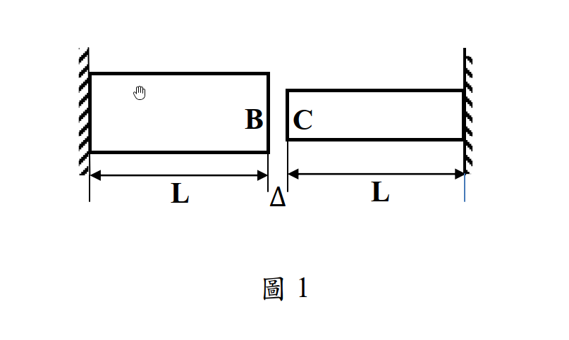

# 考題編號：MM-2014-1

**主分類：** `MM-U3-1` 軸力桿件變位及內力分析
**副分類：** `MM-U1-2` 虎克定律應用
**分析法：** 彈性分析
**標籤：** `溫度應力` `縫隙問題` `靜不定軸力` `變形諧和` `熱膨脹` `不等截面` `接觸分析` `分段討論`

---

## 1. 原始題目重述 (Problem Restatement)

兩桿材料與長度均相同（彈性模數 $E$，熱膨脹係數 $\alpha$，長度均為 $L$），但截面積不相等：左桿截面積為 $nA$（$n > 1$），右桿截面積為 $A$。兩桿均被牆壁固定（左桿固定於左壁，右桿固定於右壁），自由端 B（左桿右端）與自由端 C（右桿左端）之間有縫隙 $\Delta$。

當兩桿均勻升溫 $T$ 時，請分析：
- 兩桿**剛好接觸**時，端面 B 與端面 C 的位移
- **接觸以後**，端面 B 與端面 C 的位移



*圖說：左桿長 L、截面積 nA；右桿長 L、截面積 A；兩自由端 B、C 之間縫隙為 Δ；溫度升高 T；彈性模數 E；熱膨脹係數 α*

---

## 2. 考題核心精神與出題者意圖 (Core Concepts & Examiner's Intent)

**核心觀念：** 溫度載重下的靜不定軸力分析（縫隙接觸問題），需分兩階段討論：接觸前（靜定，自由熱膨脹）與接觸後（靜不定，引入諧和條件）。

**出題者意圖：**
- 測驗考生能否正確判斷「接觸前/後」兩種力學狀態的轉換
- 確認考生知道縫隙問題的諧和條件：兩桿位移之差等於縫隙
- 測驗不等截面時，接觸力如何按剛度分配（$nA$ 較硬，壓縮量較小，故 B 仍偏右）
- 要求輔以繪圖，考驗考生對位移定性趨勢的理解

---

## 3. 解題戰略地圖與陷阱分析 (Strategic Roadmap & Trap Analysis)

**步驟化作戰計畫：**
1. 設正向右為正，定義 $u_B$（B 的右向位移）、$u_C$（C 的右向位移）
2. **接觸前**：無接觸力，兩桿自由膨脹，求 $u_B$、$u_C$
3. 求**臨界溫度** $T^*$（兩桿剛好閉合縫隙的條件）
4. **接觸後**：引入接觸力 $P$（壓力），建立平衡 + 諧和條件，解 $P$
5. 代回求 $u_B$、$u_C$ 的表達式

**關鍵陷阱：**

| # | 陷阱 | 正確處理 |
|---|------|---------|
| 1 | 誤以為兩桿接觸後「B 和 C 重合」所以 $u_B = u_C$ | 不對！B 和 C 接觸後位移相差恰好為 $\Delta$：$u_B - u_C = \Delta$ |
| 2 | 忽略接觸前必須**先判斷**是否已接觸 | 必須先求臨界溫度 $T^* = \Delta/(2\alpha L)$ 再分段 |
| 3 | 接觸力 $P$ 方向混淆 | B 受 $P$ 向左（壓縮左桿），C 受 $P$ 向右（壓縮右桿） |
| 4 | 諧和條件寫成 $u_B + u_C = \Delta$（符號錯） | 正確：$u_B - u_C = \Delta$（B 在 C 左方，B 的位移大） |

---

## 3.5 變數層次分析 (Variable Hierarchy Analysis)

> 複習提示：第一次解題後，在每個卡住的知識點旁標記 `⚠`；第二次複習時只看有 `⚠` 的項目。

### 最終目標
求升溫 $T$ 後端面 B 與端面 C 的位移（分兩階段：接觸前 / 接觸後）

### 本題關鍵公式（依計算順序）

$$\text{Step 1（自由熱膨脹）: } \delta_{th} = \alpha T L$$

$$\text{Step 2（臨界溫度）: } 2\alpha T^* L = \Delta \Rightarrow T^* = \frac{\Delta}{2\alpha L}$$

$$\text{Step 3（諧和條件，接觸後）: } u_B - u_C = \Delta$$

$$\text{Step 4（B 的位移，含接觸力 P）: } u_B = \alpha T L - \frac{PL}{nAE}$$

$$\text{Step 5（C 的位移，含接觸力 P）: } u_C = -\alpha T L + \frac{PL}{AE}$$

$$\text{Step 6（解接觸力）: } P = \frac{nAE(2\alpha T L - \Delta)}{L(n+1)}$$

$$\text{Step 7（代回求位移）: } u_B = \frac{\alpha TL(n-1)+\Delta}{n+1},\quad u_C = \frac{\alpha TL(n-1)-n\Delta}{n+1}$$

### L1：題目直接給定

| 符號 | 數值 | 說明 |
|------|------|------|
| $E$ | — | 彈性模數 |
| $\alpha$ | — | 熱膨脹係數 |
| $T$ | — | 均勻升溫量 |
| $L$ | — | 兩桿各自長度 |
| $\Delta$ | — | 初始縫隙 |
| $nA$ | — | 左桿截面積（$n>1$） |
| $A$ | — | 右桿截面積 |

### L2：需知識點推導

**自由熱膨脹量**

| 符號 | 公式／來源 | 卡關? |
|------|-----------|-------|
| $\delta_{th,L} = \delta_{th,R}$ | $\alpha T L$ | |
| $T^*$ | $\Delta = 2\alpha T^* L$ | |

**接觸後（靜不定）**

| 符號 | 公式／來源 | 卡關? |
|------|-----------|-------|
| $u_B$ | 熱膨脹 − 彈性壓縮 $= \alpha TL - \frac{PL}{nAE}$ | |
| $u_C$ | $-\alpha TL + \frac{PL}{AE}$（右桿右端固定，C 向左膨脹，向右被壓回） | |
| $P$ | 代入諧和條件 $u_B - u_C = \Delta$ 解出 | |

### L3：深層知識（不懂就卡住）

| 知識點 | 說明 | 卡關? |
|--------|------|-------|
| 縫隙諧和條件方向 | B 在左、C 在右，接觸後 B 的位移**大於** C 的位移，差值 = $\Delta$，即 $u_B - u_C = \Delta$ | |
| 右桿 C 端熱膨脹方向 | 右端固定，熱膨脹使 C **向左**移動，故 $u_C^{free} = -\alpha TL$ | |
| 接觸力的物理意義 | 接觸後兩桿互相推壓，等值反向；B 受向左壓力，C 受向右壓力 | |

---

## 4. 步驟化詳細計算過程 (Step-by-Step Detailed Calculation)

### 符號定義

取**向右為正**。

- $u_B$：端面 B 的位移（正 = 向右）
- $u_C$：端面 C 的位移（正 = 向右）
- 初始位置：$x_{C,0} - x_{B,0} = \Delta$

---

### 第一階段：接觸前（$T \leq T^*$）

無接觸力，兩桿自由熱膨脹：

$$u_B = \alpha T L \quad \text{（B 向右移動）}$$

$$u_C = -\alpha T L \quad \text{（C 向左移動，因右端固定）}$$

**臨界溫度**（縫隙剛好閉合）：

$$u_B - u_C = \Delta$$
$$\alpha T^* L - (-\alpha T^* L) = \Delta$$
$$2\alpha T^* L = \Delta$$

$$\boxed{T^* = \frac{\Delta}{2\alpha L}}$$

**剛好接觸時的位移：**

$$\boxed{u_B = \frac{\Delta}{2}, \quad u_C = -\frac{\Delta}{2}}$$

即 B 向右移動 $\Delta/2$，C 向左移動 $\Delta/2$，在縫隙中點相遇。

---

### 第二階段：接觸後（$T > T^*$）

接觸後在 B、C 接觸面產生壓力 $P$（$P > 0$）：
- 左桿受壓：B 端受向左的力 $P$
- 右桿受壓：C 端受向右的力 $P$

**各桿端面位移：**

$$u_B = \underbrace{\alpha T L}_{\text{熱膨脹}} - \underbrace{\frac{PL}{nAE}}_{\text{彈性壓縮}} \tag{1}$$

$$u_C = \underbrace{-\alpha T L}_{\text{熱膨脹（向左）}} + \underbrace{\frac{PL}{AE}}_{\text{彈性壓縮（向右）}} \tag{2}$$

**諧和條件**（接觸後 B、C 仍相差 $\Delta$）：

$$u_B - u_C = \Delta \tag{3}$$

將 (1)(2) 代入 (3)：

$$\left(\alpha TL - \frac{PL}{nAE}\right) - \left(-\alpha TL + \frac{PL}{AE}\right) = \Delta$$

$$2\alpha TL - \frac{PL}{AE}\left(\frac{1}{n} + 1\right) = \Delta$$

$$2\alpha TL - \frac{PL(n+1)}{nAE} = \Delta$$

$$\boxed{P = \frac{nAE(2\alpha TL - \Delta)}{L(n+1)}} \quad (T > T^*)$$

*策略注解：$2\alpha TL > \Delta$ 保證 $P > 0$（壓力），物理上一致。*

**代回求各端位移：**

$$u_B = \alpha TL - \frac{PL}{nAE} = \alpha TL - \frac{(2\alpha TL - \Delta)}{(n+1)}$$

$$= \frac{\alpha TL(n+1) - (2\alpha TL - \Delta)}{n+1} = \frac{\alpha TL \cdot n + \alpha TL - 2\alpha TL + \Delta}{n+1}$$

$$\boxed{u_B = \frac{\alpha TL(n-1) + \Delta}{n+1}} \quad (T > T^*)$$

$$u_C = -\alpha TL + \frac{PL}{AE} = -\alpha TL + \frac{n(2\alpha TL - \Delta)}{(n+1)}$$

$$= \frac{-\alpha TL(n+1) + 2n\alpha TL - n\Delta}{n+1} = \frac{\alpha TL(n-1) - n\Delta}{n+1}$$

$$\boxed{u_C = \frac{\alpha TL(n-1) - n\Delta}{n+1}} \quad (T > T^*)$$

**驗證諧和條件：**

$$u_B - u_C = \frac{[\alpha TL(n-1)+\Delta] - [\alpha TL(n-1)-n\Delta]}{n+1} = \frac{(1+n)\Delta}{n+1} = \Delta \checkmark$$

---

### 結果彙整與物理意義

| 階段 | 條件 | $u_B$ | $u_C$ |
|------|------|--------|--------|
| 接觸前 | $T \leq \dfrac{\Delta}{2\alpha L}$ | $\alpha TL$ | $-\alpha TL$ |
| 剛好接觸 | $T = \dfrac{\Delta}{2\alpha L}$ | $\dfrac{\Delta}{2}$ | $-\dfrac{\Delta}{2}$ |
| 接觸後 | $T > \dfrac{\Delta}{2\alpha L}$ | $\dfrac{\alpha TL(n-1)+\Delta}{n+1}$ | $\dfrac{\alpha TL(n-1)-n\Delta}{n+1}$ |

**物理意義：**
- $n > 1$ 時，左桿較硬（剛度大），接觸後接觸點整體偏向右側（C 被推向右方）。
- 當 $n = 1$（等截面）：$u_B = \Delta/2$，$u_C = -\Delta/2$，接觸點固定不動，對稱分配壓縮量。
- 隨 $T$ 增大，$u_B$ 單調遞增（B 持續右移），$u_C$ 在 $T > nΔ/[\alpha L(n-1)]$ 後轉為正值（C 被推向右方）。

---

### 位移示意圖說明

```
接觸前（T < T*）：
  ←左壁                          右壁→
  [====左桿 nA====]→B    C←[====右桿 A====]
                    gap=Δ
  B 右移 αTL，C 左移 αTL，縫隙逐漸縮小

剛好接觸（T = T*）：
  [====左桿 nA====]→B=C←[====右桿 A====]
  B 右移 Δ/2，C 左移 Δ/2，在縫隙中點相遇

接觸後（T > T*）：
  [=壓縮=]→B─C←[=壓縮=]  （n>1，左桿壓縮少，右桿壓縮多）
  B 仍右移（但比自由膨脹少），C 受力後可能繼續左移或轉為右移
```

---

## 5. 關鍵爭議點與進階探討 (Critical Issues & Advanced Discussion)

**Q1：諧和條件為何是 $u_B - u_C = \Delta$ 而非 $u_B - u_C = 0$？**

B、C 接觸後成為一個接觸點，此點的**兩側**分別屬於兩桿。接觸後 B 和 C 的座標相同（在空間上重合），但各自從初始位置出發，初始位置相差 $\Delta$，故位移相差 $\Delta$。

**Q2：若縫隙 $\Delta = 0$（初始即接觸），如何處理？**

此時兩端固定桿立即成為靜不定系統，代入 $\Delta = 0$ 後：
$$P = \frac{2nAE\alpha T}{n+1}, \quad u_B = u_C = \frac{\alpha TL(n-1)}{n+1}$$

兩桿接觸點位移相同（因 $\Delta = 0$，即 $u_B = u_C$）。

**Q3：$n \to \infty$（左桿極度剛硬）的極限？**

$$u_B \to \alpha TL, \quad u_C \to \alpha TL - \Delta, \quad P \to AE(2\alpha TL-\Delta)/L \cdot 1 = AE \cdot \frac{2\alpha TL - \Delta}{L}$$

左桿幾乎不壓縮，全部壓縮量由右桿（截面 $A$）承受，B 幾乎自由膨脹，C 被迫跟隨 B 移動（扣掉縫隙）。
