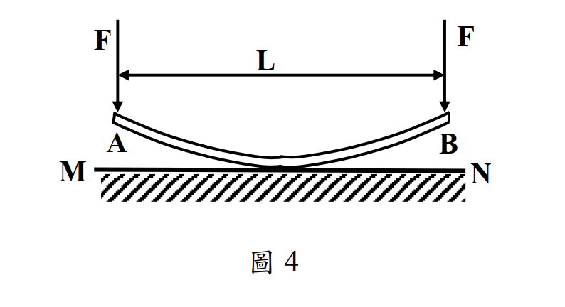

# 考題編號：MM-2014-4

**主分類：** `MM-U3-2` 梁桿件變位及內力分析
**副分類：** `MM-U2-2` 梁桿件斷面應力計算
**分析法：** 彈性分析
**標籤：** `曲板條` `接觸問題` `均勻壓力` `逆向設計` `撓度曲線` `四次多項式` `初曲率` `均布載重`

---

## 1. 原始題目重述 (Problem Restatement)

有一等厚之曲板條 AB（長度 $L$，彎曲剛度 $EI$），如圖 4 所示，板條自然狀態下具有某種預彎曲形狀，中心偏向剛性平面 MN。施力 $F$ 作用於兩端 A、B（向下，垂直於 MN），使板條向下彎曲並接觸剛性平面 MN。

當力 $F$ 加大使板條完全變直（全面緊密貼合 MN）時，分布於平面 MN 上的壓力為**均勻壓力**。

**求：** 板條事先應按何種曲線函數彎曲成形？



*圖說：板條跨度 L，兩端 A（x=0）、B（x=L）施下壓力 F；MN 為水平剛性平面（板條下方）；均勻接觸壓力 $p_0 = 2F/L$（向上）；$EI$ 為板條彎曲剛度*

---

## 2. 考題核心精神與出題者意圖 (Core Concepts & Examiner's Intent)

**核心觀念：** 逆向設計問題——已知「施力後平直、接觸壓力均勻」這一最終狀態，逆推「預彎曲形狀（初始曲率分布）」。關鍵工具是含初曲率的梁構成律：$M = EI(\kappa_{final} - \kappa_0)$。

**出題者意圖：**
- 測驗考生是否能建立含初曲率的彈性梁公式（不是一般直梁）
- 確認考生理解「均勻接觸壓力 → 均布向上反力 → 靜定彎矩分布」的推導鏈
- 考察撓度積分（二重積分法）的熟練度，以及邊界條件的設定

---

## 3. 解題戰略地圖與陷阱分析 (Strategic Roadmap & Trap Analysis)

**步驟化作戰計畫：**
1. 分析「板條平直時」的受力狀態（F 向下 + 均布反力 $p_0$ 向上），求彎矩分布 $M(x)$
2. 用含初曲率的構成律 $M = EI(0 - \kappa_0)$，求初曲率 $\kappa_0(x) = -M(x)/EI$
3. 積分兩次求 $y_0(x)$，邊界條件：對稱（$dy_0/dx = 0$ 於 $x=L/2$），以 A、B 兩端為基準
4. 整理「曲線函數」

**關鍵陷阱：**

| # | 陷阱 | 正確處理 |
|---|------|---------|
| 1 | 把板條視為普通直梁，用 $M = EI\kappa$ | 含初曲率的梁，構成律為 $M = EI(\kappa - \kappa_0)$；板條平直時 $\kappa=0$，故 $M = -EI\kappa_0$ |
| 2 | 誤以為均勻壓力 $p_0$ 是板條自重（外部荷載） | $p_0$ 是 MN 對板條的接觸反力（向上），與 F 平衡：$p_0 L = 2F$ |
| 3 | 彎矩符號搞錯 | 端部 F 向下使梁呈懸垂狀（hogging），$M(x) < 0$ in $[0,L]$，預彎曲率因此為正（concave up） |
| 4 | 積分常數的確定 | 用對稱條件 $dy_0/dx\big|_{x=L/2}=0$ 和端部基準 $y_0(0)=y_0(L)=0$（以兩端連線為參考） |

---

## 3.5 變數層次分析 (Variable Hierarchy Analysis)

> 複習提示：第一次解題後，在每個卡住的知識點旁標記 `⚠`；第二次複習時只看有 `⚠` 的項目。

### 最終目標
求板條的初始形狀函數 $y_0(x)$（以兩端連線 AB 為基準，正值向下朝 MN）

### 本題關鍵公式（依計算順序）

$$\text{Step 1（均布反力）: } p_0 = \frac{2F}{L}$$

$$\text{Step 2（平直時彎矩）: } M(x) = -Fx + \frac{F}{L}x^2 \quad (0 \leq x \leq L)$$

$$\text{Step 3（構成律逆推初曲率）: } \kappa_0(x) = -\frac{\boxed{M(x)}}{EI} = \frac{F}{EIL}\,x(L-x)$$

$$\text{Step 4（積分求形狀）: } \frac{d^2y_0}{dx^2} = \kappa_0 = \frac{F}{EIL}\,x(L-x)$$

$$\text{Step 5（解形狀函數）: } y_0(x) = \frac{F}{12EIL}\,(x^4 - 2Lx^3 + L^3x)$$

### L1：題目直接給定

| 符號 | 說明 |
|------|------|
| $L$ | 板條跨長（A 到 B） |
| $F$ | 兩端向下施力 |
| $EI$ | 板條彎曲剛度（uniform，等厚） |
| $p_0$ | MN 之均勻接觸壓力（待求） |

### L2：需知識點推導

| 符號 | 公式／來源 | 卡關? |
|------|-----------|-------|
| $p_0$ | 整體平衡：$p_0 \cdot L = 2F$ | |
| $M(x)$ | 切面法（F 向下、$p_0$ 向上），$M(0)=M(L)=0$ | |
| $\kappa_0(x)$ | 含初曲率構成律：$M=-EI\kappa_0$ | |
| $y_0(x)$ | 二次積分，BC：對稱 + 兩端基準 | |

### L3：深層知識（不懂就卡住）

| 知識點 | 說明 | 卡關? |
|--------|------|-------|
| 含初曲率梁的構成律 | 應變 $= \kappa - \kappa_0$，故 $M = EI(\kappa - \kappa_0)$；平直時 $\kappa=0$，$M = -EI\kappa_0$ | |
| 逆向設計的思路 | 知道「終態 + 終態荷載」→ 逆求「初態形狀」，核心是構成律聯繫兩者 | |
| 「板條預彎即簡支梁均布載撓度」 | 最終結果恰好等於同條件簡支梁在均布荷載下的撓度曲線 | |

---

## 4. 步驟化詳細計算過程 (Step-by-Step Detailed Calculation)

### 物理模型建立

設 $x$ 從 A（$x=0$）到 B（$x=L$），$y$ 正方向向下（朝 MN）。

板條**平直時**（$y=0$，緊貼 MN）的受力狀態：
- A 端施力 $F$（向下，$y$ 正向）
- B 端施力 $F$（向下）
- MN 均布向上反力 $p_0 = 2F/L$（$y$ 負向）

**平衡驗算：** $p_0 \cdot L = \frac{2F}{L} \cdot L = 2F$ ✓

---

### Step 1：求板條平直時的彎矩分布 $M(x)$

取 $x=0$ 為原點，以梁左端為切面，取 $[0,x]$ 段的力矩平衡（正彎矩定義：下纖維受拉 = sagging）。

剪力（正值向上）：

$$V(x) = -F + p_0 x = -F + \frac{2F}{L}x$$

彎矩（由 $V$ 積分，$M(0)=0$，自由端無力矩）：

$$M(x) = \int_0^x V\,dx' = -Fx + \frac{F}{L}x^2 \tag{1}$$

驗算：
- $M(0) = 0$ ✓（自由端）
- $M(L) = -FL + FL = 0$ ✓（自由端）
- $M(L/2) = -FL/2 + FL/4 = -FL/4 < 0$（hogging，端部 F 使板條上拱）

*策略注解：彎矩為負代表板條在平直狀態下上側受拉（hogging），這意味著預彎曲的板條自然狀態是下側受拉（sagging，中部向下拱）。*

---

### Step 2：由含初曲率構成律求初曲率 $\kappa_0(x)$

對於含初曲率（初始自然形狀 $y_0$）的彈性梁，構成律為：

$$M = EI(\kappa_{actual} - \kappa_0)$$

板條被壓平後，$\kappa_{actual} = d^2y/dx^2 = 0$，故：

$$M(x) = EI(0 - \kappa_0) = -EI\kappa_0$$

解出初曲率：

$$\kappa_0(x) = -\frac{M(x)}{EI} = -\frac{-Fx + Fx^2/L}{EI} = \frac{F}{EIL}\,x(L-x) \tag{2}$$

由於 $0 < x < L$，$\kappa_0(x) > 0$，即板條初始形狀為**向下拱（concave down in y-up convention = sagging in downward y convention）**，中部向 MN 方向凸出。✓

---

### Step 3：積分求形狀函數 $y_0(x)$

令 $y_0$ 為板條初始形狀（以向下為正），初曲率：

$$\frac{d^2 y_0}{dx^2} = \kappa_0(x) = \frac{F}{EIL}\,x(L-x) = \frac{F}{EIL}(Lx - x^2) \tag{3}$$

**第一次積分：**

$$\frac{dy_0}{dx} = \frac{F}{EIL}\left(\frac{Lx^2}{2} - \frac{x^3}{3}\right) + C_1 \tag{4}$$

**邊界條件 1（對稱）：** $dy_0/dx\big|_{x=L/2} = 0$

$$0 = \frac{F}{EIL}\left(\frac{L^3}{8} - \frac{L^3}{24}\right) + C_1 = \frac{F}{EIL}\cdot\frac{L^3}{12} + C_1 = \frac{FL^2}{12EI} + C_1$$

$$C_1 = -\frac{FL^2}{12EI} \tag{5}$$

**第二次積分：**

$$y_0(x) = \frac{F}{EIL}\left(\frac{Lx^3}{6} - \frac{x^4}{12}\right) - \frac{FL^2 x}{12EI} + C_2 \tag{6}$$

**邊界條件 2（端部基準）：** $y_0(0) = 0$

$$C_2 = 0 \tag{7}$$

**驗算端部：** $y_0(L) = \frac{F}{EIL}\left(\frac{L^4}{6} - \frac{L^4}{12}\right) - \frac{FL^3}{12EI} = \frac{FL^3}{12EI} - \frac{FL^3}{12EI} = 0$ ✓

---

### Step 4：整理曲線函數

$$y_0(x) = \frac{F}{EIL}\cdot\frac{Lx^3}{6} - \frac{F}{EIL}\cdot\frac{x^4}{12} - \frac{FL^2 x}{12EI}$$

$$= \frac{F}{12EIL}\left(2Lx^3 - x^4 - L^3 x\right)$$

$$\boxed{y_0(x) = \frac{F}{12EIL}\left(x^4 - 2Lx^3 + L^3 x\right)} \tag{正值向下}$$

（注意：$x^4 - 2Lx^3 + L^3x$ 在 $0<x<L$ 內為正值 ✓）

**最大撓度（在 $x = L/2$）：**

$$y_0\!\left(\frac{L}{2}\right) = \frac{F}{12EIL}\left(\frac{L^4}{16} - \frac{2L^4}{8} + \frac{L^4}{2}\right) = \frac{F}{12EIL}\cdot\frac{5L^4}{16} = \frac{5FL^3}{192EI}$$

---

### 結論：曲線函數

板條事先應預彎成以下**四次多項式曲線**（以兩端 A、B 連線為基準，正值朝 MN 方向）：

$$\boxed{y_0(x) = \frac{F}{12EIL}\left(x^4 - 2Lx^3 + L^3 x\right), \quad 0 \leq x \leq L}$$

或等價地，以均勻接觸壓力 $p_0 = 2F/L$ 表示：

$$y_0(x) = \frac{p_0}{24EI}\left(x^4 - 2Lx^3 + L^3 x\right)$$

**這正是跨度 $L$ 的簡支梁在均布荷載 $p_0$ 下的撓度曲線公式！**

---

### 物理意義詮釋

```
初始形狀（預彎）：         平直狀態（施 F 後）：
  A ─────────── B          A ─────────────── B
     ╲         ╱            ////////////////////
      ╲       ╱                  MN（均布反力 p₀）
       ╲─────╱  ← y_max = 5FL³/192EI
          MN

初始形狀為向 MN 方向拱出的四次多項式（中心偏向 MN）
F 加大後，板條從中心向兩端逐步貼合 MN，最終均勻接觸
```

---

## 5. 關鍵爭議點與進階探討 (Critical Issues & Advanced Discussion)

**Q1：為何預彎形狀恰好等於簡支梁均布載撓度曲線？**

這是力學的互逆性（reciprocity）的體現：

- **正向**：簡支梁受均布荷載 $p_0$ → 板條撓曲成形狀 $y_0(x)$
- **逆向**：板條預彎成 $y_0(x)$ → 施力 $F$ 使其平直 → 接觸壓力均布 $p_0$

兩者是同一力學系統的正逆問題，因此結果形式完全一致。

**Q2：若要均勻壓力存在，板條剛度 $EI$ 和預彎曲線的幅值有什麼約束？**

必須保證：
1. 施加的 $F$ 恰好使板條從初始接觸（中心）逐步推平，過程中接觸逐漸擴展（而不是突然整個貼合），否則壓力不會均勻分布。
2. 本解的成立前提是**小變形假設**（曲率 $\approx d^2y/dx^2$），若預彎幅值過大，需用精確曲率 $\kappa = y''/(1+y'^2)^{3/2}$ 修正。

**Q3：推廣：若要壓力分布為 $p(x)$（非均勻），預彎形狀如何？**

同理，$\kappa_0(x) = -M(x)/EI$，其中 $M(x)$ 由 $p(x)$ 決定。預彎形狀的曲率等於「施 F 使板條平直時的彎矩圖」除以 $-EI$，這是一般化的設計方程。


---

## 互動圖形

[MM-2014-4-sfd-bmd-viz.html](MM-2014-4-sfd-bmd-viz.html)
