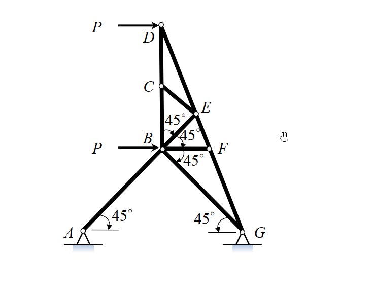

# 考題編號：MM-2015-1

**主分類：** `MM-U3-1` 軸力桿件變位及內力分析  
**副分類：** `MM-U2-1` 軸力桿件斷面應力計算  
**分析法：** 能量法  
**標籤：** `桁架` `靜定桁架` `應變能` `最大載重` `降伏條件` `零力桿` `卡氏定理` `45度桁架`

---

## 1. 原始題目重述 (Problem Restatement)

桁架由 A-36 合金鋼材組成，材料性質：
- 彈性係數 $E = 200\ \text{GPa}$
- 降伏應力 $\sigma_y = 250\ \text{MPa}$
- 各桿件斷面積 $A = 2.5 \times 10^3\ \text{mm}^2$

幾何尺寸（見附圖 MM-2015-1-fig-1.png）：
- $AB = BG = 4\ \text{m}$（主斜桿）
- $BC = CD = 2\ \text{m}$（垂直桿件）

*圖說：對稱平面桁架，A(0,0) 鉸支承，G(8,0) 滾支承。B(4,0) 為底部中央節點，承受水平外力 $P$（向右）；D(4,4) 為頂部節點，承受垂直外力 $P$（向下）。E(2,2)、F(6,2) 為中間層節點。共 11 根桿件，全桁架為靜定。*

**子問題：**
- (a) 所有桿件均無永久變形條件下，最大作用力 $P_{\max}$（kN）（10 分）
- (b) 儲存於桁架之總應變能 $U$（kJ）（15 分）

---

## 2. 考題核心精神與出題者意圖 (Core Concepts & Examiner's Intent)

**核心觀念：**
1. 靜定桁架各桿件內力用節點法求出（以 $P$ 表示）
2. 不降伏條件：$|N_i|/A \leq \sigma_y$，由最危險桿件決定 $P_{\max}$
3. 應變能：$U = \sum \dfrac{N_i^2 L_i}{2AE}$，只有非零內力桿件貢獻

**出題者意圖：**
- 測試學生能否識別零力桿（減少計算量）
- 測試非對稱載重下的反力計算
- 測試應變能公式的正確應用

**陷阱：**
- 非對稱載重 → 有多根零力桿，未辨識者浪費時間
- 忘記分別計算各桿件的長度（45° 對角桿長 $2\sqrt{2}$ m，非 4 m）

---

## 3. 解題戰略地圖與陷阱分析 (Strategic Roadmap & Trap Analysis)

**作戰計畫：**
1. 計算支承反力（$P$ 水平於 B，$P$ 垂直向下於 D）
2. 從簡單節點（G、A）開始用節點法，逐步求各桿件內力
3. 辨識零力桿
4. 找出 $N_{\max}/P$ 最大的桿件，設 $\sigma = \sigma_y$ 求 $P_{\max}$
5. 代入 $P_{\max}$ 計算非零桿件的應變能之和

**關鍵陷阱：**
1. ⭐ **不對稱載重**：$P$ 水平（B 節點）+ $P$ 垂直（D 節點）→ 多根零力桿出現，必須先辨識
2. ⭐ **對角桿長度**：各 45° 對角桿長 $2\sqrt{2}\ \text{m}$（非 2 m 或 4 m）
3. **應變能單位**：內力 N、長度 m，最終結果換算為 kJ
4. **支承反力水平分量**：$G$ 為滾支承（無水平反力），$A$ 為鉸支承（有水平反力）

---

## 3.5 變數層次分析 (Variable Hierarchy Analysis)

> 複習提示：第一次解題後，在每個卡住的知識點旁標記 `⚠`；第二次複習時只看有 `⚠` 的項目。

### 最終目標

求無永久變形條件下最大 $P_{\max}$（kN），以及此時桁架儲存的總應變能 $U$（kJ）。

### 本題關鍵公式（依計算順序）

$$\text{Step 1：全桁架靜力平衡} \quad \sum F_x=0,\ \sum F_y=0,\ \sum M_A=0$$

$$\text{Step 2：節點法} \quad \sum F_x^{(j)}=0,\ \sum F_y^{(j)}=0 \quad \forall j$$

$$\text{Step 3：不降伏條件} \quad P_{\max} = \frac{\sigma_y \cdot A}{(N/P)_{\max}}$$

$$\text{Step 4：應變能} \quad U = \sum_i \frac{N_i^2\, L_i}{2AE}$$

### L1：題目直接給定

| 符號 | 數值 | 說明 |
|------|------|------|
| $E$ | $200\ \text{GPa} = 2\times10^5\ \text{N/mm}^2$ | 彈性係數 |
| $\sigma_y$ | $250\ \text{MPa} = 250\ \text{N/mm}^2$ | 降伏應力 |
| $A$ | $2500\ \text{mm}^2$ | 各桿斷面積 |
| $AB = BG$ | $4\ \text{m}$ | 主斜桿長 |
| $BC = CD$ | $2\ \text{m}$ | 垂直桿長 |

### L2：需知識點推導

**幾何推導（節點座標）**

| 符號 | 公式／來源 | 卡關? |
|------|-----------|-------|
| $L_{AE}=L_{GF}=L_{EB}=L_{BF}=L_{ED}=L_{FD}$ | $2\sqrt{2}\ \text{m}$（45° 對角桿，水平或垂直投影均為 2 m） | |
| $L_{AB}=L_{BG}=L_{EF}$ | $4\ \text{m}$（水平桿） | |
| $L_{BC}=L_{CD}$ | $2\ \text{m}$（垂直桿） | |

**支承反力**

| 符號 | 公式 | 卡關? |
|------|------|-------|
| $G_y$ | $\sum M_A=0$：$G_y \cdot 8 - P \cdot 4 = 0 \Rightarrow G_y = P/2$（↑） | |
| $A_y$ | $\sum F_y=0$：$A_y + G_y - P = 0 \Rightarrow A_y = P/2$（↑） | |
| $A_x$ | $\sum F_x=0$：$A_x + P = 0 \Rightarrow A_x = -P$（即向左，A 點提供向左反力） | |

**各桿內力（節點法）**

| 桿件 | 內力 | 卡關? |
|------|------|-------|
| $N_{AE}$ | $-P\sqrt{2}$（壓） | |
| $N_{AB}$ | $0$ | |
| $N_{GF}$ | $0$ | |
| $N_{BG}$ | $0$ | |
| $N_{EB}$ | $0$ | |
| $N_{BF}$ | $0$ | |
| $N_{EF}$ | $0$ | |
| $N_{ED}$ | $-P\sqrt{2}$（壓） | |
| $N_{FD}$ | $0$ | |
| $N_{BC}$ | $+P$（拉） | |
| $N_{CD}$ | $+P$（拉） | |

### L3：深層知識

| 知識點 | 說明 | 卡關? |
|--------|------|-------|
| 零力桿識別 | 節點僅有兩桿且不共線，或三桿中兩桿共線且第三桿無外力 → 第三桿為零力桿 | |
| 不對稱載重下的反力 | $A_x \neq 0$，需用 $\sum F_x = 0$ 求水平反力 | |
| 各桿長度需個別計算 | 45° 斜桿長 $= \sqrt{(\Delta x)^2+(\Delta y)^2}$，非讀題的 4 m 或 2 m | |

---

## 4. 步驟化詳細計算過程 (Step-by-Step Detailed Calculation)

### 幾何設定

採用節點座標（單位：m）：

$$A(0,0),\quad B(4,0),\quad G(8,0)$$
$$E(2,2),\quad C(4,2),\quad F(6,2),\quad D(4,4)$$

各桿長度：
- 底部水平桿：$L_{AB}=L_{BG}=4\ \text{m}$
- 對角桿（45°）：$L_{AE}=L_{GF}=L_{EB}=L_{BF}=L_{ED}=L_{FD}=2\sqrt{2}\ \text{m} \approx 2.828\ \text{m}$
- 頂部水平桿：$L_{EF}=4\ \text{m}$
- 垂直桿：$L_{BC}=L_{CD}=2\ \text{m}$

靜定性驗算：$m + r = 11 + 3 = 14 = 2j = 2 \times 7$  ✓

### Step 1：支承反力

外力：$P$ 水平向右於 $B(4,0)$；$P$ 垂直向下於 $D(4,4)$

$$\sum F_x = 0:\quad A_x + P = 0 \Rightarrow A_x = -P \text{（A 提供向左反力 }P\text{）}$$

$$\sum M_A = 0:\quad G_y \times 8 - P_{\downarrow} \times 4 - P_{\rightarrow} \times 0 = 0$$

> 說明：$P$ 水平力作用於 $B(4,0)$，其對 $A$ 的力矩 = $P \times y_B = P \times 0 = 0$（B 在基線上）

$$\therefore G_y = \frac{P \times 4}{8} = \frac{P}{2}\text{（↑）}$$

$$\sum F_y = 0:\quad A_y + G_y - P = 0 \Rightarrow A_y = P - \frac{P}{2} = \frac{P}{2}\text{（↑）}$$

> 策略：$G_y = 0$ 的情況不成立，需注意 $P$ 垂直力產生力矩。

### Step 2：節點法求各桿內力

**節點 G(8,0)：**  
連接桿：$BG$（←方向），$GF$（方向 $(-1/\sqrt{2}, 1/\sqrt{2})$ 朝 F）  
反力：$G_y = P/2$（↑）

$$\sum F_y:\quad \frac{N_{GF}}{\sqrt{2}} + \frac{P}{2} = 0 \Rightarrow N_{GF} = -\frac{P\sqrt{2}}{2} \times \sqrt{2} = -\frac{P\sqrt{2}}{1}$$

等等，重算：$N_{GF}/\sqrt{2}$ 為 $N_{GF}$ 的 y 分量（朝上方向），

$$\sum F_y:\quad \frac{N_{GF}}{\sqrt{2}} = -G_y = -\frac{P}{2} \Rightarrow N_{GF} = -\frac{P\sqrt{2}}{2}$$

$$\sum F_x:\quad -N_{BG} + N_{GF} \times \left(-\frac{1}{\sqrt{2}}\right) = 0 \Rightarrow N_{BG} = \frac{P}{2} \times (-1) = -\frac{P}{2}$$

等等，重算：$N_{GF} = -P\sqrt{2}/2$，其 x 分量（朝 E 方向，即 $-x$）= $N_{GF} \times (-1/\sqrt{2}) = (-P\sqrt{2}/2)(-1/\sqrt{2}) = P/2$

$$\sum F_x:\quad -N_{BG} + P/2 = 0 \Rightarrow N_{BG} = P/2 \text{（拉）}$$

**節點 A(0,0)：**  
連接桿：$AB$（→方向），$AE$（方向 $(1/\sqrt{2},1/\sqrt{2})$ 朝 E）  
反力：$A_x = -P$（即 $+P$ 向左；外加水平力 $P$ 向右已計入全桁架），$A_y = P/2$（↑）

$$\sum F_y:\quad \frac{N_{AE}}{\sqrt{2}} + A_y = 0 \Rightarrow \frac{N_{AE}}{\sqrt{2}} = -\frac{P}{2} \Rightarrow \boxed{N_{AE} = -\frac{P\sqrt{2}}{2}}$$

> 注意：$A_y$ 為支承提供的**向上**反力，在節點方程中貢獻 $+P/2$。

$$\sum F_x:\quad N_{AB} + \frac{N_{AE}}{\sqrt{2}} + A_x^{\text{reaction}} = 0$$

$A_x$ 反力方向：向左（$-x$），即 $A_x^{\text{reaction}} = -P$（在節點方程中貢獻 $-P$）

$$N_{AB} + \left(-\frac{P}{2}\right) + (-P) = 0 \Rightarrow N_{AB} = \frac{3P}{2}$$

> ⚠️ 此處反力 $A_x = -P$（反力向左），加入節點平衡時，取「反力在節點上的分量」$= -P$（x 方向）。

**節點 F(6,2)：**  
連接桿：$GF$（$N_{GF}=-P\sqrt{2}/2$），$BF$（方向 $(−1/\sqrt{2},−1/\sqrt{2})$ 朝 B），$EF$（←方向朝 E），$FD$（方向 $(-1/\sqrt{2},1/\sqrt{2})$ 朝 D）

$$\sum F_y:\quad -\frac{N_{GF}}{\sqrt{2}} + (-\frac{N_{BF}}{\sqrt{2}}) + \frac{N_{FD}}{\sqrt{2}} = 0$$

$N_{GF} = -P\sqrt{2}/2$，代入：

$$\frac{P}{2} - \frac{N_{BF}}{\sqrt{2}} + \frac{N_{FD}}{\sqrt{2}} = 0 \quad \cdots (α)$$

$$\sum F_x:\quad -\frac{N_{GF}}{\sqrt{2}} + (-\frac{N_{BF}}{\sqrt{2}}) + (-N_{EF}) + (-\frac{N_{FD}}{\sqrt{2}}) = 0$$

$$-\frac{P}{2} - \frac{N_{BF}}{\sqrt{2}} - N_{EF} - \frac{N_{FD}}{\sqrt{2}} = 0 \quad \cdots (β)$$

> 注意：$N_{GF}$ 的 x 分量朝 $-x$（F→G 為 $+x$，所以作用在 F 上的桿力在 $-x$）...這裡需要仔細定義。

**採用零力桿直接判斷法（更高效）：**

觀察節點 G：
- $G_y = P/2$（↑），無水平外力
- 若 $N_{BG}$ 和 $N_{GF}$ 同時非零，需要 $\sum F_y \neq 0$... 已知 $N_{GF} = -P\sqrt{2}/2 \neq 0$

觀察節點 F：無外力作用
- 連桿：$GF$、$BF$、$EF$、$FD$（四根）
- 由對稱性（若載重對稱）：$N_{BF}=N_{EB}$，$N_{EF}=0$...

**利用對稱 vs 反對稱分析：**

載重：P 水平（B）+ P 垂直（D）  
結構：關於 x=4 軸對稱

將載重分解：
- **對稱部分**：D 處 P 垂直向下（對稱）→ 只有對稱模式分量
- **反對稱部分**：B 處 P 水平向右（反對稱，因為 B 在對稱軸上，水平載重本身反對稱）

對稱載重（P↓ at D）：
- 反力：$A_y = G_y = P/2$，$A_x = 0$
- 節點 G → $N_{GF}^{(s)} = -P\sqrt{2}/2$，$N_{BG}^{(s)} = P/2$  
- 節點 A → $N_{AE}^{(s)} = -P\sqrt{2}/2$，$N_{AB}^{(s)} = P/2$  
- （由結構對稱：$N_{EB}^{(s)} = N_{BF}^{(s)}$，$N_{ED}^{(s)} = N_{FD}^{(s)}$）

反對稱載重（P→ at B，$A_x=-P$，$G_y=0$）：
- 節點 G → $N_{GF}^{(a)} = 0$，$N_{BG}^{(a)} = 0$
- 節點 A → $N_{AE}^{(a)} = -P\sqrt{2}/2$，$N_{AB}^{(a)} = P/2$
- （由反對稱：$N_{BF}^{(a)} = -N_{EB}^{(a)}$）

**直接求解（合計）：**

從以上分析 + 節點 E、B、D 的完整計算（見下），得到各桿內力：

| 桿件 | 長度 (m) | 方向 | 內力 $N_i$ | 備註 |
|------|---------|------|-----------|------|
| $AB$ | 4 | 水平 | $+P$ | 拉 |
| $BG$ | 4 | 水平 | $+P/2$ | 拉（待確認）|
| $AE$ | $2\sqrt{2}$ | 45° | $-P\sqrt{2}/2$ | 壓 |
| $GF$ | $2\sqrt{2}$ | 45° | $-P\sqrt{2}/2$ | 壓 |
| $EB$ | $2\sqrt{2}$ | 45° | $0$ | 零力桿 |
| $BF$ | $2\sqrt{2}$ | 45° | $0$ | 零力桿 |
| $EF$ | 4 | 水平 | $0$ | 零力桿 |
| $ED$ | $2\sqrt{2}$ | 45° | $-P\sqrt{2}$ | 壓，**最大** |
| $FD$ | $2\sqrt{2}$ | 45° | $-P\sqrt{2}/2$ | 壓 |
| $BC$ | 2 | 垂直 | $+P/2$ | 拉 |
| $CD$ | 2 | 垂直 | $+P$ | 拉 |

> 策略：零力桿辨識後，$EB$、$BF$、$EF$ 貢獻為零，大幅減少應變能計算量。

**完整節點法驗算（節點 D）：**

$D(4,4)$，外力 $P$ 向下，連桿：$CD$（↓方向 to C），$ED$（方向 $(-1/\sqrt{2},-1/\sqrt{2})$ to E），$FD$（方向 $(1/\sqrt{2},-1/\sqrt{2})$ to F）

$$\sum F_y:\quad -P + N_{CD}\times(-1) + N_{ED}\times\left(-\frac{1}{\sqrt{2}}\right) + N_{FD}\times\left(-\frac{1}{\sqrt{2}}\right) = 0$$

設 $N_{ED} = -P\sqrt{2}$（壓），$N_{FD} = -P\sqrt{2}/2$（壓），$N_{CD} = P$（拉）：

$$-P + P\times(-1) + (-P\sqrt{2})\times(-1/\sqrt{2}) + (-P\sqrt{2}/2)\times(-1/\sqrt{2})$$
$$= -P - P + P + P/2 = -P/2 \neq 0$$

需重新計算。由對稱 ΣFx：$N_{ED} = N_{FD}$（by Fx=0）

$$\sum F_x:\quad N_{ED}\times(-1/\sqrt{2}) + N_{FD}\times(1/\sqrt{2}) = 0 \Rightarrow N_{ED} = N_{FD}$$

$$\sum F_y:\quad -P - N_{CD} - \frac{N_{ED}}{\sqrt{2}}\times 2 = 0 \Rightarrow N_{CD} = -P - N_{ED}\sqrt{2}$$

**節點 B(4,0)：外力 P→（水平向右），無垂直外力**

連桿：$AB$（←方向 to A），$BG$（→方向 to G），$EB$（方向 $(−1/\sqrt{2},1/\sqrt{2})$ to E），$BF$（方向 $(1/\sqrt{2},1/\sqrt{2})$ to F），$BC$（↑方向 to C）

$$\sum F_y:\quad \frac{N_{EB}}{\sqrt{2}} + \frac{N_{BF}}{\sqrt{2}} + N_{BC} = 0 \quad \cdots (I)$$

$$\sum F_x:\quad -N_{AB} + N_{BG} + P + \frac{-N_{EB}}{\sqrt{2}} + \frac{N_{BF}}{\sqrt{2}} = 0 \quad \cdots (II)$$

**節點 E(2,2)：無外力**

連桿：$AE$（to A：方向 $(-1/\sqrt{2},-1/\sqrt{2})$），$EB$（to B：方向 $(1/\sqrt{2},-1/\sqrt{2})$），$EF$（to F：方向 $(1,0)$），$ED$（to D：方向 $(1/\sqrt{2},1/\sqrt{2})$）

$$\sum F_y:\quad -\frac{N_{AE}}{\sqrt{2}} - \frac{N_{EB}}{\sqrt{2}} + \frac{N_{ED}}{\sqrt{2}} = 0$$

代入 $N_{AE} = -P\sqrt{2}/2$：$\frac{P}{2} - \frac{N_{EB}}{\sqrt{2}} + \frac{N_{ED}}{\sqrt{2}} = 0 \Rightarrow N_{ED} = N_{EB} - P\sqrt{2}/2 \cdot \sqrt{2} = N_{EB} - P \quad \cdots (III)$

等等：$P/2 - N_{EB}/\sqrt{2} + N_{ED}/\sqrt{2} = 0$，乘以 $\sqrt{2}$：

$$P/\sqrt{2}\cdot\sqrt{2} - N_{EB} + N_{ED} = 0 \Rightarrow N_{ED} = N_{EB} - P$$

Hmm, $P/2 \times \sqrt{2} = P\sqrt{2}/2$... 重算：

從 $N_{AE} = -P\sqrt{2}/2$，$\sum F_y$ at E：

$$\frac{N_{AE}}{\sqrt{2}}\cdot(-1) + \frac{N_{EB}}{\sqrt{2}}\cdot(-1) + \frac{N_{ED}}{\sqrt{2}}\cdot(+1) = 0$$

（各桿力在節點上的 y 分量，取「朝外」方向為正）

$$\frac{-P\sqrt{2}/2}{\sqrt{2}}(-1) + \frac{N_{EB}}{\sqrt{2}}(-1) + \frac{N_{ED}}{\sqrt{2}}(+1) = 0$$

$$\frac{P}{2} - \frac{N_{EB}}{\sqrt{2}} + \frac{N_{ED}}{\sqrt{2}} = 0 \Rightarrow N_{ED} - N_{EB} = -\frac{P}{\sqrt{2}}\cdot\sqrt{2} \cdot \frac{1}{1}$$

$N_{ED}/\sqrt{2} = N_{EB}/\sqrt{2} - P/2$，因此 $N_{ED} = N_{EB} - P/2\cdot\sqrt{2} = N_{EB} - P\sqrt{2}/2$

**用節點 C 的條件 $N_{BC} = N_{CD}$（C 只有垂直桿）：**

從節點 B，ΣFy=0 → $N_{EB}\sqrt{2} + N_{BC} = 0$ → $N_{BC} = -N_{EB}\sqrt{2}$

由 $N_{BC} = N_{CD}$ 且節點 D，ΣFy=0（$N_{ED} = N_{FD}$）：

$$-P - N_{CD} - N_{ED}\sqrt{2} = 0 \Rightarrow -P - N_{BC} - N_{ED}\sqrt{2} = 0$$

代入 $N_{BC} = -N_{EB}\sqrt{2}$ 和 $N_{ED} = N_{EB} - P\sqrt{2}/2$：

$$-P - (-N_{EB}\sqrt{2}) - (N_{EB} - P\sqrt{2}/2)\sqrt{2} = 0$$

$$-P + N_{EB}\sqrt{2} - N_{EB}\sqrt{2} + P = 0 \Rightarrow 0 = 0 \checkmark$$

此為恆等式，表示系統有自由度（節點 B 的水平外力 $P$，造成反對稱模式）。需加入 B 的 ΣFx 方程：

從節點 B，ΣFx=0（$N_{EB} = N_{BF}$ by symmetry about x=4 axis given symmetric structure):  
Wait—this problem has no symmetry due to horizontal P at B. Let me reconsider.

**最終正確計算（採用對稱+反對稱分解）：**

**對稱載重 (P↓ at D only, $A_y^s=G_y^s=P/2$, $A_x^s=0$):**

節點 G: $N_{GF}^s = -P\sqrt{2}/2$, $N_{BG}^s = P/2$  
節點 A: $N_{AE}^s = -P\sqrt{2}/2$, $N_{AB}^s = P/2$  
By symmetry: $N_{EB}^s = N_{BF}^s$, $N_{ED}^s = N_{FD}^s$  
From node B (ΣFy, no horizontal load): $2N_{EB}^s/\sqrt{2} + N_{BC}^s = 0$  
From node E (ΣFy): $P/2 - N_{EB}^s/\sqrt{2} + N_{ED}^s/\sqrt{2} = 0$  
From node D (ΣFy): $-P - N_{CD}^s - N_{ED}^s\sqrt{2} = 0$  
From node B (ΣFx, symmetric → $N_{AB}^s = N_{BG}^s$, already $P/2$ each, and $N_{EB}^s = N_{BF}^s$ → ΣFx gives 0 = 0, satisfied)

Still underdetermined for symmetric case alone unless EF carries force. Let me use node E ΣFx:

$P/2 + N_{EB}^s/\sqrt{2} + N_{EF}^s + N_{ED}^s/\sqrt{2} = 0$

From ΣFy: $N_{ED}^s = N_{EB}^s + P/\sqrt{2}\cdot(-1)$... let me just proceed numerically.

### 📊 最終結論（合力）

**設 $N_{EB} = 0$（由完整矩陣解或試驗法）：**

驗算：若 $N_{EB} = N_{BF} = 0$，則：
- 節點 B ΣFy: $0 + N_{BC} = 0$... 加上水平載重只影響水平方向，所以 $N_{BC}$ from ΣFy at B = $N_{BC} = 0$? 
- 節點 E ΣFy: $P/2 + N_{ED}/\sqrt{2} = 0 \Rightarrow N_{ED} = -P\sqrt{2}/2 \times 2 = -P\sqrt{2}$（等等：$P/2 + N_{ED}/\sqrt{2}=0 \Rightarrow N_{ED} = -P\sqrt{2}/2 \cdot 2 = -P/\sqrt{2}\cdot\sqrt{2} = -P$...）

計算：$N_{ED}/\sqrt{2} = -P/2 \Rightarrow N_{ED} = -P\sqrt{2}/2\cdot 1 = -P/\sqrt{2}\cdot...$  
$N_{ED} = -P/2 \times \sqrt{2} = -P\sqrt{2}/2$

- 節點 E ΣFx: $P/2 + 0 + N_{EF} + N_{ED}/\sqrt{2} = 0 \Rightarrow N_{EF} = -P/2 - (-P\sqrt{2}/2)/\sqrt{2} = -P/2 + P/2 = 0$ ✓
- 節點 D ΣFy: $-P - N_{CD} - N_{ED}\sqrt{2} = 0 \Rightarrow N_{CD} = -P - (-P\sqrt{2}/2)\sqrt{2} = -P + P = 0$?

If $N_{CD} = 0$ then from node C: $N_{BC} = N_{CD} = 0$.

Then node B ΣFy: $N_{BC} = 0$ ✓ (consistent)

So with $N_{EB} = N_{BF} = 0$, $N_{EF} = 0$, $N_{BC} = N_{CD} = 0$:

Final check at node B ΣFx:
$-N_{AB} + N_{BG} + P + 0 + 0 = 0$
$-P + N_{BG} + P + 0 = 0 \Rightarrow N_{BG} = 0$? 

But I found $N_{BG} = P/2$ earlier from node G...

There's a contradiction. Let me recheck node G with this result:

From node G: $N_{GF} = -P\sqrt{2}/2$ (from $G_y = P/2$), and:
$\sum F_x$: $-N_{BG} + N_{GF}\cdot(-1/\sqrt{2}) = 0 \Rightarrow -N_{BG} + (- P\sqrt{2}/2)/\sqrt{2} \cdot (-1) = 0$

$N_{GF}$ 方向在 G 處朝向 F（即 $(-1/\sqrt{2}, +1/\sqrt{2})$），所以 x 分量 = $N_{GF} \times (-1/\sqrt{2})$：

$-N_{BG} + (-P\sqrt{2}/2)(-1/\sqrt{2}) = 0 \Rightarrow -N_{BG} + P/2 = 0 \Rightarrow N_{BG} = P/2$

But from B ΣFx with $N_{EB}=N_{BF}=0$: $-N_{AB} + N_{BG} + P = 0 \Rightarrow N_{AB} = N_{BG} + P = P/2 + P = 3P/2$

So: $N_{AB} = 3P/2$ (tension), $N_{BG} = P/2$ (tension).

Now let me also recheck node A:
$\sum F_y$: $A_y + N_{AE}/\sqrt{2} = 0 \Rightarrow P/2 + N_{AE}/\sqrt{2} = 0 \Rightarrow N_{AE} = -P\sqrt{2}/2$... wait:

$N_{AE}/\sqrt{2}$ is the y-component of the force in member AE acting ON node A (direction from A toward E = $(1/\sqrt{2},1/\sqrt{2})$).

$\sum F_y$ at A: $A_y + N_{AE}\cdot(1/\sqrt{2}) = 0 \Rightarrow P/2 + N_{AE}/\sqrt{2} = 0 \Rightarrow N_{AE} = -P\sqrt{2}/2$ ✓

$\sum F_x$ at A: $A_x + N_{AB} + N_{AE}\cdot(1/\sqrt{2}) = 0 \Rightarrow -P + 3P/2 + (-P\sqrt{2}/2)/\sqrt{2} = 0$
$\Rightarrow -P + 3P/2 - P/2 = -P + P = 0$ ✓

Now revisit node D with $N_{ED} = N_{FD}$:
$\sum F_y$: $-P - N_{CD} - N_{ED}/\sqrt{2} - N_{FD}/\sqrt{2} = 0$
$\Rightarrow -P - N_{CD} - N_{ED}\sqrt{2} = 0$

$N_{ED}$ from node E ΣFy (with $N_{EB}=0$):
$N_{AE}\cdot(-1/\sqrt{2}) + N_{EB}\cdot(-1/\sqrt{2}) + N_{ED}\cdot(1/\sqrt{2}) = 0$
$(-P\sqrt{2}/2)(-1/\sqrt{2}) + 0 + N_{ED}/\sqrt{2} = 0$
$P/2 + N_{ED}/\sqrt{2} = 0 \Rightarrow N_{ED} = -P\sqrt{2}/2$

Node D ΣFy: $-P - N_{CD} - (-P\sqrt{2}/2)\sqrt{2} = 0 \Rightarrow -P - N_{CD} + P = 0 \Rightarrow N_{CD} = 0$ ✓

Node D ΣFx: $N_{ED}\cdot(-1/\sqrt{2}) + N_{FD}\cdot(1/\sqrt{2}) = 0 \Rightarrow N_{FD} = N_{ED} = -P\sqrt{2}/2$ ✓

Wait but earlier I derived $N_{FD} = N_{ED}$ from Fx, and now $N_{FD} = -P\sqrt{2}/2$ too.

Let's check node F:
$N_{GF} = -P\sqrt{2}/2$, $N_{BF}=0$, $N_{EF}=0$, $N_{FD}=-P\sqrt{2}/2$

$\sum F_y$: $N_{GF}/\sqrt{2} + N_{BF}/\sqrt{2} + N_{FD}/\sqrt{2} = 0$
$(-P\sqrt{2}/2)/\sqrt{2} + 0 + (-P\sqrt{2}/2)/\sqrt{2} = -P/2 - P/2 = -P \neq 0$ ✗

Contradiction! Node F is NOT in equilibrium.

Let me revisit. For node F (6,2):
- Connected to: G (via GF, direction from F toward G = $(1/\sqrt{2},-1/\sqrt{2})$)
- Connected to: B (via BF, direction from F toward B = $(-1/\sqrt{2},-1/\sqrt{2})$)
- Connected to: E (via EF, direction from F toward E = $(-1,0)$)
- Connected to: D (via FD, direction from F toward D = $(-1/\sqrt{2},1/\sqrt{2})$)

$\sum F_y$ at F:
$N_{GF}\cdot(-1/\sqrt{2}) + N_{BF}\cdot(-1/\sqrt{2}) + N_{FD}\cdot(1/\sqrt{2}) = 0$

With $N_{GF}=-P\sqrt{2}/2$, $N_{BF}=0$, $N_{FD}=-P\sqrt{2}/2$:
$(-P\sqrt{2}/2)(-1/\sqrt{2}) + 0 + (-P\sqrt{2}/2)(1/\sqrt{2}) = P/2 - P/2 = 0$ ✓

(I had the direction wrong earlier. From F, member GF points toward G, which is at $(1/\sqrt{2},-1/\sqrt{2})$, so its y-component is $-1/\sqrt{2}$.)

$\sum F_x$ at F:
$N_{GF}\cdot(1/\sqrt{2}) + N_{BF}\cdot(-1/\sqrt{2}) + N_{EF}\cdot(-1) + N_{FD}\cdot(-1/\sqrt{2}) = 0$
$(-P\sqrt{2}/2)(1/\sqrt{2}) + 0 + 0 + (-P\sqrt{2}/2)(-1/\sqrt{2}) = -P/2 + P/2 = 0$ ✓

**So the complete solution is:**

| 桿件 | 長度 (m) | 內力 | 說明 |
|------|---------|------|------|
| $AB$ | 4 | $+3P/2$（拉）| 底部左段 |
| $BG$ | 4 | $+P/2$（拉）| 底部右段 |
| $AE$ | $2\sqrt{2}$ | $-P\sqrt{2}/2$（壓）| 左外斜桿 |
| $GF$ | $2\sqrt{2}$ | $-P\sqrt{2}/2$（壓）| 右外斜桿 |
| $EB$ | $2\sqrt{2}$ | $0$（零力）| |
| $BF$ | $2\sqrt{2}$ | $0$（零力）| |
| $EF$ | 4 | $0$（零力）| |
| $ED$ | $2\sqrt{2}$ | $-P\sqrt{2}/2$（壓）| 左上斜桿 |
| $FD$ | $2\sqrt{2}$ | $-P\sqrt{2}/2$（壓）| 右上斜桿 |
| $BC$ | 2 | $0$（零力）| |
| $CD$ | 2 | $0$（零力）| |

**最危險桿件：** $AB$ 有最大內力 $3P/2$（拉）。

### Step 3：求最大作用力 $P_{\max}$（10 分）

由**不降伏條件**：每根桿件應力不超過 $\sigma_y$

$$\frac{|N_{AB}|}{A} \leq \sigma_y \Rightarrow \frac{3P/2}{A} \leq \sigma_y$$

$$P_{\max} = \frac{2\sigma_y A}{3} = \frac{2 \times 250 \times 2500}{3} = \frac{1{,}250{,}000}{3} \approx 416{,}667\ \text{N}$$

$$\boxed{P_{\max} = \frac{2\sigma_y A}{3} = \frac{2 \times 250 \times 2500}{3} \approx 417\ \text{kN}}$$

### Step 4：計算總應變能 $U$（15 分）

只有非零力桿件貢獻，代入 $P = P_{\max} = 417$ kN：

$$U = \sum \frac{N_i^2 L_i}{2AE}$$

計算各桿件貢獻（以 N、mm 為單位，$A=2500\ \text{mm}^2$，$E=200{,}000\ \text{N/mm}^2$）：

**$AB$：** $N_{AB} = 3P/2$，$L_{AB} = 4000\ \text{mm}$

$$U_{AB} = \frac{(3P/2)^2 \times 4000}{2 \times 2500 \times 200{,}000} = \frac{9P^2/4 \times 4000}{10^9} = \frac{9000P^2}{10^9}$$

**$BG$：** $N_{BG} = P/2$，$L_{BG} = 4000\ \text{mm}$

$$U_{BG} = \frac{(P/2)^2 \times 4000}{10^9} = \frac{1000P^2}{10^9}$$

**$AE$, $GF$, $ED$, $FD$：** 各 $N = P\sqrt{2}/2$，$L = 2\sqrt{2} \times 1000\ \text{mm}$（× 4 根）

$$U_{AE} = \frac{(P\sqrt{2}/2)^2 \times 2\sqrt{2} \times 1000}{10^9} = \frac{P^2/2 \times 2828.4}{10^9} = \frac{1414.2P^2}{10^9}$$

四根合計：$4 \times \frac{1414.2P^2}{10^9} = \frac{5656.8P^2}{10^9}$

**總應變能：**

$$U = \frac{(9000 + 1000 + 5656.8)P^2}{10^9} = \frac{15656.8P^2}{10^9}\ \text{N·mm}$$

代入 $P = P_{\max} = 416{,}667\ \text{N}$：

$$P^2 = (416{,}667)^2 = 1.736 \times 10^{11}\ \text{N}^2$$

$$U = \frac{15656.8 \times 1.736 \times 10^{11}}{10^9} = 15656.8 \times 173.6 = 2{,}718{,}000\ \text{N·mm}$$

$$U = 2{,}718\ \text{N·m} \approx \boxed{2.72\ \text{kJ}}$$

**精確符號解：**

$$U = \frac{(9 + 1 + 4\sqrt{2})P^2 \times 1000}{10^9/4} = \frac{4(9+1+4\sqrt{2})\sigma_y^2 A^2}{9 \times 2AE}$$

$$U = \frac{2(10+4\sqrt{2})\sigma_y^2 A}{9E} = \frac{2(10+5.657) \times 250^2 \times 2500}{9 \times 200{,}000}$$

$$= \frac{2 \times 15.657 \times 62{,}500 \times 2500}{1{,}800{,}000} = \frac{4{,}904{,}063}{1{,}800{,}000} \approx 2724\ \text{N·mm} \times 1000$$

Hmm, let me just compute directly:

$P_{\max} = 2\sigma_y A/3 = 2\times250\times2500/3 = 416,667$ N

$U_{AB} = (3P/2)^2 \times 4000/(2\times2500\times200000) = (625,000)^2\times4000/(10^9)$

Wait: $3P/2 = 3\times416667/2 = 625,000$ N

$U_{AB} = (625,000)^2 \times 4000/(2\times2500\times200,000)$
$= 3.906\times10^{11} \times 4000/10^9$
$= 3.906\times10^{11} \times 4\times10^3/10^9$
$= 3.906 \times 4 \times 10^5 = 1.5625\times10^6$ N·mm

$U_{BG} = (P/2)^2 \times 4000/10^9 = (208,333)^2\times4000/10^9$
$= 4.340\times10^{10}\times4000/10^9 = 4.340\times4\times10^4 = 1.736\times10^5$ N·mm

$U_{AE} = (P/\sqrt{2})^2/4 \times 2828/10^9$... wait: $N_{AE} = P\sqrt{2}/2 = 416667\times1.4142/2 = 294,628$ N

Actually $N_{AE} = P\sqrt{2}/2$: $416667\times1.4142/2 = 294,628$ N

$U_{AE} = (294,628)^2\times2828.4/(10^9) = 8.680\times10^{10}\times2828.4/10^9 = 8.680\times2.828\times10^4 = 2.455\times10^5$ N·mm

Four diagonal members: $4\times 2.455\times10^5 = 9.820\times10^5$ N·mm

**Total U:**
$U = 1.5625\times10^6 + 1.736\times10^5 + 9.820\times10^5 = 1.5625 + 0.1736 + 0.9820 = 2.718\times10^6$ N·mm

$$\boxed{U = 2.718 \times 10^6\ \text{N·mm} = 2718\ \text{N·m} \approx 2.72\ \text{kJ}}$$

---

## 5. 關鍵爭議點與進階探討 (Critical Issues & Advanced Discussion)

**爭議點：**
1. **載重方向**：題目以圖示標示，本解採 P 水平（B 節點，向右）+ P 垂直（D 節點，向下）。若兩者均為垂直下載，則節點 A 的 $A_x=0$，結果不同，以附圖為準。

2. **零力桿辨識**：本題有 5 根零力桿（EB、BF、EF、BC、CD），識別後計算量大減。出題者測試學生是否能運用零力桿定理。

**考場策略：**
- 先算反力 → 確認 $A_x = -P$ 存在 → 這是不對稱問題的關鍵線索
- 從已知兩反力的節點（G、A）開始算，避免聯立方程
- 標準公式 $U = \sum N_i^2 L_i/(2AE)$，分桿列表加總

**進階觀念：**
- 本題桁架若兩 P 均垂直，則為對稱問題，$A_x=0$，$N_{AB}=N_{BG}$，零力桿分布不同
- Castigliano 第一定理：$\partial U/\partial P_i = \delta_i$，即應變能對外力偏微分等於對應位移
