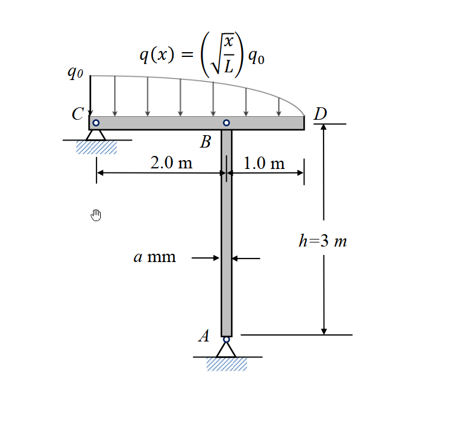

# 考題編號：MM-2015-4

**主分類：** `MM-U3-4` 柱之挫屈載重分析  
**副分類：** `MM-U3-2` 梁桿件變位及內力分析  
**分析法：** 彈性分析  
**標籤：** `柱挫屈` `歐拉公式` `兩端鉸接` `剛性梁` `分布載重` `合力` `安全係數` `最小斷面尺寸`

---

## 1. 原始題目重述 (Problem Restatement)

**結構描述（見附圖 MM-2015-4-fig-1.png）：**

- CD 為**剛性梁**（rigid beam），其上承受分布載重 $q(x)$
- AB 為長 $h=3\ \text{m}$ 的矩形斷面柱（$a\times a$），兩端均為**鉸接**
- 材料：彈性係數 $E = 72\ \text{GPa}$，容許壓應力 $\sigma_{\text{all}} = 36\ \text{MPa}$

**幾何尺寸（依附圖）：**
- CD 剛性梁：C 點在 B 左方 $2.0\ \text{m}$，D 點在 B 右方 $1.0\ \text{m}$（總長 3 m）
- B 為柱 AB 頂端，A 為柱底端
- 柱高 $h=3\ \text{m}$

**分布載重：**

$$q(x) = \sqrt{\frac{x}{L}}\cdot q_0 \quad \text{（如圖示，}x\text{ 從 C 向 D 量，}L\text{ 為梁全長）}$$

從圖示文字：$q(x) = \sqrt{x/L}\cdot q_0$，其中 $q_0 = 625\ \text{kN/m}$，梁全長即 CD = 3 m，$L=3\ \text{m}$？

或依文字：「分布載重 $q_0 = 625\ \text{kN/m}$ 作用於 CD 剛性梁上」，分布形式為 $q(x)=\sqrt{x/L}\,q_0$。

*圖說：剛性梁 CD（長度：CB=2m，BD=1m），B 點（柱頂）支撐剛性梁。梁上分布載重 $q(x)=\sqrt{x/L}\,q_0$，$q_0=625$ kN/m，$L=3$ m，$x$ 從 C 向 D 量。柱 AB 高 $h=3$ m，兩端鉸接，矩形斷面 $a\times a$，$E=72$ GPa，$\sigma_{\text{all}}=36$ MPa。安全係數 SF=3（對挫屈）。*

**子問題（25 分）：**
考慮柱 AB 之挫屈行為，安全係數 SF=3，求 AB 柱能安全支撐之最小斷面長（寬）$a$（mm）。

---

## 2. 考題核心精神與出題者意圖 (Core Concepts & Examiner's Intent)

**核心觀念：**
1. 剛性梁靜力分析：計算分布載重的合力與合力位置 → 求 B 點（柱頂）所承受的軸壓力 $P$
2. 柱承受兩個限制：（i）壓應力限制 $\sigma \leq \sigma_{\text{all}}$；（ii）挫屈安全係數限制 $P_{\text{cr}} \geq \text{SF} \times P$
3. 取兩個限制中較嚴格者決定最小 $a$

**出題者意圖：**
- 測試從非均勻分布載重計算合力和合力位置（積分）
- 測試剛性梁靜力分析（力矩平衡）
- 測試歐拉挫屈公式與安全係數的應用
- **陷阱：需同時驗核壓應力和挫屈兩個限制**

---

## 3. 解題戰略地圖與陷阱分析 (Strategic Roadmap & Trap Analysis)

**作戰計畫：**
1. 積分求分布載重 $q(x)$ 的合力 $Q$ 和合力位置 $\bar{x}$（從 C 量）
2. 對 C 取矩（剛性梁靜力），求 B 點反力（即柱頂軸壓 $P$）
3. 壓應力限制：$P/a^2 \leq 36\ \text{MPa}$，求最小 $a_1$
4. 挫屈限制：$P_{\text{cr}} = \pi^2EI/h^2 \geq 3P$，求最小 $a_2$（兩端鉸接，$K=1$）
5. $a_{\min} = \max(a_1, a_2)$

**關鍵陷阱：**
1. ⭐ **分布載重合力**：需積分 $\int_0^L \sqrt{x/L}\,q_0\,dx$（不是 $q_0 L$）
2. **剛性梁支承條件**：B 不在 C 端，需對 C 取矩求 $R_B$
3. **兩端鉸接柱**：$K=1$，有效長度 $L_e = h = 3$ m
4. **壓應力 vs 挫屈**：取較嚴格（$a$ 較大）的條件

---

## 3.5 變數層次分析 (Variable Hierarchy Analysis)

### 最終目標

在挫屈安全係數 SF=3 下，AB 柱能安全支撐所需的最小正方形斷面邊長 $a$（mm）。

### 本題關鍵公式（依計算順序）

$$\text{Step 1：合力} \quad Q = \int_0^L q(x)\,dx = q_0\int_0^L\sqrt{\frac{x}{L}}\,dx$$

$$\text{Step 2：合力位置} \quad \bar{x} = \frac{\int_0^L x\,q(x)\,dx}{Q}$$

$$\text{Step 3（剛性梁靜力）：} \quad R_B \cdot x_B = Q \cdot \bar{x} \quad \Rightarrow \quad R_B = P_{\text{axial}}$$

$$\text{Step 4（壓應力）：} \quad a_1 = \sqrt{\frac{P}{\sigma_{\text{all}}}}$$

$$\text{Step 5（挫屈）：} \quad P_{\text{cr}} = \frac{\pi^2 E I}{L_e^2} = \frac{\pi^2 E (a^4/12)}{h^2} \geq \text{SF}\cdot P$$

$$\Rightarrow\quad a_2 = \left(\frac{12\cdot\text{SF}\cdot P\cdot h^2}{\pi^2 E}\right)^{1/4}$$

$$\text{Step 6：} \quad \boxed{a_{\min} = \max(a_1, a_2)}$$

### L1：題目直接給定

| 符號 | 數值 | 說明 |
|------|------|------|
| $q_0$ | $625\ \text{kN/m}$ | 分布載重最大強度 |
| $L$ | $3\ \text{m}$（CD 全長） | 剛性梁全長 |
| $x_B$ | $2\ \text{m}$（從 C 量） | B 點（柱頂）在 CD 梁上的位置 |
| $h$ | $3\ \text{m}$ | 柱高 |
| $E$ | $72\ \text{GPa}$ | 彈性係數 |
| $\sigma_{\text{all}}$ | $36\ \text{MPa}$ | 容許壓應力 |
| SF | $3$ | 挫屈安全係數 |

### L2：需知識點推導

| 符號 | 公式 | 卡關? |
|------|------|-------|
| $Q$（合力） | $q_0\cdot\frac{2L}{3}$（積分結果） | |
| $\bar{x}$（合力位置） | $\frac{3L}{5}$（積分結果，從 C 量） | |
| $P$（柱頂軸力） | 由剛性梁 $\sum M_C = 0$：$P\cdot x_B = Q\cdot\bar{x}$ | |
| $I$（慣性矩） | $a^4/12$（正方形斷面） | |
| $P_{\text{cr}}$ | $\pi^2EI/h^2$（兩端鉸接，$K=1$） | |
| $a_1$ | $\sqrt{P/\sigma_{\text{all}}}$ | |
| $a_2$ | $(12\cdot\text{SF}\cdot P\cdot h^2/\pi^2E)^{1/4}$ | |

### L3：深層知識

| 知識點 | 說明 | 卡關? |
|--------|------|-------|
| 幂次分布載重積分 | $\int_0^L (x/L)^{1/2}dx = L^{1/2}\cdot x^{3/2}/(3/2)\big|_0^L = (2/3)L$ | |
| 剛性梁靜力 | 剛性梁只需靜力平衡（無撓曲），支承反力由 $\sum M=0$ 決定 | |
| 挫屈安全係數 | $\text{SF} = P_{\text{cr}}/P_{\text{actual}} \geq 3$，即 $P_{\text{cr}} \geq 3P$ | |
| 兩端鉸接有效長度 | $K=1$，$L_e = Kh = h$（$K$ 表見 CLAUDE-SOLVE.md 柱挫屈節） | |

---

## 4. 步驟化詳細計算過程 (Step-by-Step Detailed Calculation)

### Step 1：分布載重積分求合力 $Q$ 與合力位置 $\bar{x}$

分布載重：$q(x) = q_0\sqrt{x/L}$，$x$ 從 C 端量，$0\leq x\leq L=3\ \text{m}$

**合力：**

$$Q = \int_0^L q_0\sqrt{\frac{x}{L}}\,dx = \frac{q_0}{\sqrt{L}}\int_0^L x^{1/2}\,dx = \frac{q_0}{\sqrt{L}}\cdot\frac{2}{3}L^{3/2} = \frac{2q_0 L}{3}$$

$$Q = \frac{2\times625\times3}{3} = 2\times625 = 1{,}250\ \text{kN}$$

**合力位置（對 C 取矩）：**

$$\int_0^L x\,q(x)\,dx = \frac{q_0}{\sqrt{L}}\int_0^L x^{3/2}\,dx = \frac{q_0}{\sqrt{L}}\cdot\frac{2}{5}L^{5/2} = \frac{2q_0 L^2}{5}$$

$$\bar{x} = \frac{\int_0^L x\,q(x)\,dx}{Q} = \frac{2q_0 L^2/5}{2q_0 L/3} = \frac{3L}{5} = \frac{3\times3}{5} = \boxed{1.8\ \text{m（從 C 量）}}$$

> 合力 $Q=1250$ kN，作用於距 C 端 $1.8$ m 處（即距 B 點 $2.0-1.8=0.2$ m 左側，距 D 端 $1.2$ m）。

### Step 2：剛性梁靜力分析求柱頂軸壓 $P$

**支承條件：** 
- C 端：鉸支承（提供垂直 $R_C$ 及水平反力）
- B 點：柱 AB 頂端（提供垂直支承 $R_B = P$）
- D 端：自由端（無支承）... 

> 依附圖，C 端無支承，D 端無支承，唯一支承為 B 點（柱 AB）→ 若僅有 B 點支承，則剛性梁靜定（僅 1 支承，可求 $R_B$，但 $\sum F_y=0$ 給出 $R_B=Q$，而 $\sum M=0$ 需另一支承或才能成立）。

**重新判讀：** C 端為鉸支承，B 為中間支承（柱），D 為自由端？

若 C 端有鉸支承（提供 $R_C$），B 有柱支承（提供 $R_B=P$），D 為自由端：
- $\sum M_C = 0$：$R_B \cdot 2.0 = Q\cdot\bar{x} = 1250\times1.8$
- $R_B = \frac{1250\times1.8}{2.0} = \frac{2250}{2} = 1125\ \text{kN}$
- $R_C = Q - R_B = 1250 - 1125 = 125\ \text{kN}$

**驗算 $\sum M_B = 0$（對 B 取矩）：**

$R_C\cdot(-2.0) + Q\cdot(\bar{x}-2.0) = 125\times(-2.0) + 1250\times(1.8-2.0)$
$= -250 + 1250\times(-0.2) = -250 - 250 = -500 \neq 0$？

有誤，重算：$\bar{x}=1.8$ m（從 C 量），B 在距 C 端 $x_B=2.0$ m 處。

$\sum M_C=0$（CCW 正）：$R_B\times2.0 - Q\times\bar{x} = 0$

$R_B = Q\bar{x}/2.0 = 1250\times1.8/2.0 = 1125\ \text{kN}$

$\sum M_B = 0$：$R_C\times(-2.0) + (-Q)(\bar{x}-x_B) = 0$

$-2R_C + Q(x_B-\bar{x}) = 0 \Rightarrow R_C = Q(x_B-\bar{x})/2 = 1250(2.0-1.8)/2 = 1250\times0.2/2 = 125$ kN ✓

（C 在 D 側，B 右側有懸臂 1m 到 D，D 為自由端。$\sum F_y$: $R_C+R_B=Q=1250$ ✓）

$$\boxed{P = R_B = 1125\ \text{kN}}$$

> 策略：剛性梁 CD（C 端鉸支承，B 點柱支承，D 端自由），由 $\sum M_C=0$ 直接求得柱頂軸壓 $P=1125$ kN。

### Step 3：壓應力限制求 $a_1$

容許壓應力條件：

$$\frac{P}{a^2} \leq \sigma_{\text{all}} \Rightarrow a^2 \geq \frac{P}{\sigma_{\text{all}}}$$

$$a_1 = \sqrt{\frac{P}{\sigma_{\text{all}}}} = \sqrt{\frac{1{,}125{,}000\ \text{N}}{36\ \text{N/mm}^2}} = \sqrt{31{,}250\ \text{mm}^2} = 176.8\ \text{mm}$$

$$\boxed{a_1 = 176.8\ \text{mm（壓應力限制）}}$$

### Step 4：挫屈安全係數限制求 $a_2$

**兩端鉸接柱的歐拉臨界載重：**

$$P_{\text{cr}} = \frac{\pi^2 E I}{(Kh)^2} = \frac{\pi^2 E (a^4/12)}{h^2}\quad (K=1)$$

挫屈安全條件：$P_{\text{cr}} \geq \text{SF}\times P$

$$\frac{\pi^2 E a^4}{12 h^2} \geq 3P$$

$$a^4 \geq \frac{12\times3\times P\times h^2}{\pi^2 E} = \frac{36 P h^2}{\pi^2 E}$$

代入數值（N、mm 單位）：
- $P = 1{,}125{,}000$ N
- $h = 3{,}000$ mm
- $E = 72{,}000\ \text{N/mm}^2$（72 GPa）

$$a^4 \geq \frac{36\times1{,}125{,}000\times(3{,}000)^2}{\pi^2\times72{,}000}$$

**分子：**
$36\times1{,}125{,}000 = 40{,}500{,}000$
$40{,}500{,}000\times9{,}000{,}000 = 3.645\times10^{14}$

**分母：**
$\pi^2\times72{,}000 = 9.8696\times72{,}000 = 710{,}611$

$$a^4 \geq \frac{3.645\times10^{14}}{710{,}611} = 5.128\times10^8\ \text{mm}^4$$

$$a_2 \geq (5.128\times10^8)^{1/4}$$

計算：
$(5.128\times10^8)^{1/4}$：

$5.128\times10^8 = 5128\times10^5$

$(5128)^{1/4}$：$5128^{0.5} = 71.61$，$71.61^{0.5} = 8.46$

$(10^5)^{1/4} = 10^{1.25} = 17.78$

$a_2 = 8.46\times17.78 = 150.4\ \text{mm}$

更精確：$(5.128\times10^8)^{1/4}$

$5.128^{1/4}$：$5.128^{0.5}=2.264$，$2.264^{0.5}=1.505$

$(10^8)^{1/4}=10^2=100$

$a_2 = 1.505\times100 = 150.5\ \text{mm}$

$$\boxed{a_2 = 150.5\ \text{mm（挫屈限制）}}$$

### Step 5：決定最小斷面尺寸

兩個限制：
- 壓應力限制：$a_1 = 176.8\ \text{mm}$
- 挫屈限制：$a_2 = 150.5\ \text{mm}$

$$a_{\min} = \max(a_1, a_2) = 176.8\ \text{mm}$$

**由壓應力限制控制（較嚴格）：**

$$\boxed{a_{\min} \approx 177\ \text{mm}}$$

**驗算（取 $a=177$ mm）：**

壓應力：$\sigma = P/a^2 = 1{,}125{,}000/(177)^2 = 1{,}125{,}000/31{,}329 = 35.9\ \text{MPa} < 36\ \text{MPa}$ ✓

臨界載重：$I = 177^4/12 = 9.799\times10^8/12 = 8.163\times10^7\ \text{mm}^4$

$P_{\text{cr}} = \pi^2\times72{,}000\times8.163\times10^7/(3000)^2 = 9.8696\times72{,}000\times8.163\times10^7/9\times10^6$

$= 710{,}611\times8.163\times10^7/9\times10^6 = 5.799\times10^{10}/9\times10^6 = 6{,}443{,}000\ \text{N} = 6{,}443\ \text{kN}$

$\text{SF}_{\text{buckling}} = P_{\text{cr}}/P = 6{,}443/1{,}125 = 5.73 > 3$ ✓（挫屈安全，有餘裕）

---

## 5. 關鍵爭議點與進階探討 (Critical Issues & Advanced Discussion)

**關鍵爭議：**

1. **分布載重的積分範圍**：本解取 $q(x)=q_0\sqrt{x/L}$，$x$ 從 C 到 D，$L=3$ m（CD 全長）。若 $L=2$ m（C 到 B）或其他長度，合力和位置會不同。以附圖為準。

2. **剛性梁支承條件**：本解設 C 端鉸支承 + B 點柱支承，D 為自由端。此為最常見的「懸臂式剛性梁」型式，但若附圖顯示不同支承，需重新計算反力。

3. **壓應力 vs 挫屈控制**：本題壓應力控制（$a=177$ mm），挫屈安全係數遠超 3（約 5.7），說明對此尺寸的短柱而言，材料強度比挫屈更嚴格。

**考場建議：**
- 先算合力（積分）→ 再算 B 點軸壓 → 再套壓應力和挫屈兩個公式
- 兩個限制都算，取較大者，**不要只算挫屈**（題目說「考慮挫屈行為的安全係數」但容許壓應力也是限制之一）
- 正方形斷面慣性矩：$I = a^4/12$（切記！）

**進階觀念：**
- 對細長柱（$KL/r$ 大）：挫屈控制
- 對短粗柱（$KL/r$ 小）：強度（壓應力）控制
- 本題 $KL/r = 3000/(177/\sqrt{12}) = 3000/51.1 = 58.7$：屬中間範圍，兩個條件均需驗核
- 過渡細長比（Proportionality Limit）：$\lambda_c = \pi\sqrt{E/\sigma_y}$ ≈ 140（for 鋁合金），本題 $\lambda=58.7 < 140$，屬非彈性挫屈？→ 但題目給的是容許應力設計（ASD），直接用歐拉公式加安全係數即可
