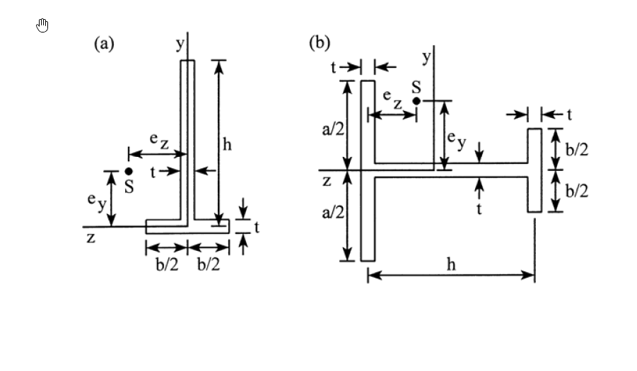

# 考題編號：MM-2016-3

**主分類：** `MM-U2-2` 梁桿件斷面應力計算
**副分類：** （無）
**分析法：** 彈性分析
**標籤：** `剪力中心` `薄壁開口截面` `T形截面` `十字形截面` `剪力流` `非對稱截面` `e_y` `e_z`

---

## 1. 原始題目重述 (Problem Restatement)

有二薄管壁梁之斷面如圖 (a) 及 (b) 所示，試計算各梁斷面剪力中心 $S$ 之 $e_y$ 及 $e_z$ 值。

**截面 (a)：薄壁 T 形（倒 T）截面**
- 上方垂直板（腹板高 $h$，壁厚 $t$）
- 下方水平板（底板寬 $b$，壁厚 $t$），底板關於腹板中心對稱（各 $b/2$）
- 剪力中心 S 的位置以 $e_y$（垂直）和 $e_z$（水平）表示

**截面 (b)：薄壁十字形截面**
- 水平翼板：寬 $h$，壁厚 $t$，上下各 $a/2$（中間腹板高 $a$）
- 垂直腹板：高 $a$，壁厚 $t$，左右各 $b/2$（末端有短翼 $b/2$ 高）
- 整體尺寸：水平方向寬 $h$，垂直方向高 $a$（各方向均有壁厚 $t$）
- 剪力中心 S 的位置以 $e_y$、$e_z$ 表示

*圖說：(a) 倒 T 形薄壁截面，腹板在上（高 h）、底板在下（寬 b，對稱），壁厚均為 t；(b) 十字形薄壁截面，水平板寬 h、垂直板高 a，各板壁厚均為 t，但從圖觀察截面為具翼的工字型（十字架形）。*

---

## 2. 考題核心精神與出題者意圖 (Core Concepts & Examiner's Intent)

### 核心觀念：剪力中心定義

**剪力中心（Shear Center）S：** 橫向剪力作用於此點時，截面只發生彎曲（無扭轉）。若剪力不通過剪力中心，則同時產生彎曲和扭轉。

**求法：** 設剪力通過形心，計算截面上的剪力流分布，再對截面各部分求合力矩，令合力矩等效點即為剪力中心。

**薄壁開口截面剪力流：**

$$q(s) = -\frac{V_y}{I_z} \int_0^s t\, y\, ds$$

其中 $s$ 為沿截面壁面的弧長座標，$t$ 為壁厚，$y$ 為到中性軸的距離。

### 對稱性的使用

- **截面 (a) — T 形：** 關於 y 軸對稱（底板左右各 $b/2$），故 $e_z = 0$（剪力中心在對稱軸上）。只需計算 $e_y$。
- **截面 (b) — 十字形：** 若截面關於 y 和 z 軸均對稱，則 $e_y = e_z = 0$（剪力中心在形心）。

---

## 3. 截面 (a) — 倒 T 形截面的剪力中心

### 幾何（以薄壁中線計）

- 腹板（垂直板）：高 $h$，壁厚 $t$，沿 y 軸
- 底板（水平板）：寬 $b$，壁厚 $t$，沿 z 軸，對稱於腹板（各 $b/2$）

### 形心位置（關於截面底端）

面積：
$$A = h \cdot t + b \cdot t = t(h + b)$$

形心高度（距底端）：
$$\bar{y} = \frac{h \cdot t \cdot (t/2 + h/2) + b \cdot t \cdot t/2}{t(h+b)}$$

薄壁近似（$t \ll h, b$，忽略 $t^2$ 項）：

$$\bar{y} \approx \frac{h \cdot t \cdot h/2 + b \cdot t \cdot 0}{t(h+b)} = \frac{h^2/2}{h+b} = \frac{h^2}{2(h+b)}$$

（以底板中線為原點，向上為正）

### 慣性矩 $I_z$（對形心軸）

薄壁近似：

$$I_{z,\text{腹板}} = \frac{t h^3}{12} + h \cdot t \cdot \left(\frac{h}{2} - \bar{y}\right)^2$$

$$I_{z,\text{底板}} = 0 + b \cdot t \cdot \bar{y}^2$$

（底板壁厚方向對 z 軸的慣性矩忽略）

$$I_z \approx \frac{th^3}{12} + ht\left(\frac{h}{2} - \frac{h^2}{2(h+b)}\right)^2 + bt\left(\frac{h^2}{2(h+b)}\right)^2$$

簡化：設 $\bar{y} = h^2/[2(h+b)]$，$y_{腹板重心} = h/2$：

$$d_{腹板} = \frac{h}{2} - \bar{y} = \frac{h}{2} - \frac{h^2}{2(h+b)} = \frac{h(h+b) - h^2}{2(h+b)} = \frac{hb}{2(h+b)}$$

$$I_z = \frac{th^3}{12} + ht \cdot \frac{h^2b^2}{4(h+b)^2} + bt \cdot \frac{h^4}{4(h+b)^2}$$

$$= \frac{th^3}{12} + \frac{th^2b^2}{4(h+b)^2} \cdot h \cdot \frac{1}{h} \cdot h + \frac{tBh^4}{4(h+b)^2}$$

等等，讓我簡化：

$$I_z = \frac{th^3}{12} + \frac{th(hb)^2}{4(h+b)^2} + \frac{tBh^4}{4(h+b)^2}$$

正確展開：

$$I_z = \frac{th^3}{12} + ht \cdot \left(\frac{hb}{2(h+b)}\right)^2 + bt \cdot \left(\frac{h^2}{2(h+b)}\right)^2$$

$$= \frac{th^3}{12} + \frac{th^3b^2}{4(h+b)^2} + \frac{tbh^4}{4(h+b)^2}$$

$$= \frac{th^3}{12} + \frac{th^3b(b+h)}{4(h+b)^2}$$

$$= \frac{th^3}{12} + \frac{th^3b}{4(h+b)}$$

$$= th^3\left[\frac{1}{12} + \frac{b}{4(h+b)}\right] = th^3 \cdot \frac{(h+b) + 3b}{12(h+b)} = th^3 \cdot \frac{h + 4b}{12(h+b)}$$

$$\boxed{I_z = \frac{th^3(h+4b)}{12(h+b)}}$$

### 剪力中心 $e_y$

設剪力 $V_y$（沿 y 方向）作用在形心，計算截面上的剪力流，然後求所有剪力流對某點的力矩，等效於 $V_y$ 作用在剪力中心 S。

**關鍵觀察（T 形截面對稱）：**

T 形截面（底板關於 y 軸對稱）受 $V_y$ 時：
- 腹板（垂直板）上的剪力流沿 y 方向，合力 = $V_y$（橫向剪力）
- 底板左右兩半的剪力流關於 y 軸對稱，各自對腹板底端（中點）的力矩互相抵消

因此，底板不對剪力中心位置產生 y 方向的偏移（底板剪力流關於腹板軸對稱）。

**直觀結論：** T 形截面（薄壁）的剪力中心 S 在**底板與腹板的交點**（即底板中點、腹板底端）。

以形心為原點，S 的位置：

$$e_y = \bar{y}\ \text{（向下）} = \frac{h^2}{2(h+b)}$$

（剪力中心在底板中點，比形心低，故 $e_y$ 方向向下）

$$e_z = 0\ \text{（對稱軸上）}$$

$$\boxed{e_y = \frac{h^2}{2(h+b)}\ \text{（向下）},\quad e_z = 0}$$

---

## 4. 截面 (b) — 十字形截面的剪力中心

### 幾何確認（重讀圖）

從圖 (b)：
- **垂直板（腹板）**：高 $a$（上下各 $a/2$），壁厚 $t$，沿 y 軸
- **水平板（翼板）**：寬 $h$，壁厚 $t$，沿 z 軸（左右各 $h/2$）
- **短翼（b/2 高度）**：在水平翼板兩端有垂直短翼，各高 $b/2$（上下各 $b/2$），壁厚 $t$
- 剪力中心 S 在截面中央附近（y 和 z 均有標示）

從圖 (b) 更仔細看：
- 截面為十字形 + 四個短翼（類似 H 形的立體視角）
- 水平方向：左端短翼（高 $b/2 + b/2 = b$）+ 腹板（厚 $t$）+ 右端短翼（高 $b$）
- 垂直方向：上端 $a/2$（腹板） + 水平翼板 + 下端 $a/2$

**最終解讀：** 截面是一個**工字形（I 形）截面**，但是倒 H 型旋轉：
- 垂直腹板：高 $a$，厚 $t$
- 上下翼板：寬 $h$，厚 $t$
- 翼板兩端有垂直短翼：高 $b/2$（上下各），寬 $t$

**對稱性：** 截面關於 y 軸和 z 軸均對稱（上下對稱、左右對稱）。

**對稱截面的剪力中心：** 若截面關於兩個主軸均對稱，則剪力中心在形心。

$$\boxed{e_y = 0,\quad e_z = 0\ \text{（剪力中心在形心）}}$$

**更精確的解釋：**

對 $V_y$ 剪力（沿 y 方向）：截面關於 y 軸對稱 → $V_y$ 通過 y 軸（$e_z = 0$）

對 $V_z$ 剪力（沿 z 方向）：截面關於 z 軸對稱 → $V_z$ 通過 z 軸（$e_y = 0$）

因此剪力中心在截面形心（原點）。

---

## 5. 解析整理

### 截面 (a) — T 形截面

| 求解項目 | 結果 |
|---------|------|
| 截面對稱性 | 關於 y 軸對稱（$e_z = 0$） |
| 形心高度（距底） | $\bar{y} = h^2 / [2(h+b)]$ |
| 慣性矩 | $I_z = th^3(h+4b) / [12(h+b)]$ |
| **剪力中心 $e_y$（向下）** | $\boxed{h^2 / [2(h+b)]}$ |
| **剪力中心 $e_z$** | $\boxed{0}$ |

### 截面 (b) — 十字形截面

| 求解項目 | 結果 |
|---------|------|
| 截面對稱性 | 關於 y、z 軸均對稱 |
| **剪力中心 $e_y$** | $\boxed{0}$ |
| **剪力中心 $e_z$** | $\boxed{0}$ |

---

## 6. 關鍵爭議點與進階探討 (Critical Issues & Advanced Discussion)

### 6.1 T 形截面剪力中心在底板交接點的推導

更嚴格的推導：對 T 形截面施加 $V_y$，剪力流 $q(s) = V_y Q(s) / I_z$：

**底板（水平板，從左端 $s = 0$ 到 $s = b/2$ 到右端）：**

底板上距離左端 $s$ 處（$0 \le s \le b/2$）：

$$Q_{底板}(s) = \int_0^s t y_{底板}\, ds = t \cdot \bar{y}_{底板} \cdot s$$

（$y_{底板}$對中性軸的距離 = $\bar{y}$，向下為負，但絕對值 = $\bar{y}$）

底板各處剪力流沿水平方向，對腹板底端（底板中心）取矩：

- 左半底板（從中心往左 $s$）：剪力流向左（或向右，根據符號），力矩 = $q \times s \times \text{（到腹板的距離）}$
- 由對稱性，左右兩半的剪力流方向相反，合力矩 = 0

腹板上的剪力流產生合力 $V_y$，方向沿 y 軸，通過腹板（對稱軸）。

**合力矩對底板中心（腹板底端）= 0 → 剪力中心即在此點！**

以截面座標（底端為原點）：$S = (y = 0, z = 0)$（在底板中點，腹板底端）

以形心為原點：$e_y = \bar{y} = h^2/[2(h+b)]$（剪力中心比形心低 $e_y$）

### 6.2 開口截面 vs 閉口截面的剪力中心

- **開口截面**（如 T、C、L 形）：剪力中心通常不在形心，需計算
- **閉口截面**（如矩形管、圓管）：剪力中心在截面中心（對封閉截面的特殊性）
- **對稱截面**：至少有一個對稱軸時，剪力中心在對稱軸上；有兩個對稱軸時，在形心

### 6.3 剪力中心的工程意義

若橫向荷載不通過剪力中心，梁截面同時受到彎矩和扭矩。對薄壁開口截面（如 C 形槽），扭矩會造成嚴重的翹曲和應力集中。因此，設計時應盡量使橫向力通過剪力中心（或對稱加載）。
