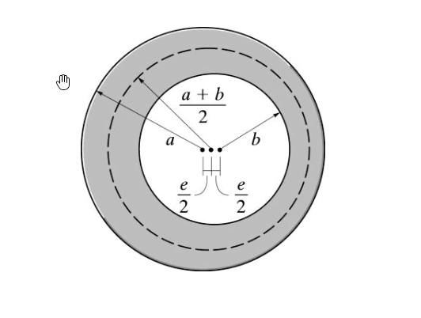

# 考題編號：MM-2017-2

**主分類：** `MM-U2-3` 扭力桿件斷面應力計算
**副分類：** （無）
**分析法：** 彈性分析
**標籤：** `空心圓管` `製造偏心` `扭轉強度` `最大剪應力` `最小剪應力` `壁厚不均` `極慣性矩` `扭轉公式`

---

## 1. 原始題目重述 (Problem Restatement)

一**空心圓管**因製造誤差，外徑圓心與內徑圓心有偏心距 $e$（如圖所示）。

**符號定義（由圖讀得）：**
- 外圓（實線大圓）半徑 = $\dfrac{a+b}{2}$，圓心在中央（記為 $O_o$）
- 內孔（虛線圓）半徑 = $b$，圓心偏移（記為 $O_i$，偏移量 $e$）
- 因此：左壁最薄厚度 = $a$，右壁最厚厚度 = $b - e + e = ?$
- 偏心距：兩圓心距離 = $e$

**由幾何關係建立符號體系（重新整理）：**

設外圓半徑為 $c_o$，內孔半徑為 $c_i$（均以各自圓心量）：
- 從圖：$a$ = 外圓圓心 $O_o$ 到內孔左緣的距離，$b$ = $O_o$ 到內孔右緣的距離
- 外圓半徑 $c_o = \dfrac{a+b}{2}$（圖中標示的 $\dfrac{a+b}{2}$）
- 內孔半徑 $c_i = b - \dfrac{a+b}{2} + \dfrac{a+b}{2} = ?$

**最清晰的重建（按常見教科書設定）：**

設無偏心（理想）管：
- 外半徑 $c_o$，內半徑 $c_i$，壁厚均勻 $t_0 = c_o - c_i$

有偏心後（偏心距 $e$，內孔圓心相對外圓圓心偏移 $e$）：
- **最薄壁**（偏心方向）：$t_{min} = c_o - c_i - e = t_0 - e$
- **最厚壁**（反方向）：$t_{max} = c_o - c_i + e = t_0 + e$

從圖標示：$a = t_0 - e$（最薄壁），$b = t_0 + e$（最厚壁），故：
- $t_0 = \dfrac{a+b}{2}$（名義壁厚）
- $e = \dfrac{b-a}{2}$（偏心距）
- 外半徑 $c_o = c_i + t_0$（不直接標在圖上）

**題目設定的偏心量：$e = \dfrac{r}{4}$**（其中 $r$ = 半徑差，即 $e$ 為平均壁厚的四分之一）

> 由題目原文：「偏心距 e 為半徑差的四分之一」，即 $e = \dfrac{c_o - c_i}{4} = \dfrac{t_0}{4}$

**求：**
1. 扭轉強度降低的百分比（與無偏心相比）
2. 因偏心造成的最大剪應力與最小剪應力之比值



*圖說：空心圓管橫截面，外圓（大，實體輪廓）圓心在正中央，內孔（虛線圓）圓心向左偏移偏心距 e。左側壁厚最薄（= a），右側壁厚最厚（= b）。兩圓心距離 = e = (b - a)/2 × 2 = b - a。無偏心時壁厚均為 (a+b)/2。*

---

## 2. 考題核心精神與出題者意圖 (Core Concepts & Examiner's Intent)

### 核心觀念

**關鍵難點：偏心後如何計算扭轉強度？**

空心圓管的扭轉公式（同心，無偏心）：
$$\tau = \frac{T \rho}{J}$$

其中 $J = \dfrac{\pi}{2}(c_o^4 - c_i^4)$（相對外圓圓心），$\rho$ 為到外圓圓心的距離。

**有偏心後：** 截面不再是「同心圓環」，嚴格說無法直接套用封閉形解。

但本題的物理意圖是：
- **扭轉強度由「最薄壁」控制**：偏心管的最薄壁（= $t_{min} = t_0 - e$）決定承載能力
- 扭轉強度（允許扭矩）$\propto$ 截面對扭矩中心的抵抗力，最薄壁最先失效

**簡化模型（薄壁管理論）：**

對薄壁管，Bredt 公式（流量 $q = T/(2A_m)$，$\tau = q/t$）：
- 剪力流 $q$ 沿壁厚均勻（同一圓環截面）
- $\tau_{max}$ 在**最薄壁**處：$\tau_{max} = q/t_{min}$
- $\tau_{min}$ 在**最厚壁**處：$\tau_{min} = q/t_{max}$

**扭轉強度：**
- 無偏心：$\tau = q/t_0 \le \tau_{allow}$ → $T_0 = 2A_m \tau_{allow} t_0$
- 有偏心：$\tau = q/t_{min} \le \tau_{allow}$ → $T_e = 2A_m \tau_{allow} t_{min}$

**強度降低比：**
$$\frac{T_e}{T_0} = \frac{t_{min}}{t_0} = \frac{t_0 - e}{t_0} = 1 - \frac{e}{t_0}$$

**代入 $e = t_0/4$：**
$$\frac{T_e}{T_0} = 1 - \frac{1}{4} = \frac{3}{4}$$

強度降低 = $1 - 3/4 = 1/4 = 25\%$

### 出題者意圖
- 測驗薄壁管 **Bredt 公式** 中「剪力流 $q$ 均勻、剪應力 $\tau = q/t$」的概念
- 測驗**壁厚不均對扭轉強度的影響**：最薄壁控制強度
- 測驗 $e = r/4$（半徑差的四分之一 = 壁厚的四分之一）的代入計算

---

## 3. 解題戰略地圖與陷阱分析 (Strategic Roadmap & Trap Analysis)

### 作戰計畫
```
Step 1：建立符號體系
        設外半徑 c_o，內半徑 c_i，名義壁厚 t_0 = c_o - c_i，偏心距 e = t_0/4
Step 2：用薄壁管 Bredt 公式，剪力流 q = T/(2A_m)
        無偏心：τ = q/t_0，有偏心：τ_max = q/t_min = q/(t_0 - e)
Step 3：計算扭轉強度比（允許扭矩比）= t_min/t_0 → 強度降低百分比
Step 4：計算最大/最小剪應力比 = t_max/t_min
```

### 關鍵陷阱

**陷阱 1：$e$ 的定義——「半徑差的四分之一」**
> 題目說「偏心距 e 為半徑差的四分之一」，半徑差 = $c_o - c_i = t_0$（壁厚），故：
> $$e = \frac{t_0}{4} = \frac{c_o - c_i}{4}$$
> 不要誤以為 $e = c_o/4$ 或 $e = c_i/4$。

**陷阱 2：偏心後壁厚的計算**
> 偏心距 $e$ = 兩圓心距離，最薄壁和最厚壁分別為：
> $$t_{min} = t_0 - e,\quad t_{max} = t_0 + e$$
> 代入 $e = t_0/4$：
> $$t_{min} = t_0 - \frac{t_0}{4} = \frac{3t_0}{4},\quad t_{max} = t_0 + \frac{t_0}{4} = \frac{5t_0}{4}$$

**陷阱 3：薄壁管 Bredt 公式中 $A_m$ 的計算**
> $A_m$ = 中線圍成的面積（以壁中線計算）。有偏心時，中線不是正圓，但偏心量通常遠小於半徑，可近似視為以標稱中線半徑計算的圓面積。本題採近似：$A_m \approx \pi r_m^2$，其中 $r_m = (c_o + c_i)/2$。
> **簡化假設**：偏心量 $e$ 遠小於平均半徑，$A_m$ 不變。

**陷阱 4：強度比 $\ne$ 剪應力比**
> 在**相同容許剪應力**條件下，強度（允許扭矩）正比於 $t$；
> 在**相同扭矩**條件下，剪應力反比於 $t$。
> 第(一)小題問強度降低（同一 τ 下，T 能多大），第(二)小題問應力比（同一 T 下，τ 的比值）——計算方向相反！

---

## 3.5 變數層次分析 (Variable Hierarchy Analysis)

> 複習提示：第一次解題後，在每個卡住的知識點旁標記 `⚠`；第二次複習時只看有 `⚠` 的項目。

### 最終目標
`① 扭轉強度降低百分比；② τ_max/τ_min 之比值`

### 本題關鍵公式（依計算順序）

> $\boxed{\cdot}$ = 需由前步驟推導，非題目直接給定的變數

$$\text{Step 1: } e = \frac{t_0}{4} \Rightarrow t_{min} = \frac{3t_0}{4},\quad t_{max} = \frac{5t_0}{4}$$

$$\text{Step 2（Bredt）: } q = \frac{T}{2A_m},\quad \tau = \frac{q}{t}$$

$$\text{Step 3①: } \frac{T_{allow,e}}{T_{allow,0}} = \frac{t_{min}}{t_0} = \frac{3}{4} \Rightarrow \text{降低 25\%}$$

$$\text{Step 4②: } \frac{\tau_{max}}{\tau_{min}} = \frac{q/t_{min}}{q/t_{max}} = \frac{t_{max}}{t_{min}} = \frac{5/4}{3/4} = \frac{5}{3}$$

### L1：題目直接給定

| 符號 | 說明 |
|------|------|
| $e$ | 偏心距（兩圓心距離） |
| $e = t_0/4$ | 偏心距為壁厚（半徑差）的 $1/4$ |
| 外半徑 | $(a+b)/2$（圖中標示） |
| 內半徑 | $b$（圖中標示） |

### L2：需知識點推導

| 符號 | 公式/來源 | 卡關? |
|------|----------|:-----:|
| $t_0$ | 名義壁厚 = 外半徑 $-$ 內半徑（同心時均勻） | |
| $e = t_0/4$ | 題意：半徑差的 $1/4$ | |
| $t_{min}$ | $t_0 - e = 3t_0/4$ | |
| $t_{max}$ | $t_0 + e = 5t_0/4$ | |
| Bredt 剪力流 | $q = T/(2A_m)$（沿整個周長均勻） | |
| $\tau$ | $\tau = q/t$，$t$ 越薄則 $\tau$ 越大 | |

### L3：深層知識（不懂就卡住）

| 知識點 | 說明 | 卡關? |
|--------|------|:-----:|
| **Bredt 公式（薄壁閉口截面）** | 剪力流 $q = T/(2A_m)$ 沿整個截面周長為常數；各處剪應力 $\tau = q/t$，壁越薄應力越大 | |
| **偏心後壁厚的幾何計算** | 偏心距 $e$ = 兩圓心距，最薄壁 = $t_0 - e$，最厚壁 = $t_0 + e$ | |
| **扭轉強度的控制因素** | 強度由最薄壁決定（最薄壁最先達到容許剪應力）；允許扭矩 $\propto t_{min}$ | |
| **$A_m$ 的近似** | 薄壁管中 $A_m$ 以中線圍成面積計算；偏心量小時 $A_m$ 近似不變 | |

---

## 4. 步驟化詳細計算過程 (Step-by-Step Detailed Calculation)

### Step 1：建立符號體系與偏心後壁厚

設標稱（無偏心）空心管：
- 外半徑：$c_o$
- 內半徑：$c_i$
- 名義壁厚：$t_0 = c_o - c_i$

偏心距（兩圓心距）：

$$e = \frac{t_0}{4} = \frac{c_o - c_i}{4}$$

偏心後，各處壁厚沿周長變化（最薄在偏心方向，最厚在反方向）：

$$t_{min} = t_0 - e = t_0 - \frac{t_0}{4} = \frac{3t_0}{4}$$

$$t_{max} = t_0 + e = t_0 + \frac{t_0}{4} = \frac{5t_0}{4}$$

---

### Step 2：應用 Bredt 薄壁閉口截面扭轉公式

對任意薄壁閉口截面，剪力流 $q$ 沿周長為常數：

$$q = \frac{T}{2A_m}$$

其中 $A_m$ = 截面中線圍成的面積。

各處剪應力與當地壁厚成反比：

$$\tau = \frac{q}{t}$$

$$\tau_{max} = \frac{q}{t_{min}} \quad \text{（在最薄壁處）}$$

$$\tau_{min} = \frac{q}{t_{max}} \quad \text{（在最厚壁處）}$$

---

### Step 3（一）：扭轉強度降低百分比

**無偏心管（$t = t_0$ 均勻）：**

允許扭矩由 $\tau_{max} = \tau_{allow}$ 控制：

$$\tau_{allow} = \frac{q_0}{t_0} = \frac{T_0}{2A_m t_0}$$

$$T_0 = 2A_m \tau_{allow} t_0$$

**有偏心管（最薄壁 $t_{min} = 3t_0/4$）：**

允許扭矩由最薄壁控制：

$$\tau_{allow} = \frac{q_e}{t_{min}} = \frac{T_e}{2A_m t_{min}}$$

$$T_e = 2A_m \tau_{allow} t_{min} = 2A_m \tau_{allow} \cdot \frac{3t_0}{4}$$

**強度比：**

$$\frac{T_e}{T_0} = \frac{2A_m \tau_{allow} \cdot \frac{3t_0}{4}}{2A_m \tau_{allow} \cdot t_0} = \frac{3}{4}$$

$$\boxed{\text{扭轉強度降低} = 1 - \frac{3}{4} = \frac{1}{4} = 25\%}$$

---

### Step 4（二）：最大與最小剪應力比

在**相同扭矩 $T$** 下（即相同剪力流 $q = T/(2A_m)$）：

$$\tau_{max} = \frac{q}{t_{min}} = \frac{q}{\frac{3t_0}{4}} = \frac{4q}{3t_0}$$

$$\tau_{min} = \frac{q}{t_{max}} = \frac{q}{\frac{5t_0}{4}} = \frac{4q}{5t_0}$$

$$\frac{\tau_{max}}{\tau_{min}} = \frac{4q/(3t_0)}{4q/(5t_0)} = \frac{5}{3}$$

$$\boxed{\frac{\tau_{max}}{\tau_{min}} = \frac{5}{3} \approx 1.667}$$

---

### 📋 最終結果彙整

| 求解項目 | 結果 |
|---------|------|
| 偏心距 $e$ | $t_0/4$（名義壁厚的 1/4） |
| 最薄壁 $t_{min}$ | $3t_0/4$ |
| 最厚壁 $t_{max}$ | $5t_0/4$ |
| 允許扭矩比 $T_e/T_0$ | $3/4$（= 75%） |
| **扭轉強度降低** | **$25\%$** |
| **$\tau_{max}/\tau_{min}$** | **$5/3 \approx 1.667$** |

---

## 5. 關鍵爭議點與進階探討 (Critical Issues & Advanced Discussion)

### 5.1 Bredt 公式的適用條件

Bredt 公式（$q = T/2A_m$，$\tau = q/t$）適用於：
1. **薄壁閉口截面**：壁厚 $t \ll$ 截面尺寸（如半徑），使應力沿壁厚均勻假設成立
2. **截面形狀任意**：可以是圓形、矩形、多邊形等任意閉口形狀
3. **剪力流沿周長為常數**（由平衡方程推導）

偏心圓管的截面是「兩個不同心的圓圍成的區域」，只要壁厚遠小於半徑，仍可近似套用 Bredt 公式。

### 5.2 「半徑差」的解讀

題目說「偏心距 $e$ 為半徑差的四分之一」：
- **半徑差** = 外半徑 $-$ 內半徑 = 壁厚 $t_0$（同心時）
- 故 $e = t_0/4$

容易混淆的另一解讀：「半徑差」= 外徑 $-$ 內徑（直徑差），此時 $e = (d_o - d_i)/4 = t_0/2$，計算結果不同。

本題採 $e = t_0/4$（即半徑差的四分之一 = 壁厚的四分之一），結果：降低 25%，比值 5/3。

### 5.3 $A_m$ 是否受偏心影響？

嚴格計算時，偏心後截面「中線」不再是一個正圓，$A_m$ 略有變化。但由於：
- 題目強調「偏心距 $e$」，通常遠小於半徑
- $A_m$ 的變化量為 $O(e^2)$，相對誤差極小

因此可視 $A_m$ 為常數，此近似在薄壁管偏心分析中標準使用。

### 5.4 若偏心距更大會如何？

若 $e \to t_0$，則 $t_{min} \to 0$（管壁局部穿孔），扭轉強度降至零。

若 $e > t_0$，內孔和外圓部分重疊，截面不再是完整閉環，Bredt 公式失效。

本題 $e = t_0/4$（25% 的壁厚偏心），是實際製造誤差中較大但仍在合理範圍的情況。

### 5.5 兩小題的「對偶性」

| 分析角度 | 第(一)小題 | 第(二)小題 |
|---------|-----------|-----------|
| 固定量 | 容許剪應力 $\tau_{allow}$ | 扭矩 $T$（同一負載） |
| 求解量 | 允許扭矩 $T_{allow}$ | 各處剪應力 $\tau$ |
| 控制壁 | 最薄壁（限制強度） | 最薄壁（最大應力）/最厚壁（最小應力） |
| 比例關係 | $T_{allow} \propto t$ | $\tau \propto 1/t$ |
