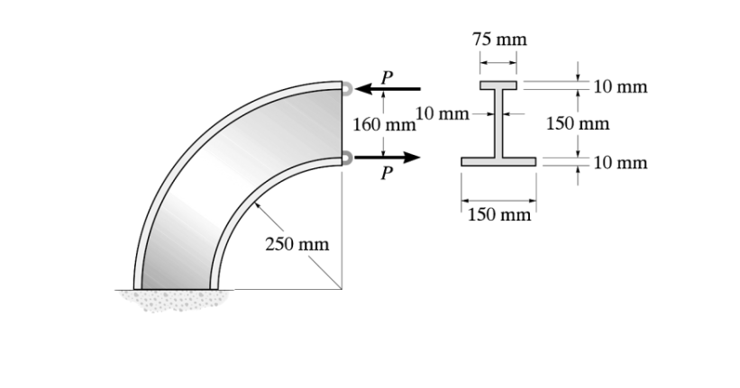

# 考題編號：MM-2017-3

**主分類：** `MM-U2-2` 梁桿件斷面應力計算
**副分類：** （無）
**分析法：** 彈性分析
**標籤：** `曲梁` `Winkler-Bach公式` `I形斷面` `中性軸` `曲率半徑` `非對稱斷面` `容許應力設計` `彎曲應力`

---

## 1. 原始題目重述 (Problem Restatement)

如圖所示，一**曲梁**（四分之一圓弧，底部固定），截面為 **I 形（工字型）**，承受一對水平對拉力 $P$。

**斷面尺寸（由右側斷面圖讀得）：**
- 上翼板：寬 $b_f = 75\ \text{mm}$，厚 $t_f = 10\ \text{mm}$
- 腹板：高 $h_w = 150\ \text{mm}$，厚 $t_w = 10\ \text{mm}$
- 下翼板：寬 $b_b = 150\ \text{mm}$，厚 $t_b = 10\ \text{mm}$
- 截面總高：$h = t_f + h_w + t_b = 10 + 150 + 10 = 170\ \text{mm}$

**曲梁幾何（由左側結構圖讀得）：**
- 曲梁內緣半徑：$r_i = 160\ \text{mm}$（從圓心到截面最內緣）
- 曲梁外緣半徑：$r_o = r_i + h = 160 + 170 = 330\ \text{mm}$

**加載方式：**
- 上方 P 向左（←），下方 P 向右（→）
- 兩 P 在水平方向相反，形成一對力偶
- 截面受**純彎矩** $M = P \times h = P \times 170\ \text{mm}$（力偶臂 = 截面高度）

**容許應力：**
- 容許壓應力：$(\sigma_{allow})_c = 50\ \text{MPa}$
- 容許拉應力：$(\sigma_{allow})_t = 120\ \text{MPa}$

**求：** 最大作用力 $P$ 之大小。



*圖說：左側為四分之一圓弧曲梁結構，底部固定，上下各有一個水平力 P（一左一右），形成純彎矩作用於截面；右側為截面詳圖：工字型截面，上翼板 75 mm 寬 × 10 mm 厚，腹板 150 mm 高 × 10 mm 厚，下翼板 150 mm 寬 × 10 mm 厚；內緣半徑 $r_i = 160\ \text{mm}$，外緣 $r_o = 330\ \text{mm}$。*

---

## 2. 考題核心精神與出題者意圖 (Core Concepts & Examiner's Intent)

### 核心觀念

本題為**曲梁彎曲應力**計算，使用 **Winkler-Bach 公式**：

$$\sigma = \frac{M(R - r)}{Ae(r)}$$

其中：
- $M$：截面彎矩（力偶矩）
- $R$：截面**中性軸**曲率半徑（需計算，$R \ne \bar{r}$ 形心半徑）
- $r$：所求應力點的半徑（到圓心距離）
- $A$：截面面積
- $e = \bar{r} - R$：形心半徑與中性軸半徑之差（偏心距，正值代表形心在中性軸外側）

**關鍵：曲梁中性軸不在形心！**

直梁：中性軸過形心（$\bar{y} = 0$）  
曲梁：中性軸偏向曲率中心方向（$R < \bar{r}$，中性軸比形心更靠近內緣）

### 曲梁中性軸半徑 $R$ 的計算

$$R = \frac{A}{\displaystyle\int \frac{dA}{r}}$$

其中 $\int dA/r$ 需對截面逐區域積分（對 I 形斷面分三部分）。

### 出題者意圖
- 測驗曲梁 **Winkler-Bach 公式** 的應用
- 測驗**非對稱 I 形截面**中性軸半徑 $R$ 的計算（上下翼板寬度不同）
- 測驗**拉壓應力不等容許值**的設計控制（需分別檢驗內外緣應力）
- 內緣曲率半徑小 → 應力集中（曲梁比直梁應力梯度更陡）

---

## 3. 解題戰略地圖與陷阱分析 (Strategic Roadmap & Trap Analysis)

### 作戰計畫
```
Step 1：計算 I 形截面面積 A 及各部分幾何
Step 2：計算截面形心半徑 r̄（以曲梁圓心為基準）
Step 3：計算中性軸半徑 R = A / ∫(dA/r)，分三段積分（上翼、腹板、下翼）
Step 4：計算偏心距 e = r̄ - R
Step 5：確認彎矩方向 → 內緣（r = r_i）受壓，外緣（r = r_o）受拉（或反之）
Step 6：分別由容許壓應力和容許拉應力，求各自對應的 P 上限
Step 7：取最小值作為最大 P
```

### 關鍵陷阱

**陷阱 1：彎矩符號與內外緣應力方向**
> 本題 P 向左（上方）+ 向右（下方）形成力偶，使曲梁截面彎矩方向為「使曲率增大」（即內側受壓，外側受拉），還是「使曲率減小」（反之）？
>
> 從圖：上 P 向左，下 P 向右，這個力偶使截面**曲率增大**（彎曲方向與曲梁本身相同）。
> → Winkler-Bach 公式中，曲率增大時 $M > 0$，**內緣受壓（$r = r_i$），外緣受拉（$r = r_o$）**。

**陷阱 2：I 形斷面的 $\int dA/r$ 分三段積分**
> 各矩形塊：$\int dA/r = b \ln(r_2/r_1)$（$b$ = 該塊寬度，$r_1, r_2$ = 該塊的內外半徑）

**陷阱 3：非對稱截面 → 形心不在正中央**
> 上翼 75×10，下翼 150×10，面積不同 → 形心偏向較重的下翼板

**陷阱 4：拉壓容許應力不同 → 需分別控制**
> 內緣（壓）：$|\sigma_i| \le 50\ \text{MPa}$，外緣（拉）：$\sigma_o \le 120\ \text{MPa}$
> 取 $P$ 的兩個上限，最終答案取**小者**

---

## 3.5 變數層次分析 (Variable Hierarchy Analysis)

> 複習提示：第一次解題後，在每個卡住的知識點旁標記 `⚠`；第二次複習時只看有 `⚠` 的項目。

### 最終目標
`求最大允許力 P（同時滿足內緣壓應力 ≤ 50 MPa，外緣拉應力 ≤ 120 MPa）`

### 本題關鍵公式（依計算順序）

$$\text{Step 1: } A = A_f + A_w + A_b$$

$$\text{Step 2: } \bar{r} = \frac{\sum A_i \bar{r}_i}{A}\ \text{（形心半徑，以圓心為基準）}$$

$$\text{Step 3: } \int \frac{dA}{r} = \sum b_i \ln\frac{r_{i,o}}{r_{i,i}},\quad R = \frac{A}{\int dA/r}$$

$$\text{Step 4: } e = \bar{r} - R$$

$$\text{Step 5: } M = P \times h = P \times 170\ \text{mm}$$

$$\text{Step 6: } \sigma = \frac{M(R - r)}{A \cdot e \cdot r}\ \Rightarrow\ \sigma_i\text{（內緣，壓）},\ \sigma_o\text{（外緣，拉）}$$

$$\text{Step 7: } P_{\max} = \min\left(\frac{50 \cdot Aer_i}{|R-r_i| \cdot h},\ \frac{120 \cdot Aer_o}{(R-r_o) \cdot h}\right)$$

### L1：題目直接給定

| 符號 | 數值 | 說明 |
|------|------|------|
| $r_i$ | $160\ \text{mm}$ | 截面內緣曲率半徑 |
| $r_o$ | $330\ \text{mm}$ | 截面外緣曲率半徑（= $r_i$ + 170） |
| 上翼板 | $75 \times 10\ \text{mm}^2$ | 寬 × 厚 |
| 腹板 | $10 \times 150\ \text{mm}^2$ | 厚 × 高 |
| 下翼板 | $150 \times 10\ \text{mm}^2$ | 寬 × 厚 |
| $(\sigma_{allow})_c$ | $50\ \text{MPa}$ | 容許壓應力 |
| $(\sigma_{allow})_t$ | $120\ \text{MPa}$ | 容許拉應力 |

### L2：需知識點推導

| 符號 | 公式/來源 | 卡關? |
|------|----------|:-----:|
| $A$ | $75\times10 + 10\times150 + 150\times10 = 750+1500+1500=3750\ \text{mm}^2$ | |
| $\bar{r}$ | 各區形心半徑加權平均 | |
| $R$ | $A / \sum b_i\ln(r_{o,i}/r_{i,i})$ | |
| $e$ | $\bar{r} - R$ | |
| $M$ | $P \times 170\ \text{mm}$ | |

### L3：深層知識（不懂就卡住）

| 知識點 | 說明 | 卡關? |
|--------|------|:-----:|
| **Winkler-Bach 曲梁公式** | $\sigma = M(R-r)/(Aer)$；注意：$r = r_i$ 時 $R > r_i$，應力為正（拉）或負（壓）取決於 $M$ 符號 | |
| **中性軸半徑 $R$ 計算** | $R = A/\int(dA/r)$；矩形塊：$\int dA/r = b\ln(r_2/r_1)$ | |
| **形心半徑 $\bar{r}$ vs 中性軸半徑 $R$** | 曲梁中 $R < \bar{r}$（中性軸偏向圓心側）；$e = \bar{r} - R > 0$ | |
| **彎矩符號約定** | 使曲率增大（內縮）的彎矩為正 $M > 0$：內緣壓（$\sigma < 0$ at $r = r_i$），外緣拉（$\sigma > 0$ at $r = r_o$） | |

---

## 4. 步驟化詳細計算過程 (Step-by-Step Detailed Calculation)

### Step 1：截面各部分幾何（以圓心為基準的半徑）

各部分在曲梁中的半徑範圍（從內緣 $r_i = 160\ \text{mm}$ 往外）：

| 部分 | 內緣半徑 | 外緣半徑 | 寬度 $b$ | 面積 $A_i$ |
|------|---------|---------|---------|----------|
| 下翼板（最靠圓心） | $r_1 = 160$ | $r_2 = 170$ | $150\ \text{mm}$ | $150 \times 10 = 1500\ \text{mm}^2$ |
| 腹板 | $r_3 = 170$ | $r_4 = 320$ | $10\ \text{mm}$ | $10 \times 150 = 1500\ \text{mm}^2$ |
| 上翼板（最遠圓心） | $r_5 = 320$ | $r_6 = 330$ | $75\ \text{mm}$ | $75 \times 10 = 750\ \text{mm}^2$ |

**總面積：**
$$A = 1500 + 1500 + 750 = 3750\ \text{mm}^2$$

---

### Step 2：截面形心半徑 $\bar{r}$（以圓心為基準）

各部分形心半徑（部分中點）：

$$\bar{r}_{\text{下翼}} = \frac{160 + 170}{2} = 165\ \text{mm}$$

$$\bar{r}_{\text{腹板}} = \frac{170 + 320}{2} = 245\ \text{mm}$$

$$\bar{r}_{\text{上翼}} = \frac{320 + 330}{2} = 325\ \text{mm}$$

**形心半徑：**

$$\bar{r} = \frac{A_{\text{下}}\bar{r}_{\text{下}} + A_{\text{腹}}\bar{r}_{\text{腹}} + A_{\text{上}}\bar{r}_{\text{上}}}{A}$$

$$= \frac{1500 \times 165 + 1500 \times 245 + 750 \times 325}{3750}$$

$$= \frac{247{,}500 + 367{,}500 + 243{,}750}{3750} = \frac{858{,}750}{3750} = 229\ \text{mm}$$

$$\boxed{\bar{r} = 229\ \text{mm}}$$

---

### Step 3：中性軸半徑 $R$

$$R = \frac{A}{\displaystyle\int \frac{dA}{r}} = \frac{A}{\displaystyle\sum_i b_i \ln\frac{r_{o,i}}{r_{i,i}}}$$

各部分的 $b_i \ln(r_{o,i}/r_{i,i})$：

**下翼板（$b = 150$，$r_1 = 160$，$r_2 = 170$）：**
$$150 \times \ln\frac{170}{160} = 150 \times \ln(1.0625) = 150 \times 0.060625 = 9.094$$

**腹板（$b = 10$，$r_3 = 170$，$r_4 = 320$）：**
$$10 \times \ln\frac{320}{170} = 10 \times \ln(1.8824) = 10 \times 0.63296 = 6.330$$

**上翼板（$b = 75$，$r_5 = 320$，$r_6 = 330$）：**
$$75 \times \ln\frac{330}{320} = 75 \times \ln(1.03125) = 75 \times 0.030771 = 2.308$$

$$\int \frac{dA}{r} = 9.094 + 6.330 + 2.308 = 17.732\ \text{mm}$$

$$R = \frac{3750}{17.732} = 211.5\ \text{mm}$$

$$\boxed{R \approx 211.5\ \text{mm}}$$

> **驗算：** $R < \bar{r}$（$211.5 < 229$）✓（中性軸比形心更靠近圓心，符合曲梁理論）

---

### Step 4：偏心距 $e$

$$e = \bar{r} - R = 229 - 211.5 = 17.5\ \text{mm}$$

$$\boxed{e = 17.5\ \text{mm}}$$

---

### Step 5：彎矩 $M$ 與應力計算

**彎矩（力偶矩）：**

兩個 P 相距截面高度 $h = 170\ \text{mm}$，形成力偶：

$$M = P \times h = 170P\ \text{(kN·mm，若 P 以 kN）}$$

**Winkler-Bach 曲梁公式：**

$$\sigma = \frac{M(R - r)}{A \cdot e \cdot r}$$

**內緣應力（$r = r_i = 160\ \text{mm}$，$R - r_i = 211.5 - 160 = 51.5\ \text{mm} > 0$）：**

P 的力偶使曲率增大（內縮）→ 內緣受**壓**（$\sigma < 0$）。

$$|\sigma_i| = \frac{M \times (R - r_i)}{A \times e \times r_i} = \frac{170P \times 51.5}{3750 \times 17.5 \times 160}$$

$$= \frac{8755P}{10{,}500{,}000} = 8.338 \times 10^{-4} \cdot P\ \text{(MPa，若 P 以 N)}$$

**外緣應力（$r = r_o = 330\ \text{mm}$，$R - r_o = 211.5 - 330 = -118.5\ \text{mm} < 0$）：**

外緣受**拉**（$\sigma > 0$）：

$$\sigma_o = \frac{M \times |R - r_o|}{A \times e \times r_o} = \frac{170P \times 118.5}{3750 \times 17.5 \times 330}$$

$$= \frac{20{,}145P}{21{,}656{,}250} = 9.302 \times 10^{-4} \cdot P\ \text{(MPa，若 P 以 N)}$$

---

### Step 6：各容許應力控制之最大 P

**由內緣壓應力控制（$|\sigma_i| \le 50\ \text{MPa}$）：**

$$8.338 \times 10^{-4} \cdot P \le 50$$

$$P \le \frac{50}{8.338 \times 10^{-4}} = 59{,}960\ \text{N} \approx 60.0\ \text{kN}$$

**由外緣拉應力控制（$\sigma_o \le 120\ \text{MPa}$）：**

$$9.302 \times 10^{-4} \cdot P \le 120$$

$$P \le \frac{120}{9.302 \times 10^{-4}} = 128{,}999\ \text{N} \approx 129.0\ \text{kN}$$

**最大 P 取兩者較小值：**

$$P_{\max} = \min(60.0,\ 129.0) = 60.0\ \text{kN}$$

$$\boxed{P_{\max} \approx 60.0\ \text{kN}\ \text{（由內緣壓應力控制）}}$$

---

### 📋 最終結果彙整

| 計算項目 | 數值 |
|---------|------|
| 截面面積 $A$ | $3750\ \text{mm}^2$ |
| 形心半徑 $\bar{r}$ | $229\ \text{mm}$ |
| 中性軸半徑 $R$ | $\approx 211.5\ \text{mm}$ |
| 偏心距 $e$ | $\approx 17.5\ \text{mm}$ |
| 內緣（壓）應力係數 | $8.338 \times 10^{-4}\ \text{MPa/N}$ |
| 外緣（拉）應力係數 | $9.302 \times 10^{-4}\ \text{MPa/N}$ |
| 壓應力控制之 $P_{\max}$ | $\approx 60.0\ \text{kN}$ |
| 拉應力控制之 $P_{\max}$ | $\approx 129.0\ \text{kN}$ |
| **最大作用力 $P_{\max}$** | **$\approx 60.0\ \text{kN}$（壓應力控制）** |

---

## 5. 關鍵爭議點與進階探討 (Critical Issues & Advanced Discussion)

### 5.1 中性軸的物理意義

曲梁中，彎曲應力公式為 $\sigma = M(R-r)/(Aer)$：
- $r < R$（靠圓心側）：$R - r > 0$，$\sigma$ 與 $M$ 同號
- $r > R$（遠圓心側）：$R - r < 0$，$\sigma$ 與 $M$ 反號
- $r = R$：$\sigma = 0$（中性軸位置）

中性軸在 $r = R = 211.5\ \text{mm}$，在形心（$\bar{r} = 229\ \text{mm}$）靠近圓心側，位於腹板中段（$170\ \text{mm} < 211.5\ \text{mm} < 320\ \text{mm}$）。

### 5.2 曲梁 vs 直梁的應力差異

曲梁應力（內緣更大）的直覺理解：截面內緣的纖維被更多地壓縮（曲率效應），因此應力集中在內緣。對稱截面（如圓形、矩形），內緣應力始終大於外緣應力（絕對值）。

本題非對稱截面（上翼 75 mm，下翼 150 mm），形心偏向下翼（$\bar{r} = 229 < (160+330)/2 = 245\ \text{mm}$），使內緣的 $(R-r_i)/r_i$ 與外緣的 $|R-r_o|/r_o$ 不對稱。

### 5.3 $\ln$ 計算的精確度

本題涉及多個 $\ln$ 計算，建議使用以下近似：
- $\ln(1+x) \approx x - x^2/2 + \cdots$（$x$ 小時）
- $\ln(170/160) = \ln(1.0625) \approx 0.0606$（精確值）
- $\ln(320/170) = \ln(1.8824) \approx 0.6330$（精確值）
- $\ln(330/320) = \ln(1.03125) \approx 0.03077$（精確值）

計算器精確計算 $R = 3750/17.732 \approx 211.5\ \text{mm}$，$e = 229 - 211.5 = 17.5\ \text{mm}$。

### 5.4 彎矩方向的確認

題目載明上方 P 向左（←）、下方 P 向右（→），構成**順時針力偶**（從截面正面看）。

對曲梁（向右方開口的四分之一圓弧），此力偶使：
- 截面曲率**增大**（曲梁變得更彎）
- 依 Winkler-Bach 符號規定（$M > 0$ 使曲率增大）：內緣壓縮，外緣拉伸

→ 內緣壓應力 ≤ 50 MPa（嚴苛限制），外緣拉應力 ≤ 120 MPa（寬鬆限制）

→ 最終由**內緣壓應力**控制 $P_{\max} \approx 60\ \text{kN}$。
