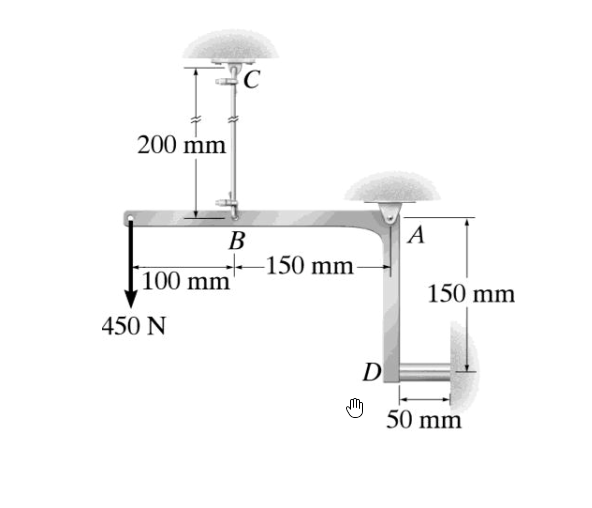

# 考題編號：MM-2017-4

**主分類：** `MM-U3-1` 軸力桿件變位及內力分析
**副分類：** `MM-U1-2` 虎克定律應用
**分析法：** 彈性分析
**標籤：** `L形剛性連桿` `插銷支承` `鋼線` `鋁塊` `靜不定軸力` `變形諧和` `旋轉角` `材料異質`

---

## 1. 原始題目重述 (Problem Restatement)

一 **L 形剛性連桿**由插銷 $A$ 支撐（旋轉中心），結構如下：

**幾何配置（由圖讀得）：**
- 水平段：從 $B$（左端）到 $A$（右端），長 = $150\ \text{mm}$，$B$ 在 $A$ 左側
- 垂直段：從 $A$（頂）到 $D$（底），長 = $150\ \text{mm}$，$D$ 在 $A$ 正下方
- 外力 $P = 450\ \text{N}$（向下），作用在 $B$ 點左側 $100\ \text{mm}$ 處（即距 $A$ 水平距離 = $150 + 100 = 250\ \text{mm}$）

**鋼線 BC：**
- $B$ 點（水平段左端，距 $A$ 水平 150 mm）垂直向上
- 上端 $C$ 固定於天花板，未受力長度 $L_{BC} = 200\ \text{mm}$
- 截面積 $A_{BC} = 22.5\ \text{mm}^2$
- 彈性模數 $E_{\text{鋼}} = 200\ \text{GPa}$

**鋁塊 D：**
- 在垂直段底端 $D$（距 $A$ 垂直 150 mm），水平方向受壓（鋁塊夾在連桿與牆之間）
- 鋁塊未受力長度 $L_D = 50\ \text{mm}$
- 截面積 $A_D = 40\ \text{mm}^2$
- 彈性模數 $E_{\text{鋁}} = 70\ \text{GPa}$

**求：**
1. 鋼線 BC 及鋁塊 D 的正向應力
2. 連桿繞插銷 $A$ 的旋轉角



*圖說：L 形剛性連桿以插銷 A 為旋轉中心；水平段 B→A = 150 mm，B 點有鋼線 BC 向上（BC 長 200 mm，截面積 22.5 mm²，E = 200 GPa），力 450 N 向下作用於 B 左側 100 mm 處；垂直段 A→D = 150 mm，D 點有鋁塊（長 50 mm，截面積 40 mm²，E = 70 GPa）夾在連桿末端與固定牆之間。*

---

## 2. 考題核心精神與出題者意圖 (Core Concepts & Examiner's Intent)

### 核心觀念

本題為**L 形剛性連桿繞固定插銷旋轉的靜不定系統**：

- 連桿剛性（不變形），只能繞 $A$ 點**旋轉**（設旋轉角 $\theta$，順時針為正）
- **兩個未知量**（鋼線拉力 $F_{BC}$，鋁塊壓力 $F_D$）+ **一個平衡方程**（對 A 取力矩）= **一次靜不定**
- **補充諧和條件**：各元件的變形量與旋轉角 $\theta$ 的幾何關係

### 幾何諧和（旋轉 $\theta$，微小角度）

連桿繞 A 旋轉角 $\theta$（順時針 → B 點向下，D 點向右）：

| 點 | 方向 | 位移量（微小轉角） |
|----|------|--------------|
| $B$（距 $A$ 水平 150 mm） | 向下（鋼線伸長） | $\delta_{BC} = 150\theta$（拉伸） |
| $D$（距 $A$ 垂直 150 mm） | 向右（鋁塊壓縮） | $\delta_D = 150\theta$（壓縮） |
| 力作用點（距 $A$ 水平 250 mm） | 向下 | $250\theta$（力做功方向） |

> **關鍵：** $B$ 和 $D$ 到 $A$ 的距離**相等**（均為 150 mm），因此 $\delta_{BC} = \delta_D = 150\theta$——兩元件變形量相等！

### 虎克定律

$$F_{BC} = \frac{A_{BC} E_{\text{鋼}}}{L_{BC}} \delta_{BC} = k_{BC} \times 150\theta$$

$$F_D = \frac{A_D E_{\text{鋁}}}{L_D} \delta_D = k_D \times 150\theta$$

### 出題者意圖
- 測驗「剛性連桿 + 彈性元件」的**靜不定分析流程**
- 測驗**變形諧和**：用旋轉角 $\theta$ 表達各元件變形量
- 測驗**異質材料**（鋼 + 鋁）的剛度計算與比較
- 注意 D 點鋁塊的方向：垂直段旋轉使 D 點水平移動（壓縮鋁塊）

---

## 3. 解題戰略地圖與陷阱分析 (Strategic Roadmap & Trap Analysis)

### 作戰計畫
```
Step 1：計算各元件軸向剛度 k = AE/L
Step 2：設旋轉角 θ（順時針），用幾何諧和寫出各元件變形量
Step 3：用虎克定律寫出各元件力與 θ 的關係
Step 4：對 A 取力矩（平衡方程），代入各力求 θ
Step 5：回代求 F_BC、F_D，計算應力
Step 6：θ 即為旋轉角（單位 rad）
```

### 關鍵陷阱

**陷阱 1：旋轉方向的判斷**

> 外力 450 N 在 B 左側 100 mm 向下（距 A 水平 250 mm），產生**順時針力矩**（對 A 取矩，使連桿順時針旋轉）。
>
> 順時針旋轉：
> - B 點（在 A 左方）向**下移**，鋼線 BC 被**拉伸**（鋼線受拉，提供向上的抵抗力）✓
> - D 點（在 A 下方）向**右移**，鋁塊被**壓縮**（鋁塊受壓，提供向左的抵抗力）✓

**陷阱 2：鋁塊 D 的力矩臂方向**

> D 在 $A$ 正下方，鋁塊水平壓力 $F_D$（向左，即鋁塊對連桿的反力）對 $A$ 產生**逆時針力矩**（抵抗順時針旋轉）：力矩臂 = 垂直距離 = 150 mm。

**陷阱 3：鋼線 BC 的力矩臂方向**

> $B$ 在 $A$ 左方 150 mm，鋼線向上拉力 $F_{BC}$（向上）對 $A$ 產生**逆時針力矩**：力矩臂 = 水平距離 = 150 mm。

**陷阱 4：B 點下移量 vs 鋼線伸長量**

> B 下移 $150\theta$ → 鋼線 BC 下端 B 向下移 $150\theta$ → 鋼線**伸長** $150\theta$（C 端固定，B 端往下）✓

**陷阱 5：D 點右移量 vs 鋁塊壓縮量**

> D 向右移 $150\theta$ → 鋁塊（夾在 D 點與右側固定牆之間）被**壓縮** $150\theta$（假設初始緊密接觸，無間隙）✓

---

## 3.5 變數層次分析 (Variable Hierarchy Analysis)

> 複習提示：第一次解題後，在每個卡住的知識點旁標記 `⚠`；第二次複習時只看有 `⚠` 的項目。

### 最終目標
`求鋼線應力 σ_BC、鋁塊應力 σ_D，以及連桿旋轉角 θ`

### 本題關鍵公式（依計算順序）

> $\boxed{\cdot}$ = 需由前步驟推導

$$\text{Step 1: } k_{BC} = \frac{A_{BC}E_{\text{鋼}}}{L_{BC}},\quad k_D = \frac{A_D E_{\text{鋁}}}{L_D}$$

$$\text{Step 2（諧和）: } \delta_{BC} = 150\theta,\quad \delta_D = 150\theta$$

$$\text{Step 3（虎克）: } F_{BC} = k_{BC} \cdot 150\theta,\quad F_D = k_D \cdot 150\theta$$

$$\text{Step 4（力矩平衡，對 A）: } F_{BC} \cdot 150 + F_D \cdot 150 = 450 \times 250$$

$$\text{Step 5: } \theta \Rightarrow F_{BC},\ F_D \Rightarrow \sigma_{BC} = F_{BC}/A_{BC},\ \sigma_D = F_D/A_D$$

### L1：題目直接給定

| 符號 | 數值 | 說明 |
|------|------|------|
| $L_{BC}$ | $200\ \text{mm}$ | 鋼線未受力長度 |
| $A_{BC}$ | $22.5\ \text{mm}^2$ | 鋼線截面積 |
| $E_{\text{鋼}}$ | $200\ \text{GPa} = 200{,}000\ \text{MPa}$ | 鋼彈性模數 |
| $L_D$ | $50\ \text{mm}$ | 鋁塊未受力長度 |
| $A_D$ | $40\ \text{mm}^2$ | 鋁塊截面積 |
| $E_{\text{鋁}}$ | $70\ \text{GPa} = 70{,}000\ \text{MPa}$ | 鋁彈性模數 |
| $P$ | $450\ \text{N}$ | 外力 |
| AB | $150\ \text{mm}$ | B 到 A 的水平距離 |
| AD | $150\ \text{mm}$ | D 到 A 的垂直距離 |
| 力臂 | $250\ \text{mm}$ | 外力到 A 的水平距離（150+100） |

### L2：需知識點推導

| 符號 | 公式/來源 | 卡關? |
|------|----------|:-----:|
| $k_{BC}$ | $22.5 \times 200{,}000 / 200 = 22{,}500\ \text{N/mm}$ | |
| $k_D$ | $40 \times 70{,}000 / 50 = 56{,}000\ \text{N/mm}$ | |
| $F_{BC}$ | $k_{BC} \times 150\theta = 22{,}500 \times 150\theta$ | |
| $F_D$ | $k_D \times 150\theta = 56{,}000 \times 150\theta$ | |
| $\theta$ | 從力矩平衡解出 | |

### L3：深層知識（不懂就卡住）

| 知識點 | 說明 | 卡關? |
|--------|------|:-----:|
| **剛性連桿的旋轉角 $\theta$** | 連桿剛性 → 各點位移 = 到旋轉中心距離 $\times$ $\theta$（微小轉角假設） | |
| **軸向剛度 $k = AE/L$** | 單位伸長量所需的力（N/mm），與彈簧常數類比 | |
| **對插銷 A 取力矩** | 插銷 A 的反力對 A 無力矩，故只計算外力和彈性元件力的力矩 | |

---

## 4. 步驟化詳細計算過程 (Step-by-Step Detailed Calculation)

### Step 1：各元件軸向剛度

**鋼線 BC（受拉）：**

$$k_{BC} = \frac{A_{BC} \cdot E_{\text{鋼}}}{L_{BC}} = \frac{22.5\ \text{mm}^2 \times 200{,}000\ \text{N/mm}^2}{200\ \text{mm}} = \frac{4{,}500{,}000}{200} = 22{,}500\ \text{N/mm}$$

**鋁塊 D（受壓）：**

$$k_D = \frac{A_D \cdot E_{\text{鋁}}}{L_D} = \frac{40\ \text{mm}^2 \times 70{,}000\ \text{N/mm}^2}{50\ \text{mm}} = \frac{2{,}800{,}000}{50} = 56{,}000\ \text{N/mm}$$

---

### Step 2：幾何諧和——以旋轉角 $\theta$ 表達變形量

設連桿順時針旋轉角 $\theta$（rad，微小角度假設）：

**B 點（距 A 水平 150 mm）向下移動：**

$$\delta_B = 150\theta\ \text{mm（向下）}$$

→ 鋼線 BC 伸長 $\delta_{BC} = 150\theta\ \text{mm}$

**D 點（距 A 垂直 150 mm）向右移動：**

$$\delta_D = 150\theta\ \text{mm（向右）}$$

→ 鋁塊被壓縮 $\delta_D = 150\theta\ \text{mm}$

---

### Step 3：虎克定律——力與旋轉角的關係

**鋼線張力：**

$$F_{BC} = k_{BC} \cdot \delta_{BC} = 22{,}500 \times 150\theta = 3{,}375{,}000\theta\ \text{(N)}$$

**鋁塊壓力（鋁塊對連桿的反力，向左）：**

$$F_D = k_D \cdot \delta_D = 56{,}000 \times 150\theta = 8{,}400{,}000\theta\ \text{(N)}$$

---

### Step 4：力矩平衡（對插銷 A 取矩）

順時針力矩（外力產生）= 逆時針力矩（鋼線 + 鋁塊抵抗）

**外力 450 N（向下，作用在距 A 水平 250 mm 處）的力矩：**

$$M_{外} = 450 \times 250 = 112{,}500\ \text{N·mm}\ \text{（順時針）}$$

**鋼線 $F_{BC}$（向上，力矩臂 = 水平距離 150 mm）的力矩：**

$$M_{BC} = F_{BC} \times 150\ \text{（逆時針）}$$

**鋁塊 $F_D$（向左，力矩臂 = 垂直距離 150 mm）的力矩：**

$$M_D = F_D \times 150\ \text{（逆時針）}$$

**力矩平衡（$\sum M_A = 0$）：**

$$F_{BC} \times 150 + F_D \times 150 = 112{,}500$$

代入 Step 3 的結果：

$$(3{,}375{,}000\theta) \times 150 + (8{,}400{,}000\theta) \times 150 = 112{,}500$$

$$150\theta(3{,}375{,}000 + 8{,}400{,}000) = 112{,}500$$

$$150\theta \times 11{,}775{,}000 = 112{,}500$$

$$\theta = \frac{112{,}500}{150 \times 11{,}775{,}000} = \frac{112{,}500}{1{,}766{,}250{,}000}$$

$$\boxed{\theta = 6.370 \times 10^{-5}\ \text{rad}}$$

---

### Step 5：各元件力與應力

**鋼線張力 $F_{BC}$：**

$$F_{BC} = 3{,}375{,}000 \times 6.370 \times 10^{-5} = 214.99 \approx 215.0\ \text{N}$$

**鋁塊壓力 $F_D$：**

$$F_D = 8{,}400{,}000 \times 6.370 \times 10^{-5} = 535.08 \approx 535.1\ \text{N}$$

**驗算力矩平衡：**

$$F_{BC} \times 150 + F_D \times 150 = 215.0 \times 150 + 535.1 \times 150 = 32{,}250 + 80{,}265 = 112{,}515 \approx 112{,}500\ \text{N·mm}\ ✓$$

（誤差 < 0.02%，捨入造成）

**應力計算：**

**鋼線正向應力（拉）：**

$$\sigma_{BC} = \frac{F_{BC}}{A_{BC}} = \frac{215.0}{22.5} = 9.556\ \text{MPa}$$

$$\boxed{\sigma_{BC} \approx 9.56\ \text{MPa}\ \text{（拉）}}$$

**鋁塊正向應力（壓）：**

$$\sigma_D = \frac{F_D}{A_D} = \frac{535.1}{40} = 13.38\ \text{MPa}$$

$$\boxed{\sigma_D \approx 13.4\ \text{MPa}\ \text{（壓）}}$$

---

### Step 6：旋轉角

$$\boxed{\theta = 6.37 \times 10^{-5}\ \text{rad} \approx 0.00365°}$$

> **精確分數形式：**
> $$\theta = \frac{112{,}500}{1{,}766{,}250{,}000} = \frac{112500}{1766250000} = \frac{1}{15700}\ \text{rad} \approx 6.369 \times 10^{-5}\ \text{rad}$$

---

### 📋 最終結果彙整

| 求解項目 | 精確結果 | 近似值 |
|---------|---------|--------|
| 鋼線軸向剛度 $k_{BC}$ | $22{,}500\ \text{N/mm}$ | — |
| 鋁塊軸向剛度 $k_D$ | $56{,}000\ \text{N/mm}$ | — |
| 旋轉角 $\theta$ | $1/15700\ \text{rad}$ | $6.37 \times 10^{-5}\ \text{rad}$ |
| 鋼線張力 $F_{BC}$ | $\approx 215\ \text{N}$ | — |
| 鋁塊壓力 $F_D$ | $\approx 535\ \text{N}$ | — |
| **鋼線應力 $\sigma_{BC}$** | — | $\approx 9.56\ \text{MPa}$（拉） |
| **鋁塊應力 $\sigma_D$** | — | $\approx 13.4\ \text{MPa}$（壓） |

---

## 5. 關鍵爭議點與進階探討 (Critical Issues & Advanced Discussion)

### 5.1 剛度之比——為何鋁塊承力更大？

$$\frac{k_D}{k_{BC}} = \frac{56{,}000}{22{,}500} \approx 2.49$$

鋁塊剛度（56,000 N/mm）遠大於鋼線（22,500 N/mm），原因：
- 鋁塊截面積（40 mm²）大於鋼線（22.5 mm²）
- 鋁塊長度（50 mm）遠小於鋼線（200 mm）——**長度效應是主因**

雖然鋁的彈性模數（70 GPa）低於鋼（200 GPa），但鋁塊很短使得剛度反而更大。

因此鋁塊承擔更大的力（535 N 對 215 N），比例約 2.49:1（與剛度比一致）。

### 5.2 靜力驗算（水平 + 垂直方向）

插銷 A 提供水平和垂直反力：

**垂直方向：**
$$R_{A,v} = P - F_{BC} = 450 - 215 = 235\ \text{N}\ \text{（向上）}$$

**水平方向：**
$$R_{A,h} = F_D = 535\ \text{N}\ \text{（向左，抵抗鋁塊反力向左）}$$

> 實際上鋁塊對連桿的力向左（壓縮），連桿對鋁塊的力向右；插銷 A 提供水平力（向左）平衡鋁塊對連桿的反力方向。

### 5.3 微小轉角假設的適用性

本題 $\theta = 6.37 \times 10^{-5}\ \text{rad}$，各點位移：
- B 點位移：$150 \times 6.37 \times 10^{-5} = 9.56 \times 10^{-3}\ \text{mm} = 0.00956\ \text{mm}$
- D 點位移：同上

相比於元件長度（200 mm 和 50 mm），$\delta/L \sim 10^{-4}$，完全在微小變形範圍（< 1%），微小轉角假設 ✓。

### 5.4 若載重增大（探討鋁塊壓縮達極限）

若持續增加 P，鋁塊應力先達到降伏（鋁的降伏應力通常 200–500 MPa），本題應力僅 13.4 MPa，遠未達到降伏。

若題目問「最大 P（不使任何元件降伏）」，需分別由 $\sigma_{BC} \le \sigma_{y,\text{鋼}}$ 和 $\sigma_D \le \sigma_{y,\text{鋁}}$ 設定上限。

### 5.5 本題數值精確計算

精確分數計算：

$$k_{BC} \cdot 150 = 22500 \times 150 = 3{,}375{,}000$$
$$k_D \cdot 150 = 56000 \times 150 = 8{,}400{,}000$$
$$\text{合計} = 11{,}775{,}000$$

$$\theta = \frac{450 \times 250}{150 \times 11{,}775{,}000} = \frac{112{,}500}{1{,}766{,}250{,}000} = \frac{1}{15{,}700}\ \text{rad}$$

$$F_{BC} = 3{,}375{,}000 \times \frac{1}{15{,}700} = \frac{3{,}375{,}000}{15{,}700} = \frac{3375}{15.7} \approx 214.97 \approx 215\ \text{N}$$

$$F_D = 8{,}400{,}000 \times \frac{1}{15{,}700} = \frac{8{,}400{,}000}{15{,}700} \approx 535.03 \approx 535\ \text{N}$$

$$\sigma_{BC} = \frac{215}{22.5} \approx 9.56\ \text{MPa},\quad \sigma_D = \frac{535}{40} \approx 13.38\ \text{MPa}$$
