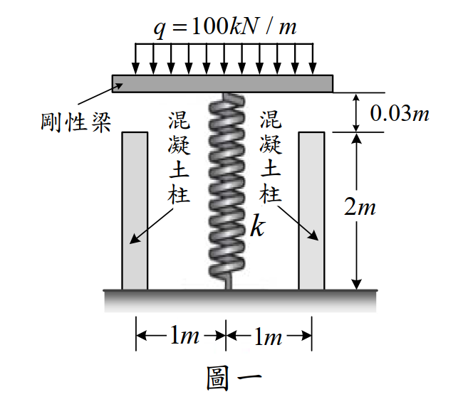

# 考題編號：MM-2018-1

**主分類：** `MM-U3-1` 軸力桿件變位及內力分析
**副分類：** `MM-U1-2` 虎克定律應用
**分析法：** 彈性分析
**標籤：** `靜不定軸力` `剛性梁` `混凝土柱` `彈簧並聯` `間隙問題` `變形諧和` `內力分配`

---

## 1. 原始題目重述 (Problem Restatement)

如圖一所示之結構，**剛性梁**由兩根混凝土柱及一個彈簧所支撐。

**未加均布載重前（初始狀態）：**
- 每根混凝土柱長度：$L = 2\ \text{m}$
- 每根混凝土柱截面積：$A = 500\ \text{mm}^2$
- 混凝土楊氏模數：$E = 10\ \text{GPa} = 10 \times 10^3\ \text{MPa}$
- 彈簧原長：$2.03\ \text{m}$（比柱子長 $0.03\ \text{m}$）
- 彈簧彈力常數：$k = 2\ \text{MN/m} = 2000\ \text{kN/m}$
- 剛性梁跨度：$2\ \text{m}$（柱子在兩端，彈簧在中間）
- 結構對稱：柱子位置各距中心 $1\ \text{m}$

**加載後：**
- 均布載重：$q = 100\ \text{kN/m}$（作用於剛性梁頂，總長 $2\ \text{m}$）
- 略去混凝土柱與剛性梁的自重

**求：** 施加 $q = 100\ \text{kN/m}$ 後，混凝土柱的內力 $F_c$ 及彈簧的縮短量 $\delta_s$。



*圖說：剛性梁水平架設在三個支點上，左右兩端各為一根混凝土柱（長 L = 2 m，截面積 A = 500 mm²，E = 10 GPa），中間為彈簧（原長 2.03 m，k = 2 MN/m）；彈簧比柱子長 0.03 m，加載前彈簧頂端距剛性梁底面 0.03 m 的間隙。均布載重 q = 100 kN/m 施加於剛性梁頂面全跨。*

---

## 2. 考題核心精神與出題者意圖 (Core Concepts & Examiner's Intent)

### 核心觀念
本題為**靜不定軸力系統**，涵蓋：
1. **間隙判斷**：加載前彈簧比柱子長 0.03 m，代表彈簧上端已頂住剛性梁底面，初始時彈簧已預壓縮 0.03 m（或等效為柱子比彈簧短 0.03 m，加載後兩者共同壓縮）

> ⚠ **關鍵判斷：初始幾何關係**
> - 柱子高 = 2 m（從地面到剛性梁底）
> - 彈簧原長 = 2.03 m，但安裝空間只有 2 m（柱子高度）
> - 因此彈簧**裝入時已被預壓縮 0.03 m**，彈簧初始就有預壓力
> - **或者**：彈簧的上端距剛性梁底面有 0.03 m 的間隙（依題意「彈簧的原來長度為 2.03 m」，而柱子 L = 2 m，代表彈簧在自然狀態比安裝空間長 0.03 m）

實際上，由圖一可見彈簧與剛性梁之間有 **0.03 m 的間距**（即彈簧頂端距剛性梁底有 0.03 m 的間隙），彈簧**尚未接觸**剛性梁。

因此：
- 加載前：彈簧不受力，只有柱子承受自重（題目說略去自重）
- 加載後：若剛性梁向下位移超過 0.03 m，彈簧才開始接觸並受壓

2. **分兩階段分析**：
   - **第一階段**：檢查剛性梁下移 0.03 m 時，柱子所需的力是否小於總載重
   - **第二階段**：若彈簧接觸，建立三元件（2 柱 + 1 簧）並聯靜不定系統

3. **靜不定解法**：平衡 + 變形諧和 + 虎克定律（三方程三未知）

### 出題者意圖
- 測驗「**間隙問題**」的處理：需先確認間隙是否閉合
- 測驗**剛性梁吊桿（軸力桿件並聯）**的靜不定分析
- 對稱結構的利用：兩柱對稱 → 每柱受力相同

---

## 3. 解題戰略地圖與陷阱分析 (Strategic Roadmap & Trap Analysis)

### 作戰計畫
```
Step 0：確認間隙：彈簧比安裝空間長 0.03 m → 初始有 0.03 m 間隙（彈簧未接觸剛性梁）
Step 1：計算總載重 Q = q × 梁跨 = 100 × 2 = 200 kN
Step 2：檢驗「只靠柱子支撐，梁下移 0.03 m」時所需的力
        若所需力 < Q，表示彈簧會被壓縮（間隙閉合）→ 進入 Step 3
Step 3：設剛性梁下移量為 δ（超過 0.03 m 後），建立諧和條件：
        柱縮短量 = δ（剛性梁剛性 → 各點下移相同）
        彈簧壓縮量 = δ - 0.03（彈簧先有 0.03 m 間隙才接觸）
Step 4：平衡方程：2Fc + Fs = Q = 200 kN
        （Fc = 每柱內力；Fs = 彈簧力）
Step 5：虎克定律：
        Fc = (AE/L) × δ（柱的勁度乘以縮短量）
        Fs = k × (δ - 0.03)（彈簧勁度乘以彈簧壓縮量）
Step 6：聯立解出 δ → 再求 Fc 和 Fs（= δs × k → δs = Fs/k）
```

### 關鍵陷阱

**陷阱 1：彈簧的間隙方向**
> 圖示「彈簧原長 2.03 m，安裝空間 2 m」→ 彈簧底部觸地，頂部距剛性梁底 0.03 m 間隙。
> 加載後剛性梁先下移 0.03 m 才接觸彈簧。
> **彈簧壓縮量 = 梁的下移量 δ - 0.03 m**（不是 δ）

**陷阱 2：兩柱的受力是每根 Fc，不是總柱力**
> 對稱結構：兩柱各受 $F_c$，彈簧受 $F_s$，平衡方程為 $2F_c + F_s = Q$

**陷阱 3：柱子軸向剛度的計算**
> $k_c = AE/L = (500 \times 10^{-6}\ \text{m}^2 \times 10 \times 10^9\ \text{Pa}) / 2\ \text{m} = 2.5 \times 10^6\ \text{N/m} = 2500\ \text{kN/m}$
> 注意單位換算。

**陷阱 4：是否需要驗算間隙是否閉合**
> 先算「只靠兩柱，梁下移 0.03 m」所需載重：$Q_0 = 2 \times k_c \times 0.03 = 2 \times 2500 \times 0.03 = 150\ \text{kN}$
> 實際載重 $Q = 200\ \text{kN} > 150\ \text{kN}$ → 間隙**確實閉合**，彈簧有效參與受力。

---

## 3.5 變數層次分析 (Variable Hierarchy Analysis)

> 複習提示：第一次解題後，在每個卡住的知識點旁標記 `⚠`；第二次複習時只看有 `⚠` 的項目。

### 最終目標
`求混凝土柱內力 Fc（每根）及彈簧縮短量 δs`

### 本題關鍵公式（依計算順序）

> $\boxed{\cdot}$ = 需由前步驟推導，非題目直接給定的變數

$$\text{Step 1: } Q = q \times 2 = 200\ \text{kN（總載重）}$$

$$\text{Step 2: } k_c = \frac{AE}{L}\text{（每柱軸向剛度）}$$

$$\text{Step 3: } Q_0 = 2\boxed{k_c} \times 0.03\text{（彈簧剛接觸前的臨界載重）}$$

$$\text{Step 4（平衡）: } 2F_c + F_s = Q$$

$$\text{Step 5（諧和）: } \frac{F_c}{\boxed{k_c}} = \delta,\quad \frac{F_s}{k} = \delta - 0.03$$

$$\text{Step 6（聯立）: } \Rightarrow F_c,\ F_s,\ \delta_s = \frac{F_s}{k}$$

### L1：題目直接給定

| 符號 | 數值 | 說明 |
|------|------|------|
| $q$ | $100\ \text{kN/m}$ | 均布載重強度 |
| $L_{\text{梁}}$ | $2\ \text{m}$ | 剛性梁跨度（q 作用範圍） |
| $L$ | $2\ \text{m}$ | 每根混凝土柱長度 |
| $A$ | $500\ \text{mm}^2 = 500 \times 10^{-6}\ \text{m}^2$ | 每柱截面積 |
| $E$ | $10\ \text{GPa} = 10^4\ \text{MPa}$ | 混凝土楊氏模數 |
| $\Delta_0$ | $0.03\ \text{m} = 30\ \text{mm}$ | 彈簧頂端與剛性梁底的初始間隙 |
| $k$ | $2\ \text{MN/m} = 2000\ \text{kN/m}$ | 彈簧彈力常數 |

### L2：需知識點推導

**Step 1：總載重與柱子軸向剛度**

| 符號 | 公式/來源 | 卡關? |
|------|----------|:-----:|
| $Q$ | $q \times 2\ \text{m} = 100 \times 2 = 200\ \text{kN}$ | |
| $k_c$ | $AE/L = (500 \times 10^{-6} \times 10 \times 10^9)/2 = 2.5 \times 10^6\ \text{N/m} = 2500\ \text{kN/m}$ | |

**Step 2：驗證間隙閉合**

| 符號 | 公式/來源 | 卡關? |
|------|----------|:-----:|
| $Q_0$ | $2k_c \times 0.03 = 2 \times 2500 \times 0.03 = 150\ \text{kN} < 200\ \text{kN}$ → 間隙閉合 | |

**Step 3：聯立求解（間隙閉合後）**

| 符號 | 公式/來源 | 卡關? |
|------|----------|:-----:|
| 平衡 | $2F_c + F_s = 200\ \text{kN}$ | |
| 諧和 | 柱縮短 $= \delta$；彈簧壓縮 $= \delta - 0.03\ \text{m}$，剛性梁下移 $\delta$ | |
| $F_c$ | $F_c = k_c \cdot \delta = 2500\delta$ | |
| $F_s$ | $F_s = k(\delta - 0.03) = 2000(\delta - 0.03)$ | |
| $\delta$ | 代入平衡式解出 | |
| $\delta_s$ | $\delta_s = F_s / k = \delta - 0.03$ | |

### L3：深層知識（不懂就卡住）

| 知識點 | 說明 | 卡關? |
|--------|------|:-----:|
| **間隙問題的兩段式分析** | 間隙閉合前與閉合後是兩種不同的靜力系統；必須先用臨界載重 $Q_0$ 判斷哪種情況適用 | |
| **剛性梁的幾何諧和** | 剛性梁不變形 → 梁上每一點下移量相同 = $\delta$；柱壓縮量 = $\delta$；彈簧壓縮量 = $\delta - \Delta_0$ | |
| **軸向剛度 $k_c = AE/L$** | 與彈簧剛度 $k$ 同一量綱（力/長度），可直接在諧和條件中並聯使用 | |

---

## 4. 步驟化詳細計算過程 (Step-by-Step Detailed Calculation)

### Step 1：計算結構參數

**總載重：**

$$Q = q \times L_{\text{梁}} = 100\ \text{kN/m} \times 2\ \text{m} = 200\ \text{kN}$$

**每根混凝土柱的軸向剛度：**

$$k_c = \frac{AE}{L} = \frac{500 \times 10^{-6}\ \text{m}^2 \times 10 \times 10^9\ \text{N/m}^2}{2\ \text{m}} = \frac{5 \times 10^6\ \text{N}}{2} = 2.5 \times 10^6\ \text{N/m}$$

$$k_c = 2500\ \text{kN/m}$$

---

### Step 2：判斷間隙是否閉合

若彈簧**尚未接觸**剛性梁，只有兩根柱子受力，剛性梁向下位移 $\delta$：

$$Q_{\text{only-columns}} = 2k_c \cdot \delta$$

彈簧剛開始接觸（$\delta = \Delta_0 = 0.03\ \text{m}$）時所需載重：

$$Q_0 = 2 \times 2500 \times 0.03 = 150\ \text{kN}$$

由於實際載重 $Q = 200\ \text{kN} > Q_0 = 150\ \text{kN}$，**間隙完全閉合，彈簧參與受力**。✓

---

### Step 3：建立靜不定方程組

設剛性梁最終向下位移量為 $\delta$（$\delta > 0.03\ \text{m}$）。

**變形關係（諧和條件）：**

$$\text{每柱壓縮量} = \delta$$

$$\text{彈簧壓縮量} = \delta_s = \delta - 0.03\ \text{m}$$

**虎克定律：**

$$F_c = k_c \cdot \delta = 2500\delta\ \text{(kN, 若 δ 以 m 為單位)}$$

$$F_s = k \cdot \delta_s = 2000(\delta - 0.03)\ \text{(kN)}$$

**平衡方程（垂直方向，向下為正）：**

$$2F_c + F_s = Q = 200\ \text{kN}$$

---

### Step 4：聯立求解

代入虎克定律到平衡方程：

$$2(2500\delta) + 2000(\delta - 0.03) = 200$$

$$5000\delta + 2000\delta - 60 = 200$$

$$7000\delta = 260$$

$$\delta = \frac{260}{7000} = \frac{13}{350}\ \text{m} \approx 0.03714\ \text{m}$$

**每柱內力：**

$$F_c = 2500 \times \frac{13}{350} = \frac{32500}{350} = \frac{650}{7} \approx 92.86\ \text{kN}$$

$$\boxed{F_c = \frac{650}{7} \approx 92.9\ \text{kN}\ \text{（壓力）}}$$

**彈簧壓縮量：**

$$\delta_s = \delta - 0.03 = \frac{13}{350} - \frac{10.5}{350} = \frac{2.5}{350} = \frac{1}{140}\ \text{m}$$

$$\boxed{\delta_s = \frac{1}{140}\ \text{m} \approx 7.14 \times 10^{-3}\ \text{m} = 7.14\ \text{mm}}$$

**驗算——彈簧力：**

$$F_s = k \cdot \delta_s = 2000 \times \frac{1}{140} = \frac{2000}{140} = \frac{100}{7} \approx 14.29\ \text{kN}$$

**驗算——平衡方程：**

$$2F_c + F_s = 2 \times \frac{650}{7} + \frac{100}{7} = \frac{1300 + 100}{7} = \frac{1400}{7} = 200\ \text{kN}\ ✓$$

---

### 📋 最終結果彙整

| 求解項目 | 精確結果 | 近似值 |
|---------|---------|--------|
| 剛性梁下移量 $\delta$ | $\dfrac{13}{350}\ \text{m}$ | $\approx 37.14\ \text{mm}$ |
| 每柱內力 $F_c$（壓力） | $\dfrac{650}{7}\ \text{kN}$ | $\approx 92.86\ \text{kN}$ |
| 彈簧縮短量 $\delta_s$ | $\dfrac{1}{140}\ \text{m}$ | $\approx 7.14\ \text{mm}$ |
| 彈簧受力 $F_s$ | $\dfrac{100}{7}\ \text{kN}$ | $\approx 14.29\ \text{kN}$ |

---

## 5. 關鍵爭議點與進階探討 (Critical Issues & Advanced Discussion)

### 5.1 「彈簧比柱子長 0.03 m」的幾何解讀

本題最容易讓人困惑的是：**彈簧原長 2.03 m，但安裝空間（柱高）只有 2 m**，代表什麼？

- **正確解讀**：彈簧底部觸地，頂部比剛性梁底面高出 0.03 m，若要將彈簧安裝在柱子旁邊且不頂住剛性梁，需要有 0.03 m 的間隙（即剛性梁下移 0.03 m 後才接觸彈簧）

- **另一解讀（本題採用）**：彈簧的原長為 2.03 m，而結構的安裝高度等於柱子長度 2 m。若彈簧底部固定在地面，頂端距剛性梁底 0.03 m，表示有 **0.03 m 的初始間隙**。

### 5.2 若彈簧比柱子「短」會如何？

若彈簧原長為 1.97 m（比柱子短 0.03 m），情況相反：
- 初始狀態：彈簧已被拉伸（但一般彈簧不能拉伸）或者彈簧底部距地面 0.03 m（間隙在下方）
- 此情形題意不同，不適用本題。

### 5.3 柱子應力驗算

$$\sigma_c = F_c / A = \frac{650/7 \times 10^3\ \text{N}}{500 \times 10^{-6}\ \text{m}^2} = \frac{650000/7}{500 \times 10^{-6}}\ \text{Pa} \approx 185.7\ \text{MPa}$$

混凝土抗壓強度通常 20–50 MPa，此題數值偏高（僅為教學示例），實際工程中柱子早已破壞。

### 5.4 對稱性的利用

本題結構完全對稱（彈簧在中央，兩柱等距），故：
- 兩柱受力相同（各 $F_c$）
- 剛性梁保持水平（無傾斜）
- 不需建立力矩平衡方程（自動滿足）

若結構**不對稱**，需另加力矩平衡方程。
