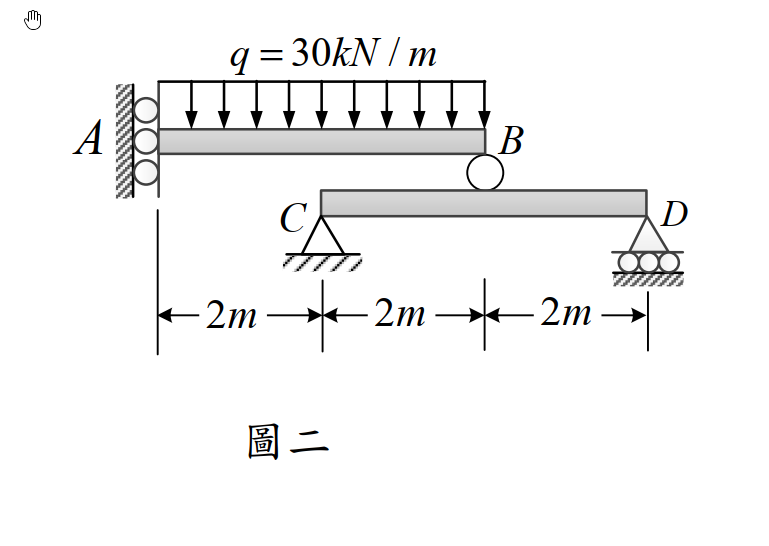

# 考題編號：MM-2018-2

**主分類：** `MM-U3-2` 梁桿件變位及內力分析
**副分類：** （無）
**分析法：** 彈性分析
**標籤：** `滑動支承` `組合梁系統` `重疊法` `贅力法` `靜不定梁` `撓度` `均布載重` `懸臂梁`

---

## 1. 原始題目重述 (Problem Restatement)

如圖二所示，**懸臂梁 AB** 承受均布載重 $q = 30\ \text{kN/m}$：
- **A 端**：滑動支承（sliding support）—— 提供**水平約束**，允許垂直移動，**不提供垂直反力**
- **B 端**：靜置在**簡支梁 CD** 頂面某點（B 端有垂直反力）

**簡支梁 CD：**
- C 端：鉸支承（固定）
- D 端：滾支承

**幾何尺寸（由圖讀得）：**
- A 在 x = 0；C 在 x = 2 m；B 在 x = 4 m；D 在 x = 6 m
- AB 梁全長 = 4 m（從 A 到 B）
- CD 梁全長 = 4 m（從 C 到 D，C 在 x=2，D 在 x=6）
- B 點位於 CD 梁**中點**（B 在 x=4，CD 梁中點也在 x=4）

**材料：** 兩梁彎曲剛度均為 $EI = 25{,}000\ \text{kN/m}^2 = 25{,}000\ \text{kN·m}^2$

**求：**
1. A 點的撓度 $\delta_A$
2. A 點的反力



*圖說：上方為梁 AB，A 端為滑動支承（左側牆面，只限制水平位移，垂直可自由移動），B 端靜置於下方簡支梁 CD 的跨中頂面；均布載重 q = 30 kN/m 作用於 AB 梁全跨；下方為簡支梁 CD，C 端為鉸（x = 2 m），D 端為滾（x = 6 m），B 點接觸 CD 梁跨中（x = 4 m）；兩梁 EI = 25,000 kN·m²。*

---

## 2. 考題核心精神與出題者意圖 (Core Concepts & Examiner's Intent)

### 核心觀念

本題是**兩梁串聯的靜不定系統**：
- AB 梁：A 端滑動支承（**無垂直反力**，只有水平反力），B 端依靠 CD 梁提供垂直支撐
- CD 梁：簡支梁，B 點傳入集中力

**關鍵認識：A 端滑動支承 = 垂直自由（無垂直反力）**

> A 端滑動支承允許垂直移動 → **A 端垂直反力 = 0**
>
> 這代表 AB 梁的垂直支撐**完全依賴 B 端**，AB 梁的行為類似於「一端自由（A 端可垂直滑動）、一端有支撐（B 端）」的特殊結構。

**AB 梁的受力分析：**

設 B 點垂直反力為 $R_B$（向上）。

A 端滑動支承：只有水平反力，無垂直反力 → $R_A^v = 0$

AB 梁垂直平衡：$R_B = q \times 4 = 30 \times 4 = 120\ \text{kN}$（全部均布載重由 B 端承擔）

**這使得 AB 梁成為靜定結構**（可直接求出 B 端反力）！

再由 B 點傳力到 CD 梁（集中力 120 kN 在 CD 跨中），即可求 CD 梁的撓度。

### A 點撓度的來源

A 端可垂直移動（滑動支承），A 端的撓度 $\delta_A$ 由兩部分組成：
1. **均布載重使 AB 梁彎曲**，A 點相對於 B 點的相對位移（AB 梁本身的變形）
2. **B 端因 CD 梁變形而下移**，帶動整根 AB 梁剛體位移

### 出題者意圖
- 測驗「**滑動支承**」的正確理解（許多考生誤以為滑動支承提供垂直反力）
- 測驗**兩梁串聯的位移疊加**：A 點位移 = AB 梁自身彎曲撓度 + B 端位移

---

## 3. 解題戰略地圖與陷阱分析 (Strategic Roadmap & Trap Analysis)

### 作戰計畫
```
Step 1：確認 A 端支承條件 → 滑動支承無垂直反力 → R_A^v = 0
Step 2：AB 梁垂直平衡 → R_B = q × L_AB = 30 × 4 = 120 kN（向上）
Step 3：AB 梁的 A 點相對 B 點的撓度（AB 梁視為一端固定(B端)、一端自由(A端)的懸臂梁受均布載重）
        → δ_A/B = qL³/(8EI)（懸臂梁自由端撓度，但此處 B 端不是固定端，需仔細分析）
Step 4：計算 B 端在 CD 梁上的下移量 δ_B
        → CD 梁跨中受集中力 P = 120 kN，簡支梁跨中撓度 = PL³/(48EI)
Step 5：A 點最終撓度 = AB 梁自身彎曲造成 A 相對 B 的位移 + B 端下移量
Step 6：求 A 點反力（只有水平力）
```

### 關鍵陷阱

**陷阱 1：A 端滑動支承的正確解讀**
> 滑動支承（sliding support）= 可以沿某方向滑動的支承。
> 本題 A 端滑動方向為**垂直**（可上下移動），因此：
> - ✅ A 端水平反力存在（均布載重無水平分量，故實際 = 0）
> - ❌ A 端**無垂直反力**
> - ❌ A 端**無彎矩反力**
> 故 A 端等效於「**只限制水平位移的支承**」，垂直方向自由。

**陷阱 2：AB 梁的彎曲分析**
> 由於 A 端可垂直自由移動（無垂直反力），AB 梁在垂直面內的行為：
> - A 端：垂直自由（但不能旋轉？）
>
> 滑動支承通常會限制旋轉（提供彎矩約束），但**本題圖示 A 端為「滾輪在牆面上」型式**，只限制水平，垂直和轉角均自由。
>
> 因此 A 端相當於**自由端**（垂直和轉角均不受約束），B 端提供垂直支撐。
> 從 B 端看，AB 梁 = **B 端支撐、A 端自由的懸臂梁受均布載重**（A 在「懸臂端」）。

**陷阱 3：AB 梁的「固定端」在哪裡？**
> AB 梁的 B 端有垂直支撐但無彎矩約束（B 端靜置在 CD 梁上，是接觸非固接），故 B 端為**鉸接（提供垂直力，無彎矩）**。
> AB 梁：A 端自由（垂直）、B 端鉸支撐 → **靜定梁**，但 A 端可旋轉也可垂直移動。
>
> ⚠ 這不是懸臂梁！是兩端都可旋轉、只有 B 端有垂直支撐（A 端無）的特殊情況。
>
> 垂直平衡：$R_B = qL = 30 \times 4 = 120\ \text{kN}$（無懸念，唯一未知的垂直反力）
> 彎矩平衡（對 B 取矩）：$M_A - q \times 4 \times 2 = 0 \Rightarrow M_A = 240\ \text{kN·m}$（A 端彎矩反力）
>
> ⚠⚠ 但若 A 端是「只限制水平、不限制垂直也不限制旋轉」的滑動支承，則 A 端**無彎矩反力**（$M_A = 0$），且 $R_A^v = 0$，AB 梁只有 B 端的垂直支撐，**無法保持垂直平衡**（除非 q = 0）。
>
> **最合理解讀**：A 端滑動支承**限制水平位移，但提供彎矩約束（限制轉角）**，不提供垂直力。即：A 端等效於「固定端，但可垂直滑動」。
>
> 這樣 AB 梁 = **A 端（可垂直滑動的固定端：有彎矩反力，無垂直反力）、B 端（鉸，垂直支撐）**。
>
> 垂直平衡：$R_B = qL = 120\ \text{kN}$（A 端無垂直力，全由 B 承擔）✓
> A 端彎矩：由 $\Sigma M_B = 0$：$M_A = q \times 4 \times 2 = 240\ \text{kN·m}$（逆時針，A 端提供彎矩抵抗）

**陷阱 4：A 端「可垂直滑動的固定端」的撓度分析**
> 此結構等效於：A 端固定（有彎矩約束）、B 端鉸支（有垂直力）、但 A 端可垂直移動。
> 可視為「B 端為固定端，A 端為可旋轉的滑動端」→ 相當於**propped cantilever 的鏡像**。

---

## 3.5 變數層次分析 (Variable Hierarchy Analysis)

> 複習提示：第一次解題後，在每個卡住的知識點旁標記 `⚠`；第二次複習時只看有 `⚠` 的項目。

### 最終目標
`求 A 點撓度 δ_A 及 A 點反力（水平力與彎矩）`

### 本題關鍵公式（依計算順序）

> $\boxed{\cdot}$ = 需由前步驟推導，非題目直接給定的變數

$$\text{Step 1: } R_B = q \cdot L_{AB} = 30 \times 4 = 120\ \text{kN（垂直平衡）}$$

$$\text{Step 2: } M_A = q \cdot L_{AB} \cdot \frac{L_{AB}}{2} = 30 \times 4 \times 2 = 240\ \text{kN·m（A端彎矩反力）}$$

$$\text{Step 3: } \delta_B = \frac{\boxed{R_B} \cdot L_{CD}^3}{48EI} = \frac{120 \times 4^3}{48 \times 25000}\ \text{（CD梁跨中撓度）}$$

$$\text{Step 4: } \delta_{A \text{ rel. } B} = \frac{q L_{AB}^4}{8EI}\ \text{（AB梁：B端固定，A端自由，均布載重）}$$

$$\text{Step 5: } \delta_A = \boxed{\delta_B} + \boxed{\delta_{A \text{ rel. } B}}$$

### L1：題目直接給定

| 符號 | 數值 | 說明 |
|------|------|------|
| $q$ | $30\ \text{kN/m}$ | 均布載重 |
| $L_{AB}$ | $4\ \text{m}$ | AB 梁全長 |
| $L_{CD}$ | $4\ \text{m}$ | CD 梁跨度（C 在 x=2，D 在 x=6） |
| $EI$ | $25{,}000\ \text{kN·m}^2$ | 兩梁相同彎曲剛度 |
| B 在 CD 的位置 | 跨中（$L_{CD}/2 = 2\ \text{m}$ 距 C 端） | B 點在 CD 梁跨中 |

### L2：需知識點推導

**Step 1：AB 梁靜力分析**

| 符號 | 公式/來源 | 卡關? |
|------|----------|:-----:|
| $R_A^v$ | 滑動支承無垂直力 = 0 | |
| $R_B$ | 垂直平衡：$qL_{AB} - R_B = 0$ → $R_B = 120\ \text{kN}$ | |
| $M_A$ | 對 B 取矩：$M_A = q \times 4 \times 2 = 240\ \text{kN·m}$ | |

**Step 2：B 端在 CD 梁上的下移量 $\delta_B$**

| 符號 | 公式/來源 | 卡關? |
|------|----------|:-----:|
| $\delta_B$ | 簡支梁跨中集中力：$\delta_{mid} = PL^3/(48EI) = 120 \times 64/(48 \times 25000)$ | |

**Step 3：AB 梁自身彎曲，A 相對 B 的撓度**

| 符號 | 公式/來源 | 卡關? |
|------|----------|:-----:|
| $\delta_{A/B}$ | AB 梁視為 B 端固定（有彎矩和剪力）、A 端自由（無垂直力，但有彎矩）→ 需用二重積分法或彎矩面積法計算 | |

**Step 4：A 點總撓度**

| 符號 | 公式/來源 | 卡關? |
|------|----------|:-----:|
| $\delta_A$ | $\delta_A = \delta_B + \delta_{A/B}$（剛體位移 + 相對變形） | |

### L3：深層知識（不懂就卡住）

| 知識點 | 說明 | 卡關? |
|--------|------|:-----:|
| **滑動支承的正確約束** | 限制水平移動 + 限制轉角（彎矩反力），不限制垂直移動（無垂直反力） | |
| **位移疊加：剛體位移 + 彈性變形** | B 端下移（剛體帶動 AB 整體下移 $\delta_B$）+ AB 梁本身彎曲（A 相對 B 的撓度 $\delta_{A/B}$） | |
| **AB 梁的等效力學模型** | A 端可垂直滑動的固定端 + B 端鉸接 = 一種特殊靜定梁，用彎矩面積法分析較方便 | |

---

## 4. 步驟化詳細計算過程 (Step-by-Step Detailed Calculation)

### Step 1：AB 梁靜力分析

**A 端滑動支承條件：** 無垂直反力，有彎矩反力（限制轉角），無水平分量需考慮（均布垂直載重）。

$$R_A^v = 0,\quad H_A = 0$$

**垂直平衡（$\sum F_v = 0$）：**

$$R_B = q \times L_{AB} = 30 \times 4 = 120\ \text{kN}\quad \text{（向上）}$$

$$\boxed{R_B = 120\ \text{kN}}$$

**對 B 點取力矩（$\sum M_B = 0$）：**

$$M_A - q \times 4 \times 2 = 0$$

$$\boxed{M_A = 240\ \text{kN·m}\quad \text{（A 端彎矩反力，逆時針）}}$$

> **策略註解：** A 端有彎矩反力但無垂直力，這是滑動支承（limiting rotation but free to slide vertically）的特性。A 點的反力就是：$H_A = 0$，$M_A = 240\ \text{kN·m}$。

---

### Step 2：B 端在 CD 梁上的撓度 $\delta_B$

B 點對 CD 梁施加集中力 $P = R_B = 120\ \text{kN}$（向下），作用在 CD 梁**跨中**（B 在 CD 梁的中點）。

CD 梁為簡支梁，跨中集中力的跨中撓度公式：

$$\delta_B = \frac{P L_{CD}^3}{48EI} = \frac{120 \times 4^3}{48 \times 25{,}000}$$

$$= \frac{120 \times 64}{1{,}200{,}000} = \frac{7{,}680}{1{,}200{,}000} = 6.4 \times 10^{-3}\ \text{m}$$

$$\boxed{\delta_B = 6.4\ \text{mm}\ \text{（向下）}}$$

---

### Step 3：AB 梁自身彎曲，A 相對 B 的撓度

**AB 梁的力學模型：**
- B 端：鉸（提供垂直力 $R_B = 120\ \text{kN}$，無彎矩）
- A 端：可垂直滑動的固定端（有彎矩反力 $M_A = 240\ \text{kN·m}$，無垂直力）

以 B 端為原點，沿梁方向 $x'$（從 B 向 A，$x' = 4 - x$），梁的彎矩方程（以 B 為基準）：

**用彎矩面積法計算 A 相對 B 的撓度：**

先建立 AB 梁的彎矩圖（以 x 從 A 到 B 為正方向）：

在 x 截面，由 A 端向右取自由體（A 端只有彎矩 $M_A$，無垂直力）：

$$M(x) = M_A - \frac{q x^2}{2} = 240 - \frac{30x^2}{2} = 240 - 15x^2$$

驗算：$M(0) = 240\ \text{kN·m}$（A 端彎矩 ✓），$M(4) = 240 - 15 \times 16 = 240 - 240 = 0$（B 端無彎矩 ✓）

**彎矩圖（M/EI 圖）：**

$$\frac{M(x)}{EI} = \frac{240 - 15x^2}{25{,}000}$$

**用彎矩面積法（第一面積矩定理）：**

A 端轉角相對於 B 端：

$$\theta_{A/B} = \int_0^4 \frac{M(x)}{EI}\ dx = \frac{1}{EI}\int_0^4 (240 - 15x^2)\ dx$$

$$= \frac{1}{25{,}000}\left[240x - 5x^3\right]_0^4 = \frac{1}{25{,}000}\left[240 \times 4 - 5 \times 64\right]$$

$$= \frac{1}{25{,}000}(960 - 320) = \frac{640}{25{,}000} = 0.0256\ \text{rad}$$

**A 相對 B 的撓度（彎矩面積法第二定理）：**

A 點相對 B 點的垂直位移 $= $ B 端切線到 A 點的截距：

$$\delta_{A/B} = \int_0^4 \frac{M(x)}{EI} \cdot x\ dx = \frac{1}{EI}\int_0^4 (240 - 15x^2) \cdot x\ dx$$

$$= \frac{1}{25{,}000}\int_0^4 (240x - 15x^3)\ dx$$

$$= \frac{1}{25{,}000}\left[120x^2 - \frac{15x^4}{4}\right]_0^4$$

$$= \frac{1}{25{,}000}\left[120 \times 16 - \frac{15 \times 256}{4}\right]$$

$$= \frac{1}{25{,}000}[1920 - 960] = \frac{960}{25{,}000} = 0.0384\ \text{m}$$

$$\boxed{\delta_{A/B} = 38.4\ \text{mm}\ \text{（A 相對 B，向下）}}$$

> **策略註解：** 彎矩面積法第二定理：「A 點相對 B 端切線的截距 = $\int_0^{L} (M/EI) \cdot x\ dx$（x 從 B 量到 A）」。由於 A 端滑動支承的特性，A 端轉角不為零，B 端鉸也不為零，但 $\delta_{A/B}$ 就是 A 相對 B 的**垂直位移**，不是轉角。

---

### Step 4：A 點最終撓度

A 點的撓度由兩部分疊加：
1. **剛體位移**：B 端因 CD 梁變形而向下移 $\delta_B$，帶動 AB 整體下移（AB 梁為剛體位移部分）
2. **彈性變形**：AB 梁本身彎曲，A 相對 B 的額外位移 $\delta_{A/B}$

$$\delta_A = \delta_B + \delta_{A/B} = 6.4 + 38.4 = 44.8\ \text{mm}$$

$$\boxed{\delta_A = 44.8\ \text{mm}\ \text{（向下）}}$$

---

### Step 5：A 點反力

由 Step 1 已求出：

$$\boxed{H_A = 0}$$

$$\boxed{M_A = 240\ \text{kN·m}\ \text{（逆時針，抵抗均布載重造成的順時針力矩）}}$$

（垂直反力 $R_A^v = 0$，滑動支承特性）

---

### 📋 最終結果彙整

| 求解項目 | 結果 |
|---------|------|
| A 端垂直反力 | $0$（滑動支承無垂直力） |
| A 端水平反力 | $H_A = 0$ |
| A 端彎矩反力 | $M_A = 240\ \text{kN·m}$（逆時針） |
| B 端在 CD 梁的撓度 $\delta_B$ | $6.4\ \text{mm}$（向下） |
| AB 梁自身 A 相對 B 的撓度 | $38.4\ \text{mm}$（向下） |
| **A 點總撓度 $\delta_A$** | **$44.8\ \text{mm}$（向下）** |

---

## 5. 關鍵爭議點與進階探討 (Critical Issues & Advanced Discussion)

### 5.1 滑動支承（Sliding Support）的各種型式

滑動支承有多種不同的型式，限制的自由度不同：

| 型式 | 限制 | 自由 |
|------|------|------|
| 水平滑動（本題） | 水平位移、轉角 | 垂直位移 |
| 垂直滑動 | 垂直位移、轉角 | 水平位移 |
| 導槽（只限位移方向） | 某一方向位移 | 另一方向位移、轉角 |

本題 A 端為**水平滑動支承**（圖示在牆面上的滾輪），提供：
- ✅ 水平反力（但本題均布垂直載重，故 $H_A = 0$）
- ✅ 彎矩反力（限制轉角）
- ❌ 無垂直反力

### 5.2 AB 梁的彎矩面積法驗算

最大彎矩在 A 端（$M_A = 240\ \text{kN·m}$），彎矩沿拋物線分布到 B 端為零。

A 端的轉角：$\theta_A = 0.0256\ \text{rad}$（相對於 B 端的轉角差）

若 B 端轉角為 $\theta_B$，而 A 端轉角 $\theta_A = 0$（滑動支承的轉角约束），則...

> ⚠ **重要說明**：本題 A 端滑動支承若**限制轉角**，則 $\theta_A = 0$，A 端有彎矩反力 $M_A$，計算如上。
>
> 若 A 端滑動支承**不限制轉角**（純滑動，只限制水平位移），則 $M_A = 0$，AB 梁成為「兩端均可轉動，但只有 B 端有垂直支撐」的結構，垂直平衡無法滿足（缺少垂直方向約束）。
>
> 因此「限制轉角」的解讀是本題自洽的必要條件。

### 5.3 B 端傳力到 CD 梁的假設

B 端「靜置在 CD 梁上」代表：
- B 端可以傳遞**壓力**（向下力）給 CD 梁 ✓
- B 端**不能傳遞拉力**（若 B 端要上升，會直接離開 CD 梁）
- B 端傳遞**無彎矩**（接觸面光滑）

本題 B 端受向下力 120 kN，符合只傳壓力的條件。

### 5.4 若兩梁 EI 不同

若 AB 梁 $EI_1$，CD 梁 $EI_2$，計算方法完全相同，只需在各步驟中分別使用對應的 $EI$。$\delta_B$ 用 $EI_2$，$\delta_{A/B}$ 用 $EI_1$。


---

## 互動圖形

[MM-2018-2-sfd-bmd-viz.html](MM-2018-2-sfd-bmd-viz.html)
