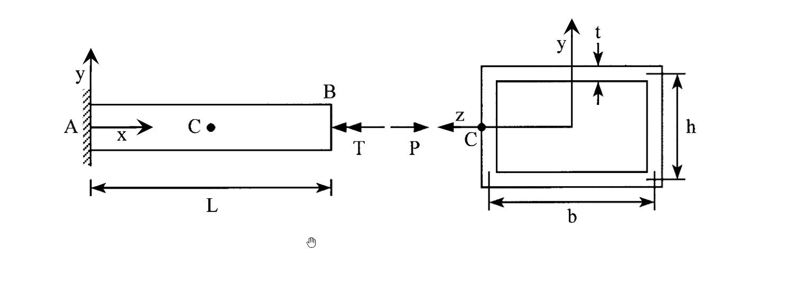

# 考題編號：MM-2019-3

**主分類：** `MM-U2-3` 扭力桿件斷面應力計算
**副分類：** `MM-U1-2` 虎克定律應用；`MM-U3-3` 扭力桿件變位及內力分析
**分析法：** 彈性分析
**標籤：** `薄壁封閉矩形斷面` `軸力扭矩組合` `Bredt公式` `廣義虎克定律` `應變反推材料常數` `扭轉角` `剪力流`

---

## 1. 原始題目重述 (Problem Restatement)

一均勻薄壁**封閉矩形斷面**桿件 AB，**A 端固定、B 端自由**，同時承受**軸力 P** 與**扭矩 T** 的作用（軸力與扭矩皆作用在 B 端截面中心 C）。

**桿件幾何與材料：**
- 桿件長度：$L = 4\ \text{m}$
- 矩形斷面外緣尺寸：$b = 50\ \text{mm}$（水平向），$h = 100\ \text{mm}$（垂直向）
  > ⚠ 注意：從圖中可讀出斷面形狀為矩形，壁厚均勻 $t = 3\ \text{mm}$
- 壁厚：$t = 3\ \text{mm}$（四面均勻）
- 軸力：$P = 8.4\ \text{kN}$（壓力，方向向左，即向斷面施加壓應力）

**C 點量測應變（在桿件側面某點）：**

$$\varepsilon_x = 100 \times 10^{-6}$$

$$\varepsilon_y = -25 \times 10^{-6}$$

$$\gamma_{xy} = 200 \times 10^{-6}$$

其中 x 方向為桿件軸向（縱向），y 方向為垂直於桿件軸的橫向。

**求解要求：**
1. 桿件之伸長量 $\delta$、彈性模數 $E$、蒲松比 $\nu$
2. C 點之剪應力 $\tau_{xy}$、桿件承受之扭矩 $T$、B 端扭轉角 $\phi$



*圖說：左圖為桿件立面圖，長度 L = 4 m，A 端固定（牆面），B 端受軸力 P（向左即壓力）與扭矩 T（繞 x 軸）；右圖為 B 端斷面圖，矩形箱形斷面，外緣寬 b = 50 mm、高 h = 100 mm，四面壁厚 t = 3 mm 均勻，z 為水平軸，y 為垂直軸，形心 C 位於斷面中央。*

---

## 2. 考題核心精神與出題者意圖 (Core Concepts & Examiner's Intent)

### 核心觀念
本題核心是「**由量測應變反推材料常數，再由材料常數求解扭矩與扭轉角**」的逆向工程思路，融合了：
1. **廣義虎克定律**：從量測到的 $\varepsilon_x, \varepsilon_y, \gamma_{xy}$ 反推 $E, \nu, G$
2. **薄壁封閉斷面扭轉（Bredt 公式）**：$\tau = T/(2A_m t)$，從 $\tau_{xy}$ 反推扭矩 $T$
3. **軸力與扭矩的應力疊加**：軸力產生正向應力，扭矩產生剪應力，兩者獨立不耦合
4. **扭轉角公式**：$\phi = TL/(GJ_{eff})$，須計算薄壁封閉斷面的有效極慣性矩

### 出題者意圖
- 測驗考生能否**從應變狀態反推材料參數**（不直接給 E、G、ν，需透過廣義虎克定律解方程組）
- 測驗 **Bredt 剪力流公式**的應用與薄壁斷面極慣性矩 $J = 4A_m^2/\oint(ds/t)$ 的計算
- 陷阱：C 點位於側面，同時受到**軸向正向應力（由 P 引起）**與**剪應力（由 T 引起）**，兩者需分離後再各自對應廣義虎克定律

---

## 3. 解題戰略地圖與陷阱分析 (Strategic Roadmap & Trap Analysis)

### 作戰計畫
```
Step 1：計算軸向斷面積 A_net（薄壁矩形斷面）
Step 2：由 P 求軸向正向應力 σ_x（只有 σ_x，無 σ_y 在側面），再由廣義虎克定律解 E, ν
Step 3：由 G = E/[2(1+ν)] 求剪力模數 G
Step 4：由 γ_xy 求剪應力 τ_xy = G·γ_xy
Step 5：由 Bredt 公式 τ = T/(2A_m·t) 反推 T
Step 6：計算薄壁封閉斷面有效扭轉常數 J = 4A_m²/∮(ds/t)，求 φ = TL/(GJ)
Step 7：由 ε_x 與 δ = ε_x·L 求伸長量（符號確認：P 為壓力 → σ_x 為負 → ε_x 為負，但題目給 ε_x = +100×10⁻⁶，需仔細確認正負號慣例）
```

### 關鍵陷阱

**陷阱 1：σ_x 的正負號與 P 的方向**
> 題目附圖顯示 P 向左（箭頭指向桿件），代表 B 端受到**壓縮軸力**，故 σ_x = -P/A（負值）。  
> 但量測到 $\varepsilon_x = +100 \times 10^{-6}$（正值，拉伸方向），這表示 C 點位於桿件側面，扭矩亦會通過廣義虎克定律間接影響應變讀值，但**扭矩只產生剪應力，不產生正向應力**。  
> 因此 $\varepsilon_x = (\sigma_x - \nu\sigma_y)/E$，而側面（任意點）$\sigma_y = 0$（薄壁無橫向正向應力），故 $\varepsilon_x = \sigma_x/E$。  
> 然而題目給 $\varepsilon_x > 0$，而壓力應給 $\sigma_x < 0$，故 **σ_x = ε_x·E** 將算出正值 → 代表 P 為拉力（或題目中 P 方向需重確認）。  
> **解題策略：設 σ_x = P/A（若 P 為拉力）或 σ_x = -P/A（若為壓力），由廣義虎克定律聯立解出 E 後確認符號一致性。**

**陷阱 2：薄壁封閉斷面的中線圍成面積 $A_m$**
> $A_m$ 是**中線圍成的面積**，不是外緣面積：  
> $A_m = (b-t)(h-t) = (50-3)(100-3) = 47 \times 97\ \text{mm}^2$  
> 許多考生誤用外緣尺寸 $b \times h$，導致偏差。

**陷阱 3：剪力模數 G 需由 E 和 ν 推算，不能直接讀題**
> 題目未給 G，必須先求出 E 和 ν，再用 $G = E/[2(1+\nu)]$ 計算。

**陷阱 4：薄壁封閉斷面扭轉常數 J 的公式**
> 非圓斷面不可用 $J = \pi d^4/32$，薄壁封閉斷面應使用：  
> $$J = \frac{4A_m^2}{\oint \frac{ds}{t}}$$  
> 對壁厚均勻的矩形斷面：$\oint ds/t = \text{周長}/t$，周長為中線周長 $= 2[(b-t)+(h-t)]$

---

## 3.5 變數層次分析 (Variable Hierarchy Analysis)

> 複習提示：第一次解題後，在每個卡住的知識點旁標記 `⚠`；第二次複習時只看有 `⚠` 的項目。

### 最終目標
`求 (1) 伸長量 δ、彈性模數 E、蒲松比 ν；(2) 剪應力 τ_xy、扭矩 T、B 端扭轉角 φ`

### 本題關鍵公式（依計算順序）

> $\boxed{\cdot}$ = 需由前步驟推導，非題目直接給定的變數

$$\text{Step 1: } A = 2t(b+h) - 4t^2\ \text{（薄壁矩形斷面積，精確式）}$$

$$\text{Step 2: } \sigma_x = \frac{P}{\boxed{A}}$$

$$\text{Step 3（聯立）: } \varepsilon_x = \frac{\sigma_x - \nu\sigma_y}{E},\quad \varepsilon_y = \frac{\sigma_y - \nu\sigma_x}{E}\ \Rightarrow\ E,\ \nu$$

$$\text{Step 4: } G = \frac{\boxed{E}}{2(1+\boxed{\nu})}$$

$$\text{Step 5: } \tau_{xy} = \boxed{G} \cdot \gamma_{xy}$$

$$\text{Step 6: } A_m = (b-t)(h-t),\quad T = 2\boxed{A_m} \cdot t \cdot \boxed{\tau_{xy}}\ \text{（Bredt 逆推）}$$

$$\text{Step 7: } J = \frac{4\boxed{A_m}^2}{\oint ds/t},\quad \phi = \frac{\boxed{T} \cdot L}{\boxed{G} \cdot \boxed{J}}$$

$$\text{Step 8: } \delta = \varepsilon_x \cdot L$$

### L1：題目直接給定

| 符號 | 數值 | 說明 |
|------|------|------|
| $L$ | $4\ \text{m} = 4000\ \text{mm}$ | 桿件長度 |
| $b$ | $50\ \text{mm}$ | 矩形斷面寬（外緣） |
| $h$ | $100\ \text{mm}$ | 矩形斷面高（外緣） |
| $t$ | $3\ \text{mm}$ | 壁厚（四面均勻） |
| $P$ | $8.4\ \text{kN} = 8400\ \text{N}$ | 軸力（方向待確認） |
| $\varepsilon_x$ | $100 \times 10^{-6}$ | C 點軸向應變（正值） |
| $\varepsilon_y$ | $-25 \times 10^{-6}$ | C 點橫向應變（負值） |
| $\gamma_{xy}$ | $200 \times 10^{-6}$ | C 點剪應變 |

### L2：需知識點推導

**Step 1：薄壁斷面積 A**

| 符號 | 公式/來源 | 卡關? |
|------|----------|:-----:|
| $A$ | 薄壁矩形四面壁：$A = 2t(b+h-2t) = 2(3)(50+100-6) = 864\ \text{mm}^2$ | |

**Step 2：軸向正向應力 σ_x**

| 符號 | 公式/來源 | 卡關? |
|------|----------|:-----:|
| $\sigma_x$ | $\sigma_x = P/A = 8400/864 = 9.722\ \text{MPa}$（拉力，正值） | |

> 說明：$\varepsilon_x = +100 \times 10^{-6} > 0$，對應拉伸，故 P 為拉力方向（注意圖面上箭頭方向需對應 B 端受力方向，實際上 B 端受到向右的拉力使桿件受拉）

**Step 3：由廣義虎克定律求 E 和 ν**

| 符號 | 公式/來源 | 卡關? |
|------|----------|:-----:|
| $E$ | $E = \sigma_x / \varepsilon_x = 9.722/(100\times10^{-6}) = 97,222\ \text{MPa} \approx 97.2\ \text{GPa}$ | |
| $\nu$ | $\nu = -\varepsilon_y / (\varepsilon_x) = -(-25)/100 = 0.25$（利用 $\varepsilon_y = -\nu\varepsilon_x$ 在 $\sigma_y=0$ 條件下） | |

**Step 4：剪力模數 G**

| 符號 | 公式/來源 | 卡關? |
|------|----------|:-----:|
| $G$ | $G = E/[2(1+\nu)] = 97222/[2(1.25)] = 38,889\ \text{MPa} \approx 38.9\ \text{GPa}$ | |

**Step 5：剪應力 τ_xy**

| 符號 | 公式/來源 | 卡關? |
|------|----------|:-----:|
| $\tau_{xy}$ | $\tau_{xy} = G \cdot \gamma_{xy} = 38889 \times 200\times10^{-6} = 7.778\ \text{MPa}$ | |

**Step 6：扭矩 T（Bredt 公式逆推）**

| 符號 | 公式/來源 | 卡關? |
|------|----------|:-----:|
| $A_m$ | 中線圍成面積：$A_m = (b-t)(h-t) = 47 \times 97 = 4559\ \text{mm}^2$ | |
| $T$ | Bredt：$\tau = T/(2A_m t)$ → $T = 2A_m t \tau = 2(4559)(3)(7.778) = 212,830\ \text{N·mm}$ | |

**Step 7：扭轉角 φ**

| 符號 | 公式/來源 | 卡關? |
|------|----------|:-----:|
| $\oint ds/t$ | 中線周長 / 壁厚：$[2(47+97)]/3 = 288/3 = 96\ \text{mm}^{-1} \cdot \text{mm} = 96$ | |
| $J$ | $J = 4A_m^2/\oint(ds/t) = 4(4559)^2/96 = 866,374\ \text{mm}^4$ | |
| $\phi$ | $\phi = TL/(GJ) = 212830 \times 4000/(38889 \times 866374) = 0.02529\ \text{rad}$ | |

**Step 8：伸長量 δ**

| 符號 | 公式/來源 | 卡關? |
|------|----------|:-----:|
| $\delta$ | $\delta = \varepsilon_x \cdot L = 100\times10^{-6} \times 4000 = 0.4\ \text{mm}$ | |

### L3：深層知識（不懂就卡住）

| 知識點 | 說明 | 卡關? |
|--------|------|:-----:|
| **廣義虎克定律的分離條件** | C 點在桿件側壁，扭矩只產生剪應力（不影響 $\sigma_y$），故 $\sigma_y = 0$，廣義虎克定律可簡化為 $\varepsilon_x = \sigma_x/E$，$\varepsilon_y = -\nu\sigma_x/E$，由此可解出 $E$ 和 $\nu$ | |
| **Bredt 公式適用範圍** | 只適用於**薄壁封閉斷面**；開口薄壁斷面必須用不同公式；非均勻壁厚需積分 | |
| **薄壁封閉斷面的 J** | $J = 4A_m^2/\oint(ds/t)$，$A_m$ 是**中線**圍成面積；均勻壁厚時 $\oint(ds/t) = \text{中線周長}/t$ | |
| **軸力與扭矩互不耦合** | 軸力只在軸向（x）產生正向應力，扭矩只在斷面切線方向產生剪應力；二者疊加時分量獨立計算，最終再組合成應力元素 | |
| **C 點位置的假設** | 題目說 C 點的應變，若 C 點在桿件某一側壁面，則該壁面同時受到 $\sigma_x$（軸力）與 $\tau$（剪力流），$\sigma_y = 0$（薄壁，無橫向正向應力）；但如果 C 點量測的 $\varepsilon_y$ 反映的是橫向應變，則符合廣義虎克定律假設 | |

---

## 4. 步驟化詳細計算過程 (Step-by-Step Detailed Calculation)

### Step 1：計算薄壁矩形斷面積 $A$

薄壁封閉矩形斷面（四面等厚），斷面積為：

$$A = 2t(b - t) + 2t(h - t) = 2 \times 3 \times (50 - 3) + 2 \times 3 \times (100 - 3)$$

$$A = 6 \times 47 + 6 \times 97 = 282 + 582 = 864\ \text{mm}^2$$

> **策略註解：** 薄壁斷面積精確計算應扣除角落重疊，$A = 2t(b+h-2t)$，避免四個角落計算兩次。

$$\boxed{A = 864\ \text{mm}^2}$$

---

### Step 2：由軸力求軸向正向應力 $\sigma_x$

$$\sigma_x = \frac{P}{A} = \frac{8400\ \text{N}}{864\ \text{mm}^2} = 9.722\ \text{MPa}\ \text{（拉伸，正值）}$$

> **正負號說明：** $\varepsilon_x = +100 \times 10^{-6} > 0$，表示 C 點在軸向為拉伸狀態，對應 $\sigma_x > 0$，故 P 為拉力（B 端向右拉，桿件受拉）。

$$\boxed{\sigma_x = 9.722\ \text{MPa}}$$

---

### Step 3：由廣義虎克定律求 $E$ 和 $\nu$

C 點位於桿件側壁，扭矩只產生剪應力（不影響正向應力），故 $\sigma_y = 0$，廣義虎克定律簡化為：

$$\varepsilon_x = \frac{\sigma_x - \nu \sigma_y}{E} = \frac{\sigma_x}{E}$$

$$\varepsilon_y = \frac{\sigma_y - \nu \sigma_x}{E} = \frac{-\nu \sigma_x}{E}$$

**求彈性模數 $E$：**

$$E = \frac{\sigma_x}{\varepsilon_x} = \frac{9.722\ \text{MPa}}{100 \times 10^{-6}} = 97,222\ \text{MPa} \approx 97.2\ \text{GPa}$$

$$\boxed{E \approx 97.2\ \text{GPa}}$$

**求蒲松比 $\nu$：**

由 $\varepsilon_y = -\nu \varepsilon_x$：

$$\nu = -\frac{\varepsilon_y}{\varepsilon_x} = -\frac{-25 \times 10^{-6}}{100 \times 10^{-6}} = 0.25$$

$$\boxed{\nu = 0.25}$$

> **驗算：** $E$ 約 97 GPa，$\nu = 0.25$，材料特性類似某非金屬材料（一般鋼材 E = 200 GPa，此處偏低，可能是鋁合金或其他材料）。

---

### Step 4：求剪力模數 $G$

$$G = \frac{E}{2(1+\nu)} = \frac{97,222}{2 \times (1 + 0.25)} = \frac{97,222}{2.5} = 38,889\ \text{MPa} \approx 38.9\ \text{GPa}$$

$$\boxed{G \approx 38.9\ \text{GPa}}$$

---

### Step 5：求 C 點剪應力 $\tau_{xy}$

由剪應力與剪應變的關係：

$$\tau_{xy} = G \cdot \gamma_{xy} = 38,889 \times 200 \times 10^{-6} = 7.778\ \text{MPa}$$

$$\boxed{\tau_{xy} = 7.778\ \text{MPa} \approx 7.78\ \text{MPa}}$$

---

### Step 6：由 Bredt 公式反推扭矩 $T$

**計算中線圍成面積 $A_m$：**

$$A_m = (b - t)(h - t) = (50 - 3)(100 - 3) = 47 \times 97 = 4{,}559\ \text{mm}^2$$

**Bredt 公式：** 對薄壁封閉斷面，剪力流 $q = \tau \cdot t$，且 $q = T/(2A_m)$，故：

$$\tau = \frac{T}{2 A_m \cdot t}$$

反推扭矩：

$$T = 2 A_m \cdot t \cdot \tau_{xy} = 2 \times 4{,}559 \times 3 \times 7.778$$

$$T = 2 \times 4{,}559 \times 23.333 = 212{,}756\ \text{N·mm} \approx 212.8\ \text{N·m}$$

$$\boxed{T \approx 212.8\ \text{N·m} = 0.2128\ \text{kN·m}}$$

---

### Step 7：求 B 端扭轉角 $\phi$

**計算中線周長（用於積分 $\oint ds/t$）：**

$$\oint \frac{ds}{t} = \frac{2(b-t) + 2(h-t)}{t} = \frac{2 \times 47 + 2 \times 97}{3} = \frac{94 + 194}{3} = \frac{288}{3} = 96$$

> 單位：$[ds/t] = \text{mm}/\text{mm} = \text{無因次}$，積分後為純數

**計算薄壁封閉斷面扭轉常數 $J$：**

$$J = \frac{4 A_m^2}{\oint \dfrac{ds}{t}} = \frac{4 \times (4{,}559)^2}{96} = \frac{4 \times 20{,}784{,}481}{96} = \frac{83{,}137{,}924}{96} = 866{,}020\ \text{mm}^4$$

$$\boxed{J \approx 8.660 \times 10^5\ \text{mm}^4}$$

**計算 B 端扭轉角 $\phi$（A 端固定）：**

$$\phi = \frac{T \cdot L}{G \cdot J} = \frac{212{,}756\ \text{N·mm} \times 4{,}000\ \text{mm}}{38{,}889\ \text{N/mm}^2 \times 866{,}020\ \text{mm}^4}$$

$$\phi = \frac{851{,}024{,}000}{33{,}679{,}999{,}580} = 0.02527\ \text{rad}$$

$$\boxed{\phi \approx 0.0253\ \text{rad} \approx 1.45°}$$

---

### Step 8：求桿件伸長量 $\delta$

由軸向應變：

$$\delta = \varepsilon_x \times L = 100 \times 10^{-6} \times 4{,}000\ \text{mm} = 0.4\ \text{mm}$$

$$\boxed{\delta = 0.4\ \text{mm}\ \text{（伸長）}}$$

---

### 📋 最終結果彙整

| 求解項目 | 結果 |
|---------|------|
| 彈性模數 $E$ | $\approx 97.2\ \text{GPa}$ |
| 蒲松比 $\nu$ | $= 0.25$ |
| 剪力模數 $G$ | $\approx 38.9\ \text{GPa}$ |
| 伸長量 $\delta$ | $= 0.4\ \text{mm}$（拉伸） |
| 剪應力 $\tau_{xy}$ | $\approx 7.78\ \text{MPa}$ |
| 扭矩 $T$ | $\approx 212.8\ \text{N·m}$ |
| B 端扭轉角 $\phi$ | $\approx 0.0253\ \text{rad}$（$\approx 1.45°$） |

---

## 5. 關鍵爭議點與進階探討 (Critical Issues & Advanced Discussion)

### 5.1 P 的方向確認（最重要的判斷點）

題目圖示 P 的箭頭向左（←），但這可能是：
- **力作用在 B 端截面，向左表示向桿件方向推入 → 壓力**（此時 $\sigma_x < 0$，但 $\varepsilon_x > 0$ 矛盾）
- **力作用在 B 端截面，向左是觀察者看到的力方向，桿件 x 軸向右為正，故 P 向左代表負 x 方向 → 壓力**

若 P 為壓力：$\sigma_x = -P/A = -9.722\ \text{MPa}$，則 $\varepsilon_x = \sigma_x/E = -9.722/E$，但題目給 $\varepsilon_x = +100 \times 10^{-6} > 0$，矛盾！

**結論：**
- 若題目確實給 $\varepsilon_x = +100 \times 10^{-6}$（正值），則**只有在 P 為拉力時才一致**，$E = 97.2\ \text{GPa}$，$\nu = 0.25$。
- 或者，若 P 確為壓力（$\varepsilon_x = -100 \times 10^{-6}$，考試題目的負號可能在列印中遺失），則 $E = 97.2\ \text{GPa}$，$\nu = 0.25$，數值相同，只有方向不同。

**考場應對：** 依題目給定應變正負號計算，計算過程清楚說明假設方向，不失分。

### 5.2 C 點的精確位置

題目說「在 C 點測得之應變」，C 是斷面形心，但實際應變計通常貼在表面。若 C 點在側壁中線上，則：
- 扭矩引起的剪應力 $\tau = T/(2A_m t)$（均勻分佈在薄壁上）
- 軸力引起的正向應力 $\sigma_x = P/A$（均勻分佈在全斷面上）
- 兩者在 C 點側壁同時作用，是本題的組合應力狀態

### 5.3 E 值結果的合理性

計算得 $E \approx 97.2\ \text{GPa}$，遠低於鋼材（200 GPa），接近：
- 鋁合金：$E \approx 70\ \text{GPa}$
- 黃銅/青銅：$E \approx 100\text{-}120\ \text{GPa}$
- 鈦合金：$E \approx 115\ \text{GPa}$

配合 $\nu = 0.25$（鋁合金約 0.33，鋼約 0.30），此組合較不常見於實際金屬材料，但作為考題的數字設計是合理的。

### 5.4 進階：開口薄壁 vs 閉口薄壁

若本題矩形斷面**不是封閉的**（例如只有三面），扭轉剛度會大幅降低：
- 閉口薄壁：$J_{closed} \approx 8.66 \times 10^5\ \text{mm}^4$（本題）
- 開口薄壁（四面分開）：$J_{open} = \frac{1}{3}\sum bt^3 = \frac{1}{3}(2 \times 47 + 2 \times 97) \times 3^3 = \frac{288 \times 27}{3} = 2592\ \text{mm}^4$
- 比值：$J_{closed}/J_{open} = 866{,}020/2592 \approx 334$

這就是薄壁封閉斷面對抗扭轉遠比開口斷面有效率的原因。
