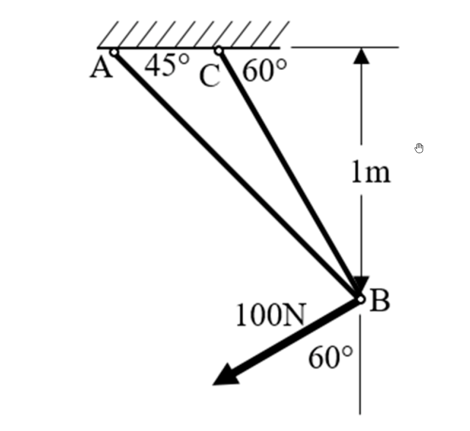

# 考題編號：MM-2020-1

**主分類：** `MM-U3-1` 軸力桿件變位及內力分析
**副分類：** 無
**分析法：** 能量法
**標籤：** `兩桿桁架` `卡氏定理` `幾何法` `桁架位移` `靜定桁架` `單位力法` `軸力桿件位移`

---

## 1. 原始題目重述 (Problem Restatement)

AB 及 BC 兩根桿件組成桁架，固定於樓板下：

| 參數 | 數值 |
|------|------|
| 彈性係數 | $E = 210\text{ GPa} = 210 \times 10^9\text{ N/m}^2$ |
| 斷面積 | $A = 9\text{ cm}^2 = 9 \times 10^{-4}\text{ m}^2$ |
| B 距樓板 | $1\text{ m}$（垂直距離） |

幾何：A 固定於樓板，bar AB 與樓板夾角 45°；C 固定於樓板，bar BC 與樓板夾角 60°。B 點在 A、C 之間的樓板下方 1 m。

外力：B 點承受 100 N、向下偏左，與水平面夾角 60° 的拉力。

**求：B 點水平及垂直位移量（絕對值，不須標示方向）。**



*圖說：天花板固定點 A（左）與 C（右），B 在樓板下 1 m；bar AB 與天花板夾 45°，bar BC 與天花板夾 60°；外力 100 N 方向為水平左偏 60° 以下（即與水平面夾 60°，向下向左）。*

---

## 2. 考題核心精神與出題者意圖 (Core Concepts & Examiner's Intent)

**核心觀念：** 靜定桁架位移——先求桿件內力，再用能量法（卡氏定理 / 虛功法 / 幾何小變形法）求節點位移。

本題最優雅的洞察：**外力方向恰與 BC 桿反向平行**（力方向為水平左下 60°，BC 桿方向為水平右上 60°），故 BC 桿軸線承受全部外力，AB 桿零力。這是一個精心設計的「特殊角度」題。

**出題者測驗：**
1. 能否正確建立桿件方向向量並列節點平衡方程
2. 能否使用卡氏定理 / 幾何法求 **二維節點位移**（非同一方向的疊加）
3. 能否識別特殊結果：兩方向位移相等（位移方向垂直於 AB 桿，即 45° 斜向）

---

## 3. 解題戰略地圖與陷阱分析 (Strategic Roadmap & Trap Analysis)

```
Step 1：確認幾何（桿長、方向向量）
Step 2：節點 B 平衡 → 桿件內力 F_AB, F_BC
Step 3：計算各桿伸長量 δ_i = F_i L_i / (EA)
Step 4：幾何小變形 → B 點位移（利用兩桿延伸量的投影約束）
Step 5：數值代入
```

**陷阱清單：**

| 陷阱 | 問題 | 正確做法 |
|------|------|----------|
| ⚠ 桿長誤用 | 以 1m 為桿長 | $L_{AB} = 1/\sin 45° = \sqrt{2}$ m；$L_{BC} = 1/\sin 60° = 2/\sqrt{3}$ m |
| ⚠ 力方向誤判 | 60° 從垂直量起 | 60° 從**水平**量起（本題恰使 AB 零力） |
| ⚠ 位移求法 | 直接沿 BC 延長線取位移 | 需同時滿足 AB 不伸長的幾何約束 |
| ⚠ 符號/方向 | 混淆 | 題目說「不須標示方向」，取絕對值即可 |

---

## 3.5 變數層次分析 (Variable Hierarchy Analysis)

> 複習提示：第一次解題後，在每個卡關知識點旁標記 `⚠`；第二次複習時只看有 `⚠` 的項目。

### 最終目標

求 B 點的水平位移量 $|\delta_{Bx}|$ 與垂直位移量 $|\delta_{By}|$（無方向）。

### 本題關鍵公式（依計算順序）

**Step 1**｜桿長計算（B 距樓板 1m，桿與樓板夾角 α）：
$$L_i = \frac{1\text{ m}}{\sin\alpha_i}$$

**Step 2**｜節點平衡，求桿力：
$$\sum F_x = 0,\quad \sum F_y = 0 \implies F_{AB}, F_{BC}$$

**Step 3**｜各桿伸長量：
$$\delta_i = \frac{F_i \cdot \boxed{L_i}}{EA}$$

**Step 4**｜幾何小變形約束（投影法），利用 $\delta_{AB}=0$ 的條件：
$$\frac{u_B - v_B}{\sqrt{2}} = \boxed{\delta_{AB}} = 0 \implies u_B = v_B$$

**Step 5**｜BC 桿延伸量約束（BC 方向的投影）：
$$-\frac{u_B}{2} - \frac{\sqrt{3}\,v_B}{2} = \boxed{\delta_{BC}} \implies v_B = -\frac{2\delta_{BC}}{1+\sqrt{3}}$$

**Step 6**｜最終結果：
$$|\delta_{Bx}| = |\delta_{By}| = (\sqrt{3}-1)\,\boxed{\delta_{BC}}$$

### L1：題目直接給定

| 符號 | 數值 | 說明 |
|------|------|------|
| $E$ | $210\text{ GPa}$ | 彈性係數 |
| $A$ | $9\text{ cm}^2 = 9\times10^{-4}\text{ m}^2$ | 斷面積（兩桿相同） |
| $h$ | $1\text{ m}$ | B 距樓板垂直高度 |
| $\alpha_{AB}$ | $45°$ | bar AB 與樓板夾角 |
| $\alpha_{BC}$ | $60°$ | bar BC 與樓板夾角 |
| $F$ | $100\text{ N}$，水平下方 $60°$ | 外力（向下向左） |

### L2：需知識點推導

**桿長（幾何）**

| 符號 | 公式 | 卡關? |
|------|------|-------|
| $L_{AB}$ | $1/\sin45° = \sqrt{2}\text{ m}$ | |
| $L_{BC}$ | $1/\sin60° = 2/\sqrt{3}\text{ m}$ | |

**外力分量（x 右正，y 上正）**

| 符號 | 公式 | 卡關? |
|------|------|-------|
| $P_x$ | $-100\cos60° = -50\text{ N}$ | |
| $P_y$ | $-100\sin60° = -50\sqrt{3}\text{ N}$ | |

**桿件方向單位向量（指向 B 的方向）**

| 桿件 | 從 A（或 C）指向 B | 卡關? |
|------|------------------|-------|
| AB | $(+\cos45°, -\sin45°) = (+\frac{\sqrt{2}}{2}, -\frac{\sqrt{2}}{2})$ | |
| BC | $(-\cos60°, -\sin60°) = (-\frac{1}{2}, -\frac{\sqrt{3}}{2})$ | |

**節點平衡 → 桿力**

| 符號 | 推導 | 卡關? |
|------|------|-------|
| $F_{AB}$ | 聯立方程 → $F_{AB} = 0$ | |
| $F_{BC}$ | 聯立方程 → $F_{BC} = 100\text{ N}$（拉力） | |

**伸長量**

| 符號 | 公式 | 卡關? |
|------|------|-------|
| $\delta_{AB}$ | $0 \times \sqrt{2}/(EA) = 0$ | |
| $\delta_{BC}$ | $100 \times (2/\sqrt{3})/(EA) = 200/(\sqrt{3}\cdot EA)$ | |

**位移（幾何約束法）**

| 符號 | 公式 | 卡關? |
|------|------|-------|
| $u_B = v_B$ | 由 $\delta_{AB}=0$ 得 | |
| $v_B$ | $-(\sqrt{3}-1)\,\delta_{BC}$ | |
| $|u_B|=|v_B|$ | $(\sqrt{3}-1)\,\delta_{BC}$ | |

### L3：深層知識（不懂就卡住）

| 知識點 | 說明 | 卡關? |
|--------|------|-------|
| 桁架節點平衡：力方向與桿件方向一致 | 張力 → 力指向 A（或 C），壓力 → 力離開 | |
| 幾何小變形求節點位移 | 桿伸長量 = B 位移投影到桿方向（沿桿方向分量）；不可直接沿桿方向移動 B（因為另一桿也有約束） | |
| 有效長度 EA 的正確計算 | $EA = 210\times10^9\text{ Pa}\times9\times10^{-4}\text{ m}^2 = 1.89\times10^8\text{ N}$ | |
| 對稱結果的物理意義 | $u_B = v_B$ 意味位移方向為左下 45°（垂直於 AB 桿方向）—BC 伸長使 B 延 BC 方向移動，但被 AB 約束偏轉至垂直於 AB 的方向 | |

---

## 4. 步驟化詳細計算過程 (Step-by-Step Detailed Calculation)

> 📊 互動圖：`MM-2020-1-truss-viz.html`

### Step 1：建立幾何座標

取 x 向右為正，y 向上為正。B 點為原點便於計算。

| 點 | 座標（以 B 為原點）|
|----|------------------|
| A | $(-1, +1)\text{ m}$（B 左 1m，上 1m） |
| B | $(0, 0)$ |
| C | $(+\frac{1}{\sqrt{3}}, +1)\text{ m}$（B 右 $1/\sqrt{3}$ m，上 1m） |

桿長：
$$L_{AB} = \sqrt{1^2 + 1^2} = \sqrt{2}\text{ m}, \quad L_{BC} = \sqrt{\left(\frac{1}{\sqrt{3}}\right)^2 + 1^2} = \sqrt{\frac{1}{3}+1} = \frac{2}{\sqrt{3}}\text{ m}$$

### Step 2：節點 B 平衡，求桿力

外力分量（60° 從水平量起，向下偏左）：
$$P_x = -100\cos60° = -50\text{ N}, \quad P_y = -100\sin60° = -50\sqrt{3}\text{ N}$$

**注意：** 外力方向為水平左方偏下 60°，恰好與 BC 桿（水平右方偏上 60°）**完全反向平行**！

桿件張力（以拉力為正）在 B 點的合力：
- bar AB 拉 B 向 A（左上）：$F_{AB} \times (-\frac{\sqrt{2}}{2}, +\frac{\sqrt{2}}{2})$
- bar BC 拉 B 向 C（右上）：$F_{BC} \times (+\frac{1}{2}, +\frac{\sqrt{3}}{2})$

節點平衡：
$$\Sigma F_x:\quad -\frac{F_{AB}}{\sqrt{2}} + \frac{F_{BC}}{2} = 50 \tag{1}$$

$$\Sigma F_y:\quad \frac{F_{AB}}{\sqrt{2}} + \frac{\sqrt{3}\,F_{BC}}{2} = 50\sqrt{3} \tag{2}$$

$(1) + (2)$：

$$F_{BC}\cdot\frac{1+\sqrt{3}}{2} = 50(1+\sqrt{3}) \implies \boxed{F_{BC} = 100\text{ N（拉力）}}$$

代入 $(1)$：$-F_{AB}/\sqrt{2} + 50 = 50 \implies \boxed{F_{AB} = 0}$

**📌 關鍵洞察：** 外力與 BC 桿恰好反向共線，故 BC 單獨承受全部外力，AB 零應力。

### Step 3：計算伸長量

$$EA = 210\times10^9 \times 9\times10^{-4} = 1.89\times10^8\text{ N}$$

$$\delta_{AB} = \frac{F_{AB}\cdot L_{AB}}{EA} = \frac{0 \times \sqrt{2}}{1.89\times10^8} = 0$$

$$\delta_{BC} = \frac{F_{BC}\cdot L_{BC}}{EA} = \frac{100 \times \dfrac{2}{\sqrt{3}}}{1.89\times10^8} = \frac{200}{\sqrt{3}\times1.89\times10^8} = 6.110\times10^{-7}\text{ m}$$

### Step 4：幾何小變形法求 B 點位移

設 B 位移為 $(u_B, v_B)$（x 右正，y 上正）。

**約束一：** AB 桿伸長量 = B 位移沿 AB 方向分量（A 固定）

AB 方向（從 A 指向 B）：$(\frac{\sqrt{2}}{2}, -\frac{\sqrt{2}}{2})$

$$\delta_{AB} = u_B\cdot\frac{\sqrt{2}}{2} + v_B\cdot\left(-\frac{\sqrt{2}}{2}\right) = \frac{u_B - v_B}{\sqrt{2}} = 0 \implies \boxed{u_B = v_B}$$

**約束二：** BC 桿伸長量 = B 位移沿 BC 方向分量（C 固定）

BC 方向（從 C 指向 B）：$(-\frac{1}{2}, -\frac{\sqrt{3}}{2})$

$$\delta_{BC} = u_B\cdot\left(-\frac{1}{2}\right) + v_B\cdot\left(-\frac{\sqrt{3}}{2}\right) = 6.110\times10^{-7}$$

代入 $u_B = v_B$：

$$v_B\cdot\left(-\frac{1+\sqrt{3}}{2}\right) = 6.110\times10^{-7}$$

$$v_B = -\frac{2\times6.110\times10^{-7}}{1+\sqrt{3}} = -\frac{2\times6.110\times10^{-7}\times(\sqrt{3}-1)}{(\sqrt{3}+1)(\sqrt{3}-1)} = -(\sqrt{3}-1)\times6.110\times10^{-7}$$

$$v_B = -0.7321\times6.110\times10^{-7} = -4.474\times10^{-7}\text{ m}$$

（負號 = 向下）

$$u_B = v_B = -4.474\times10^{-7}\text{ m}\quad\text{（負號 = 向左）}$$

### Step 5：最終答案

$$\boxed{|\delta_{Bx}| = |\delta_{By}| = (\sqrt{3}-1)\cdot\frac{200}{\sqrt{3}\cdot EA} \approx 4.47\times10^{-7}\text{ m} \approx 4.47\times10^{-4}\text{ mm}}$$

兩方向位移量相等，合位移方向為左下 45°（垂直於 AB 桿方向）。

**精確表達式：**
$$|\delta_{Bx}| = |\delta_{By}| = \frac{200(\sqrt{3}-1)}{\sqrt{3}\times1.89\times10^8}\text{ m} = \frac{200(3-\sqrt{3})}{567\times10^6}\text{ m}$$

---

## 5. 關鍵爭議點與進階探討 (Critical Issues & Advanced Discussion)

### 5.1 外力方向「60°」的詮釋

本題設計精妙：外力恰與 BC 桿軸線完全重合（反向）。若 60° 從水平量起，外力方向為 $(−\cos60°, −\sin60°) = (−1/2, −\sqrt{3}/2)$，正好是 BC 桿「C 到 B」方向的反向延長線。**這導致 F_AB = 0**，是考官刻意設計的特殊角度。

若改成 60° 從垂直量起（外力方向 $(−\sin60°, −\cos60°)$），則：
$F_{BC} = 100$ N（巧合相同）但 $F_{AB} = 50\sqrt{2}(1−\sqrt{3}) ≠ 0$，計算複雜許多。

### 5.2 為何水平與垂直位移相等？

$u_B = v_B$ 意味合位移方向為正好 45°（左下）。這是 AB 桿約束（45° 方向）的直接結果：**只要 $\delta_{AB} = 0$，B 的位移就必然垂直於 AB 桿**。AB 桿方向為右下 45°，其垂直方向正是左下 45°（$u_B = v_B$ 且均為負）。

幾何上可理解為：B 點在圓弧（以 A 為圓心，$L_{AB}$ 為半徑）上沿切線方向移動——切線方向垂直於半徑 AB，即 45° 斜向。

### 5.3 能量法（卡氏定理）與幾何法等價

使用卡氏定理：$\delta_{Bx} = \partial U/\partial P_x$，$\delta_{By} = \partial U/\partial P_y$。

由於 $F_{BC} = -(√3-1)(P_x+P_y)$：
$$\frac{\partial F_{BC}}{\partial P_x} = \frac{\partial F_{BC}}{\partial P_y} = -(√3-1)$$

$$\delta_{Bx} = \delta_{By} = \frac{\partial F_{BC}}{\partial P_{x,y}}\cdot F_{BC}\cdot L_{BC}/(EA) = -(√3-1)\cdot\delta_{BC}$$

兩方法完全一致 ✓
