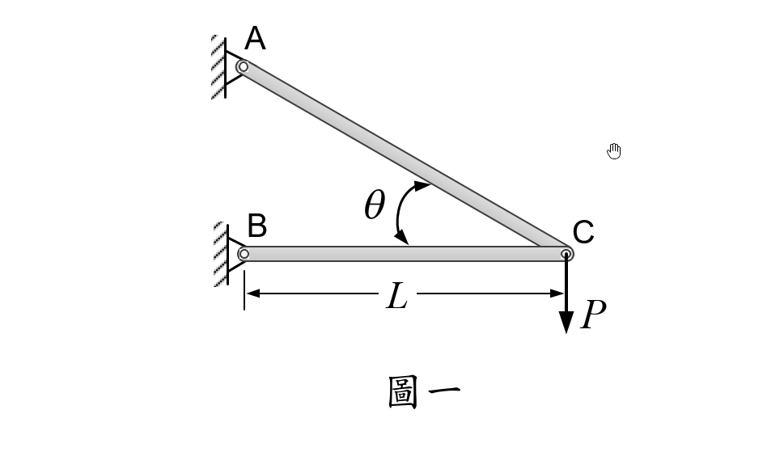

# 考題編號：MM-2021-1

**主分類：** `MM-U2-1` 軸力桿件斷面應力計算
**副分類：** 無
**分析法：** 彈性分析
**標籤：** `兩桿桁架` `最小重量設計` `允許應力設計` `靜定桁架` `斜面應力` `最佳化角度`

---

## 1. 原始題目重述 (Problem Restatement)

圖一之結構由桿件 AC 與 BC 組成，兩桿材料相同、密度相同。

- **幾何條件：** A 端在 B 端正上方（均為固定鉸接支承）；C 為自由接頭，P 向下作用。
- BC 為水平桿，**長度固定為 L**；AC 為斜桿，角度 θ 改變時 AC 長度隨之改變（θ 為 ∠ACB，即 BC 與 AC 之夾角，量於 C 點）。
- 材料允許應力 σ_allow 相同。

**求：** 在 AC 及 BC 桿內之應力均不超過 σ_allow 的前提下，使結構**總重量最小**之角度 θ。

*圖說：A 在 B 正上方，AB 鉛直；BC 水平，長度 L（固定）；AC 為斜桿，AC = L/cosθ。垂直力 P 向下施加於 C 點。θ 定義為 BC（水平）與 AC 之夾角（量於 C 點）。*

---

## 2. 考題核心精神與出題者意圖 (Core Concepts & Examiner's Intent)

**核心觀念：** 靜定桁架的內力分析 + 允許應力設計下的截面面積選定 + 重量函數最佳化（微分求極值）。

**出題者意圖：**
1. 測試考生能否正確由平衡方程式求兩桿內力（以 θ 表示）。
2. 考查「允許應力設計」邏輯：截面面積由應力限制決定，恰好取等號時用料最省。
3. 考查微積分最佳化：對 θ 微分、找最小值，並處理三角函數的化簡（double-angle identity）。

**陷阱提示：**
- θ 定義為 ∠ACB（在 C 點量）；若誤認為 A 不在 B 正上方，幾何將出錯。
- 自重最佳化要同時考慮兩桿；只優化其中一桿是不完整的。
- 最佳化時需確認是最小值而非最大值（f → ∞ 當 θ → 0° 或 → 90°，中間存在唯一最小值）。

---

## 3. 解題戰略地圖與陷阱分析 (Strategic Roadmap & Trap Analysis)

**作戰計畫：**

1. **建立幾何關係**：以 θ 表示 AC 長度（$L_{AC} = L/\cos\theta$）。
2. **C 點平衡**：求 $F_{AC}$（拉力）與 $F_{BC}$（壓力）以 θ 表示。
3. **允許應力 → 截面面積**：$A = F/\sigma_{allow}$（取最小截面，即恰在允許應力下）。
4. **寫出總重量 W(θ)**：$W = \rho g \sum A_i L_i$。
5. **最小化 W**：令 $dW/d\theta = 0$，利用倍角公式化簡，解出 θ。

**四個關鍵陷阱：**

| # | 陷阱 | 應對方法 |
|---|------|---------|
| 1 | AC 長度用錯 | $L_{AC} = L/\cos\theta$，不是 $L\sin\theta$ 或 $L\tan\theta$ |
| 2 | 截面積公式混用 | BC 是壓力，AC 是拉力；允許應力同為 $\sigma_{allow}$，均用 $A = F/\sigma_{allow}$ |
| 3 | W 函數未化簡 | 需用倍角公式 $\sin\theta\cos\theta = \frac{1}{2}\sin 2\theta$，$\cos^2\theta = \frac{1+\cos 2\theta}{2}$ 才能順利微分 |
| 4 | 解完 $\cos 2\theta$ 要換回 θ | $\cos 2\theta = -1/3 \Rightarrow \tan\theta = \sqrt{2}$，需利用半角關係換算 |

---

## 3.5 變數層次分析（Variable Hierarchy Analysis）

> 複習提示：第一次解題後，在每個卡住的知識點旁標記 `⚠`；第二次複習時只看有 `⚠` 的項目。

### 最終目標
`求使兩桿結構總重量最小之角度 θ`

### 本題關鍵公式（依計算順序）

> $\boxed{\cdot}$ = 需由前步驟推導，非題目直接給定的變數

$$\text{Step 1（幾何）：} L_{AC} = \frac{L}{\cos\theta}$$

$$\text{Step 2（平衡）：} F_{AC} = \frac{P}{\sin\theta},\quad F_{BC} = \frac{P}{\tan\theta}$$

$$\text{Step 3（截面積）：} A_{AC} = \frac{\boxed{F_{AC}}}{\sigma_{allow}} = \frac{P}{\sigma_{allow}\sin\theta},\quad A_{BC} = \frac{\boxed{F_{BC}}}{\sigma_{allow}} = \frac{P\cos\theta}{\sigma_{allow}\sin\theta}$$

$$\text{Step 4（重量）：} W = \rho g\!\left(\boxed{A_{AC}}\cdot\boxed{L_{AC}} + \boxed{A_{BC}}\cdot L\right) = \frac{\rho g P L}{\sigma_{allow}}\cdot\frac{1+\cos^2\theta}{\sin\theta\cos\theta}$$

$$\text{Step 5（倍角化簡）：} f(\theta) = \frac{1+\cos^2\theta}{\sin\theta\cos\theta} = \frac{3+\cos 2\theta}{\sin 2\theta}$$

$$\text{Step 6（最佳化）：} \frac{df}{d(2\theta)} = 0 \;\Rightarrow\; \cos 2\theta = -\frac{1}{3} \;\Rightarrow\; \tan\theta = \sqrt{2}$$

### L1：題目直接給定

| 符號 | 數值 | 說明 |
|------|------|------|
| $L$ | — | BC 桿長度（固定值） |
| $P$ | — | C 點垂直向下外力 |
| $\sigma_{allow}$ | — | 兩桿共同允許應力 |
| $\rho$ | — | 兩桿共同材料密度 |
| $g$ | $9.81\text{ m/s}^2$ | 重力加速度 |

### L2：需知識點推導

**Step 1：幾何關係**

| 符號 | 公式/來源 | 卡關? |
|------|----------|:-----:|
| $L_{AC}$ | 直角三角形 ABC（AB 鉛直、BC 水平）：$L_{AC} = L/\cos\theta$ | |

**Step 2：C 點靜力平衡（ΣFx=0, ΣFy=0）**

| 符號 | 公式/來源 | 卡關? |
|------|----------|:-----:|
| $F_{AC}$ | $\Sigma F_y = 0$：$F_{AC}\sin\theta = P$ → $F_{AC} = P/\sin\theta$ | |
| $F_{BC}$ | $\Sigma F_x = 0$：$F_{BC} = F_{AC}\cos\theta = P/\tan\theta$ | |

**Step 3：截面積（允許應力設計，取等號）**

| 符號 | 公式/來源 | 卡關? |
|------|----------|:-----:|
| $A_{AC}$ | $A_{AC} = F_{AC}/\sigma_{allow}$ | |
| $A_{BC}$ | $A_{BC} = F_{BC}/\sigma_{allow}$ | |

**Step 4–6：重量函數最佳化**

| 符號 | 公式/來源 | 卡關? |
|------|----------|:-----:|
| $W(\theta)$ | $\rho g(A_{AC}L_{AC} + A_{BC}L)$ | |
| $f(\theta)$ 倍角化簡 | $\cos^2\theta = (1+\cos 2\theta)/2$；$\sin\theta\cos\theta = \sin 2\theta/2$ | |
| $df/d(2\theta)=0$ | 商法則求導，分子整理為 $-1-3\cos 2\theta = 0$ | |
| $\tan\theta = \sqrt{2}$ | $\cos 2\theta = -1/3 \Rightarrow \sin^2\theta = 2/3,\; \cos^2\theta = 1/3$ | |

### L3：深層知識（不懂就卡住）

| 知識點 | 說明 | 卡關? |
|--------|------|:-----:|
| AC 方向分解 | C 點自由體：AC 桿對 C 的力方向沿 AC 指向 A（拉力），分解需要正確辨別 x/y 分量 | |
| 允許應力設計取等號 | 最省料 = 每桿應力剛好達 $\sigma_{allow}$；若不等號，重量比最優解更大 | |
| $\cos 2\theta = -1/3$ 換 $\tan\theta$ | 需用 $1-2\sin^2\theta = -1/3$，得 $\sin^2\theta = 2/3$，再 $\tan^2\theta = \sin^2/\cos^2 = 2$ | |

---

## 4. 步驟化詳細計算過程 (Step-by-Step Detailed Calculation)

### Step 1：建立幾何關係

設 A 在 B 正上方，B 在 C 左方，BC 水平長 $L$，θ 為 ∠ACB（在 C 點量）。

$$\boxed{L_{AC} = \frac{L}{\cos\theta}}$$

AB 鉛直高度：$AB = L\tan\theta$

### Step 2：C 點平衡求內力

自由體圖：C 點受 $P$（↓）、$F_{AC}$（沿 AC 方向，拉力）、$F_{BC}$（水平向右，壓力）三力平衡。

AC 與水平夾角 = θ（在 C 點量），所以 $F_{AC}$ 的方向為左上方（與水平成 θ 角，朝向 A）。

$$\Sigma F_y = 0:\quad F_{AC}\sin\theta - P = 0 \;\Rightarrow\; \boxed{F_{AC} = \frac{P}{\sin\theta}} \text{（拉力）}$$

$$\Sigma F_x = 0:\quad F_{BC} - F_{AC}\cos\theta = 0 \;\Rightarrow\; \boxed{F_{BC} = \frac{P}{\tan\theta}} \text{（壓力）}$$

### Step 3：允許應力設計 → 截面積

在最省料設計下，每桿截面面積剛好使應力達到 $\sigma_{allow}$：

$$A_{AC} = \frac{F_{AC}}{\sigma_{allow}} = \frac{P}{\sigma_{allow}\sin\theta}$$

$$A_{BC} = \frac{F_{BC}}{\sigma_{allow}} = \frac{P}{\sigma_{allow}\tan\theta} = \frac{P\cos\theta}{\sigma_{allow}\sin\theta}$$

### Step 4：寫出總重量函數

$$W = \rho g\,(A_{AC}\cdot L_{AC} + A_{BC}\cdot L)$$

$$= \rho g\left(\frac{P}{\sigma_{allow}\sin\theta}\cdot\frac{L}{\cos\theta} + \frac{P\cos\theta}{\sigma_{allow}\sin\theta}\cdot L\right)$$

$$= \frac{\rho g P L}{\sigma_{allow}}\left(\frac{1}{\sin\theta\cos\theta} + \frac{\cos\theta}{\sin\theta}\right)$$

$$= \frac{\rho g P L}{\sigma_{allow}}\cdot\frac{1+\cos^2\theta}{\sin\theta\cos\theta}$$

### Step 5：倍角公式化簡

利用 $1+\cos^2\theta = 1+\dfrac{1+\cos 2\theta}{2} = \dfrac{3+\cos 2\theta}{2}$ 及 $\sin\theta\cos\theta = \dfrac{\sin 2\theta}{2}$：

$$f(\theta) = \frac{1+\cos^2\theta}{\sin\theta\cos\theta} = \frac{(3+\cos 2\theta)/2}{(\sin 2\theta)/2} = \frac{3+\cos 2\theta}{\sin 2\theta}$$

### Step 6：令 df/dθ = 0 求最小值

令 $u = 2\theta$，對 $u$ 微分並令分子為零：

$$\frac{df}{du} = \frac{-\sin u\cdot\sin u - (3+\cos u)\cos u}{\sin^2 u} = 0$$

分子：
$$-\sin^2 u - 3\cos u - \cos^2 u = -(\sin^2 u+\cos^2 u) - 3\cos u = -1-3\cos u = 0$$

$$\cos 2\theta = -\frac{1}{3}$$

### Step 7：換算 θ

由 $\cos 2\theta = 1-2\sin^2\theta = -\dfrac{1}{3}$：

$$\sin^2\theta = \frac{2}{3},\quad \cos^2\theta = \frac{1}{3},\quad \tan^2\theta = 2$$

$$\boxed{\theta = \arctan\sqrt{2} \approx 54.74°}$$

### Step 8：最小重量

$$f_{\min} = \frac{3+(-1/3)}{\sqrt{1-(1/3)^2}} = \frac{8/3}{\sqrt{8/9}} = \frac{8/3}{2\sqrt{2}/3} = \frac{4}{\sqrt{2}} = 2\sqrt{2}$$

$$\boxed{W_{\min} = \frac{2\sqrt{2}\,\rho g P L}{\sigma_{allow}}}$$

---

## 5. 關鍵爭議點與進階探討 (Critical Issues & Advanced Discussion)

### 5.1 為何是「最小值」而非「最大值」？

當 $\theta \to 0°$：AC 趨近水平，無法承受垂直力 P，$F_{AC} \to \infty$，重量 $\to \infty$。  
當 $\theta \to 90°$：AC 趨近鉛直，BC 力矩 $\to 0$ 但 BC 長度 = L 不變、$A_{BC} \to \infty$，重量 $\to \infty$。  
中間必存在唯一最小值，確為 $\theta = \arctan\sqrt{2}$。

### 5.2 與同類問題的比較

若 BC 為斜桿（非水平）或 P 為斜向力，重量函數形式會改變，但最佳化方法相同。本題結果 $\theta \approx 54.74°$ 是材料力學教科書中的經典最佳角度。

### 5.3 考場建議

求得 $\cos 2\theta = -1/3$ 後，若不確定如何換算為角度數值，可直接回報 $\theta = \arctan\sqrt{2}$（保留精確解）；數值約 54.74° 可用計算機確認。最小重量 $W_{\min} = 2\sqrt{2}\rho g PL/\sigma_{allow}$ 建議一併計算，展現完整性。
