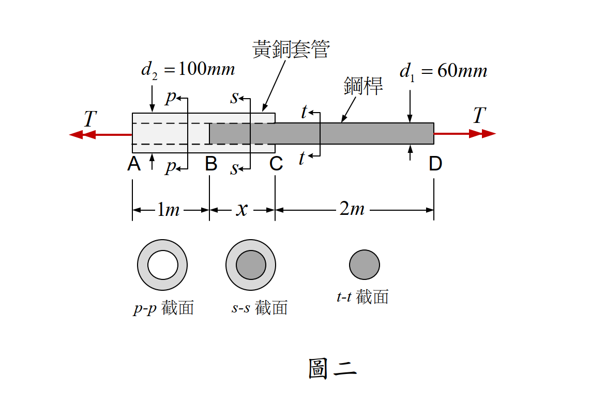

# 考題編號：MM-2021-2

**主分類：** `MM-U2-3` 扭力桿件斷面應力計算
**副分類：** `MM-U3-3` 扭力桿件變位及內力分析
**分析法：** 彈性分析
**標籤：** `靜不定扭轉` `複合斷面扭轉` `平行桿件扭轉` `扭轉角限制` `允許剪應力` `剛度分配`

---

## 1. 原始題目重述 (Problem Restatement)

**系統組成（由左至右）：**

```
A ─────── B ─────────── C ────────────── D
←  1 m  →← BC = x m →←     2 m       →
   黃銅套管    黃銅套管+鋼桿      鋼桿
  (p-p截面)    (s-s截面)       (t-t截面)
```

- **鋼桿（steel shaft）：** 實心圓截面，$d_1 = 60\ \text{mm}$，$G_s = 80\ \text{GPa}$；從 B 延伸至 D，全長 $(x+2)\ \text{m}$。
- **黃銅套管（brass sleeve）：** 環形截面，$d_1 = 60\ \text{mm}$（內徑）、$d_2 = 100\ \text{mm}$（外徑），$G_b = 40\ \text{GPa}$；從 A 延伸至 C，全長 $(1+x)\ \text{m}$；在 BC 段牢固黏合於鋼桿外側。
- **載重：** A 端（黃銅端）與 D 端（鋼桿端）各施加相反方向扭矩 $T$。

**截面說明（圖二）：**  
p-p（AB 段）= 黃銅套管中空圓環；s-s（BC 段）= 鋼桿在黃銅套管內的複合截面；t-t（CD 段）= 實心鋼桿。



*圖說：A 端（黃銅套管左端）至 D 端（鋼桿右端）承受扭矩 T；AB=1m 為黃銅套管段，BC=x m 為複合段（鋼桿外徑60mm在黃銅套管內，套管外徑100mm），CD=2m 為鋼桿段。d₁=60mm（鋼桿直徑=套管內徑），d₂=100mm（套管外徑），Gs=80GPa，Gb=40GPa。*

---

## 2. 考題核心精神與出題者意圖 (Core Concepts & Examiner's Intent)

**核心觀念：** BC 段為兩根平行桿件（鋼桿 + 黃銅套管）共同承受扭矩，屬於**靜不定扭轉**。靜不定量 = 1；需要一個「變形諧和條件」（兩者扭轉率相等）來補充平衡方程式。

**出題者意圖：**
1. 測試考生能否辨識系統中哪些段是「確定段」（AB 或 CD，只有一種材料）與「靜不定段」（BC，兩種材料平行）。
2. 考查平行扭轉桿的剛度分配公式。
3. 積分總扭轉角（三段疊加），設定等於允許值求 x。
4. 尋找各截面的最大剪應力，判斷何段先達到允許值。

**陷阱提示：**
- AB 段黃銅套管內徑中空（無鋼桿），鋼桿從 B 點才開始 → 切勿用複合截面計算 AB。
- BC 段的扭矩分配依「剛度比」，**不是**依截面積比。
- 決定 $T_{\max}$ 需逐段比對，**CD 鋼桿段往往最弱**（面積最小、無套管加強）。

---

## 3. 解題戰略地圖與陷阱分析 (Strategic Roadmap & Trap Analysis)

**作戰計畫：**

1. **計算斷面性質** $J_s$、$J_b$，以及 $G_s J_s$、$G_b J_b$、$(G_s J_s + G_b J_b)$。
2. **BC 段扭矩分配**（靜不定）：諧和條件（扭轉率相等）+ 平衡，得 $T_s$、$T_b$。
3. **總扭轉角公式**：三段疊加，令 $\phi_{AD} = \phi_{allow}$ 求 BC 長 $x$。
4. **各段剪應力**：逐段算最大剪應力，與允許值比較，取最小的 $T_{\max}$。

**關鍵陷阱：**

| # | 陷阱 | 應對方法 |
|---|------|---------|
| 1 | AB 段誤用複合截面 | AB 段只有黃銅套管（鋼桿起始於 B），只用 $G_b J_b$ |
| 2 | BC 段用截面積比分配扭矩 | 應用剛度比：$T_s = T \cdot G_s J_s/(G_s J_s + G_b J_b)$ |
| 3 | CD 剪應力最大值位置 | 鋼桿表面，$c_s = d_1/2 = 30\ \text{mm}$ |
| 4 | AB 段剪應力最大值位置 | 黃銅套管外表面，$c_b = d_2/2 = 50\ \text{mm}$ |

---

## 3.5 變數層次分析（Variable Hierarchy Analysis）

> 複習提示：第一次解題後，在每個卡住的知識點旁標記 `⚠`；第二次複習時只看有 `⚠` 的項目。

### 最終目標
`(一) 求 BC 長 x 使扭轉角 ≤ 15°；(二) 求各段應力均不超標之最大扭矩 T_max`

### 本題關鍵公式（依計算順序）

> $\boxed{\cdot}$ = 需由前步驟推導，非題目直接給定的變數

$$\text{Step 1：} J_s = \frac{\pi d_1^4}{32},\quad J_b = \frac{\pi(d_2^4 - d_1^4)}{32}$$

$$\text{Step 2（BC 扭矩分配）：} T_s = T \cdot \frac{G_s J_s}{\boxed{G_s J_s + G_b J_b}},\quad T_b = T \cdot \frac{G_b J_b}{\boxed{G_s J_s + G_b J_b}}$$

$$\text{Step 3（總扭轉角）：} \phi_{AD} = \frac{T \cdot 1}{\boxed{G_b J_b}} + \frac{T \cdot x}{\boxed{G_s J_s + G_b J_b}} + \frac{T \cdot 2}{\boxed{G_s J_s}} = \phi_{allow}$$

$$\text{Step 4（各段剪應力）：}$$
$$\tau_{b,AB} = \frac{T \cdot c_b}{\boxed{J_b}},\quad \tau_{s,CD} = \frac{T \cdot c_s}{\boxed{J_s}},\quad \tau_{b,BC} = \frac{\boxed{T_b} \cdot c_b}{\boxed{J_b}} = \frac{T \cdot G_b \cdot c_b}{\boxed{G_s J_s + G_b J_b}}$$

### L1：題目直接給定

| 符號 | 數值 | 說明 |
|------|------|------|
| $d_1$ | 60 mm | 鋼桿直徑（= 黃銅套管內徑） |
| $d_2$ | 100 mm | 黃銅套管外徑 |
| $G_s$ | 80 GPa | 鋼桿剪力模數 |
| $G_b$ | 40 GPa | 黃銅套管剪力模數 |
| $L_{AB}$ | 1 m | AB 段（黃銅套管，無鋼桿） |
| $L_{CD}$ | 2 m | CD 段（鋼桿，無套管） |
| $T$（一） | 10 kN·m | 外加扭矩（部(一)） |
| $\phi_{allow}$ | 15° = π/12 rad | A-D 端允許扭轉角（部(一)） |
| $(\tau_b)_{allow}$ | 80 MPa | 黃銅允許剪應力（部(二)） |
| $(\tau_s)_{allow}$ | 120 MPa | 鋼桿允許剪應力（部(二)） |

### L2：需知識點推導

**Step 1：斷面性質**

| 符號 | 公式/來源 | 卡關? |
|------|----------|:-----:|
| $J_s$ | $\pi(60)^4/32 = 405{,}000\pi\ \text{mm}^4$ | |
| $J_b$ | $\pi(100^4 - 60^4)/32 = 2{,}720{,}000\pi\ \text{mm}^4$ | |
| $G_s J_s$ | $80{,}000 \times 405{,}000\pi = 32.4\pi \times 10^9\ \text{N·mm}^2$ | |
| $G_b J_b$ | $40{,}000 \times 2{,}720{,}000\pi = 108.8\pi \times 10^9\ \text{N·mm}^2$ | |
| $G_s J_s + G_b J_b$ | $141.2\pi \times 10^9\ \text{N·mm}^2$ | |

**Step 2：BC 扭矩分配（諧和條件）**

| 符號 | 公式/來源 | 卡關? |
|------|----------|:-----:|
| $T_s$ | $T \times 32.4/141.2 = 0.2294\,T$ | |
| $T_b$ | $T \times 108.8/141.2 = 0.7706\,T$ | |

**Step 3：部(一) 求 x**

| 符號 | 公式/來源 | 卡關? |
|------|----------|:-----:|
| $\phi_{AB}$ | $T/(G_b J_b) = 10/(108.8\pi) = 0.02926\ \text{rad}$ | |
| $\phi_{CD}$ | $2T/(G_s J_s) = 20/(32.4\pi) = 0.19649\ \text{rad}$ | |
| $\phi_{BC}$ | $\pi/12 - 0.02926 - 0.19649 = 0.03605\ \text{rad}$ | |
| $x$ | $\phi_{BC} \times (G_s J_s + G_b J_b)/T$ | |

**Step 4：部(二) 各段最大剪應力對應 T_max**

| 段 | 材料 | 公式 | 卡關? |
|----|------|------|:-----:|
| AB | 黃銅 | $\tau = T \cdot c_b/J_b$ | |
| CD | 鋼桿 | $\tau = T \cdot c_s/J_s$ | |
| BC | 黃銅 | $\tau = T \cdot G_b \cdot c_b/(G_s J_s + G_b J_b)$ | |
| BC | 鋼桿 | $\tau = T \cdot G_s \cdot c_s/(G_s J_s + G_b J_b)$ | |

### L3：深層知識（不懂就卡住）

| 知識點 | 說明 | 卡關? |
|--------|------|:-----:|
| 平行扭轉桿諧和條件 | 兩桿黏合 → 扭轉率相等：$T_s/(G_s J_s) = T_b/(G_b J_b)$ | |
| 複合截面有效扭轉剛度 | BC 段等效 $GJ = G_s J_s + G_b J_b$（平行相加） | |
| 剪應力最大值位置 | 實心/空心圓桿：最大剪應力在外表面，$c = d/2$（外徑） | |
| AB 段只用 $G_b J_b$ | 鋼桿從 B 才開始，AB 段無鋼桿，需確認截面型式 | |

---

## 4. 步驟化詳細計算過程 (Step-by-Step Detailed Calculation)

> 📊 互動圖（扭矩分布）：`MM-2021-2-torsion-viz.html`

### Step 1：斷面性質（以 mm 為單位）

**鋼桿（實心圓，$d_1 = 60$ mm）：**

$$J_s = \frac{\pi d_1^4}{32} = \frac{\pi \times 60^4}{32} = \frac{\pi \times 12{,}960{,}000}{32} = 405{,}000\pi \approx 1.2723 \times 10^6 \ \text{mm}^4$$

**黃銅套管（環形，$d_1 = 60$ mm，$d_2 = 100$ mm）：**

$$J_b = \frac{\pi(d_2^4 - d_1^4)}{32} = \frac{\pi(100^4 - 60^4)}{32} = \frac{\pi \times 87{,}040{,}000}{32} = 2{,}720{,}000\pi \approx 8.5449 \times 10^6 \ \text{mm}^4$$

**扭轉剛度（單位：N·mm²）：**

$$G_s J_s = 80{,}000 \times 405{,}000\pi = 32.4\pi \times 10^9 \approx 1.0179 \times 10^{11}\ \text{N·mm}^2$$

$$G_b J_b = 40{,}000 \times 2{,}720{,}000\pi = 108.8\pi \times 10^9 \approx 3.4181 \times 10^{11}\ \text{N·mm}^2$$

$$G_s J_s + G_b J_b = 141.2\pi \times 10^9 \approx 4.4359 \times 10^{11}\ \text{N·mm}^2$$

---

### Step 2：BC 段扭矩分配（靜不定分析）

BC 段黃銅套管與鋼桿**牢固黏合** → 兩桿扭轉率（每單位長扭轉角）相等（諧和條件）：

$$\frac{T_s}{G_s J_s} = \frac{T_b}{G_b J_b}$$

加上平衡條件 $T_s + T_b = T$，聯立求解：

$$\boxed{T_s = T \cdot \frac{G_s J_s}{G_s J_s + G_b J_b} = T \times \frac{32.4}{141.2} \approx 0.2294\,T}$$

$$\boxed{T_b = T \cdot \frac{G_b J_b}{G_s J_s + G_b J_b} = T \times \frac{108.8}{141.2} \approx 0.7706\,T}$$

> *策略註解：黃銅套管剛度較大（$G_b J_b > G_s J_s$），因此 BC 段黃銅承擔較多扭矩（約 77%）。*

---

### Step 3：部(一)——BC 長 x

**各段扭轉角（T = 10 kN·m，長度轉換為 mm）：**

$$\phi_{AB} = \frac{T \cdot L_{AB}}{G_b J_b} = \frac{10 \times 10^6 \times 1000}{108.8\pi \times 10^9} = \frac{10}{108.8\pi} \approx 0.02926\ \text{rad}$$

$$\phi_{CD} = \frac{T \cdot L_{CD}}{G_s J_s} = \frac{10 \times 10^6 \times 2000}{32.4\pi \times 10^9} = \frac{20}{32.4\pi} \approx 0.19649\ \text{rad}$$

$$\phi_{BC} = \frac{T \cdot L_{BC}}{G_s J_s + G_b J_b} = \frac{10 \times 10^6 \times 1000x}{141.2\pi \times 10^9} = \frac{10x}{141.2\pi}\ \text{rad}$$

（其中 $x$ 以 m 為單位）

**設總扭轉角 = 允許值：**

$$\phi_{AD} = \phi_{AB} + \phi_{BC} + \phi_{CD} = \phi_{allow} = 15° = \frac{\pi}{12}\ \text{rad} = 0.26180\ \text{rad}$$

$$0.02926 + \frac{10x}{141.2\pi} + 0.19649 = 0.26180$$

$$\frac{10x}{141.2\pi} = 0.26180 - 0.22575 = 0.03605$$

$$x = \frac{0.03605 \times 141.2\pi}{10} = \frac{0.03605 \times 443.53}{10} = \frac{15.99}{10}$$

$$\boxed{x \approx 1.60\ \text{m}}$$

---

### Step 4：部(二)——最大扭矩 $T_{\max}$

依截面逐段計算最大剪應力，令 $\tau \leq \tau_{allow}$，求對應的 $T$ 上限。

**① AB 段（黃銅套管，全扭矩 T，外表面 $c_b = 50\ \text{mm}$）：**

$$\tau_{b,AB} = \frac{T \cdot c_b}{J_b} = \frac{T \times 50}{2{,}720{,}000\pi} \leq 80\ \text{MPa}$$

$$T_{max,AB} = \frac{80 \times 2{,}720{,}000\pi}{50} = 4{,}352{,}000\pi\ \text{N·mm} \approx 13{,}674\ \text{N·m} = 13.67\ \text{kN·m}$$

**② CD 段（鋼桿，全扭矩 T，外表面 $c_s = 30\ \text{mm}$）：**

$$\tau_{s,CD} = \frac{T \cdot c_s}{J_s} = \frac{T \times 30}{405{,}000\pi} \leq 120\ \text{MPa}$$

$$T_{max,CD} = \frac{120 \times 405{,}000\pi}{30} = 1{,}620{,}000\pi\ \text{N·mm} = 1620\pi\ \text{N·m} \approx 5{,}089\ \text{N·m} = \mathbf{5.09\ \text{kN·m}}$$

**③ BC 段（黃銅套管部分，$T_b = 0.7706\,T$，外表面 $c_b = 50\ \text{mm}$）：**

$$\tau_{b,BC} = \frac{T_b \cdot c_b}{J_b} = \frac{T \times 108.8}{141.2} \times \frac{50}{2{,}720{,}000\pi} = \frac{T \times 5440}{2{,}720{,}000 \times 141.2\pi}$$

等效公式：$\tau_{b,BC} = T \cdot G_b \cdot c_b\,/\,(G_s J_s + G_b J_b)$

$$T_{max,BC_b} = \frac{80 \times 141.2\pi \times 10^9}{40{,}000 \times 50} = \frac{80 \times 141.2\pi \times 10^9}{2 \times 10^6} \approx 17{,}745\ \text{N·m} = 17.74\ \text{kN·m}$$

**④ BC 段（鋼桿部分，$T_s = 0.2294\,T$，外表面 $c_s = 30\ \text{mm}$）：**

$$\tau_{s,BC} = T \cdot G_s \cdot c_s\,/\,(G_s J_s + G_b J_b)$$

$$T_{max,BC_s} = \frac{120 \times 141.2\pi \times 10^9}{80{,}000 \times 30} = \frac{120 \times 141.2\pi \times 10^9}{2.4 \times 10^6} \approx 22{,}183\ \text{N·m} = 22.18\ \text{kN·m}$$

**匯總比較：**

| 段 | 材料 | $T_{\max}$（kN·m） |
|---|------|:---:|
| AB | 黃銅 | 13.67 |
| **CD** | **鋼桿** | **5.09** ← 最小，控制 |
| BC | 黃銅 | 17.74 |
| BC | 鋼桿 | 22.18 |

$$\boxed{T_{\max} = 1620\pi\ \text{N·m} \approx 5{,}089\ \text{N·m} \approx 5.09\ \text{kN·m}}$$

（由 CD 段鋼桿之允許剪應力 120 MPa 控制）

---

## 5. 關鍵爭議點與進階探討 (Critical Issues & Advanced Discussion)

### 5.1 CD 段為何最弱？

CD 段為**純鋼桿**（無套管加強），承受全部扭矩 T，且 $d_1 = 60$ mm 截面相對小。
若要提高 $T_{\max}$，可考慮（1）增大 CD 段鋼桿直徑，（2）延伸黃銅套管至 D 端。

### 5.2 BC 段兩材料在同一截面的剪應力關係

由 $\tau = G\gamma$，且 $\gamma = r \cdot d\phi/dx$（扭轉率相同），故：
$$\frac{\tau_s}{\tau_b}\bigg|_{\text{同半徑}} = \frac{G_s}{G_b} = \frac{80}{40} = 2$$

鋼桿表面剪應力 = 黃銅套管**內表面**剪應力的 2 倍（相同半徑 30mm 處）；但兩者的最大值分別取各自外半徑。

### 5.3 「允許扭轉角」的物理意義

$\phi_{AD} = 15°$ 是 A 端（黃銅左端）相對 D 端（鋼桿右端）的總扭轉角。此值包含三段的貢獻。控制 x 越長，BC 段（複合斷面，剛度最大）的貢獻越大，但系統仍因 AB 和 CD 段消耗了大部分扭轉角（0.2257 rad ≈ 12.93°），留給 BC 段的空間有限，故 x ≈ 1.60 m 即告滿。

### 5.4 考場建議

- 部(一) 計算步驟：先算 $\phi_{AB} + \phi_{CD}$（定值），再令 $\phi_{BC} = \phi_{allow} - (\phi_{AB}+\phi_{CD})$，最後解 $x$。
- 部(二) 計算步驟：先逐段列出 $\tau(T)$ 的公式，再各自解 $T$，取最小值。
- 精確解：$T_{\max} = 1620\pi\ \text{N·m}$（保留 π 為精確解；數值 ≈ 5.09 kN·m）。
