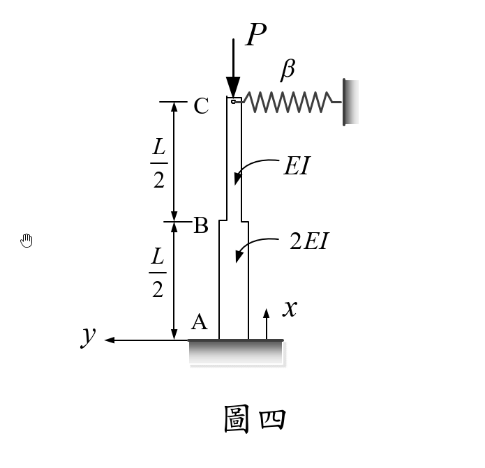

# 考題編號：MM-2021-4

**主分類：** `MM-U3-4` 柱之挫屈載重分析
**副分類：** 無
**分析法：** 彈性分析
**標籤：** `非等截面柱` `微分方程法` `彈簧支撐` `靜不定挫屈` `步進柱` `挫屈方程式` `行列式`

---

## 1. 原始題目重述 (Problem Restatement)

如圖四所示，一長為 $L$ 之非等截面彈性立柱 $ABC$：

- **A 端**（底部）：固定端（固定，Fixed）
- **B 點**（中點，$x = L/2$）：斷面性質變化點
- **C 端**（頂部，$x = L$）：連接一水平線彈簧，彈力常數為 $\beta$；同時承受垂直軸壓力 $P$

斷面彎曲勁度：
- 下半段 $AB$（$0 \le x \le L/2$）：$2EI$
- 上半段 $BC$（$L/2 \le x \le L$）：$EI$

**試以微分方程的方法推導此立柱之挫屈方程式（buckling equation），答案以行列式表之即可。**



*圖說：立柱高 L，以 x 為垂直坐標（向上為正），A 在 x=0（固定端），B 在 x=L/2（勁度變化點），C 在 x=L（自由頂端，連接水平彈簧 β，軸向荷重 P 向下作用）。y 為水平撓度。*

---

## 2. 考題核心精神與出題者意圖 (Core Concepts & Examiner's Intent)

**核心觀念：** 連續型（differential equation）挫屈分析——非等截面柱的 ODE 推導、步進斷面連續條件、彈簧端點的邊界條件處理。

**出題者測驗的能力：**

1. **ODE 建立**：能正確寫出各段的彎矩–曲率微分方程式（含特解的推導）
2. **邊界條件**：固定端的 $y=0, y'=0$；頂端有彈簧但無外力矩 $M(L)=0$
3. **連續條件**：勁度跳變點 $B$ 處的撓度、斜率、彎矩連續性辨析（能否正確識別哪些是獨立條件）
4. **行列式表達**：將超定方程組整理成行列式形式

**陷阱：**
- 誤以為 $y_2''(L) = 0$ 提供兩個獨立 BC（實際上頂端剪力條件自動滿足）
- 誤以為 $B$ 點的彎矩連續條件與撓度連續條件是獨立的（對本題而言等價）
- 特解推導錯誤（遺漏 $-\beta(L-x)/P$ 項）
- 行列式維度設定錯誤（正確為 $3\times3$ 相容條件）

---

## 3. 解題戰略地圖與陷阱分析 (Strategic Roadmap & Trap Analysis)

**戰略地圖（5步）：**

```
Step 1：建立兩段 ODE
        → 由截面法（自由體上方）列出彎矩 M(x) 表達式
        → 代入 EI·y'' = M(x) 得各段非齊次 ODE

Step 2：求各段通解（齊次 + 特解）
        → 特解 yp = yC·[1 - β(L-x)/P]（驗算確認）
        → 各段含 2 個積分常數：AB 段 (A,B)，BC 段 (C,D)

Step 3：代入固定端邊界條件（x=0）
        → y₁(0) = 0 → 求 A
        → y₁'(0) = 0 → 求 B
        → A, B 均用 yC 表達（正規化 yC=1）

Step 4：建立連續條件（x=L/2）與頂端條件
        → 撓度連續 y₁(L/2) = y₂(L/2)  → Eq.(I)
        → 斜率連續 y₁'(L/2) = y₂'(L/2) → Eq.(II)
        → 頂端條件 y₂(L) = yC = 1       → Eq.(III)

Step 5：三個方程 (I)(II)(III) 對兩個未知數 C,D → 超定系統
        → 相容條件 = 擴增矩陣行列式 = 0
        → 即挫屈方程式
```

**關鍵陷阱清單：**

| 陷阱 | 問題 | 正確做法 |
|------|------|----------|
| ⚠ 特解形式 | 直接猜 $y_p = \text{const}$ | $y_p = y_C[1 - \beta(L-x)/P]$ 含線性項 |
| ⚠ 頂端獨立 BC 數量 | 以為有 2 個（彎矩＋剪力） | $M(L)=0$ 自動滿足；剪力 BC 也自動滿足；只有 $y_2(L)=y_C$ 是有效條件 |
| ⚠ $B$ 點彎矩連續 | 以為是第 3 個獨立條件 | 對本題等價於撓度連續，不增加獨立方程 |
| ⚠ 行列式維度 | 設置 $4\times4$ | 正確為 $3\times3$（三方程二未知→增廣矩陣） |

---

## 3.5 變數層次分析 (Variable Hierarchy Analysis)

> 複習提示：第一次解題後，在每個卡住的知識點旁標記 `⚠`；第二次複習時只看有 `⚠` 的項目。

### 最終目標

以微分方程法推導出含 $k_1, k_2, \beta, L, P$ 的挫屈超越方程式，並以 $3\times3$ 行列式表達。

### 本題關鍵公式（依計算順序）

**Step 1**｜定義波數（由勁度）：
$$k_1 = \sqrt{\frac{P}{2EI}}, \quad k_2 = \sqrt{\frac{P}{EI}} = \sqrt{2}\,k_1$$

**Step 2**｜各段 ODE（自由體上方，$y_C = y(L)$）：
$$2EI\,y_1'' + P\,y_1 = y_C\bigl[P - \beta(L-x)\bigr] \quad (0 \le x \le L/2)$$
$$EI\,y_2'' + P\,y_2 = y_C\bigl[P - \beta(L-x)\bigr] \quad (L/2 \le x \le L)$$

**Step 3**｜特解（對兩段均相同）：
$$y_p = y_C\!\left[1 - \frac{\beta(L-x)}{P}\right]$$

**Step 4**｜通解：
$$y_1(x) = A\cos(\boxed{k_1}x) + B\sin(\boxed{k_1}x) + y_C\!\left[1 - \frac{\beta(L-x)}{P}\right]$$
$$y_2(x) = C\cos(\boxed{k_2}x) + D\sin(\boxed{k_2}x) + y_C\!\left[1 - \frac{\beta(L-x)}{P}\right]$$

**Step 5**｜固定端 BCs（$x=0$，正規化 $y_C = 1$）：
$$\boxed{A} = \frac{\beta L}{P} - 1, \quad \boxed{B} = -\frac{\beta}{k_1 P}$$

**Step 6**｜定義 $R_1, R_2$（連續條件右端項）：
$$R_1 = \left(\frac{\beta L}{P}-1\right)\cos\frac{k_1 L}{2} - \frac{\beta}{k_1 P}\sin\frac{k_1 L}{2}$$
$$R_2 = -\left(\frac{\beta L}{P}-1\right)k_1\sin\frac{k_1 L}{2} - \frac{\beta}{P}\cos\frac{k_1 L}{2}$$

**Step 7**｜挫屈方程（$3\times3$ 行列式 $= 0$）：
$$\begin{vmatrix} \cos\dfrac{k_2 L}{2} & \sin\dfrac{k_2 L}{2} & \boxed{R_1} \\[6pt] -k_2\sin\dfrac{k_2 L}{2} & k_2\cos\dfrac{k_2 L}{2} & \boxed{R_2} \\[6pt] \cos(k_2 L) & \sin(k_2 L) & 0 \end{vmatrix} = 0$$

### L1：題目直接給定

| 符號 | 數值 | 說明 |
|------|------|------|
| $L$ | — | 柱總長 |
| $EI$ | — | 上半段（BC）彎曲勁度 |
| $2EI$ | — | 下半段（AB）彎曲勁度 |
| $\beta$ | — | C 端水平彈簧彈力常數 |
| $P$ | — | 軸壓荷重（待求臨界值） |

### L2：需知識點推導

**波數定義**

| 符號 | 公式／來源 | 卡關? |
|------|-----------|-------|
| $k_1$ | $k_1^2 = P/(2EI)$ | |
| $k_2$ | $k_2^2 = P/EI$，$k_2 = \sqrt{2}k_1$ | |

**彎矩與 ODE**

| 符號 | 公式／來源 | 卡關? |
|------|-----------|-------|
| $M(x)$ | 截面上方自由體：$P(y_C - y) - \beta y_C(L-x)$ | |
| AB 段 ODE | $2EI\,y_1'' = M_1$ | |
| BC 段 ODE | $EI\,y_2'' = M_2$ | |

**特解推導**

| 符號 | 公式／來源 | 卡關? |
|------|-----------|-------|
| $y_p$ | 試 $y_p = y_C(a+bx)$，比對係數得 $a = 1-\beta L/P, b = \beta/P$ | |
| 驗算 | $y_p'' = 0$，$k_i^2 y_p$ 比對 RHS ✓ | |

**邊界條件（固定端）**

| 符號 | 公式／來源 | 卡關? |
|------|-----------|-------|
| $A$ | $y_1(0)=0$：$A = \beta L/P - 1$ | |
| $B$ | $y_1'(0)=0$：$B = -\beta/(k_1 P)$ | |

**頂端條件（自動滿足的確認）**

| 條件 | 來源 | 卡關? |
|------|------|-------|
| $M(L)=0$ | $P(y_C-y_C) - \beta y_C \cdot 0 = 0$ ✓ | |
| 剪力條件 | $EI k_2^3 - P k_2 = 0$ ✓（因 $EI k_2^2 = P$） | |
| 有效頂端 BC | 只有 $y_2(L) = y_C$ | |

### L3：深層知識（不懂就卡住）

| 知識點 | 說明 | 卡關? |
|--------|------|-------|
| 截面上方自由體列彎矩 | 需包含 $P$ 的幾何非線性項與彈簧力矩 | |
| 特解的必要性 | ODE 非齊次（RHS $\ne 0$），必須加特解 | |
| 彎矩連續⟺撓度連續（本題） | $2EI k_1^2 = EI k_2^2 = P$，故 $M = EI_i k_i^2 y_{\text{hom}}$ 兩段等值 iff 撓度齊次項相等 | |
| 超定系統相容性 | 3方程2未知→增廣矩陣（$3\times3$）的行列式 $= 0$ | |
| $k_2 = \sqrt{2}k_1$ 的意義 | 下段剛度為上段兩倍，波長比 $= 1/\sqrt{2}$ | |

---

## 4. 步驟化詳細計算過程 (Step-by-Step Detailed Calculation)

### Step 1：座標系與彎矩方程

設 $x$ 為自 A（底端）向上的坐標，$y(x)$ 為水平撓度（向右為正）。

在任意截面高度 $x$ 處，取**上方自由體**（長度 $L-x$），其上作用力為：
- 頂端軸壓 $P$（向下），作用點水平位置 $y_C = y(L)$
- 頂端彈簧力 $\beta y_C$（水平，向左）

對截面點取彎矩（正號使柱向右彎曲）：

$$\boxed{M(x) = P\bigl[y_C - y(x)\bigr] - \beta y_C (L - x)}$$

驗算頂端：$M(L) = P(y_C - y_C) - 0 = 0$ ✓（頂端無外力矩）

---

### Step 2：兩段微分方程

利用 $EI\,y'' = M(x)$，各段方程整理為：

**AB 段**（$0 \le x \le L/2$，勁度 $2EI$）：

$$2EI\,y_1'' + P\,y_1 = y_C\bigl[P - \beta(L-x)\bigr]$$

$$y_1'' + k_1^2\,y_1 = \frac{y_C}{2EI}\bigl[P - \beta(L-x)\bigr] \quad \text{其中 } k_1^2 = \frac{P}{2EI}$$

**BC 段**（$L/2 \le x \le L$，勁度 $EI$）：

$$EI\,y_2'' + P\,y_2 = y_C\bigl[P - \beta(L-x)\bigr]$$

$$y_2'' + k_2^2\,y_2 = \frac{y_C}{EI}\bigl[P - \beta(L-x)\bigr] \quad \text{其中 } k_2^2 = \frac{P}{EI} = 2k_1^2$$

注意：**$k_2 = \sqrt{2}\,k_1$**

---

### Step 3：特解

兩段 ODE 的右端項結構相同，特解形式一致。試 $y_p = y_C(a + bx)$：

$$y_p'' = 0, \quad k_i^2\,y_p = k_i^2\,y_C(a+bx)$$

RHS（以 AB 段為例）：$\dfrac{y_C}{2EI}[P - \beta(L-x)] = k_1^2 y_C\left[1 - \frac{\beta(L-x)}{P}\right]$

比對係數：$a = 1 - \dfrac{\beta L}{P}$，$b = \dfrac{\beta}{P}$

$$\boxed{y_p(x) = y_C\!\left[1 - \frac{\beta(L-x)}{P}\right]}$$

（BC 段代入 $k_2^2 = P/EI$ 驗算同樣成立 ✓）

---

### Step 4：各段通解

$$y_1(x) = A\cos(k_1 x) + B\sin(k_1 x) + y_C\!\left[1 - \frac{\beta(L-x)}{P}\right] \quad (0 \le x \le L/2)$$

$$y_2(x) = C\cos(k_2 x) + D\sin(k_2 x) + y_C\!\left[1 - \frac{\beta(L-x)}{P}\right] \quad (L/2 \le x \le L)$$

共 4 個積分常數 $A, B, C, D$（以 $y_C$ 為振幅，下方正規化為 $y_C = 1$）。

---

### Step 5：固定端邊界條件（x = 0）

**BC-1** $y_1(0) = 0$：

$$A + \left(1 - \frac{\beta L}{P}\right) = 0 \implies \boxed{A = \frac{\beta L}{P} - 1}$$

**BC-2** $y_1'(0) = 0$：

$$y_1'(x) = -Ak_1\sin(k_1 x) + Bk_1\cos(k_1 x) + \frac{\beta}{P}$$

$$Bk_1 + \frac{\beta}{P} = 0 \implies \boxed{B = -\frac{\beta}{k_1 P}}$$

---

### Step 6：頂端條件分析（x = L）

**彎矩條件** $M(L) = EI\,y_2''(L) = 0$：

由 Step 1 已知 $M(L) = 0$ 自動成立，因此：

$$y_2''(L) = -Ck_2^2\cos(k_2 L) - Dk_2^2\sin(k_2 L) = 0$$

$$\implies \boxed{C\cos(k_2 L) + D\sin(k_2 L) = 0} \tag{III}$$

**剪力條件**驗算（確認不增加獨立方程）：

利用 $EIy_2'''(L) + Py_2'(L) = \beta y_C$，代入得係數 $(EIk_2^3 - Pk_2) = 0$（因 $EIk_2^2 = P$），故剪力條件自動成立，不提供新信息。

**撓度 BC**：$y_2(L) = y_C = 1$（已含於通解架構中，由 Eq.(III) 描述其齊次部分）。

---

### Step 7：B 點連續條件（x = L/2）

設 $\alpha_1 = k_1 L/2$，$\alpha_2 = k_2 L/2$。

**撓度連續**（同時等價於彎矩連續，見下方說明）：

$$A\cos\alpha_1 + B\sin\alpha_1 = C\cos\alpha_2 + D\sin\alpha_2 \tag{I}$$

**彎矩連續說明：**
- $M_B = 2EI\,y_1''(L/2) = EI\,y_2''(L/2)$
- 展開後：$-2EIk_1^2[A\cos\alpha_1 + B\sin\alpha_1] = -EIk_2^2[C\cos\alpha_2 + D\sin\alpha_2]$
- 由於 $2EIk_1^2 = P = EIk_2^2$，化簡後即為 Eq.(I) → **彎矩連續 ≡ 撓度連續（本題）**

**斜率連續**：

$$y_1'(L/2) = y_2'(L/2)$$

$$-Ak_1\sin\alpha_1 + Bk_1\cos\alpha_1 = -Ck_2\sin\alpha_2 + Dk_2\cos\alpha_2 \tag{II}$$

---

### Step 8：挫屈行列式

定義右端項（以 $y_C = 1$ 正規化）：

$$R_1 = A\cos\alpha_1 + B\sin\alpha_1 = \left(\frac{\beta L}{P}-1\right)\cos\frac{k_1 L}{2} - \frac{\beta}{k_1 P}\sin\frac{k_1 L}{2}$$

$$R_2 = -Ak_1\sin\alpha_1 + Bk_1\cos\alpha_1 = -\left(\frac{\beta L}{P}-1\right)k_1\sin\frac{k_1 L}{2} - \frac{\beta}{P}\cos\frac{k_1 L}{2}$$

三個方程 (I)(II)(III) 對兩個未知數 $(C, D)$ 構成超定系統：

$$\text{(I)：} C\cos\alpha_2 + D\sin\alpha_2 = R_1$$

$$\text{(II)：} -Ck_2\sin\alpha_2 + Dk_2\cos\alpha_2 = R_2$$

$$\text{(III)：} C\cos(k_2 L) + D\sin(k_2 L) = 0$$

此超定系統有解的相容條件，即**挫屈方程式**：

$$\boxed{
\begin{vmatrix}
\cos\dfrac{k_2 L}{2} & \sin\dfrac{k_2 L}{2} & R_1 \\[8pt]
-k_2\sin\dfrac{k_2 L}{2} & k_2\cos\dfrac{k_2 L}{2} & R_2 \\[8pt]
\cos(k_2 L) & \sin(k_2 L) & 0
\end{vmatrix} = 0
}$$

其中：

$$k_1 = \sqrt{\frac{P}{2EI}}, \quad k_2 = \sqrt{\frac{P}{EI}} = \sqrt{2}\,k_1$$

$$R_1 = \left(\frac{\beta L}{P}-1\right)\cos\frac{k_1 L}{2} - \frac{\beta}{k_1 P}\sin\frac{k_1 L}{2}$$

$$R_2 = -\left(\frac{\beta L}{P}-1\right)k_1\sin\frac{k_1 L}{2} - \frac{\beta}{P}\cos\frac{k_1 L}{2}$$

---

### 驗算：展開行列式得等效純量方程

沿第三列展開後化簡（利用 $\cos(k_2 L) = \cos(2\alpha_2)$ 等角度恆等式），可得等效純量形式：

$$R_1\cos\frac{k_2 L}{2} + \frac{R_2}{k_2}\sin\frac{k_2 L}{2} = 0$$

亦即：

$$\left[\left(\frac{\beta L}{P}-1\right)\cos\frac{k_1 L}{2} - \frac{\beta}{k_1 P}\sin\frac{k_1 L}{2}\right]\cos\frac{k_2 L}{2}$$

$$-\,\frac{1}{k_2}\left[\left(\frac{\beta L}{P}-1\right)k_1\sin\frac{k_1 L}{2} + \frac{\beta}{P}\cos\frac{k_1 L}{2}\right]\sin\frac{k_2 L}{2} = 0$$

**特例驗算** $\beta = 0$（無彈簧，純固定端-自由端步進柱）：

令 $\beta = 0$，$R_1 = -\cos(k_1 L/2)$，$R_2 = k_1\sin(k_1 L/2)$，代入純量方程：

$$\cos\frac{k_2 L}{2}\cos\frac{k_1 L}{2} - \frac{k_1}{k_2}\sin\frac{k_2 L}{2}\sin\frac{k_1 L}{2} = 0$$

令 $u = k_1 L/2$（$k_2 = \sqrt{2}k_1$ 故 $k_2 L/2 = \sqrt{2}\,u$）：

$$\cos(\sqrt{2}\,u)\cos u = \frac{1}{\sqrt{2}}\sin(\sqrt{2}\,u)\sin u$$

此為非等截面懸臂柱（下段剛度兩倍）的挫屈超越方程式，物理上合理 ✓

---

## 5. 關鍵爭議點與進階探討 (Critical Issues & Advanced Discussion)

### 5.1 B 點彎矩連續條件的特殊等價性

本題最重要的數學洞察：$M$ 連續 ⟺ 撓度齊次部分連續（Eq.(I)），原因在於：

$$2EI \cdot k_1^2 = P = EI \cdot k_2^2$$

即兩段的 $EI_i \cdot k_i^2$ 均等於 $P$，使彎矩連續自動化約為撓度連續。**若兩段勁度不具此比例關係，彎矩連續條件將是獨立的第三個方程，屆時系統將升階為 $4 \times 4$ 行列式。**

### 5.2 頂端彈簧的 BC 處理

彈簧在頂端提供水平力，不提供彎矩。因此：
- **有效的 BC**：$y_2(L) = y_C$（自由撓度）
- **彎矩 BC**：$M(L) = 0$（自動成立）
- **剪力 BC**：$EI_2 y_2''' + P y_2' = \beta y_C$（自動成立，因 $EI_2 k_2^2 = P$）

若頂端改為固定端（$y_C = 0, y_C' = 0$），系統將完全不同，需重新設置。

### 5.3 行列式求解方向

考場上「答案以行列式表之即可」表示不必展開求根。若需數值解，需對 $P$ 進行迭代（因 $k_1, k_2, R_1, R_2$ 均含 $P$）。使用無因次化參數 $\lambda = k_1 L/2 = (L/2)\sqrt{P/(2EI)}$ 可簡化求解。

### 5.4 工程意涵

彈簧 $\beta$ 的存在提高了臨界荷重（側向約束增加穩定性）。當 $\beta \to \infty$（剛性側移約束，C 端固定），頂端轉化為固定-固定型支撐，有效長度降為 $L/2$，$P_{cr} \to \pi^2(2EI)/(L/2)^2 = 8\pi^2 EI/L^2$（下段控制）。
