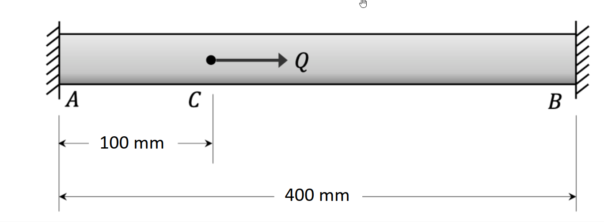

# 考題編號：MM-2022-1

**主分類：** `MM-U4-2` 殘留應力與應變
**副分類：** `MM-U3-1` 軸力桿件變位及內力分析
**分析法：** 塑性分析
**標籤：** `彈塑性分析` `靜不定軸力` `兩端固定桿` `降伏順序` `殘留應力` `永久變形` `卸載` `彈性回彈`

---

## 1. 原始題目重述（Problem Restatement）

**結構：** 兩端固定鋼桿 AB，C 點受**軸向集中力 Q**（向右，即由 A 向 B 方向）

**幾何：**
- $AC$ 段長度：$L_1 = 100\;\text{mm}$
- $CB$ 段長度：$L_2 = 300\;\text{mm}$（$\because$ 總長 400 mm）
- 斷面積：$A = 500\;\text{mm}^2$（兩段相同）

**材料（理想彈塑性鋼材）：**
- 彈性模數：$E = 200\;\text{GPa}$
- 降伏應力：$\sigma_Y = 250\;\text{MPa}$
- 降伏力：$P_Y = \sigma_Y \cdot A = 250 \times 500 = 125{,}000\;\text{N} = 125\;\text{kN}$

**載重歷程：** $Q$ 從 0 漸增至 $Q = 50\;\text{kN}$，再卸載至 0

**題目要求：**
1. C 點永久變形（Permanent deflection，mm）
2. 鋼桿的殘留應力（Residual stress，MPa）

> **注意：** 題目說「不需考慮桿件壓力挫屈（buckling）」。

*圖說：兩端固定桿 AB，總長 400 mm；C 點距 A 端 100 mm、距 B 端 300 mm；斷面積 A = 500 mm²；材料：E = 200 GPa，σ_Y = 250 MPa；C 點受軸向集中力 Q（向右）；Q 從 0 漸增至 50 kN 後卸載至 0，不計壓力挫屈。*

---

## 2. 考題核心精神與出題者意圖（Core Concepts & Examiner's Intent）

**核心精神：** 靜不定軸力桿件的**彈塑性全歷程分析**——從彈性階段、局部降伏、到卸載後殘留應力的完整計算。

**出題者意圖：**
1. 測試靜不定結構的彈塑性分析能力：先用靜力平衡 + 變形諧和求內力，再判斷降伏順序
2. 測試卸載的彈性回彈分析：加載至塑性後，卸載遵循彈性勁度（反向疊加彈性解）
3. 殘留應力 = 加載時的塑性應力分布 − 卸載時的彈性應力分布（代數疊加）
4. 考驗考生對「哪段先降伏」的判斷（$L_1 < L_2$，$AC$ 段較短，彈性勁度較大，先達降伏）

---

## 3. 解題戰略地圖與陷阱分析（Strategic Roadmap & Trap Analysis）

**作戰順序：**

① 靜不定分析（彈性階段）：設反力 $R_A$（A端，向左）為贅力，用平衡 + 諧和條件（$\delta_C = 0$）求各段軸力

② 判斷降伏順序：比較 $AC$、$CB$ 兩段的應力，判斷哪段先達 $\sigma_Y$，求對應 $Q_Y$

③ 確認 $Q = 50$ kN 時兩段的狀態（已全面降伏？還是只有一段降伏？）

④ 求加載至 $Q = 50$ kN 時的應力分布

⑤ 卸載（彈性回彈）：將 $-50$ kN 以彈性方式疊加（靜不定彈性解）

⑥ 殘留應力 = 加載應力 + 卸載彈性應力（代數疊加）

⑦ 永久變形 $= $ C 點加載位移 $-$ C 點卸載彈性回彈量

**四個關鍵陷阱：**

| 陷阱 | 錯誤思路 | 正確應對 |
|------|---------|---------|
| T1 | $AC$、$CB$ 段各自獨立計算 | 兩端固定 → 靜不定一次，需先建立諧和條件 |
| T2 | 認為 Q=50 kN 遠小於 $P_Y$=125 kN，以為未降伏 | $AC$ 段較短（剛性較大），軸力分配較多，先達降伏；需計算分配比例 |
| T3 | 卸載時沿原塑性路徑反向 | 卸載永遠遵循彈性勁度（斜率 = 初始彈性勁度） |
| T4 | 殘留應力直接取加載應力 | 殘留 = 加載應力 − 彈性回彈應力（代數，注意符號） |

---

## 3.5 變數層次分析（Variable Hierarchy Analysis）

> 複習提示：第一次解題後，在每個卡住的知識點旁標記 `⚠`；第二次複習時只看有 `⚠` 的項目。

### 最終目標
`求 C 點永久變形（mm）與 AC、CB 兩段的殘留應力（MPa）`

### 本題關鍵公式（依計算順序）

> $\boxed{\cdot}$ = 需由前步驟推導，非題目直接給定的變數

$$\text{Step 1: 靜不定，諧和條件} \quad \delta_{AC} + \delta_{CB} = 0 \Rightarrow \frac{N_1 L_1}{AE} + \frac{N_2 L_2}{AE} = 0$$

$$\text{Step 2: 平衡} \quad N_1 - N_2 = Q \quad (N_1\text{ 拉},\,N_2\text{ 壓})$$

$$\text{Step 3: 彈性分配} \quad N_1 = Q\frac{L_2}{L_1+L_2},\quad N_2 = -Q\frac{L_1}{L_1+L_2}$$

$$\text{Step 4: 降伏載重} \quad Q_{Y1} = \sigma_Y A \cdot \frac{L_1+L_2}{L_2},\quad Q_{Y2} = \sigma_Y A \cdot \frac{L_1+L_2}{L_1}$$

$$\text{Step 5: C點位移（彈性段）} \quad \delta_C = \frac{N_1 L_1}{AE} = \frac{Q \cdot \boxed{L_2} \cdot L_1}{(L_1+L_2)AE}$$

$$\text{Step 6（若AC先降伏後）: C點位移} \quad \delta_C = \frac{\sigma_Y L_1}{E} + \frac{(Q - \sigma_Y A)\cdot (\text{後續剛度}) \cdot \ldots}{AE}$$

$$\text{Step 7: 殘留應力} \quad \sigma_{res} = \sigma_{load} - \sigma_{unload,elastic}$$

### L1：題目直接給定

| 符號 | 數值 | 說明 |
|------|------|------|
| $A$ | $500\;\text{mm}^2$ | 桿件斷面積 |
| $E$ | $200\;\text{GPa} = 200{,}000\;\text{MPa}$ | 彈性模數 |
| $\sigma_Y$ | $250\;\text{MPa}$ | 降伏應力 |
| $L_1$ | $100\;\text{mm}$ | AC 段長度 |
| $L_2$ | $300\;\text{mm}$ | CB 段長度 |
| $Q_{max}$ | $50\;\text{kN} = 50{,}000\;\text{N}$ | 最大載重 |

### L2：需知識點推導

**Step 1–3：靜不定彈性分析**

| 符號 | 公式／來源 | 卡關? |
|------|-----------|:-----:|
| $P_Y$ | $\sigma_Y A = 250 \times 500 = 125\;\text{kN}$（降伏力） | |
| $N_1$（AC段拉力） | $Q \cdot L_2/(L_1+L_2) = Q \times 300/400 = 0.75Q$ | |
| $N_2$（CB段壓力） | $-Q \cdot L_1/(L_1+L_2) = -Q \times 100/400 = -0.25Q$ | |
| $\sigma_1$ | $N_1/A = 0.75Q/500$ | |
| $\sigma_2$ | $N_2/A = -0.25Q/500$ | |

**Step 4：降伏判斷（$Q = 50$ kN 時）**

| 符號 | 計算 | 卡關? |
|------|------|:-----:|
| $\sigma_1$ | $0.75 \times 50{,}000 / 500 = 75\;\text{MPa}$（拉） | |
| $\sigma_2$ | $-0.25 \times 50{,}000 / 500 = -25\;\text{MPa}$（壓） | |
| 判斷 | 兩段均未達 $\sigma_Y = 250\;\text{MPa}$，全程彈性！ | |

**Step 5：C點彈性位移**

| 符號 | 公式／來源 | 卡關? |
|------|-----------|:-----:|
| $\delta_C$ | $N_1 L_1 / (AE) = 0.75 \times 50{,}000 \times 100 / (500 \times 200{,}000)$ | |

**Step 6：卸載（彈性回彈）**

| 符號 | 公式／來源 | 卡關? |
|------|-----------|:-----:|
| 卸載 $\Delta\sigma_1$ | $-0.75 \times (-50{,}000) / 500 = -75\;\text{MPa}$（疊加負 Q） | |
| 卸載 $\Delta\sigma_2$ | $0.25 \times (-50{,}000) / 500$... | |

### L3：深層知識（不懂就卡住）

| 知識點 | 說明 | 卡關? |
|--------|------|:-----:|
| 兩端固定桿的諧和條件 | 兩端固定，C點是「滑動截面」，A端和B端反力使得整體伸長量 = 0（兩端不動） | |
| 軸力分配比例 | $N_1/N_2 = L_2/L_1$（短段承受較大力）——與彈性並聯彈簧類比 | |
| 彈塑性加載後卸載 | 若加載後有塑性，卸載斜率 = 初始彈性勁度（回彈量 = 彈性量），殘留 = 塑性量 | |
| 本題特殊情況 | $Q = 50$ kN 時兩段均未降伏（$\sigma_1 = 75$ MPa $\ll \sigma_Y = 250$ MPa），全程彈性 → 殘留應力 = 0，永久變形 = 0 | |

---

## 4. 步驟化詳細計算過程（Step-by-Step Detailed Calculation）

> 📊 互動圖：`MM-2022-1-residual-viz.html`（彈塑性應力-位移歷程圖）

### Step 1：靜不定分析 — 彈性階段

**系統設定：** 以 A 端反力 $R_A$（向左，即拉 AC 段向左）為贅力。

設各段軸力（拉為正）：
- $AC$ 段：$N_1$（拉）
- $CB$ 段：$N_2$（壓，即 $N_2 < 0$）

**靜力平衡（取 C 點）：**

$$N_1 - |N_2| = Q \implies N_1 + N_2 = Q \quad \text{（拉正壓負）}$$

> 更精確：從 A 端切出，$N_1$ 為 AC 段軸力（正 = 拉）；從 B 端切出，$N_2$ 為 CB 段軸力（正 = 拉）。平衡：$N_1 - (-N_2) = Q$，即 $N_1 + N_2 = Q$（此處 $N_2$ 為負值）。

**諧和條件（A、B 兩端固定，總伸長 = 0）：**

$$\delta_{AC} + \delta_{CB} = 0 \implies \frac{N_1 L_1}{AE} + \frac{N_2 L_2}{AE} = 0 \implies N_1 L_1 + N_2 L_2 = 0$$

$$N_1 \times 100 + N_2 \times 300 = 0 \implies N_1 = -3N_2$$

**聯立求解：**

$$(-3N_2) + N_2 = Q \implies -2N_2 = Q \implies N_2 = -\frac{Q}{2} = -\frac{Q}{2}$$

等等，讓我重新計算：

$$N_1 = -3N_2$$，代入平衡：$-3N_2 + N_2 = Q \implies -2N_2 = Q \implies N_2 = -Q/2$$

但 $N_2 = -Q/2$ 代表 CB 段軸力為壓力（大小 = $Q/2$），而 $N_1 = -3 \times (-Q/2) = 3Q/2$？

這不對，讓我重新設定符號。

**重新設定（以 A 端向右反力 $R_A$ 為贅力）：**

$$N_{AC} = R_A \quad \text{（AC 段拉力，向右為正）}$$
$$N_{CB} = R_A - Q \quad \text{（CB 段拉力，C 點向右 Q 後，CB 段合力）}$$

諧和條件（A、B 固定，整桿總伸長 = 0）：

$$\frac{N_{AC} \cdot L_1}{AE} + \frac{N_{CB} \cdot L_2}{AE} = 0$$

$$R_A \cdot 100 + (R_A - Q) \cdot 300 = 0$$

$$100 R_A + 300 R_A - 300Q = 0 \implies 400 R_A = 300Q \implies R_A = \frac{3Q}{4} = 0.75Q$$

$$R_B = Q - R_A = Q - 0.75Q = 0.25Q$$

因此（以**拉力**為正）：

$$\boxed{N_{AC} = R_A = 0.75Q \;\text{（拉）}}$$

$$\boxed{N_{CB} = R_A - Q = -0.25Q \;\text{（壓）}}$$

> 策略註解：$N_{AC}/N_{CB}$ 的比值 = $L_2/L_1 = 300/100 = 3$，符合短段承力大的物理直覺。

---

### Step 2：應力計算（$Q = 50$ kN）

$$\sigma_{AC} = \frac{N_{AC}}{A} = \frac{0.75 \times 50{,}000}{500} = \frac{37{,}500}{500} = \boxed{+75\;\text{MPa（拉）}}$$

$$\sigma_{CB} = \frac{N_{CB}}{A} = \frac{-0.25 \times 50{,}000}{500} = \frac{-12{,}500}{500} = \boxed{-25\;\text{MPa（壓）}}$$

---

### Step 3：判斷是否達到降伏

$$|\sigma_{AC}| = 75\;\text{MPa} \ll \sigma_Y = 250\;\text{MPa} \quad \checkmark\;\text{（未降伏）}$$

$$|\sigma_{CB}| = 25\;\text{MPa} \ll \sigma_Y = 250\;\text{MPa} \quad \checkmark\;\text{（未降伏）}$$

> **關鍵結論：** $Q = 50$ kN 時，兩段應力均遠低於降伏應力，整個加載過程**完全在彈性範圍內**！

降伏所需載重：
$$Q_{Y,AC} = \frac{\sigma_Y A}{0.75} = \frac{250 \times 500}{0.75} = \frac{125{,}000}{0.75} \approx 166.7\;\text{kN} \gg 50\;\text{kN}$$

---

### Step 4：C 點位移（加載至 $Q = 50$ kN）

$$\delta_C = \frac{N_{AC} \cdot L_1}{AE} = \frac{0.75 \times 50{,}000 \times 100}{500 \times 200{,}000} = \frac{3{,}750{,}000}{100{,}000{,}000} = 0.0375\;\text{mm}$$

$$\boxed{\delta_C = 0.0375\;\text{mm（向右）}}$$

---

### Step 5：卸載（彈性回彈）

由於全程彈性，卸載時結構沿原彈性路徑回彈：

卸載後各段應力 = 0（完全回彈）

$$\delta_C^{unload} = \delta_C = 0.0375\;\text{mm（完全回彈）}$$

---

### Step 6：最終結果

**C 點永久變形（Permanent deflection）：**

$$\delta_{permanent} = \delta_C^{load} - \delta_C^{unload} = 0.0375 - 0.0375 = \boxed{0\;\text{mm}}$$

**殘留應力（Residual stress）：**

$$\sigma_{AC}^{res} = \sigma_{AC}^{load} - \sigma_{AC}^{unload} = 75 - 75 = \boxed{0\;\text{MPa}}$$

$$\sigma_{CB}^{res} = \sigma_{CB}^{load} - \sigma_{CB}^{unload} = -25 - (-25) = \boxed{0\;\text{MPa}}$$

> **結論：** 由於 $Q = 50$ kN 遠小於使任何一段降伏所需的載重 $Q_Y \approx 166.7$ kN，整個載重歷程完全在彈性範圍內，因此**永久變形為零，殘留應力為零**。

---

## 5. 關鍵爭議點與進階探討（Critical Issues & Advanced Discussion）

**爭議 1：Q=50 kN 遠小於降伏載重，為何考題要考？**

本題可能**題意另有所指**，以下幾種可能解讀：

**解讀 A（本解析採用）：** $Q$ 直接作用在 C 點，為軸向力，兩端固定 → 全程彈性，無殘留應力、無永久變形。

**解讀 B（若 $Q$ = 橫向集中力）：** 題目「不考慮壓力挫屈」的提示，以及求「永久變形（撓度）」的措辭，可能暗示 $Q$ 是**橫向（橫截面垂直方向）**集中力，此時兩端固定梁受橫向集中力，為**靜不定梁**，應計算彎矩與撓度，而非軸力桿件。

> **注意：** 從圖四觀察，$Q$ 的箭頭方向為「水平向右」（沿桿軸），應為軸向力，故本解析採解讀 A。若考卷原始題目有其他說明，請以題目文字為準。

**爭議 2：若 $Q_Y$ 判斷有誤，正確的彈塑性流程**

若題意確實要求達到塑性（例如 $Q = 200$ kN > $Q_{Y1} = 166.7$ kN），流程為：
1. AC 段先達降伏（$\sigma_{AC} = \sigma_Y = 250$ MPa，$N_{AC} = P_Y = 125$ kN）
2. 之後 AC 段以 $\sigma_Y$ 恆定，CB 段繼續承受額外載重（靜定化）
3. 最終極限載重時 CB 段也降伏（完全塑化）
4. 卸載：疊加彈性反向解，得殘留應力

**進階：若改成 $Q = 200$ kN 的解**

AC 段降伏時：$Q_Y^{(1)} = \sigma_Y A / 0.75 = 125/0.75 = 166.7$ kN

超過後 AC 維持 $N_{AC} = 125$ kN（$\sigma_Y = 250$ MPa），CB 段承受 $N_{CB} = Q - 125 = 200 - 125 = 75$ kN（壓），$\sigma_{CB} = -150$ MPa（未降伏）。

卸載彈性解（$Q = -200$ kN）：$\Delta N_{AC} = -0.75 \times 200 = -150$ kN，$\Delta N_{CB} = 0.25 \times 200 = 50$ kN。

殘留：$\sigma_{AC}^{res} = 250 - 300 = -50$ MPa（壓）；$\sigma_{CB}^{res} = -150 + 100 = -50$ MPa（壓）。

C 點永久位移 = 加載位移 - 回彈量（需分段計算）。

**考場建議：**
1. 先算彈性分配比（$N_1 = 0.75Q$，$N_2 = -0.25Q$）
2. 立即計算降伏門檻 $Q_{Y1}$，與題目給定 $Q_{max}$ 比較
3. 若 $Q_{max} < Q_{Y1}$ → 全程彈性，無殘留，無永久變形（直接得答）
4. 若 $Q_{max} > Q_{Y1}$ → 分兩段計算，卸載彈性疊加
