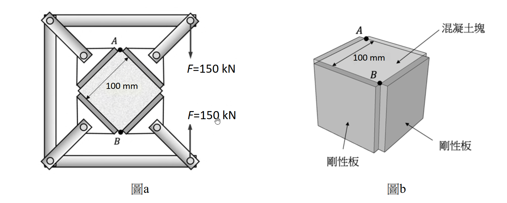

# 考題編號：MM-2022-2

**主分類：** `MM-U1-2` 虎克定律應用
**副分類：** `MM-U3-1` 軸力桿件變位及內力分析
**分析法：** 彈性分析
**標籤：** `三維應力狀態` `廣義虎克定律` `側向約束` `剛性板` `體積應變` `應變能` `平面應變條件` `混凝土塊`

---

## 1. 原始題目重述（Problem Restatement）

**結構：** 邊長 100 mm 的正立方體**混凝土塊**，安置於桁架中，A、B 兩點受**對壓力** $F = 150\;\text{kN}$（沿 AB 軸，即沿混凝土塊的對角線方向）。

**關鍵約束條件：** 混凝土塊的四個側面（垂直 AB 軸的四個面）均裝有**剛性板（rigid plates）**，使側向完全無法膨脹，即：

$$\varepsilon_{x} = 0,\quad \varepsilon_{z} = 0 \quad \text{（側向應變被剛性板完全約束）}$$

**材料性質（混凝土）：**
- 彈性模數：$E = 32\;\text{GPa}$
- 蒲松比：$\nu = 0.17$

**幾何：** 正立方體，邊長 $a = 100\;\text{mm} = 0.1\;\text{m}$，斷面積（AB 方向受壓）：

> AB 軸為正方形對角線方向，截面積 $A = a^2 = 100 \times 100 = 10{,}000\;\text{mm}^2 = 10^{-2}\;\text{m}^2$

**題目要求：**
1. 計算混凝土塊之**體積應變** $\Delta V / V$（mm³）
2. 計算混凝土塊之**應變能** $U$（焦耳，J）

*圖說：(圖a) 俯視圖，正立方體混凝土塊旋轉 45° 置於桁架框中，F=150 kN 從上方 A 點向下、從下方 B 點向上，沿正方形的對角線 AB 方向施壓；(圖b) 三維立體圖，混凝土塊（邊長 100 mm）的四個側面各夾有剛性板（rigid plates），使側向（垂直 AB 的 x 和 z 方向）應變完全被約束（ε_x = ε_z = 0）；A 點在頂面，B 點在底面；材料：E = 32 GPa，ν = 0.17。*

---

## 2. 考題核心精神與出題者意圖（Core Concepts & Examiner's Intent）

**核心精神：** 三維廣義虎克定律的應用——側向受剛性板約束（$\varepsilon_x = \varepsilon_z = 0$）時，需同時求解三個方向的應力，再計算體積應變和應變能。

**出題者意圖：**
1. 測試廣義虎克定律的三維聯立求解能力（三方程三未知）
2. 「剛性板約束 → 側向應變 = 0」的條件轉化（$\varepsilon = 0$ 不等於 $\sigma = 0$！）
3. 體積應變公式：$e = \varepsilon_x + \varepsilon_y + \varepsilon_z$
4. 應變能密度公式：$u = \frac{1}{2}(\sigma_x \varepsilon_x + \sigma_y \varepsilon_y + \sigma_z \varepsilon_z)$，對體積積分得 $U = u \cdot V$

**核心難點：** 剛性板不僅約束了形變，還會對混凝土塊產生**側向反力**（即 $\sigma_x \neq 0$，$\sigma_z \neq 0$）——這是大多數考生誤認為「側向應力 = 0」的陷阱。

---

## 3. 解題戰略地圖與陷阱分析（Strategic Roadmap & Trap Analysis）

**作戰順序：**

① 建立坐標系：$y$ 軸 = AB 軸（受壓方向），$x$、$z$ 軸 = 側向（被約束方向）

② 應力設定：$\sigma_y = -F/A$（已知，壓縮）；$\sigma_x = \sigma_z = \sigma_r$（未知側向反力，由對稱性相等）

③ 由約束條件 $\varepsilon_x = 0$ 代入廣義虎克定律，求 $\sigma_r$

④ 代入廣義虎克定律求 $\varepsilon_y$

⑤ 計算體積應變：$e = \varepsilon_x + \varepsilon_y + \varepsilon_z = 0 + \varepsilon_y + 0 = \varepsilon_y$，再乘以體積 $V$

⑥ 計算應變能：$U = \frac{1}{2V}\sum \sigma_i \varepsilon_i \times V$，或用應變能密度 $u$

**四個關鍵陷阱：**

| 陷阱 | 錯誤思路 | 正確應對 |
|------|---------|---------|
| T1 | 側向有剛性板 → $\sigma_x = \sigma_z = 0$ | 剛性板約束的是**應變**（$\varepsilon = 0$），而非應力；側向應力 ≠ 0 |
| T2 | 用單軸公式 $\varepsilon_y = \sigma_y / E$ | 三維應力狀態需用廣義虎克：$\varepsilon_y = [\sigma_y - \nu(\sigma_x+\sigma_z)]/E$ |
| T3 | 體積應變 $e = \varepsilon_y$（忽略另兩方向） | $e = \varepsilon_x + \varepsilon_y + \varepsilon_z$，此題 $\varepsilon_x = \varepsilon_z = 0$，所以 $e = \varepsilon_y$，結果相同但理由需完整 |
| T4 | 應變能 $U = F\delta/2$（只考慮外力做功的 y 方向） | $U = \frac{1}{2}(\sigma_y\varepsilon_y + \sigma_x\varepsilon_x + \sigma_z\varepsilon_z) \times V = \frac{1}{2}\sigma_y\varepsilon_y \times V$（因 $\varepsilon_x = \varepsilon_z = 0$） |

---

## 3.5 變數層次分析（Variable Hierarchy Analysis）

> 複習提示：第一次解題後，在每個卡住的知識點旁標記 `⚠`；第二次複習時只看有 `⚠` 的項目。

### 最終目標
`求正立方體混凝土塊（側面被剛性板完全約束）受壓 F=150 kN 時的體積應變 ΔV 與應變能 U`

### 本題關鍵公式（依計算順序）

> $\boxed{\cdot}$ = 需由前步驟推導，非題目直接給定的變數

$$\text{Step 1: 軸向應力} \quad \sigma_y = -\frac{F}{A} = -\frac{150{,}000}{100^2}$$

$$\text{Step 2: 廣義虎克（} \varepsilon_x = 0 \text{）} \quad 0 = \frac{1}{E}\left[\sigma_x - \nu(\sigma_y + \sigma_z)\right] \Rightarrow \sigma_r = \frac{\nu \sigma_y}{1-\nu}$$

$$\text{Step 3: 軸向應變} \quad \varepsilon_y = \frac{1}{E}\left[\boxed{\sigma_y} - \nu(\boxed{\sigma_r}+\boxed{\sigma_r})\right] = \frac{\sigma_y(1-\nu^2)}{E(1-\nu)} \cdot \frac{(1-\nu^2)}{???}$$

$$\text{（精確式）}\quad \varepsilon_y = \frac{\sigma_y}{E}\left(1 - \frac{2\nu^2}{1-\nu}\right) = \frac{\sigma_y(1-\nu-2\nu^2)}{E(1-\nu)}$$

$$\text{Step 4: 體積應變} \quad e = \varepsilon_x + \varepsilon_y + \varepsilon_z = \boxed{\varepsilon_y}$$

$$\text{Step 5: 體積變化} \quad \Delta V = e \cdot V = \boxed{e} \cdot a^3$$

$$\text{Step 6: 應變能密度} \quad u = \frac{1}{2}\sigma_y \cdot \boxed{\varepsilon_y}$$

$$\text{Step 7: 應變能} \quad U = u \cdot V = \boxed{u} \cdot a^3$$

### L1：題目直接給定

| 符號 | 數值 | 說明 |
|------|------|------|
| $F$ | $150\;\text{kN} = 150{,}000\;\text{N}$ | 軸向壓力（AB 方向） |
| $a$ | $100\;\text{mm}$ | 混凝土塊邊長 |
| $E$ | $32\;\text{GPa} = 32{,}000\;\text{MPa}$ | 彈性模數 |
| $\nu$ | $0.17$ | 蒲松比 |
| $\varepsilon_x, \varepsilon_z$ | $0$ | 剛性板完全約束側向應變 |

### L2：需知識點推導

**Step 1：應力設定**

| 符號 | 公式／來源 | 卡關? |
|------|-----------|:-----:|
| $A$ | $100 \times 100 = 10{,}000\;\text{mm}^2$ | |
| $\sigma_y$ | $-F/A = -150{,}000/10{,}000 = -15\;\text{MPa}$（壓） | |
| $\sigma_x = \sigma_z = \sigma_r$ | 由對稱性相等（未知，由側向約束求） | |

**Step 2：側向應力（由 $\varepsilon_x = 0$）**

| 符號 | 公式／來源 | 卡關? |
|------|-----------|:-----:|
| 廣義虎克 $\varepsilon_x$ | $\varepsilon_x = [\sigma_x - \nu(\sigma_y + \sigma_z)]/E = 0$ | |
| $\sigma_r$ | $\sigma_r - \nu(\sigma_y + \sigma_r) = 0 \Rightarrow \sigma_r(1-\nu) = \nu\sigma_y$ | |
| $\sigma_r$ | $\sigma_r = \dfrac{\nu}{1-\nu}\sigma_y = \dfrac{0.17}{0.83}(-15) = -3.072\;\text{MPa}$（壓） | |

**Step 3：軸向應變**

| 符號 | 公式／來源 | 卡關? |
|------|-----------|:-----:|
| $\varepsilon_y$ | $[\sigma_y - \nu(\sigma_r + \sigma_r)]/E = [\sigma_y - 2\nu\sigma_r]/E$ | |
| 代入 | $[-15 - 2(0.17)(-3.072)]/32{,}000$ | |

**Step 4–5：體積應變與體積變化**

| 符號 | 公式／來源 | 卡關? |
|------|-----------|:-----:|
| $e$ | $\varepsilon_x + \varepsilon_y + \varepsilon_z = 0 + \varepsilon_y + 0 = \varepsilon_y$ | |
| $V$ | $100^3 = 10^6\;\text{mm}^3$ | |
| $\Delta V$ | $e \times V$（mm³） | |

**Step 6–7：應變能**

| 符號 | 公式／來源 | 卡關? |
|------|-----------|:-----:|
| $u$ | $\frac{1}{2}(\sigma_y\varepsilon_y + \sigma_x \cdot 0 + \sigma_z \cdot 0) = \frac{1}{2}\sigma_y\varepsilon_y$ | |
| $U$ | $u \times V$（N·mm = mJ；÷1000 得 J） | |

### L3：深層知識（不懂就卡住）

| 知識點 | 說明 | 卡關? |
|--------|------|:-----:|
| 剛性板約束 → $\varepsilon = 0$ 而非 $\sigma = 0$ | 剛性板使側向無法變形，故 $\varepsilon_x = 0$；但混凝土因泊松效應想要膨脹，剛性板給予反力 → $\sigma_x \neq 0$ | |
| 廣義虎克定律三維形式 | $\varepsilon_i = [\sigma_i - \nu(\sigma_j + \sigma_k)]/E$，$i,j,k$ 為三個正交方向 | |
| 對稱性簡化 | $x$、$z$ 方向受同樣約束且外力對稱 → $\sigma_x = \sigma_z$，只需解一個未知量 | |
| 應變能密度 $u = \frac{1}{2}\sigma_i\varepsilon_i$ 求和 | 對於多軸應力狀態，$u = \frac{1}{2}\sum_i \sigma_i\varepsilon_i$；此題 $\varepsilon_x = \varepsilon_z = 0$，只剩 $\frac{1}{2}\sigma_y\varepsilon_y$ | |

---

## 4. 步驟化詳細計算過程（Step-by-Step Detailed Calculation）

> 📊 互動圖：`MM-2022-2-section-viz.html`（三維應力狀態示意）

### 前提：坐標系設定

取 $y$ 軸 = AB 軸（壓縮方向，向下為負）；$x$、$z$ 軸 = 側向（剛性板約束方向）。

**已知：**
- $\sigma_y = -F/A = -150{,}000\;\text{N} / 10{,}000\;\text{mm}^2 = -15\;\text{MPa}$（壓縮）
- $\varepsilon_x = \varepsilon_z = 0$（剛性板完全約束）
- 對稱性：$\sigma_x = \sigma_z \equiv \sigma_r$（未知）

---

### Step 1：由側向約束求側向應力 $\sigma_r$

廣義虎克定律（$x$ 方向）：

$$\varepsilon_x = \frac{1}{E}\left[\sigma_x - \nu(\sigma_y + \sigma_z)\right] = 0$$

代入 $\sigma_x = \sigma_z = \sigma_r$：

$$\sigma_r - \nu(\sigma_y + \sigma_r) = 0$$

$$\sigma_r - \nu\sigma_y - \nu\sigma_r = 0$$

$$\sigma_r(1 - \nu) = \nu\sigma_y$$

$$\boxed{\sigma_r = \frac{\nu}{1-\nu}\sigma_y = \frac{0.17}{1-0.17} \times (-15) = \frac{0.17}{0.83} \times (-15)}$$

$$\sigma_r = 0.2048 \times (-15) = -3.072\;\text{MPa（壓縮）}$$

> 策略註解：側向應力 $\sigma_r$ 為**壓縮**（負值），這符合物理直覺：混凝土受壓後想側向膨脹，剛性板給予側向壓力（而非拉力）以阻止膨脹。

---

### Step 2：計算軸向應變 $\varepsilon_y$

廣義虎克定律（$y$ 方向）：

$$\varepsilon_y = \frac{1}{E}\left[\sigma_y - \nu(\sigma_x + \sigma_z)\right] = \frac{1}{E}\left[\sigma_y - 2\nu\sigma_r\right]$$

代入數值：

$$\varepsilon_y = \frac{1}{32{,}000}\left[-15 - 2 \times 0.17 \times (-3.072)\right]$$

$$= \frac{1}{32{,}000}\left[-15 + 1.044\right]$$

$$= \frac{-13.956}{32{,}000}$$

$$\boxed{\varepsilon_y = -4.361 \times 10^{-4}\;\text{（壓縮，無因次）}}$$

**驗算用解析公式：**

$$\varepsilon_y = \frac{\sigma_y}{E}\left[1 - \frac{2\nu^2}{1-\nu}\right] = \frac{\sigma_y}{E}\cdot\frac{1-\nu-2\nu^2}{1-\nu}$$

代入 $\nu = 0.17$：$1 - 0.17 - 2(0.17)^2 = 1 - 0.17 - 0.0578 = 0.7722$；$(1-\nu) = 0.83$

$$\varepsilon_y = \frac{-15}{32{,}000} \times \frac{0.7722}{0.83} = \frac{-15}{32{,}000} \times 0.9303 = -4.361 \times 10^{-4}\quad\checkmark$$

---

### Step 3：體積應變與體積變化

**體積應變：**

$$e = \varepsilon_x + \varepsilon_y + \varepsilon_z = 0 + (-4.361 \times 10^{-4}) + 0 = -4.361 \times 10^{-4}$$

$$\boxed{e = -4.361 \times 10^{-4}\;\text{（體積縮小）}}$$

**體積變化 $\Delta V$：**

$$V = a^3 = 100^3 = 1{,}000{,}000\;\text{mm}^3 = 10^6\;\text{mm}^3$$

$$\Delta V = e \times V = -4.361 \times 10^{-4} \times 10^6 = -436.1\;\text{mm}^3$$

$$\boxed{\Delta V = -436.1\;\text{mm}^3\;\text{（體積縮小 436.1 mm}^3\text{）}}$$

> 策略註解：體積縮小合理——雖然側向有剛性板約束（$\varepsilon_x = \varepsilon_z = 0$，側向不變形），但 $y$ 方向受壓縮短，故體積仍縮小，縮小量比無約束時少（無約束時 $\Delta V = (1-2\nu)\sigma_y V/E = (1-0.34)(-15)(10^6)/32{,}000 = -3.09 \times 10^{-4} \times 10^6 = -309\;\text{mm}^3$，比有約束時的 436 mm³ 小——這是因為側向壓力反而讓體積應變更大）。

---

### Step 4：應變能 $U$

**應變能密度（單位體積的應變能）：**

$$u = \frac{1}{2}(\sigma_x\varepsilon_x + \sigma_y\varepsilon_y + \sigma_z\varepsilon_z)$$

$$= \frac{1}{2}\left[\sigma_r \cdot 0 + \sigma_y\varepsilon_y + \sigma_r \cdot 0\right] = \frac{1}{2}\sigma_y\varepsilon_y$$

$$u = \frac{1}{2} \times (-15\;\text{MPa}) \times (-4.361 \times 10^{-4})$$

$$u = \frac{1}{2} \times 6.542 \times 10^{-3}\;\text{MPa} = 3.271 \times 10^{-3}\;\text{MPa} = 3.271 \times 10^{-3}\;\text{N/mm}^2$$

**總應變能：**

$$U = u \times V = 3.271 \times 10^{-3}\;\text{N/mm}^2 \times 10^6\;\text{mm}^3 = 3{,}271\;\text{N·mm}$$

換算為焦耳（$1\;\text{J} = 1\;\text{N·m} = 1{,}000\;\text{N·mm}$）：

$$\boxed{U = 3{,}271\;\text{N·mm} = 3.271\;\text{J}}$$

**驗算（外力做功法）：**

$$U = \frac{1}{2} F \cdot \delta_y = \frac{1}{2} \times 150{,}000\;\text{N} \times |\varepsilon_y| \times a$$

$$= \frac{1}{2} \times 150{,}000 \times 4.361 \times 10^{-4} \times 100 = \frac{1}{2} \times 6{,}542 = 3{,}271\;\text{N·mm}\quad\checkmark$$

---

### 結果彙整

| 項目 | 符號 | 計算值 |
|------|------|-------|
| 軸向應力 | $\sigma_y$ | $-15\;\text{MPa}$（壓） |
| 側向應力 | $\sigma_x = \sigma_z$ | $-3.072\;\text{MPa}$（壓） |
| 軸向應變 | $\varepsilon_y$ | $-4.361 \times 10^{-4}$ |
| **體積應變** | $e$ | $\mathbf{-4.361 \times 10^{-4}}$ |
| **體積變化** | $\Delta V$ | $\mathbf{-436.1\;\text{mm}^3}$ |
| **應變能** | $U$ | $\mathbf{3.271\;\text{J}}$ |

---

## 5. 關鍵爭議點與進階探討（Critical Issues & Advanced Discussion）

**爭議 1：斷面積 A 的計算**

正立方體邊長 $a = 100\;\text{mm}$，AB 軸為其**對角線方向**（菱形擺放）。若 F 是作用在頂面頂點 A 向底面頂點 B，則 AB 穿越的截面（垂直 AB 軸）為正方形截面，面積 = $a^2 = 100 \times 100 = 10{,}000\;\text{mm}^2$。

> 注意：AB 軸是沿立方體的邊（稜），不是體對角線。從圖b可見 A 在頂面一個頂點，B 在底面（同側）頂點，故 AB 就是立方體的高度方向（邊長 = 100 mm），截面積 = $100 \times 100 = 10{,}000\;\text{mm}^2$。✓

**爭議 2：體積應變公式的兩種求法**

法一（直接）：$e = \varepsilon_x + \varepsilon_y + \varepsilon_z = 0 + \varepsilon_y + 0 = \varepsilon_y$

法二（體積模量）：$e = \sigma_{kk}/(3K) = (\sigma_x + \sigma_y + \sigma_z)/(3K)$，其中體積模量 $K = E/[3(1-2\nu)]$。

代入：$\sigma_{kk} = -3.072 + (-15) + (-3.072) = -21.144\;\text{MPa}$
$$K = 32{,}000 / [3(1-0.34)] = 32{,}000/1.98 = 16{,}162\;\text{MPa}$$
$$e = -21.144/(3 \times 16{,}162) = -21.144/48{,}485 = -4.361 \times 10^{-4}\quad\checkmark$$

兩法結果相同，驗證正確。

**爭議 3：應變能的正確計算**

本題應變能只有 $y$ 方向的 $\sigma\varepsilon$ 貢獻（因 $\varepsilon_x = \varepsilon_z = 0$），但側向應力 $\sigma_x$、$\sigma_z$ 是「有應力但無位移」的靜態反力，不做功，這符合虛功原理。外力僅 $F$ 沿 $y$ 方向做功，$U = F\delta/2$。

**進階：與無側向約束對比**

| 情況 | $\varepsilon_y$ | $\Delta V / V$ | $U$（J） |
|------|----------------|----------------|-----------|
| 無約束（單軸壓縮） | $\sigma_y/E = -4.688 \times 10^{-4}$ | $(1-2\nu)\sigma_y/E = -3.09 \times 10^{-4}$ | $\sigma_y^2/(2E) \times V = 3.516\;\text{J}$ |
| 有剛性板約束 | $-4.361 \times 10^{-4}$ | $-4.361 \times 10^{-4}$ | $3.271\;\text{J}$ |

剛性板使側向膨脹受限，等效於提供側向壓力，使軸向應變**減小**（比無約束時小），也使應變能**減小**（側向反力的靜態位移 = 0，不做功）。
