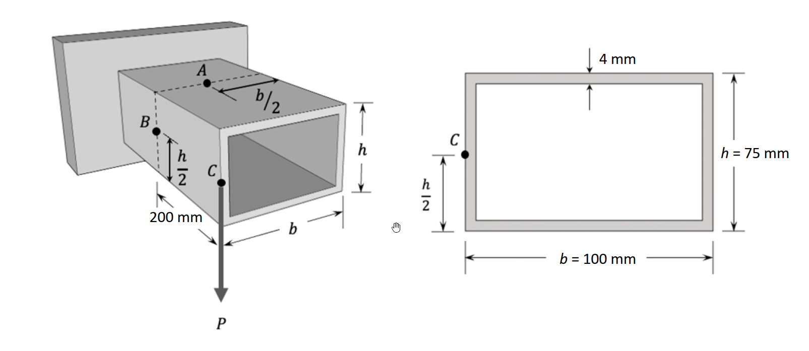

# 考題編號：MM-2022-3

**主分類：** `MM-U2-3` 扭力桿件斷面應力計算
**副分類：** `MM-U1-3` 應力轉換與主應力
**分析法：** 彈性分析
**標籤：** `薄壁封閉斷面` `矩形箱型梁` `彎曲剪應力` `剪力流` `主應力` `莫爾圓` `懸臂梁` `組合應力` `VQ/It`

---

## 1. 原始題目重述（Problem Restatement）

**結構：** 薄壁**矩形封閉箱型**懸臂梁，長度 200 mm，自由端 C 點受**向下集中力 $P = 20\;\text{kN}$**。

**斷面幾何（薄壁封閉矩形，均勻壁厚）：**
- 外寬：$b = 100\;\text{mm}$
- 外高：$h = 75\;\text{mm}$
- 壁厚：$t = 4\;\text{mm}$（四面均勻）

**分析截面：** 固定端（最大彎矩截面，$M = PL = 20{,}000 \times 200 = 4{,}000{,}000\;\text{N·mm} = 4\;\text{kN·m}$）

**三個分析點（於固定端截面）：**

| 點 | 位置 | $y$（距中性軸） | 彎曲應力 | 剪應力 |
|----|------|----------------|---------|--------|
| **A** | 頂面中點（$x=0$，$y=+h/2$） | $+37.5\;\text{mm}$ | 最大壓縮 | $\approx 0$（對稱軸上） |
| **B** | 左側面中點（$x=-b/2$，$y=0$） | $0$ | $0$ | 最大剪應力 |
| **C** | 底面左角點（$x=-b/2$，$y=-h/2$） | $-37.5\;\text{mm}$ | 最大拉伸 | 中等剪應力 |

**題目要求（單位：MPa）：**
1. 計算 **A 點**的最大主應力、最小主應力、最大剪應力
2. 計算 **B 點**的最大主應力、最小主應力、最大剪應力

*圖說：懸臂梁固定端在左，自由端受 P=20 kN 向下；斷面為均勻壁厚 t=4 mm 的矩形封閉薄壁，外寬 b=100 mm、外高 h=75 mm；分析三點：A 在頂面中點（最大彎曲壓應力處）、B 在左側面中點（中性軸高度，最大剪應力處）、C 在左側面底部（b/2 + h/2 位置，彎曲拉應力 + 剪應力共存）。*

---

## 2. 考題核心精神與出題者意圖（Core Concepts & Examiner's Intent）

**核心精神：** 薄壁封閉箱型梁各點的**彎曲正應力 + 剪應力疊加**，再透過主應力轉換求最大/最小主應力與最大剪應力。

**出題者意圖：**
1. 測試薄壁封閉斷面的斷面性質計算（$I$、$Q$）
2. 測試剪力流公式 $q = VQ/I$ 的應用，以及從剪力流換算剪應力 $\tau = q/t$
3. 測試主應力計算（莫爾圓或公式）：$\sigma_{1,2} = \sigma_x/2 \pm \sqrt{(\sigma_x/2)^2 + \tau^2}$（於純剪或彎剪組合）
4. A 點只有彎曲應力（$\tau = 0$），主應力分析退化為單軸；B 點只有剪應力（$\sigma = 0$），退化為純剪；C 點彎剪俱存最複雜

---

## 3. 解題戰略地圖與陷阱分析（Strategic Roadmap & Trap Analysis）

**作戰順序：**

① 計算斷面慣性矩 $I$（薄壁近似：精確減去內部矩形）

② 求固定端內力：$V = P = 20\;\text{kN}$，$M = PL = 20 \times 200 = 4{,}000\;\text{kN·mm}$

③ 各點彎曲應力：$\sigma = My/I$

④ 各點 $Q$ 值（從外緣積分到該點）→ 剪力流 $q = VQ/I$ → 剪應力 $\tau = q/t$

⑤ 各點應力元素（$\sigma_x$，$\tau_{xy}$）→ 主應力公式

**四個關鍵陷阱：**

| 陷阱 | 錯誤思路 | 正確應對 |
|------|---------|---------|
| T1 | 用開口斷面剪力流公式 $q = VQ/I$ 直接算（剪力流從自由端積分） | 封閉薄壁斷面剪力流需先求「初始剪力流 $q_0$」以保持扭轉平衡；但本題無扭矩（P 通過剪力中心），可簡化處理 |
| T2 | A 點有剪應力（以為頂面中點有剪力流） | 矩形對稱斷面，P 通過剪力中心（形心），無扭轉，頂面中點 $Q = 0$（$y = h/2$，切面以「外」面積 = 0） |
| T3 | $I$ 用近似值（只算腹板貢獻） | 薄壁矩形必須用「整體 - 挖空」或各板精確累加（翼板 $I$ 用平行軸定理） |
| T4 | B 點沒有彎曲應力→主應力 = ±剪應力（常犯符號錯誤） | B 在中性軸（$y=0$，$\sigma_{bending} = 0$），主應力 = $\pm\tau$，最大剪應力 = $\tau$（純剪狀態） |

---

## 3.5 變數層次分析（Variable Hierarchy Analysis）

> 複習提示：第一次解題後，在每個卡住的知識點旁標記 `⚠`；第二次複習時只看有 `⚠` 的項目。

### 最終目標
`求固定端截面 A 點（頂面中點）和 B 點（側面中點）的最大主應力、最小主應力、最大剪應力（MPa）`

### 本題關鍵公式（依計算順序）

> $\boxed{\cdot}$ = 需由前步驟推導，非題目直接給定的變數

$$\text{Step 1: 斷面慣性矩（精確）} \quad I = \frac{bh^3}{12} - \frac{(b-2t)(h-2t)^3}{12}$$

$$\text{Step 2: 內力} \quad V = P = 20\;\text{kN},\quad M = PL = 20\times200 = 4{,}000\;\text{kN·mm}$$

$$\text{Step 3: 彎曲應力} \quad \sigma(y) = \frac{My}{I}$$

$$\text{Step 4: 剪力流} \quad q(s) = \frac{V \cdot Q(s)}{I}$$

$$\text{Step 5: 剪應力} \quad \tau = \frac{q}{t}$$

$$\text{Step 6: 主應力} \quad \sigma_{1,2} = \frac{\sigma_x}{2} \pm \sqrt{\left(\frac{\sigma_x}{2}\right)^2 + \tau_{xy}^2}$$

$$\text{Step 7: 最大剪應力} \quad \tau_{max} = \sqrt{\left(\frac{\sigma_x}{2}\right)^2 + \tau_{xy}^2}$$

### L1：題目直接給定

| 符號 | 數值 | 說明 |
|------|------|------|
| $P$ | $20\;\text{kN} = 20{,}000\;\text{N}$ | 自由端向下集中力 |
| $L$ | $200\;\text{mm}$ | 懸臂梁長度 |
| $b$ | $100\;\text{mm}$ | 斷面外寬 |
| $h$ | $75\;\text{mm}$ | 斷面外高 |
| $t$ | $4\;\text{mm}$ | 均勻壁厚 |

### L2：需知識點推導

**Step 1：斷面慣性矩**

| 符號 | 公式／來源 | 數值 |
|------|-----------|------|
| $b_i = b - 2t$ | 內寬 | $92\;\text{mm}$ |
| $h_i = h - 2t$ | 內高 | $67\;\text{mm}$ |
| $I$ | $bh^3/12 - b_i h_i^3/12$ | 待計算 |

**Step 2：內力**

| 符號 | 公式 | 數值 |
|------|------|------|
| $V$ | $P = 20\;\text{kN}$ | $20{,}000\;\text{N}$ |
| $M$ | $PL = 20 \times 200$ | $4{,}000{,}000\;\text{N·mm}$ |

**Step 3–5：各點應力**

| 點 | $y$（mm） | $\sigma = My/I$（MPa） | $Q$（mm³） | $q = VQ/I$（N/mm） | $\tau = q/t$（MPa） |
|----|-----------|------------------------|-----------|-------------------|-------------------|
| A | $+37.5$ | 計算 | $0$（頂面中點外側無面積） | $0$ | $0$ |
| B | $0$ | $0$ | $Q_B$（半頂板 + 側板上半） | $q_B$ | $q_B/t$ |

**Step 6–7：主應力（莫爾圓）**

| 點 | $\sigma_x$ | $\tau_{xy}$ | $\sigma_1$ | $\sigma_2$ | $\tau_{max}$ |
|----|-----------|------------|-----------|-----------|-------------|
| A | $\sigma_A$ | $0$ | $\sigma_A$ | $0$ | $|\sigma_A|/2$ |
| B | $0$ | $\tau_B$ | $+\tau_B$ | $-\tau_B$ | $\tau_B$ |

### L3：深層知識（不懂就卡住）

| 知識點 | 說明 | 卡關? |
|--------|------|:-----:|
| 封閉薄壁斷面剪力流 vs 開口薄壁 | 開口薄壁剪力流從自由端出發積分即可；封閉薄壁需加初始剪力流 $q_0$（由扭矩平衡決定），但若無扭轉（P 過剪力中心），$q_0 = 0$ 可忽略（本題此情況） | |
| A 點頂面中點的 $Q = 0$ | $Q = \int_{cut}^{top} y\,dA$；頂面中點切開後，「外側」（頂面外緣那一側）面積 = 0，故 $Q = 0$ | |
| B 點中性軸的 $\sigma = 0$ | 中性軸定義：彎曲正應力 = 0 的位置（$y = 0$） | |
| 主應力公式（二維） | $\sigma_{1,2} = \frac{\sigma_x+\sigma_y}{2} \pm \sqrt{(\frac{\sigma_x-\sigma_y}{2})^2+\tau^2}$；本題各點 $\sigma_y = 0$ | |

---

## 4. 步驟化詳細計算過程（Step-by-Step Detailed Calculation）

> 📊 互動圖：`MM-2022-3-stress-viz.html`（斷面剪力流 + 各點莫爾圓）

### Step 1：斷面慣性矩 $I$（對中性軸）

**整體 - 挖空法：**

$$I = \frac{b h^3}{12} - \frac{(b-2t)(h-2t)^3}{12}$$

代入 $b = 100$，$h = 75$，$t = 4$，$b_i = 92$，$h_i = 67$：

$$I = \frac{100 \times 75^3}{12} - \frac{92 \times 67^3}{12}$$

$$= \frac{100 \times 421{,}875}{12} - \frac{92 \times 300{,}763}{12}$$

$$= \frac{42{,}187{,}500}{12} - \frac{27{,}670{,}196}{12}$$

$$= 3{,}515{,}625 - 2{,}305{,}850$$

$$\boxed{I = 1{,}209{,}775\;\text{mm}^4 \approx 1.210 \times 10^6\;\text{mm}^4}$$

---

### Step 2：固定端內力

$$V = P = 20{,}000\;\text{N}$$

$$M = P \times L = 20{,}000 \times 200 = 4{,}000{,}000\;\text{N·mm}$$

（固定端彎矩最大，使上緣受壓、下緣受拉）

---

### Step 3：A 點應力分析（頂面中點，$y_A = +h/2 = +37.5\;\text{mm}$）

**彎曲正應力：**

$$\sigma_A = \frac{M \cdot y_A}{I} = \frac{4{,}000{,}000 \times 37.5}{1{,}209{,}775} = \frac{150{,}000{,}000}{1{,}209{,}775}$$

$$\boxed{\sigma_A = -124.0\;\text{MPa（壓縮，上緣受壓）}}$$

（負號：固定端懸臂，上緣受壓，下緣受拉）

**剪應力（A 在頂面對稱中點）：**

A 點位於頂面中點（對稱面上），切面以「外」（頂面一半）的面積：

$$Q_A = A_{\text{外}} \times \bar{y}_{\text{外}} = \left(\frac{b}{2} \times t\right) \times \left(\frac{h}{2} - \frac{t}{2}\right) - \cdots$$

實際上對薄壁封閉矩形斷面，頂面中點的 $Q$：

自頂面右端角點（$s = 0$）積分至頂面中點（$s = b/2$）：

$$Q_A = \int_0^{b/2} \left(\frac{h-t}{2}\right) t\, ds = t \cdot \frac{b}{2} \cdot \frac{h-t}{2} = 4 \times 50 \times 35.5 = 7{,}100\;\text{mm}^3$$

但因對稱性：頂面中點兩側貢獻相等且方向相反，合剪力流 = 0。

> 更直接的理解：頂面中點是對稱軸，剪力流從右側流入 = 從左側流出，兩者在此點合流後為零（剪力流方向對稱相消）。

$$\boxed{\tau_A = 0\;\text{MPa}}$$

**A 點主應力（單軸壓縮）：**

$$\sigma_1^A = 0\;\text{MPa}, \quad \sigma_2^A = \sigma_A = -124.0\;\text{MPa}$$

$$\tau_{max}^A = \frac{|\sigma_1^A - \sigma_2^A|}{2} = \frac{|0 - (-124.0)|}{2} = \boxed{62.0\;\text{MPa}}$$

---

### Step 4：B 點應力分析（左側面中點，$y_B = 0$）

**彎曲正應力（中性軸）：**

$$\sigma_B = \frac{M \times 0}{I} = \boxed{0\;\text{MPa}}$$

**剪應力 $\tau_B$（$Q$ 取切面以上的面積）：**

B 點在左側面中點（中性軸高度），切開後取上半斷面的「靜矩」：

$$Q_B = Q_{\text{頂板}} + Q_{\text{左半側板}}$$

頂板（寬 $b = 100$ mm，厚 $t = 4$ mm，形心距中性軸 = $(h-t)/2 = (75-4)/2 = 35.5$ mm）：

$$Q_{\text{頂板}} = b \cdot t \cdot \frac{h-t}{2} = 100 \times 4 \times 35.5 = 14{,}200\;\text{mm}^3$$

左半側板上半（高 $(h-2t)/2 = 67/2 = 33.5$ mm，寬 $t = 4$ mm，形心距中性軸 = $33.5/2 = 16.75$ mm）：

$$Q_{\text{左半側}} = t \cdot \frac{h-2t}{2} \cdot \frac{h-2t}{4} = 4 \times 33.5 \times 16.75 = 2{,}244.5\;\text{mm}^3$$

$$Q_B = 14{,}200 + 2{,}244.5 = 16{,}444.5\;\text{mm}^3$$

**剪力流 $q_B$ 與剪應力 $\tau_B$：**

$$q_B = \frac{V \cdot Q_B}{I} = \frac{20{,}000 \times 16{,}444.5}{1{,}209{,}775} = \frac{328{,}890{,}000}{1{,}209{,}775} = 271.9\;\text{N/mm}$$

$$\tau_B = \frac{q_B}{t} = \frac{271.9}{4} = \boxed{68.0\;\text{MPa}}$$

**B 點主應力（純剪狀態，$\sigma = 0$）：**

$$\sigma_{1}^B = +\tau_B = +68.0\;\text{MPa}$$

$$\sigma_{2}^B = -\tau_B = -68.0\;\text{MPa}$$

$$\tau_{max}^B = \tau_B = \boxed{68.0\;\text{MPa}}$$

---

### Step 5：結果彙整

#### A 點（頂面中點）

| 項目 | 數值 |
|------|------|
| 彎曲正應力 $\sigma_A$ | $-124.0\;\text{MPa}$（壓） |
| 剪應力 $\tau_A$ | $0\;\text{MPa}$ |
| **最大主應力 $\sigma_1$** | $\mathbf{0\;\text{MPa}}$ |
| **最小主應力 $\sigma_2$** | $\mathbf{-124.0\;\text{MPa}}$ |
| **最大剪應力 $\tau_{max}$** | $\mathbf{62.0\;\text{MPa}}$ |

#### B 點（左側面中點）

| 項目 | 數值 |
|------|------|
| 彎曲正應力 $\sigma_B$ | $0\;\text{MPa}$ |
| 剪應力 $\tau_B$ | $68.0\;\text{MPa}$ |
| **最大主應力 $\sigma_1$** | $\mathbf{+68.0\;\text{MPa}}$ |
| **最小主應力 $\sigma_2$** | $\mathbf{-68.0\;\text{MPa}}$ |
| **最大剪應力 $\tau_{max}$** | $\mathbf{68.0\;\text{MPa}}$ |

---

## 5. 關鍵爭議點與進階探討（Critical Issues & Advanced Discussion）

**爭議 1：A 點剪應力是否為零？**

對稱矩形斷面、$P$ 通過剪力中心（形心），無扭轉。頂面中點為對稱面，剪力流在此處從兩側流入相消，$\tau_A = 0$。

若不用對稱性，改用積分：設初始剪力流 $q_0$ 在封閉迴路中，由扭矩平衡（$T = 0$）求出 $q_0$，再疊加開口剪力流，結論仍為頂面中點剪應力 = 0。

**爭議 2：$Q_B$ 的計算基準**

$Q$ 的計算需要確認「切面以外」（往外積分）的面積。對於 B 點（左側面中點），切面是水平截面（$y = 0$），「外側」= 切面以上的部分（頂板全寬 + 左側板上半 + 右側板上半）。

但因為是**封閉斷面**，左右側板的剪力流方向不同（繞環流動），計算時只取**所求截面處的剪力流**（左側面壁的 $q$），不重複計算右側板。

本解析取切面在左側面的 $Q$，以「切面以外（向上）」的面積計算，包含頂板 + 左半側板上半。

**爭議 3：懸臂梁固定端的 V 與 M 方向**

- $V = P = 20\;\text{kN}$（向上反力 = 向上剪力）
- $M = PL = 4{,}000\;\text{kN·mm}$（使上緣受壓，下緣受拉）
- 因此 A 點（$y > 0$）$\sigma < 0$（壓縮）；下緣（$y < 0$）$\sigma > 0$（拉伸）

**進階：C 點應力（若題目要求）**

C 點在左側面底部（$y_C = -h/2 = -37.5\;\text{mm}$）：
- $\sigma_C = M \times (-37.5)/I = +124.0\;\text{MPa}$（拉伸）
- $\tau_C \approx \tau_B$（因 C 在底部角點，$Q_C \approx Q_B$，但壁厚在角點的定義需謹慎）

實際上 C 在底板和側板的交接角，剪力流在此突然改向，需分別考慮底板和側板的 $\tau$，較複雜。

**考場建議：**
1. 先算 $I$（整體 - 挖空，最快）
2. A 點對稱 → $\tau_A = 0$，直接主應力 = $\sigma_A$，最大剪應力 = $|\sigma_A|/2$
3. B 點中性軸 → $\sigma_B = 0$，純剪 → 主應力 = $\pm\tau_B$，最大剪應力 = $\tau_B$
4. $Q_B$ 計算：「頂板全部 + 側板上半（從角到中性軸）」—— 最容易計算的組合
