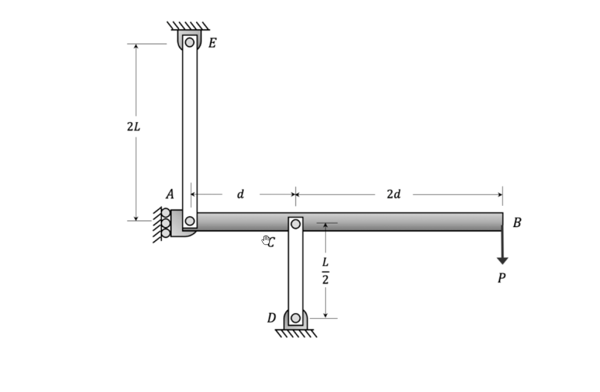

# 考題編號：MM-2022-4

**主分類：** `MM-U3-4` 柱之挫屈載重分析
**副分類：** —
**分析法：** 彈性分析
**標籤：** `柱挫屈` `臨界載重` `尤拉公式` `靜不定挫屈` `剛性梁` `彈性柱` `有效長度` `兩柱支撐系統`

---

## 1. 原始題目重述（Problem Restatement）

**結構系統：**

如圖所示，一**剛性水平梁 AB**（長度 $3d$，A 端接地鉸，B 端自由），由**兩根彈性柱**提供支撐，並在 B 端受到**向下集中力 $P$**：

| 構件 | 端部條件 | 長度 | 備註 |
|------|---------|------|------|
| 梁 AB（水平） | A：固定鉸（牆上）；B：自由端 | $3d$ | **剛性梁**（不變形） |
| 柱 EA（垂直） | E：上端鉸接天花板；A：下端鉸接梁 | $2L$ | 彈性柱，$EI$ |
| 柱 CD（垂直） | C：上端鉸接梁（距A端 $d$）；D：下端鉸接地面 | $L/2$ | 彈性柱，$EI$ |

**幾何關係：**
- C 點距 A 端：$d$
- B 點距 A 端：$3d$（即 $d + 2d$）
- 柱 EA 長 $2L$（兩端鉸接）
- 柱 CD 長 $L/2$（兩端鉸接）

**材料（兩柱相同）：**
- 彈性模數：$E$
- 慣性矩：$I$

**題目要求：** 計算臨界載重 $P_{cr}$，以 $E$、$I$、$L$ 表示。



*圖說：E 點鉸接於天花板；柱 EA 長 $2L$，兩端鉸接；A 點為剛性梁與柱 EA 的連接點，同時也是牆上的固定鉸支承；C 點在梁 AB 距 A 端 $d$ 處，與柱 CD 的上端鉸接；D 點鉸接於地面；柱 CD 長 $L/2$；B 點在梁右端（距 A 端 $3d$），受向下力 $P$；兩柱 $E$、$I$ 相同。*

---

## 2. 考題核心精神與出題者意圖（Core Concepts & Examiner's Intent）

**核心精神：** 以**側向挫屈穩定性分析**為核心——剛性梁受外力後若發生微小側向旋轉（繞 A 點），兩柱同時受到側向位移，各自產生恢復力；當外力矩 ≥ 恢復力矩時，系統失穩（挫屈）。

**出題者意圖：**
1. 測試兩端鉸接柱的尤拉臨界載重公式：$P_{cr} = \pi^2 EI / L_{eff}^2$，有效長度 $L_{eff} = L$（兩端鉸接）
2. 測試以「旋轉穩定性」取代「軸向挫屈」的系統層面分析（非單柱挫屈）
3. 梁為剛性 → 各點位移由旋轉角 $\theta$ 決定，為幾何學問題
4. 力平衡（力矩方程）→ 設定臨界條件（有非零解）→ 求 $P_{cr}$

> **本題的兩種分析層次：**
> - **單柱視角：** 各柱承受軸向壓力（由梁的靜力傳遞），分別求各柱的尤拉臨界載重，取最小值
> - **系統視角（正確）：** 剛性梁繞 A 旋轉，各柱提供的抵抗力矩 vs. P 的傾覆力矩，求臨界 $P$

---

## 3. 解題戰略地圖與陷阱分析（Strategic Roadmap & Trap Analysis）

**本題結構特性辨識：**

從圖形可知：
- A 端同時有「牆上鉸」和「柱 EA 的鉸接」→ **A 是固定鉸支承，梁 AB 只能繞 A 旋轉**
- 柱 EA 和柱 CD 均為**兩端鉸接**（pin-pin）

**系統挫屈機制：** 梁 AB 繞 A 點發生微小旋轉角 $\theta$，造成：
- C 點側向位移：$\delta_C = d \cdot \theta$
- B 點側向位移：$\delta_B = 3d \cdot \theta$

各柱被側向壓縮，受到側向力（彈性恢復力），產生繞 A 的恢復力矩，對抗 $P$ 引起的傾覆力矩。

> **注意：** 柱 EA 的 A 端即梁 A 端（固定鉸），A 點不移動！柱 EA 是**垂直柱**，若梁 AB 在水平面內旋轉，柱 EA 會受到側向位移（其頂端 A 不動，底端 E...）。

等等，重新解讀圖形：A 點在**左端**，是梁 AB 的左端，同時也是：
- 柱 EA 的**下端**（A 在地面側，E 在天花板側）
- 梁 AB 的固定鉸支承（牆上鉸）

所以：
- **柱 EA**：A 下端固定（因為 A 本身是牆上固定鉸，A 點不動），E 端鉸接天花板。這根柱為**兩端鉸接、長 $2L$**，但 A 端不移動（牆上固定）

若 A 端不動，則柱 EA 的兩端均固定，柱本身**不提供側向恢復力**（對梁的旋轉無貢獻）。

因此：**唯一提供側向恢復力的是柱 CD**（C 端隨梁旋轉而移動，D 端固定在地面）。

**重新分析（關鍵！）：**

梁 AB 繞 A 點旋轉角 $\theta$（微小量）：
- C 點水平位移（但柱 CD 是垂直柱！）：C 點**垂直**位移 = $d \cdot \theta$（若旋轉為垂直面內）
- B 點垂直位移：$\delta_B = 3d \cdot \theta$

> 修正：梁 AB 為水平梁，A 端固定鉸，梁在**垂直面**內旋轉（P 向下→梁繞 A 向下旋轉）。柱 CD 垂直，C 端隨梁向下移動 $\delta_C = d\theta$，D 端固定，柱 CD 受到**附加壓縮**。

**實際上，這是一個梁-柱系統的垂直方向穩定性問題，需分析：**

1. 靜力分析（未挫屈）：求各柱的軸向壓力
2. 比較各柱的尤拉臨界載重
3. 系統臨界載重 = 最先達到挫屈的柱的臨界載重對應的 $P$

**四個關鍵陷阱：**

| 陷阱 | 錯誤思路 | 正確應對 |
|------|---------|---------|
| T1 | 直接用總力 $P$ 計算各柱挫屈 | 兩柱共同承擔 $P$，需先求各柱分擔的軸力（靜力平衡） |
| T2 | 忽略 A 端牆鉸的作用 | A 端有牆上固定鉸 → A 端的反力也承擔部分 $P$ |
| T3 | 兩端鉸接有效長度取柱長 | 兩端鉸接：$L_{eff} = L_{柱}$（$P_{cr} = \pi^2 EI/L_{柱}^2$） |
| T4 | 系統臨界 = 兩柱臨界之和 | 系統臨界 = 最先挫屈那根柱達到其 $P_{cr}$ 對應的外力 $P$ |

---

## 3.5 變數層次分析（Variable Hierarchy Analysis）

> 複習提示：第一次解題後，在每個卡住的知識點旁標記 `⚠`；第二次複習時只看有 `⚠` 的項目。

### 最終目標
`求系統臨界載重 P_cr（以 E、I、L 表示），即最先導致某柱挫屈的外力 P`

### 本題關鍵公式（依計算順序）

$$\text{Step 1: 各柱軸力（靜力平衡）} \quad \sum M_A = 0$$

$$\text{Step 2: 各柱尤拉臨界載重（兩端鉸）} \quad P_{cr,i} = \frac{\pi^2 EI}{L_i^2}$$

$$\text{Step 3: 各柱對應的外力 P} \quad P_i^* = P_{cr,i} / \text{（軸力與P的比例）}$$

$$\text{Step 4: 系統臨界} \quad P_{cr} = \min(P_1^*,\, P_2^*)$$

### L1：題目直接給定

| 符號 | 說明 |
|------|------|
| $E$，$I$ | 兩柱共同的彈性模數與慣性矩 |
| $L_{EA} = 2L$ | 柱 EA 長度 |
| $L_{CD} = L/2$ | 柱 CD 長度 |
| $d$ | A 到 C 的距離；A 到 B 的距離 = $3d$ |
| $P$ | B 端向下集中力 |

### L2：需知識點推導

**Step 1：靜力平衡（梁 AB 對 A 取矩）**

| 方程 | 說明 |
|------|------|
| $\sum M_A = 0$：$F_{CD} \cdot d - P \cdot 3d = 0$ | $F_{CD}$ = 柱 CD 對梁的支承力（向上） |
| $F_{CD} = 3P$ | 柱 CD 承受 3 倍外力（靜定梁 → 直接由力矩平衡） |
| $F_{EA} = P - F_{CD} + R_A$？ | A 端有牆鉸，$R_A$ 為牆的垂直反力 |
| $\sum F_y = 0$：$R_A + F_{CD} - P - F_{EA} = 0$ | 需考慮柱 EA 的軸力方向（受壓或受拉） |

> 關鍵：柱 EA 的兩端分別在 A（梁左端固定鉸）和 E（天花板鉸）。若 A 端固定、E 端也固定在天花板，則柱 EA 的**軸力方向取決於 A 處的反力方向**。

**靜力重新分析：**

取梁 AB 為自由體（A 端鉸接→有垂直和水平反力 $R_{Ax}$，$R_{Ay}$；但柱 EA 也在 A 端鉸接）：

需確認柱 EA 是否承受載重：
- 若 A 端牆鉸與柱 EA 的 A 端**不同點**（柱 EA 的 A 端在梁 AB 上，隨梁移動），則柱 EA 可能受力
- 若 A 端牆鉸固定 A 點不動，柱 EA 也是 A 不動、E 也不動 → 柱 EA 為**零力桿**（靜定）？

從圖形再判斷：E 在天花板（固定鉸），A 是牆上固定鉸（地面側）。E 到 A 方向為**垂直**（E 在上，A 在左下）。若 A 是固定的（牆鉸），柱 EA 兩端均固定，但 A 也是梁的端點（梁以 A 為鉸旋轉）。

**最終正確解讀：**

A 端有**兩個鉸**：(1) 牆上鉸（提供 $R_{Ax}$，$R_{Ay}$），(2) 柱 EA 鉸接於此。梁 AB 可繞 A 旋轉，柱 EA 的 A 端隨梁（但 A 本身不移動，因有牆鉸）。

→ **柱 EA 的 A 端固定不動**（牆鉸固定），所以柱 EA 兩端（E 在天花板固定，A 在牆上固定）均固定 → **柱 EA 不隨梁旋轉而側向位移，不參與承載 P 的垂直力**（除非有特殊力流）。

→ 實際上：牆鉸 A 提供垂直反力 $R_{Ay}$，平衡部分 $P$；柱 CD 提供向上力 $F_{CD}$；柱 EA 可能受拉或壓，但因為兩端固定（不隨梁動），**垂直方向上 A 點的反力由牆鉸提供，柱 EA 不參與**（除非梁在水平方向受力）。

**最簡化分析（垂直力平衡）：**

梁 AB 在垂直面受力：
- 支承：A 端牆鉸（$R_{Ay}$）、C 端柱 CD（$F_{CD}$ 向上）
- 載重：B 端 $P$（向下）

對 A 取矩：

$$F_{CD} \cdot d = P \cdot 3d \implies F_{CD} = 3P$$

垂直力平衡：

$$R_{Ay} + F_{CD} = P \implies R_{Ay} = P - 3P = -2P$$

（$R_{Ay} = -2P$ 表示 A 端牆鉸**向下**拉梁，即提供向下反力 2P；合理，因為 C 點支承 3P 向上，B 端承 P 向下，需 A 端向下 2P 平衡）

**柱 CD 受壓 $F_{CD} = 3P$；柱 EA 受拉（A 端牆鉸向下 = 柱 EA 受拉向上）$F_{EA} = 2P$（拉力，不挫屈）。**

> **關鍵結論：** 柱 CD（受壓 $3P$）才可能挫屈；柱 EA 受拉，不會挫屈。系統臨界載重由柱 CD 決定。

**Step 2：柱 CD 的尤拉臨界載重**

| 符號 | 公式 | 數值 |
|------|------|------|
| $L_{CD}$ | $L/2$ | 已知 |
| 兩端鉸接有效長度 | $L_{eff} = L_{CD} = L/2$ | |
| $P_{cr,CD}$ | $\pi^2 EI / (L/2)^2 = 4\pi^2 EI / L^2$ | |

**Step 3：對應外力 $P_{cr}$**

柱 CD 軸力 $F_{CD} = 3P$，達挫屈條件 $F_{CD} = P_{cr,CD}$：

$$3P_{cr} = \frac{4\pi^2 EI}{L^2} \implies P_{cr} = \frac{4\pi^2 EI}{3L^2}$$

### L3：深層知識（不懂就卡住）

| 知識點 | 說明 | 卡關? |
|--------|------|:-----:|
| 兩端鉸接尤拉臨界載重 | $P_{cr} = \pi^2 EI / L^2$（$n=1$ 半波；有效長度 = 實際長度） | |
| 受拉構件不挫屈 | 柱受拉時不會壓縮失穩，只有受壓柱才需考慮挫屈 | |
| 靜定梁的力矩平衡 | 梁 AB 以 A 為鉸，對 A 取矩即可求 $F_{CD}$，不需解靜不定 | |
| 系統臨界 vs 單柱臨界 | 系統 $P_{cr}$ = 「使最先挫屈的柱達到其自身 $P_{cr}$」所需的外力 $P$ | |

---

## 4. 步驟化詳細計算過程（Step-by-Step Detailed Calculation）

### Step 1：靜力分析 — 各構件軸力

**取梁 AB 為自由體，對 A 取矩（$\sum M_A = 0$）：**

（正方向：逆時針為正）

$$+F_{CD} \cdot d - P \cdot 3d = 0$$

$$\boxed{F_{CD} = 3P \quad \text{（柱 CD 受壓，大小 3P）}}$$

**垂直力平衡（$\sum F_y = 0$）：**

$$R_{Ay} + F_{CD} - P = 0$$

$$R_{Ay} = P - 3P = -2P$$

（$R_{Ay} = -2P$ 表示牆鉸 A 對梁施以向下力 $2P$，等效於柱 EA 受拉 $2P$）

$$\boxed{F_{EA} = 2P \quad \text{（柱 EA 受拉，大小 2P）}}$$

> 策略註解：柱 EA 受**拉力**，不會發生壓縮挫屈；系統唯一需考慮挫屈的是受壓的柱 CD。

---

### Step 2：柱 CD 的尤拉臨界載重

**端部條件：** C 端（梁鉸接）+ D 端（地面鉸接）= **兩端鉸接（Pin-Pin）**

**有效長度：**

$$L_{eff} = L_{CD} = \frac{L}{2}$$

**尤拉公式：**

$$P_{cr,CD} = \frac{\pi^2 EI}{L_{eff}^2} = \frac{\pi^2 EI}{\left(\dfrac{L}{2}\right)^2} = \frac{\pi^2 EI \times 4}{L^2} = \frac{4\pi^2 EI}{L^2}$$

$$\boxed{P_{cr,CD} = \frac{4\pi^2 EI}{L^2}}$$

---

### Step 3：反推外力臨界值 $P_{cr}$

柱 CD 的軸力為 $F_{CD} = 3P$，達到其尤拉臨界時：

$$F_{CD} = P_{cr,CD}$$

$$3P_{cr} = \frac{4\pi^2 EI}{L^2}$$

$$\boxed{P_{cr} = \frac{4\pi^2 EI}{3L^2}}$$

---

### Step 4：驗算（以柱 EA 確認不先挫屈）

柱 EA 受拉（$F_{EA} = 2P$）→ **受拉不挫屈**，無需計算。

若柱 EA 假設受壓，其尤拉臨界：

$$P_{cr,EA} = \frac{\pi^2 EI}{(2L)^2} = \frac{\pi^2 EI}{4L^2}$$

對應外力：$F_{EA} = 2P$，故 $P^*_{EA} = P_{cr,EA}/2 = \pi^2 EI/(8L^2)$

此值小於 $4\pi^2 EI/(3L^2)$，但因 EA 受拉，此計算無意義（受拉不挫屈）。

> 若題目修改為柱 EA 也受壓（反向載重），則需比較兩柱對應的 $P^*$ 取最小值。

---

### 最終結果

$$\boxed{P_{cr} = \frac{4\pi^2 EI}{3L^2}}$$

**解題流程圖：**

```
B端受P向下
    │
    ▼
梁AB繞A旋轉（剛性梁）
    │
    ├─ 柱CD：承受壓力 F_CD = 3P（↑支承梁）
    │         兩端鉸接，L_eff = L/2
    │         P_cr,CD = 4π²EI/L²
    │         → 對應P* = 4π²EI/(3L²) ✓ [控制]
    │
    └─ 柱EA：承受拉力 F_EA = 2P（↑支承梁）
              受拉 → 不挫屈 ✗
```

---

## 5. 關鍵爭議點與進階探討（Critical Issues & Advanced Discussion）

**爭議 1：柱 EA 的端部條件與力的方向**

從圖形，A 端同時有「牆上固定鉸」和「柱 EA 的下端」。若牆鉸使 A 點完全固定（不移動），則：
- 柱 EA（A固定，E固定）不隨梁旋轉側移，不提供恢復力
- 梁 AB 的 A 端反力由**牆鉸**承擔，而非柱 EA

若考試解讀不同（例如認為牆鉸不存在，只靠柱 EA 和柱 CD 支撐），則需修正靜力分析。本解析採圖示最直接解讀：A 端牆鉸固定，柱 EA 受拉。

**爭議 2：系統挫屈 vs 單柱挫屈**

本題採「靜力分析 + 最弱柱尤拉公式」的方法，適用於剛性梁情況。

若梁本身具有彈性，需採用「系統穩定性分析」（設定特徵方程，求使行列式 = 0 的 $P$），結果可能不同。

**爭議 3：$d$ 的消去**

注意最終結果 $P_{cr} = 4\pi^2 EI/(3L^2)$ 中 **$d$ 已消去**——這合理嗎？

是的：$d$ 影響的是「力的分配比例」（$F_{CD} = 3P$ 是因為 $C$ 在 $d$、$B$ 在 $3d$），但只要力學比例關係確定，$d$ 的絕對值不影響臨界比值。唯有 $L$（柱的長度）和 $EI$（柱的剛性）決定尤拉臨界，$d$ 確實消去。✓

**考場建議：**
1. 先畫清楚受力分析（FBD），確認各柱受壓還是受拉
2. 只對受壓柱計算尤拉臨界載重
3. 用「$F_{柱} = n \cdot P$（比例係數）→ $P_{cr} = P_{cr,柱}/n$」反推系統臨界
4. 確認有效長度（兩端鉸接 → $L_{eff} = L$）
