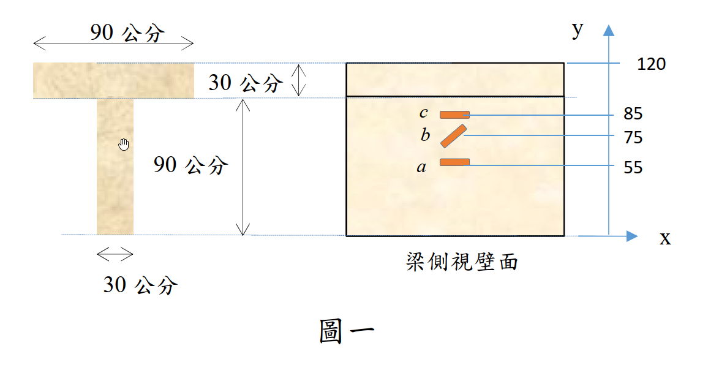

# 考題編號：MM-2023-1

**主分類：** `MM-U1-3` 應力及應變分析原理與應用
**副分類：** `MM-U2-2` 梁桿件斷面應力計算
**分析法：** 彈性分析
**標籤：** `應變計` `中性軸量測` `曲率` `平面應變` `剪應變` `莫爾圓` `主應力` `最大剪應力` `撓曲行為`

---

## 1. 原始題目重述（Problem Restatement）

鋼筋混凝土 T 型梁，斷面（自底部 y=0 起算）：
- 腹板：寬 30 cm × 高 90 cm（y = 0 ~ 90 cm）
- 翼板：寬 90 cm × 厚 30 cm（y = 90 ~ 120 cm）
- 總梁高 = 120 cm

特定斷面外側壁面設置應變計（高度自底部算起）：

| 應變計 | 高度 $y$（cm） | 方向 | 讀數 |
|--------|---------------|------|------|
| a | 55 | 0°（水平） | $\varepsilon_a = +500\;\mu$ |
| b | 75 | 45° | $\varepsilon_b = 0$ |
| c | 85 | 0°（水平） | $\varepsilon_c = -100\;\mu$ |

由於梁底有微裂縫，無法使用理想化斷面性質，必須完全依賴量測值。

*圖說：T型梁總高 120 cm；翼板寬 90 cm、厚 30 cm；腹板寬 30 cm、高 90 cm。梁側視壁面 y 軸自底部量起；應變計 a（y=55 cm, 0°）、b（y=75 cm, 45°）、c（y=85 cm, 0°）均位於腹板段。讀數 $\varepsilon_a=500\,\mu$, $\varepsilon_b=0$, $\varepsilon_c=-100\,\mu$；材料常數 $E=24\,\text{GPa}$，$\nu=0.2$。*

---

## 2. 考題核心精神與出題者意圖（Core Concepts & Examiner's Intent）

**核心精神：** 「逆向工程」——從量測值反推力學量，而非由荷載正向計算。

出題者刻意設定「梁底微裂縫導致斷面性質不可靠」，強迫考生放棄 $I$、$Q$ 正向途徑，必須從 $\varepsilon_a$、$\varepsilon_c$ 提取中性軸位置與曲率，再用 $\varepsilon_b$ 的 45° 讀數反推剪應變。

三個子問層層遞進：
1. 純撓曲假設 → 線性應變分布 → NA 與 $\kappa$（基礎）
2. 平面應變修正 → $\varepsilon_y$ 的正確表達 → $\gamma_{xy}$（中階）
3. 廣義虎克定律 → 莫爾圓 → 主應力（進階）

---

## 3. 解題戰略地圖與陷阱分析（Strategic Roadmap & Trap Analysis）

**作戰順序：**
① a、c（0°計）建線性 $\varepsilon_x(y)$ → 求 $y_{NA}$、$\kappa$  
② 線性外插 → $\varepsilon_x$ 於 b 點（y=75 cm）  
③ 平面應變假設 → $\varepsilon_y = -\dfrac{\nu}{1-\nu}\varepsilon_x$  
④ 代入 45° 計公式（$\varepsilon_{45°} = \frac{\varepsilon_x+\varepsilon_y}{2} + \frac{\gamma_{xy}}{2}$）→ 求 $\gamma_{xy}$  
⑤ 求 $G = E/[2(1+\nu)]$，算 $\sigma_x$（平面應變公式）與 $\tau_{xy}$  
⑥ 莫爾圓 → $\sigma_1$、$\sigma_2$、$\tau_{max}$

**四個關鍵陷阱：**

| 陷阱 | 錯誤思路 | 正確應對 |
|------|---------|---------|
| T1 | $\varepsilon_b = 0$ 誤解為「b 點無應變」 | 45° 讀數 = $(\varepsilon_x+\varepsilon_y)/2 + \gamma_{xy}/2$，是多分量疊加 |
| T2 | $\varepsilon_y = -\nu\varepsilon_x$（平面應力公式） | 平面應變（$\varepsilon_z=0$）且 $\sigma_y=0$ 時，$\varepsilon_y = -\dfrac{\nu}{1-\nu}\varepsilon_x$ |
| T3 | $\sigma_x = E\varepsilon_x$ | 平面應變下 $\sigma_x = \dfrac{E\varepsilon_x}{1-\nu^2}$ |
| T4 | 忽略 $\sigma_z$ 對最大剪應力的影響 | 平面應變有 $\sigma_z = \nu(\sigma_x+\sigma_y)\neq 0$，需驗證 3D 絕對最大剪應力 |

---

## 3.5 變數層次分析（Variable Hierarchy Analysis）

> 複習提示：第一次解題後，在每個卡住的知識點旁標記 `⚠`；第二次複習時只看有 `⚠` 的項目。

### 最終目標
`求中性軸位置 yNA、曲率 κ；b 點剪應變 γxy；b 點主應力 σ1、σ2 與最大剪應力 τmax`

### 本題關鍵公式（依計算順序）

> $\boxed{\cdot}$ = 需由前步驟推導，非題目直接給定的變數

$$\text{Step 1: 應變梯度}\quad \frac{d\varepsilon_x}{dy} = \frac{\varepsilon_c - \varepsilon_a}{y_c - y_a}$$

$$\text{Step 2: 中性軸}\quad y_{NA} = y_a - \varepsilon_a \cdot \frac{y_c - y_a}{\varepsilon_c - \varepsilon_a}$$

$$\text{Step 3: 曲率}\quad \kappa = -\frac{d\varepsilon_x}{dy} = \frac{\varepsilon_a - \varepsilon_c}{y_c - y_a}$$

$$\text{Step 4: b 點 }\varepsilon_x \quad \varepsilon_x(y_b) = \varepsilon_a + \boxed{\frac{d\varepsilon_x}{dy}}(y_b - y_a)$$

$$\text{Step 5: 平面應變 }\varepsilon_y \quad \varepsilon_y = \frac{-\nu}{1-\nu}\boxed{\varepsilon_x}$$

$$\text{Step 6: 45° 應變計}\quad \varepsilon_{45°} = \frac{\boxed{\varepsilon_x}+\boxed{\varepsilon_y}}{2} + \frac{\gamma_{xy}}{2} = 0$$

$$\text{Step 7: 應力}\quad \sigma_x = \frac{E\,\boxed{\varepsilon_x}}{1-\nu^2},\quad G = \frac{E}{2(1+\nu)},\quad \tau_{xy} = G\,\boxed{\gamma_{xy}}$$

$$\text{Step 8: 莫爾圓}\quad \sigma_{1,2} = \frac{\sigma_x}{2} \pm \sqrt{\left(\frac{\sigma_x}{2}\right)^2 + \tau_{xy}^2},\quad \tau_{max} = \sqrt{\left(\frac{\boxed{\sigma_x}}{2}\right)^2 + \boxed{\tau_{xy}}^2}$$

### L1：題目直接給定
_看到題目就能讀出的數字，不需要任何公式。_

| 符號 | 數值 | 說明 |
|------|------|------|
| $\varepsilon_a$ | $+500\;\mu$ | a 點（$y=55$ cm）0° 應變計讀數 |
| $\varepsilon_b$ | $0$ | b 點（$y=75$ cm）45° 應變計讀數 |
| $\varepsilon_c$ | $-100\;\mu$ | c 點（$y=85$ cm）0° 應變計讀數 |
| $y_a,\,y_b,\,y_c$ | 55, 75, 85 cm | 各計自底部高度 |
| $E$ | 24 GPa | 彈性模數 |
| $\nu$ | 0.2 | 蒲松比 |

### L2：需知識點推導
_需要知道公式名稱與適用條件，套入 L1 即可算出。_

**Step 1–3：線性應變分布 → NA → 曲率**

| 符號 | 公式／來源 | 卡關? |
|------|-----------|:-----:|
| $d\varepsilon_x/dy$ | $(-100-500)/(85-55) = -20\;\mu/\text{cm}$（兩點斜率） | |
| $y_{NA}$ | $55 - 500 \times (30)/(-600) = 55+25 = 80$ cm | |
| $\kappa$ | $|{-20\times10^{-6}/\text{cm}}| = 2\times10^{-3}\;\text{m}^{-1}$（曲率定義） | |

**Step 4：b 點 $\varepsilon_x$**

| 符號 | 公式／來源 | 卡關? |
|------|-----------|:-----:|
| $\varepsilon_x(75)$ | $500 + (-20)(75-55) = 500-400 = 100\;\mu$（線性插值） | |

**Step 5：平面應變 $\varepsilon_y$（$\sigma_y=0$）**

| 符號 | 公式／來源 | 卡關? |
|------|-----------|:-----:|
| $\varepsilon_y$ | $-\nu/(1-\nu)\times100 = -0.25\times100 = -25\;\mu$ | |

**Step 6：剪應變 $\gamma_{xy}$**

| 符號 | 公式／來源 | 卡關? |
|------|-----------|:-----:|
| $\gamma_{xy}$ | $0 = (100-25)/2 + \gamma_{xy}/2 \Rightarrow \gamma_{xy} = -75\;\mu$ | |

**Step 7–8：應力 → 主應力**

| 符號 | 公式／來源 | 卡關? |
|------|-----------|:-----:|
| $G$ | $24/[2\times1.2] = 10\;\text{GPa}$（廣義虎克） | |
| $\sigma_x$ | $24000\times100\times10^{-6}/0.96 = 2.5\;\text{MPa}$（平面應變本構） | |
| $\tau_{xy}$ | $10000\times75\times10^{-6} = 0.75\;\text{MPa}$ | |
| $\sigma_1,\sigma_2$ | $1.25\pm\sqrt{1.25^2+0.75^2} = 1.25\pm1.458\;\text{MPa}$ | |
| $\tau_{max}$ | $\sqrt{2.125} = 1.458\;\text{MPa}$ | |

### L3：深層知識（不懂就卡住）

| 知識點 | 說明 | 卡關? |
|--------|------|:-----:|
| 平面應變 vs 平面應力的 $\varepsilon_y$ 差異 | 平面應力：$\varepsilon_y=-\nu\varepsilon_x$；平面應變（$\sigma_y=0$）：$\varepsilon_y=-\dfrac{\nu}{1-\nu}\varepsilon_x$，分母多一 $(1-\nu)$ | |
| 45° 應變計讀數公式推導 | $\varepsilon_\theta = \frac{\varepsilon_x+\varepsilon_y}{2} + \frac{\varepsilon_x-\varepsilon_y}{2}\cos2\theta + \frac{\gamma_{xy}}{2}\sin2\theta$，$\theta=45°$ 時 $\cos90°=0$ 項消失 | |
| 平面應變下 $\sigma_x = E\varepsilon_x/(1-\nu^2)$ 的來源 | 從 $\varepsilon_z=0$ 推出 $\sigma_z=\nu\sigma_x$，代回 $\varepsilon_x$ 方程得 $(1-\nu^2)$ 係數 | |
| 3D 絕對最大剪應力 | 平面應變有隱性 $\sigma_z=\nu(\sigma_x+\sigma_y)\neq0$；絕對最大剪 $= (\sigma_{max}-\sigma_{min})/2$ | |

---

## 4. 步驟化詳細計算過程（Step-by-Step Detailed Calculation）

> 📊 互動圖：`MM-2023-1-mohr-viz.html`（b 點莫爾圓）

### 小題(一)：中性軸位置與曲率

**撓曲行為假設：** 純彎條件下截面各點水平應變 $\varepsilon_x$ 沿高度呈**線性分布**（伯努利–歐拉平截面假設）。

a 點（$y_a=55$ cm，$\varepsilon_a=500\,\mu$）與 c 點（$y_c=85$ cm，$\varepsilon_c=-100\,\mu$）均為 0° 計，直接量到 $\varepsilon_x$。

**應變梯度：**

$$\frac{d\varepsilon_x}{dy} = \frac{\varepsilon_c - \varepsilon_a}{y_c - y_a} = \frac{(-100-500)\times10^{-6}}{(85-55)\;\text{cm}} = \frac{-600\times10^{-6}}{30\;\text{cm}} = -20\times10^{-6}\;\text{cm}^{-1}$$

**線性應變分布：**

$$\varepsilon_x(y) = \varepsilon_a + \frac{d\varepsilon_x}{dy}(y-y_a) = \left[500 - 20(y-55)\right]\times10^{-6}$$

**中性軸（令 $\varepsilon_x = 0$）：**

$$0 = 500 - 20(y_{NA}-55) \implies y_{NA}-55 = 25\;\text{cm}$$

$$\boxed{y_{NA} = 80\;\text{cm}（自底部量起）}$$

> 策略註解：80 cm 位於腹板內（腹板頂 = 90 cm），對 T 型梁合理（寬翼板使 NA 上移）。

**曲率 $\kappa$：**

在撓曲中，$\varepsilon_x = -\kappa(y-y_{NA})$，故 $\kappa = -d\varepsilon_x/dy$：

$$\kappa = -\left(-20\times10^{-6}\;\text{cm}^{-1}\right) = 20\times10^{-6}\;\text{cm}^{-1}$$

換算：

$$\boxed{\kappa = 2\times10^{-3}\;\text{m}^{-1}}$$

---

### 小題(二)：b 位置剪應變 $\gamma_{xy}$

**b 點水平應變（由線性分布）：**

$$\varepsilon_x(75) = 500 - 20\times(75-55) = 500-400 = 100\;\mu$$

**確定 $\varepsilon_y$（平面應變假設，$\varepsilon_z=0$，$\sigma_y=0$）：**

腹板側壁為自由面，$\sigma_y = 0$。  
由 $\varepsilon_z = 0$ 推得 $\sigma_z = \nu(\sigma_x+\sigma_y) = \nu\sigma_x$。  
代入 $\varepsilon_y$ 本構方程：

$$\varepsilon_y = \frac{1}{E}\left[-\nu\sigma_x - \nu\sigma_z\right] = \frac{-\nu(1+\nu)\sigma_x}{E}$$

又由 $\varepsilon_x = \dfrac{(1-\nu^2)\sigma_x}{E}$ 得 $\sigma_x = \dfrac{E\varepsilon_x}{1-\nu^2}$，代入：

$$\varepsilon_y = \frac{-\nu(1+\nu)}{1-\nu^2}\varepsilon_x = \frac{-\nu}{1-\nu}\varepsilon_x = \frac{-0.2}{0.8}\times100\;\mu = -25\;\mu$$

**45° 應變計讀數方程（$\theta=45°$）：**

$$\varepsilon_{45°} = \frac{\varepsilon_x+\varepsilon_y}{2} + \frac{\varepsilon_x-\varepsilon_y}{2}\underbrace{\cos90°}_{=0} + \frac{\gamma_{xy}}{2}\underbrace{\sin90°}_{=1} = \frac{\varepsilon_x+\varepsilon_y}{2} + \frac{\gamma_{xy}}{2}$$

代入 $\varepsilon_b = 0$：

$$0 = \frac{100+(-25)}{2}\;\mu + \frac{\gamma_{xy}}{2}$$

$$0 = 37.5\;\mu + \frac{\gamma_{xy}}{2}$$

$$\boxed{|\gamma_{xy}| = 75\;\mu\varepsilon}$$

---

### 小題(三)：b 位置主軸應力與最大剪應力

**材料常數：**

$$G = \frac{E}{2(1+\nu)} = \frac{24\;\text{GPa}}{2\times1.2} = 10\;\text{GPa}$$

**應力分量（由應變換算）：**

$$\sigma_x = \frac{E\varepsilon_x}{1-\nu^2} = \frac{24{,}000\;\text{MPa}\times100\times10^{-6}}{1-0.04} = \frac{2.4}{0.96} = 2.5\;\text{MPa}$$

$$\sigma_y = 0\;\text{MPa（自由面假設）}$$

$$|\tau_{xy}| = G\cdot|\gamma_{xy}| = 10{,}000\;\text{MPa}\times75\times10^{-6} = 0.75\;\text{MPa}$$

**莫爾圓（x-y 平面）：**

圓心：$C = (\sigma_x+\sigma_y)/2 = 1.25\;\text{MPa}$

半徑：

$$R = \sqrt{\left(\frac{\sigma_x-\sigma_y}{2}\right)^2+\tau_{xy}^2} = \sqrt{1.25^2+0.75^2} = \sqrt{1.5625+0.5625} = \sqrt{2.125} \approx 1.458\;\text{MPa}$$

**主應力（x-y 平面）：**

$$\boxed{\sigma_1 = C + R = 1.25 + 1.458 \approx 2.71\;\text{MPa（拉）}}$$

$$\boxed{\sigma_2 = C - R = 1.25 - 1.458 \approx -0.21\;\text{MPa（壓）}}$$

**最大剪應力（含 3D 驗證）：**

平面應變下第三主應力：

$$\sigma_z = \nu(\sigma_x+\sigma_y) = 0.2\times2.5 = 0.50\;\text{MPa}$$

三主應力排列：$\sigma_1=2.71 > \sigma_z=0.50 > \sigma_2=-0.21$ MPa

絕對最大剪應力：

$$\tau_{abs,max} = \frac{\sigma_1-\sigma_2}{2} = \frac{2.71-(-0.21)}{2} = \frac{2.92}{2} \approx \boxed{1.46\;\text{MPa}}$$

> 此題 $\sigma_z$ 介於 $\sigma_1$ 與 $\sigma_2$ 之間，故絕對最大剪應力等於 x-y 平面內最大剪應力，兩者一致。

---

## 5. 關鍵爭議點與進階探討（Critical Issues & Advanced Discussion）

**爭議 1：平面應力 vs 平面應變**  
若用平面應力（$\sigma_y=\sigma_z=0$），得 $\varepsilon_y=-\nu\varepsilon_x=-20\,\mu$，則 $\gamma_{xy}=-80\,\mu$，$\tau_{xy}=0.8$ MPa，結果不同。本題明確標注「符合平面應變假設」，應採平面應變。

**爭議 2：曲率的正負號**  
題目正答為 $\kappa = 2\times10^{-3}$ m⁻¹（大小），方向（正彎/負彎）由 NA 以下為拉（$\varepsilon>0$）可判斷為正曲率（sagging）。

**進階：本題可驗算 $\sigma_x$ 是否與 $M/I$ 一致**  
若斷面性質已知，$\sigma_x(75) = M(y_{ref}-80)/I$，可反推 $M$ 值，作為交叉驗證。由於題目指明斷面性質不可靠（裂縫），此步驟僅作為思路說明。
