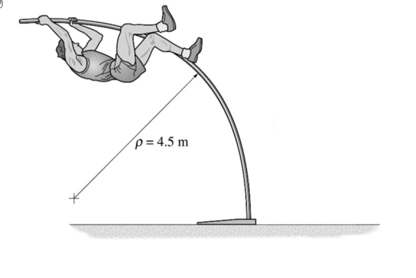

# 考題編號：MM-2024-2

**主分類：** `MM-U2-2` 梁桿件斷面應力計算
**分析法：** 彈性分析
**標籤：** `曲率半徑` `撓曲應變` `彎曲應力` `σ=Ec/ρ` `圓形斷面` `撐竿跳`

---

## 1. 原始題目重述 (Problem Restatement)

如圖所示為一個人撐竿跳的情形，經量測得竿子彎曲的**最小曲率半徑** $\rho = 4.5$ m。圓竿直徑 $d = 45$ mm，由 $E_g = 130$ GPa 的玻璃纖維製成。試求竿子中**最大的彎曲應力**。（20 分）

*圖說：撐竿跳竿彎成弧形，量測最小曲率半徑 ρ=4.5 m（曲率最大處）。圓竿直徑 45 mm，玻璃纖維 E=130 GPa。*

---

## 2. 考題核心精神與出題者意圖 (Core Concepts & Examiner's Intent)

本題考**撓曲變形的幾何本質**：彎曲應變直接來自曲率，$\varepsilon = y/\rho$——不需要知道力與彎矩。出題者的意圖：

- 測驗考生是否理解 $\sigma = My/I$ 的「上游」：$\varepsilon = y/\rho$ 是運動學（幾何）事實，$\sigma = E\varepsilon$ 才把材料帶進來，$M = EI/\rho$ 只是其合成結果。三者關係：$\frac{1}{\rho} = \frac{M}{EI} \Leftrightarrow \sigma = \frac{Ec}{\rho} = \frac{Mc}{I}$；
- **最小 ρ ⇔ 最大曲率 ⇔ 最大應力**：題目給「最小半徑」就是指最危險斷面；
- 計算極短，重點在觀念清晰與單位一致——典型的「快攻題」，務求 3 分鐘內拿滿。

---

## 3. 解題戰略地圖與陷阱分析 (Strategic Roadmap & Trap Analysis)

**作戰計畫：**

1. 最外緣纖維距離 $c = d/2 = 22.5$ mm；
2. 最大撓曲應變 $\varepsilon_{max} = c/\rho$；
3. 虎克定律 $\sigma_{max} = E\,\varepsilon_{max} = Ec/\rho$。

**關鍵陷阱：**

| # | 陷阱 | 應對策略 |
|---|------|---------|
| 1 | 用直徑 $d$ 代替 $c$（差兩倍） | $c$ = 中性軸到外緣 = $d/2$ |
| 2 | 單位混用：ρ 用 m、c 用 mm | 統一 mm：ρ = 4500 mm |
| 3 | 繞道求 M 再算 σ = Mc/I | 不必要——曲率已知時 $\sigma = Ec/\rho$ 一步到位 |
| 4 | 誤以為缺少載重條件無法解 | 應變是純幾何量，與載重無關 |

---

## 3.5 變數層次分析（Variable Hierarchy Analysis）

> 複習提示：第一次解題後，在每個卡住的知識點旁標記 `⚠`；第二次複習時只看有 `⚠` 的項目。

### 最終目標
`求竿中最大彎曲應力 σmax`

### 本題關鍵公式（依計算順序）

> $\boxed{\cdot}$ = 需由前步驟推導，非題目直接給定的變數

$$\text{Step 1: } c = \frac{d}{2}$$

$$\text{Step 2: } \varepsilon_{max} = \frac{\boxed{c}}{\rho}$$

$$\text{Step 3: } \sigma_{max} = E\,\boxed{\varepsilon_{max}} = \frac{E\,\boxed{c}}{\rho}$$

### L1：題目直接給定

| 符號 | 數值 | 說明 |
|------|------|------|
| $\rho$ | 4.5 m = 4500 mm | 最小曲率半徑 |
| $d$ | 45 mm | 圓竿直徑 |
| $E$ | 130 GPa = 130000 MPa | 玻璃纖維彈性模數 |

### L2：需知識點推導

| 符號 | 公式/來源 | 卡關? |
|------|----------|:-----:|
| $c$ | $d/2 = 22.5$ mm | |
| $\varepsilon_{max}$ | $c/\rho$（撓曲應變幾何關係） | |
| $\sigma_{max}$ | $E\varepsilon_{max} = Ec/\rho$ | |

### L3：深層知識（不懂就卡住）

| 知識點 | 說明 | 卡關? |
|--------|------|:-----:|
| 撓曲應變的幾何來源 | 平面保持平面 ⇒ $\varepsilon = y/\rho$，與材料、載重無關 | |
| 曲率—彎矩—應力三角關係 | $1/\rho = M/EI$；$\sigma = Ec/\rho = Mc/I$ 兩條路等價 | |
| 最小 ρ = 最大曲率 | 曲率 $\kappa = 1/\rho$，半徑最小處彎得最劇烈、應力最大 | |

---

## 4. 步驟化詳細計算過程 (Step-by-Step Detailed Calculation)

### Step 1：外緣纖維距離

$$c = \frac{d}{2} = \frac{45}{2} = 22.5\ \text{mm}$$

### Step 2：最大撓曲應變（純幾何）

$$\varepsilon_{max} = \frac{c}{\rho} = \frac{22.5}{4500} = 5.0 \times 10^{-3}$$

### Step 3：最大彎曲應力（虎克定律）

$$\sigma_{max} = E\,\varepsilon_{max} = 130000 \times 5.0\times10^{-3}$$

$$\boxed{\sigma_{max} = 650\ \text{MPa}\quad\text{（凸面受拉、凹面受壓，發生於最小曲率半徑處之外緣纖維）}}$$

> **策略註解：** 等價驗算（繞 M 路徑）：$I = \pi d^4/64 = 2.013\times10^5$ mm⁴，$M = EI/\rho = 130000 \times 2.013\times10^5 / 4500 = 5.816\times10^6$ N·mm，$\sigma = Mc/I = 5.816\times10^6 \times 22.5 / 2.013\times10^5 = 650$ MPa ✓ 兩路一致。

---

## 5. 關鍵爭議點與進階探討 (Critical Issues & Advanced Discussion)

1. **650 MPa 合理嗎？** 一般結構鋼早已降伏，但玻璃纖維複合材（GFRP）抗拉強度可達 1000 MPa 以上且彈性應變範圍大（本題 ε = 0.5%），撐竿正是利用其高強度、低模數、大彈性儲能的特性——數字合理，也順帶說明為何撐竿不用鋼管。

2. **應變 0.005 的意義**：彈性應變能密度 $u = \sigma^2/2E = 650^2/(2\times130000) = 1.625$ MPa（= N·mm/mm³），全竿儲能在起跳瞬間轉換為人體位能——能量法（MM-U3）的實體應用場景。

3. **此題型變化**：常見延伸是「給 σy 反問可彎的最小半徑 $\rho_{min} = Ec/\sigma_y$」或「比較不同直徑/材料的可彎性」——公式同一條，方向相反。
