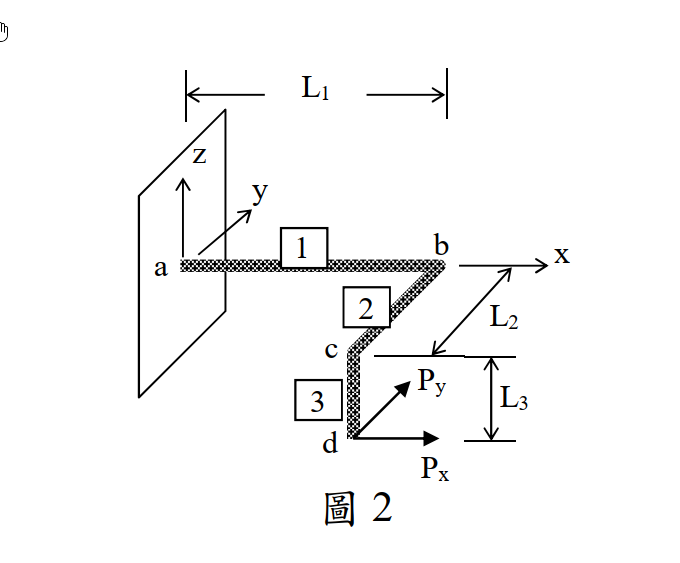

# 考題編號：MM-2025-2

**主分類：** `MM-U2-2` 梁桿件斷面應力計算
**副分類：** `MM-U2-3` 扭力桿件斷面應力計算
**分析法：** 彈性分析
**標籤：** `三維曲臂梁` `自由體圖` `彎扭組合` `組合應力` `撓曲公式` `圓形斷面` `最大法向應變`

---

## 1. 原始題目重述 (Problem Restatement)

一曲臂懸臂梁如圖 2 所示。節點以英文字母 a、b、c、d 編號，梁以數字 1、2、3 編號：

- 梁 1：a → b，沿 $+x$ 方向，$L_1 = 1000$ mm（a 端固定於牆）
- 梁 2：b → c，沿 $-y$ 方向，$L_2 = 500$ mm
- 梁 3：c → d，沿 $-z$ 方向（垂直向下），$L_3 = 250$ mm

斷面為均勻實心圓，半徑 $r = 10$ mm。材料為結構鋼：$E = 200000$ MPa、$\nu = 0.25$、$G = 80000$ MPa。

自由端 d 施加集中力：$P_x = 120$ N（$+x$ 向）、$P_y = 100$ N（$+y$ 向）。

要求：

1. 繪出三段梁之自由體圖（清楚標示點位、受力大小與方向）；
2. 計算整個曲梁之最大法向應力 $\sigma_{max}$ 與最大法向應變 $\varepsilon_{max}$，並指明其發生之點位。

梁自重與端點接頭效應可忽略不計。（25 分）



*圖說：a 點固定於牆（x=0），梁 1 沿 x 軸至 b(1000,0,0)；梁 2 自 b 沿 −y 至 c(1000,−500,0)；梁 3 自 c 垂直向下（−z）至 d(1000,−500,−250)。自由端 d 受 Px=120 N（+x）與 Py=100 N（+y）。斷面實心圓 r=10 mm，E=200 GPa、ν=0.25、G=80 GPa。*

---

## 2. 考題核心精神與出題者意圖 (Core Concepts & Examiner's Intent)

本題核心是**三維空間中內力的傳遞與分解**：同一組外力 $(P_x, P_y)$，傳到不同方位的桿段時，會分別扮演「軸力、剪力、彎矩、扭矩」不同角色——對沿 $x$ 的梁 1，$M_x$ 是扭矩；對沿 $y$ 的梁 2，$M_y$ 才是扭矩。出題者要測驗的能力：

- **力系等效平移**：$\vec{M} = \vec{r} \times \vec{P}$，把自由端力換算到任意斷面；
- **內力六分量的角色判別**（軸力 N、雙向剪力 V、扭矩 T、雙向彎矩 M）依桿軸方向而變；
- **雙向彎矩合成**：圓形斷面任何直徑都是主軸，$M_b = \sqrt{M_{b1}^2 + M_{b2}^2}$ 可直接向量合成；
- **危險斷面判斷**：彎矩沿固定端方向累積，最大應力在牆面 a；
- **應力 → 應變的觀念**：表面點為「單軸正向應力 + 扭轉剪應力」狀態，$\varepsilon_{max} = \sigma_{max}/E$（剪應力不產生正向應變）。題目特意給 $\nu$ 與 $G$，測驗考生是否清楚哪些常數真正用得到。

---

## 3. 解題戰略地圖與陷阱分析 (Strategic Roadmap & Trap Analysis)

**作戰計畫：**

1. 建座標：$a=(0,0,0)$、$b=(1000,0,0)$、$c=(1000,-500,0)$、$d=(1000,-500,-250)$，$\vec{P}=(120,100,0)$ N。
2. 由 d 往 a 逐段切：每段端點內力 = 力 $\vec{P}$ 平移 + 力矩 $\vec{M}=\vec{r}_{\text{切點}\to d}\times\vec{P}$。
3. 依各段桿軸，把 $\vec{M}$ 分解成「扭矩（沿桿軸分量）+ 彎矩（垂直桿軸分量）」，繪三張自由體圖。
4. 比較各段彎矩極值 → 危險斷面在固定端 a。
5. $\sigma_{max} = M_b/S + N/A$；$\varepsilon_{max} = \sigma_{max}/E$。

**關鍵陷阱：**

| # | 陷阱 | 應對策略 |
|---|------|---------|
| 1 | **扭矩/彎矩角色混淆**：$M_y = 30000$ 對梁 2 是扭矩、對梁 1 是彎矩 | 每段先寫桿軸單位向量，$T = \vec{M}\cdot\hat{e}_{axis}$，其餘為彎矩 |
| 2 | **漏算力臂**：$P_x$ 對梁 1 同時產生 $M_y$（z 向力臂 250）與 $M_z$（y 向力臂 500） | 用 $\vec{r}\times\vec{P}$ 向量外積一次算全，不逐項心算 |
| 3 | **雙向彎矩未合成**：只用 $M_z$ 算應力會低估 | 圓斷面 $M_b=\sqrt{M_y^2+M_z^2}$ 直接合成 |
| 4 | **忽略軸力**：梁 1 還有 $N=120$ N 拉力 | $\sigma = M_b/S + N/A$（本題軸力項僅 0.4 MPa，但必須寫出以示完整） |
| 5 | **εmax 誤用 G 或 ν 亂套**：表面點僅 $\sigma_x$ 與 $\tau$，$\sigma_y=\sigma_z=0$ | 廣義虎克定律 $\varepsilon_x = [\sigma_x - \nu(0+0)]/E = \sigma_x/E$ |

---

## 3.5 變數層次分析（Variable Hierarchy Analysis）

> 複習提示：第一次解題後，在每個卡住的知識點旁標記 `⚠`；第二次複習時只看有 `⚠` 的項目。

### 最終目標
`繪三段梁 FBD；求全梁 σmax、εmax 及其發生點位`

### 本題關鍵公式（依計算順序）

> $\boxed{\cdot}$ = 需由前步驟推導，非題目直接給定的變數

$$\text{Step 1: } A = \pi r^2,\quad I = \frac{\pi r^4}{4},\quad S = \frac{I}{r},\quad J = 2I$$

$$\text{Step 2: } \vec{M}(\text{切點}) = \vec{r}_{\text{切點}\to d} \times \vec{P}$$

$$\text{Step 3: } T = \boxed{\vec{M}}\cdot\hat{e}_{axis},\qquad M_b = \sqrt{|\boxed{\vec{M}}|^2 - \boxed{T}^2}$$

$$\text{Step 4: } \sigma_{max} = \frac{\boxed{M_{b,max}}}{S} + \frac{N}{A}$$

$$\text{Step 5: } \varepsilon_{max} = \frac{\boxed{\sigma_{max}}}{E}$$

### L1：題目直接給定
_看到題目就能讀出的數字，不需要任何公式。_

| 符號 | 數值 | 說明 |
|------|------|------|
| $L_1, L_2, L_3$ | 1000、500、250 mm | 三段梁長 |
| $r$ | 10 mm | 實心圓斷面半徑 |
| $E$ | 200000 MPa | 彈性係數 |
| $\nu$ | 0.25 | 柏松比 |
| $G$ | 80000 MPa | 剪力模數 |
| $P_x, P_y$ | 120、100 N | 自由端集中力 |

### L2：需知識點推導
_需要知道公式名稱與適用條件，套入 L1 即可算出。_

**Step 1：斷面性質**

| 符號 | 公式/來源 | 卡關? |
|------|----------|:-----:|
| $A$ | $\pi r^2 = 314.16$ mm² | |
| $I$ | $\pi r^4/4 = 7854$ mm⁴ | |
| $S$ | $I/r = 785.4$ mm³ | |
| $J$ | $\pi r^4/2 = 15708$ mm⁴ | |

**Step 2–3：內力分解**

| 符號 | 公式/來源 | 卡關? |
|------|----------|:-----:|
| $\vec{M}$ | $\vec{r}\times\vec{P}$（外積） | |
| $T$、$M_b$ | 沿桿軸投影為扭矩，垂直分量合成彎矩 | |

**Step 4–5：應力應變**

| 符號 | 公式/來源 | 卡關? |
|------|----------|:-----:|
| $\sigma_{max}$ | $M_b/S + N/A$（撓曲＋軸力疊加） | |
| $\varepsilon_{max}$ | $\sigma_{max}/E$（單軸虎克定律） | |

### L3：深層知識（不懂就卡住）

| 知識點 | 說明 | 卡關? |
|--------|------|:-----:|
| 內力角色隨桿軸而變 | 同一力矩分量，沿桿軸＝扭矩、垂直桿軸＝彎矩 | |
| 圓斷面雙向彎矩可直接合成 | 任意直徑皆主軸（$I$ 各向同性），$M_b=\sqrt{M_1^2+M_2^2}$；矩形斷面不可如此 | |
| 剪應力不產生正向應變 | $\varepsilon_x$ 只由 $\sigma$ 決定（廣義虎克定律），扭轉 $\tau$ 不影響 $\varepsilon_x$ | |
| 危險點方位 | 最大拉應力在「合成彎矩向量垂直方向」的外緣纖維 | |

---

## 4. 步驟化詳細計算過程 (Step-by-Step Detailed Calculation)

### Step 0：座標與斷面性質

$$a=(0,0,0),\quad b=(1000,0,0),\quad c=(1000,-500,0),\quad d=(1000,-500,-250)\ \text{mm}$$

$$\vec{P} = (120,\ 100,\ 0)\ \text{N（作用於 d）}$$

$$A = \pi r^2 = 314.16\ \text{mm}^2,\quad I = \frac{\pi r^4}{4} = 7854\ \text{mm}^4,\quad S = \frac{I}{r} = 785.4\ \text{mm}^3,\quad J = 2I = 15708\ \text{mm}^4$$

### Step 1：各關鍵斷面之力矩（$\vec{M} = \vec{r}_{\text{切點}\to d} \times \vec{P}$）

| 切點 | $\vec{r}_{\to d}$ (mm) | $\vec{M} = \vec{r}\times\vec{P}$ (N·mm) |
|------|------------------------|------------------------------------------|
| c | $(0,\ 0,\ -250)$ | $(25000,\ -30000,\ 0)$ |
| b | $(0,\ -500,\ -250)$ | $(25000,\ -30000,\ 60000)$ |
| a | $(1000,\ -500,\ -250)$ | $(25000,\ -30000,\ 160000)$ |

> **策略註解：** 外積展開（以 a 為例）：$M_x = r_y P_z - r_z P_y = 0-(-250)(100) = 25000$；$M_y = r_z P_x - r_x P_z = (-250)(120) - 0 = -30000$；$M_z = r_x P_y - r_y P_x = (1000)(100)-(-500)(120) = 160000$。物理對應：$M_x$＝$P_y$ 乘 z 向力臂 250；$M_y$＝$P_x$ 乘 z 向力臂 250；$M_z$＝$P_y$ 乘力臂 $L_1$ 加 $P_x$ 乘 y 向力臂 500。

### Step 2：三段梁自由體圖（FBD）

**梁 3（c–d，桿軸 $\hat{e}=-\hat{z}$，長 250）**

```
        d 端：Px=120(+x)、Py=100(+y)
        c 端（平衡）：力 120(−x)、100(−y)；力矩 25000(−x 向)、30000(+y 向)
```

| 內力 | 數值 | 角色 |
|------|------|------|
| 軸力 N | 0（$P_z=0$） | — |
| 剪力 V | $\sqrt{120^2+100^2} = 156.2$ N | $V_x=120$、$V_y=100$ |
| 扭矩 T（沿 z） | 0 | — |
| 彎矩 $M_b$（c 端） | $\sqrt{25000^2+30000^2} = 39051$ N·mm | $M_x=25000$、$M_y=30000$ 合成 |

**梁 2（b–c，桿軸 $\hat{e}=+\hat{y}$，長 500）**

```
        c 端：承接梁3傳來之力 (120,100,0) 與力矩 (25000,−30000,0)
        b 端（平衡）：力 (−120,−100,0)；力矩 (−25000,30000,−60000)
```

| 內力 | 數值 | 角色 |
|------|------|------|
| 軸力 N | 100 N（拉力，$P_y$ 沿桿軸） | |
| 剪力 V | 120 N（x 向） | |
| **扭矩 T（沿 y）** | $|M_y| = 30000$ N·mm（全段定值） | $P_x$ × z 力臂 250 |
| 彎矩（c 端） | $M_x = 25000$ N·mm | |
| 彎矩（b 端） | $\sqrt{25000^2 + 60000^2} = 65000$ N·mm | $M_x=25000$、$M_z=60000$ 合成 |

**梁 1（a–b，桿軸 $\hat{e}=+\hat{x}$，長 1000）**

```
        b 端：承接梁2傳來之力 (120,100,0) 與力矩 (25000,−30000,60000)
        a 端（牆反力）：力 (−120,−100,0)；力矩 (−25000,30000,−160000)
```

| 內力 | 數值 | 角色 |
|------|------|------|
| 軸力 N | 120 N（拉力，$P_x$ 沿桿軸） | |
| 剪力 V | 100 N（y 向） | |
| **扭矩 T（沿 x）** | $|M_x| = 25000$ N·mm（全段定值） | $P_y$ × z 力臂 250 |
| 彎矩 $M_y$ | $-30000$ N·mm（全段定值） | $P_x$ × z 力臂 250 |
| 彎矩 $M_z(x)$ | $100(1000-x) + 60000$ | b 端 60000 → **a 端 160000**（線性增加） |

### Step 3：危險斷面與最大彎矩

各段彎矩極值比較：

| 位置 | 合成彎矩 $M_b$ (N·mm) |
|------|----------------------|
| c（梁 3 頂） | 39,051 |
| b（梁 2 端） | 65,000 |
| **a（固定端）** | $\sqrt{30000^2 + 160000^2} = \mathbf{162{,}788}$ |

危險斷面在**固定端 a**，該處內力：$M_b = 162788$ N·mm、$T = 25000$ N·mm、$N = 120$ N（拉）。

### Step 4：最大法向應力

$$\sigma_{max} = \frac{M_b}{S} + \frac{N}{A} = \frac{162788}{785.4} + \frac{120}{314.16} = 207.3 + 0.4$$

$$\boxed{\sigma_{max} \approx 207.7\ \text{MPa（拉應力）}}$$

**發生點位**：固定端斷面 a 之外緣纖維。合成彎矩向量 $\vec{M}_b = (0, -30000, 160000)$，最大拉應力點位於垂直於 $\vec{M}_b$ 方向之圓周上，即自斷面中心朝 $(y,z) = (-160000, -30000)/162788 \times r \approx (-9.83, -1.84)$ mm 處——**朝 $-y$ 側（c、d 所在側）、略偏 $-z$（下方）之外緣點**。

> **策略註解：** 方向檢核——$P_y$ 上拉 + $P_x$ 經 500 力臂之 $M_z$ 同向疊加，懸臂固定端在載重之「背側」（$-y$）受拉，符合直觀。

### Step 5：最大法向應變

危險點為梁表面點，應力狀態：$\sigma_x = 207.7$ MPa、$\sigma_y = \sigma_z = 0$（另有扭轉剪應力 $\tau = Tr/J = 25000\times10/15708 = 15.9$ MPa，不影響正向應變）。由廣義虎克定律：

$$\varepsilon_{max} = \frac{\sigma_x - \nu(\sigma_y + \sigma_z)}{E} = \frac{207.7}{200000}$$

$$\boxed{\varepsilon_{max} \approx 1.038 \times 10^{-3} = 1038\ \mu\varepsilon\quad\text{（與 } \sigma_{max} \text{ 同點位：固定端 a 之 } -y \text{ 側外緣）}}$$

---

## 5. 關鍵爭議點與進階探討 (Critical Issues & Advanced Discussion)

1. **「最大法向應變」是否需考慮主應變？** 危險點同時存在 $\tau = 15.9$ MPa 扭轉剪應力。若以「該點任意方向之最大正向應變（主應變）」解讀：$\sigma_{1,3} = \frac{\sigma}{2} \pm \sqrt{(\frac{\sigma}{2})^2 + \tau^2} = 208.9, -1.2$ MPa，$\varepsilon_1 = [\sigma_1 - \nu\sigma_3]/E = [208.9 + 0.25(1.2)]/200000 = 1.046\times10^{-3}$，僅比 $\sigma_x/E$ 大約 0.8%。**考場建議**：主答 $\varepsilon = \sigma_{max}/E = 1.038\times10^{-3}$（題目「法向」對應桿軸方向之撓曲應變），並附註主應變值，兩者皆寫可確保得分。

2. **剪力之直接剪應力**：橫向剪力產生之 $\tau_{max} = \frac{4V}{3A} = \frac{4(156.2)}{3(314.16)} \approx 0.66$ MPa，發生在中性軸（與彎曲應力極值點不同位置），對 $\sigma_{max}$ 無貢獻，可忽略——但解析中應說明「為何可忽略」而非隻字不提。

3. **FBD 的表達**：閱卷重點在「每段兩端的力與力矩成對平衡、扭矩與彎矩角色標示正確」。建議每段旁標註桿軸方向，扭矩用雙箭頭（右手定則）沿桿軸畫，彎矩雙箭頭垂直桿軸，並標數值（25000、30000、60000、160000 N·mm）。

4. **為何 $G$ 用不到？** 本題只問應力與應變，未問自由端變位。若加問變位，才需用 $G$（扭轉角 $TL/GJ$ 貢獻變位）與卡氏定理或單位力法——這是本題型最常見的延伸考法（參見能量法 MM-U3 題型）。
