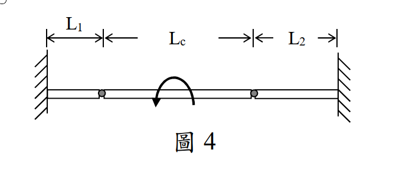

# 考題編號：MM-2025-4

**主分類：** `MM-U3-2` 梁桿件變位及內力分析
**分析法：** 彈性分析
**標籤：** `鉸接組合梁` `靜定判斷` `剪力圖` `彎矩圖` `集中力偶跳躍` `懸臂端沉陷疊加` `單位力法`

---

## 1. 原始題目重述 (Problem Restatement)

一水平鋼梁由一中間梁與兩側之短懸臂組成，三者以**鉸**連接，且具有相同之矩形斷面：

- 斷面：梁寬 $b = 100$ mm、梁深 $h = 400$ mm；
- 長度（由左至右）：左懸臂 $L_1 = 800$ mm、中間梁 $L_c = 2000$ mm、右懸臂 $L_2 = 1000$ mm（兩懸臂外端均固定於牆）；
- 材料：$E = 200000$ MPa；
- 載重：於**中間梁跨中央**施加集中彎矩 $M = 2\times10^7$ N·mm（依圖示方向，本解取**逆時針**；若為順時針則所有方向相反、量值不變）。

要求：

1. 繪出**全梁**（中間梁＋兩側短懸臂）之剪力圖與彎矩圖；
2. 計算施加集中彎矩處之**梁位移量**與**傾斜角**。

軸向變形與梁自重皆可忽略。（25 分）

*圖說：左牆固定端→懸臂 L₁=800 mm→鉸 g₁→中間梁 L꜀=2000 mm（跨中央受集中彎矩 M=2×10⁷ N·mm）→鉸 g₂→懸臂 L₂=1000 mm→右牆固定端。斷面 b×h = 100×400 mm，E=200 GPa。全長 3800 mm。*

---

## 2. 考題核心精神與出題者意圖 (Core Concepts & Examiner's Intent)

本題考「**鉸接組合梁（Gerber 梁）**」的完整分析流程，三個核心觀念：

- **靜定性的判斷**：兩固定端看似超靜定，但忽略軸力後每固定端僅 2 個反力（V、M），共 4 個未知數；整體平衡 2 式 + 兩鉸彎矩為零 2 式 = 4 式 ⇒ **靜定**。出題者刻意用「鉸」把超靜定問題化為靜定，考的是結構觀念而非解超靜定的計算量。
- **集中力偶的內力圖特徵**：剪力圖不受力偶影響（本題全梁 V 恆為定值），彎矩圖在力偶作用點產生**等量跳躍**——這是內力圖觀念的經典測驗點。
- **變位的兩層疊加**：中間梁的支承（鉸）本身是「會沉陷的支承」（懸臂端撓度），總變位 = **支承沉陷的剛體內插** + **簡支梁本身的撓曲變形**。跨中央受力偶的簡支梁，因反對稱性跨中撓度為零——沒看出這點的考生會做大量白工。

---

## 3. 解題戰略地圖與陷阱分析 (Strategic Roadmap & Trap Analysis)

**作戰計畫：**

1. 拆解：中間梁＝以兩鉸為支承的簡支梁；兩懸臂＝承受鉸傳來集中力的懸臂梁。
2. 中間梁平衡：跨中力偶 → 鉸反力成偶 $R = M/L_c$（一上一下）。
3. 鉸力傳遞至懸臂端（作用力與反作用力），求牆反力。
4. 繪全梁 SFD（定值）與 BMD（線性段 + 力偶處跳躍，鉸處必為零）。
5. 變位：懸臂端撓度 $PL^3/3EI$ → 支承沉陷；簡支梁中央力偶 → 跨中撓度 0、轉角 $ML_c/12EI$；兩層疊加。

**關鍵陷阱：**

| # | 陷阱 | 應對策略 |
|---|------|---------|
| 1 | **誤判為超靜定**而企圖用諧和條件硬解 | 忽略軸力後未知反力 4 個＝方程式 4 個，靜定；鉸處 M=0 是免費的方程式 |
| 2 | **力偶反力方向搞反**：簡支梁受逆時針力偶，左支承反力向上、右支承向下 | 用 ΣM=0 對一端取矩驗證：$R = M/L_c = 10$ kN 成偶 |
| 3 | **彎矩跳躍方向**：力偶處 BMD 跳 $-M$ 還是 $+M$？ | 以「鉸處 M 必為零」雙端檢核：左段升至 $+10^7$，跳至 $-10^7$，再升回 0 ✓ |
| 4 | **忘記支承沉陷**：只算簡支梁本身變位（得 0）就交卷 | 鉸支承＝懸臂自由端，會沉陷！總變位需剛體內插疊加 |
| 5 | **單位失控**：N·mm 與 kN·m 混用 | 全程 N、mm（EI = 1.0667×10¹⁴ N·mm²） |

---

## 3.5 變數層次分析（Variable Hierarchy Analysis）

> 複習提示：第一次解題後，在每個卡住的知識點旁標記 `⚠`；第二次複習時只看有 `⚠` 的項目。

### 最終目標
`繪全梁 SFD/BMD；求集中彎矩作用點之位移 δ 與傾斜角 θ`

### 本題關鍵公式（依計算順序）

> $\boxed{\cdot}$ = 需由前步驟推導，非題目直接給定的變數

$$\text{Step 1: } I = \frac{bh^3}{12},\qquad EI$$

$$\text{Step 2: } R = \frac{M}{L_c}\quad\text{（中間梁鉸反力，成偶）}$$

$$\text{Step 3: } V(x) = \boxed{R}\ \text{（全梁定值）};\quad M(x)\ \text{線性，力偶處跳躍 } -M\text{，鉸處為零}$$

$$\text{Step 4: } \delta_1 = \frac{\boxed{R}L_1^3}{3EI}\ (\downarrow),\qquad \delta_2 = \frac{\boxed{R}L_2^3}{3EI}\ (\uparrow)\quad\text{（懸臂端沉陷）}$$

$$\text{Step 5: } \delta_{mid} = \frac{-\boxed{\delta_1} + \boxed{\delta_2}}{2},\qquad \theta_{chord} = \frac{\boxed{\delta_2} + \boxed{\delta_1}}{L_c}$$

$$\text{Step 6: } \theta_{flex} = \frac{M L_c}{12\,EI},\qquad \theta = \boxed{\theta_{chord}} + \boxed{\theta_{flex}},\quad \delta = \boxed{\delta_{mid}} + 0$$

### L1：題目直接給定
_看到題目就能讀出的數字，不需要任何公式。_

| 符號 | 數值 | 說明 |
|------|------|------|
| $b, h$ | 100、400 mm | 矩形斷面 |
| $L_1, L_c, L_2$ | 800、2000、1000 mm | 左懸臂、中間梁、右懸臂 |
| $E$ | 200000 MPa | 彈性係數 |
| $M$ | $2\times10^7$ N·mm | 跨中集中彎矩（取逆時針） |

### L2：需知識點推導
_需要知道公式名稱與適用條件，套入 L1 即可算出。_

**Step 1–2：斷面性質與反力**

| 符號 | 公式/來源 | 卡關? |
|------|----------|:-----:|
| $I$ | $bh^3/12 = 5.333\times10^8$ mm⁴ | |
| $R$ | $M/L_c$（力偶 ÷ 跨度） | |

**Step 3：內力圖**

| 符號 | 公式/來源 | 卡關? |
|------|----------|:-----:|
| $V(x)$ | 剪力不受力偶影響，全梁定值 | |
| $M(x)$ | $dM/dx = V$；力偶處跳 $-M$；鉸處 $M=0$ | |

**Step 4–6：變位**

| 符號 | 公式/來源 | 卡關? |
|------|----------|:-----:|
| $\delta_1, \delta_2$ | 懸臂端集中力 $PL^3/3EI$ | |
| $\theta_{flex}$ | 簡支梁中央力偶之中點轉角 $ML/12EI$（單位力法導出） | |
| $\delta, \theta$ | 支承沉陷剛體內插 + 撓曲變形疊加 | |

### L3：深層知識（不懂就卡住）

| 知識點 | 說明 | 卡關? |
|--------|------|:-----:|
| 鉸接組合梁靜定性 | 忽略軸力：固定端各 2 反力，鉸提供 M=0 條件 ⇒ 4 未知 4 方程式 | |
| 反對稱性 ⇒ 跨中撓度為零 | 中央力偶之 BMD 反對稱 ⇒ 曲率反對稱 ⇒ 撓度曲線反對稱 ⇒ $v(L_c/2)=0$ | |
| 「會沉陷的支承」 | 鉸支承位移＝懸臂端撓度；剛體內插（線性）分配到跨中 | |
| 剪力通過鉸連續 | 鉸只釋放彎矩，不釋放剪力 ⇒ 全梁 V 連續 | |

---

## 4. 步驟化詳細計算過程 (Step-by-Step Detailed Calculation)

> 📊 互動圖：`MM-2025-4-sfd-bmd-viz.html`（全梁 SFD/BMD 與撓度示意）

### Step 0：斷面性質與靜定性確認

$$I = \frac{bh^3}{12} = \frac{100 \times 400^3}{12} = 5.333\times10^8\ \text{mm}^4,\qquad EI = 200000 \times 5.333\times10^8 = 1.0667\times10^{14}\ \text{N·mm}^2$$

靜定性（忽略軸力）：未知反力 = 左牆 $(V_A, M_A)$ + 右牆 $(V_B, M_B)$ = 4；方程式 = 整體 $\Sigma F_y, \Sigma M$ 2 式 + 鉸 $g_1$、$g_2$ 彎矩為零 2 式 = 4 ⇒ **靜定結構**。

全梁座標：$x = 0$（左牆）→ $x=800$（鉸 $g_1$）→ $x=1800$（跨中力偶）→ $x=2800$（鉸 $g_2$）→ $x=3800$（右牆）。

### Step 1：中間梁分析（簡支於兩鉸）

中間梁 $g_1$–$g_2$（跨度 2000）僅受跨中逆時針力偶 $M = 2\times10^7$：

$$\Sigma M_{g_1} = 0:\quad R_{g_2}(2000) + 2\times10^7 = 0 \;\Rightarrow\; R_{g_2} = -10000\ \text{N（向下）}$$

$$\Sigma F_y = 0:\quad R_{g_1} = +10000\ \text{N（向上）}$$

$$\boxed{R = \frac{M}{L_c} = \frac{2\times10^7}{2000} = 10\ \text{kN（左鉸向上、右鉸向下，成偶）}}$$

### Step 2：鉸力傳遞與牆反力（自由體圖）

作用力與反作用力：

- **左懸臂**（牆 A–$g_1$）：鉸端受**向下** 10 kN（中間梁的反作用）。牆 A 反力：$V_A = 10$ kN ↑、固端彎矩 $M_A = 10000\times800 = 8\times10^6$ N·mm（逆時針作用於梁）。
- **右懸臂**（$g_2$–牆 B）：鉸端受**向上** 10 kN。牆 B 反力：$V_B = 10$ kN ↓、固端彎矩 $M_B = 10000\times1000 = 1\times10^7$ N·mm（逆時針作用於梁）。

整體檢核：$\Sigma F_y = 10 - 10 = 0$ ✓；$\Sigma M_{x=0} = -10000(3800) + 2\times10^7 + 8\times10^6 + 1\times10^7 = 0$ ✓

### Step 3：剪力圖（SFD）

鉸只釋放彎矩、剪力連續；力偶不影響剪力：

$$\boxed{V(x) = +10\ \text{kN（全梁 } 0 \le x \le 3800 \text{ 定值）}}$$

### Step 4：彎矩圖（BMD，sagging 為正）

斜率 $dM/dx = V = +10$ kN 全梁一致；力偶處向下跳躍 $M$；鉸處為零：

| 位置 $x$ (mm) | 彎矩 (N·mm) | 說明 |
|--------------|-------------|------|
| 0（左牆） | $-8\times10^6$ | 固定端（上緣受拉） |
| 800（鉸 $g_1$） | 0 | 鉸 ✓ |
| 1800⁻（力偶左） | $+1\times10^7$ | 線性上升（下緣受拉） |
| 1800⁺（力偶右） | $-1\times10^7$ | **跳躍 $-2\times10^7$** |
| 2800（鉸 $g_2$） | 0 | 鉸 ✓ |
| 3800（右牆） | $+1\times10^7$ | 固定端（下緣受拉） |

$$\boxed{\text{BMD：五個控制值 } -8\times10^6 \to 0 \to +10^7 \;\big\downarrow\; -10^7 \to 0 \to +10^7\ \text{N·mm，全程斜率 } +10^4\ \text{N}}$$

> **策略註解：** 雙重檢核——①兩鉸處 M = 0 ✓；②跳躍量恰為施加力偶 $2\times10^7$ ✓。最大彎矩量值 $1\times10^7$ N·mm 出現於力偶兩側與右牆。

### Step 5：支承（鉸）沉陷——懸臂端撓度

$$\delta_1 = \frac{R L_1^3}{3EI} = \frac{10000 \times 800^3}{3 \times 1.0667\times10^{14}} = \frac{5.12\times10^{12}}{3.2\times10^{14}} = 0.0160\ \text{mm}\ (\downarrow,\ g_1\text{ 沉降})$$

$$\delta_2 = \frac{R L_2^3}{3EI} = \frac{10000 \times 1000^3}{3.2\times10^{14}} = 0.03125\ \text{mm}\ (\uparrow,\ g_2\text{ 上抬})$$

### Step 6：力偶作用點之位移與傾斜角（兩層疊加）

**(a) 支承沉陷之剛體內插（跨中點）**：

$$\delta_{chord} = \frac{(-0.0160) + (+0.03125)}{2} = +0.007625\ \text{mm}\ (\uparrow)$$

$$\theta_{chord} = \frac{(+0.03125) - (-0.0160)}{2000} = \frac{0.04725}{2000} = 2.3625\times10^{-5}\ \text{rad（逆時針）}$$

**(b) 簡支梁本身撓曲（跨中央力偶）**：

BMD 反對稱 ⇒ 撓度曲線反對稱 ⇒ **跨中撓度為零**；跨中轉角（單位力法，推導見方法論）：

$$\theta_{flex} = \frac{M L_c}{12EI} = \frac{2\times10^7 \times 2000}{12 \times 1.0667\times10^{14}} = \frac{4\times10^{10}}{1.28\times10^{15}} = 3.125\times10^{-5}\ \text{rad（逆時針，與 } M \text{ 同向）}$$

**(c) 疊加**：

$$\boxed{\delta = 0.007625 + 0 \approx 0.0076\ \text{mm（向上）}}$$

$$\boxed{\theta = 2.3625\times10^{-5} + 3.125\times10^{-5} = 5.4875\times10^{-5} \approx 5.49\times10^{-5}\ \text{rad（逆時針，與 } M \text{ 同向）}}$$

> **策略註解：** 位移之所以「向上」，是因右懸臂較長（1000 > 800）、沉陷量以三次方放大（$L^3$），右鉸上抬量壓過左鉸沉降量。若兩懸臂等長，剛體內插項的位移恰為零、僅餘轉角。

---

## 5. 關鍵爭議點與進階探討 (Critical Issues & Advanced Discussion)

1. **力偶方向的圖面判讀**：本解假設 $M$ 為逆時針（如圖示弧形箭頭）。若考場判讀為順時針，全部反力、內力圖與變位**方向相反、量值不變**。建議作答開頭一句「依圖示，本解取 M 為逆時針」，即可免除歧義風險。

2. **$\theta_{flex} = ML/12EI$ 不是背的**：考場若忘記，可用單位力法快速導出：$\theta_c = \int \frac{M(x)\,m(x)}{EI}dx$，實際 BMD 與單位力偶 BMD 同形（皆為 $\pm$ 線性反對稱），兩半段各積出 $ML/24EI$。或用共軛梁法：共軛梁承 $M/EI$ 反對稱載重，跨中「剪力」即實梁轉角。

3. **變形協調的觀念陷阱**：鉸只傳力不傳彎矩，因此**懸臂端轉角與中間梁端轉角不相等**（鉸兩側轉角可不連續）——千萬不要把懸臂端轉角加進中間梁的變位計算，只有**撓度（位移）**在鉸處連續。

4. **延伸思考**：若把兩鉸改為剛接，結構變為 2 度超靜定（忽略軸力），需以彎矩面積法或最小功法解；變位將大幅減小、牆端彎矩重分配。「同一幾何、不同接合」的對照是理解鉸接系統行為的好練習。

5. **應力檢核（非題目要求）**：$\sigma_{max} = M_{max}/S = 10^7/(bh^2/6) = 10^7/(2.667\times10^6) = 3.75$ MPa，遠低於鋼材降伏——本題幾何尺寸下變位極小（0.008 mm）合理。
