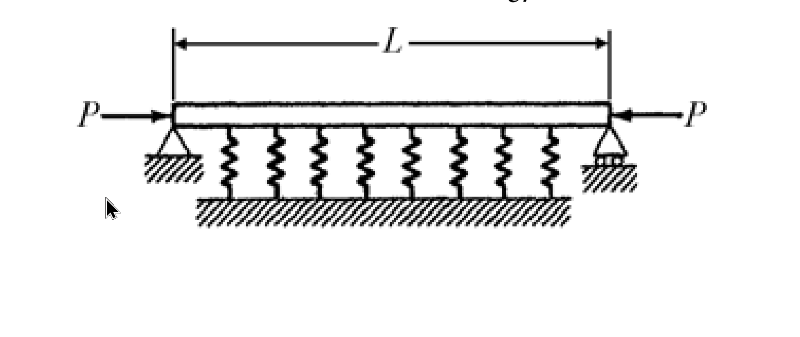

# MM-2005-5

**年份：** 2005（民國 94 年）第 5 題  
**主考點：** MM-U3-4（柱之挫屈載重分析）  
**副考點：** MM-U3-2（梁桿件變位及內力分析）  
**解析方法：** 彈性分析  
**標籤：** `彈性基礎` · `柱挫屈` · `臨界載重` · `控制微分方程式` · `邊界條件` · `歐拉公式`

---

## 解析來源

[原始解析](../../raw/solutions/MM-2005-5/MM-2005-5.md)

## 附圖

## 相關概念

> 概念連結在 ingest 時由解析內容自動萃取。

## 出現考點

| 考點 | 類型 |
|------|------|
| MM-U3-4（柱之挫屈載重分析）| 主考點 |
| MM-U3-2（梁桿件變位及內力分析）| 副考點 |

*本頁由 `ingest MM-2005-5` 自動生成。最後更新：2026-06-29*
