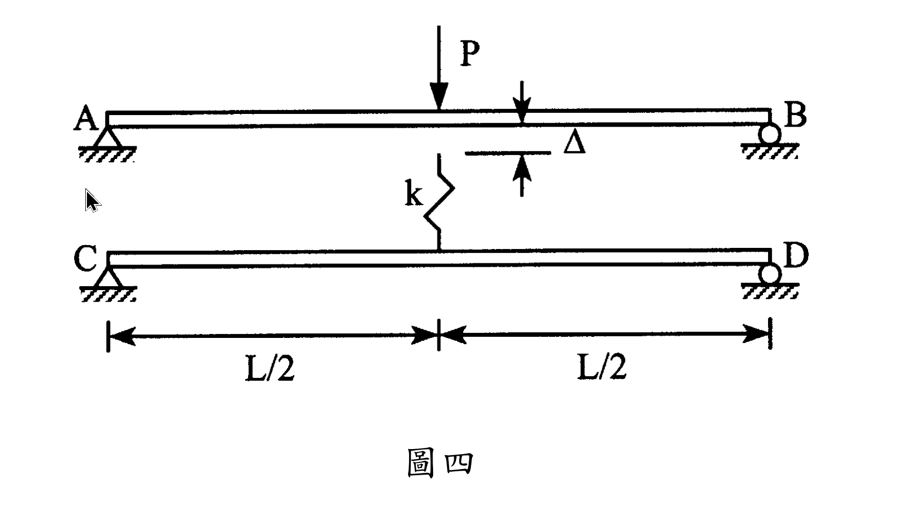

# MM-2007-4

**年份：** 2007（民國 96 年）第 4 題  
**主考點：** MM-U3-2（梁桿件變位及內力分析）  
**副考點：** 無  
**解析方法：** 彈性分析  
**標籤：** `靜不定梁` · `彈簧` · `間隙` · `撓度` · `疊加法` · `接觸問題` · `簡支樑` · `變形諧和` · `彈性支承`

---

## 解析來源

[原始解析](../../raw/solutions/MM-2007-4/MM-2007-4.md)

## 互動圖

- [sfd-bmd 互動圖](../../raw/solutions/MM-2007-4/MM-2007-4-sfd-bmd-viz.html)

## 附圖

## 相關概念

> 概念連結在 ingest 時由解析內容自動萃取。

## 出現考點

| 考點 | 類型 |
|------|------|
| MM-U3-2（梁桿件變位及內力分析）| 主考點 |

*本頁由 `ingest MM-2007-4` 自動生成。最後更新：2026-06-29*
